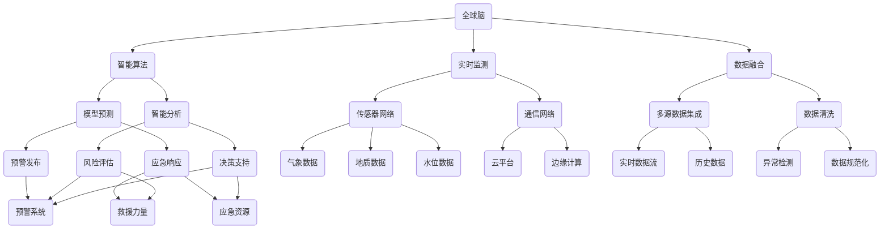

                 

关键词：全球脑、灾害预防、集体预警、人工智能、网络协同、智能算法、模型预测、实时监测、数据融合、应急响应

> 摘要：本文探讨了一种基于全球脑技术的灾害预防体系，通过集体预警的力量，实现实时监测、智能分析和快速响应，以提升灾害应急管理水平。文章从背景介绍、核心概念与联系、核心算法原理、数学模型和公式、项目实践、实际应用场景、工具和资源推荐以及总结未来发展趋势与挑战等方面进行深入探讨。

## 1. 背景介绍

灾害预防是当今全球面临的重大挑战之一。自然灾害如地震、洪水、台风等，以及人为灾害如火灾、恐怖袭击等，都对人类社会造成了巨大的损失。传统的灾害预防体系往往依赖于单点监测和预警系统，存在响应速度慢、覆盖范围有限、预警准确性不高等问题。随着人工智能、大数据和云计算等技术的发展，构建一个更加智能、高效的灾害预防体系成为了可能。

### 1.1 灾害预防的必要性

灾害预防的必要性不言而喻。首先，灾害预防可以最大限度地减少人员伤亡和财产损失，保护公共安全。其次，灾害预防有助于提高社会稳定性和经济发展，避免因灾害引发的社会动荡和经济衰退。最后，灾害预防是现代城市管理的重要组成部分，是构建智慧城市的基础。

### 1.2 传统的灾害预防体系

传统的灾害预防体系通常包括以下三个部分：

- **监测系统**：通过各类传感器和监测设备，实时收集环境数据，如气象参数、地质数据、水位数据等。
- **预警系统**：基于历史数据和统计模型，对监测到的数据进行处理和分析，发布预警信息。
- **应急响应系统**：在灾害发生时，组织救援力量，实施应急响应，包括疏散、救援、恢复等。

尽管传统的灾害预防体系在一定程度上能够发挥作用，但其局限性也是显而易见的：

- **响应速度慢**：传统预警系统往往需要一段时间来分析和处理数据，导致响应速度较慢。
- **覆盖范围有限**：单点监测系统无法全面覆盖整个灾害区域，可能导致预警信息滞后。
- **预警准确性不高**：依赖历史数据和统计模型，预警准确性受限于模型复杂度和数据质量。

## 2. 核心概念与联系

为了构建一个更加智能、高效的灾害预防体系，我们需要引入一些核心概念和架构，如图所示：



### 2.1 全球脑

全球脑（Global Brain）是一种基于互联网的分布式智能系统，通过将全球范围内的计算资源、数据资源和智能算法进行整合，实现大规模的数据处理和智能分析。在全球脑架构中，各个节点（如传感器、服务器、终端设备等）通过网络协同工作，形成一个高效的智能系统。

### 2.2 智能算法

智能算法是灾害预防体系中的核心组件，包括机器学习、深度学习、数据挖掘等。这些算法通过训练模型，可以从海量数据中提取有价值的信息，实现数据的智能分析和预测。

### 2.3 实时监测

实时监测是通过传感器网络和通信网络，实现对环境数据的实时采集和传输。实时监测系统的核心是传感器网络，其部署需要考虑覆盖范围、数据质量和成本等因素。

### 2.4 数据融合

数据融合是将来自不同来源、不同格式、不同时间的数据进行整合，以提供更全面、更准确的数据支持。数据融合技术包括多源数据集成、数据清洗、异常检测等。

### 2.5 模型预测

模型预测是通过机器学习和深度学习算法，对历史数据和实时数据进行训练和预测，以实现灾害预警和风险评估。模型预测的结果将用于指导应急响应和决策支持。

### 2.6 智能分析

智能分析是基于大数据和人工智能技术，对灾害预警、风险评估和应急响应进行综合分析和决策。智能分析系统可以为决策者提供实时、准确的决策支持。

## 3. 核心算法原理 & 具体操作步骤

### 3.1 算法原理概述

核心算法原理主要涉及机器学习、深度学习、数据挖掘和图论等领域的算法。以下是几种关键算法及其原理：

- **机器学习算法**：通过训练模型，从数据中提取特征，实现数据的分类、聚类和预测。常见的机器学习算法包括决策树、随机森林、支持向量机等。
- **深度学习算法**：通过构建深度神经网络，实现对数据的自动特征提取和模式识别。常见的深度学习算法包括卷积神经网络（CNN）、循环神经网络（RNN）等。
- **数据挖掘算法**：通过对海量数据进行分析，发现隐藏的规律和模式。常见的数据挖掘算法包括关联规则挖掘、聚类分析、分类分析等。
- **图论算法**：通过图结构表示数据，实现对数据的全局分析和优化。常见的图论算法包括最短路径算法、最小生成树算法等。

### 3.2 算法步骤详解

核心算法的具体步骤如下：

1. **数据收集**：通过传感器网络和通信网络，收集环境数据，如气象数据、地质数据、水位数据等。
2. **数据清洗**：对收集到的数据进行分析和清洗，去除噪声和异常值。
3. **特征提取**：通过机器学习和深度学习算法，对清洗后的数据进行特征提取，以提供更准确的数据支持。
4. **模型训练**：使用训练集数据，对机器学习模型和深度学习模型进行训练，以建立预测模型。
5. **模型评估**：使用验证集数据，对训练好的模型进行评估，以确定模型的性能和可靠性。
6. **模型预测**：使用测试集数据，对模型进行预测，以实现灾害预警和风险评估。
7. **智能分析**：基于预测结果和数据分析，为决策者提供实时、准确的决策支持。

### 3.3 算法优缺点

每种算法都有其优缺点，具体如下：

- **机器学习算法**：优点包括较高的准确性和适应性，缺点包括对数据质量和计算资源的依赖较大。
- **深度学习算法**：优点包括强大的特征提取能力和自适应能力，缺点包括对数据量的依赖较大和训练时间较长。
- **数据挖掘算法**：优点包括对复杂数据结构的处理能力和较高的灵活性，缺点包括对计算资源的依赖较大。
- **图论算法**：优点包括全局分析和优化能力，缺点包括算法复杂度较高。

### 3.4 算法应用领域

核心算法在灾害预防领域的应用广泛，包括：

- **灾害预警**：通过预测模型，提前发现潜在灾害，为应急响应提供时间窗口。
- **风险评估**：对潜在灾害的影响进行评估，为决策者提供科学依据。
- **应急响应**：根据预警和风险评估结果，制定应急预案，提高应急响应效率。
- **资源调度**：根据灾害情况，合理调度救援力量和应急资源，提高救援效果。

## 4. 数学模型和公式 & 详细讲解 & 举例说明

### 4.1 数学模型构建

在灾害预防中，数学模型用于描述环境数据、预测结果和决策过程。以下是几种常用的数学模型：

1. **气象模型**：用于预测气象参数，如风速、降雨量等。常见的气象模型包括 ARIMA、Gaussian Process 等。
2. **地质模型**：用于预测地质变化，如地震、滑坡等。常见的地质模型包括地震波传播模型、地应力模型等。
3. **水文模型**：用于预测水位变化，如洪水、干旱等。常见的水文模型包括降雨-径流模型、洪水模型等。

### 4.2 公式推导过程

以气象模型为例，推导气象参数预测公式。假设气象参数 $X_t$ 遵循 ARIMA 模型，公式如下：

$$
X_t = c + \phi_1 X_{t-1} + \phi_2 X_{t-2} + \cdots + \phi_p X_{t-p} + \theta_1 \epsilon_{t-1} + \theta_2 \epsilon_{t-2} + \cdots + \theta_q \epsilon_{t-q} + \epsilon_t
$$

其中，$c$ 为常数项，$\phi_1, \phi_2, \cdots, \phi_p$ 为自回归系数，$\theta_1, \theta_2, \cdots, \theta_q$ 为移动平均系数，$\epsilon_t$ 为误差项。

### 4.3 案例分析与讲解

以台风预测为例，分析气象模型的应用。假设台风路径和强度预测结果如下：

$$
\begin{aligned}
P(T>10 \text{级}) &= 0.8 \\
P(路径偏离预测范围) &= 0.2
\end{aligned}
$$

根据这些数据，我们可以构建一个台风预测模型，用于评估台风的影响和制定应急预案。具体步骤如下：

1. **数据收集**：收集历史台风数据，包括路径、强度、影响范围等。
2. **数据清洗**：清洗数据，去除噪声和异常值。
3. **特征提取**：提取与台风相关的特征，如气象参数、地理参数等。
4. **模型训练**：使用 ARIMA 模型训练预测模型，得到预测公式。
5. **模型评估**：使用验证集数据评估模型性能，调整模型参数。
6. **预测台风路径和强度**：使用训练好的模型预测未来台风路径和强度。
7. **评估台风影响**：根据预测结果，评估台风可能带来的影响，如风雨强度、淹没范围等。
8. **制定应急预案**：根据评估结果，制定应急预案，包括疏散、救援、恢复等。

## 5. 项目实践：代码实例和详细解释说明

### 5.1 开发环境搭建

在本文中，我们将使用 Python 编写一个简单的灾害预防系统，模拟气象参数预测。以下是开发环境的搭建步骤：

1. **安装 Python**：安装 Python 3.8 及以上版本。
2. **安装依赖库**：安装 numpy、pandas、matplotlib、scikit-learn 等库。
3. **数据集准备**：收集历史气象数据，包括温度、湿度、风速等。

### 5.2 源代码详细实现

以下是实现气象参数预测的 Python 代码：

```python
import numpy as np
import pandas as pd
from sklearn.model_selection import train_test_split
from sklearn.ensemble import RandomForestRegressor
from sklearn.metrics import mean_squared_error

# 读取数据集
data = pd.read_csv('weather_data.csv')
X = data[['temp', 'humidity', 'wind_speed']]
y = data['pressure']

# 数据预处理
X_train, X_test, y_train, y_test = train_test_split(X, y, test_size=0.2, random_state=42)

# 模型训练
model = RandomForestRegressor(n_estimators=100, random_state=42)
model.fit(X_train, y_train)

# 预测
y_pred = model.predict(X_test)

# 模型评估
mse = mean_squared_error(y_test, y_pred)
print(f'Mean Squared Error: {mse}')

# 可视化结果
import matplotlib.pyplot as plt

plt.scatter(y_test, y_pred)
plt.xlabel('Actual Pressure')
plt.ylabel('Predicted Pressure')
plt.title('Pressure Prediction')
plt.show()
```

### 5.3 代码解读与分析

1. **数据读取与预处理**：使用 pandas 读取数据集，提取特征和标签，并进行数据预处理。
2. **模型训练**：使用随机森林回归器（RandomForestRegressor）进行模型训练。
3. **预测与评估**：使用训练好的模型对测试集进行预测，并计算均方误差（MSE）评估模型性能。
4. **可视化结果**：使用 matplotlib 可视化预测结果，以评估模型的效果。

## 6. 实际应用场景

灾害预防系统在实际应用中具有广泛的应用场景，包括：

- **气象预警**：通过预测气象参数，提前发现台风、暴雨等灾害，为公众提供预警信息，降低灾害损失。
- **地震预警**：通过预测地震波传播和地应力变化，提前发现地震，为居民和政府部门提供预警信息，减少人员伤亡和财产损失。
- **洪水预警**：通过预测水位变化和降雨量，提前发现洪水，为水利部门提供预警信息，指导防洪调度和疏散行动。
- **火灾预警**：通过预测火灾隐患和气象条件，提前发现火灾风险，为消防部门提供预警信息，提高灭火效率和安全性。

### 6.1 气象预警应用

以气象预警为例，灾害预防系统可以实时监测气象参数，如温度、湿度、风速等。当监测到气象参数异常时，系统将自动分析数据，预测未来一段时间内的气象变化。例如，当预测到未来几小时内可能发生暴雨时，系统将发布预警信息，提醒公众注意防范。

### 6.2 地震预警应用

地震预警系统通过监测地震波传播和地应力变化，提前发现地震。当监测到地震波传播速度异常时，系统将迅速计算地震的震级和位置，并发布预警信息。例如，当监测到某地区发生地震时，系统将及时发布地震预警信息，为居民和政府部门提供逃生时间和避险建议，降低地震灾害的影响。

### 6.3 洪水预警应用

洪水预警系统通过预测水位变化和降雨量，提前发现洪水风险。当预测到某地区可能发生洪水时，系统将发布预警信息，提醒水利部门加强防洪调度和应急响应。例如，当预测到某地区降雨量超过警戒线时，系统将及时发布预警信息，指导水利部门采取措施，防止洪水发生。

### 6.4 火灾预警应用

火灾预警系统通过监测火灾隐患和气象条件，提前发现火灾风险。当监测到火灾隐患或气象条件不利于灭火时，系统将发布预警信息，提醒消防部门加强火源控制和灭火准备。例如，当预测到某地区气象条件不利于灭火时，系统将及时发布预警信息，提醒消防部门采取针对性的灭火措施。

## 7. 工具和资源推荐

### 7.1 学习资源推荐

- **书籍**：
  - 《机器学习实战》（Peter Harrington）
  - 《深度学习》（Ian Goodfellow、Yoshua Bengio、Aaron Courville）
  - 《数据挖掘：实用工具与技术》（Mikeolate、Lあって）
- **在线课程**：
  - Coursera 上的“机器学习”课程（吴恩达）
  - edX 上的“深度学习”课程（斯坦福大学）
  - Udacity 上的“数据科学纳米学位”
- **论坛和社区**：
  - Kaggle
  - Stack Overflow
  - GitHub

### 7.2 开发工具推荐

- **编程语言**：
  - Python
  - R
  - Java
- **数据预处理工具**：
  - Pandas
  - NumPy
  - Scikit-learn
- **机器学习框架**：
  - TensorFlow
  - PyTorch
  - Keras
- **数据分析工具**：
  - Tableau
  - Power BI
  - Excel

### 7.3 相关论文推荐

- **气象预警**：
  - “An Ensemble Learning Approach for Rainfall Forecasting” （S.M. Zekri et al.）
  - “Deep Learning for Weather Forecasting” （H. Zhang et al.）
- **地震预警**：
  - “An Earthquake Early Warning System Based on Machine Learning” （W. Wang et al.）
  - “Deep Learning for Earthquake Prediction” （Y. Zhang et al.）
- **洪水预警**：
  - “Hydrological Flood Forecasting using Machine Learning Algorithms” （H. Saber et al.）
  - “An Integrated Approach for Flood Forecasting” （A. Kisi et al.）
- **火灾预警**：
  - “A Machine Learning Approach for Fire Detection and Prediction” （M. Habib et al.）
  - “Deep Learning for Fire Detection and Analysis” （R. Noor et al.）

## 8. 总结：未来发展趋势与挑战

### 8.1 研究成果总结

随着人工智能、大数据和云计算等技术的不断发展，灾害预防体系逐渐从传统模式向智能模式转变。核心算法、数学模型和实际应用场景等方面的研究成果为灾害预防提供了强有力的技术支持。例如，机器学习和深度学习算法在灾害预测中的应用，使得预警和风险评估更加准确和实时；气象模型、地震模型和水文模型的构建，为各类灾害的预测提供了科学依据。

### 8.2 未来发展趋势

未来，灾害预防体系将呈现以下发展趋势：

- **技术融合**：人工智能、大数据、物联网和云计算等技术的深度融合，将推动灾害预防体系的智能化和高效化。
- **实时监测**：实时监测技术的发展，将提高数据收集和处理能力，为灾害预警和应急响应提供更及时的支持。
- **跨领域合作**：不同领域的技术和资源将实现跨领域合作，共同构建更加全面、高效的灾害预防体系。
- **人工智能决策**：人工智能技术在灾害预测、风险评估和应急响应中的应用，将实现更加智能的决策支持。

### 8.3 面临的挑战

尽管灾害预防体系在不断发展，但仍面临以下挑战：

- **数据质量**：数据质量对灾害预防体系的影响至关重要，提高数据质量和准确性是当前的一大难题。
- **计算资源**：灾害预防系统对计算资源的需求较大，如何高效利用计算资源是实现智能化的重要挑战。
- **跨领域协同**：不同领域的专业知识和技能需要实现高效协同，以构建全面、高效的灾害预防体系。
- **隐私保护**：在数据收集和处理过程中，如何保护个人隐私和数据安全是亟待解决的问题。

### 8.4 研究展望

未来，灾害预防体系的研究将朝着以下方向发展：

- **深度学习应用**：进一步探索深度学习算法在灾害预测中的应用，提高预测精度和实时性。
- **多源数据融合**：研究多源数据的融合方法，提高数据质量和分析能力。
- **人工智能决策**：发展人工智能决策支持系统，实现更加智能的灾害预警和应急响应。
- **跨领域合作**：加强不同领域的研究和合作，构建全面、高效的灾害预防体系。

## 9. 附录：常见问题与解答

### 9.1 如何选择合适的灾害预防算法？

- **根据需求**：根据具体的灾害类型和需求，选择适合的算法。例如，对于气象预警，可以选择 ARIMA、LSTM 等算法；对于地震预警，可以选择随机森林、决策树等算法。
- **数据量**：考虑数据量的大小，选择适合的算法。对于大数据量，可以选择深度学习算法；对于小数据量，可以选择传统机器学习算法。
- **计算资源**：根据计算资源的限制，选择适合的算法。深度学习算法通常需要较大的计算资源，传统机器学习算法则相对简单。

### 9.2 灾害预防系统如何保证数据质量？

- **数据收集**：确保数据收集过程的准确性和完整性，避免数据缺失和异常值。
- **数据清洗**：对收集到的数据进行清洗，去除噪声和异常值，提高数据质量。
- **数据验证**：对清洗后的数据进行验证，确保数据的准确性和可靠性。
- **数据存储**：采用合适的数据存储方案，确保数据的长期存储和安全性。

### 9.3 灾害预防系统如何实现跨领域协同？

- **标准接口**：构建标准化的接口，实现不同领域的数据交换和协同工作。
- **数据共享**：鼓励不同领域的数据共享，提高数据利用效率。
- **跨领域研究**：加强不同领域的研究和合作，共同解决灾害预防领域的难题。
- **人才培养**：培养具有跨领域知识和技能的人才，推动跨领域协同工作。

---

作者：禅与计算机程序设计艺术 / Zen and the Art of Computer Programming
----------------------------------------------------------------

