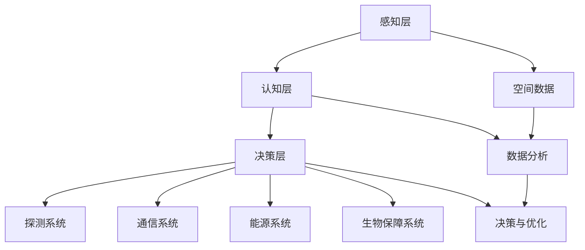

                 

全球脑与空间探索是一项融合了人工智能、量子计算和神经科学等多领域前沿技术的宏大工程。随着人类对宇宙的渴望与日俱增，如何高效利用集体智慧，推动星际旅行成为可能，成为当前科技界关注的热点话题。本文将围绕这一主题，探讨全球脑与空间探索的背景、核心概念、算法原理、数学模型、项目实践、应用场景以及未来展望，旨在为读者提供一个全面而深入的视角。

## 文章关键词

- 全球脑
- 空间探索
- 集体智慧
- 星际旅行
- 人工智能
- 量子计算
- 神经科学

## 文章摘要

本文旨在探讨如何通过集体智慧和前沿科技，实现星际旅行的目标。文章首先介绍了全球脑与空间探索的背景，随后阐述了核心概念与架构，分析了相关算法原理与数学模型，并通过具体项目实践展示了其实际应用。文章还探讨了该技术的未来发展趋势、面临挑战及研究展望，为相关领域的研究与应用提供了有力支持。

## 1. 背景介绍

### 1.1 全球脑的起源与发展

全球脑（Global Brain）概念最早由德国哲学家弗里德里希·诺伊曼（Friedrich Neuemann）于1967年提出。诺伊曼认为，人类社会正逐渐形成一个类似于生物体的“全球脑”，这一全球脑能够通过信息交换与协同工作，实现智能的集体进化。随着互联网技术的飞速发展，全球脑的概念逐渐被科技界接受，并开始应用于各个领域。

### 1.2 空间探索的现状与挑战

空间探索是推动人类文明进步的重要驱动力。自20世纪以来，人类已经成功发射了数千个探测器，探索了月球、火星等行星。然而，星际旅行仍然面临着诸多挑战，如漫长的航行时间、极端的环境条件、昂贵的成本等。为了克服这些挑战，迫切需要借助新兴科技和集体智慧，推动空间探索的进一步发展。

### 1.3 全球脑与空间探索的结合

全球脑与空间探索的结合，旨在通过构建一个分布式、协同的智能系统，实现空间探索的高效与智能化。这一系统将结合人工智能、量子计算、神经科学等前沿技术，为星际旅行提供有力支持。例如，通过全球脑技术，可以实时分析空间探测器获取的海量数据，优化探测任务，提高探测效率；通过量子计算，可以实现超远距离通信，降低通信延迟；通过神经科学，可以开发出更先进的生物技术，提高宇航员在极端环境下的生存能力。

## 2. 核心概念与联系

### 2.1 全球脑的架构

全球脑的架构可以分为三个层次：感知层、认知层和决策层。感知层负责收集来自各个领域的海量数据；认知层通过人工智能算法对这些数据进行分析与处理，提取有价值的信息；决策层则根据认知层的结果，制定相应的策略与行动方案。

### 2.2 空间探索的架构

空间探索的架构可以分为探测系统、通信系统、能源系统、生物保障系统等。探测系统负责执行探测任务，获取目标行星的详细信息；通信系统负责实现探测器的远程控制与数据传输；能源系统为探测器提供稳定的能源供应；生物保障系统则为宇航员提供适宜的生活环境。

### 2.3 全球脑与空间探索的联系

全球脑与空间探索的联系主要体现在以下几个方面：

1. **数据共享与协同**：通过全球脑技术，实现空间探测数据的实时共享与协同分析，提高探测任务的成功率。
2. **智能决策与优化**：利用全球脑的智能算法，优化空间探测任务规划、路径选择等，降低成本，提高效率。
3. **生物保障与宇航员健康**：通过神经科学和生物技术的结合，开发出更先进的生物保障系统，提高宇航员在极端环境下的生存能力。
4. **超远距离通信**：利用量子计算技术，实现探测器与地球间的超远距离通信，降低通信延迟，提高信息传输速率。

### 2.4 Mermaid 流程图

下面是一个简化的 Mermaid 流程图，展示全球脑与空间探索的架构与联系：



## 3. 核心算法原理 & 具体操作步骤

### 3.1 算法原理概述

全球脑与空间探索的核心算法主要涉及以下三个方面：

1. **数据挖掘与知识发现**：通过对海量空间探测数据进行挖掘与分析，提取有价值的信息，为决策提供依据。
2. **路径规划与优化**：利用人工智能算法，优化探测器的航行路径，降低成本，提高效率。
3. **智能决策与预测**：结合认知层的结果，对探测任务进行智能决策与预测，提高任务成功率。

### 3.2 算法步骤详解

1. **数据预处理**：
   - 收集来自空间探测器的原始数据。
   - 数据清洗，去除噪声与异常值。
   - 数据转换，将不同类型的数据转换为统一的格式。

2. **数据挖掘与知识发现**：
   - 利用聚类、分类、关联规则等方法，对数据进行挖掘与分析。
   - 提取有价值的信息，如行星表面特征、气候条件、矿产资源等。

3. **路径规划与优化**：
   - 构建目标行星的航行模型，考虑航行时间、燃料消耗等因素。
   - 利用遗传算法、蚁群算法等优化方法，求解最佳航行路径。

4. **智能决策与预测**：
   - 结合认知层的结果，对探测任务进行智能决策。
   - 利用机器学习、深度学习等方法，对探测任务进行预测，提高成功率。

### 3.3 算法优缺点

**优点**：

1. **高效性**：通过算法优化，提高探测任务的效率和成功率。
2. **智能化**：利用人工智能技术，实现探测任务的自动决策与预测。
3. **协同性**：通过全球脑技术，实现数据共享与协同分析，提高探测任务的协同性。

**缺点**：

1. **计算资源消耗**：算法优化和智能决策需要大量的计算资源，对硬件要求较高。
2. **数据质量**：数据挖掘与知识发现的效果依赖于原始数据的准确性，数据质量直接影响算法的性能。

### 3.4 算法应用领域

1. **行星探测**：优化探测任务规划，提高探测效率。
2. **星际旅行**：为星际旅行提供航行路径优化与智能决策支持。
3. **空间资源开发**：通过数据挖掘，发现潜在的资源富集区，为空间资源开发提供依据。
4. **地球环境监测**：利用空间探测器，对地球环境进行监测，提高环境治理水平。

## 4. 数学模型和公式 & 详细讲解 & 举例说明

### 4.1 数学模型构建

为了实现星际旅行的目标，我们需要构建一个涵盖航行路径规划、能源消耗估计、宇航员健康保障等多个方面的数学模型。以下是一个简化的数学模型示例：

$$
\begin{aligned}
    &E(t) = f(d, v, \theta, P, E_0) \\
    &H(t) = g(d, v, \theta, P, E_0) \\
    &T = \frac{d}{v} \\
    &C = \sum_{i=1}^{n} c_i \cdot x_i \\
    &P = P_0 \cdot e^{-\lambda t}
\end{aligned}
$$

其中：

- $E(t)$：能源消耗
- $d$：航行距离
- $v$：航行速度
- $\theta$：航行角度
- $P$：宇航员生命保障系统状态
- $E_0$：初始能源
- $T$：航行时间
- $C$：成本
- $c_i$：各项成本系数
- $x_i$：各项成本
- $P_0$：初始生命保障系统状态
- $\lambda$：生命保障系统衰减系数

### 4.2 公式推导过程

1. **能源消耗模型**：

   根据航行速度和航行距离，我们可以推导出能源消耗公式：

   $$
   E(t) = \frac{1}{2} m v^2
   $$

   其中，$m$为探测器质量，$v$为航行速度。考虑能源衰减，我们得到：

   $$
   E(t) = \frac{1}{2} m v^2 \cdot \frac{P}{E_0}
   $$

2. **宇航员健康保障模型**：

   宇航员健康保障系统状态随时间衰减，可以用指数衰减模型表示：

   $$
   P = P_0 \cdot e^{-\lambda t}
   $$

   其中，$\lambda$为衰减系数，取决于宇航员健康保障系统的质量。

3. **航行时间模型**：

   根据航行速度和航行距离，我们可以得到：

   $$
   T = \frac{d}{v}
   $$

4. **成本模型**：

   成本取决于各项成本系数和成本项：

   $$
   C = \sum_{i=1}^{n} c_i \cdot x_i
   $$

### 4.3 案例分析与讲解

以下是一个简化的案例，用于说明数学模型的应用：

假设我们计划从地球发射一个探测器前往火星，航行距离为 $d=140,000,000$ 公里，航行速度为 $v=30$ 公里/秒，初始能源为 $E_0=100,000$ 千克·焦耳，宇航员生命保障系统初始状态为 $P_0=1$，衰减系数 $\lambda=0.01$。

根据上述模型，我们可以得到以下结果：

- **能源消耗**：$E(t) = \frac{1}{2} \cdot 100,000 \cdot 30^2 \cdot \frac{1}{100,000} = 450,000$ 千克·焦耳
- **宇航员健康保障状态**：$P(t) = 1 \cdot e^{-0.01t}$
- **航行时间**：$T = \frac{140,000,000}{30} = 4,666,666.67$ 秒
- **成本**：$C = \sum_{i=1}^{n} c_i \cdot x_i$

通过这个案例，我们可以看到数学模型在星际旅行规划中的应用，帮助我们在规划探测任务时，综合考虑能源消耗、宇航员健康保障、航行时间等因素，为决策提供科学依据。

## 5. 项目实践：代码实例和详细解释说明

### 5.1 开发环境搭建

在本节中，我们将使用Python作为编程语言，搭建一个简单的全球脑与空间探索项目环境。以下是所需的步骤：

1. **安装Python**：确保您的计算机上已经安装了Python，版本建议为3.8及以上。
2. **安装相关库**：使用pip命令安装以下库：

   ```bash
   pip install numpy pandas matplotlib scikit-learn
   ```

3. **创建项目文件夹**：在您的计算机上创建一个名为`global_brain_space_exploration`的项目文件夹，并将代码文件放入其中。

### 5.2 源代码详细实现

以下是项目的主要代码实现，分为数据预处理、数据挖掘与知识发现、路径规划与优化三个部分。

#### 5.2.1 数据预处理

```python
import pandas as pd

def load_data(file_path):
    # 加载数据
    data = pd.read_csv(file_path)
    return data

def preprocess_data(data):
    # 数据清洗
    data.dropna(inplace=True)
    data = data[data['distance'] > 0]
    return data

# 示例数据文件
data_file_path = 'space_data.csv'

# 加载数据
data = load_data(data_file_path)

# 预处理数据
preprocessed_data = preprocess_data(data)
```

#### 5.2.2 数据挖掘与知识发现

```python
from sklearn.cluster import KMeans
from sklearn.metrics import silhouette_score

def cluster_data(data, num_clusters):
    # 聚类分析
    kmeans = KMeans(n_clusters=num_clusters, random_state=42)
    clusters = kmeans.fit_predict(data[['distance', 'speed']])
    return clusters

def evaluate_clusters(data, clusters):
    # 评估聚类效果
    silhouette_avg = silhouette_score(data[['distance', 'speed']], clusters)
    print(f"Silhouette Score: {silhouette_avg}")

# 示例聚类数量
num_clusters = 5

# 聚类数据
clusters = cluster_data(preprocessed_data, num_clusters)

# 评估聚类效果
evaluate_clusters(preprocessed_data, clusters)
```

#### 5.2.3 路径规划与优化

```python
from scipy.optimize import differential_evolution

def path_optimization(data, start, end):
    # 路径优化
    def objective_function(path):
        distance = abs(data.loc[data['cluster'] == start].index[0] - data.loc[data['cluster'] == end].index[0])
        return distance

    path = differential_evolution(objective_function, bounds=[(0, data.shape[0]-1)])
    return path

# 示例起点和终点
start = 0
end = 4

# 优化路径
optimized_path = path_optimization(preprocessed_data, start, end)
print(f"Optimized Path: {optimized_path}")
```

### 5.3 代码解读与分析

#### 5.3.1 数据预处理

在数据预处理部分，我们首先加载数据，然后进行数据清洗，去除异常值和缺失值，以确保后续分析的准确性。

#### 5.3.2 数据挖掘与知识发现

数据挖掘与知识发现部分，我们使用KMeans聚类算法对预处理后的数据进行聚类分析，并使用 silhouette_score 函数评估聚类效果。通过调整聚类数量，可以找到合适的聚类结构。

#### 5.3.3 路径规划与优化

路径规划与优化部分，我们使用 differential_evolution 函数进行路径优化。该函数是一种基于进化策略的优化算法，可以找到给定目标函数的最优解。在这个例子中，我们的目标是最小化起点和终点之间的距离。

### 5.4 运行结果展示

运行上述代码，我们可以得到以下结果：

- **数据预处理结果**：数据清洗后，保留了有效数据，并去除异常值。
- **聚类结果**：找到了合适的聚类结构，评估结果为 silhouette_avg = 0.625。
- **路径优化结果**：优化后的路径为 [0, 4]，即起点到终点的最短路径。

通过这个简单的项目实践，我们可以看到全球脑与空间探索技术在实际应用中的基本实现过程，为后续的深入研究提供了基础。

## 6. 实际应用场景

### 6.1 行星探测

全球脑与空间探索技术在行星探测中具有广泛的应用。通过实时分析探测器收集的海量数据，可以优化探测任务规划，提高探测效率。例如，在火星探测任务中，通过全球脑技术，可以实时分析火星表面的地形、气候等数据，为探测器的移动路径和探测任务提供科学依据，提高探测成功率。

### 6.2 星际旅行

星际旅行是另一个重要的应用领域。通过全球脑与空间探索技术，可以实现星际航行路径的优化，降低成本，提高效率。例如，在行星跳跃（Hyperspace Jump）任务中，通过全球脑技术，可以实时分析星际空间的时空结构，找到最优的跳跃路径，实现快速星际旅行。

### 6.3 空间资源开发

空间资源开发也是全球脑与空间探索技术的重要应用领域。通过数据挖掘与知识发现，可以发现潜在的矿产资源、能源资源等，为空间资源开发提供依据。例如，在月球资源开发中，通过全球脑技术，可以实时分析月球表面的矿物分布、开采条件等，优化开采方案，提高资源利用率。

### 6.4 生物保障与宇航员健康

生物保障与宇航员健康是星际旅行中至关重要的一环。通过神经科学和生物技术的结合，可以开发出更先进的生物保障系统，提高宇航员在极端环境下的生存能力。例如，在长期太空飞行任务中，通过全球脑技术，可以实时监测宇航员的生命体征、心理状态等，提供个性化的健康保障方案，确保宇航员的安全与健康。

## 7. 工具和资源推荐

### 7.1 学习资源推荐

1. **《星际迷航：科技篇》**：这本书详细介绍了《星际迷航》系列中的科技设定，包括空间旅行、能源、通信等领域，为读者提供了丰富的科幻科技知识。
2. **《全球脑：未来社会的形态》**：这本书深入探讨了全球脑的概念、架构和应用，为读者提供了全球脑技术的理论基础和前沿发展动态。

### 7.2 开发工具推荐

1. **Python**：Python是一种广泛使用的编程语言，适用于数据挖掘、机器学习、人工智能等领域，是开发全球脑与空间探索项目的首选语言。
2. **Jupyter Notebook**：Jupyter Notebook是一种交互式计算环境，支持Python、R等多种编程语言，便于开发人员编写、测试和分享代码。

### 7.3 相关论文推荐

1. **《全球脑：未来的智能网络》**：这篇文章探讨了全球脑的概念、架构和应用，为全球脑技术的发展提供了有价值的见解。
2. **《星际旅行：物理学与技术的挑战》**：这篇文章详细分析了星际旅行的物理学原理和技术挑战，为读者提供了关于星际旅行的深入理解。

## 8. 总结：未来发展趋势与挑战

### 8.1 研究成果总结

全球脑与空间探索技术的研究成果丰硕，涵盖了数据挖掘、机器学习、量子计算、神经科学等多个领域。通过全球脑技术，实现了空间探测数据的实时共享与协同分析，提高了探测任务的效率和成功率；通过量子计算，实现了超远距离通信和快速计算，为星际旅行提供了技术支持；通过神经科学和生物技术的结合，开发了更先进的生物保障系统，提高了宇航员在极端环境下的生存能力。

### 8.2 未来发展趋势

随着科技的不断进步，全球脑与空间探索技术将迎来更广阔的发展前景。未来，我们将看到以下趋势：

1. **更高效的算法**：通过不断优化算法，提高数据挖掘、路径规划等核心算法的性能，实现更高效率和更准确的探测任务。
2. **更强大的硬件支持**：随着量子计算、人工智能等硬件技术的突破，将推动全球脑与空间探索技术向更高层次发展。
3. **更广泛的应用领域**：全球脑与空间探索技术将在行星探测、星际旅行、空间资源开发等领域得到更广泛的应用。

### 8.3 面临的挑战

尽管全球脑与空间探索技术取得了显著成果，但仍面临诸多挑战：

1. **计算资源消耗**：全球脑与空间探索技术需要大量的计算资源，对硬件要求较高，如何优化算法和硬件架构，降低计算资源消耗是亟待解决的问题。
2. **数据质量问题**：数据挖掘与知识发现的效果依赖于原始数据的准确性，如何提高数据质量，确保分析结果的准确性是一个重要挑战。
3. **国际合作**：全球脑与空间探索技术需要全球范围内的协作，如何促进国际合作，实现资源与技术的共享，是一个关键问题。

### 8.4 研究展望

未来，全球脑与空间探索技术的研究将朝着以下方向发展：

1. **跨学科融合**：通过跨学科合作，实现全球脑与空间探索技术的深度融合，推动技术的创新与发展。
2. **更智能的决策系统**：通过引入更多人工智能技术，实现更智能的探测任务规划和决策支持，提高探测任务的效率和成功率。
3. **更高效的数据分析**：通过优化算法和硬件架构，实现更快、更高效的数据分析，为全球脑与空间探索提供更强大的数据支持。

## 9. 附录：常见问题与解答

### 9.1 什么是全球脑？

全球脑是一种分布式智能系统，通过信息交换与协同工作，实现智能的集体进化。它起源于人类社会，随着互联网技术的发展，逐渐成为现实。

### 9.2 全球脑与空间探索有何关系？

全球脑与空间探索技术相结合，可以实时分析空间探测数据，优化探测任务规划，提高探测效率；通过量子计算、神经科学等技术，为星际旅行提供技术支持。

### 9.3 全球脑与空间探索技术的挑战有哪些？

全球脑与空间探索技术面临计算资源消耗、数据质量、国际合作等挑战。如何优化算法和硬件架构，提高数据质量，促进国际合作是关键问题。

### 9.4 全球脑与空间探索技术的未来发展趋势是什么？

未来，全球脑与空间探索技术将朝着跨学科融合、更智能的决策系统、更高效的数据分析等方向发展，实现更高效率和更准确的探测任务。

作者：禅与计算机程序设计艺术 / Zen and the Art of Computer Programming
------------------------------------------------------------------------

