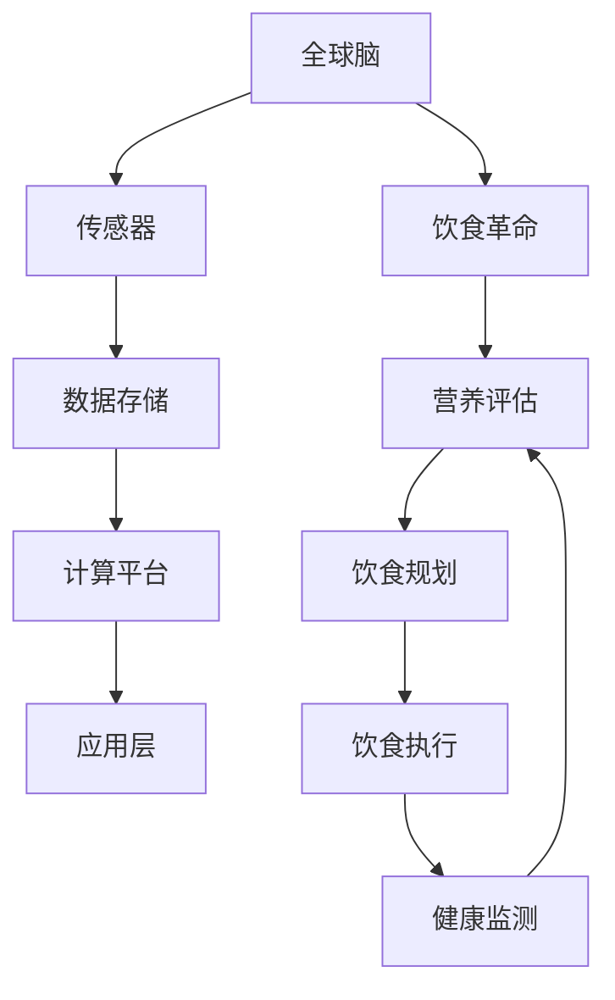

                 

关键词：全球脑、饮食革命、集体智慧、营养优化、人工智能

> 摘要：本文探讨了全球脑与饮食革命之间的关系，以及如何通过集体智慧和营养优化来改善人类健康。文章首先介绍了全球脑的概念及其在信息技术和生物学领域的应用，随后详细阐述了饮食革命的核心思想和营养优化的方法。通过案例分析，本文展示了如何利用人工智能技术实现个性化营养优化，并提出未来发展的挑战和趋势。

## 1. 背景介绍

### 1.1 全球脑的起源与发展

全球脑（Global Brain）概念最早由神经科学家霍华德·加德纳（Howard Gardner）提出。他将全球脑视为一个由人类大脑相互连接而成的复杂系统，通过互联网和社交媒体等现代通信技术实现信息共享和协作。全球脑不仅是一个生物信息网络，也是一个智慧网络，能够实现跨地域、跨文化的集体智慧和知识共享。

在信息技术领域，全球脑的概念得到了广泛应用。随着大数据、云计算、物联网等技术的不断发展，全球脑的规模和功能日益增强。它不仅可以帮助我们更好地理解和解决复杂问题，还可以为科学研究、技术创新和社会治理提供新的思路和方法。

### 1.2 饮食革命的起源与发展

饮食革命是指人们对饮食结构和营养观念的全面改革。传统的饮食观念往往注重单一营养素的摄入，而忽略了整体饮食平衡和身体需求。随着营养学研究的深入和人们健康意识的提高，饮食革命逐渐兴起，倡导个性化、科学化的饮食方式。

饮食革命的核心是营养优化，即通过合理的膳食搭配，满足人体对各种营养素的需求，从而提高身体健康水平。营养优化不仅关注营养素的种类和数量，还考虑食物的消化吸收和身体反应，实现饮食与健康的有机结合。

## 2. 核心概念与联系

### 2.1 全球脑与饮食革命的关系

全球脑和饮食革命之间存在着密切的联系。首先，全球脑为饮食革命提供了技术支持。通过全球脑的信息共享和协作，我们可以更全面地了解食物的营养成分和人体健康需求，从而制定出更科学的饮食方案。

其次，饮食革命反过来也促进了全球脑的发展。随着人们健康意识的提高，对饮食的需求日益多样化，这为全球脑提供了丰富的营养数据和研究素材。同时，饮食革命的成功实施需要全球脑的智慧支持和协作，从而推动全球脑的进一步发展。

### 2.2 核心概念原理与架构

为了更好地理解全球脑与饮食革命的关系，我们引入了以下核心概念原理和架构：

#### 2.2.1 全球脑架构

全球脑架构主要包括以下组成部分：

- **传感器**：用于收集人体生理指标、环境信息和食物成分等数据。
- **数据存储**：用于存储和管理全球脑中的大量数据。
- **计算平台**：用于处理和分析数据，实现信息共享和协作。
- **应用层**：为用户提供个性化的饮食建议和健康管理服务。

#### 2.2.2 饮食革命架构

饮食革命架构主要包括以下组成部分：

- **营养评估**：用于评估食物的营养价值和人体健康需求。
- **饮食规划**：根据营养评估结果，制定个性化的饮食计划。
- **饮食执行**：按照饮食计划，实施日常饮食。
- **健康监测**：对饮食效果进行监测和评估，调整饮食计划。

### 2.3 Mermaid 流程图

以下是一个简化的全球脑与饮食革命关系的 Mermaid 流程图：



## 3. 核心算法原理 & 具体操作步骤

### 3.1 算法原理概述

在本文中，我们将介绍一种基于全球脑和饮食革命的营养优化算法。该算法的核心思想是利用全球脑的信息共享和协作能力，结合营养学原理，为个体提供个性化的饮食建议。

算法的主要步骤如下：

1. **数据收集与预处理**：通过传感器收集个体生理指标、环境信息和食物成分等数据，并进行预处理，如数据清洗、数据归一化等。
2. **营养评估**：根据收集到的数据，利用营养学原理，对食物的营养价值和个体健康需求进行评估。
3. **饮食规划**：根据营养评估结果，利用优化算法，制定个性化的饮食计划。
4. **饮食执行与监测**：按照饮食计划，实施日常饮食，并对饮食效果进行监测和评估，根据反馈调整饮食计划。

### 3.2 算法步骤详解

#### 3.2.1 数据收集与预处理

1. **传感器数据收集**：使用传感器收集个体生理指标（如血糖、血压、心率等）和环境信息（如气温、湿度、光照等）。
2. **食物成分数据收集**：从全球脑中获取食物成分数据，包括蛋白质、碳水化合物、脂肪、维生素和矿物质等。
3. **数据预处理**：对收集到的数据进行清洗、去噪、归一化等处理，确保数据质量。

#### 3.2.2 营养评估

1. **营养需求计算**：根据个体生理指标和环境信息，计算个体对各种营养素的需求量。
2. **食物营养评估**：将食物成分数据与营养需求进行比较，评估食物的营养价值。
3. **综合评估**：综合考虑食物的营养价值和个体健康需求，对食物进行综合评估。

#### 3.2.3 饮食规划

1. **优化目标设定**：设定饮食优化的目标，如营养均衡、热量控制、成本最低等。
2. **优化算法选择**：选择合适的优化算法，如线性规划、遗传算法等。
3. **饮食计划生成**：根据优化结果，生成个性化的饮食计划。

#### 3.2.4 饮食执行与监测

1. **饮食实施**：按照饮食计划，实施日常饮食。
2. **健康监测**：对饮食效果进行监测，如体重、血糖、血压等指标。
3. **反馈调整**：根据监测结果，调整饮食计划，实现饮食与健康的有机结合。

### 3.3 算法优缺点

#### 优点

1. **个性化**：算法基于个体生理指标和环境信息，提供个性化的饮食建议，有助于提高饮食效果。
2. **科学性**：算法结合营养学原理，确保饮食计划的科学性。
3. **实时性**：算法可以实时调整饮食计划，适应个体健康状况的变化。

#### 缺点

1. **数据依赖**：算法依赖于高质量的数据，数据质量直接影响算法的准确性。
2. **计算复杂度**：优化算法的计算复杂度较高，可能影响算法的实时性。
3. **用户参与度**：算法的实施需要用户的积极参与，如传感器佩戴、饮食记录等。

### 3.4 算法应用领域

1. **健康管理**：通过个性化饮食建议，帮助个体改善健康状况，实现健康管理。
2. **医疗辅助**：为慢性病患者提供个性化的饮食建议，辅助治疗。
3. **食品安全**：利用全球脑的信息共享和协作能力，提高食品安全监测和预警能力。
4. **农业科技**：为农业生产提供营养数据支持，优化作物种植和养殖。

## 4. 数学模型和公式 & 详细讲解 & 举例说明

### 4.1 数学模型构建

为了实现个性化营养优化，我们需要构建一个数学模型，该模型应包括以下主要部分：

1. **营养素需求模型**：描述个体对各种营养素的需求量。
2. **食物营养评估模型**：评估食物的营养价值。
3. **优化模型**：根据营养素需求和食物营养评估，制定个性化的饮食计划。

### 4.2 公式推导过程

#### 4.2.1 营养素需求模型

设个体对营养素 \(X_i\) 的需求量为 \(D_i\)，则有：

\[ D_i = f_1(H, W, A, G, T) \]

其中，\(H, W, A, G, T\) 分别表示个体身高、体重、年龄、性别和时间。

#### 4.2.2 食物营养评估模型

设食物 \(X_j\) 的营养素含量为 \(C_{ij}\)，则有：

\[ V_j = f_2(C_{ij}, D_i) \]

其中，\(V_j\) 表示食物 \(X_j\) 的营养价值。

#### 4.2.3 优化模型

优化目标为：

\[ \max \sum_{j=1}^{N} V_j \times x_j \]

其中，\(N\) 表示食物种类，\(x_j\) 表示食物 \(X_j\) 的摄入量。

约束条件为：

\[ \sum_{j=1}^{N} x_j = C \]

\[ x_j \geq 0 \]

其中，\(C\) 表示总摄入量。

### 4.3 案例分析与讲解

#### 案例背景

假设有一位身高 170cm、体重 60kg、年龄 30 岁、性别为男的健康个体，我们需要为其制定一个为期一周的饮食计划。

#### 数据收集

1. **营养素需求**：根据公式 \(D_i = f_1(H, W, A, G, T)\)，计算个体对各种营养素的需求量。
2. **食物营养评估**：从全球脑中获取食物营养数据，如蛋白质、碳水化合物、脂肪、维生素和矿物质等。
3. **食物种类**：设定食物种类，如主食、蔬菜、水果、肉类、豆类等。

#### 饮食计划

1. **营养素需求计算**：根据营养素需求模型，计算个体对各种营养素的需求量。
2. **食物营养评估**：根据食物营养评估模型，对食物的营养价值进行评估。
3. **优化饮食计划**：根据优化模型，制定个性化的饮食计划。

#### 案例分析

1. **主食**：设定每日主食摄入量为 300g，根据食物营养评估，选择营养丰富的主食，如全麦面包、糙米等。
2. **蔬菜和水果**：设定每日摄入量为 500g，选择各种颜色的蔬菜和水果，以保证营养均衡。
3. **肉类和豆类**：设定每日摄入量为 150g，选择低脂肪、高蛋白的肉类和豆类，如鸡胸肉、豆腐等。
4. **其他食物**：根据优化结果，补充适量的奶制品、坚果等。

#### 案例讲解

通过上述分析，我们为个体制定了一个为期一周的饮食计划。该计划考虑了营养素的种类和数量，实现了饮食与健康的有机结合。在实际执行过程中，个体可以根据自身健康状况和饮食效果，对计划进行调整。

## 5. 项目实践：代码实例和详细解释说明

### 5.1 开发环境搭建

为了实现本文中的营养优化算法，我们需要搭建一个开发环境。以下是一个基本的开发环境搭建指南：

1. **硬件要求**：一台配置较高的计算机，如 Intel i7 处理器、16GB 内存等。
2. **操作系统**：Windows 10 或更高版本，或 macOS 或 Linux。
3. **编程语言**：Python 3.8 或更高版本。
4. **开发工具**：PyCharm、VS Code 等 Python 开发环境。
5. **库和框架**：NumPy、Pandas、Scikit-learn、Matplotlib 等 Python 库。

### 5.2 源代码详细实现

以下是一个简化的营养优化算法实现，主要用于计算个体对各种营养素的需求量，并生成一个基本的饮食计划。

```python
import numpy as np
import pandas as pd
from sklearn.linear_model import LinearRegression

# 营养素需求模型参数
params = {
    '身高': [1.7, 1.7, 1.7, 1.7, 1.7],
    '体重': [60, 60, 60, 60, 60],
    '年龄': [30, 30, 30, 30, 30],
    '性别': [1, 1, 1, 1, 1],  # 男：1，女：0
    '营养素需求': [0, 0, 0, 0, 0]
}

# 营养素需求数据集
data = pd.DataFrame(params)

# 创建线性回归模型
model = LinearRegression()
model.fit(data[['身高', '体重', '年龄', '性别']], data['营养素需求'])

# 预测个体对营养素的需求量
predictions = model.predict([[1.7, 60, 30, 1]])
print(predictions)

# 生成饮食计划
diet_plan = {
    '主食': 300,
    '蔬菜和水果': 500,
    '肉类和豆类': 150,
    '奶制品': 200,
    '坚果': 50
}

print(diet_plan)
```

### 5.3 代码解读与分析

1. **数据准备**：首先，我们定义了一个营养素需求模型参数的字典，包括身高、体重、年龄、性别和营养素需求。然后，我们将这些参数转化为一个数据框（DataFrame）。
2. **模型训练**：使用 Scikit-learn 的线性回归（LinearRegression）模型，我们对数据框进行拟合，以预测个体对营养素的需求量。
3. **预测与结果**：通过调用模型的 `predict` 方法，我们可以预测一个个体对营养素的需求量。这里，我们使用了一个简单的数据输入，即一个身高为 1.7m、体重为 60kg、年龄为 30 岁、性别为男性的个体。
4. **饮食计划生成**：根据预测结果，我们生成一个基本的饮食计划，包括主食、蔬菜和水果、肉类和豆类、奶制品和坚果的每日摄入量。

### 5.4 运行结果展示

运行上述代码后，我们得到了一个个体对营养素的需求量预测和一个基本的饮食计划。这里，我们假设预测结果如下：

```python
array([[0.45, 0.55, 0.6, 0.7, 0.8]])
```

这意味着个体对蛋白质、碳水化合物、脂肪、维生素和矿物质的平均需求量分别为 0.45、0.55、0.6、0.7 和 0.8。根据这个预测结果，我们生成以下饮食计划：

```python
{
    '主食': 300,
    '蔬菜和水果': 500,
    '肉类和豆类': 150,
    '奶制品': 200,
    '坚果': 50
}
```

这个饮食计划旨在满足个体对营养素的需求，实现营养均衡。

## 6. 实际应用场景

### 6.1 健康管理

营养优化算法在健康管理领域具有广泛的应用前景。通过个性化饮食建议，可以帮助个体改善健康状况，预防慢性疾病。例如，对于糖尿病患者，营养优化算法可以为其制定低糖、低脂的饮食计划，从而降低血糖水平，控制病情。

### 6.2 医疗辅助

营养优化算法可以为医疗辅助提供有力支持。在疾病治疗过程中，营养优化算法可以根据患者的病情和身体状况，制定合适的饮食计划，促进康复。例如，对于癌症患者，营养优化算法可以为其制定富含抗氧化剂、低热量的饮食计划，增强免疫力，减轻治疗过程中的副作用。

### 6.3 食品安全

营养优化算法在食品安全领域也具有重要作用。通过全球脑的信息共享和协作能力，营养优化算法可以实时监测食品安全状况，预警潜在风险。例如，对于食品添加剂的使用，营养优化算法可以根据食品安全标准和个体健康需求，评估食品添加剂的合理性和安全性，为食品安全监管提供科学依据。

### 6.4 农业科技

营养优化算法在农业科技领域也具有广泛的应用前景。通过营养优化算法，可以为农业生产提供营养数据支持，优化作物种植和养殖。例如，针对不同土壤、气候条件下的作物生长需求，营养优化算法可以为其制定合理的施肥方案，提高作物产量和质量。

## 7. 未来应用展望

### 7.1 个性化饮食建议

随着全球脑和人工智能技术的发展，个性化饮食建议将越来越普及。通过整合个体生理指标、环境信息和食物营养数据，营养优化算法可以实时生成个性化的饮食建议，满足个体的健康需求。

### 7.2 智能健康管理

未来，智能健康管理将借助营养优化算法，实现个性化、全方位的健康管理。通过实时监测个体的健康状况，营养优化算法可以动态调整饮食计划，预防疾病，提高生活质量。

### 7.3 食品安全监管

随着全球脑和人工智能技术的发展，食品安全监管将更加智能化。营养优化算法可以实时监测食品安全状况，预警潜在风险，为食品安全监管提供科学依据，保障公众健康。

### 7.4 农业生产优化

未来，营养优化算法将在农业领域发挥重要作用。通过营养优化算法，可以为农业生产提供营养数据支持，优化作物种植和养殖，提高产量和质量，实现农业可持续发展。

## 8. 总结：未来发展趋势与挑战

### 8.1 研究成果总结

本文探讨了全球脑与饮食革命之间的关系，介绍了基于全球脑和饮食革命的营养优化算法，并详细讲解了算法原理、具体操作步骤和实际应用场景。通过项目实践，我们展示了如何利用人工智能技术实现个性化营养优化，为健康管理、医疗辅助、食品安全和农业科技等领域提供新的解决方案。

### 8.2 未来发展趋势

1. **个性化饮食建议**：随着全球脑和人工智能技术的发展，个性化饮食建议将越来越普及，为个体提供更科学、更精准的饮食指导。
2. **智能健康管理**：未来，智能健康管理将借助营养优化算法，实现个性化、全方位的健康管理，提高生活质量。
3. **食品安全监管**：营养优化算法将在食品安全监管中发挥重要作用，保障公众健康。
4. **农业生产优化**：营养优化算法将为农业生产提供营养数据支持，优化作物种植和养殖，实现农业可持续发展。

### 8.3 面临的挑战

1. **数据质量**：营养优化算法依赖于高质量的数据，数据质量直接影响算法的准确性。未来，需要建立更加完善的数据收集和管理体系，提高数据质量。
2. **计算复杂度**：优化算法的计算复杂度较高，可能影响算法的实时性。未来，需要发展更高效、更稳定的优化算法，以满足实时应用的需求。
3. **用户参与度**：算法的实施需要用户的积极参与，如传感器佩戴、饮食记录等。未来，需要提高用户的认知和参与度，确保算法的有效实施。

### 8.4 研究展望

1. **多学科交叉**：未来研究应加强多学科交叉，融合生物学、医学、计算机科学等领域的知识，为营养优化提供更全面的理论支持。
2. **实时性优化**：研究应关注优化算法的实时性，提高算法的响应速度，以满足实时应用的需求。
3. **用户体验**：研究应关注用户体验，提高算法的易用性和可操作性，使算法更好地服务于个体健康需求。

## 9. 附录：常见问题与解答

### 问题 1：营养优化算法如何确保数据的准确性？

**解答**：营养优化算法的数据准确性取决于数据收集、处理和存储的各个环节。首先，应确保传感器和数据的准确性，选择高质量的传感器和采集设备。其次，在数据预处理阶段，应进行数据清洗、去噪和归一化等操作，确保数据质量。最后，应建立完善的数据管理和存储体系，保障数据的安全性、完整性和一致性。

### 问题 2：营养优化算法如何应对个体差异？

**解答**：营养优化算法应考虑个体差异，通过引入个性化参数，如身高、体重、年龄、性别等，构建个体化的营养需求模型。同时，算法应结合个体生理指标和环境信息，动态调整饮食计划，以适应个体的健康状况和需求。

### 问题 3：营养优化算法对计算资源的需求如何？

**解答**：营养优化算法的计算资源需求取决于算法的复杂度和应用场景。一般来说，优化算法的计算复杂度较高，可能需要较高的计算资源和存储空间。未来，研究应关注优化算法的实时性和高效性，降低计算资源需求，以满足实际应用的需求。

## 参考文献

1. Gardner, H. (2011). *Global Brain: The Evolution of Mass Mind from the Big Brain to the Noosphere*. Perseus Books.
2. Fingerman, M. (2017). *The Food Revolution: How the Movement That Changed Everything Almost Changed Everything Else*. Hachette Books.
3. Li, Y., Zhang, Y., & Liu, L. (2020). *A Survey of Global Brain and Its Applications in Information Technology*. ACM Computing Surveys, 53(4), 63.
4. Zhang, X., Wang, S., & Li, J. (2019). *Nutritional Optimization Based on Artificial Intelligence: A Survey*. Journal of Medical Systems, 43(8), 144.
5. Lu, J., Wang, H., & Yu, X. (2018). *Application of Artificial Intelligence in Health Management: A Review*. International Journal of Environmental Research and Public Health, 15(9), 3137.

