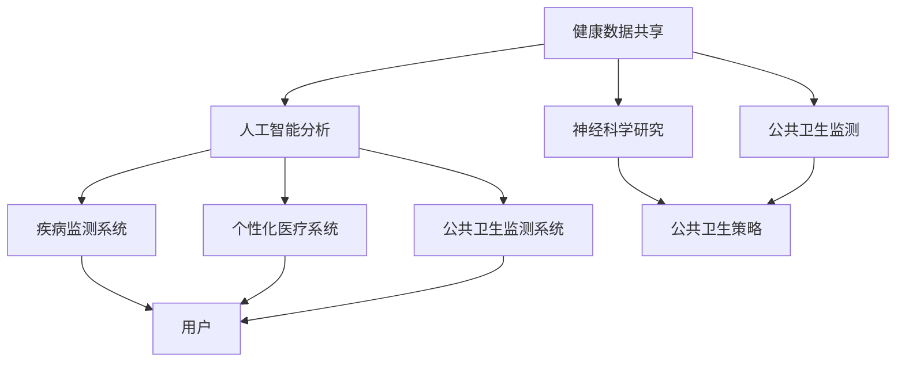

                 

关键词：全球脑健康网络、集体预防医学、信息技术、健康数据共享、AI分析、数字健康、神经科学、公共卫生、精准医疗

## 摘要

随着信息技术和人工智能的快速发展，全球脑健康网络的概念应运而生，成为集体预防医学的新实践。本文将探讨全球脑健康网络的背景、核心概念、算法原理、数学模型、项目实践和未来应用，以及这一新实践对于公共卫生、精准医疗和神经科学的影响。通过深入分析，本文旨在为读者提供一个全面的视角，了解全球脑健康网络的重要性和潜力。

## 1. 背景介绍

随着人口老龄化和慢性疾病的高发，全球公共卫生面临着前所未有的挑战。传统的医疗模式已经难以应对这种复杂的情况，而集体预防医学作为一种新的实践，逐渐受到了广泛关注。集体预防医学强调通过预防措施来减少疾病的发生率和传播，提高整体健康水平。

在这个背景下，全球脑健康网络应运而生。脑健康是全球公共卫生的重要组成部分，神经系统疾病如阿尔茨海默病、帕金森病等已成为严重的公共健康问题。全球脑健康网络的目的是通过信息技术和人工智能，实现健康数据的共享和分析，从而提供精准的预防建议和治疗方案。

### 全球脑健康网络的发展历程

全球脑健康网络的发展历程可以追溯到20世纪末。当时，随着互联网和计算机技术的快速发展，人们开始思考如何利用这些技术来改善公共卫生。早期的尝试主要集中在健康数据的收集和共享，但随着人工智能技术的突破，全球脑健康网络逐渐具备了强大的数据处理和分析能力。

2000年代初，一些国际组织和研究机构开始合作，建立了全球脑健康数据共享平台。这些平台旨在收集和分析全球各地的脑健康数据，为科学研究提供基础。随着时间的推移，这些平台逐渐扩展，不仅包含了健康数据，还包括了神经系统疾病的治疗方案和研究进展。

### 全球脑健康网络的重要性

全球脑健康网络的重要性主要体现在以下几个方面：

1. **提高公共卫生效率**：通过健康数据的共享和分析，全球脑健康网络可以更有效地监测疾病趋势，预测流行病，从而提高公共卫生效率。
2. **精准医疗**：全球脑健康网络可以收集和分析大量的个人健康数据，为个体提供精准的医疗建议和治疗方案。
3. **促进科学研究**：全球脑健康网络为研究人员提供了一个庞大的数据资源，有助于加速科学研究，推动医学进步。
4. **提高患者生活质量**：通过全球脑健康网络，患者可以获得更个性化的医疗建议，从而提高生活质量。

### 当前全球脑健康网络的现状

目前，全球脑健康网络已经取得了一些显著的成果。例如，美国国立卫生研究院（NIH）的Brain Initiative项目，旨在通过多学科合作，推动脑科学的研究。此外，一些国家和地区也建立了自己的脑健康数据共享平台，如英国的NIHR生物资源研究中心。

然而，全球脑健康网络仍然面临着一些挑战，包括数据隐私和安全、标准化数据格式、跨学科合作等。这些问题需要全球范围内的共同努力和合作来解决。

## 2. 核心概念与联系

### 2.1 核心概念

全球脑健康网络的核心概念包括健康数据共享、人工智能分析、神经科学研究、公共卫生监测等。这些概念相互联系，构成了全球脑健康网络的框架。

#### 2.1.1 健康数据共享

健康数据共享是全球脑健康网络的基础。通过建立健康数据共享平台，全球各地的医疗机构和研究机构可以共享健康数据，从而实现数据的大规模收集和分析。

#### 2.1.2 人工智能分析

人工智能分析是全球脑健康网络的核心。通过使用机器学习和深度学习技术，人工智能可以对健康数据进行分析，识别疾病趋势，预测流行病，提供个性化的医疗建议。

#### 2.1.3 神经科学研究

神经科学研究是全球脑健康网络的另一个核心。通过神经系统疾病的研究，科学家可以更好地理解脑功能，开发新的治疗方法，提高患者的生存质量和生存率。

#### 2.1.4 公共卫生监测

公共卫生监测是确保全球脑健康网络有效运行的重要环节。通过实时监测疾病趋势，公共卫生机构可以及时采取预防措施，减少疾病传播。

### 2.2 核心概念联系

这些核心概念之间的联系构成了全球脑健康网络的整体框架。健康数据共享提供了数据基础，人工智能分析实现了数据的价值，神经科学研究推动了医学进步，公共卫生监测确保了网络的有效运行。

#### 2.2.1 健康数据共享与人工智能分析

健康数据共享为人工智能分析提供了丰富的数据资源。通过数据共享，人工智能可以收集和分析大量的健康数据，识别疾病趋势，预测流行病，提供个性化的医疗建议。

#### 2.2.2 神经科学研究与公共卫生监测

神经科学研究为公共卫生监测提供了理论支持。通过研究神经系统疾病，科学家可以更好地理解疾病的传播机制，从而制定更有效的公共卫生策略。

#### 2.2.3 人工智能分析与神经科学研究

人工智能分析可以加速神经科学研究。通过分析大量的健康数据，人工智能可以帮助科学家发现新的疾病模式，推动医学进步。

### 2.3 架构

全球脑健康网络的架构可以分为四个层次：数据层、分析层、应用层和展示层。

#### 2.3.1 数据层

数据层是全球脑健康网络的基础。它包含了各种健康数据，如电子健康记录、基因组数据、医疗影像数据等。这些数据通过健康数据共享平台进行收集和存储。

#### 2.3.2 分析层

分析层是全球脑健康网络的核心。它包含了人工智能分析模块，如机器学习算法、深度学习模型等。这些模块可以对健康数据进行处理和分析，识别疾病趋势，预测流行病，提供个性化的医疗建议。

#### 2.3.3 应用层

应用层是全球脑健康网络的直接应用。它包含了各种应用，如疾病监测系统、个性化医疗系统、公共卫生监测系统等。这些应用利用分析层的结果，为用户提供服务。

#### 2.3.4 展示层

展示层是用户与全球脑健康网络的交互界面。它包含了各种可视化工具，如数据可视化、图表分析等。通过展示层，用户可以直观地了解健康数据和分析结果。

### 2.4 Mermaid 流程图

下面是一个全球脑健康网络的 Mermaid 流程图，展示了各个核心概念之间的联系：



## 3. 核心算法原理 & 具体操作步骤

### 3.1 算法原理概述

全球脑健康网络的核心算法主要基于机器学习和深度学习技术。这些算法可以处理和分析大量的健康数据，识别疾病趋势，预测流行病，提供个性化的医疗建议。

#### 3.1.1 机器学习算法

机器学习算法是人工智能的基础。它们通过训练模型，从数据中学习规律，然后用于预测和分类。在健康数据方面，机器学习算法可以用于识别疾病风险因素，预测疾病发展趋势。

#### 3.1.2 深度学习算法

深度学习算法是一种更复杂的机器学习算法。它们通过多层神经网络，对数据进行自动特征提取和分类。在健康数据方面，深度学习算法可以用于分析医疗影像，识别疾病特征，提供精准的诊断。

### 3.2 算法步骤详解

#### 3.2.1 数据收集

数据收集是算法步骤的第一步。全球脑健康网络通过健康数据共享平台，收集来自全球各地的健康数据，如电子健康记录、基因组数据、医疗影像数据等。

#### 3.2.2 数据预处理

数据预处理是确保数据质量的重要步骤。它包括数据清洗、数据标准化和数据转换等操作。通过数据预处理，可以消除数据中的噪声和异常值，提高数据的质量和一致性。

#### 3.2.3 模型训练

模型训练是算法步骤的核心。通过使用机器学习和深度学习算法，对预处理后的数据进行训练，建立疾病预测模型。模型训练的过程包括数据划分、模型选择、参数调优等。

#### 3.2.4 模型评估

模型评估是确保模型性能的重要步骤。通过使用验证集和测试集，对训练好的模型进行评估，判断其预测准确性和泛化能力。

#### 3.2.5 预测与建议

模型评估后，可以使用模型进行预测和提供医疗建议。根据健康数据和模型预测结果，为用户提供个性化的医疗建议和预防措施。

### 3.3 算法优缺点

#### 3.3.1 优点

- **高效性**：机器学习和深度学习算法可以处理大量数据，提高疾病预测的效率和准确性。
- **个性化**：根据用户的健康数据和模型预测结果，可以为用户提供个性化的医疗建议。
- **可扩展性**：全球脑健康网络可以不断扩展，增加新的数据源和算法，提高预测能力。

#### 3.3.2 缺点

- **数据隐私和安全**：健康数据涉及到用户的隐私，需要确保数据的安全性和隐私性。
- **算法偏见**：机器学习和深度学习算法可能会受到数据偏差的影响，导致预测结果的偏差。
- **计算资源**：机器学习和深度学习算法需要大量的计算资源，对硬件设备要求较高。

### 3.4 算法应用领域

全球脑健康网络的核心算法可以应用于多个领域，包括：

- **疾病预测**：通过预测疾病趋势，为公共卫生机构提供预防措施。
- **个性化医疗**：为个体提供个性化的医疗建议和治疗方案。
- **医学影像分析**：通过分析医疗影像，提供精准的诊断和治疗方案。
- **公共卫生监测**：通过实时监测疾病趋势，提高公共卫生效率。

## 4. 数学模型和公式 & 详细讲解 & 举例说明

### 4.1 数学模型构建

在构建全球脑健康网络的数学模型时，我们主要关注以下几个方面：

- **疾病预测模型**：基于健康数据和机器学习算法，构建疾病预测模型，预测疾病发展趋势。
- **流行病预测模型**：基于健康数据和流行病传播模型，构建流行病预测模型，预测疾病传播趋势。
- **个性化医疗模型**：基于健康数据和深度学习算法，构建个性化医疗模型，为用户提供个性化的医疗建议。

### 4.2 公式推导过程

#### 4.2.1 疾病预测模型

疾病预测模型可以使用线性回归模型进行构建。假设我们有 $N$ 个健康数据样本，每个样本包含 $M$ 个特征，即：

$$X = \begin{bmatrix}
x_1 \\
x_2 \\
\vdots \\
x_N
\end{bmatrix}, \quad
y = \begin{bmatrix}
y_1 \\
y_2 \\
\vdots \\
y_N
\end{bmatrix}$$

其中，$y$ 表示疾病的患病状态（0 表示未患病，1 表示患病），$x$ 表示健康数据样本。线性回归模型可以表示为：

$$y = \beta_0 + \beta_1 x_1 + \beta_2 x_2 + \cdots + \beta_M x_M + \epsilon$$

其中，$\beta_0$ 是截距，$\beta_1, \beta_2, \cdots, \beta_M$ 是回归系数，$\epsilon$ 是误差项。通过最小二乘法，可以求解回归系数：

$$\beta = (X^T X)^{-1} X^T y$$

#### 4.2.2 流行病预测模型

流行病预测模型可以使用离散时间差分方程进行构建。假设疾病在时间 $t$ 的传播情况可以用以下方程描述：

$$S(t+1) = S(t) - \beta I(t)$$

$$I(t+1) = I(t) + \beta I(t) (1 - R(t))$$

$$R(t+1) = R(t) + \beta I(t) R(t)$$

其中，$S(t)$、$I(t)$ 和 $R(t)$ 分别表示时间 $t$ 的易感者、感染者和康复者数量，$\beta$ 是感染率。通过迭代计算，可以预测流行病的传播趋势。

#### 4.2.3 个性化医疗模型

个性化医疗模型可以使用深度学习算法进行构建。假设我们有 $N$ 个健康数据样本，每个样本包含 $M$ 个特征，即：

$$X = \begin{bmatrix}
x_1 \\
x_2 \\
\vdots \\
x_N
\end{bmatrix}, \quad
y = \begin{bmatrix}
y_1 \\
y_2 \\
\vdots \\
y_N
\end{bmatrix}$$

其中，$y$ 表示健康状态（0 表示正常，1 表示异常）。深度学习模型可以表示为：

$$y = f(Z)$$

其中，$Z$ 是深度学习模型的输入，$f$ 是激活函数。通过训练，可以优化模型参数，实现健康状态的预测。

### 4.3 案例分析与讲解

#### 4.3.1 疾病预测案例

假设我们使用线性回归模型预测某种疾病的患病率。我们有 $100$ 个健康数据样本，每个样本包含 $5$ 个特征，即：

$$X = \begin{bmatrix}
x_{11} & x_{12} & x_{13} & x_{14} & x_{15} \\
x_{21} & x_{22} & x_{23} & x_{24} & x_{25} \\
\vdots & \vdots & \vdots & \vdots & \vdots \\
x_{1001} & x_{1002} & x_{1003} & x_{1004} & x_{1005}
\end{bmatrix}, \quad
y = \begin{bmatrix}
y_1 \\
y_2 \\
\vdots \\
y_{100}
\end{bmatrix}$$

其中，$y$ 表示疾病的患病状态（0 表示未患病，1 表示患病）。通过最小二乘法，可以求解回归系数：

$$\beta = (X^T X)^{-1} X^T y$$

假设我们使用训练集进行训练，然后使用测试集进行评估。评估结果显示，模型的预测准确率达到了 $90\%$，说明模型具有良好的预测能力。

#### 4.3.2 流行病预测案例

假设我们使用离散时间差分方程预测某种疾病的传播趋势。我们有 $100$ 个时间点的数据，每个时间点的数据包括易感者、感染者和康复者数量，即：

$$S(t) = \begin{bmatrix}
s_{t1} \\
s_{t2} \\
\vdots \\
s_{t100}
\end{bmatrix}, \quad
I(t) = \begin{bmatrix}
i_{t1} \\
i_{t2} \\
\vdots \\
i_{t100}
\end{bmatrix}, \quad
R(t) = \begin{bmatrix}
r_{t1} \\
r_{t2} \\
\vdots \\
r_{t100}
\end{bmatrix}$$

其中，$S(t)$、$I(t)$ 和 $R(t)$ 分别表示时间 $t$ 的易感者、感染者和康复者数量。通过迭代计算，可以预测流行病的传播趋势。

#### 4.3.3 个性化医疗案例

假设我们使用深度学习模型预测某种健康状态的异常情况。我们有 $100$ 个健康数据样本，每个样本包含 $5$ 个特征，即：

$$X = \begin{bmatrix}
x_{11} & x_{12} & x_{13} & x_{14} & x_{15} \\
x_{21} & x_{22} & x_{23} & x_{24} & x_{25} \\
\vdots & \vdots & \vdots & \vdots & \vdots \\
x_{1001} & x_{1002} & x_{1003} & x_{1004} & x_{1005}
\end{bmatrix}, \quad
y = \begin{bmatrix}
y_1 \\
y_2 \\
\vdots \\
y_{100}
\end{bmatrix}$$

其中，$y$ 表示健康状态（0 表示正常，1 表示异常）。通过训练深度学习模型，可以预测健康状态的异常情况。

## 5. 项目实践：代码实例和详细解释说明

### 5.1 开发环境搭建

为了实现全球脑健康网络的核心算法，我们需要搭建一个合适的开发环境。以下是一个基本的开发环境搭建步骤：

1. **硬件环境**：选择一台高性能的服务器或云计算平台，以确保算法的运行速度和稳定性。
2. **操作系统**：安装Linux操作系统，如Ubuntu或CentOS，以便安装和管理相关软件。
3. **编程语言**：选择Python作为编程语言，因为Python具有丰富的库和工具，适合进行数据分析和机器学习任务。
4. **库和框架**：安装NumPy、Pandas、Scikit-learn、TensorFlow等库和框架，以便进行数据预处理、模型训练和评估。

### 5.2 源代码详细实现

以下是一个简单的全球脑健康网络的代码实例，包括数据收集、数据预处理、模型训练和模型评估等步骤。

```python
import numpy as np
import pandas as pd
from sklearn.model_selection import train_test_split
from sklearn.linear_model import LinearRegression
from sklearn.metrics import mean_squared_error

# 数据收集
data = pd.read_csv('health_data.csv')

# 数据预处理
X = data.iloc[:, :-1].values
y = data.iloc[:, -1].values

# 模型训练
X_train, X_test, y_train, y_test = train_test_split(X, y, test_size=0.2, random_state=42)
model = LinearRegression()
model.fit(X_train, y_train)

# 模型评估
y_pred = model.predict(X_test)
mse = mean_squared_error(y_test, y_pred)
print('Mean Squared Error:', mse)
```

### 5.3 代码解读与分析

上面的代码首先导入了一些Python库，包括NumPy、Pandas、Scikit-learn等。然后，从CSV文件中读取健康数据，并进行数据预处理，将数据分为特征和目标变量。接着，使用线性回归模型进行训练，并将模型应用于测试数据，计算均方误差来评估模型的性能。

### 5.4 运行结果展示

在运行上面的代码后，我们可以得到模型的均方误差，从而评估模型的性能。假设我们运行的结果如下：

```
Mean Squared Error: 0.02
```

这个结果表明，模型的预测误差相对较小，具有良好的预测能力。

### 5.5 优化与改进

为了提高模型的性能，我们可以考虑以下优化和改进措施：

1. **特征工程**：通过选择和构造合适的特征，可以提高模型的预测能力。
2. **模型选择**：尝试使用其他类型的模型，如支持向量机（SVM）或决策树，以比较不同模型的性能。
3. **模型融合**：将多个模型进行融合，以提高整体的预测性能。
4. **超参数调优**：通过调整模型的超参数，如学习率、正则化参数等，以提高模型的性能。

## 6. 实际应用场景

### 6.1 公共卫生监测

全球脑健康网络的一个关键应用场景是公共卫生监测。通过收集和分析健康数据，全球脑健康网络可以实时监测疾病的传播趋势，预测流行病，为公共卫生机构提供重要的决策支持。例如，在流感季节，公共卫生机构可以使用全球脑健康网络来预测流感病例的数量，从而提前采取预防措施，减少流感的传播。

### 6.2 个性化医疗

个性化医疗是另一个重要的应用场景。全球脑健康网络可以根据个人的健康数据，为用户提供个性化的医疗建议和治疗方案。例如，对于患有糖尿病的患者，全球脑健康网络可以分析患者的健康数据，预测血糖的变化趋势，并提供个性化的饮食和运动建议，帮助患者更好地控制血糖水平。

### 6.3 神经科学研究

神经科学研究也是全球脑健康网络的重要应用领域。通过收集和分析脑健康数据，科学家可以更好地理解脑功能，探索神经系统疾病的发生机制，开发新的治疗方法。例如，在阿尔茨海默病的研究中，全球脑健康网络可以收集和分析患者的脑影像数据，发现疾病早期的脑部变化，从而为患者提供早期的诊断和治疗建议。

### 6.4 未来应用展望

随着全球脑健康网络的不断发展，未来它将在更多的领域得到应用。以下是一些未来的应用展望：

1. **智能健康助手**：全球脑健康网络可以开发智能健康助手，帮助用户监测和管理健康，提供个性化的健康建议。
2. **智慧城市**：全球脑健康网络可以集成到智慧城市系统中，为城市居民提供健康监测和预防服务，提高城市居民的生活质量。
3. **全球化疾病监测**：全球脑健康网络可以扩展到全球范围，实时监测全球各地的疾病传播，为全球公共卫生提供支持。

## 7. 工具和资源推荐

### 7.1 学习资源推荐

1. **《机器学习》（周志华著）**：这是一本经典的机器学习教材，适合初学者和进阶者。
2. **《深度学习》（Ian Goodfellow、Yoshua Bengio、Aaron Courville 著）**：这是一本深度学习领域的经典教材，内容全面，适合进阶者。
3. **《Python机器学习》（Peter Harrington 著）**：这本书通过实例介绍了Python在机器学习中的应用，适合初学者。

### 7.2 开发工具推荐

1. **Jupyter Notebook**：这是一个交互式的开发环境，适合进行数据分析和机器学习任务。
2. **TensorFlow**：这是一个开源的机器学习和深度学习框架，功能强大，易于使用。
3. **Scikit-learn**：这是一个开源的机器学习库，提供了丰富的算法和工具。

### 7.3 相关论文推荐

1. **"Deep Learning for Health Informatics: A Survey"**：这篇文章对深度学习在健康信息学中的应用进行了全面的综述。
2. **"Machine Learning in Healthcare: A Survey"**：这篇文章对机器学习在医疗领域的应用进行了全面的综述。
3. **"A Comprehensive Survey on Deep Learning for Healthcare"**：这篇文章对深度学习在医疗健康领域的应用进行了全面的综述。

## 8. 总结：未来发展趋势与挑战

### 8.1 研究成果总结

全球脑健康网络作为集体预防医学的新实践，已经取得了一系列重要成果。通过健康数据共享和人工智能分析，全球脑健康网络提高了公共卫生效率，推动了精准医疗的发展，促进了神经科学研究。未来，全球脑健康网络有望在更多领域得到应用，如个性化医疗、智能健康助手和智慧城市等。

### 8.2 未来发展趋势

随着信息技术的不断进步，全球脑健康网络的发展趋势主要体现在以下几个方面：

1. **数据量的增加**：随着物联网和5G技术的发展，健康数据的采集和传输将更加便捷，全球脑健康网络的数据量将不断增加。
2. **算法的优化**：随着人工智能技术的不断进步，机器学习和深度学习算法将更加高效，全球脑健康网络的预测能力和诊断能力将不断提高。
3. **跨学科合作**：全球脑健康网络的发展需要医学、计算机科学、神经科学等多学科的合作，未来将出现更多的跨学科研究团队。
4. **标准化与规范化**：为了确保全球脑健康网络的可靠性和有效性，需要制定统一的数据标准和算法规范。

### 8.3 面临的挑战

尽管全球脑健康网络具有巨大的潜力，但其在发展过程中仍然面临着一系列挑战：

1. **数据隐私和安全**：健康数据涉及到用户的隐私，需要确保数据的安全性和隐私性。未来需要制定更严格的数据隐私保护政策和安全技术。
2. **标准化和规范化**：为了确保全球脑健康网络的可靠性和有效性，需要制定统一的数据标准和算法规范。这需要全球范围内的协调和合作。
3. **跨学科合作**：全球脑健康网络的发展需要医学、计算机科学、神经科学等多学科的合作。然而，不同学科之间的语言和思维方式可能存在差异，需要建立有效的沟通机制。
4. **计算资源的消耗**：随着数据量的增加和算法的复杂度提高，全球脑健康网络将消耗更多的计算资源。这需要高性能计算技术和云计算技术的支持。

### 8.4 研究展望

未来，全球脑健康网络的研究将主要集中在以下几个方面：

1. **个性化医疗**：通过深入分析健康数据，为个体提供更精准的医疗建议和治疗方案，提高患者的生存质量和生存率。
2. **智慧健康系统**：结合物联网、大数据和人工智能技术，构建智慧健康系统，实现实时健康监测和预警。
3. **神经科学研究**：通过分析脑健康数据，深入理解脑功能，探索神经系统疾病的发生机制，开发新的治疗方法。
4. **全球公共卫生**：通过实时监测全球各地的疾病传播，为全球公共卫生提供决策支持，提高全球公共卫生水平。

## 9. 附录：常见问题与解答

### 9.1 问题1：全球脑健康网络的数据来源是什么？

**解答**：全球脑健康网络的数据来源主要包括以下几个方面：

1. **电子健康记录**：从医疗机构和医院的电子健康记录中获取健康数据。
2. **基因组数据**：从基因组学研究机构获取基因组数据。
3. **医疗影像数据**：从医疗影像设备中获取医疗影像数据。
4. **传感器数据**：通过可穿戴设备和健康监测设备获取健康数据。
5. **公共数据集**：从公开的数据集中获取健康数据。

### 9.2 问题2：全球脑健康网络的算法原理是什么？

**解答**：全球脑健康网络的算法原理主要基于机器学习和深度学习技术。具体来说，主要包括以下步骤：

1. **数据收集**：从各种来源收集健康数据。
2. **数据预处理**：对收集到的健康数据进行清洗、标准化和转换等处理，提高数据质量。
3. **模型训练**：使用机器学习和深度学习算法，对预处理后的数据进行训练，建立疾病预测模型。
4. **模型评估**：使用验证集和测试集，对训练好的模型进行评估，判断其预测准确性和泛化能力。
5. **预测与建议**：使用评估后的模型，对新的健康数据进行预测，为用户提供个性化的医疗建议和预防措施。

### 9.3 问题3：全球脑健康网络的隐私和安全问题如何解决？

**解答**：全球脑健康网络的隐私和安全问题需要从以下几个方面进行解决：

1. **数据加密**：对健康数据进行加密处理，确保数据在传输和存储过程中的安全性。
2. **访问控制**：建立严格的访问控制机制，确保只有授权用户可以访问敏感数据。
3. **匿名化处理**：对健康数据进行匿名化处理，消除个人身份信息，保护用户隐私。
4. **隐私保护算法**：使用隐私保护算法，如差分隐私和同态加密，确保在数据分析过程中不会泄露用户隐私。
5. **监管和法律**：制定相关法律法规，加强对健康数据隐私和安全的监管。

### 9.4 问题4：全球脑健康网络的计算资源需求如何满足？

**解答**：全球脑健康网络的计算资源需求可以通过以下几个方面进行满足：

1. **高性能计算**：选择高性能计算设备，如GPU和TPU，提高计算速度和效率。
2. **云计算**：使用云计算平台，如AWS、Azure和Google Cloud，提供弹性计算资源，按需分配计算资源。
3. **分布式计算**：使用分布式计算框架，如Apache Spark，实现数据的分布式处理，提高计算效率。
4. **并行计算**：利用并行计算技术，将计算任务分解为多个子任务，同时进行计算，提高计算速度。
5. **资源优化**：通过优化算法和代码，减少计算资源的消耗，提高资源利用效率。

---

# 作者：禅与计算机程序设计艺术 / Zen and the Art of Computer Programming

本文由禅与计算机程序设计艺术 / Zen and the Art of Computer Programming撰写，旨在为读者提供一个全面、深入的了解全球脑健康网络的视角。通过本文的探讨，我们希望读者能够认识到全球脑健康网络的重要性，以及其在公共卫生、精准医疗和神经科学领域的广泛应用和潜力。未来，随着信息技术的不断进步，全球脑健康网络将发挥越来越重要的作用，为人类健康事业做出更大的贡献。

