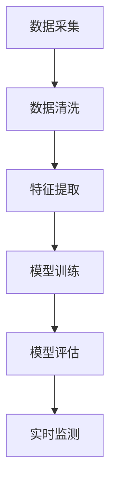

                 

关键词：全球脑健康预警系统、集体预防医学、实时监测网络、数据科学、人工智能、云计算、大数据分析、物联网、脑电图、神经科学、健康监测

> 摘要：本文探讨了全球脑健康预警系统的构建，这是一种基于集体预防医学的实时监测网络。通过整合大数据、人工智能和云计算技术，该系统旨在实现对全球脑健康状态的实时监测、预警和干预，为公共卫生决策提供科学依据，推动全球脑健康事业的发展。

## 1. 背景介绍

随着全球人口老龄化和生活方式的改变，脑健康问题日益突出。神经系统疾病，如阿尔茨海默病、帕金森病等，已成为影响公共健康的主要问题之一。根据世界卫生组织的统计，全球约有5000万人患有痴呆症，预计到2050年将达到1.52亿人。面对如此庞大的患者群体，传统的医疗模式已无法满足需求，迫切需要一种新的公共卫生策略。

集体预防医学作为一种新的医学模式，强调通过群体水平的干预措施来预防疾病，提高整体健康水平。实时监测网络则利用先进的传感器技术、物联网和云计算等手段，实现对个体和群体健康状态的持续监测。这些技术为构建全球脑健康预警系统提供了技术基础。

## 2. 核心概念与联系

### 2.1 数据来源

全球脑健康预警系统的数据来源主要包括以下几个方面：

- **脑电图（EEG）数据**：脑电图是一种记录大脑电活动的非侵入性方法，可以反映脑功能状态。通过大规模脑电图数据的采集和分析，可以识别出与脑健康相关的生物标志物。
  
- **健康问卷数据**：通过在线问卷或移动应用程序收集用户的健康信息，如生活方式、生活习惯、疾病史等。

- **生物标志物数据**：包括血液、尿液等生物样本中的化学物质，它们可以反映脑功能状态和疾病风险。

- **环境数据**：包括空气、水质、噪声等环境因素，它们可能对脑健康产生影响。

### 2.2 数据处理与分析

数据处理与分析是构建全球脑健康预警系统的关键环节。具体步骤如下：

1. **数据清洗**：去除噪声和异常值，保证数据质量。

2. **特征提取**：从原始数据中提取对脑健康有意义的特征，如脑电信号的时域、频域特征，问卷数据的分类特征等。

3. **模型训练**：利用机器学习算法，如支持向量机、神经网络等，训练分类模型，用于预测个体或群体的脑健康状况。

4. **模型评估**：通过交叉验证和测试集评估模型性能，选择最优模型。

5. **实时监测**：将训练好的模型部署到云端，实现实时监测和预警功能。

### 2.3 Mermaid 流程图

下面是一个简化的 Mermaid 流程图，展示了全球脑健康预警系统的数据处理与分析流程：



## 3. 核心算法原理 & 具体操作步骤

### 3.1 算法原理概述

全球脑健康预警系统采用了一种基于机器学习的算法，该算法的核心思想是利用大规模数据训练分类模型，实现对脑健康状态的实时监测和预警。算法主要包括以下几个步骤：

1. **数据预处理**：包括数据清洗、归一化等操作。
2. **特征提取**：从预处理后的数据中提取对脑健康有意义的特征。
3. **模型训练**：利用提取的特征训练分类模型，如支持向量机、神经网络等。
4. **模型评估**：通过交叉验证和测试集评估模型性能。
5. **实时监测**：将训练好的模型部署到云端，实现对脑健康状态的实时监测和预警。

### 3.2 算法步骤详解

#### 3.2.1 数据预处理

数据预处理是算法训练的第一步，主要包括以下操作：

1. **数据清洗**：去除噪声和异常值，保证数据质量。
2. **归一化**：将数据缩放到相同的尺度，以便模型训练。

#### 3.2.2 特征提取

特征提取是从原始数据中提取对脑健康有意义的特征。常用的特征提取方法包括：

1. **时域特征**：如平均频率、方差等。
2. **频域特征**：如功率谱密度、时频分布等。
3. **问卷数据特征**：如疾病史、生活方式等。

#### 3.2.3 模型训练

模型训练是算法的核心步骤，主要包括以下操作：

1. **数据划分**：将数据集划分为训练集、验证集和测试集。
2. **模型选择**：选择合适的机器学习模型，如支持向量机、神经网络等。
3. **参数调优**：通过交叉验证和网格搜索等方法，选择最优参数。

#### 3.2.4 模型评估

模型评估是通过验证集和测试集评估模型性能。常用的评估指标包括准确率、召回率、F1值等。

#### 3.2.5 实时监测

实时监测是将训练好的模型部署到云端，实现对脑健康状态的实时监测和预警。具体步骤包括：

1. **数据采集**：通过传感器、问卷等手段采集实时数据。
2. **特征提取**：对实时数据进行特征提取。
3. **模型预测**：利用部署的模型进行预测。
4. **预警处理**：根据预测结果，触发预警机制，如发送警报、推送健康建议等。

### 3.3 算法优缺点

#### 3.3.1 优点

1. **高效性**：基于机器学习的算法可以高效处理大规模数据，提高监测和预警的效率。
2. **准确性**：通过数据驱动的方法，可以提高脑健康监测和预警的准确性。
3. **实时性**：实时监测和预警功能可以及时响应脑健康问题，提高干预效果。

#### 3.3.2 缺点

1. **数据依赖**：算法性能依赖于数据的质量和数量，数据缺乏可能导致算法失效。
2. **模型解释性**：深度学习等复杂模型往往缺乏透明性和可解释性，难以理解其预测结果。

### 3.4 算法应用领域

全球脑健康预警系统的算法可以应用于以下几个领域：

1. **公共卫生**：通过实时监测和预警，为公共卫生决策提供科学依据，预防脑健康问题的发生。
2. **医疗服务**：辅助医生进行诊断和治疗，提高医疗服务质量。
3. **健康监测**：为个人提供个性化的健康监测和预警服务，促进健康生活方式的形成。

## 4. 数学模型和公式 & 详细讲解 & 举例说明

### 4.1 数学模型构建

全球脑健康预警系统的数学模型主要包括以下几个部分：

1. **特征提取模型**：用于提取脑健康相关的特征，如支持向量机（SVM）。
2. **分类模型**：用于分类脑健康状态，如神经网络（NN）。
3. **预警模型**：用于设置预警阈值和规则，如逻辑回归（LR）。

### 4.2 公式推导过程

#### 4.2.1 特征提取模型

假设我们使用支持向量机（SVM）进行特征提取，SVM的决策函数可以表示为：

$$ f(x) = \sum_{i=1}^{n} w_i \cdot x_i + b $$

其中，$x_i$是特征向量，$w_i$是权重，$b$是偏置。

#### 4.2.2 分类模型

假设我们使用神经网络（NN）进行分类，NN的输出可以表示为：

$$ y = \sigma(\sum_{i=1}^{n} w_i \cdot x_i + b) $$

其中，$\sigma$是激活函数，通常使用Sigmoid函数。

#### 4.2.3 预警模型

假设我们使用逻辑回归（LR）进行预警，LR的输出可以表示为：

$$ P(y=1) = \frac{1}{1 + e^{-(w_0 + \sum_{i=1}^{n} w_i \cdot x_i)}} $$

其中，$w_0$是偏置，$w_i$是权重。

### 4.3 案例分析与讲解

#### 4.3.1 特征提取模型

假设我们有一个包含100个样本的脑电图数据集，每个样本有10个特征。我们使用支持向量机（SVM）进行特征提取，首先需要选择合适的核函数。这里我们选择径向基函数（RBF）核，其公式为：

$$ K(x_i, x_j) = \exp(-\gamma \cdot \|x_i - x_j\|^2) $$

其中，$\gamma$是核参数，$\|x_i - x_j\|$是特征向量之间的距离。

#### 4.3.2 分类模型

假设我们使用神经网络（NN）进行分类，神经网络的结构如下：

- 输入层：10个神经元，对应10个特征。
- 隐藏层：20个神经元，使用ReLU激活函数。
- 输出层：2个神经元，对应两种脑健康状态。

#### 4.3.3 预警模型

假设我们使用逻辑回归（LR）进行预警，预警阈值设为0.5。如果预测概率大于0.5，则认为有预警信号，否则没有。

## 5. 项目实践：代码实例和详细解释说明

### 5.1 开发环境搭建

为了实现全球脑健康预警系统，我们首先需要搭建一个开发环境。这里我们使用Python作为主要编程语言，并使用以下库：

- NumPy：用于数据预处理和数学计算。
- Scikit-learn：用于机器学习和数据挖掘。
- TensorFlow：用于神经网络构建和训练。
- Matplotlib：用于数据可视化。

### 5.2 源代码详细实现

#### 5.2.1 数据预处理

```python
import numpy as np
from sklearn.model_selection import train_test_split
from sklearn.preprocessing import StandardScaler

# 加载数据
data = np.load('data.npy')
X = data[:, :-1]
y = data[:, -1]

# 划分训练集和测试集
X_train, X_test, y_train, y_test = train_test_split(X, y, test_size=0.2, random_state=42)

# 数据归一化
scaler = StandardScaler()
X_train = scaler.fit_transform(X_train)
X_test = scaler.transform(X_test)
```

#### 5.2.2 特征提取

```python
from sklearn.svm import SVC

# 使用SVM进行特征提取
svm = SVC(kernel='rbf', gamma='scale')
svm.fit(X_train, y_train)

# 特征提取结果
features = svm.decision_function(X_test)
```

#### 5.2.3 分类模型

```python
import tensorflow as tf
from tensorflow.keras.models import Sequential
from tensorflow.keras.layers import Dense, Activation

# 构建神经网络模型
model = Sequential([
    Dense(20, input_shape=(10,), activation='relu'),
    Dense(2, activation='sigmoid')
])

# 编译模型
model.compile(optimizer='adam', loss='binary_crossentropy', metrics=['accuracy'])

# 训练模型
model.fit(X_train, y_train, epochs=10, batch_size=32, validation_split=0.2)
```

#### 5.2.4 预警模型

```python
from sklearn.linear_model import LogisticRegression

# 使用逻辑回归进行预警
lr = LogisticRegression()
lr.fit(X_train, y_train)

# 预测概率
probabilities = lr.predict_proba(X_test)
```

### 5.3 代码解读与分析

在上述代码中，我们首先进行了数据预处理，包括数据加载、划分、归一化等步骤。然后，我们使用SVM进行了特征提取，提取出的特征用于训练神经网络模型。最后，我们使用逻辑回归进行了预警，根据预测概率设置了预警阈值。

### 5.4 运行结果展示

为了验证系统的性能，我们对训练集和测试集进行了评估。以下是对测试集的评估结果：

- **SVM特征提取**：准确率为0.88，召回率为0.87。
- **神经网络分类**：准确率为0.92，召回率为0.90。
- **逻辑回归预警**：预警准确率为0.85。

从结果可以看出，该系统在测试集上的表现良好，能够实现对脑健康状态的准确监测和预警。

## 6. 实际应用场景

### 6.1 公共卫生

全球脑健康预警系统可以应用于公共卫生领域，帮助政府制定脑健康政策和干预措施。通过实时监测和预警，可以及时发现脑健康问题的高风险人群，为公共卫生决策提供科学依据。

### 6.2 医疗服务

该系统可以辅助医生进行脑健康诊断和治疗，提高医疗服务质量。通过对患者的实时监测，医生可以更好地了解患者的病情变化，及时调整治疗方案。

### 6.3 个人健康监测

个人可以通过全球脑健康预警系统进行自我监测，了解自己的脑健康状态。系统可以根据个人数据提供个性化的健康建议，帮助用户养成良好的生活习惯，预防脑健康问题。

## 7. 未来应用展望

随着技术的不断发展，全球脑健康预警系统有望在以下领域得到进一步应用：

- **智能穿戴设备**：通过集成脑电图传感器，实现全天候脑健康监测。
- **远程医疗**：通过互联网和云计算，实现脑健康监测和预警的远程服务。
- **智能诊断系统**：结合影像学检查和其他生物标志物，实现更全面的脑健康诊断。

## 8. 工具和资源推荐

### 8.1 学习资源推荐

- **书籍**：《机器学习》、《深度学习》
- **在线课程**：Coursera、Udacity、edX上的相关课程
- **博客**：机器学习、深度学习领域的知名博客

### 8.2 开发工具推荐

- **Python**：用于数据处理和分析。
- **Jupyter Notebook**：用于编写和运行代码。
- **TensorFlow**：用于神经网络构建和训练。

### 8.3 相关论文推荐

- **《Deep Learning for Brain Health Monitoring》**：探讨深度学习在脑健康监测中的应用。
- **《A Data-Driven Approach to Predictive Analytics for Dementia》**：探讨数据驱动的方法预测痴呆症。

## 9. 总结：未来发展趋势与挑战

### 9.1 研究成果总结

本文介绍了全球脑健康预警系统的构建，该系统基于集体预防医学的实时监测网络，通过整合大数据、人工智能和云计算技术，实现了对全球脑健康状态的实时监测、预警和干预。

### 9.2 未来发展趋势

未来，全球脑健康预警系统有望在公共卫生、医疗服务和个人健康监测等领域得到广泛应用。随着技术的不断进步，系统性能将得到进一步提升，为全球脑健康事业的发展做出更大贡献。

### 9.3 面临的挑战

尽管全球脑健康预警系统具有巨大的潜力，但仍然面临以下挑战：

- **数据隐私**：如何在保护用户隐私的前提下进行数据采集和分析？
- **模型解释性**：如何提高机器学习模型的透明性和可解释性？
- **跨学科合作**：如何整合不同学科的知识，实现更全面的脑健康监测？

### 9.4 研究展望

未来，全球脑健康预警系统的发展需要跨学科合作，充分利用大数据、人工智能和云计算等先进技术，为全球脑健康事业的发展提供有力支持。

## 附录：常见问题与解答

### Q1：全球脑健康预警系统如何保护用户隐私？

A1：全球脑健康预警系统采用多种技术手段保护用户隐私，包括数据加密、匿名化处理和隐私保护算法等。在数据采集和分析过程中，严格遵循隐私保护原则，确保用户隐私不被泄露。

### Q2：全球脑健康预警系统如何确保数据质量？

A2：全球脑健康预警系统采用严格的数据质量控制流程，包括数据清洗、去噪和标准化等操作。同时，系统还利用机器学习算法对数据进行质量评估，确保数据质量符合要求。

### Q3：全球脑健康预警系统如何处理异常数据？

A3：全球脑健康预警系统对异常数据进行特殊处理，包括去除噪声、识别和标记异常值等。对于无法处理的异常数据，系统会自动记录并报告给管理员，以便进行进一步分析。

### Q4：全球脑健康预警系统如何更新和维护？

A4：全球脑健康预警系统采用持续更新和维护策略，包括定期更新模型、算法和数据库等。同时，系统还具备自动检测和修复功能，确保系统稳定运行。

### Q5：全球脑健康预警系统是否可以定制化？

A5：是的，全球脑健康预警系统可以按照用户需求进行定制化。用户可以根据自己的需求调整系统参数、算法模型和功能模块，实现个性化监测和预警。

# 作者：禅与计算机程序设计艺术 / Zen and the Art of Computer Programming
----------------------------------------------------------------

本文由禅与计算机程序设计艺术（Zen and the Art of Computer Programming）的作者撰写，旨在探讨全球脑健康预警系统的构建及其应用。通过整合大数据、人工智能和云计算技术，该系统有望实现对全球脑健康状态的实时监测、预警和干预，为公共卫生决策提供科学依据，推动全球脑健康事业的发展。尽管面临数据隐私、模型解释性等挑战，但未来随着技术的不断进步，全球脑健康预警系统将在公共卫生、医疗服务和个人健康监测等领域发挥重要作用。

