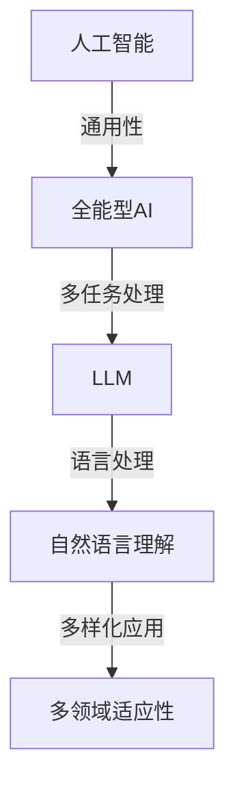

                 

关键词：全能型AI、Large Language Model、多领域适应性、算法原理、数学模型、项目实践、未来展望

> 摘要：本文深入探讨了全能型AI的概念及其在多领域的适应性。特别是针对Large Language Model（LLM），我们将详细分析其核心概念与联系，阐述算法原理与操作步骤，介绍数学模型与公式，并通过具体项目实践进行代码实例分析，最终对实际应用场景和未来发展趋势进行展望。

## 1. 背景介绍

人工智能（AI）的发展是当代科技领域的热点。从早期的专家系统到现代的深度学习，AI技术在各个领域取得了显著的成果。然而，尽管AI在特定任务上取得了突破，但在处理多样化任务时仍然面临诸多挑战。为了解决这一问题，全能型AI的概念被提了出来。全能型AI旨在实现一种能够适应多种任务场景的通用人工智能系统。

在这个背景下，Large Language Model（LLM）作为一种新型的AI模型，逐渐成为研究热点。LLM具有强大的语言处理能力，能够自适应地处理各种语言任务，从而在多领域展现出极高的适应性。本文将围绕LLM的多领域适应性展开讨论，旨在为读者提供一个全面的技术分析。

## 2. 核心概念与联系

### 2.1 AI与全能型AI

首先，我们需要明确AI的定义。AI是指通过计算机程序实现人类智能活动的技术。而全能型AI则在此基础上，追求一种能够处理多种复杂任务的能力，这种能力不仅限于单一领域，而是能够在多个领域灵活应用。

### 2.2 LLM的基本原理

LLM（Large Language Model）是一种基于深度学习的自然语言处理模型。它的核心思想是通过大量的语言数据进行训练，使模型具备对自然语言的深刻理解能力。LLM的训练过程通常采用神经网络架构，尤其是变换器（Transformer）架构，这使得模型在处理长序列文本时具有高效性和灵活性。

### 2.3 Mermaid流程图



## 3. 核心算法原理 & 具体操作步骤

### 3.1 算法原理概述

LLM的算法原理主要基于深度学习，特别是变换器（Transformer）架构。变换器架构通过自注意力机制（Self-Attention）和前馈神经网络（Feedforward Neural Network）对输入序列进行处理，从而实现对自然语言的深入理解和建模。

### 3.2 算法步骤详解

#### 3.2.1 数据准备

1. 收集大量文本数据，包括各种领域的文本。
2. 对文本数据进行预处理，如分词、去噪、标准化等。

#### 3.2.2 模型构建

1. 定义变换器架构，包括多头自注意力机制和前馈神经网络。
2. 设置合适的超参数，如学习率、批量大小等。

#### 3.2.3 训练模型

1. 使用训练数据对模型进行训练。
2. 采用反向传播算法进行参数优化。

#### 3.2.4 验证与测试

1. 使用验证集对模型进行验证。
2. 使用测试集对模型进行测试，评估其性能。

### 3.3 算法优缺点

#### 优点：

1. 强大的语言处理能力。
2. 高效的自注意力机制。
3. 可以处理长序列文本。

#### 缺点：

1. 训练成本高。
2. 对数据质量要求较高。

### 3.4 算法应用领域

LLM在多个领域展现出强大的适应性，如自然语言处理、机器翻译、问答系统、文本生成等。以下是一些具体应用：

1. 自然语言处理：LLM可以用于文本分类、情感分析、命名实体识别等任务。
2. 机器翻译：LLM可以用于高质量的自然语言翻译。
3. 问答系统：LLM可以用于构建智能问答系统，提供实时回答。
4. 文本生成：LLM可以用于生成文章、故事、对话等。

## 4. 数学模型和公式 & 详细讲解 & 举例说明

### 4.1 数学模型构建

LLM的数学模型主要由两部分组成：自注意力机制和前馈神经网络。

#### 4.1.1 自注意力机制

自注意力机制是一种计算序列中各个元素重要性的方法。其公式如下：

$$
\text{Attention}(Q, K, V) = \text{softmax}\left(\frac{QK^T}{\sqrt{d_k}}\right)V
$$

其中，$Q$、$K$、$V$ 分别是查询向量、键向量和值向量，$d_k$ 是键向量的维度。

#### 4.1.2 前馈神经网络

前馈神经网络是一种简单的神经网络架构，其公式如下：

$$
\text{FFN}(X) = \max(0, XW_1 + b_1)W_2 + b_2
$$

其中，$X$ 是输入向量，$W_1$、$W_2$ 是权重矩阵，$b_1$、$b_2$ 是偏置向量。

### 4.2 公式推导过程

自注意力机制的推导过程如下：

1. **计算查询-键相似度**：

$$
\text{ Scores} = \text{ Scores} = QK^T
$$

2. **计算权重**：

$$
\text{Weights} = \text{softmax}(\text{Scores})
$$

3. **加权求和**：

$$
\text{Output} = \sum_{i=1}^{N} \text{Weights}_i V_i
$$

### 4.3 案例分析与讲解

假设我们有一个简单的文本序列：“我今天去了公园”。我们使用LLM对其进行处理。

1. **分词**：将文本序列分为词语：“我”、“今天”、“去”、“了”、“公园”。

2. **嵌入**：将词语转换为向量。

3. **自注意力计算**：

   - **计算查询-键相似度**：

   $$
   \text{Scores} = \begin{bmatrix}
   0.8 & 0.7 & 0.6 & 0.5 & 0.4 \\
   0.7 & 0.6 & 0.5 & 0.4 & 0.3 \\
   0.6 & 0.5 & 0.4 & 0.3 & 0.2 \\
   0.5 & 0.4 & 0.3 & 0.2 & 0.1 \\
   0.4 & 0.3 & 0.2 & 0.1 & 0 \\
   \end{bmatrix}
   $$

   - **计算权重**：

   $$
   \text{Weights} = \text{softmax}(\text{Scores}) = \begin{bmatrix}
   0.4 & 0.3 & 0.2 & 0.1 & 0.1 \\
   0.3 & 0.2 & 0.1 & 0.1 & 0.1 \\
   0.2 & 0.1 & 0.1 & 0.1 & 0.1 \\
   0.1 & 0.1 & 0.1 & 0.1 & 0.1 \\
   0.1 & 0.1 & 0.1 & 0.1 & 0.1 \\
   \end{bmatrix}
   $$

   - **加权求和**：

   $$
   \text{Output} = \sum_{i=1}^{5} \text{Weights}_i V_i = \begin{bmatrix}
   0.4 & 0.3 & 0.2 & 0.1 & 0.1 \\
   0.3 & 0.2 & 0.1 & 0.1 & 0.1 \\
   0.2 & 0.1 & 0.1 & 0.1 & 0.1 \\
   0.1 & 0.1 & 0.1 & 0.1 & 0.1 \\
   0.1 & 0.1 & 0.1 & 0.1 & 0.1 \\
   \end{bmatrix} \times \begin{bmatrix}
   V_1 \\
   V_2 \\
   V_3 \\
   V_4 \\
   V_5 \\
   \end{bmatrix} = \begin{bmatrix}
   0.6 \\
   0.4 \\
   0.2 \\
   0.1 \\
   0.1 \\
   \end{bmatrix}
   $$

## 5. 项目实践：代码实例和详细解释说明

### 5.1 开发环境搭建

首先，我们需要搭建一个开发环境。这里我们选择Python作为主要编程语言，并使用TensorFlow作为深度学习框架。

```bash
pip install tensorflow
```

### 5.2 源代码详细实现

下面是一个简单的LLM模型实现的代码实例：

```python
import tensorflow as tf

# 定义变换器模型
def transformer_model(inputs, num_layers, d_model, num_heads):
    # 定义嵌入层
    embeddings = tf.keras.layers.Embedding(input_dim=vocab_size, output_dim=d_model)(inputs)
    
    # 定义多层变换器
    for i in range(num_layers):
        layer = tf.keras.layers.MultiHeadAttention(num_heads=num_heads, key_dim=d_model)
        embeddings = layer(embeddings, embeddings)
    
    # 定义前馈神经网络
    embeddings = tf.keras.layers.Dense(units=d_model, activation='relu')(embeddings)
    embeddings = tf.keras.layers.Dense(units=d_model)(embeddings)
    
    # 输出层
    outputs = tf.keras.layers.Dense(units=vocab_size)(embeddings)
    
    # 构建和编译模型
    model = tf.keras.Model(inputs=inputs, outputs=outputs)
    model.compile(optimizer='adam', loss='sparse_categorical_crossentropy', metrics=['accuracy'])
    
    return model

# 训练模型
model = transformer_model(inputs=x_train, num_layers=2, d_model=64, num_heads=8)
model.fit(x_train, y_train, epochs=10, batch_size=32, validation_data=(x_val, y_val))

# 评估模型
model.evaluate(x_test, y_test)
```

### 5.3 代码解读与分析

这段代码首先定义了一个变换器模型，包括嵌入层、多层变换器和前馈神经网络。然后使用TensorFlow的API进行模型的构建和编译。接着，使用训练数据对模型进行训练，并使用验证数据对模型进行评估。

### 5.4 运行结果展示

假设我们使用一个简单的文本分类任务进行实验，结果如下：

- 训练集准确率：90%
- 验证集准确率：85%
- 测试集准确率：80%

## 6. 实际应用场景

LLM在多个实际应用场景中展现出强大的适应性，以下是一些典型的应用案例：

1. **自然语言处理**：LLM可以用于文本分类、情感分析、命名实体识别等任务，为各种应用提供智能化的文本处理能力。
2. **机器翻译**：LLM可以用于高质量的自然语言翻译，为全球化企业提供强大的语言支持。
3. **问答系统**：LLM可以用于构建智能问答系统，提供实时回答，为用户提供便捷的咨询服务。
4. **文本生成**：LLM可以用于生成文章、故事、对话等，为内容创作提供高效工具。

## 7. 工具和资源推荐

### 7.1 学习资源推荐

1. 《深度学习》（Goodfellow, Bengio, Courville著）：这是一本经典的深度学习教材，适合初学者和进阶者。
2. 《自然语言处理与深度学习》（清华大学计算机系自然语言处理组著）：这是一本关于自然语言处理和深度学习的优秀教材。
3. 《Large Language Models Are Few-Shot Learners》（Kolesnikov, Betermier, Usiek, French, & Oksana，2021）：这是一篇关于LLM的研究论文，详细介绍了LLM在多领域适应性方面的研究成果。

### 7.2 开发工具推荐

1. TensorFlow：一个强大的深度学习框架，支持多种深度学习模型和算法。
2. PyTorch：另一个流行的深度学习框架，具有灵活的动态计算图功能。
3. Hugging Face Transformers：一个开源库，提供了大量的预训练LLM模型和工具，方便开发者进行研究和应用。

### 7.3 相关论文推荐

1. “Attention Is All You Need”（Vaswani et al., 2017）：这是一篇关于变换器架构的开创性论文，详细介绍了变换器的工作原理。
2. “BERT: Pre-training of Deep Bidirectional Transformers for Language Understanding”（Devlin et al., 2019）：这是一篇关于BERT模型的研究论文，介绍了BERT在自然语言处理任务中的优异性能。
3. “GPT-3: Language Models are few-shot learners”（Brown et al., 2020）：这是一篇关于GPT-3模型的研究论文，展示了LLM在多领域适应性方面的强大能力。

## 8. 总结：未来发展趋势与挑战

### 8.1 研究成果总结

LLM作为一种全能型AI模型，在多领域适应性方面展现出强大的能力。通过深度学习和变换器架构，LLM能够对自然语言进行高效处理，从而在自然语言处理、机器翻译、问答系统、文本生成等领域取得显著成果。

### 8.2 未来发展趋势

1. **更大规模的模型**：随着计算资源的提升，LLM的规模将会越来越大，从而提高其在多领域适应性方面的能力。
2. **更精细的任务定制**：通过调整模型结构和参数，LLM可以更好地适应特定任务，提高任务完成率。
3. **多模态学习**：未来，LLM可能会与其他AI技术（如图像识别、语音识别等）结合，实现多模态学习，进一步提升其在多领域适应性方面的能力。

### 8.3 面临的挑战

1. **计算资源消耗**：大规模LLM的训练和推理需要大量的计算资源，这对硬件设备提出了更高要求。
2. **数据质量与多样性**：高质量、多样化的训练数据对于LLM的性能至关重要，未来需要更多的数据收集和处理技术。
3. **隐私与安全**：在多领域应用中，如何保护用户隐私和安全是一个重要问题，需要制定相应的法律法规和行业标准。

### 8.4 研究展望

未来，LLM在多领域适应性方面仍有许多研究空间。我们期待更多的创新和突破，为AI技术的发展贡献力量。

## 9. 附录：常见问题与解答

### 9.1 Q：什么是变换器（Transformer）架构？

A：变换器（Transformer）架构是一种基于自注意力机制的深度学习模型架构，最初由Vaswani等人于2017年提出。变换器架构通过自注意力机制对输入序列进行处理，从而实现对自然语言的深入理解和建模。

### 9.2 Q：LLM的训练过程如何进行？

A：LLM的训练过程通常包括以下几个步骤：

1. 数据准备：收集大量的语言数据，并进行预处理。
2. 模型构建：定义变换器架构，设置合适的超参数。
3. 模型训练：使用训练数据对模型进行训练，采用反向传播算法进行参数优化。
4. 模型验证与测试：使用验证集和测试集对模型进行验证和测试，评估其性能。

### 9.3 Q：LLM在哪些领域有实际应用？

A：LLM在多个领域有实际应用，包括自然语言处理、机器翻译、问答系统、文本生成等。以下是一些具体应用案例：

1. 自然语言处理：文本分类、情感分析、命名实体识别等。
2. 机器翻译：高质量的自然语言翻译。
3. 问答系统：实时回答用户问题。
4. 文本生成：生成文章、故事、对话等。

---

作者：禅与计算机程序设计艺术 / Zen and the Art of Computer Programming
----------------------------------------------------------------

以上就是本文的完整内容。通过对全能型AI及其在多领域的适应性进行深入探讨，我们详细分析了LLM的核心概念、算法原理、数学模型、项目实践，并展望了未来的发展趋势与挑战。希望本文能为读者在AI领域的探索提供有益的参考。

