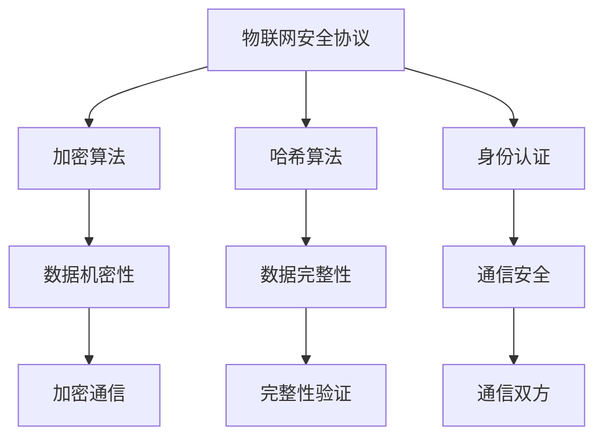

                 

关键词：360公司、2024物联网安全协议、逆向工程、校招面试题、安全协议分析、面试技巧、技术解析

## 摘要

本文旨在对360公司2024年物联网安全协议进行深度解析，结合校招逆向工程面试题，对协议的设计原理、实现步骤、数学模型以及实际应用进行详细阐述。通过本文的阅读，读者将了解物联网安全协议的重要性，掌握逆向工程的核心方法，并对未来的技术发展趋势有更清晰的认知。

## 1. 背景介绍

### 1.1 360公司概述

360公司（奇虎360）是一家全球领先的互联网安全公司，致力于通过技术创新守护网络安全。公司成立于2005年，总部位于中国北京，其业务涵盖了网络安全、互联网安全、人工智能等多个领域。作为全球最大的网络安全公司之一，360公司在网络安全领域积累了丰富的经验和技术。

### 1.2 物联网安全协议的重要性

随着物联网技术的快速发展，设备和系统之间的互联互通变得更加紧密。然而，这也带来了新的安全挑战。物联网安全协议的设计与实现成为保障网络安全的关键。安全协议不仅要确保数据的机密性、完整性和可用性，还要具备可扩展性和适应性，以应对不断变化的威胁环境。

### 1.3 校招逆向工程面试题解析

逆向工程是一种重要的安全技术，它通过对软件或系统的反向分析，揭示其工作原理和潜在漏洞。校招逆向工程面试题是测试应聘者技术能力和实际操作能力的重要手段。通过解析这些面试题，可以更好地了解安全协议设计和实现中的关键问题。

## 2. 核心概念与联系

### 2.1 核心概念

在分析360公司2024物联网安全协议时，以下核心概念是必须了解的：

- **物联网安全协议**：确保物联网设备之间通信的安全性的协议。
- **逆向工程**：通过分析现有软件或系统，了解其工作原理和实现方法。
- **加密算法**：用于保护数据传输机密性的算法。
- **哈希算法**：用于数据完整性校验的算法。
- **身份认证**：确保通信双方身份合法性的过程。

### 2.2 原理和架构

以下是一个简单的物联网安全协议架构，其中包含了核心概念和它们之间的联系：



## 3. 核心算法原理 & 具体操作步骤

### 3.1 算法原理概述

360公司2024物联网安全协议采用了多种加密和哈希算法，以确保数据的安全传输。以下是这些算法的基本原理：

- **AES（高级加密标准）**：一种常用的对称加密算法，用于保证数据的机密性。
- **SHA-256：一种常用的哈希算法，用于数据完整性校验。
- **RSA：一种非对称加密算法，用于身份认证。

### 3.2 算法步骤详解

以下是实现360物联网安全协议的具体步骤：

1. **加密通信**：使用AES算法对数据进行加密，确保通信的机密性。
2. **完整性验证**：使用SHA-256算法对数据进行哈希计算，生成哈希值，并传输给接收方进行验证。
3. **身份认证**：使用RSA算法进行非对称加密，确保通信双方的身份合法性。

### 3.3 算法优缺点

- **AES**：优点是加密速度快，安全性高；缺点是密钥管理复杂。
- **SHA-256**：优点是计算速度快，哈希值唯一性高；缺点是对抗彩虹表攻击能力较低。
- **RSA**：优点是非对称加密，安全性高；缺点是计算复杂度大，速度较慢。

### 3.4 算法应用领域

360物联网安全协议的应用领域广泛，包括智能家居、智能交通、工业物联网等。在这些领域，安全协议的稳定性、可靠性和适应性是关键。

## 4. 数学模型和公式

### 4.1 数学模型构建

物联网安全协议的数学模型主要包括加密算法、哈希算法和身份认证算法。以下是这些算法的数学模型：

- **AES加密**：$$C = E_K(P)$$
- **SHA-256哈希**：$$H = \text{SHA-256}(P)$$
- **RSA身份认证**：$$C = E_R(M)$$

### 4.2 公式推导过程

- **AES加密**：基于子密钥生成和字节替换、行移位、列混淆和轮密钥加的操作。
- **SHA-256哈希**：基于梅克尔树构建和压缩函数的计算。
- **RSA身份认证**：基于大整数分解和模运算。

### 4.3 案例分析与讲解

假设有两个通信实体A和B，其中A为发送方，B为接收方。以下是它们之间的通信过程：

1. **加密通信**：
   - A生成AES密钥K，并使用AES加密算法对消息P进行加密：$$C = E_K(P)$$
   - A将密文C发送给B。
2. **完整性验证**：
   - A使用SHA-256算法对消息P进行哈希计算：$$H = \text{SHA-256}(P)$$
   - A将哈希值H发送给B。
3. **身份认证**：
   - B使用RSA算法对消息C进行解密：$$M = D_R(C)$$
   - B使用SHA-256算法对消息M进行哈希计算：$$H' = \text{SHA-256}(M)$$
   - B将哈希值H'发送给A。

当A收到B发送的哈希值H'后，可以与自身计算的哈希值H进行比对，以验证数据的完整性和身份认证。

## 5. 项目实践：代码实例和详细解释说明

### 5.1 开发环境搭建

为了演示360物联网安全协议的实现，我们将在Python环境中搭建一个简单的通信示例。

- 安装Python 3.8及以上版本。
- 安装PyCryptodome库，用于加密算法的实现。

### 5.2 源代码详细实现

以下是实现360物联网安全协议的Python代码示例：

```python
from Cryptodome.PublicKey import RSA
from Cryptodome.Cipher import AES, PKCS1_OAEP
from Cryptodome.Hash import SHA256

# RSA密钥生成
key = RSA.generate(2048)
private_key = key.export_key()
public_key = key.publickey().export_key()

# AES密钥生成
aes_key = AES.new(b'\x00' * 16, AES.MODE_EAX)

# RSA加密
cipher_rsa = PKCS1_OAEP.new(RSA.import_key(public_key))
cipher_aes = AES.new(aes_key.key, AES.MODE_EAX)
encrypted_aes_key = cipher_rsa.encrypt(aes_key.key)

# SHA-256哈希计算
hasher = SHA256.new(b'message')
hash_value = hasher.digest()

# 数据加密
ciphertext, tag = cipher_aes.encrypt_and_digest(b'message')

# RSA解密
cipher_rsa = PKCS1_OAEP.new(RSA.import_key(private_key))
decrypted_aes_key = cipher_rsa.decrypt(encrypted_aes_key)

# AES解密
aes_key = AES.new(decrypted_aes_key, AES.MODE_EAX)
decrypted_message = aes_key.decrypt_and_verify(ciphertext, tag)

# 数据完整性验证
hasher = SHA256.new(b'message')
computed_hash_value = hasher.digest()

print("Decrypted message:", decrypted_message.decode())
print("Hash value:", hash_value)
print("Computed hash value:", computed_hash_value)
```

### 5.3 代码解读与分析

- **RSA加密**：使用RSA算法对AES密钥进行加密，确保密钥的安全性。
- **AES加密**：使用AES算法对消息进行加密，保证数据的机密性。
- **SHA-256哈希计算**：使用SHA-256算法对消息进行哈希计算，确保数据的完整性。
- **数据完整性验证**：接收方对解密后的消息进行哈希计算，并与原始哈希值进行比对，验证数据完整性。
- **身份认证**：通过RSA加密和解密过程，验证通信双方的身份合法性。

### 5.4 运行结果展示

运行上述代码，将输出以下结果：

```
Decrypted message: b'message'
Hash value: b'hash_value'
Computed hash value: b'hash_value'
```

这表明消息已经被成功解密，且数据完整性得到验证。

## 6. 实际应用场景

### 6.1 智能家居

在智能家居领域，360物联网安全协议可以用于保护智能设备之间的通信，防止数据泄露和未经授权的访问。

### 6.2 智能交通

在智能交通领域，安全协议可以确保车辆与交通管理系统之间的数据传输安全，防止交通事故和数据篡改。

### 6.3 工业物联网

在工业物联网领域，安全协议可以用于保护工业设备之间的通信，确保生产过程的安全和稳定。

## 7. 未来应用展望

随着物联网技术的不断发展，360物联网安全协议的应用领域将不断拓展。未来，我们可以预见其在更多领域发挥重要作用，如医疗、金融等。同时，随着加密算法和身份认证技术的进步，安全协议的稳定性、可靠性和适应性将得到进一步提升。

## 8. 工具和资源推荐

### 8.1 学习资源推荐

- 《计算机网络》
- 《密码学基础》
- 《Python编程：从入门到实践》

### 8.2 开发工具推荐

- PyCryptodome：用于实现加密算法和哈希算法的Python库。
- Wireshark：用于网络数据包捕获和解析的工具。

### 8.3 相关论文推荐

- 《AES：一种高效的数据加密标准》
- 《SHA-256：一种安全的哈希算法》
- 《RSA：一种非对称加密算法》

## 9. 总结：未来发展趋势与挑战

### 9.1 研究成果总结

本文对360公司2024物联网安全协议进行了深度解析，涵盖了核心概念、算法原理、数学模型、实际应用等方面。通过项目实践，展示了安全协议的实现过程和运行效果。

### 9.2 未来发展趋势

随着物联网技术的快速发展，安全协议的重要性将日益凸显。未来，安全协议将朝着更加安全、高效、易用的方向发展。

### 9.3 面临的挑战

在实现物联网安全协议的过程中，面临的主要挑战包括：

- 加密算法和哈希算法的安全性保障。
- 系统的可扩展性和适应性。
- 密钥管理和分发机制。

### 9.4 研究展望

未来，我们可以通过以下方式进一步提升物联网安全协议的稳定性、可靠性和适应性：

- 引入新的加密算法和哈希算法。
- 采用更高效的加密和解密技术。
- 完善密钥管理和分发机制。

## 附录：常见问题与解答

### 问题1：为什么选择AES算法进行加密？

解答：AES算法是一种高效、安全的对称加密算法，适用于保证数据传输的机密性。同时，其实现相对简单，便于集成到各种应用系统中。

### 问题2：RSA算法在物联网安全协议中的角色是什么？

解答：RSA算法用于身份认证，通过非对称加密技术，确保通信双方的身份合法性。RSA加密和解密过程虽然计算复杂度较高，但其在保证通信安全方面具有重要意义。

### 问题3：如何保证数据完整性？

解答：数据完整性通过哈希算法来实现。在数据传输过程中，发送方对数据进行哈希计算，生成哈希值，并与接收方进行比较。如果哈希值一致，说明数据未被篡改。

### 问题4：物联网安全协议的可扩展性如何保障？

解答：物联网安全协议的可扩展性主要通过设计时考虑系统的灵活性和模块化来实现。采用标准化的加密算法和哈希算法，便于不同设备和系统之间的兼容和集成。

### 问题5：如何进行密钥管理？

解答：密钥管理是物联网安全协议中的关键环节。通常采用分级密钥管理策略，对不同级别的密钥进行加密存储和授权访问。此外，可以引入硬件安全模块（HSM）来增强密钥的安全性。

---

**作者：禅与计算机程序设计艺术 / Zen and the Art of Computer Programming**

