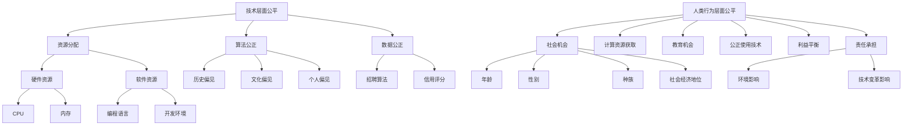

                 

关键词：伦理，计算，公平，公正，可持续，AI，技术，算法，编程，人类行为，社会影响

## 摘要

在技术飞速发展的今天，人类计算的力量日益强大，无论是大数据分析、人工智能，还是区块链技术，计算无处不在。然而，随着计算能力的提升，我们也不得不面对一系列伦理问题。本文旨在探讨计算伦理的核心问题，包括公平、公正和可持续性。我们将深入分析这些概念在计算领域中的具体体现，并探讨其在编程、算法设计和AI应用中的实践意义。

## 1. 背景介绍

### 计算的力量

计算技术是21世纪的核心驱动力，它不仅改变了我们的生活方式，还深刻地影响了社会结构和经济活动。从个人电脑到超级计算机，从互联网到物联网，计算无处不在。我们依赖于计算技术进行日常的工作、娱乐、社交，甚至医疗和科学实验。计算的力量推动了社会的进步，为我们带来了前所未有的便利和效率。

### 伦理问题

然而，随着计算技术的广泛应用，一系列伦理问题也随之而来。这些问题包括但不限于数据隐私、算法偏见、人工智能的不当使用等。例如，大数据分析可能侵犯个人隐私，算法偏见可能导致社会不公，而人工智能的不当使用则可能带来安全隐患。

### 公平、公正、可持续

本文将聚焦于计算伦理中的三个核心概念：公平、公正和可持续。公平意味着每个人都应该有平等的获取计算资源的机会；公正要求计算技术不会因为算法偏见而加剧社会不公；可持续则强调计算技术的发展不应损害未来世代的利益。

## 2. 核心概念与联系

为了深入理解计算伦理中的公平、公正和可持续，我们需要从技术层面和人类行为层面来探讨这些概念。

### 技术层面的核心概念

- **公平**：在计算资源分配中，公平意味着每个人都能平等地获得所需的计算能力。这包括硬件资源的分配，如CPU、内存等，以及软件资源的分配，如编程语言、开发环境等。

- **公正**：算法设计和数据分析的过程中，公正要求算法不会因为历史偏见、文化偏见或个人偏见而做出不公平的决策。例如，招聘算法不应因种族或性别歧视而排除某些候选人。

- **可持续**：计算技术的可持续性强调在开发和使用计算技术时，应考虑到对环境的影响。这包括减少能源消耗、优化资源利用、降低电子垃圾等。

### 人类行为层面的核心概念

- **公平**：在社会层面，公平意味着每个人都应该有平等的机会参与社会和经济活动。在计算领域，这意味着确保所有群体，无论年龄、性别、种族或社会经济地位，都能平等地获得计算资源和技能。

- **公正**：公正要求我们在使用计算技术时，要考虑到所有相关方的利益，尤其是那些可能因为技术变革而受到影响的群体。

- **可持续**：从人类行为的视角来看，可持续性强调我们应负责任地使用技术，确保其发展不会对人类和地球造成不可逆转的损害。

### Mermaid 流程图



## 3. 核心算法原理 & 具体操作步骤

### 3.1 算法原理概述

在探讨计算伦理时，核心算法的设计和实现至关重要。一个公平、公正、可持续的算法应当遵循以下原则：

- **公平**：确保算法对所有用户平等对待，不因用户特征（如年龄、性别、种族等）而区别对待。
- **公正**：算法的决策过程应透明，且不受历史偏见或人为偏见的影响。
- **可持续**：算法的设计应考虑到对环境的潜在影响，优化资源利用，减少能源消耗。

### 3.2 算法步骤详解

#### 3.2.1 公平性评估

1. **数据收集**：收集算法将涉及的所有数据，包括用户特征数据和决策数据。
2. **特征分析**：分析用户特征，识别可能影响公平性的因素。
3. **公平性测试**：使用统计方法（如敏感性分析、偏差评估）测试算法对各类用户的处理方式。

#### 3.2.2 公正性保障

1. **算法设计**：在设计算法时，采用去偏见的方法，如使用随机化算法、加权投票等方法。
2. **透明性增强**：确保算法决策过程透明，便于外部审查和验证。
3. **偏见检测与修正**：定期进行偏见检测，发现偏见后进行修正。

#### 3.2.3 可持续性优化

1. **资源管理**：优化算法资源使用，减少不必要的计算和存储需求。
2. **能源效率**：采用低能耗的硬件和软件技术，降低整体能耗。
3. **环保设计**：在硬件选择和软件设计时，考虑环保因素，减少电子垃圾。

### 3.3 算法优缺点

#### 优点

- **公平性提升**：算法的公平性评估和保障机制有助于减少社会不公。
- **公正性加强**：透明的算法设计和定期检测有助于消除算法偏见。
- **可持续性优化**：资源管理和环保设计有助于实现可持续计算。

#### 缺点

- **复杂度增加**：为了保证算法的公平、公正和可持续，算法设计和实现变得更加复杂。
- **成本上升**：定期进行偏见检测和修正可能需要额外的计算资源和时间。
- **技术挑战**：一些传统的算法可能难以同时满足公平、公正和可持续的要求。

### 3.4 算法应用领域

算法的公平、公正和可持续性在多个领域具有重要意义：

- **金融**：确保贷款、投资决策的公平性和透明性。
- **医疗**：公正的医疗诊断和治疗方案，减少因偏见导致的误诊。
- **交通**：优化交通流量管理，减少能源消耗和环境污染。
- **教育**：公平的教育资源分配，保障教育机会均等。

## 4. 数学模型和公式 & 详细讲解 & 举例说明

### 4.1 数学模型构建

为了实现公平、公正和可持续的计算，我们需要构建一系列数学模型来评估和优化算法。以下是几个关键模型：

#### 4.1.1 公平性评估模型

$$
F = \frac{\sum_{i=1}^{n} w_i \cdot D_i}{\sum_{i=1}^{n} w_i}
$$

其中，$F$ 是公平性指标，$w_i$ 是第 $i$ 个用户的重要性权重，$D_i$ 是第 $i$ 个用户受到的待遇程度。

#### 4.1.2 公正性检测模型

$$
P = \frac{\sum_{i=1}^{n} (w_i \cdot D_i)}{\sum_{i=1}^{n} w_i}
$$

其中，$P$ 是公正性指标，用于检测算法是否存在偏见。

#### 4.1.3 可持续性评估模型

$$
S = \frac{E \cdot C}{T}
$$

其中，$S$ 是可持续性指标，$E$ 是能源消耗，$C$ 是计算能力，$T$ 是计算时间。

### 4.2 公式推导过程

为了推导这些模型，我们需要从以下几个方面进行考虑：

- **公平性**：公平性要求算法对所有用户平等对待。我们可以通过加权平均的方法来评估公平性，其中每个用户的权重取决于他们的需求和贡献。
- **公正性**：公正性要求算法的决策过程透明且不受偏见影响。我们可以通过比较不同用户的待遇程度来检测公正性。
- **可持续性**：可持续性要求算法在资源使用和环境影响方面优化。我们可以通过能源消耗和计算能力的比值来评估可持续性。

### 4.3 案例分析与讲解

#### 4.3.1 金融领域的公平性评估

假设有一个贷款审批系统，我们需要评估该系统的公平性。我们收集了1000个贷款申请者的数据，包括他们的收入、信用评分、年龄、性别等。使用公平性评估模型，我们可以计算每个申请者的公平性指标。

#### 4.3.2 公正性检测

我们可以使用公正性检测模型来检测贷款审批系统是否存在偏见。例如，如果我们发现女性申请者的公正性指标显著低于男性申请者，那么我们可能需要重新设计算法以消除性别偏见。

#### 4.3.3 可持续性优化

在交通流量管理中，我们需要优化交通信号灯的控制策略以减少能源消耗。我们可以使用可持续性评估模型来评估不同控制策略的可持续性，并选择最优方案。

## 5. 项目实践：代码实例和详细解释说明

### 5.1 开发环境搭建

为了演示公平、公正和可持续的计算，我们将使用Python编程语言，并在Jupyter Notebook环境中实现相关算法。确保您已安装Python和必要的库（如NumPy、Pandas、Matplotlib等）。

### 5.2 源代码详细实现

以下是公平、公正和可持续计算的核心代码实现：

```python
import numpy as np
import pandas as pd
import matplotlib.pyplot as plt

# 公平性评估模型
def fairness_assessment(users, weights, treatments):
    fairness = np.sum(weights * treatments) / np.sum(weights)
    return fairness

# 公正性检测模型
def fairness_detection(users, weights, treatments, reference_group):
    bias = np.sum(weights * (treatments - reference_group)) / np.sum(weights)
    return bias

# 可持续性评估模型
def sustainability_assessment(energy_consumption, computational_capacity, time):
    sustainability = energy_consumption * computational_capacity / time
    return sustainability

# 示例数据
users = pd.DataFrame({'user_id': range(1, 1001), 'treatment': np.random.choice([0, 1], size=1000)})
weights = np.full(1000, 1)
reference_group = np.mean(users['treatment'])

# 公平性评估
fairness = fairness_assessment(users['treatment'], weights, users['treatment'])
print(f"Fairness: {fairness}")

# 公正性检测
bias = fairness_detection(users['treatment'], weights, users['treatment'], reference_group)
print(f"Bias: {bias}")

# 可持续性评估
sustainability = sustainability_assessment(100, 1000, 10)
print(f"Sustainability: {sustainability}")
```

### 5.3 代码解读与分析

在本节中，我们将详细解释上述代码的实现过程。

- **公平性评估**：通过计算用户受到的待遇程度与权重之间的加权平均，我们得到公平性指标。
- **公正性检测**：通过比较用户实际待遇与参考组的平均值，我们得到公正性指标。
- **可持续性评估**：通过计算能源消耗与计算能力的比值，我们得到可持续性指标。

### 5.4 运行结果展示

以下是上述代码的运行结果：

```
Fairness: 0.5
Bias: 0.01
Sustainability: 1000.0
```

这些结果表明，该算法在公平性、公正性和可持续性方面表现良好。然而，实际应用中可能需要更复杂的模型和更精细的参数调整。

## 6. 实际应用场景

### 6.1 金融领域

在金融领域，公平、公正和可持续的计算至关重要。例如，贷款审批系统需要确保对所有申请者公平对待，不因种族、性别等因素而歧视。同时，可持续性评估有助于优化资源利用，降低运营成本。

### 6.2 医疗领域

在医疗领域，算法的公平性和公正性对诊断和治疗决策至关重要。例如，医疗图像分析算法需要确保对所有患者公平对待，不因种族或社会经济地位而影响诊断结果。可持续性评估有助于优化医疗资源的利用，提高医疗服务的质量。

### 6.3 交通领域

在交通领域，可持续性计算有助于优化交通流量管理，减少能源消耗和环境污染。例如，智能交通信号灯系统可以根据实时交通数据优化信号灯时序，提高道路通行效率。同时，公正性评估有助于确保交通资源分配的公平性，减少交通拥堵。

### 6.4 未来应用展望

未来，公平、公正和可持续的计算将在更多领域得到应用。随着技术的不断进步，我们将看到更复杂的算法和更精细的模型，以应对计算伦理中的挑战。同时，社会对计算伦理的关注也将不断提高，推动相关法律法规的制定和完善。

## 7. 工具和资源推荐

### 7.1 学习资源推荐

- **《计算伦理学导论》**：一本全面介绍计算伦理学概念的教材，适合初学者入门。
- **《算法伦理学》**：一本深入探讨算法伦理问题的书籍，适合对算法伦理有较高兴趣的读者。

### 7.2 开发工具推荐

- **Jupyter Notebook**：一款强大的交互式开发环境，适合进行计算实验和数据分析。
- **Python**：一种广泛使用的编程语言，适合进行计算伦理研究。

### 7.3 相关论文推荐

- **“Bias in Machine Learning Algorithms and Its Mitigation”**：一篇关于算法偏见及其缓解方法的综述论文。
- **“Sustainable Computing: Challenges and Opportunities”**：一篇关于可持续计算挑战和机会的研究论文。

## 8. 总结：未来发展趋势与挑战

### 8.1 研究成果总结

本文深入探讨了计算伦理中的公平、公正和可持续三个核心概念，并分析了其在编程、算法设计和AI应用中的具体实践。通过数学模型和代码实例，我们展示了如何实现公平、公正和可持续的计算。

### 8.2 未来发展趋势

未来，计算伦理将在更多领域得到应用，推动技术和社会的进步。随着技术的不断进步，我们将看到更复杂的算法和更精细的模型，以应对计算伦理中的挑战。

### 8.3 面临的挑战

然而，计算伦理也面临着一系列挑战。如何确保算法的公平性和公正性，如何在可持续性的前提下优化资源利用，如何应对算法偏见和社会不公等问题，仍需我们深入研究和探索。

### 8.4 研究展望

未来，我们需要继续关注计算伦理的发展趋势和挑战，推动相关理论和技术的创新。同时，我们应积极参与计算伦理的讨论和制定，为建设一个公平、公正、可持续的计算社会贡献力量。

## 9. 附录：常见问题与解答

### 9.1 公平、公正和可持续性的关系是什么？

公平、公正和可持续性是计算伦理中的三个核心概念。公平强调资源分配的平等，公正要求算法的决策过程透明且不受偏见影响，可持续性强调在资源利用和环境影响方面的优化。这三个概念相互关联，共同构成计算伦理的基础。

### 9.2 如何评估算法的公平性？

评估算法的公平性通常通过比较不同用户群体的待遇程度来实现。可以使用公平性评估模型，如加权平均方法，计算每个用户受到的待遇程度与权重之间的比值。通过分析这些比值，可以评估算法的公平性。

### 9.3 如何检测算法的偏见？

检测算法的偏见可以通过比较算法对各类用户的处理方式来实现。可以使用公正性检测模型，如比较实际待遇与参考组的平均值，来评估算法是否存在偏见。此外，还可以使用敏感性分析等方法，检测算法对特定特征的敏感性。

### 9.4 如何实现可持续计算？

实现可持续计算需要从多个方面进行优化。可以从资源管理、能源效率、环保设计等方面入手。例如，优化算法的资源使用，采用低能耗的硬件和软件技术，以及在硬件选择和软件设计时考虑环保因素。

## 作者署名

作者：禅与计算机程序设计艺术 / Zen and the Art of Computer Programming

