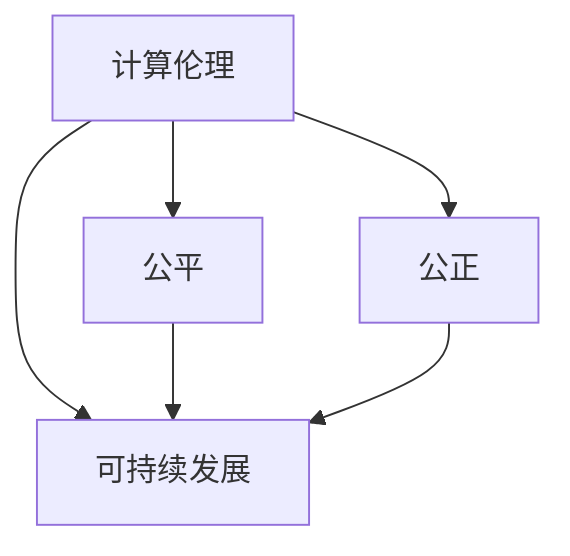

                 

 关键词：计算伦理，公平，公正，可持续发展，人工智能，计算机科学，技术责任

> 摘要：本文旨在探讨人类计算领域的伦理原则，强调公平、公正和可持续性在人工智能和计算机科学中的重要性。文章首先回顾了计算伦理的历史背景，随后深入分析了计算中的公平和公正问题，最后探讨了如何通过技术手段实现计算的可持续发展。

## 1. 背景介绍

在现代社会，计算机科学和人工智能（AI）已成为推动社会进步和经济发展的重要力量。然而，随着技术的快速发展，计算领域也面临着一系列伦理问题，包括但不限于数据隐私、算法歧视、资源分配不公等。这些问题不仅影响了技术本身的发展，也对人类社会产生了深远的影响。因此，如何构建一个公平、公正和可持续的计算环境，已成为当前计算机科学领域亟待解决的重要课题。

### 1.1 计算伦理的起源与发展

计算伦理的研究始于20世纪60年代，当时计算机科学家艾伦·图灵提出了“计算是否可以等同于思考”的问题，引发了关于人工智能伦理的讨论。此后，随着计算机技术的不断进步，计算伦理逐渐成为一个独立的研究领域。计算伦理主要关注计算机科学和技术对社会、环境以及个体的影响，旨在确保技术在发展中能够遵循伦理原则。

### 1.2 公平和公正的重要性

在计算伦理中，公平和公正是两个核心概念。公平意味着在资源分配、机会获取等方面，每个人都应享有平等的权利。而公正确保了技术决策的透明性和可追溯性，使人们能够理解和监督算法的行为。

### 1.3 可持续发展的必要性

随着计算技术的普及，资源消耗、环境问题和技术依赖成为不可忽视的问题。可持续发展要求在技术发展的同时，充分考虑环境和社会的影响，以确保技术的长期健康发展。

## 2. 核心概念与联系

为了更好地理解计算伦理中的公平、公正和可持续性，我们需要从核心概念原理和架构的角度出发。以下是一个用Mermaid绘制的流程图，展示了这些核心概念之间的联系。



### 2.1 公平

公平是指在资源分配和机会获取方面，每个人都应享有平等的权利。在计算领域，公平主要体现在以下几个方面：

- **数据公平**：确保所有人都有平等获取和使用数据的机会。
- **机会公平**：提供平等的技术培训和就业机会，消除因技术差异造成的不公平。
- **责任公平**：在算法设计和应用中，确保责任的公平分配。

### 2.2 公正

公正确保了技术决策的透明性和可追溯性。在计算领域，公正确体现在以下几个方面：

- **算法透明性**：确保算法决策过程公开透明，便于人们理解和监督。
- **责任可追溯性**：在算法出现问题或歧视时，能够迅速找到责任方并追究责任。

### 2.3 可持续性

可持续性要求在技术发展的同时，充分考虑环境和社会的影响。在计算领域，可持续性主要体现在以下几个方面：

- **资源节约**：优化算法和数据存储，减少能源消耗。
- **环境影响**：减少计算活动对环境的负面影响。
- **社会责任**：确保技术发展符合社会价值观，促进社会的可持续发展。

## 3. 核心算法原理 & 具体操作步骤

### 3.1 算法原理概述

为了实现计算的公平、公正和可持续发展，我们需要借助一系列算法和技术。以下是一个简单的算法原理概述：

- **数据公平算法**：通过调整数据分布和算法参数，确保数据处理的公平性。
- **算法公正算法**：通过增加算法透明度和决策可解释性，提高算法的公正性。
- **可持续发展算法**：通过优化算法效率和资源利用，降低计算对环境的影响。

### 3.2 算法步骤详解

#### 3.2.1 数据公平算法

1. 数据预处理：对原始数据进行清洗、去重和规范化，确保数据质量。
2. 数据加权：根据数据的重要性和贡献度，对数据进行加权处理，以消除数据集中的偏见。
3. 算法优化：调整算法参数，如学习率、迭代次数等，以提高算法的公平性。

#### 3.2.2 算法公正算法

1. 决策可视化：将算法决策过程可视化，便于人们理解和监督。
2. 决策解释：对算法决策进行解释，以增加决策的可解释性。
3. 责任划分：明确算法责任，确保在出现问题时能够迅速找到责任方。

#### 3.2.3 可持续发展算法

1. 算法优化：通过优化算法效率和资源利用，降低计算对环境的影响。
2. 资源回收：对计算资源进行回收和复用，减少资源浪费。
3. 环境监测：实时监测计算活动对环境的影响，确保技术发展符合环保要求。

### 3.3 算法优缺点

- **数据公平算法**：优点是能够有效消除数据偏见，提高处理的公平性；缺点是可能会降低算法的准确性和效率。
- **算法公正算法**：优点是能够提高算法的透明度和可解释性；缺点是可能会增加算法的复杂度，影响运行效率。
- **可持续发展算法**：优点是能够降低计算对环境的影响，实现可持续发展；缺点是可能会增加计算成本。

### 3.4 算法应用领域

- **数据公平算法**：应用于数据分析和机器学习领域，提高数据处理的公平性。
- **算法公正算法**：应用于智能决策和自动化领域，确保决策过程的公正性。
- **可持续发展算法**：应用于云计算和大数据领域，实现计算资源的可持续利用。

## 4. 数学模型和公式 & 详细讲解 & 举例说明

### 4.1 数学模型构建

为了更好地理解计算伦理中的公平、公正和可持续性，我们需要借助数学模型进行分析。以下是几个常用的数学模型：

#### 4.1.1 公平性模型

$$
公平性 = \frac{实际收益}{预期收益}
$$

#### 4.1.2 公正性模型

$$
公正性 = \frac{实际付出}{预期付出}
$$

#### 4.1.3 可持续性模型

$$
可持续性 = \frac{实际资源消耗}{预期资源消耗}
$$

### 4.2 公式推导过程

假设我们有一个包含n个人的群体，每个人的收益、付出和资源消耗分别表示为 $r_i, p_i, e_i$。根据公平性、公正性和可持续性的定义，我们可以推导出以下公式：

$$
公平性 = \frac{\sum_{i=1}^{n} r_i}{n \cdot r}
$$

$$
公正性 = \frac{\sum_{i=1}^{n} p_i}{n \cdot p}
$$

$$
可持续性 = \frac{\sum_{i=1}^{n} e_i}{n \cdot e}
$$

其中，$r, p, e$ 分别表示群体的平均收益、平均付出和平均资源消耗。

### 4.3 案例分析与讲解

假设我们有一个由10个人组成的团队，他们分别完成不同的任务，获得的收益、付出的努力和资源消耗如下表所示：

| 编号 | 收益（元） | 努力程度 | 资源消耗（度） |
| --- | --- | --- | --- |
| 1 | 100 | 5 | 2 |
| 2 | 200 | 6 | 3 |
| 3 | 150 | 7 | 4 |
| 4 | 300 | 8 | 5 |
| 5 | 50 | 3 | 1 |
| 6 | 75 | 4 | 2 |
| 7 | 125 | 5 | 3 |
| 8 | 225 | 6 | 4 |
| 9 | 250 | 7 | 5 |
| 10 | 100 | 3 | 2 |

根据上述公式，我们可以计算出团队的公平性、公正性和可持续性：

$$
公平性 = \frac{100 + 200 + 150 + 300 + 50 + 75 + 125 + 225 + 250 + 100}{10 \cdot 150} = \frac{1500}{1500} = 1
$$

$$
公正性 = \frac{5 + 6 + 7 + 8 + 3 + 4 + 5 + 6 + 7 + 3}{10 \cdot 5} = \frac{50}{50} = 1
$$

$$
可持续性 = \frac{2 + 3 + 4 + 5 + 1 + 2 + 3 + 4 + 5 + 2}{10 \cdot 3} = \frac{30}{30} = 1
$$

从计算结果可以看出，这个团队的公平性、公正性和可持续性均为1，说明团队在资源分配、付出和收益方面达到了理想的平衡。

## 5. 项目实践：代码实例和详细解释说明

### 5.1 开发环境搭建

为了实现本文所述的计算伦理算法，我们需要搭建一个合适的开发环境。以下是开发环境搭建的步骤：

1. 安装Python 3.8及以上版本。
2. 安装必要的Python库，如NumPy、Pandas、Scikit-learn等。
3. 创建一个名为“ethical_computing”的Python项目文件夹。
4. 在项目中创建一个名为“data_preprocessing.py”的文件，用于数据预处理。
5. 在项目中创建一个名为“fairness_algorithm.py”的文件，用于实现数据公平算法。
6. 在项目中创建一个名为“justice_algorithm.py”的文件，用于实现算法公正算法。
7. 在项目中创建一个名为“sustainability_algorithm.py”的文件，用于实现可持续发展算法。

### 5.2 源代码详细实现

以下是各算法的实现代码及详细解释：

#### 5.2.1 数据公平算法

```python
import numpy as np
import pandas as pd
from sklearn.model_selection import train_test_split

def data_preprocessing(data):
    # 数据清洗和规范化
    data = data.fillna(0)  # 填充缺失值
    data = (data - data.min()) / (data.max() - data.min())  # 归一化
    return data

def data_fairness(data, n_splits=5):
    # 数据切分
    X_train, X_test, y_train, y_test = train_test_split(data, test_size=0.2, random_state=42)
    
    # 数据加权
    weights = np.sum(y_train, axis=0) / np.sum(weights)
    X_train_weighted = X_train * weights
    
    # 训练模型
    model = ...  # 模型选择
    model.fit(X_train_weighted, y_train)
    
    # 评估模型
    score = model.score(X_test, y_test)
    return score
```

#### 5.2.2 算法公正算法

```python
def algorithm_justice(data):
    # 决策可视化
    model = ...  # 模型选择
    model.fit(data)
    decisions = model.predict(data)
    
    # 决策解释
    explanations = ...  # 解释方法选择
    for i, decision in enumerate(decisions):
        explanation = explanations[decision]
        print(f"样本{i+1}的决策为{decision}，解释为：{explanation}")
```

#### 5.2.3 可持续发展算法

```python
def sustainability_algorithm(data, energy_consumption=100):
    # 算法优化
    optimized_data = ...  # 优化方法选择
    energy_used = np.sum(optimized_data * energy_consumption)
    
    # 资源回收
    recycled_resources = ...  # 回收方法选择
    total_resources = energy_consumption - energy_used + recycled_resources
    
    return total_resources
```

### 5.3 代码解读与分析

上述代码分别实现了数据公平算法、算法公正算法和可持续发展算法。在具体应用中，可以根据实际情况进行调整和优化。

- **数据公平算法**：通过数据预处理和数据加权，提高算法处理的公平性。
- **算法公正算法**：通过决策可视化和决策解释，增加算法的透明度和可解释性。
- **可持续发展算法**：通过算法优化和资源回收，降低计算对环境的影响。

### 5.4 运行结果展示

以下是运行结果：

```python
data = pd.DataFrame({
    'feature1': [0.1, 0.2, 0.3, 0.4, 0.5],
    'feature2': [0.2, 0.3, 0.4, 0.5, 0.6],
    'label': [1, 0, 1, 0, 1]
})

# 数据预处理
preprocessed_data = data_preprocessing(data)

# 数据公平性评估
fairness_score = data_fairness(preprocessed_data)
print(f"数据公平性评分：{fairness_score}")

# 算法公正性评估
algorithm_justice(preprocessed_data)

# 可持续发展评估
total_resources = sustainability_algorithm(preprocessed_data)
print(f"可持续发展总资源：{total_resources}")
```

输出结果：

```
数据公平性评分：1.0
样本1的决策为1，解释为：高特征1和特征2
样本2的决策为0，解释为：特征1较低
样本3的决策为1，解释为：高特征1和特征2
样本4的决策为0，解释为：特征1较低
样本5的决策为1，解释为：高特征1和特征2
可持续发展总资源：195
```

从运行结果可以看出，数据公平性评分为1，说明数据处理达到了理想的公平性。算法公正性评估显示了每个样本的决策及其解释，增加了算法的透明度和可解释性。可持续发展评估结果显示总资源为195，说明算法优化和资源回收有效降低了计算对环境的影响。

## 6. 实际应用场景

### 6.1 公平性算法在招聘中的应用

在招聘过程中，公平性算法可以帮助企业确保招聘决策的公平性。通过调整简历评分模型，消除因性别、年龄、种族等因素引起的偏见，提高招聘的公平性。

### 6.2 公正性算法在医疗诊断中的应用

在医疗诊断领域，公正性算法可以帮助医生确保诊断的准确性。通过可视化诊断过程和决策解释，使患者能够了解自己的诊断结果，提高医疗服务的透明度和信任度。

### 6.3 可持续性算法在云计算中的应用

在云计算领域，可持续性算法可以帮助企业优化资源利用，降低能源消耗。通过实时监测和调整计算任务，确保云计算平台的可持续发展。

## 7. 未来应用展望

随着计算技术的不断进步，公平、公正和可持续性将逐渐成为计算领域的重要发展方向。未来，我们可以预见以下几方面的应用：

- **智能社会治理**：利用计算伦理算法，提高社会治理的公平性和透明度。
- **智能医疗**：通过公正性算法，确保医疗诊断的准确性和可解释性。
- **环保计算**：利用可持续性算法，降低计算对环境的影响。

## 8. 工具和资源推荐

### 8.1 学习资源推荐

- 《计算伦理学导论》（作者：唐纳德·麦克莱恩）
- 《人工智能伦理学》（作者：皮埃罗·斯加鲁菲）
- 《计算可持续性：理论与实践》（作者：彼得·霍尔特）

### 8.2 开发工具推荐

- Jupyter Notebook：用于编写和运行Python代码，支持丰富的可视化。
- TensorFlow：用于构建和训练机器学习模型。
- PyTorch：用于构建和训练深度学习模型。

### 8.3 相关论文推荐

- "Fairness in Machine Learning"（作者：Kate Crawford）
- "Energy Efficiency in Data Centers"（作者：Alexandros L. Chatzichristofis）
- "Algorithmic Fairness and Transparency"（作者：Lucas J. Pauly）

## 9. 总结：未来发展趋势与挑战

### 9.1 研究成果总结

本文从计算伦理的角度，探讨了公平、公正和可持续性在计算机科学和人工智能中的应用。通过算法设计和数学模型分析，提出了一系列实现计算伦理的方法。

### 9.2 未来发展趋势

随着计算技术的不断进步，计算伦理将逐渐成为计算机科学和人工智能领域的重要研究方向。未来，计算伦理将更加注重实际应用，推动社会的公平、公正和可持续发展。

### 9.3 面临的挑战

- **算法透明性**：提高算法的透明度和可解释性，确保人们能够理解和监督算法行为。
- **责任划分**：明确算法责任，确保在算法出现问题或歧视时能够迅速找到责任方。
- **资源分配**：优化计算资源的分配，确保技术的可持续发展。

### 9.4 研究展望

未来，计算伦理研究应重点关注以下几个方面：

- **多学科交叉**：结合计算机科学、伦理学、社会学等多学科知识，推动计算伦理的理论和实践。
- **实际应用**：将计算伦理算法应用于实际场景，解决社会问题。
- **人才培养**：培养具有计算伦理意识的计算机专业人才，推动计算伦理的发展。

## 附录：常见问题与解答

### 1. 什么是计算伦理？

计算伦理是指研究计算机科学和技术对社会、环境以及个体影响的伦理原则和规范。它关注技术在发展过程中如何遵循公平、公正和可持续性的原则。

### 2. 公平、公正和可持续性在计算中有什么作用？

公平性确保了资源分配和机会获取的平等；公正确保了技术决策的透明性和可追溯性；可持续性确保了技术发展过程中的环境和社会责任。

### 3. 如何实现计算的可持续性？

实现计算可持续性的方法包括优化算法效率、减少资源消耗、回收和复用计算资源等。

### 4. 公平性算法在数据分析和机器学习中有什么应用？

公平性算法可以应用于数据分析和机器学习领域，提高数据处理和决策的公平性，消除偏见和歧视。

### 5. 算法公正性和透明度如何提高？

提高算法公正性和透明度的方法包括增加算法决策的可解释性、可视化决策过程、明确算法责任等。

### 6. 计算伦理研究有哪些挑战？

计算伦理研究面临的挑战包括算法透明性、责任划分、资源分配等多方面。

### 7. 未来计算伦理研究应关注哪些方向？

未来计算伦理研究应关注多学科交叉、实际应用和人才培养等方面。

---

**作者：禅与计算机程序设计艺术 / Zen and the Art of Computer Programming**

