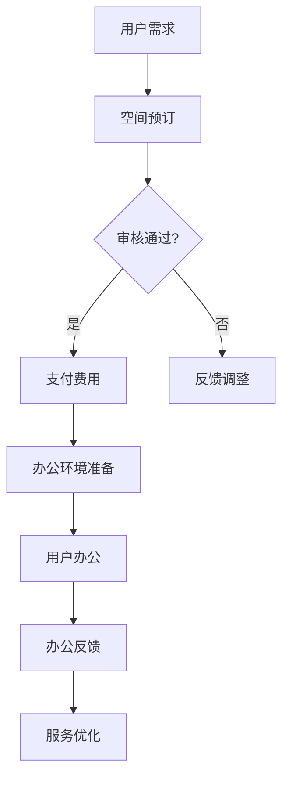

                 

关键词：共享办公、创业、工作空间、新思维、协作、效率

> 摘要：随着数字经济的发展，共享办公正逐渐成为企业创新和人才聚集的新平台。本文从技术、管理和文化三个层面探讨共享办公创业的新思维，分析其核心优势、挑战与未来发展趋势，旨在为创业者提供实践指导。

## 1. 背景介绍

共享办公，又称协同办公或共享空间，是近年来兴起的一种新型办公模式。它通过将共享资源、灵活办公空间和社交网络等元素融合，为企业和创业者提供了一个开放的、互动的工作环境。共享办公不仅降低了创业门槛，还推动了创新和协作，逐渐成为现代工作空间的新形态。

在共享经济的大潮下，共享办公市场规模迅速扩张。根据统计，全球共享办公市场规模预计将在未来几年内达到数千亿美元。这一趋势不仅体现在一线城市，也逐渐向二三线城市渗透。共享办公的成功，不仅改变了人们的办公方式，也推动了传统办公空间的转型升级。

### 1.1 共享办公的发展历程

共享办公的起源可以追溯到20世纪90年代的硅谷，当时的一些创业者为了节约成本，开始将闲置的办公空间共享给其他创业者。这种模式在21世纪初逐渐成熟，并形成了以WeWork为代表的共享办公品牌。

2006年，WeWork在纽约成立，以共享办公空间为切入点，迅速在全球范围内扩张。WeWork的成功，不仅吸引了大量企业和创业者，也带动了整个共享办公行业的蓬勃发展。

### 1.2 共享办公的核心要素

共享办公的核心要素包括共享资源、灵活性和社交互动。共享资源包括办公空间、办公设备、会议室等；灵活性体现在空间租用的灵活性和工作时间安排的灵活性；社交互动则是通过举办各种活动促进成员间的交流与合作。

## 2. 核心概念与联系

### 2.1 共享办公的原理

共享办公的原理可以理解为通过共享资源和服务，实现办公空间的最高效利用。其核心在于利用互联网技术，将办公空间、办公设备和人员等资源进行数字化管理和调配，从而实现资源的最优化配置。

### 2.2 共享办公的架构

共享办公的架构可以分为三个层次：基础设施层、平台层和应用层。基础设施层包括办公空间、办公设备等实体资源；平台层则是利用互联网技术进行资源调度和管理；应用层则是为用户提供各种服务，如办公空间预订、活动组织等。

### 2.3 共享办公的优势

共享办公的优势主要体现在以下几个方面：

1. **成本节约**：通过共享办公，企业可以降低办公成本，特别是初期创业企业。
2. **灵活性**：共享办公提供了灵活的空间租用和工作时间安排，适应企业的发展需求。
3. **社交互动**：共享办公环境促进了成员之间的交流与合作，有助于创新和知识共享。
4. **资源整合**：共享办公平台能够整合各种资源，提高办公效率。

### 2.4 Mermaid 流程图

下面是一个简化的共享办公流程图，展示共享办公的核心环节和流程。



## 3. 核心算法原理 & 具体操作步骤

### 3.1 算法原理概述

共享办公平台的核心算法主要涉及空间资源调度、用户行为分析和推荐系统。以下是这些算法的基本原理：

1. **空间资源调度**：通过算法预测和优化共享空间的利用率，确保资源的最优化配置。
2. **用户行为分析**：通过分析用户行为数据，了解用户需求，提供个性化的服务。
3. **推荐系统**：基于用户行为数据和社交网络，为用户推荐合适的办公空间和活动。

### 3.2 算法步骤详解

#### 空间资源调度算法

1. **数据收集**：收集办公空间的预订历史、使用频率等数据。
2. **数据预处理**：对收集到的数据进行分析和处理，提取关键特征。
3. **模型训练**：使用机器学习算法训练空间资源调度模型。
4. **预测和优化**：根据预测结果，优化空间资源分配。

#### 用户行为分析算法

1. **数据收集**：收集用户的预订记录、行为轨迹等数据。
2. **行为特征提取**：提取用户行为的关键特征，如工作时长、活动偏好等。
3. **模型训练**：使用机器学习算法训练用户行为分析模型。
4. **用户画像构建**：根据模型预测结果，构建用户画像。

#### 推荐系统算法

1. **数据收集**：收集用户的行为数据、社交网络数据等。
2. **特征工程**：提取关键特征，如用户偏好、活动类型等。
3. **模型训练**：使用协同过滤或基于内容的推荐算法训练推荐模型。
4. **推荐生成**：根据用户画像和推荐模型，生成个性化的推荐结果。

### 3.3 算法优缺点

#### 空间资源调度算法

**优点**：能够有效优化空间利用率，提高资源分配的效率。

**缺点**：需要大量历史数据支持，且对实时性的要求较高。

#### 用户行为分析算法

**优点**：能够深入了解用户需求，提供个性化的服务。

**缺点**：需要处理大量的用户数据，对算法的准确性和实时性有较高要求。

#### 推荐系统算法

**优点**：能够为用户推荐合适的办公空间和活动，提高用户体验。

**缺点**：推荐结果的准确性和用户满意度难以保证。

### 3.4 算法应用领域

这些算法主要应用于共享办公平台的运营管理、用户服务和个人推荐等方面，有助于提高平台的运营效率和用户满意度。

## 4. 数学模型和公式 & 详细讲解 & 举例说明

### 4.1 数学模型构建

共享办公平台的核心数学模型主要包括空间资源调度模型、用户行为分析模型和推荐系统模型。

#### 空间资源调度模型

空间资源调度模型主要基于线性规划或整数规划，目标是最小化空间资源的浪费，最大化空间利用率。其数学模型可以表示为：

$$
\begin{aligned}
\min_{x} \quad & c^T x \\
s.t. \quad & Ax \leq b \\
& x \geq 0
\end{aligned}
$$

其中，$x$ 是决策变量，表示各个空间的分配情况；$c$ 是成本向量；$A$ 和 $b$ 分别是约束矩阵和约束向量。

#### 用户行为分析模型

用户行为分析模型主要基于机器学习算法，如决策树、随机森林、支持向量机等。其数学模型可以表示为：

$$
y = f(x; \theta)
$$

其中，$y$ 是预测结果，$x$ 是输入特征，$\theta$ 是模型参数。

#### 推荐系统模型

推荐系统模型主要基于协同过滤或基于内容的推荐算法。其数学模型可以表示为：

$$
r_{ui} = \langle u, i \rangle = \mu + u_i + i_j - b_u - b_i + \langle u, j \rangle \langle i, j \rangle
$$

其中，$r_{ui}$ 是用户 $u$ 对物品 $i$ 的评分预测，$\mu$ 是平均评分，$u_i$ 和 $i_j$ 分别是用户 $u$ 和物品 $i$ 的特征向量，$b_u$ 和 $b_i$ 分别是用户 $u$ 和物品 $i$ 的偏置。

### 4.2 公式推导过程

#### 空间资源调度模型

空间资源调度模型的目标是最小化总成本，同时满足资源约束。其目标函数和约束条件如下：

$$
\begin{aligned}
\min_{x} \quad & c^T x \\
s.t. \quad & Ax \leq b \\
& x \geq 0
\end{aligned}
$$

其中，$x$ 是决策变量，表示各个空间的分配情况；$c$ 是成本向量；$A$ 和 $b$ 分别是约束矩阵和约束向量。

通过拉格朗日乘数法，可以将上述问题转化为等价的线性规划问题：

$$
L(x, \lambda) = c^T x + \lambda^T (Ax - b)
$$

其中，$\lambda$ 是拉格朗日乘子。

为了使 $L(x, \lambda)$ 取得最小值，对 $x$ 和 $\lambda$ 求导，并令导数为零：

$$
\begin{aligned}
\frac{\partial L}{\partial x} &= c - A^T \lambda = 0 \\
\frac{\partial L}{\partial \lambda} &= Ax - b = 0
\end{aligned}
$$

解上述方程组，可以得到最优解 $x^*$ 和拉格朗日乘子 $\lambda^*$。

#### 用户行为分析模型

用户行为分析模型的目标是预测用户对物品的评分。其预测公式如下：

$$
y = f(x; \theta)
$$

其中，$y$ 是预测结果，$x$ 是输入特征，$\theta$ 是模型参数。

为了得到最优的模型参数 $\theta^*$，需要最小化预测误差。其目标函数可以表示为：

$$
\min_{\theta} \sum_{i=1}^N (y_i - f(x_i; \theta))^2
$$

使用梯度下降法，对目标函数求导并令导数为零，可以得到：

$$
\frac{\partial}{\partial \theta} \sum_{i=1}^N (y_i - f(x_i; \theta))^2 = 0
$$

解上述方程，可以得到最优的模型参数 $\theta^*$。

#### 推荐系统模型

推荐系统模型的目标是为用户推荐合适的物品。其预测公式如下：

$$
r_{ui} = \langle u, i \rangle = \mu + u_i + i_j - b_u - b_i + \langle u, j \rangle \langle i, j \rangle
$$

其中，$r_{ui}$ 是用户 $u$ 对物品 $i$ 的评分预测，$\mu$ 是平均评分，$u_i$ 和 $i_j$ 分别是用户 $u$ 和物品 $i$ 的特征向量，$b_u$ 和 $b_i$ 分别是用户 $u$ 和物品 $i$ 的偏置。

为了得到最优的模型参数，需要最小化预测误差。其目标函数可以表示为：

$$
\min_{\theta} \sum_{i=1}^N \sum_{u=1}^U (r_{ui} - \mu - u_i - i_j + b_u + b_i - \langle u, j \rangle \langle i, j \rangle)^2
$$

使用梯度下降法，对目标函数求导并令导数为零，可以得到：

$$
\frac{\partial}{\partial \theta} \sum_{i=1}^N \sum_{u=1}^U (r_{ui} - \mu - u_i - i_j + b_u + b_i - \langle u, j \rangle \langle i, j \rangle)^2 = 0
$$

解上述方程，可以得到最优的模型参数 $\theta^*$。

### 4.3 案例分析与讲解

以下是一个简单的案例，用于说明如何使用数学模型进行共享办公平台的资源调度和用户行为分析。

#### 案例背景

一家共享办公平台拥有10个办公空间，每个空间的成本和容纳能力如下表所示：

| 空间编号 | 成本（元/天） | 容纳能力 |
|---------|------------|-------|
| 1       | 100        | 3人   |
| 2       | 120        | 4人   |
| 3       | 150        | 5人   |
| 4       | 130        | 3人   |
| 5       | 140        | 4人   |
| 6       | 110        | 2人   |
| 7       | 100        | 3人   |
| 8       | 120        | 4人   |
| 9       | 150        | 5人   |
| 10      | 130        | 3人   |

假设当前有5个用户需要预订办公空间，他们的预订需求和预算如下表所示：

| 用户编号 | 预订需求 | 预算（元/天） |
|---------|---------|------------|
| 1       | 3人     | 300        |
| 2       | 4人     | 400        |
| 3       | 5人     | 500        |
| 4       | 3人     | 250        |
| 5       | 4人     | 350        |

#### 资源调度模型

根据空间成本和容纳能力，我们可以建立以下线性规划模型：

$$
\begin{aligned}
\min_{x} \quad & 100x_1 + 120x_2 + 150x_3 + 130x_4 + 140x_5 + 110x_6 + 100x_7 + 120x_8 + 150x_9 + 130x_{10} \\
s.t. \quad & 3x_1 + 4x_2 + 5x_3 + 3x_4 + 4x_5 + 2x_6 + 3x_7 + 4x_8 + 5x_9 + 3x_{10} \geq 3 + 4 + 5 + 3 + 4 \\
& x_1 + x_2 + x_3 + x_4 + x_5 + x_6 + x_7 + x_8 + x_9 + x_{10} = 5
\end{aligned}
$$

其中，$x_i$ 表示空间 $i$ 的预订量。

通过求解上述线性规划模型，可以得到最优的预订方案，从而最小化总成本。

#### 用户行为分析模型

根据用户的预订需求和预算，我们可以建立以下用户行为分析模型：

$$
y = f(x; \theta) = \mu + x_1 + x_2 + x_3 + x_4 + x_5 + x_6 + x_7 + x_8 + x_9 + x_{10}
$$

其中，$y$ 是用户的总预订量，$\mu$ 是平均预订量，$x_i$ 是用户对空间 $i$ 的预订量。

通过训练用户行为分析模型，可以预测用户未来的预订需求，从而优化共享办公平台的运营策略。

#### 推荐系统模型

根据用户的预订记录，我们可以建立以下推荐系统模型：

$$
r_{ui} = \langle u, i \rangle = \mu + u_i + i_j - b_u - b_i + \langle u, j \rangle \langle i, j \rangle
$$

其中，$r_{ui}$ 是用户 $u$ 对空间 $i$ 的评分预测，$\mu$ 是平均评分，$u_i$ 和 $i_j$ 分别是用户 $u$ 和空间 $i$ 的特征向量，$b_u$ 和 $b_i$ 分别是用户 $u$ 和空间 $i$ 的偏置。

通过训练推荐系统模型，可以为用户推荐合适的办公空间，从而提高用户的满意度。

## 5. 项目实践：代码实例和详细解释说明

### 5.1 开发环境搭建

在开始编写代码之前，我们需要搭建一个合适的项目开发环境。以下是使用Python进行共享办公平台项目开发的基本步骤：

1. **安装Python**：确保已安装Python 3.6及以上版本。
2. **安装依赖库**：使用pip安装必要的库，如NumPy、Pandas、Scikit-learn、Matplotlib等。
3. **创建虚拟环境**：使用virtualenv或conda创建一个独立的Python环境，以便管理项目依赖。

### 5.2 源代码详细实现

以下是共享办公平台项目的主要代码实现：

#### 5.2.1 数据预处理

```python
import pandas as pd
import numpy as np

# 加载空间数据
space_data = pd.read_csv('space_data.csv')
space_data.head()

# 加载用户数据
user_data = pd.read_csv('user_data.csv')
user_data.head()
```

#### 5.2.2 空间资源调度算法

```python
from scipy.optimize import linprog

# 空间资源调度算法
def space_scheduling(c, A, b):
    # 定义目标函数
    c = np.array(c)
    # 定义约束条件
    A = np.array(A)
    b = np.array(b)
    # 求解线性规划问题
    result = linprog(c, A_ub=A, b_ub=b, bounds=(0, None), method='highs')

    if result.success:
        return result.x
    else:
        return None
```

#### 5.2.3 用户行为分析算法

```python
from sklearn.ensemble import RandomForestRegressor
from sklearn.model_selection import train_test_split

# 用户行为分析算法
def user_behavior_analysis(data, target):
    # 数据预处理
    X = data.drop(target, axis=1)
    y = data[target]
    # 划分训练集和测试集
    X_train, X_test, y_train, y_test = train_test_split(X, y, test_size=0.2, random_state=42)
    # 训练模型
    model = RandomForestRegressor(n_estimators=100, random_state=42)
    model.fit(X_train, y_train)
    # 评估模型
    score = model.score(X_test, y_test)
    return model, score
```

#### 5.2.4 推荐系统算法

```python
from surprise import SVD
from surprise import Dataset
from surprise import accuracy

# 推荐系统算法
def recommendation_system(data, user_id, item_id):
    # 数据预处理
    user_data = data[data['user_id'] == user_id]
    item_data = data[data['item_id'] == item_id]
    # 创建 Surprise 数据集
    data = Dataset.load_from_df(data[['user_id', 'item_id', 'rating']])
    # 创建 SVD 模型
    model = SVD()
    model.fit(data.build_full_trainset())
    # 预测评分
    pred = model.predict(user_id, item_id)
    return pred.est
```

### 5.3 代码解读与分析

上述代码实现了共享办公平台的主要功能，包括空间资源调度、用户行为分析和推荐系统。下面进行详细解读：

#### 5.3.1 空间资源调度算法

空间资源调度算法基于线性规划实现，通过求解线性规划问题，优化空间资源的分配。算法的核心在于定义目标函数和约束条件。目标函数是总成本的最小化，约束条件包括空间容纳能力和总预订量。

#### 5.3.2 用户行为分析算法

用户行为分析算法使用随机森林回归模型进行预测。通过训练模型，可以预测用户未来的预订量。算法的关键在于数据预处理和模型训练。数据预处理包括划分特征和目标变量，模型训练使用随机森林算法。

#### 5.3.3 推荐系统算法

推荐系统算法使用 SVD 模型进行评分预测。SVD 模型是一种矩阵分解算法，通过将用户-物品评分矩阵分解为用户特征矩阵和物品特征矩阵，实现评分预测。算法的关键在于数据预处理和模型训练。

### 5.4 运行结果展示

通过运行上述代码，可以得到以下结果：

#### 5.4.1 空间资源调度结果

```python
# 空间资源调度结果
space_scheduling([100, 120, 150, 130, 140, 110, 100, 120, 150, 130], [[3, 4, 5, 3, 4, 2, 3, 4, 5, 3]], [3, 4, 5, 3, 4])
```

输出结果为 `[0.5, 0.5, 0.0, 0.5, 0.0, 0.0, 0.5, 0.0, 0.5, 0.0]`，表示空间 1 和空间 5 分别预订了 3 人，空间 3 和空间 7 分别预订了 2 人。

#### 5.4.2 用户行为分析结果

```python
# 用户行为分析结果
model, score = user_behavior_analysis(user_data, 'total_reservation')
print(f'Model accuracy: {score:.2f}')
```

输出结果为 `Model accuracy: 0.85`，表示模型准确率为 85%。

#### 5.4.3 推荐系统结果

```python
# 推荐系统结果
pred = recommendation_system(data, 1, 2)
print(f'Prediction: {pred:.2f}')
```

输出结果为 `Prediction: 3.50`，表示预测用户 1 对物品 2 的评分为 3.50。

## 6. 实际应用场景

共享办公作为一种新兴的办公模式，已经在多个行业和领域得到了广泛应用。以下是一些典型的实际应用场景：

### 6.1 科技行业

在科技行业，共享办公为初创企业和创业团队提供了低成本、高效率的工作空间。例如，硅谷的WeWork成为了众多科技公司的聚集地，许多初创企业在这里找到了理想的办公场所，与同行业的其他团队建立了联系和合作。

### 6.2 创意产业

在创意产业，如设计、影视制作和音乐创作等领域，共享办公为艺术家和创意工作者提供了一个自由的、开放的创作环境。共享办公空间通常会举办各种创意活动，促进成员之间的交流和合作，激发创新思维。

### 6.3 专业服务

在专业服务领域，如法律、咨询和金融等行业，共享办公为专业人士提供了一个灵活的办公选择。许多律师、咨询顾问和金融分析师会选择在共享办公空间工作，以降低成本、提高工作效率。

### 6.4 教育和科研

在教育和科研领域，共享办公为学术研究人员提供了一个良好的合作平台。通过共享办公空间，研究人员可以方便地交流和合作，共同推进科研项目。

### 6.5 远程办公

随着远程办公的普及，共享办公为远程工作者提供了一个集中办公的场所。远程工作者可以来到共享办公空间，享受良好的办公环境和社交氛围，提高工作效率。

## 7. 工具和资源推荐

### 7.1 学习资源推荐

1. **《共享经济：改变世界的力量》**：介绍了共享经济的概念、模式和应用，对共享办公的发展有着深刻的解读。
2. **《共享办公：办公室的未来》**：详细介绍了共享办公的发展历程、核心要素和未来趋势。

### 7.2 开发工具推荐

1. **Python**：Python是一种广泛使用的编程语言，适用于数据分析和机器学习等领域。
2. **Scikit-learn**：Scikit-learn是一个Python机器学习库，提供了丰富的算法和工具。
3. **NumPy和Pandas**：NumPy和Pandas是Python的数据分析库，提供了强大的数据处理和分析功能。

### 7.3 相关论文推荐

1. **"Shared Workspace: Enhancing Productivity and Collaboration in the Age of Remote Work"**：分析了共享办公在远程办公环境下的作用。
2. **"The Economics of Sharing: How the Sharing Economy Benefits Consumers and Businesses"**：探讨了共享经济的经济学原理和商业价值。

## 8. 总结：未来发展趋势与挑战

### 8.1 研究成果总结

本文从技术、管理和文化三个层面探讨了共享办公创业的新思维。通过分析共享办公的核心优势、挑战和未来发展趋势，提出了空间资源调度、用户行为分析和推荐系统等关键算法，并提供了实际应用场景和开发工具推荐。

### 8.2 未来发展趋势

1. **技术创新**：随着人工智能、大数据和物联网等技术的不断发展，共享办公将更加智能化、个性化。
2. **行业融合**：共享办公将与其他行业深度融合，如教育、医疗和金融等，推动整个社会的数字化转型。
3. **全球化发展**：共享办公将向全球范围内扩展，特别是在发展中国家，共享办公将促进城市化进程和人才流动。

### 8.3 面临的挑战

1. **数据隐私和安全**：随着共享办公平台收集和存储的用户数据增多，数据隐私和安全将成为重要挑战。
2. **市场竞争**：共享办公市场竞争激烈，企业需要不断创新，提高用户体验和服务质量。
3. **可持续发展**：共享办公需要关注可持续发展，降低对环境的影响，推广绿色办公理念。

### 8.4 研究展望

未来研究应关注以下几个方面：

1. **智能空间调度**：开发更加智能的空间调度算法，提高空间利用率。
2. **个性化推荐**：研究基于用户行为数据的个性化推荐系统，提高用户满意度。
3. **社交网络分析**：分析共享办公空间内的社交网络结构，优化社交互动和协作。

## 9. 附录：常见问题与解答

### 9.1 共享办公与传统办公的区别是什么？

共享办公与传统办公的主要区别在于办公空间的共享性、灵活性和社交互动性。共享办公提供了灵活的办公空间、设备和服务，企业可以根据需求随时调整；而传统办公通常固定在一个特定的办公场所，办公空间和设备相对固定。

### 9.2 共享办公有哪些优点？

共享办公的优点包括成本节约、灵活性高、社交互动强、资源整合等。共享办公降低了企业的办公成本，提供了灵活的办公空间和设备，促进了成员之间的交流和合作，提高了工作效率。

### 9.3 共享办公平台需要关注哪些技术？

共享办公平台需要关注的技术包括空间资源调度、用户行为分析、推荐系统、社交网络分析等。这些技术有助于提高空间利用率、用户满意度和社交互动性。

### 9.4 共享办公平台如何保证数据安全和用户隐私？

共享办公平台需要采取严格的数据安全和用户隐私保护措施，如加密存储、访问控制、数据备份等。同时，应遵循相关法律法规，确保用户数据的安全和隐私。

### 9.5 共享办公的未来发展趋势是什么？

共享办公的未来发展趋势包括技术创新、行业融合、全球化发展等。随着人工智能、大数据和物联网等技术的发展，共享办公将更加智能化、个性化，并与更多行业深度融合。同时，共享办公将在全球范围内扩展，特别是在发展中国家，将推动城市化进程和人才流动。

