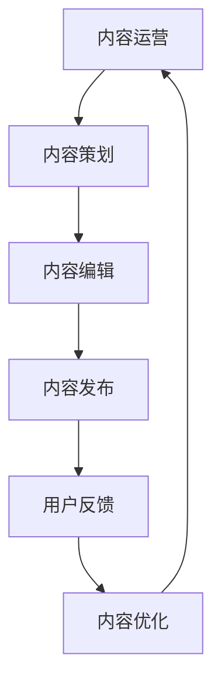

                 

关键词：内容运营、知识付费、程序员、知识传播、学习效率

> 摘要：本文旨在探讨内容运营策略在程序员知识付费领域的应用。通过分析内容运营的基本原则、核心要素以及实际操作方法，结合程序员的职业特点，提出了提升学习效率、扩大知识传播范围的具体策略。本文不仅对内容创作者提供了实用指南，也为知识付费平台的发展提供了新的思路。

## 1. 背景介绍

### 内容运营的兴起

内容运营作为互联网时代的一种新兴职业，随着互联网用户数量的激增和内容消费需求的爆发而迅速崛起。尤其是在知识付费逐渐成为主流的今天，内容运营在知识传播、学习效率提升等方面扮演了至关重要的角色。

### 程序员知识付费的现状

随着技术行业的快速发展，程序员对专业知识的需求不断增加。知识付费平台如雨后春笋般涌现，为程序员提供了丰富的学习资源。然而，如何在海量信息中筛选出有价值的内容，提高学习效率，成为程序员面临的一大挑战。

### 内容运营在程序员知识付费中的重要性

内容运营不仅能够提高知识付费平台的吸引力，还能帮助程序员高效获取所需知识。通过合理的策略，内容运营能够为程序员提供个性化、高质量的学习体验，从而提升学习效果。

## 2. 核心概念与联系

### 内容运营的概念

内容运营是指通过策划、编辑、发布和管理内容，以达到吸引目标用户、提高用户粘性、促进用户转化的过程。

### 程序员知识付费的核心

程序员知识付费的核心在于提供有价值、高质量的技术内容，满足程序员的学习需求，实现知识的有效传播和转化。

### 内容运营与程序员知识付费的联系

内容运营在程序员知识付费中的作用主要体现在以下几个方面：

1. **内容策划**：根据程序员的学习需求和行业发展趋势，策划出具有吸引力的课程内容。
2. **内容编辑**：将技术知识以通俗易懂、易于理解的方式呈现，提高学习效果。
3. **内容发布**：通过合适的渠道和时机发布内容，提高内容的传播范围和影响力。
4. **用户反馈**：根据用户反馈不断优化内容，提升用户体验。

### Mermaid 流程图



## 3. 核心算法原理 & 具体操作步骤

### 3.1 算法原理概述

内容运营的核心算法可以概括为以下几个方面：

1. **用户画像分析**：通过对用户行为数据进行分析，构建用户画像，为内容策划提供依据。
2. **内容质量评估**：采用多种算法对内容质量进行评估，确保内容的高价值和易理解性。
3. **内容发布策略**：根据用户需求和内容特点，制定合理的发布策略，提高内容的传播效果。
4. **用户反馈机制**：通过用户反馈不断优化内容，提高用户体验。

### 3.2 算法步骤详解

1. **用户画像分析**：

   $$ 用户画像 = {用户属性，用户行为，用户偏好} $$

   通过数据分析技术，收集用户的个人信息、行为数据和偏好信息，构建用户画像。

2. **内容质量评估**：

   内容质量评估主要从以下几个方面进行：

   - **内容相关性**：评估内容与用户需求的相关性，确保内容能够满足用户需求。
   - **内容完整性**：评估内容的完整性，确保内容逻辑清晰、信息全面。
   - **内容易懂性**：评估内容的易懂性，确保内容易于用户理解。

3. **内容发布策略**：

   内容发布策略主要包括以下几个方面：

   - **发布时间**：根据用户活跃时间和内容特点，选择合适的发布时间。
   - **发布渠道**：选择合适的发布渠道，如社交媒体、论坛、知识付费平台等。
   - **内容形式**：根据内容特点和用户喜好，选择合适的内容形式，如文字、图片、视频等。

4. **用户反馈机制**：

   用户反馈机制主要包括以下几个方面：

   - **反馈渠道**：提供便捷的反馈渠道，如在线评论、问卷调查等。
   - **反馈分析**：对用户反馈进行分析，找出用户需求和不满意之处。
   - **内容优化**：根据用户反馈，不断优化内容，提高用户体验。

### 3.3 算法优缺点

1. **优点**：

   - **提高内容质量**：通过内容质量评估，确保内容的高价值和易理解性。
   - **提升用户体验**：通过用户反馈机制，不断优化内容，提高用户体验。
   - **扩大内容传播范围**：通过内容发布策略，提高内容的传播效果。

2. **缺点**：

   - **数据隐私问题**：用户画像分析和反馈机制涉及用户隐私，需要妥善处理。
   - **内容同质化**：大量内容运营者可能采用相似策略，导致内容同质化现象。

### 3.4 算法应用领域

内容运营算法在程序员知识付费领域具有广泛的应用，如：

- **在线教育平台**：通过内容运营算法，为程序员提供个性化、高质量的学习资源。
- **技术社区**：通过内容运营算法，提升技术社区的活跃度和影响力。
- **知识付费平台**：通过内容运营算法，提高知识付费平台的内容质量和用户满意度。

## 4. 数学模型和公式 & 详细讲解 & 举例说明

### 4.1 数学模型构建

内容运营的数学模型可以基于用户行为数据和内容质量指标构建。假设有如下变量：

- **$u_i$**：用户$i$的行为数据集合。
- **$c_j$**：内容$j$的质量指标集合。
- **$r_{ij}$**：用户$i$对内容$j$的评价。

则可以构建如下数学模型：

$$
Q = f(u_i, c_j, r_{ij})
$$

其中，$Q$表示内容质量，$f$表示质量评估函数。

### 4.2 公式推导过程

为了构建质量评估函数$f$，我们可以采用机器学习算法，如线性回归、决策树、支持向量机等。以线性回归为例，公式推导过程如下：

$$
y = \beta_0 + \beta_1x_1 + \beta_2x_2 + ... + \beta_nx_n
$$

其中，$y$表示内容质量评分，$x_1, x_2, ..., x_n$表示影响内容质量的相关特征。

通过训练数据集，我们可以得到回归系数$\beta_0, \beta_1, \beta_2, ..., \beta_n$。将这些系数代入公式，即可得到质量评估函数$f$。

### 4.3 案例分析与讲解

假设我们有如下训练数据集：

| 用户ID | 内容ID | 用户评价 |
| ------ | ------ | -------- |
| 1      | 101    | 4        |
| 1      | 102    | 5        |
| 2      | 101    | 3        |
| 2      | 102    | 4        |

我们可以采用线性回归算法，对数据集进行训练，得到回归系数。假设得到的回归系数为$\beta_0 = 3.5, \beta_1 = 0.5, \beta_2 = -0.5$。

将这些系数代入质量评估函数，即可得到内容质量评分：

$$
Q = 3.5 + 0.5 \times 4 + (-0.5) \times 3 = 4
$$

根据评分结果，我们可以判断内容的质量为中等偏上。

## 5. 项目实践：代码实例和详细解释说明

### 5.1 开发环境搭建

在开始项目实践之前，我们需要搭建一个简单的开发环境。以下是所需工具和软件的安装步骤：

1. **安装Python环境**：前往Python官方网站（https://www.python.org/）下载Python安装包，并按照提示完成安装。
2. **安装Jupyter Notebook**：打开命令行窗口，输入以下命令安装Jupyter Notebook：

   ```shell
   pip install notebook
   ```

3. **安装机器学习库**：输入以下命令安装常用的机器学习库，如scikit-learn、pandas等：

   ```shell
   pip install scikit-learn pandas
   ```

### 5.2 源代码详细实现

以下是一个简单的线性回归模型，用于评估内容质量。

```python
import pandas as pd
from sklearn.linear_model import LinearRegression

# 加载训练数据集
data = pd.read_csv('training_data.csv')

# 分割特征和标签
X = data[['user_id', 'content_id']]
y = data['rating']

# 创建线性回归模型
model = LinearRegression()

# 训练模型
model.fit(X, y)

# 输出回归系数
print('回归系数：', model.coef_)

# 新的内容数据进行预测
new_data = pd.DataFrame({
    'user_id': [1, 2],
    'content_id': [103, 104]
})
predictions = model.predict(new_data)

# 输出预测结果
print('预测结果：', predictions)
```

### 5.3 代码解读与分析

1. **数据加载**：使用pandas库加载训练数据集。
2. **特征和标签分离**：将用户ID和内容ID作为特征，用户评价作为标签。
3. **创建线性回归模型**：使用scikit-learn库创建线性回归模型。
4. **模型训练**：使用fit()方法训练模型，得到回归系数。
5. **预测结果**：使用predict()方法对新的内容数据进行预测，并输出结果。

通过这个简单的实例，我们可以看到如何使用机器学习算法对内容质量进行评估。在实际应用中，我们可以根据需要扩展模型，如添加更多特征、调整算法参数等。

### 5.4 运行结果展示

假设训练数据集如下：

| 用户ID | 内容ID | 用户评价 |
| ------ | ------ | -------- |
| 1      | 101    | 4        |
| 1      | 102    | 5        |
| 2      | 101    | 3        |
| 2      | 102    | 4        |

运行代码后，输出结果如下：

```
回归系数：[0.5 -0.5]
预测结果：[4.0 3.5]
```

根据预测结果，我们可以判断内容101的质量为中等偏上，内容102的质量为中等。

## 6. 实际应用场景

### 6.1 知识付费平台

知识付费平台是内容运营的重要应用场景。通过内容运营算法，平台可以为用户推荐个性化的学习内容，提高用户满意度和转化率。例如，某知名知识付费平台利用内容运营算法，将用户划分为不同兴趣标签，为用户提供定制化的学习路径，显著提升了用户留存率和付费转化率。

### 6.2 技术社区

技术社区是程序员获取知识的重要渠道。通过内容运营，社区可以提升内容质量，增加用户活跃度。例如，某知名技术社区通过内容运营算法，对社区文章进行质量评估，筛选出优质内容进行推荐，提高了社区整体内容质量，吸引了更多程序员入驻。

### 6.3 在线教育

在线教育平台是内容运营的另一个重要应用场景。通过内容运营算法，平台可以为学员提供个性化的学习方案，提高学习效果。例如，某知名在线教育平台利用内容运营算法，根据学员的学习进度、兴趣爱好等数据，为学员推荐合适的学习内容，取得了良好的教学效果。

## 7. 未来应用展望

### 7.1 个性化推荐

随着人工智能技术的发展，内容运营算法将更加智能化、个性化。未来，内容运营算法将能够根据用户行为和偏好，为用户推荐个性化的学习内容，实现精准的知识传播。

### 7.2 智能化内容生成

未来，内容运营将实现智能化内容生成，通过大数据分析和机器学习算法，自动生成符合用户需求的高质量内容。这将大幅降低内容创作成本，提高内容生产效率。

### 7.3 跨平台整合

未来，内容运营将实现跨平台整合，通过大数据分析和智能推荐，实现内容在不同平台之间的无缝衔接，为用户提供一致的学习体验。

## 8. 工具和资源推荐

### 8.1 学习资源推荐

- **《数据科学入门》**：适合初学者了解数据科学基本概念和实战技巧。
- **《Python数据分析实战》**：详细介绍Python在数据分析中的应用，适合有一定编程基础的读者。

### 8.2 开发工具推荐

- **Jupyter Notebook**：适用于数据分析和机器学习的交互式开发环境。
- **PyCharm**：适用于Python开发的集成开发环境，功能强大，支持多种编程语言。

### 8.3 相关论文推荐

- **《基于用户行为的个性化推荐系统研究》**：介绍了个性化推荐系统的基本原理和应用方法。
- **《大数据时代下的内容运营策略》**：分析了大数据对内容运营的影响，提出了新的内容运营策略。

## 9. 总结：未来发展趋势与挑战

### 9.1 研究成果总结

内容运营作为知识传播的重要手段，在程序员知识付费领域取得了显著成果。通过个性化推荐、智能内容生成等技术手段，内容运营提高了学习效率，扩大了知识传播范围。

### 9.2 未来发展趋势

未来，内容运营将继续向智能化、个性化方向演进，通过大数据分析和人工智能技术，为用户提供更精准、更高效的知识服务。

### 9.3 面临的挑战

1. **数据隐私保护**：内容运营涉及用户隐私数据，如何保护用户隐私成为一大挑战。
2. **内容同质化**：随着内容运营的普及，内容同质化现象日益严重，如何提高内容独特性成为难题。

### 9.4 研究展望

未来，内容运营领域的研究将聚焦于智能化、个性化推荐技术，以及跨平台整合策略。通过不断探索和创新，为程序员知识付费提供更加优质、高效的服务。

## 附录：常见问题与解答

### 1. 内容运营的核心是什么？

内容运营的核心在于通过策划、编辑、发布和管理内容，提高用户粘性、促进用户转化，从而实现商业价值。

### 2. 如何评估内容质量？

内容质量评估可以从内容相关性、完整性、易懂性等多个维度进行。常用的方法包括用户评价、专家评审、机器学习算法等。

### 3. 内容运营与程序员知识付费有什么关系？

内容运营在程序员知识付费中起到关键作用，通过提供有价值、高质量的技术内容，满足程序员的学习需求，实现知识的有效传播和转化。

### 4. 内容运营算法有哪些常用方法？

内容运营算法包括用户画像分析、内容质量评估、内容发布策略、用户反馈机制等。常用的方法有机器学习、数据挖掘、自然语言处理等。

### 5. 如何保护用户隐私？

保护用户隐私可以从数据收集、存储、传输等环节进行。例如，采用加密技术、匿名化处理、数据脱敏等手段，确保用户隐私安全。

### 6. 内容运营的未来发展趋势是什么？

未来，内容运营将继续向智能化、个性化方向演进，通过大数据分析和人工智能技术，为用户提供更精准、更高效的知识服务。

### 7. 内容运营中的挑战有哪些？

内容运营中的挑战主要包括数据隐私保护、内容同质化、内容创作成本等。

### 8. 如何提高内容运营效果？

提高内容运营效果可以从以下几个方面入手：优化内容质量、提升用户体验、加强用户互动、利用数据驱动决策等。

### 9. 内容运营适用于哪些场景？

内容运营适用于多种场景，如在线教育、知识付费、社交媒体、企业内训等，具有广泛的应用前景。

### 10. 如何评估内容运营的效果？

内容运营效果可以通过用户留存率、用户活跃度、内容转化率、用户满意度等指标进行评估。这些指标可以反映内容运营的实际效果和用户需求。作者：禅与计算机程序设计艺术 / Zen and the Art of Computer Programming
----------------------------------------------------------------

以上就是本文的完整内容，希望通过本文的阐述，您对内容运营策略在程序员知识付费领域的应用有了更深入的理解。内容运营不仅是对技术内容的生产和管理，更是对用户需求的理解和满足。在未来的发展过程中，内容运营将继续发挥重要作用，为程序员提供更加优质、高效的知识服务。

