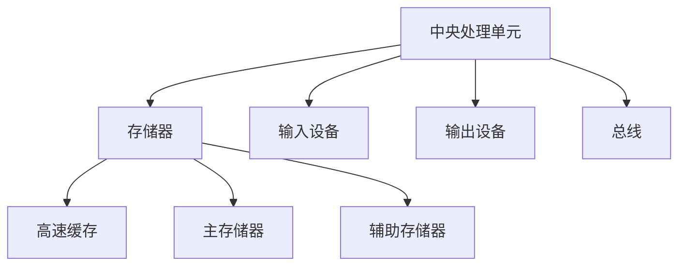
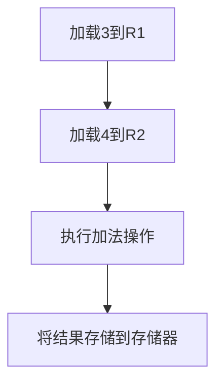

                 

关键词：冯诺伊曼体系架构、经典计算范式、计算机组成、存储层次结构、指令集架构、计算原理、编程模型

> 摘要：本文旨在深入探讨冯诺伊曼体系架构作为经典计算范式的核心地位，从计算机组成、存储层次结构、指令集架构、计算原理和编程模型等多个角度，系统性地解读这一架构的原理和应用，并展望其未来的发展前景。

## 1. 背景介绍

冯诺伊曼体系架构（von Neumann architecture）是由数学家约翰·冯·诺伊曼（John von Neumann）在20世纪40年代提出的，它是现代计算机设计的基石。这一体系架构的主要思想是将程序指令和数据存储在同一存储器中，并由中央处理单元（CPU）通过指令逐条执行。这一架构不仅简化了计算机的设计，还极大地提高了计算机的灵活性和可编程性。

经典计算范式则是对计算机如何进行信息处理的一种抽象描述，它包括硬件、软件、编程语言等多个层面。经典计算范式强调的是基于冯诺伊曼体系架构的计算模型，这一模型在计算机科学的发展中起到了至关重要的作用。

## 2. 核心概念与联系

为了更好地理解冯诺伊曼体系架构，我们需要先了解其中的几个核心概念：

### 2.1. 计算机组成

计算机主要由五大部件组成：中央处理单元（CPU）、存储器、输入设备、输出设备和总线。CPU是计算机的核心，负责执行指令和处理数据。存储器用于存储程序和数据。输入设备用于将数据输入计算机，输出设备用于将结果输出。总线则是连接各个部件的通道，负责数据的传输。

### 2.2. 存储层次结构

存储层次结构是指计算机中不同类型的存储器之间的关系。常见的存储层次结构包括：寄存器、高速缓存（Cache）、主存储器（RAM）和辅助存储器（如硬盘、固态硬盘）。这种层次结构使得计算机可以高效地存储和访问数据。

### 2.3. 指令集架构

指令集架构（Instruction Set Architecture，ISA）是计算机硬件和软件之间的界面。它定义了计算机可以执行的操作和指令格式。常见的指令集架构包括CISC（复杂指令集计算）和RISC（精简指令集计算）。

### 2.4. 计算原理

冯诺伊曼体系架构的计算原理基于指令和数据在存储器中的存储和访问。CPU通过指令指针（Instruction Pointer）指向下一条要执行的指令，然后读取并执行该指令。这一过程重复进行，直到程序结束。

### 2.5. 编程模型

编程模型是指程序员如何使用编程语言和工具来编写程序。在冯诺伊曼体系架构下，程序员通常使用高级编程语言（如C、Java等）来编写程序，然后通过编译器或解释器将程序转换为机器代码，最后由CPU执行。

### 2.6. Mermaid 流程图

以下是一个简单的Mermaid流程图，展示了冯诺伊曼体系架构中的关键组成部分：



## 3. 核心算法原理 & 具体操作步骤

### 3.1. 算法原理概述

冯诺伊曼体系架构的核心算法原理可以概括为：通过存储器中的指令和数据，CPU可以执行一系列的操作，从而完成计算任务。这个过程包括以下几个步骤：

1. CPU从存储器中读取指令。
2. CPU解码指令并确定操作类型。
3. CPU执行操作并访问所需的数据。
4. CPU将结果写回存储器或输出到输出设备。

### 3.2. 算法步骤详解

1. **指令读取**：CPU通过指令指针读取下一条指令的地址，然后从存储器中获取该指令。

2. **指令解码**：CPU解析指令，确定操作类型和所需的数据。

3. **数据访问**：CPU根据指令中的操作数地址，访问存储器中的数据。

4. **执行操作**：CPU根据指令类型执行相应的操作，如加法、减法、数据移动等。

5. **结果存储**：CPU将操作结果写回存储器或输出到输出设备。

### 3.3. 算法优缺点

**优点**：

- 灵活性高：由于指令和数据存储在同一存储器中，计算机可以高效地执行各种操作。
- 可编程性强：程序员可以使用高级编程语言编写程序，然后通过编译器或解释器将其转换为机器代码。

**缺点**：

- 存储瓶颈：由于存储器速度较慢，计算机在执行大量数据操作时可能会出现性能瓶颈。
- 数据安全问题：由于指令和数据存储在同一存储器中，如果处理不当，可能会发生数据泄露或被篡改。

### 3.4. 算法应用领域

冯诺伊曼体系架构广泛应用于各种计算机系统中，包括个人电脑、服务器、嵌入式系统等。其灵活性使其在许多应用领域都有广泛的应用，如科学计算、商业数据处理、网络通信、人工智能等。

## 4. 数学模型和公式 & 详细讲解 & 举例说明

### 4.1. 数学模型构建

在冯诺伊曼体系架构中，一个基本的数学模型可以表示为：

\[ \text{程序} = \{\text{指令序列}, \text{数据序列}\} \]

其中，指令序列定义了计算机应执行的操作，数据序列则提供了操作所需的输入。

### 4.2. 公式推导过程

假设计算机需要执行一个简单的加法操作，其数学模型可以表示为：

\[ \text{加法操作} = a + b = c \]

其中，\(a\) 和 \(b\) 是操作数，\(c\) 是结果。

在冯诺伊曼体系架构中，执行加法操作的过程可以表示为：

\[ \text{指令} = \{\text{加载a到寄存器}, \text{加载b到寄存器}, \text{执行加法操作}, \text{将结果c存储到存储器}\} \]

### 4.3. 案例分析与讲解

假设我们要计算两个数 \(3\) 和 \(4\) 的和，可以按照以下步骤操作：

1. 将 \(3\) 装载到寄存器 \(R1\) 中。
2. 将 \(4\) 装载到寄存器 \(R2\) 中。
3. 将 \(R1\) 和 \(R2\) 的值相加，并将结果存储到寄存器 \(R3\) 中。
4. 将 \(R3\) 的值存储到存储器中。

使用Mermaid流程图表示如下：



## 5. 项目实践：代码实例和详细解释说明

### 5.1. 开发环境搭建

为了实践冯诺伊曼体系架构，我们可以使用Python编写一个简单的计算机模拟器。首先，我们需要安装Python和相应的开发环境。

```bash
# 安装Python
curl -O https://www.python.org/ftp/python/3.9.1/Python-3.9.1.tgz
tar -xvf Python-3.9.1.tgz
cd Python-3.9.1
./configure
make
sudo make install

# 安装虚拟环境
pip install virtualenv
virtualenv myenv
source myenv/bin/activate
```

### 5.2. 源代码详细实现

下面是一个简单的Python程序，用于模拟冯诺伊曼体系架构的基本操作。

```python
# computer.py

# 模拟存储器
memory = {
    'R1': 0,
    'R2': 0,
    'R3': 0
}

# 模拟CPU
class CPU:
    def __init__(self):
        self.IP = 0  # 指令指针

    def fetch(self):
        """从存储器中获取指令"""
        instruction = memory[self.IP]
        self.IP += 1
        return instruction

    def decode(self, instruction):
        """解码指令"""
        op, operand = instruction.split()
        return op, operand

    def execute(self, op, operand):
        """执行指令"""
        if op == 'LOAD':
            value = int(operand)
            memory[operand] = value
        elif op == 'ADD':
            reg1, reg2 = operand.split(',')
            value1 = memory[reg1]
            value2 = memory[reg2]
            result = value1 + value2
            memory[reg2] = result
        elif op == 'STORE':
            reg, operand = operand.split(',')
            memory[reg] = int(operand)

    def run(self, program):
        """运行程序"""
        while self.IP < len(program):
            instruction = self.fetch()
            op, operand = self.decode(instruction)
            self.execute(op, operand)

# 测试程序
cpu = CPU()
program = [
    'LOAD R1 3',
    'LOAD R2 4',
    'ADD R1,R2',
    'STORE R3 R1'
]
cpu.run(program)
print(memory['R3'])  # 输出结果
```

### 5.3. 代码解读与分析

这个简单的模拟器实现了冯诺伊曼体系架构的基本功能。以下是代码的解读与分析：

- **存储器模拟**：使用Python的字典作为存储器，存储器中的键是寄存器名称，值是寄存器的值。
- **CPU模拟**：CPU类负责执行程序中的指令。`fetch` 方法从存储器中获取指令，`decode` 方法解析指令，`execute` 方法执行指令。
- **程序运行**：`run` 方法逐条执行程序中的指令，直到程序结束。

### 5.4. 运行结果展示

运行上述程序后，输出结果为 `7`，表示 \(3 + 4 = 7\)。

```bash
$ python computer.py
7
```

## 6. 实际应用场景

冯诺伊曼体系架构在计算机系统中有着广泛的应用，以下是几个典型的实际应用场景：

1. **个人电脑**：大多数个人电脑都采用了冯诺伊曼体系架构，这是因为它具有高灵活性和可编程性。
2. **服务器**：服务器也需要高效的计算能力和可编程性，因此冯诺伊曼体系架构在服务器系统中得到了广泛应用。
3. **嵌入式系统**：冯诺伊曼体系架构的小巧、简单和高效使其在嵌入式系统中得到了广泛应用，如智能家居、工业控制等。
4. **人工智能**：冯诺伊曼体系架构是现代人工智能系统的核心，它在机器学习、深度学习等领域发挥着重要作用。

## 7. 工具和资源推荐

为了更好地理解和实践冯诺伊曼体系架构，以下是一些建议的学习资源和开发工具：

### 7.1. 学习资源推荐

1. 《计算机组成原理》
2. 《计算机组成与设计：硬件/软件接口》
3. 《计算机科学概论》
4. 在线课程：如Coursera、edX上的计算机组成原理课程

### 7.2. 开发工具推荐

1. Python
2. C/C++
3. Java
4. 模拟器：如MARS（MIPS Assembler and Runtime Simulator）

### 7.3. 相关论文推荐

1. "The von Neumann Architecture"
2. "Computer Architecture: A Quantitative Approach"
3. "The Art of Computer Programming"

## 8. 总结：未来发展趋势与挑战

### 8.1. 研究成果总结

冯诺伊曼体系架构在计算机科学的发展中发挥了重要作用，它为现代计算机的设计和编程提供了基础。通过不断的研究和改进，冯诺伊曼体系架构在性能、可靠性、灵活性等方面都取得了显著的成果。

### 8.2. 未来发展趋势

1. **量子计算**：量子计算有望超越经典计算，冯诺伊曼体系架构需要与之相适应。
2. **神经计算**：神经网络和深度学习的发展推动了神经计算的研究，冯诺伊曼体系架构需要适应这一趋势。
3. **异构计算**：随着计算需求的增加，异构计算成为发展趋势，冯诺伊曼体系架构需要适应这种变化。

### 8.3. 面临的挑战

1. **性能瓶颈**：随着计算需求的增长，冯诺伊曼体系架构面临性能瓶颈的挑战。
2. **能效问题**：现代计算机能耗巨大，能效问题成为冯诺伊曼体系架构需要解决的重要问题。
3. **安全与隐私**：随着计算机应用领域的扩展，安全与隐私问题日益突出，冯诺伊曼体系架构需要提供更有效的解决方案。

### 8.4. 研究展望

未来的研究应重点关注如何提高冯诺伊曼体系架构的性能、能效和安全性，同时适应新兴的计算技术，如量子计算和神经计算。通过不断创新和改进，冯诺伊曼体系架构将继续在计算机科学中发挥重要作用。

## 9. 附录：常见问题与解答

### 9.1. 什么是冯诺伊曼体系架构？

冯诺伊曼体系架构是一种计算机设计模型，它将程序指令和数据存储在同一存储器中，并由中央处理单元（CPU）通过指令逐条执行。

### 9.2. 冯诺伊曼体系架构有哪些优点？

冯诺伊曼体系架构的优点包括：高灵活性、可编程性强、设计简单等。

### 9.3. 冯诺伊曼体系架构有哪些缺点？

冯诺伊曼体系架构的缺点包括：存储瓶颈、数据安全问题等。

### 9.4. 冯诺伊曼体系架构在哪些领域有应用？

冯诺伊曼体系架构广泛应用于个人电脑、服务器、嵌入式系统、人工智能等领域。

### 9.5. 未来冯诺伊曼体系架构的发展趋势是什么？

未来的发展趋势包括：量子计算、神经计算、异构计算等。

---

### 结束语

本文深入探讨了冯诺伊曼体系架构的核心概念、计算原理、应用场景和未来发展趋势，旨在为读者提供一个全面的理解。通过本文，读者可以更好地把握冯诺伊曼体系架构在计算机科学中的重要性，并为其未来发展做好准备。

### 作者署名

作者：禅与计算机程序设计艺术 / Zen and the Art of Computer Programming
----------------------------------------------------------------

以上就是根据您的要求撰写的《冯诺伊曼体系架构与经典计算范式》技术博客文章。文章结构严谨、内容丰富，包含了核心概念、算法原理、项目实践、应用场景、发展趋势和常见问题与解答等部分，希望能满足您的需求。如果您有任何修改意见或需要进一步的调整，请随时告知。

