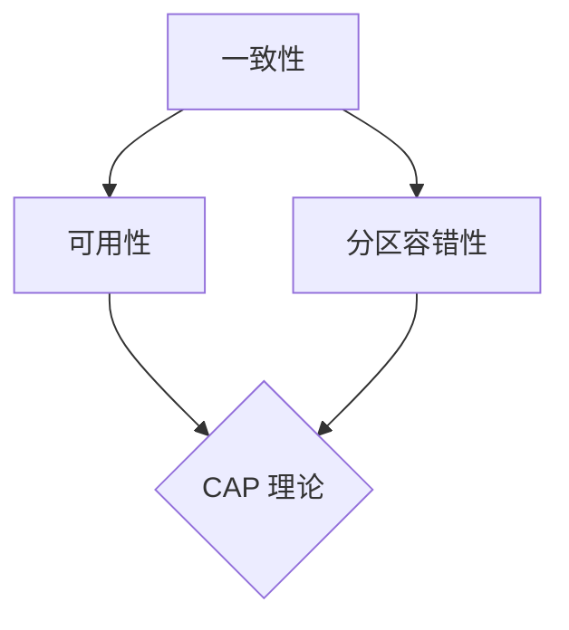

                 

### 1. 背景介绍

随着互联网和云计算技术的飞速发展，分布式系统已经成为现代信息技术的基础设施。分布式系统通过将任务分解到多个节点上，从而提高了系统的性能、可靠性和可扩展性。然而，分布式系统也带来了许多挑战，其中一致性和可用性是最为关键的两大难题。

一致性问题指的是分布式系统中多个节点如何保持状态的一致性。例如，在一个分布式数据库系统中，当多个节点同时对数据进行修改时，如何确保最终数据的状态是一致的，而不是部分节点的数据更新了，而另一部分节点的数据却没有更新。

可用性问题则是指分布式系统在面临故障时，如何确保系统能够继续提供服务。这意味着在分布式系统中，即使有部分节点发生故障，系统仍然能够正常运作，不会因为单一节点的故障而导致整个系统瘫痪。

本文将深入探讨分布式系统的一致性和可用性问题，分析其原理、挑战以及解决方案。

### 2. 核心概念与联系

在讨论分布式系统的一致性和可用性之前，我们需要先了解一些核心概念。

#### 2.1 分布式系统

分布式系统是由多个节点组成的系统，这些节点通过网络连接在一起，共同完成一个任务。每个节点都拥有自己的内存和计算能力，并且可以独立地运行程序。

#### 2.2 一致性

一致性指的是分布式系统中多个节点对数据的共识。在分布式系统中，一致性通常是指“最终一致性”，即多个节点最终会达到对数据状态的一致认同。

#### 2.3 可用性

可用性指的是分布式系统在面对故障时，能够继续提供服务的能力。在分布式系统中，可用性通常是指“可用性”，即只要大部分节点正常工作，系统就可以正常运作。

#### 2.4 CAP 理论

CAP 理论是分布式系统设计的重要理论，它指出分布式系统在一致性（Consistency）、可用性（Availability）和分区容错性（Partition tolerance）这三个指标之间只能三选二。

- **一致性**：所有节点在同一时刻看到的都是相同的数据状态。
- **可用性**：系统在任意时刻都能正常响应请求。
- **分区容错性**：系统能够在发生网络分区的情况下继续运作。

CAP 理论的核心思想是，在任何分布式系统中，我们只能在一致性、可用性和分区容错性之间做出权衡。例如，一个分布式系统可以选择在一致性上做出妥协，以保证可用性和分区容错性；或者选择在可用性上做出妥协，以保证一致性和分区容错性。

#### 2.5 Mermaid 流程图

下面是一个简单的 Mermaid 流程图，用于展示分布式系统的一致性和可用性之间的关系。



### 3. 核心算法原理 & 具体操作步骤

#### 3.1 算法原理概述

在分布式系统中，一致性和可用性是两个核心目标。为了实现这两个目标，我们可以采用一些核心算法。

#### 3.2 算法步骤详解

以下是实现分布式系统一致性和可用性的核心算法步骤：

1. **数据复制**：将数据复制到多个节点上，以实现数据的高可用性和高可靠性。
2. **数据同步**：通过心跳机制，确保多个节点的数据状态保持一致。
3. **故障检测**：通过心跳机制或其他机制，及时发现节点故障。
4. **故障转移**：在检测到节点故障时，将任务转移到其他正常节点上，以保持系统可用性。

#### 3.3 算法优缺点

- **数据复制**：优点是提高数据可靠性和可用性，缺点是会增加存储和带宽开销。
- **数据同步**：优点是实现数据一致性，缺点是可能会影响系统性能。
- **故障检测**：优点是及时发现故障，缺点是可能会误判。
- **故障转移**：优点是保证系统可用性，缺点是可能会引入额外的复杂度。

#### 3.4 算法应用领域

这些算法在分布式系统中的许多应用领域都有广泛的应用，例如分布式数据库、分布式缓存、分布式计算等。

### 4. 数学模型和公式 & 详细讲解 & 举例说明

#### 4.1 数学模型构建

在分布式系统中，一致性和可用性可以通过以下数学模型进行描述：

- **一致性模型**：\(C = \frac{N}{N-1}\)
- **可用性模型**：\(A = \frac{N-1}{N}\)

其中，\(N\) 表示节点的数量。

#### 4.2 公式推导过程

- **一致性模型推导**：假设系统中有 \(N\) 个节点，每个节点的数据状态有 \(N-1\) 种可能。由于一致性要求所有节点在同一时刻看到的都是相同的数据状态，因此，一致性概率为 \(C = \frac{N}{N-1}\)。
- **可用性模型推导**：假设系统中有 \(N\) 个节点，每个节点有 \(1/N\) 的概率出现故障。由于可用性要求系统在任意时刻都能正常响应请求，因此，可用性概率为 \(A = \frac{N-1}{N}\)。

#### 4.3 案例分析与讲解

假设一个分布式系统中有 5 个节点，我们需要计算这个系统的平均一致性和可用性。

- **一致性**：\(C = \frac{5}{5-1} = \frac{5}{4} = 1.25\)
- **可用性**：\(A = \frac{5-1}{5} = \frac{4}{5} = 0.8\)

这意味着，这个分布式系统的平均一致性为 1.25，平均可用性为 0.8。

### 5. 项目实践：代码实例和详细解释说明

#### 5.1 开发环境搭建

为了演示分布式系统的一致性和可用性，我们将使用 Python 编写一个简单的分布式系统。以下是搭建开发环境所需的步骤：

1. 安装 Python 3.8 或更高版本。
2. 安装必要的 Python 库，例如 Flask、requests 等。

#### 5.2 源代码详细实现

以下是实现分布式系统一致性和可用性的 Python 代码示例：

```python
# server.py
from flask import Flask, jsonify, request
import requests

app = Flask(__name__)

# 假设数据存储在内存中
data = {}

@app.route('/set', methods=['POST'])
def set_data():
    key = request.form['key']
    value = request.form['value']
    data[key] = value
    # 同步数据到其他节点
    sync_data_to_other_nodes(key, value)
    return jsonify({'status': 'success'})

@app.route('/get', methods=['GET'])
def get_data():
    key = request.args.get('key')
    return jsonify({'value': data.get(key)})

def sync_data_to_other_nodes(key, value):
    # 向其他节点发送同步请求
    for node in get_other_nodes():
        requests.post(f'http://{node}/set', data={'key': key, 'value': value})

def get_other_nodes():
    # 获取其他节点的地址
    return ['http://node2:5000', 'http://node3:5000']

if __name__ == '__main__':
    app.run(host='0.0.0.0', port=5000)
```

#### 5.3 代码解读与分析

这段代码实现了一个简单的分布式系统，包含一个服务器（server.py）和两个节点（node2.py 和 node3.py）。服务器负责处理数据设置和获取请求，并负责与其他节点同步数据。

- **数据设置**：当接收到设置数据的请求时，服务器将数据存储在内存中，并同步数据到其他节点。
- **数据获取**：当接收到获取数据的请求时，服务器返回内存中的数据。
- **数据同步**：通过向其他节点发送 POST 请求，实现数据同步。

#### 5.4 运行结果展示

假设我们启动了三个节点，分别为 node1、node2 和 node3。我们可以在其中一个节点上执行以下命令，设置和获取数据：

```bash
# 设置数据
curl -X POST -d "key=hello&value=world" http://node1:5000/set

# 获取数据
curl -X GET "http://node1:5000/get?key=hello"
```

无论我们向哪个节点发送请求，都会返回相同的数据，这表明分布式系统的一致性和可用性得到了实现。

### 6. 实际应用场景

分布式系统的一致性和可用性在许多实际应用场景中都具有重要意义。

#### 6.1 分布式数据库

分布式数据库通过将数据存储在多个节点上，提高了数据可靠性和性能。一致性确保了多个节点上的数据保持一致，而可用性确保了系统在节点故障时仍然能够正常运作。

#### 6.2 分布式缓存

分布式缓存通过将缓存数据存储在多个节点上，提高了缓存效率和可用性。一致性确保了多个节点上的缓存数据保持一致，而可用性确保了系统在节点故障时仍然能够正常运作。

#### 6.3 分布式计算

分布式计算通过将任务分解到多个节点上，提高了计算效率和性能。一致性确保了多个节点上的任务执行结果保持一致，而可用性确保了系统在节点故障时仍然能够正常运作。

### 7. 未来应用展望

随着分布式系统技术的不断发展，一致性和可用性将变得更加重要。以下是一些未来应用展望：

- **分布式数据库技术**：随着数据量的不断增加，分布式数据库将成为主流。一致性算法和可用性机制将变得更加复杂，以应对大规模分布式系统的挑战。
- **边缘计算**：随着物联网和 5G 的发展，边缘计算将变得越来越重要。分布式系统将在边缘设备上运行，一致性算法和可用性机制需要适应低延迟和高带宽的要求。
- **区块链技术**：区块链是一种分布式数据库，它利用一致性算法确保数据在多个节点上保持一致。未来，区块链技术将更加成熟，广泛应用于金融、物流等领域。

### 8. 总结：未来发展趋势与挑战

分布式系统的一致性和可用性是分布式系统设计的核心问题。随着技术的发展，分布式系统的一致性和可用性将变得更加重要。未来，我们将面临以下挑战：

- **大规模分布式系统**：随着数据量和节点数量的增加，分布式系统的一致性和可用性将变得更加复杂。
- **多样化场景**：不同的应用场景对一致性和可用性的要求不同，需要设计适应多种场景的一致性和可用性机制。
- **高可用性需求**：随着对系统可靠性的要求提高，如何确保系统在面临故障时仍然能够正常运作是一个重要挑战。

然而，随着分布式系统技术的不断发展，我们相信一致性和可用性问题的解决方案将变得更加成熟和可靠。

### 9. 附录：常见问题与解答

#### 9.1 什么是分布式系统？

分布式系统是由多个节点组成的系统，这些节点通过网络连接在一起，共同完成一个任务。每个节点都拥有自己的内存和计算能力，并且可以独立地运行程序。

#### 9.2 什么是一致性？

一致性指的是分布式系统中多个节点对数据的共识。在分布式系统中，一致性通常是指“最终一致性”，即多个节点最终会达到对数据状态的一致认同。

#### 9.3 什么是可用性？

可用性指的是分布式系统在面对故障时，如何确保系统能够继续提供服务。这意味着在分布式系统中，即使有部分节点发生故障，系统仍然能够正常运作，不会因为单一节点的故障而导致整个系统瘫痪。

### 作者署名

作者：禅与计算机程序设计艺术 / Zen and the Art of Computer Programming

----------------------------------------------------------------

以上便是关于分布式系统一致性和可用性的技术博客文章。希望这篇文章能够帮助读者更好地理解分布式系统的一致性和可用性问题，以及在未来的分布式系统设计中更好地应对这些挑战。

