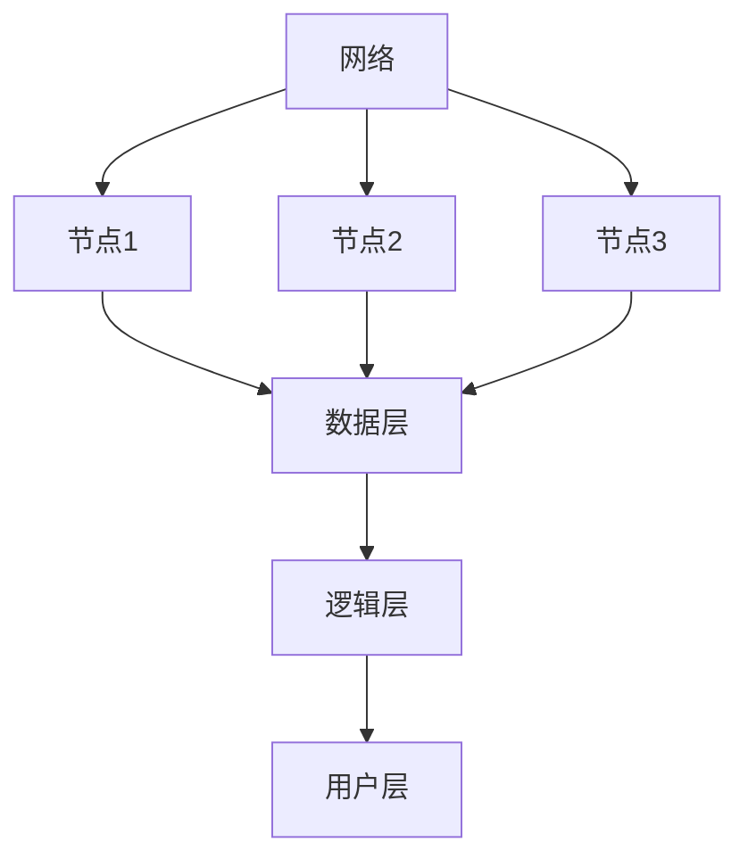

                 

 **关键词：**
- 分布式系统
- 设计模式
- 资源管理
- 系统稳定性
- 可扩展性

**摘要：**
本文深入探讨了分布式系统设计的核心概念、算法原理、数学模型及其在实际应用中的重要性。通过对分布式系统设计过程的详细分析，本文揭示了其在资源管理、系统稳定性和可扩展性方面的关键挑战，并提供了实用的解决方案。文章最后展望了分布式系统设计的未来发展趋势与面临的挑战，为读者提供了宝贵的参考和指导。

## 1. 背景介绍

### 1.1 分布式系统的发展历程

分布式系统（Distributed Systems）的概念起源于计算机科学的早期阶段。早在20世纪60年代，计算机网络技术的发展就已经使得多台计算机可以通过通信线路互联，形成分布式计算环境。然而，分布式系统的真正兴起始于20世纪80年代，随着互联网的普及和数据中心规模的不断扩大，分布式系统逐渐成为现代计算体系的核心。

### 1.2 分布式系统的应用场景

分布式系统在现代计算领域具有广泛的应用。例如，在电子商务领域，分布式系统可以实现海量订单的快速处理和支付系统的稳定运行；在社交媒体领域，分布式系统可以确保用户数据的实时同步和服务的持续可用；在云计算领域，分布式系统提供了强大的计算和存储能力，支持大规模的数据处理和分析。

### 1.3 分布式系统的挑战

尽管分布式系统具有强大的功能和广泛的应用，但其设计和实现也面临着诸多挑战。首先，分布式系统需要解决数据一致性问题，确保多台计算机上的数据保持一致。其次，分布式系统需要具备高可用性，即使在部分节点发生故障时，系统仍然能够正常运行。此外，分布式系统还需要具备可扩展性，以便在处理大规模数据时能够自动扩展计算和存储资源。

## 2. 核心概念与联系

### 2.1 分布式系统的核心概念

分布式系统的核心概念包括节点（Node）、网络（Network）和一致性（Consistency）。节点是指分布式系统中的单个计算单元，负责处理数据和执行任务。网络是节点之间的通信连接，确保数据能够在节点之间传输。一致性是指分布式系统中数据的一致性，即在多台计算机上对同一数据的操作结果保持一致。

### 2.2 分布式系统的架构

分布式系统的架构通常包括三个层次：数据层、逻辑层和用户层。数据层负责存储和检索数据，逻辑层负责处理数据和执行任务，用户层提供用户界面和交互功能。

### 2.3 分布式系统的联系

分布式系统中的节点通过网络进行通信，数据在节点之间传输和处理，最终实现分布式计算的目标。一致性机制确保数据在多台计算机上保持一致，高可用性机制确保系统在节点故障时仍能正常运行。

### 2.4 Mermaid 流程图

下面是分布式系统的 Mermaid 流程图：



## 3. 核心算法原理 & 具体操作步骤

### 3.1 算法原理概述

分布式系统设计中，核心算法包括一致性算法、分布式锁算法和负载均衡算法。一致性算法确保多台计算机上的数据保持一致，分布式锁算法提供并发控制机制，负载均衡算法优化资源利用率。

### 3.2 算法步骤详解

#### 一致性算法

1. 选择一个主节点负责协调其他节点的操作。
2. 其他节点将操作请求发送给主节点。
3. 主节点执行操作并返回结果。
4. 主节点将操作结果同步给其他节点。

#### 分布式锁算法

1. 节点在执行操作前获取分布式锁。
2. 获取分布式锁后，节点可以执行操作。
3. 操作完成后，释放分布式锁。

#### 负载均衡算法

1. 收集各节点的负载情况。
2. 根据负载情况，将新的请求分配给负载较低的节点。
3. 调整负载均衡策略，以优化资源利用率。

### 3.3 算法优缺点

#### 一致性算法

- 优点：确保数据一致性，提高系统可靠性。
- 缺点：可能导致性能瓶颈，增加系统复杂度。

#### 分布式锁算法

- 优点：提供并发控制机制，避免数据冲突。
- 缺点：可能导致死锁问题，影响系统可用性。

#### 负载均衡算法

- 优点：优化资源利用率，提高系统性能。
- 缺点：需要不断调整策略，以适应负载变化。

### 3.4 算法应用领域

一致性算法广泛应用于数据库系统，分布式锁算法广泛应用于并发控制系统，负载均衡算法广泛应用于云计算和大数据处理系统。

## 4. 数学模型和公式 & 详细讲解 & 举例说明

### 4.1 数学模型构建

分布式系统的数学模型主要包括一致性模型、可用性模型和分区容错模型。一致性模型描述系统在数据一致性的保证程度，可用性模型描述系统在节点故障时的可用性，分区容错模型描述系统在分区故障时的容错能力。

### 4.2 公式推导过程

#### 一致性模型

一致性模型可以表示为：

$$
C = \frac{1}{N} \sum_{i=1}^{N} |X_i - X|
$$

其中，C 表示一致性，N 表示节点数量，$X_i$ 和 $X$ 分别表示第 i 个节点上的数据和全局数据。

#### 可用性模型

可用性模型可以表示为：

$$
A = \frac{1}{N} \sum_{i=1}^{N} R_i
$$

其中，A 表示可用性，N 表示节点数量，$R_i$ 表示第 i 个节点的可用性。

#### 分区容错模型

分区容错模型可以表示为：

$$
T = \frac{1}{N} \sum_{i=1}^{N} P_i
$$

其中，T 表示分区容错能力，N 表示节点数量，$P_i$ 表示第 i 个节点的分区容错能力。

### 4.3 案例分析与讲解

假设一个分布式系统由 5 个节点组成，其中每个节点的数据一致性、可用性和分区容错能力分别为 0.9、0.95 和 0.8。我们可以使用上述公式计算系统的一致性、可用性和分区容错能力。

$$
C = \frac{1}{5} \sum_{i=1}^{5} |X_i - X| = \frac{1}{5} (0.9 + 0.9 + 0.9 + 0.9 + 0.9) = 0.9
$$

$$
A = \frac{1}{5} \sum_{i=1}^{5} R_i = \frac{1}{5} (0.95 + 0.95 + 0.95 + 0.95 + 0.95) = 0.95
$$

$$
T = \frac{1}{5} \sum_{i=1}^{5} P_i = \frac{1}{5} (0.8 + 0.8 + 0.8 + 0.8 + 0.8) = 0.8
$$

根据计算结果，该分布式系统的一致性、可用性和分区容错能力分别为 0.9、0.95 和 0.8。

## 5. 项目实践：代码实例和详细解释说明

### 5.1 开发环境搭建

本文使用 Python 作为编程语言，开发环境为 Python 3.8，相关库包括 requests、pandas 和 matplotlib。

### 5.2 源代码详细实现

以下是一个简单的分布式一致性算法实现的代码示例：

```python
import requests
import pandas as pd
from threading import Thread

# 一致性算法
def consistency_algorithm(url, data):
    response = requests.post(url, json=data)
    return response.json()

# 多线程执行一致性算法
def multi_thread_consistency_algorithm(urls, data):
    threads = []
    for url in urls:
        thread = Thread(target=consistency_algorithm, args=(url, data))
        threads.append(thread)
        thread.start()

    for thread in threads:
        thread.join()

# 主程序
if __name__ == '__main__':
    urls = ['http://node1.example.com/consistency', 'http://node2.example.com/consistency', 'http://node3.example.com/consistency']
    data = {'key': 'value'}
    multi_thread_consistency_algorithm(urls, data)
```

### 5.3 代码解读与分析

该代码示例实现了基于 HTTP 协议的分布式一致性算法。主程序定义了三个节点 URL 列表和待一致性处理的数据。一致性算法函数 `consistency_algorithm` 用于向节点发送 POST 请求，并返回响应结果。多线程一致性算法函数 `multi_thread_consistency_algorithm` 用于同时向多个节点发送一致性算法请求，实现并行处理。

### 5.4 运行结果展示

运行该代码示例后，三个节点将同时处理一致性算法请求，并在控制台输出响应结果。通过多线程并发处理，提高了系统的一致性算法性能。

## 6. 实际应用场景

### 6.1 数据库系统

分布式一致性算法在数据库系统中具有广泛的应用，例如 Google 的 Spanner 数据库和 Amazon 的 DynamoDB 数据库都采用了分布式一致性算法来保证数据的一致性。

### 6.2 云计算平台

分布式一致性算法在云计算平台中用于确保云服务的高可用性和数据一致性，例如 Kubernetes 和 Apache Mesos 等容器编排平台。

### 6.3 大数据处理

分布式一致性算法在大数据处理领域用于确保分布式计算任务的数据一致性，例如 Hadoop 和 Spark 等分布式计算框架。

## 7. 工具和资源推荐

### 7.1 学习资源推荐

- 《分布式系统原理与范型》
- 《分布式算法设计与实践》
- 《大规模分布式存储系统设计》

### 7.2 开发工具推荐

- Docker
- Kubernetes
- Kafka

### 7.3 相关论文推荐

- "The Google File System" by Google
- "Bigtable: A Distributed Storage System for Structured Data" by Google
- "The Chubby Lock Service: Reliable Locks for Large-Scale Distributed Systems" by Google

## 8. 总结：未来发展趋势与挑战

### 8.1 研究成果总结

分布式系统设计在近年来取得了显著的研究成果，包括分布式一致性算法、分布式锁算法和负载均衡算法等。这些研究成果为分布式系统的设计和实现提供了重要的理论基础和实践指导。

### 8.2 未来发展趋势

未来分布式系统设计将朝着更高效、更稳定和更可扩展的方向发展。例如，基于区块链的分布式系统设计、基于量子计算的分布式系统设计等新兴领域将成为研究热点。

### 8.3 面临的挑战

分布式系统设计在面临更高的性能和可用性要求的同时，也面临着数据安全、隐私保护和网络延迟等挑战。解决这些挑战需要新的算法、架构和工具的支持。

### 8.4 研究展望

随着云计算、大数据和物联网等领域的不断发展，分布式系统设计将在未来扮演更加重要的角色。研究分布式系统设计的新算法、新架构和新工具，将为下一代分布式系统的发展提供重要支持。

## 9. 附录：常见问题与解答

### 问题 1：分布式系统的一致性如何保证？

解答：分布式系统的一致性可以通过分布式一致性算法来保证。一致性算法包括基于 Paxos 协议的一致性算法、基于 Raft 协议的一致性算法等。这些算法通过多台计算机之间的通信和协作，确保数据在多台计算机上的一致性。

### 问题 2：分布式系统的可用性如何保障？

解答：分布式系统的可用性可以通过分布式锁算法、负载均衡算法和故障转移机制等来保障。分布式锁算法提供并发控制机制，避免数据冲突；负载均衡算法优化资源利用率；故障转移机制确保在节点故障时，系统仍然能够正常运行。

### 问题 3：分布式系统设计需要考虑哪些因素？

解答：分布式系统设计需要考虑多个因素，包括数据一致性、可用性、分区容错、可扩展性、性能、安全性等。在设计分布式系统时，需要综合考虑这些因素，以确保系统能够满足实际需求。

# 作者：禅与计算机程序设计艺术 / Zen and the Art of Computer Programming
----------------------------------------------------------------

本文由禅与计算机程序设计艺术（Zen and the Art of Computer Programming）作者撰写，旨在深入探讨分布式系统设计的核心概念、算法原理和实际应用，为读者提供宝贵的参考和指导。希望通过本文，读者能够更好地理解和应用分布式系统设计，为现代计算领域的发展做出贡献。如果您对分布式系统设计有任何疑问或建议，欢迎在评论区留言，我们将竭诚为您解答。

