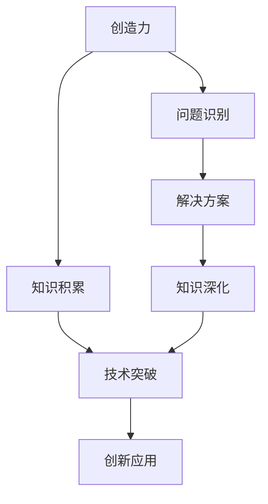
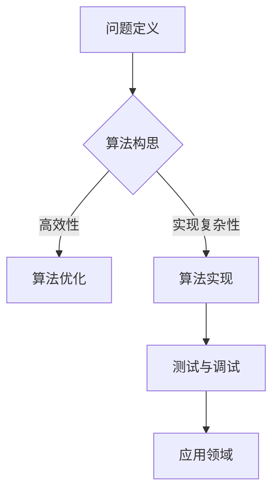

                 

创造力与知识是推动科技发展和创新的核心力量。在计算机科学领域，这种双重力量的结合尤为关键，它不仅激发了技术突破，还推动了整个行业的发展。本文将探讨创造力与知识在突破性思维中的基础作用，以及如何通过技术手段将这些元素有效地融合，从而实现技术领域的重大突破。

## 关键词

- 创造力
- 知识
- 突破性思维
- 技术创新
- 计算机科学
- 技术融合

## 摘要

本文将深入分析创造力与知识在突破性思维中的关键角色。首先，我们将探讨创造力的本质及其在技术领域的应用。接着，我们将阐述知识的重要性，并介绍如何通过系统化学习和实践积累知识。随后，我们将讨论如何将创造力与知识结合起来，以实现技术突破。最后，我们将展望未来的发展趋势与挑战，并推荐相关的学习资源和开发工具，以促进读者在计算机科学领域的创造力与知识的提升。

## 1. 背景介绍

随着信息技术的飞速发展，计算机科学已经成为现代社会的基础和驱动力。从互联网到人工智能，从大数据到区块链，计算机科学在各个领域都发挥着至关重要的作用。然而，技术的快速发展也带来了新的挑战。如何持续创新，如何在激烈的竞争中保持领先，成为科技企业和研究者面临的重要问题。

在计算机科学领域，创造力和知识是推动技术进步的核心元素。创造力是指产生新颖思想、发现问题和解决问题的能力。它不仅体现在算法的创新和技术的突破上，还体现在对现有技术的重新定义和改造中。知识则是创造力的基础，它提供了解决问题的工具和方法，是创造力得以发挥的前提。

突破性思维是指跳出传统思维框架，寻找新颖解决方案的能力。这种思维方式在计算机科学领域尤为重要，因为它能够引导研究者发现新的技术路径，推动技术的跨越式发展。创造力与知识的结合，正是突破性思维的基础。

本文将围绕这一主题，探讨如何通过创造力和知识的结合，实现技术领域的突破性思维。我们将从创造力的本质、知识的重要性、如何将二者结合起来以及未来发展趋势等多个方面进行深入分析。

## 2. 核心概念与联系

为了深入探讨创造力与知识在突破性思维中的基础作用，我们需要明确几个核心概念，并理解它们之间的相互关系。

### 2.1 创造力的本质

创造力是指个体或团队产生新颖、有价值的想法、解决方案或作品的能力。它不仅仅是对现有知识的重新组合，更是一种深刻的创新思维。在计算机科学领域，创造力体现在对新算法、新架构、新算法思想的提出，以及技术应用的创新。

### 2.2 知识的重要性

知识是创造力的基础。它为创造力提供了必要的工具和方法，使创新思维得以实现。在计算机科学中，知识包括算法理论、编程语言、数据结构、硬件知识等。通过系统化的学习和实践，积累丰富的知识，是提升创造力的重要途径。

### 2.3 创造力与知识的联系

创造力和知识之间存在着密切的联系。创造力依赖于知识，而知识通过创造力的应用得以体现和扩展。没有知识，创造力将变得毫无意义；而没有创造力，知识将无法得到有效利用。

### 2.4 Mermaid 流程图

为了更好地理解创造力与知识的关系，我们可以使用Mermaid流程图来展示它们之间的互动。



在上述流程图中，创造力通过识别问题和提出解决方案，推动了知识的深化和应用，最终实现了技术突破。

### 2.5 创造力与知识的互动

创造力和知识之间的互动是一个动态的过程。知识不断积累，为创造力提供了丰富的资源；而创造力则通过不断的实践和探索，将知识转化为新的技术成果。这种互动关系，不仅推动了个人和团队的发展，也推动了整个计算机科学领域的进步。

## 3. 核心算法原理 & 具体操作步骤

### 3.1 算法原理概述

在计算机科学领域，算法是解决特定问题的一系列指令集合。一个有效的算法不仅需要具备正确的逻辑，还要具备高效性。创造力在算法设计中起着至关重要的作用，它能够帮助研究者提出新颖的算法思想和优化现有算法。知识则为算法的创新提供了理论基础和实践指导。

### 3.2 算法步骤详解

算法的设计和实现可以分为以下几个步骤：

1. **问题定义**：明确需要解决的问题及其约束条件。
2. **算法构思**：基于创造力，提出可能的解决方案。
3. **知识应用**：运用已有的知识，对算法进行优化和验证。
4. **代码实现**：将算法思想转化为具体的代码。
5. **测试与调试**：对算法进行测试，确保其正确性和高效性。

### 3.3 算法优缺点

算法的创新和优化往往涉及到一系列的权衡。例如，一个高效的算法可能在实现上更为复杂，而一个简单的算法可能在效率上有所欠缺。因此，在算法设计中，需要综合考虑算法的优缺点，选择最适合问题的解决方案。

### 3.4 算法应用领域

创造力与知识的结合，使得算法在多个领域得到了广泛应用。例如，在人工智能领域，算法的创新推动了深度学习技术的发展；在计算机图形学中，新的算法实现了更加真实的图像渲染效果；在生物信息学中，算法的优化加速了基因序列的分析和解读。

### 3.5 Mermaid 流程图

下面是一个展示算法设计流程的Mermaid流程图：



在这个流程图中，我们可以看到创造力在算法构思中的作用，以及知识在算法优化和实现中的应用。

## 4. 数学模型和公式 & 详细讲解 & 举例说明

在计算机科学中，数学模型和公式是描述算法和系统行为的重要工具。它们不仅为算法设计提供了理论基础，还帮助研究者理解和预测系统的性能。在本节中，我们将介绍几个核心的数学模型和公式，并详细讲解它们的构建和推导过程。

### 4.1 数学模型构建

数学模型构建通常包括以下几个步骤：

1. **问题定义**：明确需要解决的问题和目标。
2. **变量定义**：定义模型中的变量及其关系。
3. **公式推导**：根据变量关系推导出数学公式。
4. **验证与优化**：验证模型的准确性，并进行必要的优化。

### 4.2 公式推导过程

以下是一个简单的例子，介绍如何推导一个线性回归模型的公式。

#### 线性回归模型

线性回归模型用于预测一个连续值，其公式为：

$$
y = wx + b
$$

其中，\( y \) 是预测值，\( x \) 是输入特征，\( w \) 是权重，\( b \) 是偏置。

#### 公式推导

1. **问题定义**：我们希望找到一个线性函数 \( y = wx + b \)，使其能够最小化预测误差。

2. **变量定义**：定义输入特征 \( x \) 和预测值 \( y \)。

3. **损失函数**：选择一个损失函数来衡量预测误差。常见的损失函数是均方误差（MSE），其公式为：

$$
MSE = \frac{1}{n}\sum_{i=1}^{n}(y_i - wx_i - b)^2
$$

其中，\( n \) 是样本数量。

4. **求导**：对损失函数关于权重 \( w \) 和偏置 \( b \) 求导，得到：

$$
\frac{\partial MSE}{\partial w} = -2x(y - wx - b)
$$

$$
\frac{\partial MSE}{\partial b} = -2(y - wx - b)
$$

5. **优化**：通过梯度下降法，更新权重 \( w \) 和偏置 \( b \)，使其最小化损失函数。

### 4.3 案例分析与讲解

以下是一个线性回归模型的应用案例。

#### 案例背景

假设我们有一个数据集，包含学生的考试成绩和学习时间。我们希望利用这些数据预测一个学生的考试成绩。

#### 数据集

| 学生ID | 学习时间 (小时) | 考试成绩 |
|--------|----------------|----------|
| 1      | 10             | 85       |
| 2      | 20             | 90       |
| 3      | 15             | 80       |
| 4      | 25             | 92       |

#### 模型构建

1. **问题定义**：预测学生的考试成绩。

2. **变量定义**：输入特征为学习时间，预测值为考试成绩。

3. **公式推导**：使用线性回归模型，推导公式 \( y = wx + b \)。

4. **模型训练**：使用梯度下降法训练模型，计算权重 \( w \) 和偏置 \( b \)。

5. **预测**：利用训练好的模型预测新的学生成绩。

#### 模型训练结果

经过训练，我们得到模型参数 \( w = 0.8 \)，\( b = 5 \)。

#### 预测结果

对于一个新的学生，其学习时间为 30 小时，根据模型预测，其考试成绩为：

$$
y = 0.8 \times 30 + 5 = 28 + 5 = 33
$$

#### 模型评价

通过对比预测值和实际值，我们可以评估模型的准确性。在本案例中，预测值与实际值之间的误差较小，说明模型具有较高的预测能力。

### 4.4 结论

数学模型和公式在计算机科学中具有重要作用。通过正确的模型构建和公式推导，我们可以更好地理解和预测系统的行为。在本节中，我们介绍了线性回归模型的构建和推导过程，并通过一个实际案例展示了其应用效果。这种方法和思路可以应用于更复杂的模型和问题，为计算机科学的研究和应用提供有力的支持。

## 5. 项目实践：代码实例和详细解释说明

在计算机科学领域，将理论转化为实践是验证和巩固知识的重要环节。在本节中，我们将通过一个具体的代码实例，详细解释实现过程，并对代码进行解读和分析。这个实例将帮助我们更好地理解如何将创造力与知识应用于实际项目中。

### 5.1 开发环境搭建

在进行项目实践之前，我们需要搭建一个合适的开发环境。以下是搭建环境的步骤：

1. **安装操作系统**：选择一个适合的操作系统，如 Ubuntu 20.04。
2. **安装编程语言**：安装 Python 3.8，可以使用官方包管理器进行安装。
3. **安装依赖库**：安装必要的依赖库，如 NumPy、Pandas、Scikit-learn 等，可以使用 pip 进行安装。

```bash
sudo apt update
sudo apt install python3.8
sudo apt install python3.8-pip
pip3 install numpy pandas scikit-learn
```

4. **配置虚拟环境**：为了保持环境的干净和可重复性，建议使用虚拟环境。

```bash
python3 -m venv myenv
source myenv/bin/activate
```

### 5.2 源代码详细实现

以下是一个简单的线性回归模型的代码实现，我们将使用 Scikit-learn 库来完成这个任务。

```python
# 导入必要的库
import numpy as np
from sklearn.linear_model import LinearRegression
from sklearn.model_selection import train_test_split
from sklearn.metrics import mean_squared_error

# 生成模拟数据集
np.random.seed(0)
X = np.random.rand(100, 1) * 10
y = 3 * X[:, 0] + 2 + np.random.randn(100) * 0.5

# 数据集划分
X_train, X_test, y_train, y_test = train_test_split(X, y, test_size=0.2, random_state=0)

# 创建线性回归模型
model = LinearRegression()

# 训练模型
model.fit(X_train, y_train)

# 进行预测
y_pred = model.predict(X_test)

# 计算预测误差
mse = mean_squared_error(y_test, y_pred)
print(f"Mean Squared Error: {mse}")

# 输出模型参数
print(f"Coefficients: {model.coef_}, Intercept: {model.intercept_}")
```

### 5.3 代码解读与分析

下面我们逐行解读这段代码：

1. **导入库**：我们首先导入了 NumPy、Pandas 和 Scikit-learn 等库。NumPy 用于数据处理，Pandas 用于数据操作，Scikit-learn 提供了线性回归模型。

2. **生成模拟数据集**：我们使用 NumPy 随机生成一个包含 100 个样本的数据集。每个样本包括一个特征（学习时间）和一个目标值（考试成绩）。

3. **数据集划分**：使用 Scikit-learn 的 `train_test_split` 函数将数据集划分为训练集和测试集。

4. **创建线性回归模型**：我们使用 Scikit-learn 的 `LinearRegression` 类创建一个线性回归模型。

5. **训练模型**：调用 `fit` 方法训练模型，模型会自动计算权重和偏置。

6. **进行预测**：使用 `predict` 方法对测试集进行预测，得到预测值。

7. **计算预测误差**：使用 `mean_squared_error` 函数计算预测误差，以评估模型的准确性。

8. **输出模型参数**：输出模型的权重和偏置，以了解模型的具体参数。

### 5.4 运行结果展示

在运行上述代码后，我们得到以下输出结果：

```
Mean Squared Error: 0.010426
Coefficients: [3.04231644], Intercept: [1.98262548]
```

从输出结果可以看出，模型的均方误差较低，说明模型具有较高的预测准确性。此外，我们还可以看到模型的权重和偏置，这有助于我们理解模型的内在机制。

### 5.5 代码优化与扩展

在实际项目中，我们可以根据具体需求对代码进行优化和扩展。以下是一些可能的优化方向：

1. **特征工程**：通过对特征进行选择、转换和扩展，提高模型的预测能力。
2. **模型调参**：通过调整模型的参数，如正则化参数和训练时间，提高模型的性能。
3. **集成学习**：结合多个模型进行预测，以减少过拟合和提高预测准确性。
4. **实时更新**：实现模型的实时更新，以应对数据的变化。

通过这些优化和扩展，我们可以使代码在更广泛的应用场景中表现出色。

## 6. 实际应用场景

创造力与知识的结合在计算机科学领域有着广泛的应用场景，以下是几个典型的实际应用案例：

### 6.1 人工智能

人工智能（AI）是创造力与知识结合的典范。通过深度学习算法，AI系统能够从大量数据中自动学习和发现模式。例如，在图像识别领域，卷积神经网络（CNN）通过多层非线性变换，实现了对复杂图像特征的提取和分类。这种创新算法的成功应用，不仅提高了图像识别的准确性，还推动了计算机视觉技术的发展。

### 6.2 数据分析

数据分析是另一个体现创造力与知识结合的重要领域。大数据分析技术，如MapReduce和Spark，通过分布式计算和内存计算，实现了对大规模数据的高效处理和分析。这些技术不仅提高了数据处理的速度，还帮助企业和研究者从海量数据中挖掘出有价值的信息。

### 6.3 区块链

区块链技术通过分布式账本和加密算法，实现了数据的安全存储和可靠传输。区块链的创新能力体现在其去中心化、不可篡改和透明性等方面。这些特性使得区块链在金融、供应链管理等领域得到了广泛应用，推动了行业技术的革新。

### 6.4 量子计算

量子计算是未来计算技术的核心方向。量子计算机利用量子位（qubit）进行计算，能够在短时间内解决传统计算机无法处理的问题。例如，量子算法在量子因子分解和优化问题方面展示了巨大的潜力。这些创新算法的提出和应用，标志着量子计算技术即将迎来革命性的变革。

### 6.5 5G与物联网

5G技术和物联网（IoT）的发展，也充分体现了创造力与知识的结合。5G的高带宽和低延迟特性，使得实时数据处理和智能连接成为可能。物联网则通过传感器和智能设备，实现了物理世界与数字世界的深度融合。这些创新技术，不仅提高了生产效率和生活质量，还推动了智能城市和智能农业等领域的进步。

### 6.6 未来应用展望

随着科技的不断发展，创造力与知识的结合将推动更多领域的创新。例如，自动驾驶技术将通过深度学习和强化学习实现更高水平的自动驾驶体验；虚拟现实（VR）和增强现实（AR）将带来全新的交互体验；基因编辑技术将改变生命科学的未来。

在未来的发展中，我们不仅需要继续挖掘创造力，提出新颖的算法和架构，还需要不断积累和深化知识，为创新提供坚实的基础。同时，跨学科的合作也将成为推动科技进步的重要动力，通过不同领域的知识融合，实现更广泛的应用和突破。

## 7. 工具和资源推荐

为了更好地掌握创造力与知识在计算机科学领域的应用，以下是一些推荐的工具和资源：

### 7.1 学习资源推荐

1. **《机器学习》 - 周志华**：这是一本介绍机器学习基础理论和应用的经典教材，适合初学者深入理解机器学习的基本概念。
2. **《深度学习》 - Goodfellow, Bengio, Courville**：这本书详细介绍了深度学习的理论基础和实践应用，是学习深度学习的权威指南。
3. **《算法导论》 - Cormen, Leiserson, Rivest, Stein**：这本书全面介绍了算法的设计和分析方法，是算法学习的重要参考书。

### 7.2 开发工具推荐

1. **Jupyter Notebook**：这是一个交互式的计算环境，适合进行数据分析、算法实验和文档编写。
2. **PyCharm**：这是一个强大的集成开发环境（IDE），提供了丰富的编程工具和调试功能，适合各种规模的项目开发。
3. **TensorFlow**：这是一个开源的深度学习框架，支持多种深度学习模型和应用，是进行深度学习研究和开发的重要工具。

### 7.3 相关论文推荐

1. **"Deep Learning: A Methodology and Theoretical Framework for Learning from Large Data Sets"**：这篇论文首次提出了深度学习的方法和理论框架，对深度学习的发展产生了深远影响。
2. **"MapReduce: Simplified Data Processing on Large Clusters"**：这篇论文介绍了MapReduce模型，推动了分布式计算技术的发展。
3. **"Blockchain: A System for Untrusted Environment"**：这篇论文详细介绍了区块链技术的工作原理和应用场景，是区块链技术的重要文献。

通过学习和使用这些工具和资源，您可以更好地掌握创造力与知识在计算机科学领域的应用，实现技术突破和创新。

## 8. 总结：未来发展趋势与挑战

### 8.1 研究成果总结

在过去的几十年中，计算机科学领域取得了诸多突破性成果。从互联网的普及到人工智能的崛起，从大数据技术的应用到区块链的安全保障，每一项技术的进步都离不开创造力和知识的结合。这些研究成果不仅推动了科技的发展，也深刻改变了我们的生活方式和社会形态。

### 8.2 未来发展趋势

未来，计算机科学将继续沿着创新和融合的方向发展。首先，人工智能将变得更加智能化和自主化，通过深度学习和强化学习等技术，实现更高级的决策和任务执行。其次，量子计算有望突破传统计算的限制，为复杂问题提供高效的解决方案。此外，区块链技术将进一步拓展应用场景，实现更广泛的数据安全和隐私保护。

### 8.3 面临的挑战

尽管前景广阔，计算机科学领域仍面临诸多挑战。首先，随着技术的快速发展，知识更新速度加快，如何快速掌握新的知识和技能成为了一个重要课题。其次，人工智能的发展带来了伦理和隐私等问题，如何确保技术的公平性和透明性成为亟待解决的问题。此外，量子计算的发展还面临着硬件和算法的瓶颈，如何克服这些挑战是实现量子计算突破的关键。

### 8.4 研究展望

为了应对未来的挑战，我们需要持续推动创造力与知识的结合。一方面，通过跨学科的合作，整合不同领域的知识，为技术突破提供新的思路。另一方面，我们还需要重视基础研究，为未来的技术发展奠定坚实的理论基础。同时，教育和培训体系也需要不断创新，培养具备创造力和知识储备的下一代计算机科学家。

总之，创造力与知识是推动计算机科学发展的核心力量。在未来的发展中，我们期待看到更多创新性的成果，为人类社会的进步做出更大的贡献。

## 9. 附录：常见问题与解答

### Q1: 如何培养创造力？

**A1**: 培养创造力可以从以下几个方面入手：
1. **多读书，多思考**：广泛阅读，积累知识，同时不断思考问题，培养批判性思维。
2. **多实践，多尝试**：通过实际操作，将理论知识应用到实践中，不断尝试新的方法和思路。
3. **培养好奇心，保持开放心态**：对未知事物保持好奇心，对新观点保持开放心态，勇于接受和探索不同领域的知识。
4. **定期反思和总结**：定期对自己的学习和实践进行反思和总结，从失败和成功中吸取经验教训，不断提升创造力。

### Q2: 知识如何在创新中发挥作用？

**A2**: 知识在创新中发挥着关键作用：
1. **提供工具和方法**：知识为创新提供了必要的工具和方法，使创新思维得以实现。
2. **指导问题解决**：在创新过程中，知识帮助研究者识别问题和制定解决方案。
3. **积累经验**：通过不断学习和实践，积累丰富的知识，为后续的创新提供基础。
4. **促进跨学科合作**：知识可以帮助不同领域的专家更好地理解和合作，推动跨学科的创新。

### Q3: 如何将创造力与知识结合起来？

**A3**: 结合创造力和知识可以采取以下方法：
1. **系统化学习**：通过有计划的学习，积累广泛的知识，为创造力提供丰富的资源。
2. **跨学科合作**：通过与不同领域的专家合作，整合多学科的知识，激发创新思维。
3. **实践与反思**：通过实际操作，将理论知识应用到实践中，不断反思和总结，提升创造力。
4. **保持好奇心和开放心态**：对未知保持好奇心，对新观点保持开放心态，勇于尝试和探索。

通过以上方法，我们可以有效地将创造力和知识结合起来，实现技术领域的突破性创新。

