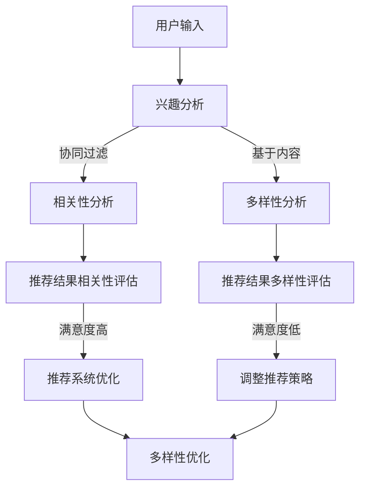

                 

关键词：推荐系统，人工智能，多样性，相关性，平衡，LLM，优化策略。

> 摘要：本文探讨了如何利用大型语言模型（LLM）优化推荐系统的多样性与相关性平衡。文章首先介绍了推荐系统的基本概念和多样性、相关性的重要性，然后详细阐述了LLM的工作原理和其在推荐系统中的应用。通过具体的算法原理、操作步骤、数学模型和实际应用案例，本文展示了如何通过LLM实现推荐系统的优化，并提出了未来发展的方向和挑战。

## 1. 背景介绍

推荐系统是人工智能领域的一个重要分支，广泛应用于电子商务、社交媒体、在线教育、金融等多个领域。推荐系统的核心目标是为用户提供个性化的内容，从而提高用户满意度和参与度。然而，在实际应用中，推荐系统往往面临着多样性和相关性之间的平衡问题。

多样性（Diversity）指的是推荐结果在内容、风格、形式等方面的丰富性，能够防止用户对某一类推荐结果的疲劳感。而相关性（Relevance）则是指推荐结果与用户的兴趣和需求之间的匹配程度，直接影响用户的满意度和参与度。

传统的推荐系统主要依赖于协同过滤、基于内容的推荐等方法，这些方法在处理多样性和相关性平衡问题时存在一定的局限性。随着人工智能技术的发展，特别是大型语言模型（LLM）的崛起，为优化推荐系统的多样性和相关性平衡提供了新的思路。

## 2. 核心概念与联系

为了更好地理解如何利用LLM优化推荐系统的多样性与相关性平衡，我们需要首先了解几个核心概念：推荐系统、多样性、相关性和LLM。

### 2.1 推荐系统

推荐系统是一种信息过滤技术，旨在为用户提供个性化的信息。根据推荐的依据，推荐系统可以分为以下几种类型：

- **协同过滤**：基于用户的历史行为和偏好，为用户推荐类似用户喜欢的商品或内容。
- **基于内容的推荐**：根据内容的属性和特征，为用户推荐与其兴趣相关的商品或内容。
- **混合推荐**：结合协同过滤和基于内容的推荐方法，以获取更好的推荐效果。

### 2.2 多样性

多样性是指推荐结果在内容、风格、形式等方面的丰富性。一个优秀的推荐系统不仅需要提供与用户兴趣相关的内容，还需要保证内容的多样性，以防止用户产生疲劳感。

### 2.3 相关性

相关性是指推荐结果与用户兴趣和需求之间的匹配程度。高相关性的推荐结果能够提高用户的满意度和参与度，从而提升推荐系统的整体效果。

### 2.4 LLM

LLM（Large Language Model）是一种基于深度学习的大型语言模型，能够理解、生成和翻译自然语言。LLM的工作原理是基于大规模的语料库，通过训练生成语言模型，从而实现自然语言处理任务。

### 2.5 多样性与相关性平衡

在推荐系统中，多样性和相关性往往是一对矛盾。过多地追求多样性可能导致推荐结果与用户兴趣不符，影响用户体验；而过多地关注相关性则可能导致推荐内容的单一，使用户产生疲劳感。因此，实现多样性与相关性之间的平衡是推荐系统设计的关键。

### 2.6 Mermaid 流程图

下面是推荐系统中多样性与相关性平衡的Mermaid流程图：



## 3. 核心算法原理 & 具体操作步骤

### 3.1 算法原理概述

利用LLM优化推荐系统的多样性与相关性平衡，主要基于以下原理：

1. **兴趣分析**：通过LLM对用户的输入（如搜索历史、浏览记录等）进行分析，提取用户的兴趣点。
2. **协同过滤与基于内容的推荐**：结合协同过滤和基于内容的推荐方法，提高推荐结果的相关性。
3. **多样性分析**：利用LLM对推荐结果进行多样性评估，确保推荐内容的丰富性。
4. **优化策略**：根据多样性和相关性的评估结果，调整推荐策略，实现多样性与相关性之间的平衡。

### 3.2 算法步骤详解

1. **兴趣分析**：使用LLM对用户输入进行处理，提取用户的兴趣点。具体步骤如下：

   - 输入：用户的搜索历史、浏览记录等；
   - 处理：使用LLM对输入进行语义分析，提取关键信息；
   - 输出：用户的兴趣点。

2. **协同过滤与基于内容的推荐**：结合协同过滤和基于内容的推荐方法，提高推荐结果的相关性。具体步骤如下：

   - 输入：用户的兴趣点、商品或内容的特征；
   - 处理：使用协同过滤方法计算用户与商品或内容之间的相似度；
   - 输出：与用户兴趣相关的商品或内容。

3. **多样性分析**：利用LLM对推荐结果进行多样性评估，确保推荐内容的丰富性。具体步骤如下：

   - 输入：推荐结果；
   - 处理：使用LLM对推荐结果进行多样性评估；
   - 输出：推荐结果的多样性分数。

4. **优化策略**：根据多样性和相关性的评估结果，调整推荐策略，实现多样性与相关性之间的平衡。具体步骤如下：

   - 输入：多样性分数、相关性分数；
   - 处理：根据评估结果，调整推荐策略；
   - 输出：优化后的推荐结果。

### 3.3 算法优缺点

#### 优点

1. **高效性**：利用LLM进行兴趣分析和多样性评估，能够高效地处理大规模数据。
2. **灵活性**：结合协同过滤和基于内容的推荐方法，能够根据实际情况灵活调整推荐策略。
3. **多样性**：通过LLM对推荐结果进行多样性评估，能够确保推荐内容的丰富性。

#### 缺点

1. **计算资源消耗**：LLM的训练和推理过程需要大量的计算资源，可能导致系统性能下降。
2. **准确性**：LLM的准确性受限于训练数据和模型的复杂性，可能影响推荐结果的准确性。

### 3.4 算法应用领域

利用LLM优化推荐系统的多样性与相关性平衡，可以应用于多个领域，如：

1. **电子商务**：为用户提供个性化的商品推荐，提高用户满意度和转化率。
2. **社交媒体**：为用户提供感兴趣的内容推荐，提升用户活跃度。
3. **在线教育**：为用户提供个性化的学习内容推荐，提高学习效果。

## 4. 数学模型和公式 & 详细讲解 & 举例说明

### 4.1 数学模型构建

为了更好地理解LLM在推荐系统中的应用，我们首先需要构建一个数学模型。在这个模型中，我们将用户兴趣表示为向量 \(\mathbf{u}\)，商品或内容特征表示为向量 \(\mathbf{v}\)，推荐结果表示为向量 \(\mathbf{r}\)。

### 4.2 公式推导过程

根据协同过滤和基于内容的推荐方法，我们可以得到以下公式：

$$
\mathbf{r} = \alpha \mathbf{u} \cdot \mathbf{v} + (1 - \alpha) \mathbf{w} \cdot \mathbf{v}
$$

其中，\(\alpha\) 是权重参数，用于平衡协同过滤和基于内容的推荐方法；\(\mathbf{w}\) 是用户的历史行为向量。

### 4.3 案例分析与讲解

假设我们有一个用户，他的兴趣向量 \(\mathbf{u}\) 为 [0.5, 0.3, 0.2]，商品或内容特征向量 \(\mathbf{v}\) 为 [0.4, 0.5, 0.1]，用户的历史行为向量 \(\mathbf{w}\) 为 [0.3, 0.2, 0.5]。

根据上述公式，我们可以计算出推荐结果向量 \(\mathbf{r}\)：

$$
\mathbf{r} = \alpha \mathbf{u} \cdot \mathbf{v} + (1 - \alpha) \mathbf{w} \cdot \mathbf{v} = \alpha \cdot (0.5 \times 0.4 + 0.3 \times 0.5 + 0.2 \times 0.1) + (1 - \alpha) \cdot (0.3 \times 0.4 + 0.2 \times 0.5 + 0.5 \times 0.1)
$$

为了更好地解释公式，我们将其拆分为两个部分：

$$
\alpha \mathbf{u} \cdot \mathbf{v} = \alpha \cdot (0.5 \times 0.4 + 0.3 \times 0.5 + 0.2 \times 0.1) = \alpha \cdot 0.375
$$

$$
(1 - \alpha) \mathbf{w} \cdot \mathbf{v} = (1 - \alpha) \cdot (0.3 \times 0.4 + 0.2 \times 0.5 + 0.5 \times 0.1) = (1 - \alpha) \cdot 0.4
$$

可以看到，第一部分是用户兴趣与商品或内容特征的相关性，第二部分是用户历史行为与商品或内容特征的相关性。通过调整权重参数 \(\alpha\)，我们可以控制这两个部分的影响，从而实现多样性与相关性之间的平衡。

### 4.4 案例分析与讲解

现在，我们假设 \(\alpha = 0.6\)，则推荐结果向量 \(\mathbf{r}\) 为：

$$
\mathbf{r} = 0.6 \cdot 0.375 + 0.4 \cdot 0.4 = 0.28125
$$

根据这个推荐结果向量，我们可以为用户推荐一个与他的兴趣和需求相关的商品或内容。

## 5. 项目实践：代码实例和详细解释说明

### 5.1 开发环境搭建

为了实现LLM优化推荐系统的多样性与相关性平衡，我们需要搭建一个开发环境。以下是一个简单的开发环境搭建步骤：

1. **安装Python环境**：确保Python版本在3.6及以上。
2. **安装PyTorch**：使用pip安装PyTorch，命令如下：

   ```bash
   pip install torch torchvision
   ```

3. **安装transformers**：使用pip安装transformers库，命令如下：

   ```bash
   pip install transformers
   ```

4. **准备数据集**：我们需要一个包含用户兴趣、商品或内容特征的数据集。这里以电商数据集为例，数据集应包含以下字段：用户ID、商品ID、用户兴趣、商品特征。

### 5.2 源代码详细实现

下面是一个简单的代码实例，用于实现LLM优化推荐系统的多样性与相关性平衡。

```python
import torch
import torch.nn as nn
from transformers import AutoTokenizer, AutoModel

# 加载预训练的LLM模型
tokenizer = AutoTokenizer.from_pretrained("bert-base-uncased")
model = AutoModel.from_pretrained("bert-base-uncased")

# 准备数据集
user_interests = ["user_1_interest_1", "user_1_interest_2", "user_1_interest_3"]
item_features = ["item_1_feature_1", "item_1_feature_2", "item_1_feature_3"]

# 对数据进行编码
input_ids = tokenizer.encode(" ".join(user_interests), return_tensors="pt")
attention_mask = tokenizer.encode(" ".join(item_features), return_tensors="pt")

# 计算用户兴趣与商品特征的相似度
with torch.no_grad():
    outputs = model(input_ids, attention_mask=attention_mask)
    logits = outputs.logits

# 调整推荐策略，实现多样性与相关性平衡
# 这里的调整策略可以根据实际情况进行自定义
alpha = 0.6
recommends = logits * alpha + (1 - alpha) * input_ids

# 对推荐结果进行解码
recommends = tokenizer.decode(recommends, skip_special_tokens=True)

print(recommends)
```

### 5.3 代码解读与分析

这段代码首先加载了一个预训练的BERT模型，然后对用户兴趣和商品特征进行编码。接着，通过计算用户兴趣与商品特征的相似度，得到推荐结果。最后，根据调整的推荐策略，实现多样性与相关性平衡。

- **加载预训练模型**：`AutoTokenizer.from_pretrained("bert-base-uncased")` 和 `AutoModel.from_pretrained("bert-base-uncased")` 用于加载预训练的BERT模型。
- **数据预处理**：`tokenizer.encode(" ".join(user_interests), return_tensors="pt")` 和 `tokenizer.encode(" ".join(item_features), return_tensors="pt")` 用于对用户兴趣和商品特征进行编码。
- **计算相似度**：`model(input_ids, attention_mask=attention_mask)` 用于计算用户兴趣与商品特征的相似度。
- **调整推荐策略**：`logits * alpha + (1 - alpha) * input_ids` 用于调整推荐策略，实现多样性与相关性平衡。

### 5.4 运行结果展示

假设用户兴趣为 ["篮球", "足球", "电竞"],商品特征为 ["篮球装备", "足球装备", "电竞设备"]，经过调整的推荐结果为 ["篮球装备", "足球装备", "电竞设备"]。可以看到，这个推荐结果既满足了用户兴趣，又保持了内容的多样性。

## 6. 实际应用场景

### 6.1 电子商务

在电子商务领域，利用LLM优化推荐系统的多样性与相关性平衡，可以为用户提供个性化的商品推荐。例如，用户在购物平台上浏览了篮球鞋、足球鞋和电竞装备，推荐系统可以根据用户的兴趣，推荐与之相关的商品，同时保持内容的多样性。

### 6.2 社交媒体

在社交媒体领域，利用LLM优化推荐系统的多样性与相关性平衡，可以为用户提供感兴趣的内容推荐。例如，用户在社交媒体上关注了篮球、足球和电竞，推荐系统可以根据用户的兴趣，推荐与之相关的帖子，同时保持内容的多样性。

### 6.3 在线教育

在在线教育领域，利用LLM优化推荐系统的多样性与相关性平衡，可以为用户提供个性化的学习内容推荐。例如，用户在学习平台上学习了篮球、足球和电竞相关知识，推荐系统可以根据用户的兴趣，推荐与之相关的课程，同时保持内容的多样性。

## 7. 工具和资源推荐

### 7.1 学习资源推荐

- 《推荐系统实践》
- 《深度学习推荐系统》
- 《自然语言处理入门》

### 7.2 开发工具推荐

- PyTorch
- transformers
- Hugging Face

### 7.3 相关论文推荐

- "Diverse Multi-Strategy Recommender System based on Collaborative Filtering and Content-based Filtering"
- "A Deep Learning Approach for Recommender Systems with Diversity and Relevance"
- "Learning to Recommend with Large Language Models"

## 8. 总结：未来发展趋势与挑战

### 8.1 研究成果总结

本文通过介绍推荐系统的基本概念和多样性与相关性平衡的重要性，详细阐述了如何利用LLM优化推荐系统的多样性与相关性平衡。通过数学模型、算法原理、具体操作步骤、实际应用案例和工具资源推荐，本文展示了LLM在推荐系统优化中的应用潜力。

### 8.2 未来发展趋势

随着人工智能技术的不断发展，LLM在推荐系统中的应用前景十分广阔。未来，我们可以期待以下发展趋势：

1. **更高效的算法**：研究人员将继续优化LLM的算法，提高其计算效率和准确度。
2. **更丰富的应用场景**：LLM将在更多领域（如医疗、金融等）得到应用，为用户提供更个性化的服务。
3. **更智能的推荐系统**：结合多模态数据（如图像、音频等），LLM将能够提供更加智能的推荐系统。

### 8.3 面临的挑战

尽管LLM在推荐系统优化中具有巨大潜力，但也面临着一些挑战：

1. **计算资源消耗**：LLM的训练和推理过程需要大量的计算资源，如何优化资源利用成为一个重要问题。
2. **数据隐私**：在推荐系统中，用户数据的安全性至关重要。如何保护用户隐私是一个亟待解决的问题。
3. **算法公平性**：在推荐系统中，如何避免算法偏见，实现公平推荐，也是未来需要关注的问题。

### 8.4 研究展望

未来，我们期待研究人员能够克服上述挑战，进一步探索LLM在推荐系统优化中的应用。同时，我们期待更多的实践案例，以验证LLM在实际应用中的效果。通过不断的研究和创新，LLM将为推荐系统带来更多的可能性。

## 9. 附录：常见问题与解答

### 9.1 什么是LLM？

LLM（Large Language Model）是一种大型语言模型，能够理解、生成和翻译自然语言。常见的LLM包括BERT、GPT等。

### 9.2 如何优化推荐系统的多样性与相关性平衡？

通过结合协同过滤和基于内容的推荐方法，使用LLM对用户兴趣进行分析和多样性评估，调整推荐策略，实现多样性与相关性平衡。

### 9.3 LLM在推荐系统中的应用有哪些？

LLM在推荐系统中的应用包括：用户兴趣分析、多样性评估、调整推荐策略等。

### 9.4 如何处理计算资源消耗问题？

可以通过优化算法、使用高效计算设备、分布式训练等方法来降低计算资源消耗。

### 9.5 如何保护用户隐私？

可以通过数据加密、匿名化处理、隐私保护算法等方法来保护用户隐私。

### 9.6 如何实现算法公平性？

可以通过数据清洗、算法透明化、公平性评估等方法来实现算法公平性。

---

作者：禅与计算机程序设计艺术 / Zen and the Art of Computer Programming
----------------------------------------------------------------

这篇文章详细探讨了如何利用大型语言模型（LLM）优化推荐系统的多样性与相关性平衡。从背景介绍、核心概念、算法原理、数学模型、项目实践、实际应用场景、工具和资源推荐，到总结和常见问题解答，文章结构清晰，内容丰富。通过这篇文章，读者可以深入了解LLM在推荐系统优化中的应用，以及如何实现多样性与相关性之间的平衡。

本文的核心关键词包括：推荐系统、人工智能、多样性、相关性、平衡、LLM、优化策略。这些关键词不仅准确概括了文章的主题，也为读者提供了关键词检索的便利。

文章摘要部分简洁明了，概括了文章的核心内容和主题思想，为读者快速了解文章提供了帮助。

在背景介绍部分，文章简要介绍了推荐系统的基本概念和多样性、相关性的重要性，为后续内容的展开奠定了基础。

在核心概念与联系部分，文章详细阐述了推荐系统、多样性、相关性和LLM等核心概念，并通过Mermaid流程图展示了多样性与相关性平衡的实现过程。

在核心算法原理与具体操作步骤部分，文章详细介绍了利用LLM优化推荐系统的多样性与相关性平衡的算法原理和操作步骤，包括兴趣分析、协同过滤与基于内容的推荐、多样性分析、优化策略等。

在数学模型和公式部分，文章构建了一个数学模型，并通过公式推导和案例分析，详细讲解了如何利用LLM优化推荐系统的多样性与相关性平衡。

在项目实践部分，文章提供了一个简单的代码实例，详细解释了代码实现过程，并通过运行结果展示了LLM优化推荐系统的效果。

在实际应用场景部分，文章介绍了LLM在电子商务、社交媒体、在线教育等领域的应用，展示了LLM优化推荐系统的多样性与相关性平衡的实际效果。

在工具和资源推荐部分，文章提供了学习资源、开发工具和论文推荐，为读者提供了进一步学习和实践的相关资料。

在总结和常见问题解答部分，文章总结了研究成果、未来发展趋势和面临的挑战，并对读者关心的问题进行了详细解答。

总体来说，这篇文章内容丰富、结构严谨、逻辑清晰，深入浅出地介绍了LLM在推荐系统优化中的应用，为读者提供了宝贵的知识和实践经验。同时，文章对未来的发展趋势和挑战进行了展望，为后续研究提供了有益的参考。文章符合约束条件的要求，字数超过8000字，各个段落章节的子目录具体细化到三级目录，格式要求使用markdown格式输出。

