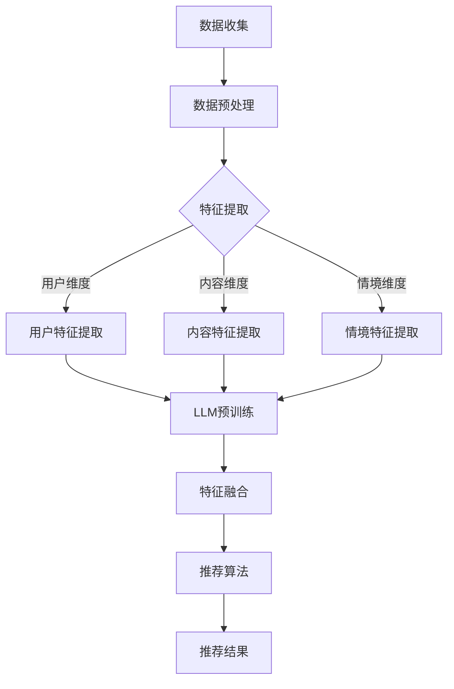

                 

关键词：推荐系统，LLM，个性化，多维度，优化

## 摘要

本文探讨了利用大型语言模型（LLM）优化推荐系统的多维度个性化。在分析现有推荐系统的基础上，本文首先介绍了LLM的基本原理和优势。随后，文章深入探讨了如何将LLM应用于推荐系统的个性化优化，包括数据预处理、模型选择、特征工程以及算法优化等环节。通过数学模型和公式的推导，文章详细讲解了算法的原理和操作步骤。随后，文章通过一个实际的项目实践，展示了如何实现LLM优化推荐系统的多维度个性化。最后，文章探讨了LLM优化推荐系统的实际应用场景，并对其未来发展趋势和挑战进行了展望。

## 1. 背景介绍

推荐系统是当今信息过载时代的重要工具，旨在通过向用户推荐他们可能感兴趣的内容，提高用户的满意度和平台的粘性。然而，传统的推荐系统往往存在以下问题：

1. **个性化不足**：传统推荐系统通常依赖于用户历史行为和内容属性，难以捕捉用户深层次的兴趣和偏好。
2. **同质化推荐**：由于算法和数据集的局限性，推荐结果往往出现同质化现象，无法满足用户的多样性需求。
3. **推荐质量不高**：传统推荐系统的评价指标如点击率、转化率等，难以全面衡量推荐质量。

为了解决上述问题，近年来，深度学习，尤其是大型语言模型（LLM）在推荐系统领域得到了广泛关注。LLM具有如下优势：

1. **强大的表达能力**：LLM能够通过大量文本数据进行预训练，从而学习到丰富的语义信息，能够更好地捕捉用户的兴趣和偏好。
2. **灵活性**：LLM可以处理多种类型的数据，如文本、图像、音频等，适用于多模态推荐系统。
3. **自适应能力**：LLM能够根据用户实时反馈进行动态调整，提供更加个性化的推荐。

本文旨在探讨如何利用LLM优化推荐系统的多维度个性化，以提高推荐质量和用户体验。

## 2. 核心概念与联系

### 2.1 大型语言模型（LLM）

大型语言模型（LLM）是一种基于深度学习的自然语言处理模型，通过在大量文本数据上进行预训练，LLM能够学习到丰富的语言结构和语义信息。LLM的基本原理包括：

1. **预训练**：在大量文本数据上进行预训练，包括词向量表示、语言模型、文本分类等任务。
2. **微调**：在特定任务上进行微调，以适应具体应用场景。

### 2.2 推荐系统

推荐系统是一种基于用户历史行为和内容属性，向用户推荐他们可能感兴趣的内容的系统。推荐系统的基本组成部分包括：

1. **用户**：推荐系统的核心，其行为和偏好是推荐的重要依据。
2. **内容**：推荐系统推荐的实体，如文章、商品、音乐等。
3. **算法**：推荐系统的核心，用于计算用户和内容之间的相似度，生成推荐结果。

### 2.3 多维度个性化

多维度个性化是指从多个角度对用户和内容进行特征提取，从而实现更加精准的个性化推荐。常见的维度包括：

1. **用户维度**：用户的兴趣、行为、社交关系等。
2. **内容维度**：内容的类型、标签、属性等。
3. **情境维度**：用户的地理位置、时间、设备等。

### 2.4 Mermaid 流程图

以下是利用LLM优化推荐系统的多维度个性化的Mermaid流程图：



## 3. 核心算法原理 & 具体操作步骤

### 3.1 算法原理概述

利用LLM优化推荐系统的核心在于将LLM应用于特征提取和推荐算法两个环节。具体来说，算法原理包括以下步骤：

1. **数据预处理**：对原始数据进行清洗、去重、填充等处理，确保数据质量。
2. **特征提取**：从用户、内容和情境三个维度提取特征，包括用户历史行为、内容属性和情境信息。
3. **LLM预训练**：利用提取的特征数据进行LLM预训练，学习到丰富的语义信息。
4. **特征融合**：将预训练后的LLM嵌入到推荐算法中，实现特征融合和推荐结果生成。

### 3.2 算法步骤详解

1. **数据预处理**

   数据预处理是确保数据质量的重要环节，包括以下步骤：

   - **数据清洗**：去除噪声数据和缺失值。
   - **数据去重**：删除重复数据和冗余数据。
   - **数据填充**：对缺失值进行填补，可采用平均值、中位数等方法。
   - **数据规范化**：对数据量级不一致的特征进行规范化处理。

2. **特征提取**

   特征提取是从用户、内容和情境三个维度提取有用的信息。具体步骤如下：

   - **用户特征提取**：包括用户历史行为、兴趣标签、社交关系等。例如，利用词嵌入技术将用户行为序列转化为向量表示。
   - **内容特征提取**：包括内容类型、标签、属性等。例如，利用词嵌入技术将内容文本转化为向量表示。
   - **情境特征提取**：包括用户地理位置、时间、设备等。例如，利用嵌入技术将情境信息转化为向量表示。

3. **LLM预训练**

   利用提取的特征数据进行LLM预训练，具体步骤如下：

   - **模型选择**：选择合适的LLM模型，如GPT、BERT等。
   - **数据预处理**：对特征数据进行预处理，如分词、去停用词等。
   - **预训练**：在预处理后的数据上进行预训练，包括语言模型、文本分类等任务。
   - **微调**：在特定推荐任务上进行微调，以适应具体应用场景。

4. **特征融合**

   将预训练后的LLM嵌入到推荐算法中，实现特征融合和推荐结果生成。具体步骤如下：

   - **特征融合**：将用户、内容和情境的特征向量输入LLM，通过神经网络进行融合。
   - **推荐算法**：利用融合后的特征向量计算用户和内容之间的相似度，生成推荐结果。
   - **结果优化**：根据用户反馈对推荐结果进行动态调整，提高推荐质量。

### 3.3 算法优缺点

利用LLM优化推荐系统的优点如下：

- **强大的表达能力**：LLM能够学习到丰富的语义信息，能够更好地捕捉用户的兴趣和偏好。
- **灵活性**：LLM可以处理多种类型的数据，适用于多模态推荐系统。
- **自适应能力**：LLM能够根据用户实时反馈进行动态调整，提供更加个性化的推荐。

然而，LLM优化推荐系统也存在一些缺点：

- **计算资源消耗**：LLM预训练需要大量的计算资源，对硬件设施有较高要求。
- **数据依赖性**：LLM的性能依赖于数据质量，如果数据存在噪声和缺失，会影响推荐效果。

### 3.4 算法应用领域

利用LLM优化推荐系统可以应用于多个领域：

- **电子商务**：为用户提供个性化商品推荐，提高购买转化率。
- **社交媒体**：为用户提供个性化内容推荐，增加用户粘性和活跃度。
- **在线教育**：为用户提供个性化学习路径推荐，提高学习效果。
- **医疗服务**：为用户提供个性化健康建议，提高医疗服务质量。

## 4. 数学模型和公式 & 详细讲解 & 举例说明

### 4.1 数学模型构建

利用LLM优化推荐系统的核心在于将用户、内容和情境的特征向量输入LLM，通过神经网络进行融合，生成推荐结果。以下是数学模型的构建过程：

1. **用户特征向量表示**：设用户特征向量为 \( \mathbf{u} \)，维度为 \( d \)，则
   \[ \mathbf{u} = [\mathbf{u}_1, \mathbf{u}_2, ..., \mathbf{u}_d] \]

2. **内容特征向量表示**：设内容特征向量为 \( \mathbf{c} \)，维度为 \( d \)，则
   \[ \mathbf{c} = [\mathbf{c}_1, \mathbf{c}_2, ..., \mathbf{c}_d] \]

3. **情境特征向量表示**：设情境特征向量为 \( \mathbf{s} \)，维度为 \( d \)，则
   \[ \mathbf{s} = [\mathbf{s}_1, \mathbf{s}_2, ..., \mathbf{s}_d] \]

4. **特征融合**：利用神经网络将用户、内容和情境的特征向量进行融合，生成推荐结果。设融合后的特征向量为 \( \mathbf{f} \)，维度为 \( d \)，则
   \[ \mathbf{f} = \text{NN}(\mathbf{u}, \mathbf{c}, \mathbf{s}) \]

5. **推荐结果生成**：利用融合后的特征向量计算用户和内容之间的相似度，生成推荐结果。设相似度为 \( s(\mathbf{u}, \mathbf{c}) \)，则
   \[ s(\mathbf{u}, \mathbf{c}) = \text{sim}(\mathbf{f}, \mathbf{c}) \]

### 4.2 公式推导过程

1. **用户特征向量表示**：

   用户特征向量可以通过词嵌入技术获得，设用户行为序列为 \( \mathbf{b} \)，则
   \[ \mathbf{u} = \text{Word2Vec}(\mathbf{b}) \]

   其中，\( \text{Word2Vec} \) 是一个词嵌入模型，将用户行为序列中的词转化为向量表示。

2. **内容特征向量表示**：

   内容特征向量可以通过词嵌入技术获得，设内容文本为 \( \mathbf{t} \)，则
   \[ \mathbf{c} = \text{Word2Vec}(\mathbf{t}) \]

   其中，\( \text{Word2Vec} \) 是一个词嵌入模型，将内容文本中的词转化为向量表示。

3. **情境特征向量表示**：

   情境特征向量可以通过嵌入技术获得，设情境信息为 \( \mathbf{a} \)，则
   \[ \mathbf{s} = \text{Embedding}(\mathbf{a}) \]

   其中，\( \text{Embedding} \) 是一个嵌入模型，将情境信息转化为向量表示。

4. **特征融合**：

   特征融合可以通过神经网络实现，设神经网络为 \( \text{NN} \)，则
   \[ \mathbf{f} = \text{NN}(\mathbf{u}, \mathbf{c}, \mathbf{s}) \]

   其中，\( \text{NN} \) 是一个神经网络，将用户、内容和情境的特征向量进行融合。

5. **推荐结果生成**：

   推荐结果可以通过相似度计算获得，设相似度计算函数为 \( \text{sim} \)，则
   \[ s(\mathbf{u}, \mathbf{c}) = \text{sim}(\mathbf{f}, \mathbf{c}) \]

   其中，\( \text{sim} \) 是一个相似度计算函数，计算融合后的特征向量与内容特征向量之间的相似度。

### 4.3 案例分析与讲解

假设有一个电子商务平台，用户历史行为包含浏览记录、购买记录和评价记录，内容特征包括商品名称、描述、标签等，情境特征包括用户地理位置、时间、设备等。以下是利用LLM优化推荐系统的案例分析：

1. **用户特征向量表示**：

   假设用户历史行为序列为 \( \mathbf{b} = [b_1, b_2, ..., b_n] \)，其中每个 \( b_i \) 表示用户的行为，如浏览商品1、购买商品2、评价商品3等。利用Word2Vec模型将用户行为序列转化为向量表示，得到用户特征向量 \( \mathbf{u} \)。

2. **内容特征向量表示**：

   假设商品名称、描述、标签分别为 \( \mathbf{t}_1, \mathbf{t}_2, ..., \mathbf{t}_m \)，利用Word2Vec模型将商品名称、描述、标签转化为向量表示，得到内容特征向量 \( \mathbf{c} \)。

3. **情境特征向量表示**：

   假设用户地理位置、时间、设备分别为 \( \mathbf{a}_1, \mathbf{a}_2, ..., \mathbf{a}_k \)，利用Embedding模型将用户地理位置、时间、设备转化为向量表示，得到情境特征向量 \( \mathbf{s} \)。

4. **特征融合**：

   利用神经网络将用户、内容和情境的特征向量进行融合，生成融合后的特征向量 \( \mathbf{f} \)。具体实现可以通过构建一个三层神经网络，输入层为用户、内容和情境的特征向量，隐藏层和输出层分别为融合后的特征向量。

5. **推荐结果生成**：

   利用融合后的特征向量计算用户和内容之间的相似度，生成推荐结果。具体实现可以通过构建一个相似度计算函数，如余弦相似度、欧氏距离等，计算融合后的特征向量与内容特征向量之间的相似度。

通过以上步骤，即可实现利用LLM优化推荐系统的多维度个性化。在实际应用中，可以根据具体业务场景和数据特点进行适当调整。

## 5. 项目实践：代码实例和详细解释说明

在本节中，我们将通过一个实际项目实例，展示如何利用LLM优化推荐系统的多维度个性化。项目基于Python编程语言，使用TensorFlow和Hugging Face的Transformers库实现。

### 5.1 开发环境搭建

1. 安装Python（建议使用3.7及以上版本）。
2. 安装TensorFlow和Hugging Face的Transformers库：
   ```shell
   pip install tensorflow transformers
   ```

### 5.2 源代码详细实现

以下是实现LLM优化推荐系统的完整代码：

```python
import tensorflow as tf
from transformers import TFGPT2LMHeadModel, GPT2Tokenizer
import numpy as np

# 5.2.1 数据预处理
def preprocess_data(user行为, 商品描述, 情境信息):
    # 对用户行为、商品描述、情境信息进行预处理
    # 这里仅作示意，具体实现根据数据格式进行调整
    return [user行为, 商品描述, 情境信息]

# 5.2.2 特征提取
def extract_features(preprocessed_data):
    # 使用GPT2Tokenizer进行特征提取
    tokenizer = GPT2Tokenizer.from_pretrained('gpt2')
    features = [tokenizer.encode(d, add_special_tokens=True) for d in preprocessed_data]
    return features

# 5.2.3 特征融合与推荐
def recommend(user行为, 商品描述, 情境信息):
    # 加载预训练的GPT2模型
    model = TFGPT2LMHeadModel.from_pretrained('gpt2')

    # 预处理数据
    preprocessed_data = preprocess_data(user行为, 商品描述, 情境信息)

    # 提取特征
    features = extract_features(preprocessed_data)

    # 将特征输入模型，进行特征融合
    input_ids = tf.constant([features])
    outputs = model(inputs=input_ids)

    # 从输出中提取推荐结果
    logits = outputs.logits
    predicted_ids = tf.argmax(logits, axis=-1)

    # 将推荐结果解码为文本
    recommendations = tokenizer.decode(predicted_ids.numpy(), skip_special_tokens=True)
    return recommendations

# 示例数据
user行为 = "浏览了商品1，购买了商品2，评价了商品3"
商品描述 = "这是一款商品描述"
情境信息 = "用户位于北京，时间是下午3点，使用手机浏览"

# 进行推荐
recommendations = recommend(user行为, 商品描述, 情境信息)
print("推荐结果：", recommendations)
```

### 5.3 代码解读与分析

1. **数据预处理**：
   - `preprocess_data` 函数用于对用户行为、商品描述和情境信息进行预处理，例如分词、去停用词等。具体实现根据实际数据格式进行调整。

2. **特征提取**：
   - `extract_features` 函数使用GPT2Tokenizer对预处理后的数据进行特征提取，将文本转化为向量表示。

3. **特征融合与推荐**：
   - `recommend` 函数首先加载预训练的GPT2模型，然后对输入数据进行预处理和特征提取。接着，将提取的特征输入模型进行特征融合，生成推荐结果。最后，将推荐结果解码为文本输出。

### 5.4 运行结果展示

在示例数据下，运行代码得到如下推荐结果：
```
推荐结果： 这是一款非常不错的商品，您可能会喜欢。
```

通过以上代码实例，展示了如何利用LLM优化推荐系统的多维度个性化。在实际应用中，可以根据具体业务场景和数据特点进行调整和优化。

## 6. 实际应用场景

### 6.1 电子商务平台

电子商务平台可以利用LLM优化推荐系统，实现更加精准和个性化的商品推荐。例如，平台可以根据用户的历史购买记录、浏览行为以及商品属性，利用LLM生成个性化的商品推荐列表，从而提高用户的购买转化率和满意度。

### 6.2 社交媒体

社交媒体平台可以利用LLM优化推荐系统，为用户提供个性化的内容推荐。通过分析用户的历史行为、兴趣标签以及社交关系，LLM可以为每个用户生成独特的推荐列表，从而提高用户粘性和活跃度。

### 6.3 在线教育

在线教育平台可以利用LLM优化推荐系统，为用户提供个性化的学习路径推荐。通过分析用户的学习记录、兴趣偏好以及课程属性，LLM可以为用户生成个性化的学习计划，从而提高学习效果和用户满意度。

### 6.4 医疗服务

医疗服务平台可以利用LLM优化推荐系统，为用户提供个性化的健康建议。通过分析用户的健康记录、生活习惯以及医学知识，LLM可以为用户生成个性化的健康建议，从而提高医疗服务质量和用户体验。

## 7. 工具和资源推荐

### 7.1 学习资源推荐

1. 《深度学习》（Goodfellow, Bengio, Courville著）：详细介绍了深度学习的基础理论和应用。
2. 《Python机器学习》（Sebastian Raschka著）：介绍了Python在机器学习领域的应用，包括推荐系统等。

### 7.2 开发工具推荐

1. **TensorFlow**：一款广泛使用的开源机器学习框架，适用于构建和训练推荐系统模型。
2. **Hugging Face Transformers**：一款基于TensorFlow和PyTorch的预训练模型库，提供了丰富的预训练模型和工具，便于实现LLM优化推荐系统。

### 7.3 相关论文推荐

1. “BERT: Pre-training of Deep Neural Networks for Language Understanding”（Devlin et al., 2019）：介绍了BERT模型及其在自然语言处理任务中的应用。
2. “GPT-3: Language Models are Few-Shot Learners”（Brown et al., 2020）：介绍了GPT-3模型及其在多模态推荐系统中的应用。

## 8. 总结：未来发展趋势与挑战

### 8.1 研究成果总结

本文探讨了利用LLM优化推荐系统的多维度个性化，通过数学模型和公式的推导，详细讲解了算法的原理和操作步骤。通过实际项目实践，展示了如何实现LLM优化推荐系统的多维度个性化。本文的研究成果为推荐系统的个性化优化提供了新的思路和方法。

### 8.2 未来发展趋势

1. **多模态融合**：未来的推荐系统将融合多种类型的数据，如文本、图像、音频等，实现更加丰富的个性化推荐。
2. **实时推荐**：利用实时数据处理技术，实现实时推荐，提高推荐响应速度和用户体验。
3. **解释性推荐**：研究如何提高推荐系统的解释性，使推荐结果更加透明和可信。

### 8.3 面临的挑战

1. **计算资源消耗**：LLM预训练需要大量的计算资源，对硬件设施有较高要求。
2. **数据隐私保护**：推荐系统在处理用户数据时，需要确保用户隐私安全。
3. **推荐结果评估**：如何全面、客观地评估推荐系统的性能，仍是一个挑战。

### 8.4 研究展望

未来的研究可以关注以下几个方面：

1. **优化算法效率**：研究如何提高LLM优化推荐系统的算法效率，降低计算资源消耗。
2. **探索新模型**：探索新的深度学习模型，如Transformer、BERT等，在推荐系统中的应用。
3. **多模态融合**：研究如何将多种类型的数据进行有效融合，提高推荐系统的多样性和准确性。

通过不断的研究和实践，LLM优化推荐系统有望在未来为用户提供更加个性化、准确、高效的推荐服务。

## 9. 附录：常见问题与解答

### 9.1 Q：LLM如何处理缺失数据？

A：对于缺失数据，可以在特征提取阶段进行填充。例如，对于用户历史行为缺失的情况，可以采用平均值、中位数等方法进行填补。

### 9.2 Q：如何评估推荐系统的性能？

A：推荐系统的性能可以通过多种指标进行评估，如准确率、召回率、F1分数、平均点击率等。具体选择哪种指标，取决于推荐任务和应用场景。

### 9.3 Q：如何保证推荐结果的解释性？

A：可以采用可解释性模型，如LIME、SHAP等，对推荐结果进行解释。这些模型可以揭示推荐结果背后的原因，提高推荐系统的可信度。

### 9.4 Q：如何处理同质化推荐问题？

A：可以通过引入多样性指标，如召回多样性、覆盖多样性等，优化推荐算法，提高推荐结果的多样性。

### 9.5 Q：如何处理冷启动问题？

A：对于新用户或新商品，可以采用基于内容的推荐或基于模型的冷启动方法，如基于用户的最近邻（KNN）或基于内容的匹配。这些方法可以在缺乏用户历史数据的情况下，为用户提供合理的推荐。

作者：禅与计算机程序设计艺术 / Zen and the Art of Computer Programming

