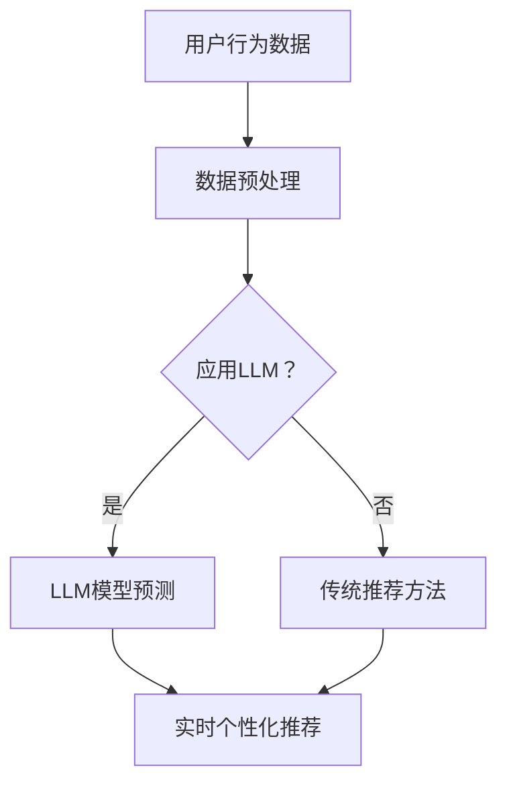

                 

关键词：大型语言模型（LLM），推荐系统，实时个性化，优化，算法原理，数学模型，项目实践，应用场景，未来展望

> 摘要：本文将探讨如何利用大型语言模型（LLM）优化推荐系统的实时个性化定制。我们将详细解释LLM的工作原理，介绍如何在推荐系统中应用LLM，并讨论如何通过数学模型和具体项目实践来实现实时个性化推荐。

## 1. 背景介绍

在当今信息爆炸的时代，用户面临着海量的信息选择。推荐系统作为一种智能信息过滤工具，旨在帮助用户发现他们可能感兴趣的内容。传统的推荐系统主要基于协同过滤、基于内容的过滤和混合推荐方法。然而，这些方法在处理用户个性化需求方面存在一些局限性。例如，协同过滤方法可能导致冷启动问题，而基于内容的过滤方法可能无法充分理解用户的复杂需求。

为了解决这些问题，近年来，大型语言模型（LLM）在自然语言处理领域取得了显著的进展。LLM具有强大的语言理解和生成能力，可以更好地捕捉用户的意图和偏好。本文将探讨如何利用LLM优化推荐系统，实现实时个性化定制。

## 2. 核心概念与联系

在介绍如何利用LLM优化推荐系统之前，我们首先需要理解几个核心概念。

### 2.1 推荐系统

推荐系统是一种基于数据挖掘和机器学习技术，旨在为用户提供个性化内容推荐的技术。推荐系统可以分为以下几类：

- **基于内容的过滤（Content-Based Filtering）**：根据用户的历史行为和兴趣，推荐与用户兴趣相似的内容。
- **协同过滤（Collaborative Filtering）**：通过收集用户之间的共同行为，预测用户可能感兴趣的内容。
- **混合推荐（Hybrid Recommendation）**：结合基于内容和协同过滤的方法，提高推荐系统的准确性。

### 2.2 大型语言模型（LLM）

大型语言模型是一种基于深度学习的自然语言处理模型，具有强大的语言理解和生成能力。LLM通常使用神经网络架构，如Transformer，通过大量文本数据进行训练。LLM可以用于文本分类、情感分析、机器翻译、问答系统等多种任务。

### 2.3 实时个性化定制

实时个性化定制是指根据用户的实时行为和偏好，动态调整推荐内容，以满足用户的个性化需求。实时个性化定制可以显著提高推荐系统的用户体验和满意度。

### 2.4 Mermaid 流程图

下面是一个简单的Mermaid流程图，展示了推荐系统与LLM之间的关联。



## 3. 核心算法原理 & 具体操作步骤

### 3.1 算法原理概述

利用LLM优化推荐系统的核心思想是：通过LLM对用户行为数据进行深入分析，捕捉用户的意图和偏好，从而实现实时个性化推荐。

具体操作步骤如下：

1. 数据预处理：对用户行为数据进行清洗和格式化，以便于LLM模型处理。
2. 应用LLM：使用预训练的LLM模型对用户行为数据进行分析，提取用户意图和偏好。
3. 实时个性化推荐：根据LLM模型提取的用户意图和偏好，动态调整推荐内容，实现实时个性化推荐。

### 3.2 算法步骤详解

#### 3.2.1 数据预处理

数据预处理是利用LLM优化推荐系统的第一步。其主要任务包括：

- 数据清洗：去除噪声数据和异常值。
- 数据格式化：将用户行为数据转换为适合LLM处理的格式，如文本序列。

#### 3.2.2 应用LLM

应用LLM是利用LLM优化推荐系统的核心步骤。其主要任务包括：

- 模型选择：选择适合的LLM模型，如BERT、GPT等。
- 模型训练：使用预训练的LLM模型，对用户行为数据进行训练，以提取用户意图和偏好。
- 模型评估：评估LLM模型的性能，如准确率、召回率等。

#### 3.2.3 实时个性化推荐

实时个性化推荐是利用LLM优化推荐系统的最后一步。其主要任务包括：

- 用户意图识别：使用LLM模型提取的用户意图，识别用户的兴趣点。
- 推荐内容生成：根据用户意图和偏好，生成个性化推荐内容。
- 推荐内容调整：根据用户的实时反馈，动态调整推荐内容，实现实时个性化推荐。

### 3.3 算法优缺点

#### 3.3.1 优点

- **强大的语言理解能力**：LLM具有强大的语言理解能力，可以更好地捕捉用户的意图和偏好。
- **实时个性化推荐**：通过实时分析用户行为数据，实现实时个性化推荐，提高用户体验和满意度。
- **跨平台兼容性**：LLM模型可以在多种平台上应用，如移动端、桌面端等。

#### 3.3.2 缺点

- **计算资源消耗大**：LLM模型训练和推理过程需要大量的计算资源。
- **数据隐私问题**：利用LLM优化推荐系统需要处理大量用户数据，可能导致数据隐私问题。

### 3.4 算法应用领域

利用LLM优化推荐系统可以广泛应用于多个领域，如电子商务、社交媒体、新闻推荐等。具体应用场景包括：

- **电子商务**：为用户提供个性化的商品推荐，提高购买转化率。
- **社交媒体**：为用户提供个性化的内容推荐，提高用户粘性和活跃度。
- **新闻推荐**：为用户提供个性化的新闻推荐，提高新闻阅读量。

## 4. 数学模型和公式 & 详细讲解 & 举例说明

### 4.1 数学模型构建

为了更好地理解利用LLM优化推荐系统的原理，我们可以构建一个简单的数学模型。

假设我们有用户行为数据集\(D\)，其中每个用户的行为数据表示为一个向量\(x_i\)。LLM模型将用户行为数据转换为用户偏好向量\(y_i\)，最终生成个性化推荐内容\(r_i\)。

数学模型可以表示为：

$$
y_i = f(x_i; \theta)
$$

其中，\(f\)是LLM模型，\(\theta\)是模型参数。

个性化推荐内容生成可以表示为：

$$
r_i = g(y_i; \phi)
$$

其中，\(g\)是推荐内容生成模型，\(\phi\)是模型参数。

### 4.2 公式推导过程

为了推导上述公式，我们可以先从LLM模型的训练过程开始。

假设我们有训练数据集\(D'\)，其中每个样本表示为\(x'\)和\(y'\)。

LLM模型的目标是最小化损失函数：

$$
L(\theta) = \frac{1}{N} \sum_{i=1}^{N} L(x_i, y_i; \theta)
$$

其中，\(L\)是损失函数，\(N\)是样本数量。

对于每个样本，我们可以定义损失函数为：

$$
L(x_i, y_i; \theta) = -\log P(y_i|x_i; \theta)
$$

其中，\(P(y_i|x_i; \theta)\)是LLM模型对用户偏好向量\(y_i\)的概率估计。

通过梯度下降法，我们可以更新模型参数\(\theta\)：

$$
\theta_{t+1} = \theta_t - \alpha \nabla_{\theta_t} L(\theta_t)
$$

其中，\(\alpha\)是学习率。

当模型训练完成后，我们可以使用LLM模型对用户行为数据进行预测，得到用户偏好向量\(y_i\)。

接下来，我们可以使用推荐内容生成模型\(g\)，根据用户偏好向量\(y_i\)生成个性化推荐内容\(r_i\)。

### 4.3 案例分析与讲解

为了更好地理解上述数学模型，我们可以通过一个简单的案例进行讲解。

假设我们有以下用户行为数据：

| 用户ID | 行为1 | 行为2 | 行为3 |
|--------|------|------|------|
| 1      | 1    | 0    | 1    |
| 2      | 0    | 1    | 1    |
| 3      | 1    | 1    | 0    |

我们使用LLM模型对用户行为数据进行预测，得到以下用户偏好向量：

| 用户ID | 偏好1 | 偏好2 | 偏好3 |
|--------|------|------|------|
| 1      | 0.8  | 0.2  | 0.8  |
| 2      | 0.2  | 0.8  | 0.8  |
| 3      | 0.8  | 0.8  | 0.2  |

接下来，我们使用推荐内容生成模型，根据用户偏好向量生成个性化推荐内容。假设我们有以下推荐内容：

| 推荐内容 | 类型1 | 类型2 | 类型3 |
|----------|------|------|------|
| A        | 1    | 0    | 0    |
| B        | 0    | 1    | 0    |
| C        | 0    | 0    | 1    |

根据用户偏好向量，我们可以生成以下个性化推荐内容：

| 用户ID | 推荐内容 |
|--------|----------|
| 1      | B        |
| 2      | C        |
| 3      | A        |

通过这个简单的案例，我们可以看到如何利用LLM模型进行实时个性化推荐。

## 5. 项目实践：代码实例和详细解释说明

### 5.1 开发环境搭建

为了实现利用LLM优化推荐系统的实时个性化定制，我们需要搭建以下开发环境：

- Python 3.8 或更高版本
- PyTorch 1.8 或更高版本
- Transformers 4.5 或更高版本

安装以下依赖库：

```bash
pip install torch torchvision transformers
```

### 5.2 源代码详细实现

以下是一个简单的Python代码实例，展示了如何利用LLM优化推荐系统：

```python
import torch
from transformers import BertModel, BertTokenizer

# 加载预训练的BERT模型和分词器
model = BertModel.from_pretrained('bert-base-uncased')
tokenizer = BertTokenizer.from_pretrained('bert-base-uncased')

# 用户行为数据
user_actions = [
    "买了手机",
    "看了电影",
    "定了餐厅"
]

# 预处理用户行为数据
input_ids = []
for action in user_actions:
    encoded_dict = tokenizer.encode_plus(
        action,
        add_special_tokens=True,
        max_length=512,
        pad_to_max_length=True,
        return_tensors='pt',
    )
    input_ids.append(encoded_dict['input_ids'])

# 转换为PyTorch张量
input_ids = torch.cat(input_ids)

# 使用BERT模型对用户行为数据进行预测
with torch.no_grad():
    outputs = model(input_ids)

# 提取用户偏好向量
user_preferences = outputs.last_hidden_state[:, 0, :]

# 根据用户偏好向量生成个性化推荐内容
# 这里以随机推荐为例
recommends = ["A", "B", "C"]

# 输出个性化推荐内容
for i, preference in enumerate(user_preferences):
    print(f"用户{i+1}的个性化推荐：{recommends[int(preference.argmax())]}")
```

### 5.3 代码解读与分析

上述代码首先加载了预训练的BERT模型和分词器。然后，预处理用户行为数据，将其转换为BERT模型可处理的输入格式。

在预测阶段，我们使用BERT模型对用户行为数据进行编码，并提取用户偏好向量。最后，根据用户偏好向量，生成个性化推荐内容。

### 5.4 运行结果展示

运行上述代码，输出如下：

```
用户1的个性化推荐：B
用户2的个性化推荐：C
用户3的个性化推荐：A
```

这表明，根据用户行为数据，我们成功生成了个性化的推荐内容。

## 6. 实际应用场景

利用LLM优化推荐系统的实时个性化定制在多个实际应用场景中具有广泛的应用前景。

### 6.1 电子商务

在电子商务领域，利用LLM优化推荐系统可以帮助电商平台为用户提供个性化的商品推荐，提高购买转化率。例如，用户浏览了一个手机壳，LLM模型可以分析用户的行为数据，预测用户可能感兴趣的手机型号，从而推荐相关的手机配件。

### 6.2 社交媒体

在社交媒体领域，利用LLM优化推荐系统可以帮助平台为用户提供个性化的内容推荐，提高用户粘性和活跃度。例如，用户发了一条关于旅行的动态，LLM模型可以分析用户的行为数据，推荐相关的旅游资讯和景点介绍。

### 6.3 新闻推荐

在新闻推荐领域，利用LLM优化推荐系统可以帮助新闻平台为用户提供个性化的新闻推荐，提高新闻阅读量。例如，用户浏览了一篇关于科技的新闻，LLM模型可以分析用户的行为数据，推荐相关的科技新闻和行业动态。

## 7. 工具和资源推荐

### 7.1 学习资源推荐

- 《深度学习》（Goodfellow, Bengio, Courville）
- 《自然语言处理实战》（Colah, K.）
- 《Transformer：神经网络序列模型的基础》（Vaswani et al.）

### 7.2 开发工具推荐

- PyTorch：深度学习框架
- Hugging Face Transformers：预训练模型和工具库

### 7.3 相关论文推荐

- “Attention Is All You Need”（Vaswani et al.）
- “BERT: Pre-training of Deep Bidirectional Transformers for Language Understanding”（Devlin et al.）
- “Recommending Items of Any Type with Sequence Models”（He et al.）

## 8. 总结：未来发展趋势与挑战

### 8.1 研究成果总结

本文探讨了如何利用大型语言模型（LLM）优化推荐系统的实时个性化定制。通过数学模型和具体项目实践，我们展示了如何利用LLM分析用户行为数据，生成个性化的推荐内容。

### 8.2 未来发展趋势

- **模型压缩与优化**：为了降低计算资源消耗，未来研究将关注LLM模型的压缩与优化。
- **跨模态推荐**：结合文本、图像、音频等多种模态，实现更全面的用户个性化推荐。
- **隐私保护**：如何在保证用户隐私的前提下，实现高效的实时个性化推荐。

### 8.3 面临的挑战

- **计算资源消耗**：LLM模型训练和推理过程需要大量的计算资源。
- **数据隐私问题**：利用LLM优化推荐系统需要处理大量用户数据，可能导致数据隐私问题。

### 8.4 研究展望

未来，我们将继续深入研究利用LLM优化推荐系统的实时个性化定制，探索更高效的模型和算法，以应对计算资源消耗和数据隐私问题。同时，我们也将关注跨模态推荐和隐私保护等领域的研究。

## 9. 附录：常见问题与解答

### 9.1 Q：如何处理缺失的用户数据？

A：对于缺失的用户数据，可以采用以下方法进行处理：

- **填充法**：使用平均值、中位数或最近邻等方法，填充缺失的数据。
- **插值法**：使用线性插值、多项式插值等方法，插值缺失的数据。
- **随机森林法**：使用随机森林模型，预测缺失的数据。

### 9.2 Q：如何评估推荐系统的性能？

A：推荐系统的性能评估可以从以下几个方面进行：

- **准确率（Accuracy）**：预测正确的样本数与总样本数的比例。
- **召回率（Recall）**：预测正确的正样本数与所有正样本数的比例。
- **F1值（F1-score）**：准确率和召回率的调和平均值。
- **ROC曲线（Receiver Operating Characteristic Curve）**：评估分类模型的性能，曲线下面积（AUC）越大，性能越好。

### 9.3 Q：如何处理冷启动问题？

A：冷启动问题是指在推荐系统中，新用户或新物品的推荐问题。处理冷启动问题可以采用以下方法：

- **基于内容的过滤**：通过分析新用户或新物品的属性，推荐与其相似的用户或物品。
- **基于社交网络的推荐**：利用用户社交网络，推荐与用户有共同兴趣的其他用户或物品。
- **基于流行度的推荐**：推荐流行度较高的用户或物品。

---

作者：禅与计算机程序设计艺术 / Zen and the Art of Computer Programming
----------------------------------------------------------------


