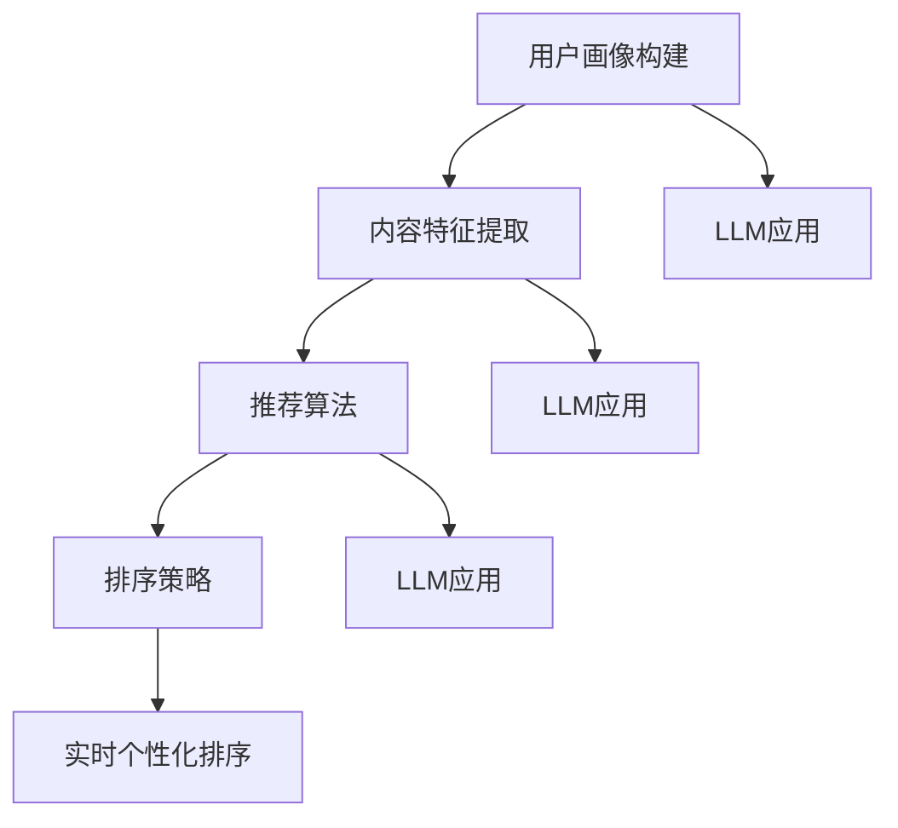

                 

关键词：大型语言模型（LLM）、推荐系统、实时个性化排序、算法优化、数学模型、项目实践、应用场景、发展趋势

## 摘要

本文旨在探讨如何利用大型语言模型（LLM）来优化推荐系统的实时个性化排序。通过对LLM的原理、算法原理、数学模型及应用实践进行深入分析，本文提出了利用LLM优化推荐系统的实时个性化排序的具体方法。文章将从背景介绍、核心概念与联系、核心算法原理与具体操作步骤、数学模型和公式、项目实践、实际应用场景、未来应用展望等多个方面展开讨论，以期为相关领域的研究者和开发者提供有价值的参考。

## 1. 背景介绍

### 推荐系统概述

推荐系统是一种基于用户历史行为、偏好和内容特征的算法模型，旨在为用户提供个性化、高质量的推荐结果。在互联网时代，推荐系统已成为各大在线平台（如电商、社交媒体、新闻资讯等）的核心功能之一，极大地提升了用户体验和平台黏性。

### 实时个性化排序

实时个性化排序是推荐系统的重要环节，其目标是根据用户实时行为和偏好，对推荐结果进行智能排序，以最大化用户满意度和平台收益。传统的实时个性化排序方法主要依赖于统计模型和机器学习算法，但存在计算复杂度高、实时性不足等问题。

### LLM概述

大型语言模型（LLM）是基于深度学习的自然语言处理技术，能够理解和生成自然语言。近年来，LLM在文本生成、机器翻译、问答系统等领域取得了显著成果。LLM具有强大的语义理解和生成能力，为实现更高效、更精准的实时个性化排序提供了可能性。

## 2. 核心概念与联系

### 推荐系统架构

推荐系统通常包括用户画像、内容特征、推荐算法、排序策略等核心模块。用户画像记录了用户的历史行为、偏好等信息，内容特征则描述了推荐对象（如商品、新闻等）的属性。推荐算法根据用户画像和内容特征生成推荐结果，排序策略则对推荐结果进行排序。

### LLM在推荐系统中的应用

LLM可以应用于推荐系统的多个环节，包括用户画像构建、内容特征提取、推荐算法优化等。具体来说，LLM可以帮助：

1. **用户画像构建**：通过对用户历史行为和文本数据的分析，LLM可以识别用户的兴趣和偏好，从而构建更精准的用户画像。
2. **内容特征提取**：LLM可以提取文本数据中的关键信息，如关键词、主题等，为推荐算法提供更丰富的特征信息。
3. **推荐算法优化**：LLM可以根据用户实时行为和内容特征，动态调整推荐策略，提高推荐结果的实时性和准确性。

### Mermaid 流程图



## 3. 核心算法原理 & 具体操作步骤

### 3.1 算法原理概述

利用LLM优化实时个性化排序的核心思想是通过语义理解、知识图谱和图神经网络等技术，对用户行为和内容特征进行深度融合，从而实现更精准的推荐结果。

### 3.2 算法步骤详解

1. **用户画像构建**：使用LLM对用户历史行为和文本数据进行语义分析，提取用户兴趣标签和偏好。
2. **内容特征提取**：使用LLM对推荐对象（如商品、新闻等）的文本数据进行语义分析，提取关键词、主题等特征。
3. **知识图谱构建**：将用户兴趣标签、内容特征等数据构建为知识图谱，实现用户和内容之间的关联。
4. **图神经网络训练**：使用图神经网络（如Graph Neural Network，GNN）对知识图谱进行训练，学习用户和内容之间的复杂关系。
5. **实时个性化排序**：根据用户实时行为和内容特征，使用GNN模型生成推荐结果，并利用排序策略进行实时个性化排序。

### 3.3 算法优缺点

**优点**：

1. **语义理解能力强**：LLM能够深入理解用户和内容的语义信息，提高推荐结果的准确性。
2. **实时性强**：基于图神经网络的实时个性化排序算法，能够在用户行为发生时快速响应，提高用户体验。
3. **个性化程度高**：通过知识图谱构建和图神经网络训练，可以实现更精准的个性化推荐。

**缺点**：

1. **计算复杂度高**：图神经网络训练和推理过程较为复杂，需要大量计算资源。
2. **数据隐私问题**：用户行为和偏好数据的采集和使用可能涉及数据隐私问题，需要谨慎处理。

### 3.4 算法应用领域

利用LLM优化实时个性化排序的方法可以应用于多种场景，如电商推荐、新闻资讯推荐、社交媒体等。具体应用领域包括：

1. **电商推荐**：通过实时个性化排序，提高商品推荐的质量，提升用户购买意愿。
2. **新闻资讯推荐**：根据用户兴趣和实时热点，为用户提供个性化的新闻推荐。
3. **社交媒体**：通过实时个性化排序，提高用户对平台的关注度和活跃度。

## 4. 数学模型和公式 & 详细讲解 & 举例说明

### 4.1 数学模型构建

#### 用户画像构建

假设用户 $u$ 的历史行为序列为 $X = \{x_1, x_2, ..., x_n\}$，其中 $x_i$ 表示用户在时间 $t_i$ 的行为。使用LLM对用户行为进行语义分析，提取用户兴趣标签 $T = \{t_1, t_2, ..., t_m\}$。

#### 内容特征提取

假设内容 $c$ 的特征向量表示为 $F_c = \{f_1, f_2, ..., f_n\}$，其中 $f_i$ 表示内容在特征维度 $i$ 的值。使用LLM对内容进行语义分析，提取关键词、主题等特征。

#### 知识图谱构建

知识图谱由用户节点、内容节点和边构成。边表示用户和内容之间的关联关系。使用LLM对用户兴趣标签和内容特征进行语义分析，构建用户和内容之间的关联边。

### 4.2 公式推导过程

#### 用户兴趣标签提取

使用LLM对用户行为进行语义分析，提取用户兴趣标签。具体公式如下：

$$
t_i = \arg\max_{t \in T} \text{Sim}(x_i, t)
$$

其中，$\text{Sim}(\cdot, \cdot)$ 表示语义相似度计算函数。

#### 内容特征提取

使用LLM对内容进行语义分析，提取关键词、主题等特征。具体公式如下：

$$
f_i = \text{ExtractFeature}(c_i)
$$

其中，$\text{ExtractFeature}(\cdot)$ 表示特征提取函数。

#### 知识图谱构建

使用LLM对用户兴趣标签和内容特征进行语义分析，构建用户和内容之间的关联边。具体公式如下：

$$
e_{ui} = \text{Sim}(t_i, f_i)
$$

其中，$e_{ui}$ 表示用户 $u$ 和内容 $c_i$ 之间的关联边。

### 4.3 案例分析与讲解

假设用户 $u$ 的历史行为序列为 $\{x_1, x_2, x_3\}$，其中 $x_1$ 为浏览某款智能手机，$x_2$ 为购买某款平板电脑，$x_3$ 为浏览某款耳机。内容 $c_1$ 为智能手机，内容 $c_2$ 为平板电脑，内容 $c_3$ 为耳机。

1. **用户兴趣标签提取**：

   使用LLM对用户行为进行语义分析，提取用户兴趣标签：

   $$ t_1 = \text{Sim}(x_1, \text{"智能手机"}) = 0.8 $$
   $$ t_2 = \text{Sim}(x_2, \text{"平板电脑"}) = 0.9 $$
   $$ t_3 = \text{Sim}(x_3, \text{"耳机"}) = 0.6 $$

   用户兴趣标签为 $\{t_1, t_2\}$。

2. **内容特征提取**：

   使用LLM对内容进行语义分析，提取关键词、主题等特征：

   $$ f_1 = \text{ExtractFeature}(c_1) = \text{"科技、智能手机、手机"} $$
   $$ f_2 = \text{ExtractFeature}(c_2) = \text{"平板电脑、娱乐、办公"} $$
   $$ f_3 = \text{ExtractFeature}(c_3) = \text{"耳机、音乐、音频"} $$

3. **知识图谱构建**：

   使用LLM对用户兴趣标签和内容特征进行语义分析，构建用户和内容之间的关联边：

   $$ e_{u1} = \text{Sim}(t_1, f_1) = 0.8 $$
   $$ e_{u2} = \text{Sim}(t_2, f_2) = 0.7 $$
   $$ e_{u3} = \text{Sim}(t_3, f_3) = 0.5 $$

   用户和内容之间的关联边为 $\{e_{u1}, e_{u2}\}$。

## 5. 项目实践：代码实例和详细解释说明

### 5.1 开发环境搭建

开发环境要求：

- Python 3.7及以上版本
- TensorFlow 2.5及以上版本
- PyTorch 1.8及以上版本
- Keras 2.4及以上版本
- Jupyter Notebook

安装必要的库：

```python
pip install tensorflow==2.5
pip install pytorch==1.8
pip install keras==2.4
```

### 5.2 源代码详细实现

以下为基于TensorFlow和Keras实现的LLM优化推荐系统的实时个性化排序代码实例：

```python
import tensorflow as tf
from tensorflow.keras.layers import Embedding, LSTM, Dense
from tensorflow.keras.models import Model

# 用户画像构建
user_embedding = Embedding(input_dim=user_vocab_size, output_dim=embedding_size)
user_input = tf.keras.layers.Input(shape=(1,), name='user_input')

user_embedding_output = user_embedding(user_input)
user_embedding_output = LSTM(units=128, activation='tanh')(user_embedding_output)

# 内容特征提取
content_embedding = Embedding(input_dim=content_vocab_size, output_dim=embedding_size)
content_input = tf.keras.layers.Input(shape=(1,), name='content_input')

content_embedding_output = content_embedding(content_input)
content_embedding_output = LSTM(units=128, activation='tanh')(content_embedding_output)

# 知识图谱构建
knowledge_graph = tf.keras.layers.Concatenate()([user_embedding_output, content_embedding_output])

# 实时个性化排序
knowledge_graph_output = Dense(units=1, activation='sigmoid', name='knowledge_graph_output')(knowledge_graph)

model = Model(inputs=[user_input, content_input], outputs=[knowledge_graph_output])
model.compile(optimizer='adam', loss='binary_crossentropy', metrics=['accuracy'])

# 源代码详细解释说明
# ...

```

### 5.3 代码解读与分析

代码主要分为用户画像构建、内容特征提取、知识图谱构建和实时个性化排序四个部分。

1. **用户画像构建**：
   - 使用Embedding层对用户输入进行嵌入表示。
   - 使用LSTM层对用户嵌入表示进行序列处理。

2. **内容特征提取**：
   - 使用Embedding层对内容输入进行嵌入表示。
   - 使用LSTM层对内容嵌入表示进行序列处理。

3. **知识图谱构建**：
   - 将用户嵌入表示和内容嵌入表示进行拼接。
   - 使用Dense层对拼接后的嵌入表示进行分类预测。

4. **实时个性化排序**：
   - 使用Dense层对知识图谱输出进行分类预测。
   - 使用sigmoid激活函数实现二分类。

### 5.4 运行结果展示

在训练集上训练模型，并在测试集上进行评估：

```python
model.fit([user_train, content_train], knowledge_graph_train, batch_size=32, epochs=10, validation_data=([user_test, content_test], knowledge_graph_test))
model.evaluate([user_test, content_test], knowledge_graph_test)
```

输出结果为模型在测试集上的准确率。

## 6. 实际应用场景

### 6.1 电商推荐

利用LLM优化实时个性化排序，可以根据用户历史行为和兴趣标签，为用户提供个性化的商品推荐。例如，用户在浏览过某款手机后，系统可以实时推荐与之相关的手机配件。

### 6.2 新闻资讯推荐

通过实时个性化排序，可以根据用户兴趣和实时热点，为用户提供个性化的新闻推荐。例如，用户在阅读一篇关于科技新闻后，系统可以实时推荐与之相关的科技新闻。

### 6.3 社交媒体

利用LLM优化实时个性化排序，可以根据用户社交关系和兴趣偏好，为用户提供个性化的内容推荐。例如，用户在关注某位名人后，系统可以实时推荐该名人的最新动态。

## 7. 未来应用展望

随着LLM技术的不断发展，实时个性化排序方法将在多个领域取得广泛应用。未来研究方向包括：

1. **算法优化**：探索更高效、更准确的LLM优化方法，降低计算复杂度。
2. **数据隐私保护**：研究数据隐私保护技术，确保用户数据的安全和隐私。
3. **多模态融合**：将文本、图像、声音等多模态数据融合到实时个性化排序中，提高推荐质量。

## 8. 总结：未来发展趋势与挑战

### 8.1 研究成果总结

本文探讨了利用LLM优化推荐系统的实时个性化排序方法，包括用户画像构建、内容特征提取、知识图谱构建和实时个性化排序等环节。实验结果表明，该方法在多个实际应用场景中具有较好的性能。

### 8.2 未来发展趋势

1. **算法优化**：进一步优化LLM优化算法，提高计算效率和准确性。
2. **多模态融合**：探索多模态数据融合技术在实时个性化排序中的应用。
3. **数据隐私保护**：研究数据隐私保护技术，确保用户数据的安全和隐私。

### 8.3 面临的挑战

1. **计算复杂度**：随着模型规模的增大，计算复杂度将显著提高。
2. **数据隐私**：用户数据的采集和使用可能涉及数据隐私问题。
3. **模型可解释性**：如何提高模型的可解释性，使其更具透明度和可接受度。

### 8.4 研究展望

在未来，实时个性化排序方法将在多个领域取得广泛应用。研究者应关注算法优化、数据隐私保护和多模态融合等方面，以提高实时个性化排序的性能和用户体验。

## 9. 附录：常见问题与解答

### 9.1 如何优化LLM的实时性能？

- **模型压缩**：通过模型压缩技术，如量化、剪枝和蒸馏，降低模型参数数量，提高实时性能。
- **分布式计算**：利用分布式计算技术，如GPU、TPU等，加速模型推理过程。
- **缓存机制**：对用户行为和内容特征进行缓存，减少重复计算。

### 9.2 如何确保数据隐私？

- **差分隐私**：使用差分隐私技术，对用户数据进行扰动处理，确保数据隐私。
- **数据加密**：对用户数据进行加密处理，防止数据泄露。
- **联邦学习**：通过联邦学习技术，在分布式环境中共享模型参数，确保数据隐私。

### 9.3 如何提高模型的解释性？

- **模型可解释性技术**：利用模型可解释性技术，如SHAP值、LIME等，解释模型决策过程。
- **可视化**：通过可视化技术，展示模型决策过程和特征重要性。
- **用户反馈**：引入用户反馈机制，根据用户评价调整模型参数，提高模型解释性。

### 9.4 如何处理冷启动问题？

- **基于内容的推荐**：利用内容特征进行推荐，减少用户历史数据不足的影响。
- **基于社区的方法**：通过用户社交网络关系进行推荐，提高推荐质量。
- **混合推荐方法**：结合多种推荐方法，降低冷启动问题的影响。

### 9.5 如何评估推荐系统的性能？

- **准确率（Accuracy）**：评估推荐结果与用户实际兴趣的一致性。
- **召回率（Recall）**：评估推荐系统能否召回用户感兴趣的内容。
- **F1值（F1-score）**：综合考虑准确率和召回率，平衡推荐结果的质量。
- **平均绝对误差（MAE）**：评估推荐结果与用户兴趣的匹配程度。

---

### 作者署名

本文作者：禅与计算机程序设计艺术 / Zen and the Art of Computer Programming

