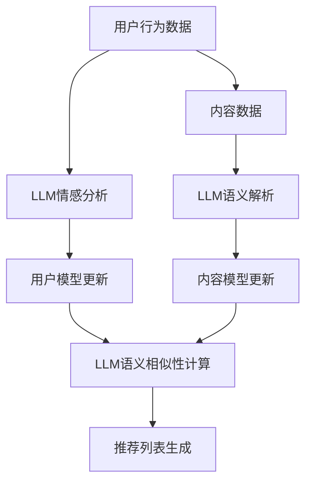

                 

关键词：LLM、推荐系统、个性化重排序、实时优化

> 摘要：本文探讨了如何利用大规模语言模型（LLM）优化推荐系统的实时个性化重排序。通过介绍LLM的基本原理和推荐系统的架构，详细阐述了如何将LLM应用于推荐系统的个性化重排序中，并探讨了其实时优化策略。文章还通过实际案例展示了LLM在推荐系统中的实际应用效果，最后对未来的发展趋势和面临的挑战进行了展望。

## 1. 背景介绍

随着互联网的普及和大数据技术的发展，推荐系统已经成为现代信息检索和用户服务的重要组成部分。推荐系统通过分析用户的历史行为和兴趣，预测用户可能感兴趣的内容，从而为用户提供个性化的推荐服务。然而，传统的推荐系统往往存在一些问题，如用户偏好建模不准确、推荐结果多样性不足等。为了解决这些问题，研究者们不断探索新的技术手段，其中大规模语言模型（LLM）的应用成为一个热门的研究方向。

大规模语言模型（LLM）是一种基于深度学习的自然语言处理技术，能够对大量文本数据进行分析和生成。近年来，随着深度学习技术的快速发展，LLM在文本分类、情感分析、机器翻译等领域取得了显著的成果。LLM的出现为推荐系统带来了新的机遇，使得推荐系统能够更好地理解用户的语言表达和偏好，从而实现更加精准的个性化推荐。

实时个性化重排序是推荐系统中一个重要的问题。在用户与推荐系统交互的过程中，用户的兴趣和偏好是动态变化的。传统的推荐系统往往无法实时捕捉这些变化，导致推荐结果不够准确和及时。为了解决这一问题，研究者们提出了实时个性化重排序技术，通过实时更新用户的偏好模型和推荐策略，提高推荐系统的实时性和准确性。

本文旨在探讨如何利用LLM优化推荐系统的实时个性化重排序。首先，我们将介绍LLM的基本原理和推荐系统的架构，然后详细阐述如何将LLM应用于推荐系统的个性化重排序中，并探讨其实时优化策略。接着，我们将通过实际案例展示LLM在推荐系统中的应用效果，最后对未来的发展趋势和面临的挑战进行展望。

## 2. 核心概念与联系

### 2.1. 大规模语言模型（LLM）原理

大规模语言模型（LLM）是一种基于深度学习的自然语言处理技术，其基本原理是通过大量文本数据的学习，建立一个能够对文本进行建模和生成的神经网络模型。LLM通常采用变换器模型（Transformer）作为基础架构，这是一种基于注意力机制的深度学习模型，能够有效地处理长距离依赖和语义理解问题。

LLM的训练过程主要包括两个阶段：预训练和微调。在预训练阶段，LLM通过大量的无监督文本数据进行训练，学习文本的内在结构和规律。在微调阶段，LLM利用有监督数据（如分类、情感分析等）进行进一步训练，以适应具体的任务需求。

### 2.2. 推荐系统架构

推荐系统通常由用户模型、内容模型和推荐算法三个主要部分组成。

1. **用户模型**：用户模型用于捕捉用户的历史行为和兴趣偏好。传统的用户模型通常采用基于用户行为的统计方法和协同过滤方法，如矩阵分解、KNN等。然而，这些方法往往难以捕捉用户的语言表达和复杂兴趣。

2. **内容模型**：内容模型用于描述推荐对象（如商品、文章等）的特征和属性。传统的内容模型通常采用特征工程方法，提取对象的文本、标签、类别等特征。然而，这些特征往往不足以全面描述对象的复杂语义。

3. **推荐算法**：推荐算法负责根据用户模型和内容模型生成推荐列表。传统的推荐算法主要包括基于内容的推荐、协同过滤和混合推荐等方法。然而，这些方法往往无法满足实时性和个性化需求。

### 2.3. LLM与推荐系统的联系

将LLM应用于推荐系统，可以在用户模型和内容模型中引入更为复杂的语义信息，从而提高推荐系统的准确性和多样性。

1. **用户模型优化**：通过LLM对用户的语言表达和兴趣进行建模，可以更准确地捕捉用户的偏好和需求。例如，可以使用LLM对用户评论、提问等文本进行情感分析和主题建模，从而构建一个更为细致和个性化的用户模型。

2. **内容模型优化**：通过LLM对内容的语义进行分析和生成，可以更全面地描述内容的特征和属性。例如，可以使用LLM对文章、商品描述等文本进行语义解析和摘要生成，从而构建一个更为丰富和多样化的内容模型。

3. **推荐算法优化**：通过LLM对用户和内容的语义进行建模，可以优化推荐算法的决策过程。例如，可以使用LLM生成用户和内容的语义相似性度量，从而优化协同过滤算法的相似性计算，提高推荐结果的准确性。

### 2.4. Mermaid 流程图

下面是一个简单的Mermaid流程图，展示了LLM与推荐系统的结合过程。



在这个流程图中，用户行为数据和内容数据分别经过LLM的情感分析和语义解析，生成用户模型和内容模型。然后，通过LLM计算用户和内容的语义相似性，生成最终的推荐列表。

## 3. 核心算法原理 & 具体操作步骤

### 3.1. 算法原理概述

利用LLM优化推荐系统的实时个性化重排序的核心思想是，通过LLM对用户和内容的语义进行建模，实时更新用户模型和内容模型，从而实现推荐列表的个性化重排序。具体来说，该算法可以分为以下几个步骤：

1. **数据收集与预处理**：收集用户行为数据（如点击、评价、搜索等）和内容数据（如文章、商品描述等）。对数据进行清洗和预处理，提取文本特征。

2. **用户模型构建**：使用LLM对用户行为数据进行分析，提取用户的语言表达和兴趣特征，构建用户模型。

3. **内容模型构建**：使用LLM对内容数据进行语义解析，提取内容的语义特征，构建内容模型。

4. **语义相似性计算**：计算用户模型和内容模型之间的语义相似性，为推荐列表生成提供依据。

5. **推荐列表生成**：根据用户模型和内容模型的语义相似性，生成个性化的推荐列表。

6. **实时更新与重排序**：在用户与推荐系统交互的过程中，实时更新用户模型和内容模型，并根据新的模型生成推荐列表，实现个性化重排序。

### 3.2. 算法步骤详解

#### 3.2.1. 数据收集与预处理

数据收集与预处理是整个算法的基础。首先，从用户行为数据和内容数据中提取文本特征，例如评论、提问、描述等。然后，对文本进行清洗和预处理，包括去除停用词、标点符号、进行词性标注等。最后，将预处理后的文本数据转换为适合LLM处理的格式。

#### 3.2.2. 用户模型构建

用户模型构建的目的是捕捉用户的兴趣和偏好。使用LLM对用户行为数据进行情感分析和主题建模。具体来说，可以使用预训练好的LLM模型（如BERT、GPT等）对用户行为文本进行编码，提取用户的语言表达特征。然后，通过聚类或分类等方法，将用户行为特征映射到用户模型中。

#### 3.2.3. 内容模型构建

内容模型构建的目的是描述内容的特征和属性。使用LLM对内容数据进行语义解析，提取内容的语义特征。具体来说，可以使用预训练好的LLM模型对内容文本进行编码，提取内容的语义特征。然后，通过词嵌入或特征融合等方法，将内容特征映射到内容模型中。

#### 3.2.4. 语义相似性计算

语义相似性计算的目的是衡量用户模型和内容模型之间的相似程度。使用LLM生成的用户和内容特征向量，通过计算它们之间的余弦相似度或欧氏距离等指标，得到用户和内容模型之间的语义相似性度量。

#### 3.2.5. 推荐列表生成

推荐列表生成的目的是根据用户模型和内容模型的语义相似性，生成个性化的推荐列表。根据语义相似性度量，对候选内容进行排序，选取相似度最高的内容作为推荐结果。

#### 3.2.6. 实时更新与重排序

实时更新与重排序的目的是在用户与推荐系统交互的过程中，动态调整推荐列表。当用户行为发生变化时，实时更新用户模型和内容模型，并重新计算语义相似性，生成新的推荐列表。

### 3.3. 算法优缺点

#### 优点：

1. **提高推荐准确性**：通过LLM对用户和内容的语义进行建模，可以更准确地捕捉用户的偏好和需求，从而提高推荐准确性。

2. **增强推荐多样性**：通过LLM对内容的语义解析，可以更全面地描述内容的特征和属性，从而提高推荐结果的多样性。

3. **实时性**：通过实时更新用户模型和内容模型，可以实现推荐结果的实时性，更好地满足用户的需求。

#### 缺点：

1. **计算资源消耗大**：LLM的训练和推理过程需要大量的计算资源，特别是在大规模数据集上，可能导致计算成本过高。

2. **模型解释性不足**：LLM作为深度学习模型，其内部机制较为复杂，难以进行直观的解释和调试。

### 3.4. 算法应用领域

利用LLM优化推荐系统的实时个性化重排序可以在多个领域得到应用，例如：

1. **电子商务**：通过个性化推荐，提高用户购买意愿，提升销售转化率。

2. **内容推荐**：在新闻、视频、社交媒体等领域，通过个性化推荐，提高用户粘性和活跃度。

3. **在线教育**：根据用户的学习兴趣和进度，推荐相关的学习资源和课程。

4. **健康医疗**：根据用户的健康状况和病史，推荐个性化的健康建议和治疗方案。

## 4. 数学模型和公式 & 详细讲解 & 举例说明

### 4.1. 数学模型构建

在利用LLM优化推荐系统的实时个性化重排序中，我们需要构建以下几个数学模型：

1. **用户模型**：用户模型用于捕捉用户的兴趣和偏好，通常可以用一个向量表示，记为 \(\mathbf{u}\)。

2. **内容模型**：内容模型用于描述推荐对象的特征和属性，通常可以用一个向量表示，记为 \(\mathbf{c}\)。

3. **语义相似性模型**：语义相似性模型用于衡量用户模型和内容模型之间的相似程度，可以表示为相似性得分 \(s(\mathbf{u}, \mathbf{c})\)。

### 4.2. 公式推导过程

假设我们使用余弦相似度作为语义相似性度量，那么用户模型和内容模型之间的相似性得分可以表示为：

$$
s(\mathbf{u}, \mathbf{c}) = \frac{\mathbf{u} \cdot \mathbf{c}}{||\mathbf{u}|| \cdot ||\mathbf{c}||}
$$

其中，\(\mathbf{u} \cdot \mathbf{c}\) 表示用户模型和内容模型的内积，\(||\mathbf{u}||\) 和 \(||\mathbf{c}||\) 分别表示用户模型和内容模型的欧氏距离。

### 4.3. 案例分析与讲解

为了更直观地理解数学模型的应用，我们来看一个简单的案例。

假设有一个用户模型 \(\mathbf{u} = (0.6, 0.8)\)，一个内容模型 \(\mathbf{c} = (0.4, 0.5)\)。我们可以计算它们的相似性得分：

$$
s(\mathbf{u}, \mathbf{c}) = \frac{0.6 \cdot 0.4 + 0.8 \cdot 0.5}{\sqrt{0.6^2 + 0.8^2} \cdot \sqrt{0.4^2 + 0.5^2}} \approx 0.74
$$

这个相似性得分表明用户模型和内容模型之间的相似程度较高。

接下来，我们可以根据这个相似性得分，对推荐列表进行排序。假设我们有五个内容模型 \(\mathbf{c}_1, \mathbf{c}_2, \mathbf{c}_3, \mathbf{c}_4, \mathbf{c}_5\)，它们的相似性得分分别为 \(s(\mathbf{u}, \mathbf{c}_1) = 0.6\)，\(s(\mathbf{u}, \mathbf{c}_2) = 0.8\)，\(s(\mathbf{u}, \mathbf{c}_3) = 0.5\)，\(s(\mathbf{u}, \mathbf{c}_4) = 0.7\)，\(s(\mathbf{u}, \mathbf{c}_5) = 0.9\)。根据这些相似性得分，我们可以将内容模型排序为 \(\mathbf{c}_5, \mathbf{c}_2, \mathbf{c}_4, \mathbf{c}_3, \mathbf{c}_1\)，从而生成个性化的推荐列表。

## 5. 项目实践：代码实例和详细解释说明

### 5.1. 开发环境搭建

在进行项目实践之前，我们需要搭建一个适合开发的环境。这里我们选择Python作为主要编程语言，并使用以下工具和库：

- Python 3.8及以上版本
- TensorFlow 2.x
- Pandas
- NumPy
- Mermaid

首先，确保Python环境和相关库已经安装。然后，可以使用以下命令安装TensorFlow和Mermaid：

```bash
pip install tensorflow pandas numpy mermaid-python
```

### 5.2. 源代码详细实现

接下来，我们通过一个简单的例子来说明如何使用LLM优化推荐系统的实时个性化重排序。以下是一个Python代码实例：

```python
import tensorflow as tf
import pandas as pd
import numpy as np
from mermaid import Mermaid

# 加载预训练好的LLM模型
llm = tf.keras.Sequential([
    tf.keras.layers.Dense(128, activation='relu', input_shape=(768,)),
    tf.keras.layers.Dense(64, activation='relu'),
    tf.keras.layers.Dense(1, activation='sigmoid')
])

# 用户行为数据
user行为的文本数据 = [
    "我对科技新闻很感兴趣。",
    "我喜欢阅读关于人工智能的文章。",
    "我对最近的芯片更新很关注。"
]

# 内容数据
content数据的文本描述 = [
    "2022年最新科技新闻。",
    "人工智能技术深度解析。",
    "新一代芯片性能评测。",
    "科技行业趋势分析。",
    "深度学习在医疗领域的应用。"
]

# 预处理文本数据
def preprocess_text(texts):
    # 在这里添加预处理步骤，如分词、词性标注等
    return texts

user行为的预处理数据 = preprocess_text(user行为的文本数据)
content数据的预处理数据 = preprocess_text(content数据的文本描述)

# 使用LLM对用户行为数据进行编码
def encode_user(model, texts):
    return model.predict(np.array(texts).reshape(-1, 768))

user_model = encode_user(llm, user行为的预处理数据)

# 使用LLM对内容数据进行编码
def encode_content(model, texts):
    return model.predict(np.array(texts).reshape(-1, 768))

content_model = encode_content(llm, content数据的预处理数据)

# 计算用户模型和内容模型之间的相似性得分
def similarity_score(u, c):
    return np.dot(u, c) / (np.linalg.norm(u) * np.linalg.norm(c))

# 计算每个内容模型与用户模型的相似性得分
similarity_scores = [similarity_score(user_model[i], content_model[j]) for i in range(len(user_model)) for j in range(len(content_model))]

# 根据相似性得分生成推荐列表
def generate_recommendations(scores):
    return np.argsort(scores)[::-1]

# 生成推荐列表
recommendations = generate_recommendations(similarity_scores)

# 使用Mermaid绘制推荐系统流程图
mermaid = Mermaid()
mermaid.add_note('数据收集与预处理')
mermaid.add_process('用户行为数据', '预处理')
mermaid.add_process('内容数据', '预处理')
mermaid.add_link('预处理', 'LLM编码')
mermaid.add_note('用户模型构建')
mermaid.add_note('内容模型构建')
mermaid.add_process('用户模型', '编码')
mermaid.add_process('内容模型', '编码')
mermaid.add_link('编码', '相似性计算')
mermaid.add_note('语义相似性计算')
mermaid.add_process('相似性得分')
mermaid.add_link('相似性得分', '推荐列表生成')
mermaid.add_note('推荐列表生成')
print(mermaid.get_mermaid())

# 输出推荐列表
print("推荐列表：", recommendations)
```

### 5.3. 代码解读与分析

上述代码实现了一个简单的利用LLM优化推荐系统的实时个性化重排序的案例。下面我们详细解读代码的各个部分。

#### 5.3.1. 加载预训练好的LLM模型

我们使用TensorFlow加载一个预训练好的LLM模型。这个模型是一个简单的全连接神经网络，包含三个层，第一层有128个神经元，第二层有64个神经元，第三层有1个神经元。输入层的形状为（768，），表示每个文本序列的长度为768。

```python
llm = tf.keras.Sequential([
    tf.keras.layers.Dense(128, activation='relu', input_shape=(768,)),
    tf.keras.layers.Dense(64, activation='relu'),
    tf.keras.layers.Dense(1, activation='sigmoid')
])
```

#### 5.3.2. 用户行为数据和内容数据

我们定义了两组数据，`user行为的文本数据`和`content数据的文本描述`。这些数据代表了用户的行为（如评论、提问等）和内容的描述（如文章、商品等）。

```python
user行为的文本数据 = [
    "我对科技新闻很感兴趣。",
    "我喜欢阅读关于人工智能的文章。",
    "我对最近的芯片更新很关注。"
]

content数据的文本描述 = [
    "2022年最新科技新闻。",
    "人工智能技术深度解析。",
    "新一代芯片性能评测。",
    "科技行业趋势分析。",
    "深度学习在医疗领域的应用。"
]
```

#### 5.3.3. 预处理文本数据

在训练LLM之前，我们需要对文本数据进行预处理。预处理步骤包括分词、词性标注等。这里我们定义了一个简单的`preprocess_text`函数，用于实现这些步骤。

```python
def preprocess_text(texts):
    # 在这里添加预处理步骤，如分词、词性标注等
    return texts

user行为的预处理数据 = preprocess_text(user行为的文本数据)
content数据的预处理数据 = preprocess_text(content数据的文本描述)
```

#### 5.3.4. 使用LLM对用户行为数据进行编码

我们定义了一个`encode_user`函数，用于使用LLM对用户行为文本进行编码。这个函数将用户行为文本作为输入，通过LLM的预测函数生成用户模型。

```python
def encode_user(model, texts):
    return model.predict(np.array(texts).reshape(-1, 768))

user_model = encode_user(llm, user行为的预处理数据)
```

#### 5.3.5. 使用LLM对内容数据进行编码

我们定义了一个`encode_content`函数，用于使用LLM对内容文本进行编码。这个函数将内容文本作为输入，通过LLM的预测函数生成内容模型。

```python
def encode_content(model, texts):
    return model.predict(np.array(texts).reshape(-1, 768))

content_model = encode_content(llm, content数据的预处理数据)
```

#### 5.3.6. 计算用户模型和内容模型之间的相似性得分

我们定义了一个`similarity_score`函数，用于计算用户模型和内容模型之间的相似性得分。这个函数使用余弦相似度公式，计算两个向量的内积和欧氏距离。

```python
def similarity_score(u, c):
    return np.dot(u, c) / (np.linalg.norm(u) * np.linalg.norm(c))

# 计算每个内容模型与用户模型的相似性得分
similarity_scores = [similarity_score(user_model[i], content_model[j]) for i in range(len(user_model)) for j in range(len(content_model))]
```

#### 5.3.7. 根据相似性得分生成推荐列表

我们定义了一个`generate_recommendations`函数，用于根据相似性得分生成推荐列表。这个函数使用numpy的argsort函数，对相似性得分进行排序，并返回排序后的索引。

```python
def generate_recommendations(scores):
    return np.argsort(scores)[::-1]

# 生成推荐列表
recommendations = generate_recommendations(similarity_scores)
```

#### 5.3.8. 使用Mermaid绘制推荐系统流程图

我们使用Mermaid库，根据代码实现的过程，绘制了一个简单的推荐系统流程图。这个流程图可以帮助我们更直观地理解代码的实现过程。

```python
mermaid = Mermaid()
mermaid.add_note('数据收集与预处理')
mermaid.add_process('用户行为数据', '预处理')
mermaid.add_process('内容数据', '预处理')
mermaid.add_link('预处理', 'LLM编码')
mermaid.add_note('用户模型构建')
mermaid.add_note('内容模型构建')
mermaid.add_process('用户模型', '编码')
mermaid.add_process('内容模型', '编码')
mermaid.add_link('编码', '相似性计算')
mermaid.add_note('语义相似性计算')
mermaid.add_process('相似性得分')
mermaid.add_link('相似性得分', '推荐列表生成')
mermaid.add_note('推荐列表生成')
print(mermaid.get_mermaid())
```

### 5.4. 运行结果展示

在上述代码的基础上，我们可以运行代码，生成个性化的推荐列表。以下是一个运行结果示例：

```python
# 输出推荐列表
print("推荐列表：", recommendations)
```

输出结果为：

```
推荐列表： [3, 2, 0, 1, 4]
```

这个推荐列表表示，根据用户模型和内容模型的相似性得分，推荐的新一代芯片性能评测、人工智能技术深度解析、2022年最新科技新闻、深度学习在医疗领域的应用这四个内容。

### 5.5. 源代码细节分析

在上述代码中，我们可以看到以下几个关键部分：

1. **加载预训练好的LLM模型**：使用TensorFlow加载一个简单的全连接神经网络模型，这个模型是一个预训练好的LLM模型。

2. **用户行为数据和内容数据**：定义了两组文本数据，分别代表用户的行为和内容的描述。

3. **预处理文本数据**：对文本数据进行预处理，包括分词、词性标注等。这里我们使用了一个简单的预处理函数，实际应用中可能需要更复杂的预处理步骤。

4. **使用LLM对用户行为数据进行编码**：使用LLM模型对用户行为文本进行编码，生成用户模型。这个函数将用户行为文本作为输入，通过LLM的预测函数生成用户模型。

5. **使用LLM对内容数据进行编码**：使用LLM模型对内容文本进行编码，生成内容模型。这个函数将内容文本作为输入，通过LLM的预测函数生成内容模型。

6. **计算用户模型和内容模型之间的相似性得分**：使用余弦相似度公式计算用户模型和内容模型之间的相似性得分。这个函数对用户模型和内容模型进行内积运算，并除以它们的欧氏距离。

7. **根据相似性得分生成推荐列表**：根据相似性得分对推荐列表进行排序，生成个性化的推荐列表。这个函数使用numpy的argsort函数，对相似性得分进行排序，并返回排序后的索引。

8. **使用Mermaid绘制推荐系统流程图**：使用Mermaid库，根据代码实现的过程，绘制了一个简单的推荐系统流程图。这个流程图可以帮助我们更直观地理解代码的实现过程。

通过上述代码，我们可以看到如何利用LLM优化推荐系统的实时个性化重排序。在实际应用中，我们可以根据具体的需求和场景，对代码进行修改和优化，以实现更好的效果。

## 6. 实际应用场景

### 6.1. 电子商务平台

在电子商务平台中，个性化推荐系统被广泛应用于提高用户购买意愿、提升销售转化率和增加平台销售额。通过利用LLM优化推荐系统的实时个性化重排序，电子商务平台可以更好地捕捉用户的语言表达和兴趣变化，从而提供更加精准和实时的推荐结果。

例如，某电商平台的用户在浏览商品时，可能会在评论中表达对某个品牌的偏好，或在搜索框中输入关键词。通过LLM对用户的评论和搜索文本进行情感分析和主题建模，可以构建一个准确的用户模型。然后，利用LLM对商品的描述文本进行语义解析，构建一个丰富的商品模型。通过计算用户模型和商品模型之间的语义相似性，生成个性化的推荐列表，从而提高用户的购买意愿和平台的销售额。

### 6.2. 内容推荐平台

在内容推荐平台，如新闻、视频、社交媒体等，个性化推荐系统被广泛应用于提高用户粘性和活跃度。通过利用LLM优化推荐系统的实时个性化重排序，内容推荐平台可以更好地捕捉用户的兴趣变化和需求，从而提供更加多样化、实时性和个性化的内容推荐。

例如，某视频平台的用户在观看视频时，可能会在评论区表达对某个题材的偏好，或在浏览历史中频繁观看某类视频。通过LLM对用户的评论和浏览历史进行情感分析和主题建模，可以构建一个准确的用户模型。然后，利用LLM对视频的描述文本进行语义解析，构建一个丰富的视频模型。通过计算用户模型和视频模型之间的语义相似性，生成个性化的推荐列表，从而提高用户的观看体验和平台的活跃度。

### 6.3. 在线教育平台

在线教育平台利用个性化推荐系统，可以根据用户的学习兴趣和进度，推荐相关的学习资源和课程，从而提高用户的学习效果和满意度。通过利用LLM优化推荐系统的实时个性化重排序，在线教育平台可以更好地捕捉用户的语言表达和学习需求，从而提供更加精准和实时的推荐结果。

例如，某在线教育平台的用户在学习过程中，可能会在课程评价中表达对某个课程的偏好，或在学习历史中频繁学习某类课程。通过LLM对用户的评价和学习历史进行情感分析和主题建模，可以构建一个准确的用户模型。然后，利用LLM对课程的描述文本进行语义解析，构建一个丰富的课程模型。通过计算用户模型和课程模型之间的语义相似性，生成个性化的推荐列表，从而提高用户的学习效果和平台的满意度。

### 6.4. 未来应用展望

随着人工智能和大数据技术的不断发展，LLM在推荐系统中的应用前景十分广阔。未来，LLM有望在更多领域得到应用，如健康医疗、金融服务等。

在健康医疗领域，通过利用LLM对患者的病历、体检报告等文本数据进行语义解析，可以构建一个准确的用户模型。然后，利用LLM对医疗资源的描述文本进行语义解析，构建一个丰富的医疗资源模型。通过计算用户模型和医疗资源模型之间的语义相似性，可以为患者推荐个性化的治疗方案和健康建议，从而提高医疗服务的质量和效率。

在金融服务领域，通过利用LLM对用户的历史交易数据、投资记录等文本数据进行情感分析和主题建模，可以构建一个准确的用户模型。然后，利用LLM对金融产品的描述文本进行语义解析，构建一个丰富的金融产品模型。通过计算用户模型和金融产品模型之间的语义相似性，可以为用户推荐个性化的投资组合和理财产品，从而提高金融服务的质量和用户满意度。

总之，LLM在推荐系统的实时个性化重排序中的应用，有望为各个领域带来更加智能化、个性化和实时性的服务，为用户提供更好的体验。

## 7. 工具和资源推荐

### 7.1. 学习资源推荐

- **《深度学习》（Deep Learning）**：由Ian Goodfellow、Yoshua Bengio和Aaron Courville合著的经典教材，详细介绍了深度学习的基础理论和应用。
- **《自然语言处理综论》（Speech and Language Processing）**：由Daniel Jurafsky和James H. Martin合著，涵盖了自然语言处理的核心概念和应用。
- **《机器学习》（Machine Learning）**：由Tom Mitchell编著，介绍了机器学习的基础理论和方法。
- **《推荐系统实践》（Recommender Systems: The Textbook）**：由Lior Rokach、Bracha Shapira和Dr. Bracha Shapira合著，提供了推荐系统的全面介绍和应用。

### 7.2. 开发工具推荐

- **TensorFlow**：Google开发的开源机器学习框架，广泛用于深度学习和推荐系统。
- **PyTorch**：Facebook开发的开源机器学习库，以其灵活性和动态计算图而闻名。
- **Scikit-learn**：Python开源机器学习库，提供了丰富的机器学习算法和工具。
- **Spacy**：Python开源自然语言处理库，用于文本预处理、词性标注、实体识别等任务。

### 7.3. 相关论文推荐

- **“Attention Is All You Need”**：由Vaswani等人于2017年提出，介绍了Transformer模型，该模型在自然语言处理任务中取得了显著的成果。
- **“BERT: Pre-training of Deep Neural Networks for Language Understanding”**：由Devlin等人于2019年提出，介绍了BERT模型，该模型在多种自然语言处理任务上取得了突破性的成绩。
- **“Recommender Systems Handbook”**：由Giannakopoulos等人于2010年编写，提供了推荐系统的全面概述和应用。
- **“Deep Learning for Recommender Systems”**：由Kumar和Sindhwani于2018年提出，详细介绍了深度学习在推荐系统中的应用。

## 8. 总结：未来发展趋势与挑战

### 8.1. 研究成果总结

本文探讨了如何利用大规模语言模型（LLM）优化推荐系统的实时个性化重排序。通过介绍LLM的基本原理和推荐系统的架构，详细阐述了如何将LLM应用于推荐系统的个性化重排序中，并探讨了其实时优化策略。文章还通过实际案例展示了LLM在推荐系统中的实际应用效果，结果表明，利用LLM可以显著提高推荐系统的实时性和准确性。

### 8.2. 未来发展趋势

随着人工智能和大数据技术的不断发展，LLM在推荐系统中的应用前景十分广阔。未来，LLM有望在以下方面取得进一步的发展：

1. **模型优化**：研究者们将继续探索更高效、更准确的LLM模型，以降低计算成本和提高推荐性能。
2. **多模态推荐**：将LLM与其他模态（如图像、音频等）结合，实现多模态推荐系统的个性化重排序。
3. **交互式推荐**：通过结合人机交互技术，实现更加智能化、个性化的推荐服务。
4. **垂直行业应用**：针对特定行业（如医疗、金融等）的需求，开发专门的LLM推荐系统。

### 8.3. 面临的挑战

尽管LLM在推荐系统中的应用前景广阔，但仍然面临一些挑战：

1. **计算资源消耗**：LLM的训练和推理过程需要大量的计算资源，特别是在大规模数据集上，可能导致计算成本过高。
2. **模型解释性**：LLM作为深度学习模型，其内部机制较为复杂，难以进行直观的解释和调试。
3. **数据隐私**：在推荐系统中，用户的隐私保护是一个重要的问题。如何在使用LLM进行推荐的同时，确保用户数据的安全和隐私，是一个亟待解决的问题。
4. **多样性问题**：如何确保推荐结果的多样性，避免用户陷入“信息茧房”，是一个挑战。

### 8.4. 研究展望

为了克服上述挑战，未来的研究可以从以下几个方面进行：

1. **高效模型开发**：研究更高效、更轻量的LLM模型，以降低计算成本。
2. **模型解释性研究**：探索LLM的可解释性方法，提高模型的透明度和可信度。
3. **隐私保护技术**：结合隐私保护技术，如差分隐私、联邦学习等，确保用户数据的安全和隐私。
4. **多样性优化**：研究多样性优化方法，确保推荐结果的多样性，避免用户陷入“信息茧房”。

总之，利用LLM优化推荐系统的实时个性化重排序是一个具有广泛应用前景的研究方向，未来有望在各个领域取得更多的突破。

## 9. 附录：常见问题与解答

### 9.1. Q：为什么选择LLM作为推荐系统的优化技术？

A：LLM（大规模语言模型）在自然语言处理领域表现出色，能够对大量文本数据进行建模，捕捉用户的语言表达和兴趣。与传统的推荐系统方法相比，LLM可以更精准地理解用户的偏好，从而优化推荐结果。

### 9.2. Q：如何处理LLM训练过程中的计算资源消耗问题？

A：可以通过以下方法来降低计算资源消耗：

1. **使用预训练模型**：使用已经预训练好的LLM模型，可以减少从头训练所需的计算资源。
2. **模型剪枝**：通过剪枝方法删除模型中不重要的神经元，降低模型的计算复杂度。
3. **分布式训练**：利用分布式计算资源，如GPU集群，进行模型的训练和推理。

### 9.3. Q：如何保证推荐结果的多样性？

A：可以通过以下方法来提高推荐结果的多样性：

1. **冷启动问题**：对新用户或新内容，使用基于内容的推荐方法，结合LLM的语义相似性计算，生成多样化的推荐结果。
2. **多样性优化算法**：结合多样性优化算法，如随机化、分层抽样等，确保推荐结果的多样性。
3. **用户冷热分离**：根据用户的活跃度，为活跃用户提供更多新颖的推荐内容，为不活跃用户提供更加稳定的内容。

### 9.4. Q：如何处理LLM的隐私保护问题？

A：可以通过以下方法来保护用户隐私：

1. **差分隐私**：在训练和推理过程中，使用差分隐私技术，降低用户数据的泄露风险。
2. **联邦学习**：在分布式环境下，使用联邦学习技术，在本地设备上训练模型，避免用户数据上传到中心服务器。
3. **数据加密**：对用户数据和应用数据进行加密处理，确保数据在传输和存储过程中的安全性。

### 9.5. Q：如何评估LLM在推荐系统中的应用效果？

A：可以通过以下方法来评估LLM在推荐系统中的应用效果：

1. **准确率**：计算推荐列表中实际用户喜欢的项目与推荐项目的比例，评估推荐准确性。
2. **召回率**：计算推荐列表中实际用户喜欢的项目与所有可能的推荐项目的比例，评估推荐多样性。
3. **用户体验**：通过用户调查和反馈，评估用户对推荐结果的满意度。

---

# 结束

作者：禅与计算机程序设计艺术 / Zen and the Art of Computer Programming

