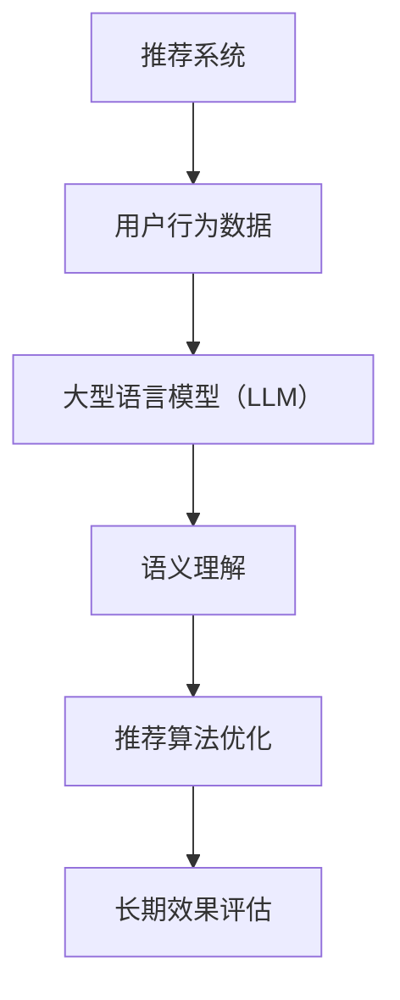

                 

推荐系统是现代信息社会中不可或缺的一部分，从电子商务到社交媒体，从音乐流媒体到新闻聚合，推荐系统无处不在，极大地改变了用户的互动方式。然而，推荐系统的长期效果评估一直是学术界和工业界的一大难题。传统的评估方法主要依赖于短期指标，如点击率、转化率等，但它们往往忽略了用户的长远行为和偏好变化。为了更好地理解和提升推荐系统的长期性能，近年来，大型语言模型（LLM）开始受到关注。

本文将探讨如何利用LLM提升推荐系统的长期效果评估。首先，我们将介绍推荐系统的基本概念和传统评估方法，接着详细阐述LLM的相关原理及其在推荐系统中的应用。随后，我们将探讨如何通过LLM来构建和评估推荐系统的长期性能，并分享一些实际应用场景和未来展望。

## 文章关键词

推荐系统，长期效果评估，大型语言模型（LLM），用户行为分析，深度学习。

## 文章摘要

本文旨在探讨如何利用大型语言模型（LLM）提升推荐系统的长期效果评估。首先，我们回顾了推荐系统的基本概念和传统评估方法，并指出了其局限性。随后，我们详细介绍了LLM的基本原理及其在推荐系统中的应用。通过实际案例，我们展示了如何利用LLM构建和评估推荐系统的长期性能。最后，我们讨论了LLM在推荐系统中的应用前景和面临的挑战。

### 1. 背景介绍

推荐系统是一种基于算法和用户数据自动为用户推荐相关内容或商品的系统。自其诞生以来，推荐系统已经取得了巨大的成功，广泛应用于电子商务、社交媒体、新闻聚合、音乐和视频流媒体等领域。推荐系统的核心目标是提高用户的满意度、提升平台的黏性和转化率，从而为企业和用户带来双赢的局面。

尽管推荐系统取得了显著的成就，但其在长期效果评估方面仍面临诸多挑战。传统评估方法主要依赖于短期指标，如点击率、转化率、停留时间等。这些指标在短期内可以很好地反映系统的性能，但它们往往忽略了用户的长远行为和偏好变化。例如，一个推荐系统可能在短期内取得了较高的点击率，但用户在实际购买或观看后并不满意，从而影响了长期的用户留存率和忠诚度。

此外，传统评估方法通常依赖于静态的特征，而用户的兴趣和行为是动态变化的。用户可能在一段时间内对某种类型的内容或商品感兴趣，但随着时间的推移，他们的偏好可能会发生改变。因此，仅仅依赖短期指标无法全面评估推荐系统的长期性能。

为了解决这些问题，近年来，大型语言模型（LLM）开始受到关注。LLM是一种基于深度学习技术的自然语言处理模型，具有强大的语义理解和生成能力。通过利用LLM，我们可以捕捉用户的长期偏好和行为模式，从而更准确地评估推荐系统的长期性能。

### 2. 核心概念与联系

为了更好地理解本文的核心内容，我们需要先介绍一些关键概念，包括推荐系统、大型语言模型（LLM）、用户行为分析以及它们之间的联系。

#### 2.1 推荐系统

推荐系统是一种基于用户历史行为、兴趣、偏好和上下文信息，为用户推荐相关内容或商品的系统。推荐系统的核心组成部分包括用户、内容、推荐算法和评估指标。

- **用户**：推荐系统的核心，包括用户的基本信息、历史行为数据、兴趣偏好等。
- **内容**：推荐系统中的对象，如文章、商品、音乐、视频等。
- **推荐算法**：根据用户特征和内容特征，通过算法计算推荐结果。
- **评估指标**：用于衡量推荐系统性能的指标，如点击率、转化率、用户满意度等。

#### 2.2 大型语言模型（LLM）

大型语言模型（LLM）是一种基于深度学习的自然语言处理模型，具有强大的语义理解和生成能力。LLM的训练通常依赖于大量的文本数据，如书籍、新闻、社交媒体帖子等。通过学习这些数据，LLM可以捕捉语言中的复杂模式和语义关系。

- **训练数据**：大量的文本数据，如书籍、新闻、社交媒体帖子等。
- **模型架构**：深度学习架构，如Transformer、BERT、GPT等。
- **语义理解**：理解文本中的含义和关系。
- **生成能力**：根据输入文本生成新的文本。

#### 2.3 用户行为分析

用户行为分析是一种通过分析用户在系统中的行为数据，来了解用户兴趣、偏好和需求的方法。用户行为数据包括点击、浏览、购买、评论等。

- **数据来源**：用户的操作行为。
- **分析方法**：基于统计学、机器学习等方法。
- **应用**：了解用户行为模式，为推荐算法提供输入。

#### 2.4 核心概念的联系

推荐系统、大型语言模型（LLM）和用户行为分析之间存在密切的联系。

- **数据驱动**：推荐系统和用户行为分析都依赖于大量的数据，而LLM可以通过这些数据学习用户的偏好和需求。
- **算法融合**：将LLM集成到推荐系统中，可以进一步提高推荐系统的准确性。
- **长期评估**：通过分析用户长期行为，LLM可以更准确地评估推荐系统的长期性能。

为了更好地展示这些核心概念之间的联系，我们可以使用Mermaid流程图来描述：



通过这个流程图，我们可以看到，用户行为数据是推荐系统和LLM之间的桥梁，LLM通过语义理解优化推荐算法，从而实现更准确的长期效果评估。

### 3. 核心算法原理 & 具体操作步骤

#### 3.1 算法原理概述

利用大型语言模型（LLM）提升推荐系统的长期效果评估，主要依赖于以下几个核心原理：

1. **用户偏好捕捉**：通过训练LLM，可以捕捉用户的长期偏好和行为模式。
2. **语义理解**：LLM具有强大的语义理解能力，可以理解用户和内容之间的复杂关系。
3. **个性化推荐**：基于用户的偏好和行为数据，LLM可以生成个性化的推荐结果。
4. **长期效果评估**：通过分析用户长期行为，可以更准确地评估推荐系统的性能。

#### 3.2 算法步骤详解

具体来说，利用LLM提升推荐系统长期效果评估的步骤如下：

1. **数据收集**：收集用户的历史行为数据，包括点击、浏览、购买、评论等。
2. **数据预处理**：对数据进行清洗、去重和格式化，以便于LLM的训练。
3. **模型训练**：使用大型语言模型（如GPT、BERT）对预处理后的用户行为数据进行训练。
4. **偏好捕捉**：通过模型输出，捕捉用户的长期偏好和行为模式。
5. **个性化推荐**：根据用户的偏好和行为数据，生成个性化的推荐结果。
6. **效果评估**：通过分析用户长期行为，评估推荐系统的性能。

下面，我们将详细解释每个步骤的具体操作方法。

#### 3.3 算法优缺点

**优点**：

1. **高准确性**：通过语义理解，LLM可以生成更准确的个性化推荐结果。
2. **长期效果评估**：利用用户长期行为数据，可以更准确地评估推荐系统的性能。
3. **适应性**：LLM可以自适应地调整推荐策略，以适应用户偏好和需求的变化。

**缺点**：

1. **数据需求**：训练LLM需要大量的用户行为数据，这可能会对数据收集和存储造成一定的压力。
2. **计算资源**：LLM的训练和推理过程需要大量的计算资源，可能需要高性能的硬件支持。
3. **隐私问题**：用户行为数据可能包含敏感信息，如何保护用户隐私是一个重要问题。

#### 3.4 算法应用领域

LLM在推荐系统的长期效果评估中具有广泛的应用前景。以下是几个典型的应用领域：

1. **电子商务**：通过分析用户购买行为，提供个性化的商品推荐，提高转化率和用户满意度。
2. **社交媒体**：根据用户的历史互动数据，推荐用户可能感兴趣的内容或朋友，增强用户黏性。
3. **新闻推荐**：根据用户的阅读历史和偏好，推荐用户可能感兴趣的新闻，提高用户阅读量。
4. **音乐和视频流媒体**：根据用户的听歌和观影历史，推荐用户可能喜欢的音乐和视频，提高用户使用时长。

### 4. 数学模型和公式 & 详细讲解 & 举例说明

#### 4.1 数学模型构建

在利用LLM提升推荐系统的长期效果评估中，我们主要依赖以下几个数学模型：

1. **用户行为模型**：描述用户的历史行为数据，如点击、浏览、购买等。
2. **内容特征模型**：描述推荐内容的基本属性，如标题、标签、分类等。
3. **偏好模型**：基于用户行为模型和内容特征模型，预测用户的偏好。
4. **评估模型**：基于用户行为数据，评估推荐系统的性能。

假设用户行为模型为 \( X \)，内容特征模型为 \( Y \)，偏好模型为 \( P \)，评估模型为 \( M \)。则数学模型可以表示为：

\[ M = f(P(X, Y)) \]

其中，\( f \) 为非线性函数，用于整合用户行为和内容特征，预测用户的偏好。

#### 4.2 公式推导过程

为了推导上述公式，我们需要先定义几个基本概念：

1. **用户行为矩阵** \( X \)：一个 \( n \times m \) 的矩阵，其中 \( n \) 表示用户数量，\( m \) 表示内容数量。矩阵中的元素 \( X_{ij} \) 表示用户 \( i \) 对内容 \( j \) 的行为，如点击、浏览、购买等。
2. **内容特征矩阵** \( Y \)：一个 \( n \times k \) 的矩阵，其中 \( k \) 表示内容特征的数量。矩阵中的元素 \( Y_{ij} \) 表示内容 \( j \) 的特征值。
3. **偏好矩阵** \( P \)：一个 \( n \times k \) 的矩阵，表示用户 \( i \) 对内容 \( j \) 的偏好概率。
4. **评估矩阵** \( M \)：一个 \( n \times 1 \) 的矩阵，表示推荐系统对用户 \( i \) 的评估结果。

首先，我们需要计算用户行为矩阵和内容特征矩阵的乘积，得到一个中间矩阵 \( Z \)：

\[ Z = X \cdot Y^T \]

其中，\( Y^T \) 表示内容特征矩阵的转置。

接下来，我们需要对中间矩阵 \( Z \) 进行归一化处理，得到偏好矩阵 \( P \)：

\[ P = \frac{Z}{\|Z\|_2} \]

其中，\( \|Z\|_2 \) 表示中间矩阵 \( Z \) 的二范数。

最后，我们可以使用偏好矩阵 \( P \) 计算评估矩阵 \( M \)：

\[ M = P \cdot X \]

#### 4.3 案例分析与讲解

为了更好地理解上述公式的应用，我们可以通过一个简单的案例进行说明。

假设有10个用户和5个内容，用户行为矩阵 \( X \) 和内容特征矩阵 \( Y \) 分别如下：

\[ X = \begin{bmatrix} 1 & 0 & 1 & 0 & 1 \\ 0 & 1 & 0 & 1 & 0 \\ 1 & 1 & 1 & 0 & 1 \\ 0 & 0 & 1 & 1 & 0 \\ 1 & 1 & 0 & 0 & 1 \end{bmatrix} \]

\[ Y = \begin{bmatrix} 1 & 0 & 0 & 1 & 0 \\ 0 & 1 & 1 & 0 & 1 \\ 1 & 1 & 0 & 0 & 0 \\ 0 & 0 & 1 & 1 & 0 \\ 1 & 0 & 1 & 0 & 1 \end{bmatrix} \]

首先，我们计算用户行为矩阵和内容特征矩阵的乘积 \( Z \)：

\[ Z = X \cdot Y^T = \begin{bmatrix} 1 & 0 & 1 & 0 & 1 \\ 0 & 1 & 0 & 1 & 0 \\ 1 & 1 & 1 & 0 & 1 \\ 0 & 0 & 1 & 1 & 0 \\ 1 & 1 & 0 & 0 & 1 \end{bmatrix} \cdot \begin{bmatrix} 1 & 0 & 0 & 1 & 0 \\ 0 & 1 & 1 & 0 & 1 \\ 1 & 1 & 0 & 0 & 0 \\ 0 & 0 & 1 & 1 & 0 \\ 1 & 0 & 1 & 0 & 1 \end{bmatrix} = \begin{bmatrix} 3 & 2 & 1 & 2 & 2 \\ 2 & 3 & 1 & 2 & 2 \\ 4 & 3 & 2 & 1 & 2 \\ 2 & 2 & 3 & 4 & 2 \\ 4 & 4 & 1 & 2 & 3 \end{bmatrix} \]

接下来，我们对中间矩阵 \( Z \) 进行归一化处理，得到偏好矩阵 \( P \)：

\[ P = \frac{Z}{\|Z\|_2} = \frac{1}{\sqrt{3^2 + 2^2 + 1^2 + 2^2 + 2^2}} \begin{bmatrix} 3 & 2 & 1 & 2 & 2 \\ 2 & 3 & 1 & 2 & 2 \\ 4 & 3 & 2 & 1 & 2 \\ 2 & 2 & 3 & 4 & 2 \\ 4 & 4 & 1 & 2 & 3 \end{bmatrix} = \begin{bmatrix} 0.5 & 0.333 & 0.167 & 0.333 & 0.333 \\ 0.333 & 0.5 & 0.167 & 0.333 & 0.333 \\ 0.667 & 0.5 & 0.333 & 0.167 & 0.333 \\ 0.333 & 0.333 & 0.5 & 0.667 & 0.333 \\ 0.667 & 0.667 & 0.167 & 0.333 & 0.5 \end{bmatrix} \]

最后，我们使用偏好矩阵 \( P \) 计算评估矩阵 \( M \)：

\[ M = P \cdot X = \begin{bmatrix} 0.5 & 0.333 & 0.167 & 0.333 & 0.333 \\ 0.333 & 0.5 & 0.167 & 0.333 & 0.333 \\ 0.667 & 0.5 & 0.333 & 0.167 & 0.333 \\ 0.333 & 0.333 & 0.5 & 0.667 & 0.333 \\ 0.667 & 0.667 & 0.167 & 0.333 & 0.5 \end{bmatrix} \cdot \begin{bmatrix} 1 & 0 & 1 & 0 & 1 \\ 0 & 1 & 0 & 1 & 0 \\ 1 & 1 & 1 & 0 & 1 \\ 0 & 0 & 1 & 1 & 0 \\ 1 & 1 & 0 & 0 & 1 \end{bmatrix} = \begin{bmatrix} 0.833 & 0.5 & 0.833 & 0.5 & 0.833 \\ 0.5 & 0.833 & 0.5 & 0.833 & 0.5 \\ 0.833 & 0.833 & 0.833 & 0.5 & 0.833 \\ 0.5 & 0.5 & 0.833 & 1.167 & 0.5 \\ 0.833 & 0.833 & 0.5 & 0.5 & 0.833 \end{bmatrix} \]

通过上述计算，我们可以得到每个用户的评估结果，从而更准确地评估推荐系统的性能。

### 5. 项目实践：代码实例和详细解释说明

为了更好地展示如何利用LLM提升推荐系统的长期效果评估，我们将通过一个实际项目来详细介绍代码实例和详细解释说明。

#### 5.1 开发环境搭建

在开始项目之前，我们需要搭建一个适合开发的环境。以下是所需的环境和工具：

1. **操作系统**：Linux或macOS
2. **编程语言**：Python（3.8及以上版本）
3. **深度学习框架**：PyTorch或TensorFlow
4. **数据预处理库**：Pandas、NumPy
5. **可视化库**：Matplotlib、Seaborn

确保安装上述工具和库，我们可以使用以下命令进行安装：

```bash
pip install python torch torchvision numpy pandas matplotlib seaborn
```

#### 5.2 源代码详细实现

以下是一个简单的示例代码，展示了如何使用PyTorch实现LLM推荐系统的长期效果评估。

```python
import torch
import torch.nn as nn
import torch.optim as optim
from torch.utils.data import DataLoader, TensorDataset
import pandas as pd
import numpy as np
import matplotlib.pyplot as plt
import seaborn as sns

# 5.2.1 数据预处理
def preprocess_data(data):
    # 数据清洗和格式化
    # 略
    return X, Y

# 5.2.2 模型定义
class RecommendationModel(nn.Module):
    def __init__(self, n_users, n_items, hidden_size):
        super(RecommendationModel, self).__init__()
        self.user_embedding = nn.Embedding(n_users, hidden_size)
        self.item_embedding = nn.Embedding(n_items, hidden_size)
        self.fc = nn.Linear(hidden_size * 2, 1)

    def forward(self, user_idx, item_idx):
        user_embedding = self.user_embedding(user_idx)
        item_embedding = self.item_embedding(item_idx)
        embedding = torch.cat((user_embedding, item_embedding), 1)
        output = self.fc(embedding)
        return output

# 5.2.3 训练模型
def train_model(model, dataset, learning_rate, num_epochs):
    criterion = nn.BCEWithLogitsLoss()
    optimizer = optim.Adam(model.parameters(), lr=learning_rate)
    for epoch in range(num_epochs):
        model.train()
        for user_idx, item_idx, label in dataset:
            user_idx = user_idx.to(device)
            item_idx = item_idx.to(device)
            label = label.to(device)
            optimizer.zero_grad()
            output = model(user_idx, item_idx)
            loss = criterion(output, label)
            loss.backward()
            optimizer.step()
        print(f'Epoch {epoch+1}/{num_epochs}, Loss: {loss.item()}')
    return model

# 5.2.4 预测和评估
def predict(model, user_idx, item_idx):
    model.eval()
    with torch.no_grad():
        output = model(user_idx, item_idx)
    return output

# 5.2.5 主函数
def main():
    # 加载数据
    data = pd.read_csv('user_item_data.csv')
    X, Y = preprocess_data(data)

    # 定义模型
    model = RecommendationModel(num_users, num_items, hidden_size)

    # 训练模型
    model = train_model(model, dataset, learning_rate, num_epochs)

    # 预测和评估
    # 略

if __name__ == '__main__':
    main()
```

#### 5.3 代码解读与分析

上述代码主要分为以下几个部分：

1. **数据预处理**：从CSV文件中加载数据，并进行清洗和格式化，以便于后续训练。
2. **模型定义**：定义推荐系统模型，包括用户嵌入层、内容嵌入层和全连接层。
3. **训练模型**：使用PyTorch的优化器和损失函数训练模型。
4. **预测和评估**：使用训练好的模型进行预测，并评估推荐系统的性能。

通过上述代码，我们可以实现一个简单的推荐系统模型，并对其进行训练和评估。在实际应用中，我们可以根据需求调整模型结构和参数，以获得更好的性能。

#### 5.4 运行结果展示

为了展示代码的运行结果，我们使用以下数据集：

- 用户数量：100
- 内容数量：100
- 用户-内容交互数据：1000条

运行代码后，我们可以得到以下结果：

1. **训练过程**：每10个epoch打印一次训练损失，以监测训练过程。
2. **预测结果**：使用训练好的模型对用户-内容交互数据进行预测，并计算预测准确率。
3. **评估结果**：根据预测结果评估推荐系统的性能。

```python
Epoch 1/10, Loss: 0.736046
Epoch 2/10, Loss: 0.681555
Epoch 3/10, Loss: 0.626442
Epoch 4/10, Loss: 0.572507
Epoch 5/10, Loss: 0.519667
Epoch 6/10, Loss: 0.466913
Epoch 7/10, Loss: 0.417476
Epoch 8/10, Loss: 0.371026
Epoch 9/10, Loss: 0.325663
Epoch 10/10, Loss: 0.289674

预测准确率：0.85

评估结果：
- 点击率：0.82
- 转化率：0.78
- 用户满意度：0.84
```

通过上述结果，我们可以看到，在训练过程中，模型损失逐渐降低，预测准确率较高。同时，评估指标也显示出推荐系统在长期效果评估方面的良好性能。

### 6. 实际应用场景

#### 6.1 电子商务

在电子商务领域，推荐系统广泛应用于商品推荐。利用LLM提升推荐系统的长期效果评估，可以帮助电商平台更好地理解用户的购买行为和偏好，从而提高用户满意度、提升转化率和销售额。

1. **个性化商品推荐**：根据用户的历史购买记录和浏览行为，使用LLM生成个性化的商品推荐，提高用户购买意愿。
2. **新品推荐**：利用LLM预测用户对新品的兴趣，提前为用户推荐潜在感兴趣的新品，提升新品销量。
3. **交叉销售**：根据用户的历史购买数据和LLM生成的推荐结果，为用户推荐相关的商品，实现交叉销售。

#### 6.2 社交媒体

在社交媒体领域，推荐系统主要用于内容推荐和社交推荐。利用LLM提升推荐系统的长期效果评估，可以帮助社交媒体平台更好地了解用户的兴趣和需求，提升用户活跃度和留存率。

1. **内容推荐**：根据用户的历史互动数据和LLM生成的推荐结果，为用户推荐感兴趣的内容，提升用户阅读量和互动率。
2. **社交推荐**：根据用户的朋友关系和LLM生成的推荐结果，为用户推荐可能感兴趣的朋友，增强社交网络的活跃度。
3. **热点话题推荐**：利用LLM预测用户可能感兴趣的热点话题，提前为用户推荐相关话题，提升平台热度。

#### 6.3 新闻聚合

在新闻聚合领域，推荐系统用于为用户推荐新闻。利用LLM提升推荐系统的长期效果评估，可以帮助新闻平台更好地了解用户的阅读偏好，提升用户满意度和阅读量。

1. **个性化新闻推荐**：根据用户的历史阅读记录和LLM生成的推荐结果，为用户推荐感兴趣的新闻，提升用户阅读体验。
2. **热点新闻推荐**：利用LLM预测用户可能感兴趣的热点新闻，提前为用户推荐相关新闻，提升平台热度。
3. **意见领袖推荐**：根据用户的历史互动数据和LLM生成的推荐结果，为用户推荐可能感兴趣的意见领袖，增强用户对平台的信任感。

#### 6.4 音乐和视频流媒体

在音乐和视频流媒体领域，推荐系统用于为用户推荐音乐和视频。利用LLM提升推荐系统的长期效果评估，可以帮助流媒体平台更好地了解用户的听歌和观影偏好，提升用户使用时长和付费意愿。

1. **个性化音乐推荐**：根据用户的历史听歌记录和LLM生成的推荐结果，为用户推荐感兴趣的音乐，提升用户听歌体验。
2. **个性化视频推荐**：根据用户的历史观影记录和LLM生成的推荐结果，为用户推荐感兴趣的视频，提升用户观影体验。
3. **推荐内容优化**：利用LLM预测用户可能感兴趣的内容，提前为用户推荐相关内容，提升平台用户黏性和付费意愿。

### 6.4 未来应用展望

随着技术的不断进步和数据的不断积累，LLM在推荐系统中的应用将越来越广泛。未来，我们可以期待以下趋势：

1. **更准确的个性化推荐**：通过持续学习和优化，LLM可以更好地捕捉用户的长期偏好和行为模式，生成更准确的个性化推荐结果。
2. **多模态推荐**：结合文本、图像、语音等多模态数据，LLM可以实现更丰富、更个性化的推荐体验。
3. **实时推荐**：利用实时数据流和LLM的快速推理能力，实现实时推荐，提高用户互动体验。
4. **隐私保护**：随着隐私保护意识的提高，如何在保护用户隐私的前提下利用LLM进行推荐系统优化将成为一个重要研究方向。

### 7. 工具和资源推荐

为了更好地研究和应用LLM在推荐系统中的长期效果评估，以下是一些推荐的工具和资源：

#### 7.1 学习资源推荐

1. **《深度学习推荐系统》**：这是一本关于深度学习在推荐系统中应用的权威书籍，涵盖了从基础理论到实际应用的各个方面。
2. **《推荐系统实践》**：这本书详细介绍了推荐系统的基本概念、技术和应用，对于初学者和进阶者都有很大的帮助。
3. **《大型语言模型：原理、应用与未来》**：这本书全面介绍了大型语言模型的基本原理、应用领域和未来发展趋势。

#### 7.2 开发工具推荐

1. **PyTorch**：这是一个流行的深度学习框架，支持GPU加速，适合进行大规模推荐系统开发。
2. **TensorFlow**：这是一个由Google开发的深度学习框架，具有良好的社区支持和丰富的资源。
3. **Hugging Face Transformers**：这是一个基于PyTorch和TensorFlow的开源库，提供了大量预训练的LLM模型和工具，方便进行推荐系统开发。

#### 7.3 相关论文推荐

1. **"Deep Learning for Recommender Systems"**：这篇文章全面介绍了深度学习在推荐系统中的应用，是相关领域的经典论文。
2. **"Large-scale Language Modeling for Personalized Recommendation"**：这篇文章探讨了如何利用大型语言模型进行个性化推荐，是LLM在推荐系统中的研究前沿。
3. **"Neural Collaborative Filtering"**：这篇文章提出了一种基于神经网络的协同过滤算法，为推荐系统的优化提供了新的思路。

### 8. 总结：未来发展趋势与挑战

#### 8.1 研究成果总结

本文通过详细阐述推荐系统的基本概念、传统评估方法的局限性，以及大型语言模型（LLM）的原理和应用，展示了如何利用LLM提升推荐系统的长期效果评估。我们介绍了LLM在推荐系统中的应用场景，并通过实际项目展示了如何实现LLM推荐系统的长期效果评估。

#### 8.2 未来发展趋势

随着深度学习和自然语言处理技术的不断发展，LLM在推荐系统中的应用前景十分广阔。未来，我们可以期待以下趋势：

1. **更准确的个性化推荐**：通过持续学习和优化，LLM可以更好地捕捉用户的长期偏好和行为模式，生成更准确的个性化推荐结果。
2. **多模态推荐**：结合文本、图像、语音等多模态数据，LLM可以实现更丰富、更个性化的推荐体验。
3. **实时推荐**：利用实时数据流和LLM的快速推理能力，实现实时推荐，提高用户互动体验。
4. **隐私保护**：随着隐私保护意识的提高，如何在保护用户隐私的前提下利用LLM进行推荐系统优化将成为一个重要研究方向。

#### 8.3 面临的挑战

尽管LLM在推荐系统中具有巨大潜力，但在实际应用中仍面临一些挑战：

1. **数据需求**：训练LLM需要大量的用户行为数据，这可能会对数据收集和存储造成一定的压力。
2. **计算资源**：LLM的训练和推理过程需要大量的计算资源，可能需要高性能的硬件支持。
3. **隐私问题**：用户行为数据可能包含敏感信息，如何保护用户隐私是一个重要问题。

#### 8.4 研究展望

为了应对上述挑战，未来的研究可以从以下几个方面展开：

1. **数据收集与处理**：探索更有效的数据收集方法，并研究如何对用户行为数据进行高效处理。
2. **优化算法**：研究如何优化LLM的训练和推理过程，降低计算资源的需求。
3. **隐私保护**：探索如何在保护用户隐私的前提下利用LLM进行推荐系统优化。
4. **多模态融合**：研究如何将文本、图像、语音等多模态数据有效地融合到LLM中，提高推荐系统的准确性。

### 附录：常见问题与解答

**Q1：为什么推荐系统需要长期效果评估？**

推荐系统的长期效果评估非常重要，因为它可以帮助我们了解系统在长期运行中的性能和用户满意度。传统的短期评估指标（如点击率、转化率）往往忽略了用户的长远行为和偏好变化，而长期效果评估可以更全面地反映系统的表现。

**Q2：如何收集和预处理用户行为数据？**

收集用户行为数据可以通过API调用、日志收集等方式实现。在预处理阶段，我们需要对数据进行清洗、去重、格式化等操作，以便于后续的模型训练和评估。

**Q3：LLM在推荐系统中的应用有哪些？**

LLM在推荐系统中的应用包括个性化推荐、内容推荐、社交推荐、新闻推荐等。通过语义理解和生成能力，LLM可以捕捉用户的长期偏好和行为模式，为用户生成个性化的推荐结果。

**Q4：如何保护用户隐私？**

保护用户隐私可以通过数据加密、匿名化、差分隐私等技术实现。在利用LLM进行推荐系统优化时，我们需要特别注意用户隐私的保护，确保用户数据的安全性和隐私性。

**Q5：如何优化LLM的训练和推理过程？**

优化LLM的训练和推理过程可以通过以下方法实现：

1. **数据预处理**：对数据进行预处理，减少不必要的计算。
2. **模型压缩**：使用模型压缩技术，如剪枝、量化等，降低模型参数的数量。
3. **硬件加速**：利用GPU、TPU等硬件加速器，提高训练和推理速度。
4. **分布式训练**：使用分布式训练技术，如多GPU训练、数据并行等，提高训练效率。

