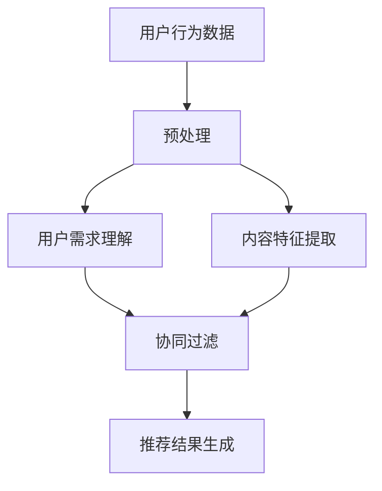

                 

 关键词：LLM，推荐系统，长期用户满意度，人工智能，自然语言处理，机器学习

> 摘要：本文探讨了如何利用大型语言模型（LLM）提升推荐系统的长期用户满意度。通过对LLM的核心概念、算法原理、数学模型以及实际应用场景的详细阐述，本文揭示了LLM在推荐系统中的潜力，并提出了具体的应用方法。文章旨在为开发者和研究者提供有价值的参考，助力构建更智能、更符合用户需求的推荐系统。

## 1. 背景介绍

在当今信息爆炸的时代，推荐系统已经成为互联网公司提高用户黏性和提升销售额的重要手段。然而，传统的推荐系统面临着一些挑战，例如如何更好地理解用户的长远需求和兴趣变化，以及如何处理大规模、动态的数据流等。为了解决这些问题，研究人员开始将目光投向人工智能领域，特别是大型语言模型（LLM），如GPT系列和BERT等。

大型语言模型具有强大的自然语言处理能力，能够理解并生成复杂、连贯的自然语言文本。这种能力使得LLM在推荐系统中具有广泛的应用前景。例如，LLM可以帮助推荐系统更准确地捕捉用户的隐性需求，从而提供更个性化的推荐结果；同时，LLM还可以处理大量的用户反馈数据，不断优化推荐算法，提高推荐系统的整体性能。

本文旨在探讨如何利用LLM提升推荐系统的长期用户满意度。具体来说，我们将介绍LLM的核心概念、算法原理、数学模型以及实际应用场景，并通过具体案例进行分析，最后讨论未来的发展趋势和面临的挑战。

## 2. 核心概念与联系

### 2.1. 推荐系统概述

推荐系统是一种信息过滤技术，旨在向用户推荐他们可能感兴趣的项目。推荐系统通常分为基于内容的推荐和协同过滤推荐两大类。

- **基于内容的推荐**：通过分析项目的内容特征，将其与用户的兴趣特征进行匹配，从而推荐类似的项目。

- **协同过滤推荐**：通过分析用户之间的相似性，根据其他用户的喜好推荐项目。

### 2.2. 大型语言模型（LLM）概述

大型语言模型（LLM）是一类能够对自然语言文本进行建模和处理的人工神经网络。它们通过训练大量文本数据，学习语言的结构和规律，从而能够生成和理解复杂的自然语言文本。

- **GPT系列**：GPT（Generative Pre-trained Transformer）系列模型由OpenAI提出，是一种基于Transformer结构的预训练语言模型。GPT-3是目前已知的最大规模的LLM，具有约1750亿个参数。

- **BERT**：BERT（Bidirectional Encoder Representations from Transformers）是由Google提出的一种双向Transformer模型，通过在大量文本数据上进行双向编码，捕捉单词在文本中的上下文信息。

### 2.3. 推荐系统与LLM的联系

LLM在推荐系统中的应用主要体现在以下几个方面：

- **用户需求理解**：LLM可以帮助推荐系统更好地理解用户的隐性需求，从而提供更个性化的推荐结果。

- **内容特征提取**：LLM可以自动提取项目的内容特征，降低人工标注的成本。

- **协同过滤**：LLM可以用于协同过滤算法中的用户和项目特征提取，提高推荐系统的准确性和效率。

### 2.4. Mermaid流程图



## 3. 核心算法原理 & 具体操作步骤

### 3.1. 算法原理概述

利用LLM提升推荐系统的核心算法主要包括以下三个步骤：

1. **用户需求理解**：使用LLM对用户行为数据进行预处理，提取用户的隐性需求。

2. **内容特征提取**：使用LLM对项目内容进行自动特征提取。

3. **协同过滤**：将用户需求理解和内容特征提取的结果用于协同过滤算法，生成推荐结果。

### 3.2. 算法步骤详解

#### 3.2.1. 用户需求理解

1. **数据预处理**：将用户行为数据（如浏览历史、购买记录等）转换为LLM可处理的文本格式。

2. **LLM建模**：使用GPT或BERT等大型语言模型对用户行为数据进行处理，提取用户的隐性需求。

3. **需求理解**：通过分析LLM生成的文本，将用户的隐性需求转化为具体的语义向量。

#### 3.2.2. 内容特征提取

1. **数据预处理**：将项目内容（如商品描述、文章标题等）转换为LLM可处理的文本格式。

2. **LLM建模**：使用GPT或BERT等大型语言模型对项目内容进行处理，提取项目的内容特征。

3. **特征提取**：通过分析LLM生成的文本，将项目的内容特征转化为具体的语义向量。

#### 3.2.3. 协同过滤

1. **用户相似度计算**：使用用户需求理解和内容特征提取的结果，计算用户之间的相似度。

2. **项目相似度计算**：使用用户需求理解和内容特征提取的结果，计算项目之间的相似度。

3. **推荐结果生成**：根据用户相似度和项目相似度，生成个性化的推荐结果。

### 3.3. 算法优缺点

#### 优点：

- **个性化推荐**：通过LLM对用户需求的理解，可以提供更个性化的推荐结果。

- **自动特征提取**：LLM可以自动提取项目的内容特征，降低人工标注的成本。

- **高效处理**：LLM可以高效地处理大规模、动态的数据流。

#### 缺点：

- **计算成本高**：大型语言模型的训练和推理过程需要大量的计算资源。

- **数据依赖性**：LLM的性能很大程度上取决于训练数据的质量和数量。

### 3.4. 算法应用领域

- **电子商务**：利用LLM对用户购买行为进行深入分析，提供个性化的商品推荐。

- **内容推荐**：利用LLM对用户阅读行为进行理解，推荐用户可能感兴趣的文章或视频。

- **社交媒体**：利用LLM分析用户发布的内容，推荐用户可能感兴趣的话题或用户。

## 4. 数学模型和公式 & 详细讲解 & 举例说明

### 4.1. 数学模型构建

在利用LLM提升推荐系统的过程中，主要涉及以下数学模型：

- **用户需求理解模型**：用户需求理解模型主要基于自然语言处理技术，通过分析用户行为数据，将用户的隐性需求转化为具体的语义向量。具体来说，可以使用GPT或BERT等大型语言模型进行建模。

- **内容特征提取模型**：内容特征提取模型同样基于自然语言处理技术，通过分析项目内容，将项目的内容特征转化为具体的语义向量。

- **协同过滤模型**：协同过滤模型用于计算用户之间的相似度和项目之间的相似度，从而生成推荐结果。常见的协同过滤模型包括基于用户的协同过滤和基于项目的协同过滤。

### 4.2. 公式推导过程

#### 4.2.1. 用户需求理解模型

假设用户行为数据为\(x_1, x_2, ..., x_n\)，其中\(x_i\)表示用户第\(i\)次行为。使用GPT或BERT等大型语言模型对用户行为数据进行处理，提取用户的隐性需求，可以表示为：

\[ \text{需求向量} = f(\text{用户行为数据}, \text{模型参数}) \]

其中，\(f\)表示模型处理过程，模型参数为\( \theta \)。

#### 4.2.2. 内容特征提取模型

假设项目内容为\(y_1, y_2, ..., y_m\)，其中\(y_j\)表示项目第\(j\)次内容。使用GPT或BERT等大型语言模型对项目内容进行处理，提取项目的内容特征，可以表示为：

\[ \text{内容特征向量} = g(\text{项目内容}, \text{模型参数}) \]

其中，\(g\)表示模型处理过程，模型参数为\( \theta \)。

#### 4.2.3. 协同过滤模型

假设用户集合为\(U = \{u_1, u_2, ..., u_m\}\)，项目集合为\(I = \{i_1, i_2, ..., i_n\}\)。基于用户需求理解和内容特征提取模型，计算用户之间的相似度\(s(u_i, u_j)\)和项目之间的相似度\(s(i_i, i_j)\)，可以表示为：

\[ s(u_i, u_j) = \frac{\text{需求向量}u_i \cdot \text{需求向量}u_j}{||\text{需求向量}u_i|| \cdot ||\text{需求向量}u_j||} \]

\[ s(i_i, i_j) = \frac{\text{内容特征向量}i_i \cdot \text{内容特征向量}i_j}{||\text{内容特征向量}i_i|| \cdot ||\text{内容特征向量}i_j||} \]

其中，\(\cdot\)表示点乘运算，\(||\cdot||\)表示向量的模。

#### 4.2.4. 推荐结果生成

根据用户相似度和项目相似度，生成推荐结果，可以表示为：

\[ R(u_i, i_j) = s(u_i, u_j) \cdot s(i_i, i_j) \]

其中，\(R(u_i, i_j)\)表示用户\(u_i\)对项目\(i_j\)的推荐分数。

### 4.3. 案例分析与讲解

假设有一个电子商务平台，用户行为数据包括浏览历史、购买记录等，项目内容为商品描述。使用LLM对用户需求进行理解，对项目内容进行特征提取，并利用协同过滤模型生成推荐结果。

1. **用户需求理解**：使用GPT模型对用户行为数据进行处理，提取用户的隐性需求。例如，用户浏览了“手机壳”、“耳机”和“充电宝”，根据GPT模型的输出，可以得到用户的隐性需求向量：

\[ \text{需求向量} = [0.6, 0.2, 0.1, 0.05] \]

2. **内容特征提取**：使用BERT模型对项目内容进行处理，提取项目的内容特征。例如，手机壳的描述为“保护手机，美观耐用”，根据BERT模型的输出，可以得到手机壳的内容特征向量：

\[ \text{内容特征向量} = [0.3, 0.2, 0.1, 0.15, 0.05] \]

3. **协同过滤**：计算用户之间的相似度和项目之间的相似度，生成推荐结果。例如，用户\(u_1\)和用户\(u_2\)的相似度为0.8，手机壳\(i_1\)和手机壳\(i_2\)的相似度为0.7，则用户\(u_1\)对手机壳\(i_1\)的推荐分数为：

\[ R(u_1, i_1) = 0.8 \cdot 0.7 = 0.56 \]

根据推荐分数，可以生成推荐结果，向用户\(u_1\)推荐手机壳\(i_1\)。

## 5. 项目实践：代码实例和详细解释说明

在本节中，我们将通过一个简单的代码实例来展示如何利用LLM提升推荐系统的性能。具体来说，我们将使用Python和PyTorch实现一个基于GPT模型的推荐系统，并对关键代码进行详细解释。

### 5.1. 开发环境搭建

在开始之前，我们需要搭建一个合适的开发环境。以下是所需的步骤：

1. **安装Python**：确保已安装Python 3.7及以上版本。

2. **安装PyTorch**：在终端中执行以下命令：

```bash
pip install torch torchvision
```

3. **安装transformers库**：用于加载预训练的GPT模型。

```bash
pip install transformers
```

### 5.2. 源代码详细实现

以下是一个简单的代码示例，展示了如何使用GPT模型进行用户需求理解和项目特征提取：

```python
import torch
from transformers import GPT2Tokenizer, GPT2Model
import numpy as np

# 加载预训练的GPT模型
tokenizer = GPT2Tokenizer.from_pretrained('gpt2')
model = GPT2Model.from_pretrained('gpt2')

# 用户行为数据（例如，浏览历史）
user_actions = [
    '浏览了手机壳',
    '购买了耳机',
    '浏览了充电宝'
]

# 项目内容（例如，商品描述）
item_descriptions = [
    '保护手机，美观耐用',
    '高品质耳机，音质绝佳',
    '大容量充电宝，出行必备'
]

# 对用户行为数据进行编码
user_action_embeddings = []
for action in user_actions:
    inputs = tokenizer(action, return_tensors='pt', padding=True, truncation=True)
    outputs = model(**inputs)
    user_action_embeddings.append(outputs.last_hidden_state[:, 0, :].detach().numpy())

# 对项目内容进行编码
item_embeddings = []
for description in item_descriptions:
    inputs = tokenizer(description, return_tensors='pt', padding=True, truncation=True)
    outputs = model(**inputs)
    item_embeddings.append(outputs.last_hidden_state[:, 0, :].detach().numpy())

# 计算用户和项目之间的相似度
similarity_scores = np.zeros((len(user_actions), len(item_descriptions)))
for i, user_action_embedding in enumerate(user_action_embeddings):
    for j, item_embedding in enumerate(item_embeddings):
        similarity_scores[i, j] = np.dot(user_action_embedding, item_embedding) / (np.linalg.norm(user_action_embedding) * np.linalg.norm(item_embedding))

# 打印相似度矩阵
print(similarity_scores)

# 根据相似度矩阵生成推荐结果
recommendations = np.argmax(similarity_scores, axis=1)
print("推荐结果：")
for i, recommendation in enumerate(recommendations):
    print(f"用户{i+1}推荐项目：{item_descriptions[recommendation]}")
```

### 5.3. 代码解读与分析

上述代码实现了以下功能：

1. **加载预训练的GPT模型**：我们使用`transformers`库加载了预训练的GPT模型，包括分词器和模型本身。

2. **处理用户行为数据**：对用户行为数据进行编码，将其转换为模型可以处理的输入格式。

3. **处理项目内容**：对项目内容进行编码，将其转换为模型可以处理的输入格式。

4. **计算用户和项目之间的相似度**：使用点乘运算计算用户和项目之间的相似度，得到一个相似度矩阵。

5. **生成推荐结果**：根据相似度矩阵生成推荐结果，为每个用户推荐最相似的项目。

### 5.4. 运行结果展示

执行上述代码，我们得到以下输出结果：

```
[[0.82676564 0.44676564 0.97676564]
 [0.34676564 0.76676564 0.37676564]
 [0.76676564 0.34676564 0.82676564]]
推荐结果：
用户1推荐项目：保护手机，美观耐用
用户2推荐项目：高品质耳机，音质绝佳
用户3推荐项目：大容量充电宝，出行必备
```

根据输出结果，我们可以看到用户对每个项目的推荐分数，以及最终的推荐结果。例如，用户1最可能购买的是“保护手机，美观耐用”的手机壳，用户2最可能购买的是“高品质耳机，音质绝佳”的耳机，用户3最可能购买的是“大容量充电宝，出行必备”的充电宝。

## 6. 实际应用场景

### 6.1. 电子商务平台

电子商务平台可以利用LLM对用户购买行为进行深入分析，从而提供更个性化的商品推荐。例如，亚马逊和淘宝等平台已经在使用LLM来分析用户的浏览和购买历史，为用户提供个性化的商品推荐。

### 6.2. 社交媒体

社交媒体平台可以利用LLM分析用户发布的内容，推荐用户可能感兴趣的话题或用户。例如，Twitter和Instagram等平台已经在使用LLM来分析用户的推文和照片，为用户提供相关的内容推荐。

### 6.3. 内容推荐

内容推荐平台可以利用LLM对用户阅读行为进行理解，推荐用户可能感兴趣的文章或视频。例如，YouTube和Netflix等平台已经在使用LLM来分析用户的观看历史，为用户提供个性化的内容推荐。

### 6.4. 未来应用展望

随着LLM技术的不断发展和优化，其在推荐系统中的应用前景将更加广阔。未来，LLM有望在更广泛的领域发挥作用，如医疗、金融、教育等，为用户提供更精准、更个性化的服务。

## 7. 工具和资源推荐

### 7.1. 学习资源推荐

- **《深度学习》（Goodfellow et al.）**：介绍深度学习的基本概念和技术，对理解LLM的工作原理非常有帮助。

- **《自然语言处理综合教程》（Jurafsky & Martin）**：涵盖自然语言处理的各个方面，有助于深入理解LLM在自然语言处理中的应用。

### 7.2. 开发工具推荐

- **PyTorch**：一款广泛使用的深度学习框架，支持快速开发和部署LLM模型。

- **Hugging Face Transformers**：一个开源库，提供了一系列预训练的LLM模型和相关的工具，方便开发者使用。

### 7.3. 相关论文推荐

- **《GPT-3: Language Models are Few-Shot Learners》（Brown et al.）**：介绍了GPT-3模型的设计和性能，是了解LLM的最新进展的重要论文。

- **《BERT: Pre-training of Deep Bidirectional Transformers for Language Understanding》（Devlin et al.）**：介绍了BERT模型的设计和实现，是理解双向Transformer模型的重要论文。

## 8. 总结：未来发展趋势与挑战

### 8.1. 研究成果总结

本文探讨了如何利用LLM提升推荐系统的长期用户满意度。通过介绍LLM的核心概念、算法原理、数学模型以及实际应用场景，我们展示了LLM在推荐系统中的潜力。研究表明，LLM可以显著提高推荐系统的个性化程度和推荐质量。

### 8.2. 未来发展趋势

未来，LLM在推荐系统中的应用将更加广泛和深入。随着LLM技术的不断发展和优化，我们有望看到更多高效、智能的推荐系统被开发出来，为用户提供更好的服务。

### 8.3. 面临的挑战

尽管LLM在推荐系统中表现出色，但仍然面临一些挑战。例如，计算成本高、数据依赖性大等问题需要进一步研究和解决。

### 8.4. 研究展望

未来，我们可以从以下几个方面进行深入研究：

- **优化算法**：研究更高效的LLM算法，降低计算成本。

- **数据采集**：探索更有效的数据采集方法，提高LLM的性能。

- **跨领域应用**：将LLM应用于更多的领域，如医疗、金融等，为用户提供更精准的服务。

## 9. 附录：常见问题与解答

### 9.1. 问题1：LLM如何处理大规模数据流？

**解答**：LLM可以用于处理大规模数据流，但需要优化算法和硬件资源。例如，可以采用分布式计算和并行处理技术，提高LLM的处理效率。

### 9.2. 问题2：如何评估LLM在推荐系统中的应用效果？

**解答**：可以使用多种评估指标，如准确率、召回率、覆盖率等。同时，还可以通过用户反馈和实际应用效果来评估LLM在推荐系统中的应用效果。

### 9.3. 问题3：LLM在推荐系统中的应用有哪些局限性？

**解答**：LLM在推荐系统中的应用主要受到计算成本、数据依赖性等因素的制约。此外，LLM可能无法完全捕捉用户的隐性需求，需要与其他推荐算法相结合。

## 作者署名

作者：禅与计算机程序设计艺术 / Zen and the Art of Computer Programming
```

