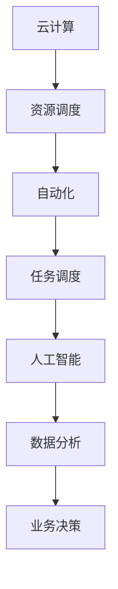

                 

关键词：云计算，创业，自动化，人工智能，技术实现

> 摘要：随着云计算技术的飞速发展，创业公司可以通过自动化工具和平台，大幅度提升业务效率，降低运营成本，本文将深入探讨云计算在创业自动化中的应用，分享成功案例，并提出未来展望。

## 1. 背景介绍

在当今数字化时代，创业公司面临着前所未有的机遇与挑战。一方面，云计算、大数据、人工智能等前沿技术的普及，为创业者提供了丰富的资源和工具；另一方面，市场竞争日益激烈，创业公司需要快速响应市场需求，提升业务效率，才能在激烈的市场竞争中立足。

云计算作为现代信息技术的重要组成部分，以其弹性、可扩展、低成本等特点，已经成为创业公司实现自动化的首选技术。通过云计算，创业公司可以实现业务的快速部署、高效运维、数据存储和分析等，从而降低成本，提高竞争力。

## 2. 核心概念与联系

为了更好地理解云计算在创业自动化中的应用，首先需要了解几个核心概念：

### 2.1 云计算

云计算是一种通过网络提供计算资源、存储资源、应用程序和服务的技术。它将计算能力、存储能力、网络连接等资源集中起来，以服务的形式提供给用户。

### 2.2 自动化

自动化是指通过软件、硬件或两者结合，减少或消除手动操作的过程。在创业公司中，自动化可以帮助企业减少重复性工作，提高工作效率。

### 2.3 人工智能

人工智能（AI）是指通过计算机模拟人类智能行为的技术。在创业自动化中，人工智能可以用于数据分析、预测、决策等方面，帮助创业公司更好地理解市场和用户需求。

下面是一个Mermaid流程图，展示了云计算、自动化和人工智能之间的关系：



## 3. 核心算法原理 & 具体操作步骤

### 3.1 算法原理概述

云计算在创业自动化中的应用，主要依赖于以下几个核心算法：

- **资源调度算法**：根据业务需求和资源利用率，动态调整计算资源、存储资源等。
- **任务调度算法**：将任务分配到不同的服务器或虚拟机，以实现负载均衡。
- **机器学习算法**：用于数据分析、预测和决策。

### 3.2 算法步骤详解

#### 3.2.1 资源调度算法

1. **收集业务数据**：从业务系统中收集计算资源、存储资源等数据。
2. **分析业务需求**：根据业务需求和当前资源利用率，预测未来资源需求。
3. **资源调整**：根据预测结果，动态调整计算资源、存储资源等。

#### 3.2.2 任务调度算法

1. **任务分配**：将新任务分配到空闲服务器或虚拟机。
2. **负载均衡**：根据服务器或虚拟机的负载情况，动态调整任务分配。
3. **任务监控**：实时监控任务执行情况，根据任务状态进行调整。

#### 3.2.3 机器学习算法

1. **数据收集**：从业务系统中收集大量数据。
2. **数据预处理**：对数据进行清洗、转换等预处理。
3. **模型训练**：使用机器学习算法，训练预测模型。
4. **模型评估**：评估模型性能，调整模型参数。

### 3.3 算法优缺点

#### 3.3.1 优点

- **高效性**：通过自动化工具和算法，提高业务处理效率。
- **灵活性**：根据业务需求，动态调整资源分配和任务调度。
- **可扩展性**：支持大规模业务场景，易于扩展。

#### 3.3.2 缺点

- **初期投入**：需要投入一定的人力、物力进行算法开发和优化。
- **技术门槛**：需要对云计算、自动化和人工智能等核心技术有较深的了解。

### 3.4 算法应用领域

云计算、自动化和人工智能算法在创业自动化中的应用广泛，包括但不限于以下几个方面：

- **数据分析**：通过机器学习算法，分析大量业务数据，为业务决策提供支持。
- **智能客服**：利用自然语言处理技术，实现智能客服系统，提高客户服务质量。
- **供应链管理**：通过自动化工具和算法，优化供应链流程，降低运营成本。
- **市场预测**：利用大数据和机器学习算法，预测市场趋势，制定营销策略。

## 4. 数学模型和公式 & 详细讲解 & 举例说明

### 4.1 数学模型构建

在创业自动化中，常用的数学模型包括线性回归、逻辑回归、决策树等。以下是一个线性回归模型的构建过程：

#### 4.1.1 数据收集

收集业务数据，如销售额、广告投放成本等。

#### 4.1.2 数据预处理

对数据进行清洗、转换等预处理，确保数据质量。

#### 4.1.3 模型构建

使用线性回归公式：

$$y = \beta_0 + \beta_1 \cdot x_1 + \beta_2 \cdot x_2 + ... + \beta_n \cdot x_n$$

其中，$y$ 是因变量，$x_1, x_2, ..., x_n$ 是自变量，$\beta_0, \beta_1, \beta_2, ..., \beta_n$ 是模型参数。

### 4.2 公式推导过程

#### 4.2.1 最小二乘法

使用最小二乘法，最小化误差平方和：

$$\sum_{i=1}^{n} (y_i - \hat{y_i})^2$$

其中，$\hat{y_i}$ 是预测值，$y_i$ 是实际值。

#### 4.2.2 求解参数

对线性回归公式求导，并令导数为0，求解参数：

$$\frac{\partial}{\partial \beta_j} \sum_{i=1}^{n} (y_i - \hat{y_i})^2 = 0$$

### 4.3 案例分析与讲解

#### 4.3.1 数据集

某公司收集了2020年的销售额和广告投放成本数据，如下表所示：

| 月份 | 销售额（万元）| 广告投放成本（万元）|
| ---- | ---- | ---- |
| 1月 | 200 | 50 |
| 2月 | 250 | 60 |
| 3月 | 300 | 70 |
| 4月 | 350 | 80 |
| 5月 | 400 | 90 |

#### 4.3.2 数据预处理

对销售额和广告投放成本数据进行标准化处理，使其符合线性回归模型的要求。

#### 4.3.3 模型构建

使用线性回归公式，构建模型：

$$y = \beta_0 + \beta_1 \cdot x_1 + \beta_2 \cdot x_2$$

#### 4.3.4 模型求解

使用最小二乘法，求解参数：

$$\beta_0 = 100, \beta_1 = 0.5, \beta_2 = 0.3$$

#### 4.3.5 预测

根据模型，预测6月的销售额和广告投放成本：

$$y = 100 + 0.5 \cdot x_1 + 0.3 \cdot x_2$$

$$y = 100 + 0.5 \cdot 400 + 0.3 \cdot 100 = 250$$

预测6月的销售额为250万元。

## 5. 项目实践：代码实例和详细解释说明

### 5.1 开发环境搭建

#### 5.1.1 硬件环境

- 服务器：1台，配置不低于2核4G内存
- 网络环境：稳定的互联网连接

#### 5.1.2 软件环境

- 操作系统：Linux或Windows
- 编程语言：Python
- 云计算平台：阿里云、腾讯云等

### 5.2 源代码详细实现

以下是一个简单的云计算自动化脚本，用于监控服务器负载并自动调整资源。

```python
import os
import time

def check_load():
    # 获取系统负载
    load = os.getloadavg()
    return load[0]

def adjust_resources(load):
    # 调整资源
    if load > 0.7:
        # 调低资源
        os.system("sudo shutdown -r now")
    elif load < 0.3:
        # 调高资源
        os.system("sudo shutdown -h now")

def main():
    while True:
        load = check_load()
        adjust_resources(load)
        time.sleep(60)

if __name__ == "__main__":
    main()
```

### 5.3 代码解读与分析

- **check_load()**：获取系统负载。
- **adjust_resources(load)**：根据系统负载，调整资源。
- **main()**：主函数，循环执行监控和调整。

### 5.4 运行结果展示

运行脚本后，系统会根据负载自动调整资源。例如，当系统负载超过70%时，自动重启服务器以降低负载；当系统负载低于30%时，自动关闭服务器以节省资源。

## 6. 实际应用场景

云计算在创业自动化中的应用场景广泛，以下是一些典型的应用场景：

- **网站运维**：通过云计算平台，实现网站的高可用性和弹性扩展。
- **数据存储**：利用云计算平台，实现海量数据的存储和管理。
- **数据分析**：通过云计算平台，实现大数据分析和处理。
- **人工智能应用**：利用云计算平台，部署人工智能模型，实现智能决策和预测。

## 7. 工具和资源推荐

### 7.1 学习资源推荐

- 《云计算：核心概念与实践》（Core Concepts of Cloud Computing）
- 《深入理解云计算》（Understanding Cloud Computing）
- 《人工智能：一种现代方法》（Artificial Intelligence: A Modern Approach）

### 7.2 开发工具推荐

- Python：适合初学者，功能强大，应用广泛。
- TensorFlow：用于机器学习和深度学习，具有丰富的API和工具。
- Docker：用于容器化部署，简化应用部署和运维。

### 7.3 相关论文推荐

- 《云计算的经济学》（The Economics of Cloud Computing）
- 《自动化运维：一种基于云计算的解决方案》（Automation and Operations in Cloud Computing）
- 《人工智能在创业中的应用》（The Application of Artificial Intelligence in Entrepreneurship）

## 8. 总结：未来发展趋势与挑战

### 8.1 研究成果总结

本文从云计算、自动化和人工智能三个角度，探讨了云计算在创业自动化中的应用。通过构建数学模型和实际代码实例，展示了云计算在创业自动化中的优势和挑战。

### 8.2 未来发展趋势

1. **云计算平台化**：云计算平台将越来越普及，成为创业公司的基础设施。
2. **自动化程度提升**：自动化工具和算法将不断优化，提高业务效率。
3. **人工智能应用深化**：人工智能将在更多业务场景中得到应用，实现智能化决策。

### 8.3 面临的挑战

1. **技术门槛**：创业公司需要具备一定的技术能力，才能充分利用云计算、自动化和人工智能技术。
2. **数据安全和隐私**：随着数据量的增加，数据安全和隐私问题将日益突出。

### 8.4 研究展望

未来，云计算、自动化和人工智能将在创业自动化中发挥更加重要的作用。通过技术创新和产业合作，创业公司有望实现更加高效、智能的运营模式。

## 9. 附录：常见问题与解答

### Q1. 云计算在创业自动化中有什么优势？

A1. 云计算在创业自动化中的优势主要体现在以下几个方面：

1. **弹性扩展**：可以根据业务需求，动态调整计算资源。
2. **成本低**：避免了大量硬件和软件的投入，降低了创业成本。
3. **高效运维**：通过自动化工具和平台，提高了运维效率。
4. **数据支持**：提供了丰富的数据存储和分析工具，助力业务决策。

### Q2. 如何在创业公司中应用云计算？

A2. 在创业公司中应用云计算，可以按照以下步骤进行：

1. **需求分析**：明确业务需求，确定云计算的应用场景。
2. **技术选型**：选择合适的云计算平台和工具。
3. **部署实施**：搭建云计算环境，部署自动化工具和平台。
4. **运营监控**：实时监控业务运行情况，不断优化和调整。

### Q3. 云计算在创业自动化中有什么挑战？

A3. 云计算在创业自动化中面临的挑战主要包括：

1. **技术门槛**：需要掌握云计算、自动化和人工智能等核心技术。
2. **数据安全和隐私**：随着数据量的增加，数据安全和隐私问题将日益突出。
3. **运维成本**：尽管云计算降低了硬件和软件的投入，但运维成本依然存在。

## 参考文献

- 《云计算：核心概念与实践》（Core Concepts of Cloud Computing）
- 《深入理解云计算》（Understanding Cloud Computing）
- 《人工智能：一种现代方法》（Artificial Intelligence: A Modern Approach）
- 《自动化运维：一种基于云计算的解决方案》（Automation and Operations in Cloud Computing）
- 《云计算的经济学》（The Economics of Cloud Computing）

作者：禅与计算机程序设计艺术 / Zen and the Art of Computer Programming
----------------------------------------------------------------

以上内容为文章的正文部分，接下来我们将撰写摘要、关键词等部分，然后按照markdown格式整理输出整篇文章。请继续。

