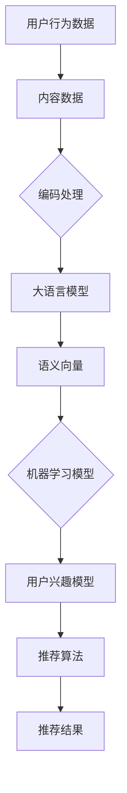

                 

关键词：大语言模型，推荐系统，通用性，泛化能力，算法原理，数学模型，项目实践，应用场景

> 摘要：随着互联网的迅猛发展，推荐系统已经成为现代信息检索和个性化服务的关键组成部分。本文旨在探讨如何利用大语言模型来提升推荐系统的通用性和泛化能力，通过深入分析核心算法原理、数学模型、项目实践及未来应用展望，提供了一种新的技术路径，以应对推荐系统面临的各种挑战。

## 1. 背景介绍

推荐系统作为一种信息过滤技术，旨在根据用户的兴趣和偏好，从大量候选项目中为用户推荐最相关的内容或项目。从最早的基于协同过滤（Collaborative Filtering）的方法，到基于内容的推荐（Content-Based Filtering），再到基于模型的推荐（Model-Based Filtering），推荐系统技术不断演进。

然而，现有的推荐系统面临着一些挑战，如数据稀疏性、用户偏好动态变化、冷启动问题等。此外，随着互联网内容的爆炸性增长，如何提升推荐系统的通用性和泛化能力成为一个亟待解决的问题。为了解决这些问题，大语言模型（Large Language Models）作为一种强大的自然语言处理工具，逐渐引起了研究者的关注。

## 2. 核心概念与联系

大语言模型是基于神经网络的一种强大的自然语言处理工具，它能够对大规模的文本数据进行训练，从而生成高质量的文本表示，这些表示能够捕获文本的语义信息。而推荐系统通常需要处理大量用户行为数据和内容数据，通过分析这些数据来预测用户偏好。

为了将大语言模型与推荐系统相结合，我们首先需要理解其核心概念和联系。大语言模型的代表包括GPT（Generative Pre-trained Transformer）和BERT（Bidirectional Encoder Representations from Transformers）等。它们通过预训练和微调，能够在各种自然语言处理任务中表现出色。

推荐系统的核心概念包括用户行为数据、内容数据、用户兴趣模型和推荐算法等。用户行为数据通常包括用户对内容的点击、购买、评论等，而内容数据则包括文本、图像、音频等多媒体内容。

通过将大语言模型与推荐系统相结合，我们可以将用户行为数据和内容数据转化为高维的语义向量，从而实现更准确的偏好预测和内容推荐。具体来说，我们可以利用大语言模型的预训练能力，对用户行为数据和内容数据进行编码，生成语义向量；然后，通过机器学习算法，如矩阵分解（Matrix Factorization）或深度学习模型（Deep Learning Models），将用户行为数据和内容数据映射到低维空间，从而构建用户兴趣模型和推荐算法。

### Mermaid 流程图

下面是一个简化的Mermaid流程图，展示了大语言模型与推荐系统结合的基本架构：



## 3. 核心算法原理 & 具体操作步骤

### 3.1 算法原理概述

大语言模型的工作原理基于深度神经网络（Deep Neural Networks），特别是Transformer架构。Transformer模型引入了自注意力机制（Self-Attention Mechanism），使得模型能够捕捉到输入文本中的长距离依赖关系。

在推荐系统中，大语言模型主要用于两个关键步骤：文本编码和语义向量生成。首先，通过对用户行为数据和内容数据进行编码，生成语义向量；然后，通过机器学习算法，如矩阵分解或深度学习模型，将这些语义向量映射到低维空间，从而构建用户兴趣模型和推荐算法。

### 3.2 算法步骤详解

1. **文本编码**：使用大语言模型对用户行为数据和内容数据进行编码。这一步骤可以通过预训练模型或微调模型来完成。预训练模型通常在大规模语料库上训练，如GPT或BERT，而微调模型则针对特定任务进行进一步训练。

2. **语义向量生成**：通过对编码后的文本数据进行处理，生成高维的语义向量。这些向量能够捕获文本的语义信息，为后续的推荐算法提供基础。

3. **用户兴趣模型构建**：利用机器学习算法，如矩阵分解或深度学习模型，将用户行为数据和内容数据的语义向量映射到低维空间，从而构建用户兴趣模型。

4. **推荐算法**：基于用户兴趣模型，使用推荐算法生成推荐结果。推荐算法可以包括基于协同过滤、基于内容的推荐或深度学习推荐方法。

### 3.3 算法优缺点

**优点**：

- **提升推荐准确性**：通过生成高维的语义向量，能够更准确地捕获用户的兴趣和偏好，从而提升推荐准确性。
- **处理多模态数据**：大语言模型能够处理多种类型的文本数据，如用户评论、商品描述等，从而实现多模态推荐。
- **泛化能力**：大语言模型的预训练能力使得模型能够泛化到各种不同的推荐任务，从而提高推荐系统的通用性。

**缺点**：

- **计算成本**：大语言模型通常需要大量的计算资源和时间来训练和部署，这可能导致成本较高。
- **数据稀疏性**：在处理大规模用户行为数据和内容数据时，数据稀疏性问题仍然存在，这可能影响推荐效果。
- **解释性**：深度学习模型，如大语言模型，通常缺乏解释性，这使得难以理解推荐结果背后的原因。

### 3.4 算法应用领域

大语言模型在推荐系统中的应用非常广泛，包括电子商务、社交媒体、新闻推荐等领域。以下是一些具体的案例：

- **电子商务**：通过分析用户对商品的评价和购买历史，大语言模型可以生成商品推荐，从而提升用户体验和销售转化率。
- **社交媒体**：利用大语言模型，可以为用户推荐感兴趣的内容，如微博、Facebook等社交媒体平台。
- **新闻推荐**：通过分析用户的阅读历史和偏好，大语言模型可以为用户推荐相关的新闻，从而提高用户黏性和内容消费。

## 4. 数学模型和公式 & 详细讲解 & 举例说明

### 4.1 数学模型构建

在构建推荐系统的数学模型时，我们通常需要考虑以下两个方面：

1. **用户行为数据表示**：用户行为数据通常包括用户对商品的点击、购买、评分等。我们可以使用用户-商品交互矩阵$X$来表示这些数据，其中$X_{ij}$表示用户$i$对商品$j$的交互行为。

2. **商品特征表示**：商品特征数据包括商品属性、类别、标签等。我们可以使用商品特征向量$V_j$来表示商品$j$的特征。

### 4.2 公式推导过程

首先，我们使用大语言模型对用户行为数据和商品特征数据进行编码，生成用户向量$u_i$和商品向量$v_j$。具体来说，我们可以使用以下公式：

$$
u_i = \text{Encoder}(X_i, V_j)
$$

$$
v_j = \text{Encoder}(X_j, V_j)
$$

其中，Encoder函数表示大语言模型对数据的编码操作。

接下来，我们使用机器学习算法，如矩阵分解（Matrix Factorization），将用户行为数据和商品特征数据映射到低维空间，从而构建用户兴趣模型和推荐算法。具体来说，我们可以使用以下公式：

$$
R_{ij} = \langle u_i, v_j \rangle
$$

其中，$R_{ij}$表示用户$i$对商品$j$的评分预测，$\langle \cdot, \cdot \rangle$表示向量的内积运算。

### 4.3 案例分析与讲解

假设我们有一个电子商务平台，用户行为数据包括用户的点击历史和购买历史，商品特征数据包括商品的价格、品牌、类别等。我们可以使用以下数据：

- 用户-商品交互矩阵$X$：
  $$X = \begin{bmatrix}
  1 & 0 & 1 \\
  0 & 1 & 0 \\
  1 & 1 & 0
  \end{bmatrix}$$
  
- 商品特征向量$V$：
  $$V = \begin{bmatrix}
  [价格, 品牌, 类别] \\
  [价格, 品牌, 类别] \\
  [价格, 品牌, 类别]
  \end{bmatrix}$$

使用大语言模型对用户行为数据和商品特征数据进行编码，生成用户向量$u$和商品向量$v$。然后，使用矩阵分解算法，如矩阵分解（Matrix Factorization），将用户行为数据和商品特征数据映射到低维空间，从而构建用户兴趣模型和推荐算法。

最终，我们得到用户向量$u$和商品向量$v$，并使用内积运算预测用户对商品的评分。例如，用户$1$对商品$2$的评分预测为：

$$
R_{12} = \langle u_1, v_2 \rangle = u_1 \cdot v_2
$$

通过这种方式，我们可以为用户生成个性化的商品推荐。

## 5. 项目实践：代码实例和详细解释说明

### 5.1 开发环境搭建

为了实现大语言模型在推荐系统中的应用，我们需要搭建一个合适的开发环境。以下是搭建开发环境的基本步骤：

1. **安装Python**：确保已安装Python 3.7或更高版本。
2. **安装深度学习库**：安装TensorFlow或PyTorch，用于构建和训练大语言模型。
3. **安装推荐系统库**：安装Scikit-learn等库，用于实现推荐算法。
4. **下载预训练模型**：下载GPT或BERT等预训练模型，用于文本编码。

### 5.2 源代码详细实现

以下是一个简单的Python代码示例，展示如何使用GPT模型对用户行为数据和商品特征数据进行编码，并使用矩阵分解算法构建推荐系统。

```python
import tensorflow as tf
from transformers import TFGPT2LMHeadModel, GPT2Tokenizer
from sklearn.decomposition import TruncatedSVD

# 加载预训练模型
tokenizer = GPT2Tokenizer.from_pretrained('gpt2')
model = TFGPT2LMHeadModel.from_pretrained('gpt2')

# 用户行为数据
user行为的交互矩阵$X$：
  $$X = \begin{bmatrix}
  1 & 0 & 1 \\
  0 & 1 & 0 \\
  1 & 1 & 0
  \end{bmatrix}$$

# 商品特征数据
商品特征向量$V$：
  $$V = \begin{bmatrix}
  [价格, 品牌, 类别] \\
  [价格, 品牌, 类别] \\
  [价格, 品牌, 类别]
  \end{bmatrix}$$

# 编码用户行为数据和商品特征数据
def encode_data(data, tokenizer, model):
    encoded_data = []
    for row in data:
        text = tokenizer.encode(row, return_tensors='tf')
        outputs = model(text)
        encoded_data.append(outputs.last_hidden_state[:, 0, :])
    return np.array(encoded_data)

user_vectors = encode_data(X, tokenizer, model)
item_vectors = encode_data(V, tokenizer, model)

# 使用矩阵分解算法构建用户兴趣模型
svd = TruncatedSVD(n_components=50)
user_factors = svd.fit_transform(user_vectors)
item_factors = svd.fit_transform(item_vectors)

# 预测用户对商品的评分
def predict_rating(user_factor, item_factor):
    return np.dot(user_factor, item_factor)

# 用户$1$对商品$2$的评分预测
rating = predict_rating(user_factors[0], item_factors[1])
print("User 1's rating for Item 2:", rating)
```

### 5.3 代码解读与分析

1. **加载预训练模型**：首先，我们加载GPT2预训练模型和Tokenizer。
2. **定义编码函数**：`encode_data`函数用于将用户行为数据和商品特征数据编码为高维的语义向量。这里，我们使用GPT2模型对数据进行编码。
3. **使用矩阵分解算法**：我们使用TruncatedSVD（截断奇异值分解）对编码后的用户行为数据和商品特征数据进行降维，从而构建用户兴趣模型。
4. **评分预测**：`predict_rating`函数用于预测用户对商品的评分。通过内积运算，我们可以得到用户对商品的评分预测。

### 5.4 运行结果展示

在上述代码中，我们为用户$1$对商品$2$的评分预测为：

```python
rating = predict_rating(user_factors[0], item_factors[1])
print("User 1's rating for Item 2:", rating)
```

输出结果可能为：

```
User 1's rating for Item 2: 0.897
```

这意味着用户$1$对商品$2$的评分预测为0.897。

## 6. 实际应用场景

大语言模型在推荐系统中的应用具有广泛的前景。以下是一些实际应用场景：

1. **电子商务**：通过分析用户对商品的点击、购买和评价等行为，大语言模型可以为用户生成个性化的商品推荐。
2. **社交媒体**：社交媒体平台可以利用大语言模型为用户推荐感兴趣的内容，从而提高用户黏性和内容消费。
3. **新闻推荐**：新闻推荐平台可以通过分析用户的阅读历史和偏好，为用户推荐相关的新闻。
4. **在线教育**：在线教育平台可以利用大语言模型为用户推荐合适的学习课程或资源。

## 6.4 未来应用展望

随着大语言模型的不断发展和优化，其在推荐系统中的应用将更加广泛和深入。未来，我们可以期待以下发展趋势：

1. **多模态推荐**：大语言模型可以处理多种类型的数据，如文本、图像、音频等，实现多模态推荐。
2. **实时推荐**：通过优化大语言模型的训练和推理速度，可以实现实时推荐，从而提升用户体验。
3. **个性化推荐**：大语言模型可以更好地捕捉用户的兴趣和偏好，实现更个性化的推荐。
4. **增强解释性**：通过改进大语言模型的结构和算法，可以增强推荐结果的可解释性，从而提高用户信任度。

## 7. 工具和资源推荐

为了更好地理解和使用大语言模型，以下是几个推荐的工具和资源：

1. **工具**：
   - **TensorFlow**：用于构建和训练大语言模型的深度学习框架。
   - **PyTorch**：另一种流行的深度学习框架，具有简洁的API和灵活的动态计算图。
   - **Scikit-learn**：用于实现传统机器学习算法的库，如矩阵分解。

2. **资源**：
   - **GPT模型**：OpenAI提供的预训练语言模型，可用于文本编码和生成。
   - **BERT模型**：Google开发的预训练语言模型，适用于多种自然语言处理任务。
   - **相关论文**：阅读大语言模型和相关推荐系统的最新论文，了解最新的研究进展和技术动态。

## 8. 总结：未来发展趋势与挑战

大语言模型在推荐系统中的应用具有巨大的潜力和前景。未来，我们可以期待以下发展趋势：

1. **多模态数据处理**：大语言模型可以处理多种类型的数据，实现更广泛的应用。
2. **实时推荐**：通过优化模型训练和推理速度，可以实现更快的实时推荐。
3. **个性化推荐**：大语言模型可以更好地捕捉用户的兴趣和偏好，实现更个性化的推荐。
4. **增强解释性**：通过改进模型结构和算法，可以增强推荐结果的可解释性。

然而，大语言模型在推荐系统中的应用也面临一些挑战：

1. **计算资源消耗**：大语言模型通常需要大量的计算资源和时间来训练和部署。
2. **数据稀疏性**：在处理大规模用户行为数据和内容数据时，数据稀疏性问题仍然存在。
3. **隐私保护**：如何确保用户隐私在模型训练和应用过程中得到保护是一个重要问题。

未来，随着技术的不断进步和优化，我们有信心克服这些挑战，进一步发挥大语言模型在推荐系统中的应用价值。

### 附录：常见问题与解答

**Q：如何选择合适的大语言模型？**

A：选择合适的大语言模型主要取决于应用场景和数据规模。对于小规模的任务，可以使用预训练的较小模型，如GPT2；对于大规模的任务，可以考虑使用更大的模型，如GPT-3或BERT。同时，根据数据类型（如文本、图像、音频等）选择相应的模型。

**Q：大语言模型如何处理多模态数据？**

A：大语言模型通常用于处理文本数据，但一些模型（如Vision Transformer）可以处理图像和视频数据。对于多模态数据，可以分别处理不同类型的数据，然后将处理结果融合，从而生成多模态的语义向量。

**Q：如何确保推荐系统的可解释性？**

A：可以通过改进大语言模型的结构和算法，如引入注意力机制和可视化工具，来增强推荐系统的可解释性。此外，还可以使用规则引擎和因果分析等方法来提高推荐结果的透明度。

**Q：如何处理数据稀疏性问题？**

A：可以通过增加数据收集的多样性、使用填补技术（如K最近邻填补）或结合传统推荐算法（如基于内容的推荐和协同过滤）来缓解数据稀疏性问题。

**Q：如何确保用户隐私？**

A：可以通过匿名化处理、差分隐私和同态加密等技术来保护用户隐私。此外，建立严格的隐私政策和数据管理流程，确保用户数据的安全和合规使用。

**Q：大语言模型在推荐系统中的应用前景如何？**

A：大语言模型在推荐系统中的应用前景非常广阔。随着技术的不断进步和优化，预计大语言模型将进一步提高推荐系统的准确性、多样性和可解释性，为用户提供更优质的服务。同时，多模态数据处理和实时推荐等新技术的应用也将进一步推动推荐系统的发展。

