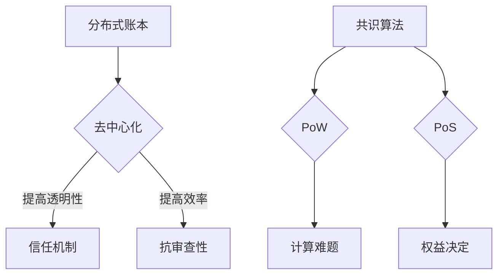
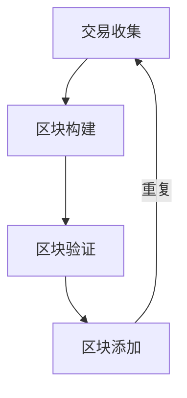

                 

区块链技术作为一种分布式账本技术，以其去中心化、安全透明等特性，正逐渐成为金融科技领域的重要创新力量。本文将探讨如何利用技术优势进行区块链创新，重点涵盖核心概念、算法原理、数学模型以及实际应用场景。通过深入分析，我们将为读者提供一个全面的技术视角，帮助理解区块链技术的潜力和未来发展方向。

## 文章关键词

- 区块链
- 分布式账本
- 去中心化
- 共识算法
- 智能合约
- 数学模型
- 实际应用场景

## 文章摘要

本文旨在探讨区块链技术的技术优势及其在金融科技领域中的应用。首先，我们将介绍区块链的基础概念，包括分布式账本、去中心化、共识算法等。接着，文章将深入剖析区块链的核心算法原理，并通过数学模型进行详细讲解。随后，我们将展示一些实际应用场景，并探讨区块链的未来发展前景。最后，本文将推荐一些学习和开发资源，以帮助读者深入了解区块链技术。

## 1. 背景介绍

区块链技术起源于2008年，由一个名为“中本聪”（Satoshi Nakamoto）的匿名人物提出。区块链的诞生背景是源于对传统金融系统不信任的反思，特别是在2008年金融危机之后，人们开始寻求更加安全、透明和去中心化的交易方式。区块链技术的出现，为这种需求提供了一种全新的解决方案。

区块链的基本概念包括分布式账本、去中心化和共识算法。分布式账本意味着数据被分散存储在多个节点上，而不是集中在一个中心化的服务器中。这种分布式架构提高了系统的容错性和抗攻击能力。去中心化则意味着没有单一控制者，每个节点都具有平等的权利和义务。共识算法则用于确保所有节点对账本的一致性。

## 2. 核心概念与联系

### 分布式账本

分布式账本是指一种将数据分散存储在多个节点上的技术。在区块链中，每个节点都存储了一份完整的账本副本。这种分布式存储方式有几个显著的优势：

- **容错性**：由于数据分散存储，即使某些节点发生故障，系统仍能正常运行。
- **安全性**：攻击者需要同时控制多个节点才能篡改数据，这大大提高了系统的安全性。
- **透明性**：所有节点都可以查看账本数据，保证了系统的透明性。

### 去中心化

去中心化是区块链的核心特性之一。在传统金融系统中，交易需要通过中心化的金融机构进行验证和记录。而在区块链中，所有节点都具有平等的权利和义务，共同维护账本的一致性。去中心化带来了以下优势：

- **去信任**：在去中心化的环境中，信任不再是必须的前提，因为系统本身保证了数据的真实性和一致性。
- **效率提升**：去中心化减少了中间环节，提高了交易效率。
- **抗审查**：去中心化系统难以被单一点控制，从而降低了被审查的风险。

### 共识算法

共识算法是区块链系统中确保所有节点对账本一致性的一种机制。不同类型的区块链采用不同的共识算法，如工作量证明（Proof of Work，PoW）、权益证明（Proof of Stake，PoS）等。共识算法的主要目标是：

- **达成共识**：所有节点能够一致地认为某个交易是有效的。
- **防止双花攻击**：确保同一笔资金不能被重复消费。

以下是几种常见的共识算法：

- **PoW**：通过计算难题来选择下一个区块的生成者，解决了“拜占庭将军问题”。
- **PoS**：根据节点的权益（如持有的代币数量）来选择下一个区块的生成者，降低了能源消耗。

### Mermaid 流程图



## 3. 核心算法原理 & 具体操作步骤

### 3.1 算法原理概述

区块链的核心算法是共识算法，它确保所有节点对账本的一致性。共识算法通过以下步骤实现：

1. **交易收集**：每个节点收集交易信息。
2. **区块构建**：节点将这些交易信息组织成一个新的区块。
3. **区块验证**：其他节点验证新区块的有效性。
4. **区块添加**：一旦新区块被验证，它将被添加到链上。

### 3.2 算法步骤详解

以下是区块链共识算法的具体操作步骤：

1. **交易收集**：节点从网络中收集未确认的交易，并将其存储在交易池中。
2. **区块构建**：节点从交易池中选择交易，构建一个新的区块。区块通常包括区块头、交易数据等。
3. **区块验证**：其他节点接收并验证新区块。验证过程通常包括检查交易有效性、工作量证明等。
4. **区块添加**：一旦新区块被多个节点验证，它将被添加到链上，并生成一个新的区块。

### 3.3 算法优缺点

- **优点**：
  - 高效性：共识算法提高了交易效率，减少了交易确认时间。
  - 安全性：共识算法通过分布式验证机制，确保了数据的安全性。
  - 去中心化：共识算法实现了去中心化，降低了单一点被攻击的风险。

- **缺点**：
  - 能源消耗：某些共识算法（如PoW）需要大量计算资源，导致能源消耗较大。
  - 扩容问题：随着网络规模的扩大，共识算法的性能可能会受到影响。

### 3.4 算法应用领域

共识算法在区块链应用中发挥了重要作用。以下是一些常见的应用领域：

- **金融科技**：区块链技术被广泛应用于数字货币、智能合约等领域。
- **供应链管理**：通过区块链技术，可以实现供应链的透明化和可追溯性。
- **身份验证**：区块链技术可用于建立去中心化的身份验证系统。

### 3.5 Mermaid 流程图



## 4. 数学模型和公式 & 详细讲解 & 举例说明

### 4.1 数学模型构建

区块链的数学模型主要包括密码学算法、共识算法和智能合约等。以下是一个简化的数学模型：

- **密码学算法**：包括哈希函数、数字签名等。
- **共识算法**：包括工作量证明、权益证明等。
- **智能合约**：包括条件逻辑、执行逻辑等。

### 4.2 公式推导过程

#### 哈希函数

哈希函数是区块链技术中的核心组件。一个简单的哈希函数可以表示为：

$$
H(x) = \text{SHA-256}(x)
$$

其中，SHA-256是一种常见的哈希函数。

#### 工作量证明

工作量证明（PoW）是一种用于选择区块生成者的算法。其目标是最小化生成新区块的概率，以保持区块链的稳定增长。一个简单的PoW模型可以表示为：

$$
P = \frac{1}{n}
$$

其中，\(P\) 是生成新区块的概率，\(n\) 是网络中的节点数量。

### 4.3 案例分析与讲解

假设一个区块链网络中有10个节点，每个节点的计算能力相同。根据上述PoW模型，每个节点生成新区块的概率为：

$$
P = \frac{1}{10} = 0.1
$$

这意味着，在平均情况下，每隔10次尝试，节点之一可以成功生成新区块。

## 5. 项目实践：代码实例和详细解释说明

### 5.1 开发环境搭建

在进行区块链开发之前，需要搭建一个合适的环境。以下是一个基本的开发环境搭建步骤：

1. 安装Node.js。
2. 安装一个区块链框架，如Truffle。
3. 配置一个以太坊节点，用于测试智能合约。

### 5.2 源代码详细实现

以下是一个简单的智能合约示例，用于管理一个简单的区块链网络：

```solidity
pragma solidity ^0.8.0;

contract SimpleBlockchain {
    struct Block {
        bytes32 hash;
        bytes32 previousHash;
        uint256 timestamp;
        address miner;
        bytes32 data;
    }

    Block[] public blockchain;
    address public owner;

    constructor() {
        owner = msg.sender;
    }

    function mineBlock(bytes32 data) public {
        require(msg.sender == owner, "Only owner can mine blocks");
        Block newBlock = Block({
            hash: data,
            previousHash: blockchain[blockchain.length - 1].hash,
            timestamp: block.timestamp,
            miner: msg.sender,
            data: data
        });
        blockchain.push(newBlock);
    }
}
```

### 5.3 代码解读与分析

上述智能合约定义了一个简单的区块链结构，包括一个区块结构体和一个区块数组。`mineBlock`函数用于添加新块到区块链中。该函数仅允许合约创建者（即所有者）添加新块。

### 5.4 运行结果展示

通过Truffle框架，我们可以部署并运行上述智能合约。部署后，我们可以使用如下命令添加新块：

```shell
truffle exec scripts/mine_block.js
```

其中，`mine_block.js`文件包含如下代码：

```javascript
const SimpleBlockchain = artifacts.require("SimpleBlockchain");

async function main() {
    const instance = await SimpleBlockchain.deployed();
    await instance.mineBlock("Hello, blockchain!");
}

main();
```

运行结果将在区块链上添加一个新块，其数据为“Hello, blockchain!”。

## 6. 实际应用场景

区块链技术已经在多个领域得到了应用，以下是一些实际应用场景：

- **数字货币**：比特币、以太坊等数字货币是区块链技术的典型应用。
- **供应链管理**：通过区块链技术，可以实现供应链的透明化和可追溯性。
- **医疗健康**：区块链技术可用于保护患者隐私，确保医疗数据的真实性。
- **金融科技**：区块链技术可用于支付、保险等领域，提高交易效率和安全性。

### 6.4 未来应用展望

区块链技术的未来应用前景广阔。随着技术的不断成熟，区块链有望在更多领域得到应用，如物联网、人工智能、数字身份认证等。然而，要实现这些应用，区块链技术还需要克服一些挑战，如性能瓶颈、可扩展性等。

## 7. 工具和资源推荐

### 7.1 学习资源推荐

- **《区块链技术指南》**：这是一本关于区块链技术的全面指南，适合初学者和专业人士阅读。
- **《精通区块链开发》**：本书涵盖了区块链开发的核心技术和最佳实践，适合有一定基础的读者。

### 7.2 开发工具推荐

- **Truffle**：一个用于以太坊区块链的智能合约开发框架。
- **Ganache**：一个用于本地测试以太坊网络的节点。

### 7.3 相关论文推荐

- **《比特币：一种点对点的电子现金系统》**：这是中本聪发表的比特币白皮书，是区块链技术的基石。
- **《以太坊黄皮书》**：这是以太坊的核心技术文档，详细介绍了以太坊的工作原理和智能合约。

## 8. 总结：未来发展趋势与挑战

### 8.1 研究成果总结

区块链技术自诞生以来，已经在多个领域取得了显著成果。数字货币、供应链管理、金融科技等领域是区块链技术的主要应用场景。随着技术的不断进步，区块链技术有望在更多领域得到应用。

### 8.2 未来发展趋势

未来，区块链技术将朝着更高性能、更强可扩展性的方向发展。同时，区块链与其他技术的融合，如物联网、人工智能等，将带来更多创新应用。

### 8.3 面临的挑战

区块链技术面临的挑战主要包括性能瓶颈、安全性问题、法律监管等。要实现区块链技术的广泛应用，需要解决这些问题。

### 8.4 研究展望

随着区块链技术的不断成熟，未来研究将集中在提高性能、增强安全性和扩展性等方面。同时，区块链与其他技术的融合也将是研究的重要方向。

## 9. 附录：常见问题与解答

### Q: 什么是区块链？

A: 区块链是一种分布式账本技术，通过多个节点共同维护数据的一致性和安全性。它以其去中心化、安全透明等特性，在金融科技领域具有重要的应用价值。

### Q: 区块链的核心技术是什么？

A: 区块链的核心技术包括分布式账本、去中心化、共识算法等。这些技术共同保证了区块链的安全、透明和高效。

### Q: 区块链有哪些应用场景？

A: 区块链的应用场景非常广泛，包括数字货币、供应链管理、金融科技、医疗健康等领域。随着技术的不断进步，区块链的应用场景将更加多样化。

### Q: 区块链的未来发展趋势是什么？

A: 未来，区块链技术将朝着更高性能、更强可扩展性的方向发展。同时，区块链与其他技术的融合，如物联网、人工智能等，将带来更多创新应用。

## 参考文献

- 中本聪。比特币：一种点对点的电子现金系统[J]. 2008.
- Vitalik Buterin。以太坊黄皮书[M]. 2014.
- Ethereum Foundation。Truffle文档[OL]. 2021. https://www.truffleframework.com/docs.

### 作者署名

作者：禅与计算机程序设计艺术 / Zen and the Art of Computer Programming
----------------------------------------------------------------


