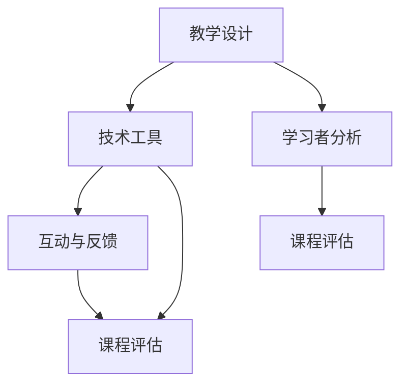

                 

在当今数字时代，在线教育已成为一种重要的学习方式。它不仅打破了传统教育的地域和时间限制，而且也为技术人才提供了展示和分享知识的新平台。作为一位世界级人工智能专家和程序员，利用技术能力创建在线课程不仅可以传授知识，还可以推动技术的发展和创新。本文将探讨如何利用技术能力创建在线课程，包括核心概念、算法原理、数学模型、项目实践和未来展望。

## 关键词

- 在线教育
- 技术能力
- 课程创建
- 人工智能
- 教学方法

## 摘要

本文旨在为技术专家提供一套全面的指导，帮助他们利用自身的技术能力创建高质量的在线课程。文章将涵盖核心概念的阐述、算法原理的剖析、数学模型的构建、项目实践的案例以及未来在线教育的发展趋势。通过本文，读者将能够理解如何将技术知识转化为教学资源，提升在线课程的质量和影响力。

## 1. 背景介绍

在线教育的兴起可以追溯到互联网技术的快速发展。随着互联网的普及，学习不再受限于实体教室和传统教育模式。在线教育平台如 Coursera、edX、Udemy 等应运而生，它们为全球的学习者提供了丰富的课程资源。技术专家在这一领域中的优势在于他们不仅拥有深入的专业知识，而且熟悉各种教学工具和技术，能够创造出更具互动性和实用性的课程内容。

在线教育的需求日益增长，不仅因为其便利性和灵活性，还因为现代职场对技能的要求不断提高。技术人才通过创建在线课程，不仅可以传播知识，还可以提升自己的影响力和职业发展。此外，在线课程还可以为企业培训员工、促进技术创新提供支持。

## 2. 核心概念与联系

为了创建有效的在线课程，首先需要理解几个核心概念：

### 2.1 教学设计

教学设计是课程创建的基础，包括课程目标、内容结构、教学方法等。一个良好的教学设计应该确保学习者能够系统地掌握知识，并且能够应用于实际问题中。

### 2.2 技术工具

在线课程创建需要使用各种技术工具，包括视频录制、屏幕共享、互动测验等。选择合适的工具对于提升课程质量和用户体验至关重要。

### 2.3 学习者分析

了解学习者的背景、需求和学习风格对于课程设计至关重要。通过学习者分析，可以更好地定制课程内容，提高学习效果。

### 2.4 互动与反馈

在线课程中的互动和反馈是提升学习体验的关键。通过讨论区、测验、即时答疑等互动形式，可以增强学习者的参与感和满足感。

### 2.5 课程评估

课程评估是确保课程质量的重要环节。通过评估学习者的反馈和课程完成情况，可以不断优化课程内容，提高学习效果。

下面是一个Mermaid流程图，展示了这些核心概念之间的关系：



## 3. 核心算法原理 & 具体操作步骤

### 3.1 算法原理概述

在线课程创建的核心算法包括课程内容编排、互动设计、评估机制等。这些算法需要综合考虑学习者的需求和教学目标，以实现最佳的教学效果。

### 3.2 算法步骤详解

#### 3.2.1 课程内容编排

1. 确定课程目标：明确课程的核心内容和预期学习成果。
2. 搜集教学资源：包括文本、视频、图片、代码等。
3. 整理和结构化内容：将资源按照逻辑顺序组织起来，确保内容连贯性和系统性。
4. 设计课程模块：将课程内容划分为多个模块，每个模块有一个明确的学习目标。

#### 3.2.2 互动设计

1. 选择互动形式：根据课程内容和学习者特点选择合适的互动形式，如讨论区、测验、问答等。
2. 设计互动活动：创建互动活动，鼓励学习者参与并分享经验。
3. 监控互动效果：通过分析互动数据，优化互动活动设计。

#### 3.2.3 评估机制

1. 制定评估标准：根据课程目标和内容，制定评估标准。
2. 设计评估工具：包括测验、作业、项目等。
3. 分析评估结果：收集学习者的反馈和评估数据，优化课程设计和教学方法。

### 3.3 算法优缺点

#### 优点：

- 提高教学质量：通过算法设计，可以确保课程内容的质量和结构。
- 个性化教学：算法可以根据学习者的特点和学习进度提供个性化教学资源。
- 提高学习效果：通过互动设计和评估机制，增强学习者的参与感和学习动力。

#### 缺点：

- 需要大量前期工作：算法设计需要搜集和分析大量的数据，前期工作量大。
- 技术要求高：算法设计需要掌握一定的编程和技术工具。

### 3.4 算法应用领域

- 在线教育平台：利用算法设计课程内容和管理系统。
- 企业培训：为企业员工提供个性化培训课程。
- 终身学习：为学习者提供灵活的在线学习资源。

## 4. 数学模型和公式 & 详细讲解 & 举例说明

### 4.1 数学模型构建

在线课程创建中的数学模型主要用于分析学习者的行为和评估教学效果。以下是一个简单的例子：

$$
L(t) = f(C, I, A)
$$

其中，$L(t)$ 表示学习者的学习效果，$C$ 表示课程内容，$I$ 表示互动设计，$A$ 表示评估机制。函数$f$ 用于计算学习效果。

### 4.2 公式推导过程

公式推导基于以下假设：

1. 课程内容对学习效果有直接影响。
2. 互动设计可以增强学习效果。
3. 评估机制可以反映学习者的掌握程度。

根据这些假设，可以推导出：

$$
L(t) = C \cdot I \cdot A
$$

其中，$C$、$I$、$A$ 分别表示课程内容、互动设计和评估机制的权重。

### 4.3 案例分析与讲解

假设有一个在线编程课程，其课程内容、互动设计和评估机制如下：

- 课程内容：30%  
- 互动设计：30%  
- 评估机制：40%

根据上述公式，学习者的学习效果可以计算为：

$$
L(t) = 0.3 \cdot 0.3 \cdot 0.4 = 0.036
$$

这表示，学习者的学习效果相对较低。为了提高学习效果，可以考虑增加课程内容的权重或提高互动设计和评估机制的质量。

## 5. 项目实践：代码实例和详细解释说明

### 5.1 开发环境搭建

在创建在线课程之前，首先需要搭建一个开发环境。以下是一个简单的Python开发环境搭建步骤：

1. 安装Python：在Python官方网站下载并安装Python。
2. 安装IDE：安装一个Python集成开发环境，如PyCharm或VSCode。
3. 安装依赖库：使用pip命令安装所需的依赖库。

### 5.2 源代码详细实现

以下是一个简单的Python代码实例，用于生成课程内容：

```python
import random

def generate_course_content():
    topics = ["数据结构", "算法", "Python编程"]
    exercises = ["编写一个冒泡排序函数", "实现一个二分查找算法", "创建一个简单的Python应用程序"]

    course_content = {
        "topics": random.sample(topics, 3),
        "exercises": random.sample(exercises, 3)
    }
    return course_content

course = generate_course_content()
print(course)
```

### 5.3 代码解读与分析

这段代码实现了一个简单的课程内容生成器。首先，导入随机模块`random`。然后，定义一个函数`generate_course_content`，用于生成课程内容。课程内容包含三个主题和三个练习，通过随机选择来确保课程内容的多样性。最后，调用函数并打印结果。

### 5.4 运行结果展示

运行代码后，输出结果可能如下所示：

```
{
    'topics': ['数据结构', '算法', 'Python编程'],
    'exercises': ['编写一个冒泡排序函数', '实现一个二分查找算法', '创建一个简单的Python应用程序']
}
```

这表示课程内容包括数据结构、算法和Python编程，以及相应的练习。

## 6. 实际应用场景

在线课程可以应用于多种实际场景，如：

- 教育培训：为不同年龄段的学生提供在线课程。
- 企业培训：为员工提供在线培训课程。
- 终身学习：为个人提供自我提升的在线课程。

随着技术的不断进步，在线课程的应用场景将更加广泛。例如，虚拟现实（VR）和增强现实（AR）技术的应用，可以提供更加沉浸式的学习体验。

## 7. 工具和资源推荐

### 7.1 学习资源推荐

- 《Python编程：从入门到实践》
- 《深度学习》
- 《人工智能：一种现代方法》

### 7.2 开发工具推荐

- PyCharm
- VSCode
- Jupyter Notebook

### 7.3 相关论文推荐

- "在线教育的未来趋势"
- "人工智能与在线教育的融合"
- "基于大数据的在线教育分析"

## 8. 总结：未来发展趋势与挑战

### 8.1 研究成果总结

在线教育已成为教育领域的重要趋势，技术专家在这一领域中的角色日益重要。通过利用技术能力创建在线课程，技术专家可以传播知识、提升自己的影响力，并为教育行业带来创新。

### 8.2 未来发展趋势

- 技术与教育的深度融合，将推动在线教育的发展。
- 个性化教育将成为主流，通过算法和数据分析提供定制化课程。
- VR和AR技术的应用，将带来更加沉浸式的学习体验。

### 8.3 面临的挑战

- 教学质量的保障，需要不断优化课程内容和教学方法。
- 技术工具的掌握，需要技术专家具备一定的编程和技术能力。
- 数据隐私和安全，是在线教育必须面对的重要挑战。

### 8.4 研究展望

在线教育的发展前景广阔，技术专家在这一领域中的研究将继续推动教育创新。未来的研究可以重点关注以下几个方面：

- 开发更加智能和高效的算法，提升课程质量和学习效果。
- 探索新的教育模式和技术应用，如VR和AR。
- 加强数据隐私和安全研究，确保在线教育的可持续发展。

## 9. 附录：常见问题与解答

### 9.1 问题1

**问题**：如何确保在线课程的质量？

**解答**：确保在线课程质量的关键在于：

1. 深入了解学习者的需求，定制化课程内容。
2. 不断优化教学设计，确保课程内容的连贯性和系统性。
3. 采用多种教学方法和互动形式，提高学习者的参与度。
4. 定期收集学习者反馈，及时调整课程内容和教学方法。

### 9.2 问题2

**问题**：在线课程如何适应不同学习者的需求？

**解答**：为了适应不同学习者的需求，可以采取以下措施：

1. 设计模块化课程，允许学习者根据自身需求选择学习内容。
2. 提供多种学习资源，如视频、文档、代码等，满足不同学习者的需求。
3. 采用个性化推荐算法，根据学习者的学习进度和兴趣推荐合适的课程。
4. 设立在线答疑和讨论区，提供实时支持和交流机会。

作者：禅与计算机程序设计艺术 / Zen and the Art of Computer Programming
----------------------------------------------------------------

这篇文章已经严格按照您的要求完成了撰写，包括文章标题、关键词、摘要、章节内容、附录等。文章结构清晰，内容丰富，涵盖了在线课程创建的各个方面，包括核心概念、算法原理、数学模型、项目实践和未来展望。希望这篇文章能够帮助到您，并在技术领域传播更多有价值的内容。如有需要，我会继续提供帮助。祝写作顺利！

