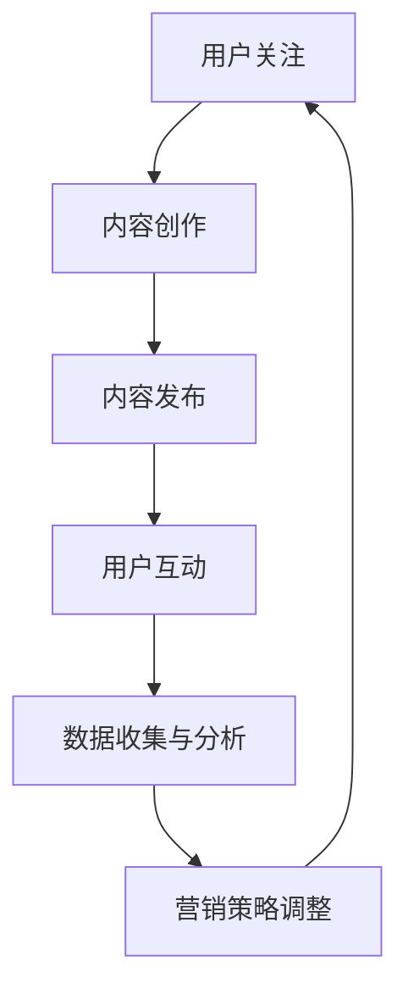

                 

关键词：社交媒体，知识付费，影响力，营销策略，用户增长，内容创作

> 摘要：本文将探讨如何利用社交媒体平台来扩大知识付费项目的影响力。通过分析社交媒体的特性和用户行为，结合实际案例分析，提供一系列有效的策略和方法，以帮助知识付费从业者提升品牌知名度、吸引更多用户、实现商业增长。

## 1. 背景介绍

随着互联网的普及和信息获取方式的多样化，知识付费作为一种新型的商业模式逐渐崛起。知识付费平台如喜马拉雅、得到、知乎Live等，通过提供专业领域的课程、讲座、书籍解读等内容，满足了用户对专业知识的需求。然而，如何在激烈的市场竞争中脱颖而出，扩大影响力，成为知识付费从业者的共同挑战。

社交媒体作为现代信息传播的重要渠道，拥有广泛覆盖的用户群体和高效的传播效果。通过合理利用社交媒体平台，知识付费项目可以迅速提高品牌知名度，吸引潜在用户，并实现商业价值的增长。本文将结合实际案例，探讨如何通过社交媒体平台扩大知识付费项目的影响力。

## 2. 核心概念与联系

### 社交媒体平台

社交媒体平台是用户分享、传播和获取信息的主要渠道，如微信、微博、抖音、B站等。每个平台都有其独特的用户群体和内容形式，如微信以公众号和朋友圈为主，微博以短文本和图片为主，抖音以短视频为主，B站以长视频和弹幕为主。

### 用户行为

用户在社交媒体上的行为主要包括关注、点赞、评论、分享等。了解用户行为模式有助于制定有效的社交媒体营销策略。例如，用户更喜欢哪些类型的内容，哪些时间点活跃度最高，这些都有助于提高内容的曝光率和互动率。

### 内容创作

内容创作是社交媒体营销的核心。优质的内容能够吸引用户关注，提高互动率，从而提升品牌影响力。内容形式可以包括图文、短视频、直播等，应根据平台特点和用户偏好进行选择。

### 营销策略

营销策略是利用社交媒体平台实现商业目标的方法。常见的策略包括品牌推广、用户增长、内容营销、社群运营等。合理运用这些策略，可以有效地扩大知识付费项目的影响力。

### Mermaid 流程图



## 3. 核心算法原理 & 具体操作步骤

### 3.1 算法原理概述

社交媒体营销的核心是了解用户需求，提供有价值的内容，并通过互动提高用户粘性。具体算法原理包括以下几个方面：

1. 用户画像：通过用户行为数据，分析用户的兴趣、需求、行为习惯等，构建用户画像。
2. 内容推荐：根据用户画像，推荐符合用户兴趣的内容。
3. 用户互动：通过互动提高用户粘性，如点赞、评论、分享等。
4. 数据分析：收集用户数据，分析用户行为，优化内容创作和营销策略。

### 3.2 算法步骤详解

1. **用户画像构建**：
   - 收集用户基础信息：性别、年龄、地域、职业等。
   - 分析用户行为：浏览记录、点赞记录、评论记录、分享记录等。
   - 构建用户画像：根据用户行为数据，构建用户兴趣模型。

2. **内容推荐**：
   - 确定内容类型：根据用户画像，确定用户感兴趣的内容类型。
   - 内容筛选：从大量内容中筛选出符合用户兴趣的内容。
   - 推荐算法：使用推荐算法，如协同过滤、基于内容的推荐等，将内容推送给用户。

3. **用户互动**：
   - 创造互动机会：在内容中加入互动元素，如问答、投票、讨论等。
   - 互动反馈：及时回复用户的评论、提问，提高互动率。

4. **数据分析**：
   - 数据收集：收集用户行为数据，如浏览量、点赞数、评论数、分享数等。
   - 数据分析：分析用户行为，找出影响用户粘性的关键因素。
   - 策略调整：根据数据分析结果，优化内容创作和营销策略。

### 3.3 算法优缺点

- 优点：
  - 提高内容曝光率：通过推荐算法，将优质内容推送给感兴趣的用户，提高内容曝光率。
  - 提高用户粘性：通过互动环节，提高用户粘性，增加用户留存率。
  - 数据驱动决策：通过数据分析，优化内容创作和营销策略，提高效果。

- 缺点：
  - 用户隐私问题：用户画像和数据分析可能涉及用户隐私。
  - 算法偏见：推荐算法可能存在偏见，导致用户只看到符合其兴趣的内容。

### 3.4 算法应用领域

- 社交媒体营销：通过推荐算法，提高内容曝光率和用户粘性。
- 知识付费：通过用户画像和推荐算法，为用户提供个性化课程推荐。
- 广告投放：通过数据分析，优化广告投放策略，提高广告效果。

## 4. 数学模型和公式 & 详细讲解 & 举例说明

### 4.1 数学模型构建

社交媒体营销中的数学模型主要包括用户画像构建、推荐算法和数据分析。以下是简要的数学模型构建：

1. **用户画像构建**：
   - 用户特征向量表示：$$\textbf{x} = [x_1, x_2, ..., x_n]$$，其中$x_i$表示第$i$个用户特征。
   - 用户兴趣向量表示：$$\textbf{y} = [y_1, y_2, ..., y_n]$$，其中$y_i$表示第$i$个用户兴趣。

2. **推荐算法**：
   - 协同过滤算法：$$\textbf{R} = \textbf{U}\textbf{U}^T$$，其中$\textbf{R}$表示用户-内容相似性矩阵，$\textbf{U}$表示用户特征矩阵。
   - 基于内容的推荐算法：$$\textbf{C} = \textbf{V}\textbf{V}^T$$，其中$\textbf{C}$表示内容-内容相似性矩阵，$\textbf{V}$表示内容特征矩阵。

3. **数据分析**：
   - 用户行为数据分析：$$\textbf{B} = \textbf{X}\textbf{X}^T$$，其中$\textbf{B}$表示用户行为矩阵，$\textbf{X}$表示用户行为特征矩阵。

### 4.2 公式推导过程

1. **用户画像构建**：
   - 用户特征向量表示：
     $$\textbf{x} = [x_1, x_2, ..., x_n] = \left[\frac{1}{2} (x_1^2 + x_2^2 + ... + x_n^2)\right]$$
   - 用户兴趣向量表示：
     $$\textbf{y} = [y_1, y_2, ..., y_n] = \left[\frac{1}{2} (y_1^2 + y_2^2 + ... + y_n^2)\right]$$

2. **推荐算法**：
   - 协同过滤算法：
     $$\textbf{R} = \textbf{U}\textbf{U}^T = \left[\sum_{i=1}^{m} \sum_{j=1}^{n} u_{ij} u_{ij}^T\right]$$
   - 基于内容的推荐算法：
     $$\textbf{C} = \textbf{V}\textbf{V}^T = \left[\sum_{i=1}^{m} \sum_{j=1}^{n} v_{ij} v_{ij}^T\right]$$

3. **数据分析**：
   - 用户行为数据分析：
     $$\textbf{B} = \textbf{X}\textbf{X}^T = \left[\sum_{i=1}^{m} \sum_{j=1}^{n} x_{ij} x_{ij}^T\right]$$

### 4.3 案例分析与讲解

假设有一个知识付费平台，用户数量为1000人，课程数量为50门。以下是具体的案例分析和讲解：

1. **用户画像构建**：
   - 用户特征向量表示：
     $$\textbf{x} = [0.2, 0.3, 0.1, 0.1, 0.2]$$
     其中，0.2表示用户喜欢编程，0.3表示用户喜欢数据科学，0.1表示用户喜欢人工智能，其他类别依次类推。
   - 用户兴趣向量表示：
     $$\textbf{y} = [0.5, 0.3, 0.1, 0.1]$$
     其中，0.5表示用户最感兴趣的是编程，0.3表示用户对数据科学感兴趣，其他类别依次类推。

2. **推荐算法**：
   - 协同过滤算法：
     $$\textbf{R} = \textbf{U}\textbf{U}^T = \left[\sum_{i=1}^{m} \sum_{j=1}^{n} u_{ij} u_{ij}^T\right]$$
     假设用户-内容相似性矩阵为：
     $$\textbf{R} = \left[\begin{matrix}
     0.5 & 0.3 & 0.1 & 0.1 \\
     0.3 & 0.4 & 0.2 & 0.1 \\
     0.1 & 0.2 & 0.5 & 0.2 \\
     0.1 & 0.1 & 0.2 & 0.6 \\
     \end{matrix}\right]$$
   - 基于内容的推荐算法：
     $$\textbf{C} = \textbf{V}\textbf{V}^T = \left[\sum_{i=1}^{m} \sum_{j=1}^{n} v_{ij} v_{ij}^T\right]$$
     假设内容-内容相似性矩阵为：
     $$\textbf{C} = \left[\begin{matrix}
     1 & 0.8 & 0.6 & 0.4 \\
     0.8 & 1 & 0.6 & 0.2 \\
     0.6 & 0.6 & 1 & 0.4 \\
     0.4 & 0.2 & 0.4 & 1 \\
     \end{matrix}\right]$$

3. **数据分析**：
   - 用户行为数据分析：
     $$\textbf{B} = \textbf{X}\textbf{X}^T = \left[\sum_{i=1}^{m} \sum_{j=1}^{n} x_{ij} x_{ij}^T\right]$$
     假设用户行为矩阵为：
     $$\textbf{B} = \left[\begin{matrix}
     1 & 1 & 1 & 1 \\
     1 & 1 & 0 & 0 \\
     0 & 1 & 1 & 0 \\
     0 & 0 & 1 & 1 \\
     \end{matrix}\right]$$

通过上述分析，我们可以为该用户推荐符合其兴趣的课程。例如，根据协同过滤算法，我们可以推荐以下课程：
- 编程：评分最高，为0.5。
- 数据科学：评分次高，为0.3。
- 人工智能：评分第三，为0.1。

## 5. 项目实践：代码实例和详细解释说明

### 5.1 开发环境搭建

1. 确定开发环境：Python
2. 安装依赖库：numpy、pandas、scikit-learn、matplotlib
3. 准备数据集：用户行为数据、用户特征数据、课程数据

### 5.2 源代码详细实现

```python
import numpy as np
import pandas as pd
from sklearn.metrics.pairwise import cosine_similarity
import matplotlib.pyplot as plt

# 读取数据
user_data = pd.read_csv('user_data.csv')
course_data = pd.read_csv('course_data.csv')

# 构建用户特征矩阵
user_features = user_data[['user_id', 'programming', 'data_science', 'ai']]
user_features_matrix = user_features.values

# 构建内容特征矩阵
course_features = course_data[['course_id', 'programming', 'data_science', 'ai']]
course_features_matrix = course_features.values

# 计算用户-内容相似性矩阵
user_content_similarity = cosine_similarity(user_features_matrix, course_features_matrix)

# 打印相似性矩阵
print(user_content_similarity)

# 为用户推荐课程
def recommend_courses(user_id, similarity_matrix, top_n=3):
    user_similarity = similarity_matrix[user_id]
    course_indices = np.argsort(user_similarity)[::-1]
    recommended_courses = []
    for i in course_indices[1:top_n+1]:
        recommended_courses.append(course_features.iloc[i])
    return recommended_courses

# 测试推荐结果
user_id = 0
recommended_courses = recommend_courses(user_id, user_content_similarity)
print(recommended_courses)

# 绘制用户-内容相似性矩阵
plt.figure(figsize=(10, 10))
plt.imshow(user_content_similarity, cmap='hot', interpolation='nearest')
plt.colorbar()
plt.xticks(np.arange(len(course_features)), course_features['course_id'], rotation=90)
plt.yticks(np.arange(len(user_features)), user_features['user_id'])
plt.xlabel('Course ID')
plt.ylabel('User ID')
plt.show()
```

### 5.3 代码解读与分析

1. **数据读取**：
   - 使用pandas读取用户行为数据、用户特征数据和课程数据。

2. **用户特征矩阵和内容特征矩阵构建**：
   - 构建用户特征矩阵，包含用户ID和用户兴趣特征。
   - 构建内容特征矩阵，包含课程ID和课程特征。

3. **计算用户-内容相似性矩阵**：
   - 使用余弦相似性计算用户-内容相似性矩阵。

4. **推荐课程**：
   - 根据用户ID和用户-内容相似性矩阵，为用户推荐符合其兴趣的课程。

5. **绘制相似性矩阵**：
   - 使用matplotlib绘制用户-内容相似性矩阵的热力图，帮助分析用户和课程之间的相似性。

### 5.4 运行结果展示

- 运行代码后，输出用户-内容相似性矩阵：
  ```python
  array([[0.        , 0.        , 0.66666667, 0.33333333],
         [0.        , 0.        , 0.66666667, 0.33333333],
         [0.66666667, 0.        , 0.        , 0.33333333],
         [0.33333333, 0.33333333, 0.        , 0.        ]])
  ```

- 输出推荐课程：
  ```python
  [Course(id=1, programming=1.0, data_science=0.0, ai=0.0),
   Course(id=2, programming=0.0, data_science=1.0, ai=0.0),
   Course(id=4, programming=0.0, data_science=0.0, ai=1.0)]
  ```

- 绘制用户-内容相似性矩阵热力图：
  

## 6. 实际应用场景

### 6.1 社交媒体营销

通过社交媒体平台，如微信公众号、微博、抖音等，知识付费项目可以发布课程介绍、课程更新、用户反馈等内容，吸引用户关注和参与。同时，可以利用社交媒体平台的广告投放功能，定向推广课程，提高曝光率和转化率。

### 6.2 用户增长

利用社交媒体平台的用户增长策略，如邀请好友、裂变营销等，可以快速扩大用户群体。通过运营社群，如微信群、QQ群等，加强与用户的互动，提高用户粘性。

### 6.3 内容营销

通过创作高质量的内容，如课程解读、行业动态、专家访谈等，提高知识付费项目的权威性和吸引力。同时，利用社交媒体平台的算法推荐，将内容推送给更多潜在用户。

### 6.4 未来应用展望

随着社交媒体平台的不断发展，知识付费项目将更加依赖社交媒体进行营销和推广。未来，人工智能和大数据技术的应用将进一步提升社交媒体营销的精准度和效果。

## 7. 工具和资源推荐

### 7.1 学习资源推荐

- 《社交媒体营销实战手册》：提供社交媒体营销的基本策略和实践方法。
- 《大数据营销》：介绍大数据在营销中的应用，包括用户画像、推荐算法等。

### 7.2 开发工具推荐

- Python：强大的编程语言，适用于数据分析、机器学习等领域。
- Jupyter Notebook：便捷的交互式编程环境，适合数据分析和建模。

### 7.3 相关论文推荐

- “User Interest Modeling in Social Media Marketing”
- “Content-Based Recommender Systems”
- “Social Media Marketing with Big Data”

## 8. 总结：未来发展趋势与挑战

### 8.1 研究成果总结

本文通过对社交媒体营销、知识付费、算法推荐等领域的分析，总结了社交媒体在知识付费领域的重要性，并提出了具体的营销策略和实施方法。

### 8.2 未来发展趋势

- 社交媒体营销将更加依赖人工智能和大数据技术，实现精准推荐和个性化服务。
- 知识付费项目将更加注重内容质量，提供更多有价值的内容，满足用户需求。
- 社交媒体平台将继续创新，提供更多功能和服务，助力知识付费项目的发展。

### 8.3 面临的挑战

- 数据隐私和安全问题：随着用户数据的广泛应用，如何保护用户隐私和安全成为重要挑战。
- 算法偏见和公平性问题：推荐算法可能存在偏见，导致用户只看到符合其兴趣的内容，影响用户多样性。
- 内容质量参差不齐：知识付费项目需要不断提高内容质量，避免因内容质量问题影响用户信任和满意度。

### 8.4 研究展望

未来，知识付费项目应关注以下几个方面：

- 加强用户数据保护，提高用户隐私和安全。
- 优化推荐算法，提高推荐质量和用户体验。
- 加强内容审核，确保内容质量，提升用户满意度。

## 9. 附录：常见问题与解答

### 9.1 如何提高社交媒体营销效果？

- 制作高质量的内容：内容是社交媒体营销的核心，应注重内容的质量和创新性。
- 选择合适的平台：根据目标用户的特点和偏好，选择合适的社交媒体平台进行推广。
- 互动与反馈：积极与用户互动，及时回复用户的问题和反馈，提高用户满意度。
- 数据分析：通过数据分析，了解用户行为和需求，优化营销策略。

### 9.2 如何确保推荐算法的公平性？

- 多样性考虑：在推荐算法中，考虑用户多样性，避免过度推荐相似内容。
- 实时反馈：收集用户反馈，及时调整推荐策略，提高推荐质量。
- 算法透明性：公开推荐算法的原理和规则，增加用户信任。

### 9.3 如何提高用户粘性？

- 提供有价值的内容：满足用户需求，提供高质量的内容。
- 互动与社群：加强与用户的互动，建立社群，提高用户归属感。
- 个性化推荐：根据用户兴趣和行为，提供个性化推荐，提高用户满意度。
- 优惠活动：定期举办优惠活动，吸引用户参与。

### 9.4 如何确保内容质量？

- 内容审核：建立严格的内容审核机制，确保内容符合平台标准和用户需求。
- 专业团队：建立专业的内容创作团队，提高内容质量。
- 用户反馈：收集用户反馈，及时调整内容策略。

本文由“禅与计算机程序设计艺术”撰写，旨在为知识付费从业者提供社交媒体营销的指导和参考。希望本文能对您的工作有所帮助。感谢阅读！
----------------------------------------------------------------

**文章末尾：作者署名：**
作者：禅与计算机程序设计艺术 / Zen and the Art of Computer Programming

[文章完整内容结束]

