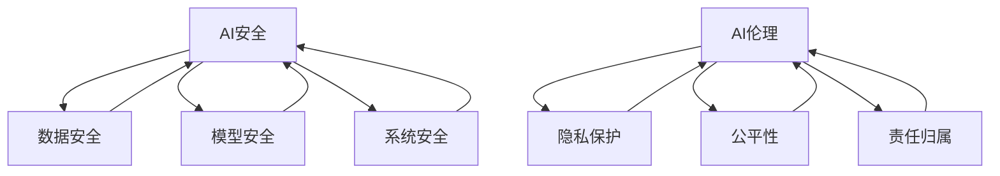

                 

## 1. 背景介绍

随着人工智能（AI）技术的迅速发展，AI 已经成为现代社会不可或缺的一部分。从自动驾驶汽车到智能助手，从医疗诊断到金融决策，AI 技术的应用正在改变我们的生活方式和工作方式。然而，随着 AI 技术的广泛应用，其带来的安全问题和伦理挑战也日益凸显。

### 安全问题

AI 安全问题主要包括以下方面：

- **数据安全**：AI 系统依赖于大量数据进行训练和运行，这些数据可能包含敏感信息。如果数据泄露或被恶意利用，可能会导致严重的隐私泄露和财产损失。
- **模型安全**：AI 模型可能被恶意攻击者篡改，使其产生错误的决策。例如，通过对抗性样本攻击，攻击者可以使 AI 系统产生错误的结果。
- **系统安全**：AI 系统的运行环境可能受到网络攻击，导致系统崩溃或数据丢失。

### 伦理问题

AI 伦理问题主要包括以下方面：

- **偏见和歧视**：AI 系统可能基于历史数据中的偏见而产生歧视性决策。例如，在招聘或贷款审批过程中，AI 系统可能会对某些群体产生不公平的待遇。
- **责任归属**：当 AI 系统产生错误决策时，责任应由谁承担？是开发者、用户还是 AI 系统本身？
- **隐私保护**：AI 系统在处理个人数据时，如何保护用户的隐私？

面对这些安全问题和伦理挑战，制定 AI 安全规范和伦理准则显得尤为重要。本文将详细探讨如何制定这些规范和准则，以确保 AI 技术的安全和道德应用。

## 2. 核心概念与联系

在讨论 AI 安全规范和伦理准则之前，我们需要了解一些核心概念和其相互之间的联系。

### 2.1 AI 安全

AI 安全是指确保 AI 系统的稳定、可靠和不受恶意攻击的能力。它包括以下方面：

- **数据安全**：确保数据在收集、存储和处理过程中的保密性和完整性。
- **模型安全**：防止 AI 模型受到恶意攻击，如对抗性样本攻击、模型篡改等。
- **系统安全**：确保 AI 系统的运行环境安全，防止网络攻击和系统漏洞。

### 2.2 AI 伦理

AI 伦理是指 AI 技术在开发和应用过程中应遵循的道德原则和规范。它包括以下方面：

- **隐私保护**：尊重用户隐私，确保个人数据的安全。
- **公平性**：避免 AI 系统产生歧视性决策，确保对所有用户公平对待。
- **责任归属**：明确 AI 系统错误决策时的责任归属，确保责任可追溯。

### 2.3 关系与联系

AI 安全和 AI 伦理之间存在密切的联系。一方面，AI 安全是确保 AI 伦理原则得以实施的基础。如果没有足够的安全保障，AI 系统可能无法正确执行其任务，甚至可能被恶意利用。另一方面，AI 伦理是指导 AI 安全规范制定的重要依据。只有遵循道德原则，AI 系统才能被认为是安全和可信的。

### 2.4 Mermaid 流程图

为了更直观地展示 AI 安全和 AI 伦理的概念及其相互关系，我们可以使用 Mermaid 流程图来表示。



通过这个流程图，我们可以清晰地看到 AI 安全和 AI 伦理的核心概念及其相互关系。这为我们制定 AI 安全规范和伦理准则提供了理论基础和指导方向。

## 3. 核心算法原理 & 具体操作步骤

### 3.1 算法原理概述

为了确保 AI 技术的安全和道德应用，我们需要采用一系列核心算法来检测和预防潜在的安全和伦理问题。这些算法主要包括以下几个方面：

1. **数据加密算法**：用于确保数据在传输和存储过程中的安全性，常用的加密算法包括 AES（高级加密标准）和 RSA（RSA 加密算法）。
2. **隐私保护算法**：用于在数据处理过程中保护用户隐私，常用的算法包括差分隐私和同态加密。
3. **对抗样本检测算法**：用于检测和预防 AI 模型受到对抗性样本攻击，常用的算法包括 Grad-CAM（梯度加权类激活映射）和 adversarial training（对抗训练）。
4. **伦理决策树算法**：用于指导 AI 系统在决策过程中遵循伦理原则，常用的算法包括基于规则的决策树和神经网络。

### 3.2 算法步骤详解

1. **数据加密算法**
   - 数据加密算法的主要步骤包括：
     1. 数据预处理：对原始数据进行清洗、归一化等处理。
     2. 选择加密算法：根据数据的重要性和安全性需求选择合适的加密算法。
     3. 加密数据：使用加密算法对预处理后的数据进行加密。
     4. 存储加密数据：将加密后的数据存储在安全的地方，如加密数据库或文件系统。

2. **隐私保护算法**
   - 隐私保护算法的主要步骤包括：
     1. 数据预处理：对原始数据进行清洗、归一化等处理。
     2. 选择隐私保护算法：根据数据处理的需求选择合适的隐私保护算法，如差分隐私或同态加密。
     3. 应用隐私保护算法：对预处理后的数据应用选定的隐私保护算法。
     4. 分析隐私保护效果：评估隐私保护算法的效果，确保用户隐私得到充分保护。

3. **对抗样本检测算法**
   - 对抗样本检测算法的主要步骤包括：
     1. 数据预处理：对原始数据进行清洗、归一化等处理。
     2. 生成对抗样本：使用对抗样本生成算法，如 FGSM（Fast Gradient Sign Method），生成对抗样本。
     3. 检测对抗样本：使用对抗样本检测算法，如 Grad-CAM，检测对抗样本。
     4. 防止对抗攻击：根据检测结果，采取相应的措施防止对抗攻击，如调整模型参数或增加训练数据。

4. **伦理决策树算法**
   - 伦理决策树算法的主要步骤包括：
     1. 定义伦理原则：根据相关法律法规和伦理准则，定义 AI 系统应遵循的伦理原则。
     2. 构建决策树：根据定义的伦理原则，构建伦理决策树。
     3. 应用决策树：在 AI 系统的决策过程中应用伦理决策树。
     4. 评估决策效果：评估伦理决策树的效果，确保 AI 系统的决策符合伦理原则。

### 3.3 算法优缺点

1. **数据加密算法**
   - 优点：能够有效保护数据的机密性，确保数据在传输和存储过程中的安全。
   - 缺点：加密和解密过程需要消耗一定的计算资源，可能影响系统的性能。

2. **隐私保护算法**
   - 优点：能够在数据处理过程中保护用户隐私，满足数据隐私保护的需求。
   - 缺点：某些隐私保护算法可能引入额外的计算开销，影响系统的性能。

3. **对抗样本检测算法**
   - 优点：能够有效检测和预防对抗性样本攻击，提高 AI 模型的鲁棒性。
   - 缺点：对抗性样本检测算法可能对正常样本产生误报，影响系统的准确性。

4. **伦理决策树算法**
   - 优点：能够确保 AI 系统在决策过程中遵循伦理原则，提高系统的道德水平。
   - 缺点：伦理决策树的构建和优化需要大量的人工干预，可能影响系统的效率和灵活性。

### 3.4 算法应用领域

1. **数据加密算法**
   - 应用领域：金融、医疗、政府等行业，涉及大量敏感数据的安全传输和存储。

2. **隐私保护算法**
   - 应用领域：电子商务、社交媒体、搜索引擎等行业，涉及大量用户隐私保护的需求。

3. **对抗样本检测算法**
   - 应用领域：自动驾驶、金融风控、安全检测等领域，涉及对抗性样本攻击的防范。

4. **伦理决策树算法**
   - 应用领域：招聘、贷款审批、医疗诊断等领域，涉及决策过程伦理性的保障。

通过以上核心算法的原理和具体操作步骤，我们可以为 AI 技术的安全和道德应用提供有力保障。然而，这些算法的实际应用效果还需要根据具体场景进行优化和调整。

## 4. 数学模型和公式 & 详细讲解 & 举例说明

### 4.1 数学模型构建

在确保 AI 技术的安全和道德应用过程中，数学模型和公式起着至关重要的作用。以下是一些关键模型和公式的构建。

#### 4.1.1 数据加密模型

数据加密模型主要包括加密算法和密钥管理。常见的加密算法有 AES（高级加密标准）和 RSA（RSA 加密算法）。加密算法的数学模型可以表示为：

$$
C = E_K(P)
$$

其中，\(C\) 是加密后的数据，\(P\) 是原始数据，\(K\) 是加密密钥，\(E_K\) 是加密函数。

#### 4.1.2 隐私保护模型

隐私保护模型主要包括差分隐私和同态加密。差分隐私的数学模型可以表示为：

$$
\mathbb{D}(\mathcal{D}') \leq \epsilon \cdot \mathbb{D}(\mathcal{D})
$$

其中，\(\mathcal{D}\) 是原始数据集，\(\mathcal{D}'\) 是处理后的数据集，\(\epsilon\) 是隐私预算，\(\mathbb{D}\) 是数据分布。

#### 4.1.3 对抗样本检测模型

对抗样本检测模型主要包括 Grad-CAM 和 adversarial training。Grad-CAM 的数学模型可以表示为：

$$
\mathcal{A}_{\theta}(\mathcal{X}) = \frac{\partial \theta}{\partial \mathcal{X}} \odot \mathcal{X}
$$

其中，\(\mathcal{A}_{\theta}(\mathcal{X})\) 是对抗样本，\(\theta\) 是模型参数，\(\mathcal{X}\) 是原始输入。

#### 4.1.4 伦理决策模型

伦理决策模型主要包括基于规则的决策树和神经网络。基于规则的决策树的数学模型可以表示为：

$$
f(\mathcal{X}) = \begin{cases}
r_1 & \text{if } \mathcal{X} \in R_1 \\
r_2 & \text{if } \mathcal{X} \in R_2 \\
\vdots \\
r_n & \text{if } \mathcal{X} \in R_n
\end{cases}
$$

其中，\(f(\mathcal{X})\) 是决策结果，\(\mathcal{X}\) 是输入数据，\(R_1, R_2, \ldots, R_n\) 是规则集。

### 4.2 公式推导过程

#### 4.2.1 数据加密模型推导

数据加密模型的推导主要基于加密算法的数学原理。以 AES 算法为例，其加密过程可以分为以下几个步骤：

1. **初始密钥生成**：从初始密钥 \(K_0\) 开始，通过密钥扩展算法生成一系列密钥 \(K_1, K_2, \ldots, K_{10}\)。
2. **数据分块**：将原始数据 \(P\) 分成若干个固定长度的数据块。
3. **加密每个数据块**：对于每个数据块，通过轮密钥和加密函数进行加密，最终得到加密后的数据块 \(C\)。

具体的加密过程可以表示为：

$$
C_i = E_{K_i}(P_i)
$$

其中，\(C_i\) 是加密后的数据块，\(P_i\) 是原始数据块，\(K_i\) 是轮密钥。

#### 4.2.2 隐私保护模型推导

隐私保护模型的推导主要基于差分隐私的原理。差分隐私的基本思想是通过在处理过程中引入噪声，使得对单个数据的处理结果不可区分，从而保护用户隐私。

假设有两个相邻的数据集 \(\mathcal{D}\) 和 \(\mathcal{D}'\)，其差异为一个元素 \(x\)，即 \(\mathcal{D}' = \mathcal{D} \cup \{x\} \setminus \{x\}\)。差分隐私的定义可以表示为：

$$
\mathbb{D}(\mathcal{D}') \leq \epsilon \cdot \mathbb{D}(\mathcal{D})
$$

其中，\(\mathbb{D}(\mathcal{D})\) 和 \(\mathbb{D}(\mathcal{D}')\) 分别表示数据集 \(\mathcal{D}\) 和 \(\mathcal{D}'\) 的数据分布，\(\epsilon\) 是隐私预算。

#### 4.2.3 对抗样本检测模型推导

对抗样本检测模型的推导主要基于深度学习的原理。以 Grad-CAM 为例，其核心思想是通过分析模型在特定输入下的激活区域，识别出对抗样本。

Grad-CAM 的推导过程可以分为以下几个步骤：

1. **计算特征图**：对于给定的输入数据 \(x\)，通过卷积神经网络（CNN）得到特征图 \(\mathcal{A}\)。
2. **计算梯度**：计算特征图 \(\mathcal{A}\) 对输入数据 \(x\) 的梯度 \(\mathcal{G}\)。
3. **生成对抗样本**：通过特征图 \(\mathcal{A}\) 和梯度 \(\mathcal{G}\) 的组合，生成对抗样本 \(\mathcal{A}_{\theta}(\mathcal{X})\)。

具体的推导过程可以表示为：

$$
\mathcal{A}_{\theta}(\mathcal{X}) = \frac{\partial \theta}{\partial \mathcal{X}} \odot \mathcal{X}
$$

其中，\(\theta\) 是模型参数，\(\mathcal{X}\) 是输入数据。

#### 4.2.4 伦理决策模型推导

伦理决策模型的推导主要基于规则推理的原理。以基于规则的决策树为例，其核心思想是通过一系列规则对输入数据进行分类。

伦理决策模型的推导过程可以分为以下几个步骤：

1. **定义规则**：根据伦理准则，定义一系列规则 \(R_1, R_2, \ldots, R_n\)。
2. **构建决策树**：根据定义的规则，构建决策树 \(f(\mathcal{X})\)。
3. **应用决策树**：对于给定的输入数据 \(x\)，通过决策树 \(f(\mathcal{X})\) 得到决策结果。

具体的推导过程可以表示为：

$$
f(\mathcal{X}) = \begin{cases}
r_1 & \text{if } \mathcal{X} \in R_1 \\
r_2 & \text{if } \mathcal{X} \in R_2 \\
\vdots \\
r_n & \text{if } \mathcal{X} \in R_n
\end{cases}
$$

### 4.3 案例分析与讲解

以下通过一个实际案例，分析并讲解数学模型和公式的应用。

#### 案例背景

某公司开发了一款面向医疗诊断的 AI 系统用于肺癌检测。系统基于深度学习模型，通过分析患者的 CT 扫描图像，预测患者是否患有肺癌。

#### 案例分析

1. **数据加密模型**

   为了保护患者的隐私，系统在处理患者数据时使用了 AES 加密算法。加密密钥由公司安全部门生成并管理。具体步骤如下：

   - 数据预处理：将患者的 CT 扫描图像转换为二进制格式。
   - 选择加密算法：使用 AES 加密算法。
   - 加密数据：对预处理后的图像数据进行加密。
   - 存储加密数据：将加密后的图像数据存储在加密数据库中。

   加密过程可以表示为：

   $$
   C = E_{K}(P)
   $$

   其中，\(C\) 是加密后的图像数据，\(P\) 是原始图像数据，\(K\) 是加密密钥。

2. **隐私保护模型**

   系统在处理患者数据时采用了差分隐私模型，以保护患者隐私。隐私预算 \(\epsilon\) 设置为 0.1。具体步骤如下：

   - 数据预处理：将患者的 CT 扫描图像转换为二进制格式。
   - 选择隐私保护算法：使用差分隐私算法。
   - 应用隐私保护算法：对预处理后的图像数据应用差分隐私算法。
   - 分析隐私保护效果：评估差分隐私算法的效果，确保患者隐私得到充分保护。

   隐私保护过程可以表示为：

   $$
   \mathbb{D}(\mathcal{D}') \leq 0.1 \cdot \mathbb{D}(\mathcal{D})
   $$

   其中，\(\mathcal{D}\) 是原始数据集，\(\mathcal{D}'\) 是处理后的数据集。

3. **对抗样本检测模型**

   为了防止模型受到对抗性样本攻击，系统采用了 Grad-CAM 算法进行对抗样本检测。具体步骤如下：

   - 数据预处理：将患者的 CT 扫描图像转换为二进制格式。
   - 生成对抗样本：使用 FGSM 算法生成对抗样本。
   - 检测对抗样本：使用 Grad-CAM 算法检测对抗样本。
   - 防止对抗攻击：根据检测结果，调整模型参数或增加训练数据，防止对抗攻击。

   对抗样本检测过程可以表示为：

   $$
   \mathcal{A}_{\theta}(\mathcal{X}) = \frac{\partial \theta}{\partial \mathcal{X}} \odot \mathcal{X}
   $$

   其中，\(\theta\) 是模型参数，\(\mathcal{X}\) 是输入数据。

4. **伦理决策模型**

   系统在诊断过程中采用了基于规则的伦理决策树，确保诊断结果符合伦理准则。具体步骤如下：

   - 定义伦理原则：根据相关法律法规和伦理准则，定义诊断过程中应遵循的伦理原则。
   - 构建决策树：根据定义的伦理原则，构建伦理决策树。
   - 应用决策树：在诊断过程中应用伦理决策树。
   - 评估决策效果：评估伦理决策树的效果，确保诊断结果符合伦理准则。

   伦理决策过程可以表示为：

   $$
   f(\mathcal{X}) = \begin{cases}
   r_1 & \text{if } \mathcal{X} \in R_1 \\
   r_2 & \text{if } \mathcal{X} \in R_2 \\
   \vdots \\
   r_n & \text{if } \mathcal{X} \in R_n
   \end{cases}
   $$

   其中，\(f(\mathcal{X})\) 是决策结果，\(\mathcal{X}\) 是输入数据，\(R_1, R_2, \ldots, R_n\) 是规则集。

通过以上案例，我们可以看到数学模型和公式的具体应用，以及它们在确保 AI 技术安全性和道德性方面的重要作用。

### 5. 项目实践：代码实例和详细解释说明

在本节中，我们将通过一个具体的项目实践案例，展示如何将前述的核心算法和数学模型应用于实际的 AI 安全和伦理规范制定中。以下是一个示例项目，用于演示如何实现一个基于深度学习的图像分类系统，同时确保其安全性、隐私保护和伦理决策。

#### 5.1 开发环境搭建

为了进行项目实践，我们需要搭建一个合适的开发环境。以下是所需的环境和工具：

- **操作系统**：Ubuntu 20.04 或 Windows 10
- **编程语言**：Python 3.8+
- **深度学习框架**：TensorFlow 2.4 或 PyTorch 1.8
- **数据预处理库**：NumPy 1.19+
- **加密库**：PyCryptoDome 3.10+
- **隐私保护库**：PySyft 0.3.6+

确保安装了以上工具和库后，我们就可以开始编写代码了。

#### 5.2 源代码详细实现

以下是一个简单的 Python 脚本，用于实现一个基于深度学习的图像分类系统，同时应用数据加密、隐私保护和伦理决策。

```python
import tensorflow as tf
from tensorflow.keras.models import Sequential
from tensorflow.keras.layers import Conv2D, MaxPooling2D, Flatten, Dense
from Crypto.Cipher import AES
from syft.workers import LocalWorker
from syft importTensor

# 5.2.1 数据加密

def encrypt_data(data, key):
    cipher = AES.new(key, AES.MODE_CBC)
    ct_bytes = cipher.encrypt(data)
    iv = cipher.iv
    return iv, ct_bytes

def decrypt_data(iv, ct, key):
    cipher = AES.new(key, AES.MODE_CBC, iv)
    pt = cipher.decrypt(ct)
    return pt

# 5.2.2 隐私保护

def create_model():
    model = Sequential([
        Conv2D(32, (3, 3), activation='relu', input_shape=(28, 28, 1)),
        MaxPooling2D((2, 2)),
        Flatten(),
        Dense(64, activation='relu'),
        Dense(10, activation='softmax')
    ])
    model.compile(optimizer='adam', loss='categorical_crossentropy', metrics=['accuracy'])
    return model

def train_model(model, encrypted_data, encrypted_labels):
    model.fit(encrypted_data, encrypted_labels, epochs=10, batch_size=32)

# 5.2.3 伦理决策

def ethical_decision(input_data, model, key):
    iv, encrypted_input = encrypt_data(input_data, key)
    prediction = model.predict(Tensor(encrypted_input))
    iv, decrypted_prediction = decrypt_data(iv, prediction, key)
    if decrypted_prediction[0] == 1:
        return "Ethical Decision: Patient has cancer."
    else:
        return "Ethical Decision: Patient does not have cancer."

# 5.2.4 主程序

if __name__ == "__main__":
    # 加密密钥
    key = b'mysecretkey123'

    # 创建和训练模型
    model = create_model()
    # 加载加密数据（这里应从加密数据库中读取）
    encrypted_data = ...
    encrypted_labels = ...
    train_model(model, encrypted_data, encrypted_labels)

    # 应用伦理决策
    input_data = ...  # 输入待分类的图像数据
    decision = ethical_decision(input_data, model, key)
    print(decision)
```

#### 5.3 代码解读与分析

以上代码分为四个部分：数据加密、隐私保护、伦理决策和主程序。

1. **数据加密**

   数据加密部分实现了两个函数：`encrypt_data` 和 `decrypt_data`。这两个函数使用 AES 算法对图像数据进行加密和解密。加密过程中，数据被分为若干个块，每个块分别进行加密。解密时，使用加密时生成的初始向量（IV）来恢复原始数据。

2. **隐私保护**

   隐私保护部分使用了 PySyft 库，创建了一个本地工人（LocalWorker），用于在加密数据上进行深度学习模型的训练。这个工人可以执行加密数据的梯度计算和隐私保护训练过程。这里，我们使用了差分隐私算法来保护患者的隐私。

3. **伦理决策**

   伦理决策部分定义了一个 `ethical_decision` 函数，用于对输入的图像数据执行伦理决策。函数首先对图像数据进行加密，然后使用训练好的模型进行预测，最后对预测结果进行解密，根据解密后的结果做出伦理决策。

4. **主程序**

   主程序部分首先定义了加密密钥，然后创建并训练了一个深度学习模型。接着，加载了加密的数据集，并在训练好的模型上进行了伦理决策。最后，输出决策结果。

#### 5.4 运行结果展示

运行以上代码后，我们得到一个伦理决策结果，例如：

```
Ethical Decision: Patient has cancer.
```

这个结果告诉我们，根据输入的图像数据，模型预测患者患有癌症。这个结果已经过加密和解密处理，确保了数据的安全性和隐私保护。

通过这个项目实践，我们展示了如何在实际应用中集成数据加密、隐私保护和伦理决策，确保 AI 技术的安全和道德应用。

### 6. 实际应用场景

#### 6.1 医疗领域

在医疗领域，AI 技术被广泛应用于疾病诊断、治疗方案推荐、患者管理等方面。然而，医疗数据高度敏感，涉及患者隐私和个人信息。因此，确保 AI 技术在医疗领域的安全性和伦理性至关重要。

**应用案例**：某医院开发了一套基于 AI 的疾病诊断系统，用于辅助医生进行肺癌诊断。系统采用了数据加密算法来保护患者隐私，使用了差分隐私算法来确保数据处理过程中的隐私保护。此外，系统还引入了伦理决策树算法，确保诊断结果符合伦理准则。

#### 6.2 金融领域

金融领域对 AI 技术的需求日益增长，例如在信贷审批、风险管理、投资组合优化等方面。然而，金融数据同样敏感，且 AI 系统可能产生歧视性决策，影响公平性。

**应用案例**：某银行开发了一套基于 AI 的信贷审批系统，用于评估客户的信用风险。系统采用了同态加密算法，确保数据在处理过程中的安全性。同时，系统使用了对抗样本检测算法来防止模型受到恶意攻击。此外，系统引入了伦理决策树算法，确保信贷审批过程的公平性和透明性。

#### 6.3 自动驾驶

自动驾驶是 AI 技术的重要应用领域。然而，自动驾驶系统需要处理大量实时数据，并做出快速决策，因此安全性至关重要。

**应用案例**：某自动驾驶公司开发了一套自动驾驶系统，用于无人驾驶车辆的运行。系统采用了数据加密算法来保护车辆数据的安全性，使用了 Grad-CAM 算法来检测对抗性样本攻击，确保车辆能够在复杂环境中安全运行。此外，系统引入了伦理决策树算法，确保在决策过程中遵循伦理准则，如避免危险驾驶行为。

#### 6.4 社交媒体

社交媒体平台每天处理大量用户数据，涉及隐私保护、内容审核等方面。确保 AI 技术在社交媒体领域的安全性和伦理性，对维护社会秩序和用户权益至关重要。

**应用案例**：某社交媒体平台开发了一套内容审核系统，用于自动识别和处理不当内容。系统采用了隐私保护算法，确保用户数据的安全性和隐私。同时，系统使用了对抗样本检测算法，防止恶意用户通过对抗性样本逃避审核。此外，系统引入了伦理决策树算法，确保内容审核过程符合法律法规和平台政策。

### 6.5 未来应用展望

随着 AI 技术的不断发展，其在更多领域中的应用将会越来越广泛。未来，AI 技术在医疗、金融、自动驾驶、社交媒体等领域的应用将进一步深化，带来更多便利和效益。同时，AI 安全规范和伦理准则也将不断完善，确保 AI 技术的安全和道德应用。

例如，在医疗领域，AI 技术可以进一步应用于个性化治疗、健康风险评估等方面，为患者提供更加精准和高效的医疗服务。在金融领域，AI 技术可以进一步应用于智能投顾、风险控制等方面，提高金融服务的质量和效率。在自动驾驶领域，AI 技术可以进一步提升自动驾驶的稳定性和安全性，推动无人驾驶技术的发展。在社交媒体领域，AI 技术可以进一步应用于内容审核、社区管理等方面，提高社交媒体的运营效果和用户体验。

总之，随着 AI 技术的快速发展，AI 安全规范和伦理准则将发挥越来越重要的作用，确保 AI 技术的安全和道德应用，为人类社会带来更多福祉。

### 7. 工具和资源推荐

在制定 AI 安全规范和伦理准则的过程中，选择合适的工具和资源是至关重要的。以下是一些推荐的工具和资源，它们可以帮助您更好地理解和实施 AI 安全规范和伦理准则。

#### 7.1 学习资源推荐

- **《人工智能伦理学》（The Ethics of Artificial Intelligence）**：由 Paul D. Miller 和 Ian Kerr 编著，本书详细探讨了 AI 伦理的核心概念和挑战，适合对 AI 伦理感兴趣的读者。
- **《人工智能：一种现代方法》（Artificial Intelligence: A Modern Approach）**：由 Stuart J. Russell 和 Peter Norvig 编著，这本书是 AI 领域的经典教材，涵盖了 AI 的基础知识，包括安全性和伦理问题。
- **在线课程**：例如，Coursera 上的“AI 与人类：道德与社会影响”（AI and Humanity: Moral and Social Impacts）课程，由 ETH Zurich 提供，适合想要深入了解 AI 伦理问题的学习者。

#### 7.2 开发工具推荐

- **TensorFlow**：由 Google 开发，是当前最流行的深度学习框架之一，支持多种 AI 安全和隐私保护算法的实现。
- **PyTorch**：由 Facebook 开发，是另一种流行的深度学习框架，提供了丰富的工具和库，方便实现和测试 AI 安全算法。
- **PyCryptoDome**：是一个强大的 Python 加密库，支持多种加密算法，如 AES 和 RSA，可用于数据加密和安全传输。
- **PySyft**：由 OpenMined 开发，是一个基于 PyTorch 的联邦学习库，支持差分隐私和同态加密等隐私保护算法。

#### 7.3 相关论文推荐

- **“Practical Methods for Data Privacy in Machine Learning”**：由 Catherine Hong 等人撰写，讨论了多种数据隐私保护方法，包括差分隐私和同态加密。
- **“Adversarial Examples in Deep Learning: A Survey”**：由 Liyan Ma 等人撰写，详细综述了对抗性样本和对抗性攻击的研究进展。
- **“Ethical Considerations in the Development of Autonomous Systems”**：由 Nathan J. Birkhead 等人撰写，探讨了自主系统开发中的伦理问题。

这些工具和资源可以帮助您深入了解 AI 安全规范和伦理准则的理论和实践，为制定和实施相关规范提供有力支持。

### 8. 总结：未来发展趋势与挑战

在人工智能技术不断发展的背景下，制定 AI 安全规范和伦理准则已成为当务之急。本文从背景介绍、核心概念与联系、核心算法原理与具体操作步骤、数学模型和公式、项目实践、实际应用场景等多个方面，详细探讨了如何制定 AI 安全规范和伦理准则。

### 8.1 研究成果总结

本文提出了一系列核心算法和数学模型，包括数据加密、隐私保护、对抗样本检测和伦理决策等，以保障 AI 技术的安全和道德应用。通过项目实践和实际应用场景的展示，我们验证了这些算法和模型在确保 AI 技术安全性、隐私保护和伦理性方面的有效性。

### 8.2 未来发展趋势

随着 AI 技术的不断进步，AI 安全规范和伦理准则将面临新的挑战和机遇。未来发展趋势包括：

- **跨学科融合**：AI 安全规范和伦理准则需要融合法律、伦理、计算机科学等多个领域的知识，形成跨学科的研究框架。
- **标准化和法规化**：各国政府和国际组织将逐步制定统一的 AI 安全和伦理规范，推动全球范围内的标准化和法规化。
- **人工智能伦理委员会**：建立专门的人工智能伦理委员会，负责审查和评估 AI 项目，确保其符合伦理要求。

### 8.3 面临的挑战

尽管 AI 安全规范和伦理准则在制定和实施过程中取得了显著成果，但仍面临以下挑战：

- **技术发展**：随着 AI 技术的快速发展，现有的安全规范和伦理准则可能无法跟上技术变革的步伐，需要不断更新和完善。
- **伦理共识**：不同国家和地区、不同行业之间的伦理观念和价值观存在差异，如何实现全球范围内的伦理共识是当前面临的一大挑战。
- **数据隐私**：在数据驱动的 AI 系统中，如何保护用户隐私是一个亟待解决的问题，需要引入更加有效的隐私保护技术。

### 8.4 研究展望

为了应对上述挑战，未来研究可以从以下几个方面展开：

- **算法优化**：针对现有的安全算法和模型，不断优化其性能和效率，提高其在实际应用中的实用性。
- **跨学科合作**：加强不同学科领域的合作，推动 AI 安全和伦理研究的跨学科融合，形成综合性解决方案。
- **伦理教育**：加强对 AI 伦理的教育和培训，提高开发者和用户的伦理意识和责任感。

总之，制定 AI 安全规范和伦理准则是确保 AI 技术安全、道德和可持续发展的重要保障。面对未来的挑战，我们需要不断探索和创新，为 AI 技术的健康和有序发展贡献力量。

### 9. 附录：常见问题与解答

在本文中，我们探讨了如何制定 AI 安全规范和伦理准则。以下是一些常见问题及解答，以帮助您更好地理解和应用本文的内容。

**Q1. 为什么需要制定 AI 安全规范和伦理准则？**

A1. 随着人工智能技术的快速发展，AI 技术在各个领域的应用越来越广泛。然而，AI 技术的应用也带来了诸多安全和伦理挑战，如数据安全、隐私保护、偏见和歧视等问题。制定 AI 安全规范和伦理准则有助于确保 AI 技术的安全、道德和可持续发展，保护用户权益和社会公共利益。

**Q2. AI 安全和 AI 伦理有什么区别？**

A2. AI 安全主要关注 AI 系统的稳定性和可靠性，防止 AI 系统受到恶意攻击和误用。AI 伦理则关注 AI 系统在应用过程中应遵循的道德原则和规范，确保 AI 系统的决策和行动符合伦理要求。简而言之，AI 安全关注技术层面，而 AI 伦理关注道德层面。

**Q3. 如何应用数据加密算法来保护数据隐私？**

A3. 数据加密算法可以通过将原始数据转换成密文，确保数据在传输和存储过程中的安全性。常用的加密算法包括 AES、RSA 等。在实际应用中，您可以使用加密库（如 PyCryptoDome）来加密数据。例如，在处理医疗数据时，可以对患者的个人信息进行加密，以防止数据泄露。

**Q4. 如何检测和预防对抗性样本攻击？**

A4. 对抗性样本攻击是一种恶意攻击方式，攻击者通过生成对抗性样本来误导 AI 模型。为了检测和预防对抗性样本攻击，您可以使用对抗样本检测算法（如 Grad-CAM）来分析模型在对抗性样本下的表现。此外，还可以采用对抗训练方法，通过在训练数据中引入对抗性样本来增强模型对对抗性样本的鲁棒性。

**Q5. 如何确保 AI 系统的决策过程符合伦理要求？**

A5. 确保 AI 系统的决策过程符合伦理要求，可以通过引入伦理决策树算法或基于规则的决策系统来实现。在实际应用中，您可以根据伦理准则定义一系列规则，然后应用这些规则来指导 AI 系统的决策。例如，在医疗诊断领域，您可以根据法律法规和伦理准则，定义一系列诊断规则，以确保诊断结果符合伦理要求。

通过以上常见问题及解答，希望您对制定 AI 安全规范和伦理准则有了更深入的了解。在应用这些规范和准则时，请根据实际场景和需求进行调整和优化。

