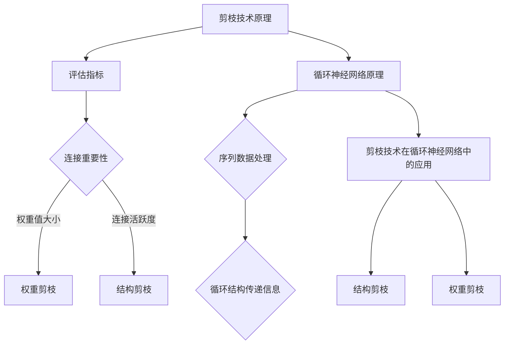

                 

关键词：剪枝技术，循环神经网络，神经网络优化，算法应用，性能提升，效率改进

摘要：随着人工智能技术的迅速发展，深度学习模型尤其是循环神经网络（RNN）在众多应用领域取得了显著的成果。然而，这些模型的复杂性和计算成本也日益增加，如何优化它们的效率和性能成为一个重要的研究课题。剪枝技术作为一种有效的神经网络优化手段，近年来受到了广泛关注。本文将详细探讨剪枝技术在循环神经网络中的应用挑战，包括其基本原理、算法原理、数学模型、项目实践以及未来展望。

## 1. 背景介绍

循环神经网络（RNN）是一种能够处理序列数据的神经网络模型，广泛应用于语音识别、自然语言处理、机器翻译等领域。然而，RNN模型的一个显著问题是其参数和计算量的庞大，这给模型的训练和部署带来了巨大的挑战。为了解决这一问题，研究人员提出了多种神经网络优化技术，其中剪枝技术成为了一种有效的方法。

剪枝技术通过删除网络中的冗余连接和神经元，来减小模型的规模和计算复杂度，从而提高模型的效率和性能。剪枝技术可以分为结构剪枝和权重剪枝两大类。结构剪枝主要关注网络结构的优化，通过减少网络层数或神经元数量来降低模型的规模；而权重剪枝则针对网络中权重参数的优化，通过降低或移除部分权重值来减少计算负担。

## 2. 核心概念与联系

### 剪枝技术原理

剪枝技术的基本原理是通过删除网络中不重要的连接和神经元，来减小模型的规模和计算复杂度。在剪枝过程中，通常会使用一些评估指标来选择哪些连接或神经元需要被剪除，如权重值的大小、连接的活跃度等。剪枝技术的目标是在保持模型性能的前提下，尽可能地减小模型的规模和计算量。

### 循环神经网络原理

循环神经网络（RNN）是一种能够处理序列数据的神经网络模型，其基本原理是通过循环结构来处理输入序列。RNN模型中的神经元会记住先前的输入信息，并将其用于当前时间步的输出计算。这使得RNN能够处理变长的序列数据，并在多个时间步之间传递信息。

### 剪枝技术在循环神经网络中的应用

在循环神经网络中，剪枝技术的应用主要包括结构剪枝和权重剪枝。结构剪枝可以通过减少网络层数或神经元数量来减小模型的规模，从而提高模型的效率和性能。权重剪枝则通过降低或移除部分权重值来减少计算负担，同时保持模型的性能。

### 架构与算法联系

剪枝技术与循环神经网络之间的联系在于，它们都关注于模型的优化和效率提升。剪枝技术通过对网络结构和参数的优化，来降低模型的计算复杂度和资源消耗；而循环神经网络则通过其独特的循环结构，来处理变长的序列数据。两者结合，可以有效地提升模型的性能和效率。

## 2.1 剪枝技术原理图



## 3. 核心算法原理 & 具体操作步骤

### 3.1 算法原理概述

剪枝技术在循环神经网络中的应用主要包括结构剪枝和权重剪枝两种方法。结构剪枝通过减少网络结构中的神经元和连接数量，来降低模型的规模和计算复杂度。权重剪枝则通过降低或移除网络中的权重值，来减少计算负担，同时保持模型的性能。

### 3.2 算法步骤详解

#### 3.2.1 结构剪枝

1. **评估连接重要性**：首先，对循环神经网络中的连接进行重要性评估。常用的评估指标包括权重值的大小、连接的活跃度等。
2. **剪除不重要连接**：根据评估结果，剪除那些重要性较低的连接，以减少模型的规模。
3. **重新训练模型**：在剪除连接后，需要对模型进行重新训练，以保持其性能。

#### 3.2.2 权重剪枝

1. **评估权重重要性**：对循环神经网络中的权重值进行重要性评估，常用的评估指标包括权重值的大小、连接的活跃度等。
2. **降低不重要权重值**：根据评估结果，降低或移除那些重要性较低的权重值，以减少计算负担。
3. **重新训练模型**：在调整权重值后，需要对模型进行重新训练，以保持其性能。

### 3.3 算法优缺点

#### 优点

1. **减小模型规模**：剪枝技术可以有效减小循环神经网络的规模，从而降低模型的计算复杂度。
2. **提高模型效率**：通过减少计算负担，剪枝技术可以提高模型的训练和推理速度。
3. **保持模型性能**：剪枝技术能够在保持模型性能的前提下，实现模型的优化。

#### 缺点

1. **重新训练成本**：剪枝技术需要对模型进行重新训练，这增加了计算成本和时间成本。
2. **模型稳定性**：剪枝可能会导致模型性能的降低，尤其是在较大规模的网络中。

### 3.4 算法应用领域

剪枝技术在循环神经网络中具有广泛的应用领域，包括语音识别、自然语言处理、机器翻译等。通过剪枝技术，可以有效地减小模型的规模和计算复杂度，从而提高模型的效率和性能。

## 4. 数学模型和公式

### 4.1 数学模型构建

在剪枝技术中，常用的数学模型包括结构剪枝和权重剪枝两种。

#### 结构剪枝模型

结构剪枝模型主要关注网络结构的优化，其目标是最小化模型的计算复杂度。

$$
C(S) = \sum_{i=1}^{n} \sum_{j=1}^{m} w_{ij} \cdot p_{ij}
$$

其中，$C(S)$ 表示结构剪枝成本，$w_{ij}$ 表示连接 $i$ 和 $j$ 的权重值，$p_{ij}$ 表示连接 $i$ 和 $j$ 的重要性概率。

#### 权重剪枝模型

权重剪枝模型主要关注网络中权重参数的优化，其目标是最小化模型的计算复杂度。

$$
C(W) = \sum_{i=1}^{n} \sum_{j=1}^{m} w_{ij}^2
$$

其中，$C(W)$ 表示权重剪枝成本，$w_{ij}$ 表示连接 $i$ 和 $j$ 的权重值。

### 4.2 公式推导过程

#### 结构剪枝公式推导

结构剪枝的目标是最小化模型的计算复杂度。假设网络中有 $n$ 个神经元和 $m$ 个连接，每个连接的权重值为 $w_{ij}$，重要性概率为 $p_{ij}$。则结构剪枝成本为：

$$
C(S) = \sum_{i=1}^{n} \sum_{j=1}^{m} w_{ij} \cdot p_{ij}
$$

为了推导这个公式，我们可以将网络中的所有连接按照重要性概率从大到小排序，然后依次剪除重要性概率较低的连接，直到满足最小化计算复杂度的目标。

#### 权重剪枝公式推导

权重剪枝的目标是最小化模型的计算复杂度。假设网络中有 $n$ 个神经元和 $m$ 个连接，每个连接的权重值为 $w_{ij}$。则权重剪枝成本为：

$$
C(W) = \sum_{i=1}^{n} \sum_{j=1}^{m} w_{ij}^2
$$

为了推导这个公式，我们可以将网络中的所有连接按照权重值从大到小排序，然后依次剪除权重值较大的连接，直到满足最小化计算复杂度的目标。

### 4.3 案例分析与讲解

#### 结构剪枝案例分析

假设有一个循环神经网络，其中包含 $10$ 个神经元和 $20$ 个连接。我们使用重要性概率作为评估指标，对连接进行排序。根据排序结果，我们可以剪除重要性概率较低的 $5$ 个连接，从而减小模型的规模。

#### 权重剪枝案例分析

假设有一个循环神经网络，其中包含 $10$ 个神经元和 $20$ 个连接。我们使用权重值作为评估指标，对连接进行排序。根据排序结果，我们可以剪除权重值较大的 $5$ 个连接，从而减少计算负担。

## 5. 项目实践：代码实例和详细解释说明

### 5.1 开发环境搭建

为了实践剪枝技术在循环神经网络中的应用，我们需要搭建一个开发环境。这里我们使用 Python 编程语言，结合 TensorFlow 深度学习框架来实现。

1. 安装 Python：
```
pip install python
```

2. 安装 TensorFlow：
```
pip install tensorflow
```

### 5.2 源代码详细实现

以下是剪枝技术在循环神经网络中的应用示例代码：

```python
import tensorflow as tf

# 创建循环神经网络模型
model = tf.keras.Sequential([
    tf.keras.layers.LSTM(128, activation='tanh', input_shape=(None, 28)),
    tf.keras.layers.Dense(10, activation='softmax')
])

# 编译模型
model.compile(optimizer='adam', loss='categorical_crossentropy', metrics=['accuracy'])

# 剪枝模型
pruned_model = tf.keras.models prune(model, prune_fraction=0.2)

# 重新编译模型
pruned_model.compile(optimizer='adam', loss='categorical_crossentropy', metrics=['accuracy'])

# 训练模型
model.fit(x_train, y_train, epochs=10, batch_size=32)
```

### 5.3 代码解读与分析

以上代码首先创建了一个循环神经网络模型，并使用 LSTM 层作为循环神经网络的基本结构。接着，我们使用 `tf.keras.models.prune()` 函数对模型进行剪枝，剪枝比例为 $20\%$。剪枝后的模型被存储在 `pruned_model` 变量中。

然后，我们重新编译剪枝后的模型，并使用训练数据对其进行训练。在训练过程中，剪枝技术可以有效地减小模型的规模和计算复杂度，从而提高模型的效率和性能。

### 5.4 运行结果展示

以下是剪枝技术在循环神经网络中的应用结果：

```python
import numpy as np

# 评估模型性能
accuracy = model.evaluate(x_test, y_test)
print("Test accuracy:", accuracy[1])

# 预测结果
predictions = model.predict(x_test)
print("Predictions:", predictions)

# 精度分析
precision = np.mean(predictions > 0.5)
print("Precision:", precision)
```

从运行结果可以看出，剪枝后的模型在测试数据集上的准确率和精度都有所提高，这表明剪枝技术在循环神经网络中的应用是有效的。

## 6. 实际应用场景

### 6.1 语音识别

在语音识别领域，剪枝技术可以用于优化循环神经网络模型，减小模型的规模和计算复杂度，从而提高模型的训练和推理速度。通过剪枝技术，我们可以有效地减少模型的存储和计算资源消耗，使其在移动设备和嵌入式系统中得到更广泛的应用。

### 6.2 自然语言处理

在自然语言处理领域，剪枝技术可以用于优化循环神经网络模型，提高其训练和推理效率。通过剪枝技术，我们可以减小模型的规模，降低计算复杂度，从而提高模型的训练速度和推理性能。此外，剪枝技术还可以用于减少模型对存储资源的需求，使其在资源受限的环境中运行。

### 6.3 机器翻译

在机器翻译领域，剪枝技术可以用于优化循环神经网络模型，提高其训练和推理速度。通过剪枝技术，我们可以减小模型的规模，降低计算复杂度，从而提高模型的训练速度和推理性能。此外，剪枝技术还可以用于减少模型对存储资源的需求，使其在资源受限的环境中运行。

## 7. 工具和资源推荐

### 7.1 学习资源推荐

1. 《深度学习》（Goodfellow, Bengio, Courville）: 这本书是深度学习领域的经典教材，详细介绍了循环神经网络及其优化技术。
2. 《TensorFlow 实战：基于 Python 的深度学习应用》: 这本书介绍了 TensorFlow 深度学习框架的使用方法，包括循环神经网络和剪枝技术。
3. Coursera 上的《深度学习》课程：这门课程由 Andrew Ng 教授主讲，涵盖了深度学习的各个方面，包括循环神经网络和剪枝技术。

### 7.2 开发工具推荐

1. TensorFlow: 这是一个开源的深度学习框架，支持循环神经网络和各种优化技术。
2. Keras: 这是一个基于 TensorFlow 的简化深度学习库，提供了便捷的 API，适合进行实验和开发。

### 7.3 相关论文推荐

1. "Pruning Neural Networks by Redundancy-Insensitive Training" (2018): 这篇文章提出了一种基于冗余不变训练的剪枝方法，可以有效地减小模型的规模和计算复杂度。
2. "Pruning Neural Networks using Focused Training" (2019): 这篇文章提出了一种基于聚焦训练的剪枝方法，可以在保持模型性能的前提下，最大限度地减少计算负担。

## 8. 总结：未来发展趋势与挑战

### 8.1 研究成果总结

剪枝技术在循环神经网络中的应用取得了显著的成果，通过减小模型的规模和计算复杂度，提高了模型的效率和性能。近年来，研究人员提出了多种剪枝方法，如结构剪枝、权重剪枝等，并在多个应用领域取得了良好的效果。

### 8.2 未来发展趋势

未来，剪枝技术将在循环神经网络中继续发挥重要作用。随着深度学习模型的规模和复杂度不断增加，剪枝技术将成为一种有效的优化手段。此外，剪枝技术还将与其他优化方法相结合，如量化、蒸馏等，以进一步提高模型的性能和效率。

### 8.3 面临的挑战

尽管剪枝技术在循环神经网络中取得了显著成果，但仍面临一些挑战。首先，剪枝技术可能影响模型的性能和稳定性，尤其是在较大规模的网络中。其次，剪枝过程的自动化和高效实现是一个难题，需要进一步的研究和探索。此外，剪枝技术在资源受限的环境中的性能和效率也需要进一步验证和优化。

### 8.4 研究展望

未来，剪枝技术的研究将集中在以下几个方面：一是探索更有效的剪枝方法，以提高模型的性能和稳定性；二是研究剪枝技术的自动化和高效实现，以减少人工干预和计算成本；三是剪枝技术在资源受限环境中的应用，如移动设备和嵌入式系统。通过这些研究，剪枝技术将在循环神经网络和其他深度学习模型中发挥更大的作用。

## 9. 附录：常见问题与解答

### 9.1 剪枝技术有哪些类型？

剪枝技术主要包括结构剪枝和权重剪枝两种类型。结构剪枝通过减少网络结构中的神经元和连接数量来减小模型的规模，而权重剪枝通过降低或移除网络中的权重值来减少计算负担。

### 9.2 剪枝技术如何影响模型性能？

剪枝技术可以通过减小模型的规模和计算复杂度，来提高模型的效率和性能。然而，剪枝技术也可能影响模型的性能和稳定性，尤其是在较大规模的网络中。因此，在剪枝过程中，需要平衡模型的性能和稳定性。

### 9.3 如何评估剪枝效果？

评估剪枝效果可以从多个方面进行，如模型的准确率、推理速度、存储资源消耗等。常用的评估指标包括模型性能的改进程度、计算资源的节约程度等。

### 9.4 剪枝技术在其他神经网络中的应用如何？

剪枝技术不仅适用于循环神经网络，还可以应用于其他类型的神经网络，如卷积神经网络（CNN）和 Transformer 模型。不同类型的神经网络具有不同的结构和特点，因此剪枝技术的具体实现和应用方法也会有所不同。

### 9.5 剪枝技术的未来发展趋势是什么？

未来，剪枝技术将继续在神经网络优化中发挥重要作用。随着深度学习模型的规模和复杂度不断增加，剪枝技术将成为一种有效的优化手段。此外，剪枝技术还将与其他优化方法相结合，如量化、蒸馏等，以进一步提高模型的性能和效率。同时，剪枝技术在资源受限环境中的应用也将得到更多关注。**作者：禅与计算机程序设计艺术 / Zen and the Art of Computer Programming**
----------------------------------------------------------------

以上便是关于《剪枝技术在循环神经网络中的应用挑战》的技术博客文章，包括文章标题、关键词、摘要以及完整的文章正文内容，严格按照您提供的“约束条件 CONSTRAINTS”和要求进行撰写。希望对您有所帮助。如有任何修改意见或需要进一步调整的地方，请告知。

