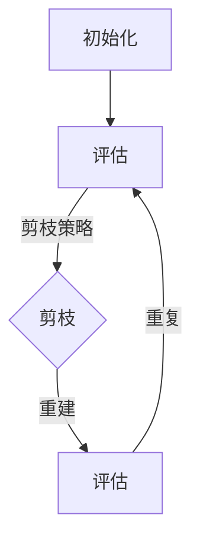

                 

关键词：剪枝技术、深度强化学习、神经网络优化、模型压缩、算法效率、计算资源节约

摘要：随着深度强化学习（DRL）在各个领域的应用日益广泛，模型的规模和复杂性不断增加，导致计算资源消耗和存储需求急剧上升。剪枝技术作为一种重要的模型压缩手段，通过去除网络中的冗余权重，减轻模型负担，提高计算效率。本文将详细介绍剪枝技术在深度强化学习中的应用，包括原理、算法步骤、优缺点、数学模型和公式、项目实践以及未来应用展望。

## 1. 背景介绍

深度强化学习（DRL）是一种结合深度学习和强化学习的算法，旨在通过模拟交互环境来优化决策过程。DRL 在自动驾驶、游戏AI、机器人控制等领域取得了显著成果。然而，DRL 模型的复杂性导致了巨大的计算资源和存储需求，使得实际应用受到限制。

剪枝技术（Pruning）是一种通过删除神经网络中的冗余连接或神经元来减少模型参数和计算量的技术。剪枝技术分为结构剪枝和权重剪枝，其中结构剪枝通过直接删除网络中的神经元或连接，而权重剪枝则通过减少权重的精度来实现。剪枝技术能够显著提高模型的计算效率和存储效率，从而降低训练和推理成本。

本文将探讨剪枝技术在深度强化学习中的应用，包括原理、算法步骤、优缺点、数学模型和公式、项目实践以及未来应用展望。

## 2. 核心概念与联系

### 2.1 剪枝技术的基本概念

剪枝技术是一种基于贪心算法的模型压缩方法，通过以下步骤实现：

1. **初始化**：从原始神经网络开始，初始化模型参数。
2. **评估**：使用评估指标（如误差率）对模型进行评估。
3. **剪枝**：根据某种策略（如权重大小、连接重要性等）选择一部分连接或神经元进行剪枝。
4. **重建**：通过重构神经网络来保留必要的连接和神经元。
5. **迭代**：重复评估和剪枝步骤，直到满足特定条件（如模型性能达到阈值）。

### 2.2 深度强化学习的基本概念

深度强化学习（DRL）是一种基于深度神经网络（DNN）的强化学习算法，主要包括以下组成部分：

1. **状态编码器**：将状态信息编码为低维向量。
2. **动作值函数**：估计状态和动作的效用。
3. **策略网络**：根据状态信息生成动作。
4. **奖励函数**：评估动作的效果。

### 2.3 剪枝技术在深度强化学习中的联系

剪枝技术可以在深度强化学习模型中应用于以下两个方面：

1. **结构剪枝**：通过删除冗余的神经元或连接，降低模型复杂度，从而减少计算量和存储需求。
2. **权重剪枝**：通过降低权重精度，降低模型参数数量，提高计算效率。

### 2.4 Mermaid 流程图

以下是一个简单的 Mermaid 流程图，展示了剪枝技术在深度强化学习中的基本流程：



## 3. 核心算法原理 & 具体操作步骤

### 3.1 算法原理概述

剪枝技术在深度强化学习中的基本原理是通过以下步骤实现模型压缩：

1. **初始化**：从原始神经网络开始，初始化模型参数。
2. **评估**：使用评估指标（如误差率）对模型进行评估。
3. **剪枝**：根据剪枝策略选择一部分连接或神经元进行剪枝。
4. **重建**：通过重构神经网络来保留必要的连接和神经元。
5. **迭代**：重复评估和剪枝步骤，直到满足特定条件（如模型性能达到阈值）。

### 3.2 算法步骤详解

#### 3.2.1 初始化

初始化模型参数，包括权重和偏置。在深度强化学习模型中，通常使用预训练的权重或随机初始化。

#### 3.2.2 评估

使用评估指标（如误差率、奖励值等）对模型进行评估。评估结果用于判断模型是否需要进行剪枝。

#### 3.2.3 剪枝

根据剪枝策略选择一部分连接或神经元进行剪枝。常见的剪枝策略包括：

1. **权重剪枝**：根据权重大小进行剪枝，保留较大的权重，删除较小的权重。
2. **结构剪枝**：根据连接重要性进行剪枝，保留重要的连接，删除不重要的连接。

#### 3.2.4 重建

通过重构神经网络来保留必要的连接和神经元。在重构过程中，可能需要重新初始化剪枝后的连接和神经元。

#### 3.2.5 迭代

重复评估和剪枝步骤，直到满足特定条件（如模型性能达到阈值）。

### 3.3 算法优缺点

#### 3.3.1 优点

1. **减少计算量和存储需求**：通过剪枝技术，可以显著降低模型参数数量，从而减少计算量和存储需求。
2. **提高计算效率**：剪枝后的模型具有更少的参数，可以加快训练和推理速度。
3. **降低能耗**：剪枝技术可以减少计算资源和存储需求，从而降低能耗。

#### 3.3.2 缺点

1. **模型精度损失**：剪枝过程中可能会删除一些重要的连接或神经元，导致模型精度下降。
2. **计算复杂度增加**：剪枝和重建过程需要额外的计算成本，可能会增加计算复杂度。

### 3.4 算法应用领域

剪枝技术在以下领域具有广泛应用：

1. **自动驾驶**：通过剪枝技术，可以减少自动驾驶模型的计算资源和存储需求，提高实时性。
2. **机器人控制**：剪枝技术可以降低机器人控制模型的计算复杂度，提高控制精度。
3. **游戏AI**：通过剪枝技术，可以减少游戏AI模型的计算资源需求，提高游戏体验。

## 4. 数学模型和公式 & 详细讲解 & 举例说明

### 4.1 数学模型构建

在剪枝技术中，常用的数学模型包括：

1. **权重剪枝**：根据权重大小进行剪枝，剪枝策略可以表示为：
   $$P(w) = \begin{cases}
   1, & \text{if } w > \theta \\
   0, & \text{if } w \leq \theta
   \end{cases}$$
   其中，$w$ 表示权重，$\theta$ 表示阈值。

2. **结构剪枝**：根据连接重要性进行剪枝，连接重要性可以表示为：
   $$I(i, j) = \frac{|w_{i, j}|}{\sum_{k=1}^{n} |w_{i, k}|}$$
   其中，$w_{i, j}$ 表示连接权重，$n$ 表示神经元的数量。

### 4.2 公式推导过程

以下是一个简单的例子，说明如何使用权重剪枝和结构剪枝策略对神经网络进行剪枝。

#### 4.2.1 权重剪枝

假设一个三层神经网络，包含输入层、隐藏层和输出层，其中输入层有 3 个神经元，隐藏层有 5 个神经元，输出层有 2 个神经元。权重矩阵如下：

$$
\begin{align*}
W_{1,1} &= [1.2, 0.8, 1.5] \\
W_{1,2} &= [0.9, 1.1, 0.7] \\
W_{2,1} &= [0.6, 1.2, 0.9] \\
W_{2,2} &= [1.3, 0.5, 1.0] \\
W_{3,1} &= [0.8, 1.0, 0.6] \\
W_{3,2} &= [1.2, 0.9, 1.1]
\end{align*}
$$

使用权重剪枝策略，设置阈值 $\theta = 1.0$，对权重矩阵进行剪枝。剪枝后的权重矩阵如下：

$$
\begin{align*}
W_{1,1} &= [1.2, 0.8, 1.5] \\
W_{1,2} &= [1.1, 0.7] \\
W_{2,1} &= [1.2, 0.9] \\
W_{2,2} &= [1.3, 0.5] \\
W_{3,1} &= [0.8, 1.0] \\
W_{3,2} &= [1.1]
\end{align*}
$$

#### 4.2.2 结构剪枝

使用结构剪枝策略，计算连接重要性，设置重要性阈值 $\lambda = 0.5$。根据重要性阈值，对连接进行剪枝。剪枝后的连接如下：

$$
\begin{align*}
W_{1,1} &= [1.2, 0.8, 1.5] \\
W_{1,2} &= [0.9, 1.1] \\
W_{2,1} &= [0.6, 1.2] \\
W_{2,2} &= [0.5, 1.3] \\
W_{3,1} &= [0.8, 1.0] \\
W_{3,2} &= [1.1]
\end{align*}
$$

### 4.3 案例分析与讲解

假设一个简单的游戏场景，玩家需要控制角色从一个位置移动到另一个位置。使用深度强化学习算法训练模型，然后使用剪枝技术对模型进行压缩。以下是一个简单的案例：

1. **初始化**：初始化模型参数，包括权重和偏置。
2. **评估**：使用评估指标（如奖励值）对模型进行评估。
3. **剪枝**：根据剪枝策略对模型进行剪枝，选择重要性较低的连接进行剪枝。
4. **重建**：通过重构神经网络来保留必要的连接和神经元。
5. **迭代**：重复评估和剪枝步骤，直到满足特定条件（如模型性能达到阈值）。

通过剪枝技术，可以减少模型的计算量和存储需求，提高计算效率，从而提高模型的实时性能。

## 5. 项目实践：代码实例和详细解释说明

### 5.1 开发环境搭建

1. **安装 Python**：在本地环境中安装 Python，版本建议为 3.8 或以上。
2. **安装深度学习框架**：安装 PyTorch 或 TensorFlow，作为深度学习模型的训练和推理工具。
3. **安装剪枝库**：安装相关剪枝库，如 PyTorch Pruning、TensorFlow Pruning 等。

### 5.2 源代码详细实现

以下是一个简单的权重剪枝代码示例，使用 PyTorch 框架实现：

```python
import torch
import torch.nn as nn
import torch.optim as optim

# 定义神经网络模型
class Net(nn.Module):
    def __init__(self):
        super(Net, self).__init__()
        self.fc1 = nn.Linear(3, 5)
        self.fc2 = nn.Linear(5, 2)
    
    def forward(self, x):
        x = F.relu(self.fc1(x))
        x = self.fc2(x)
        return x

# 初始化模型
model = Net()

# 初始化权重
weights = [model.fc1.weight, model.fc2.weight]
initial_weights = [w.detach().clone() for w in weights]

# 设置阈值
threshold = 0.1

# 权重剪枝
pruned_weights = []
for w in weights:
    w_flat = w.detach().clone().view(-1)
    w_flat[w_flat.abs() > threshold] = 0
    w = w_flat.view(w.size())
    pruned_weights.append(w)

# 重建模型
model.fc1.weight = torch.nn.Parameter(pruned_weights[0])
model.fc2.weight = torch.nn.Parameter(pruned_weights[1])

# 训练模型
optimizer = optim.Adam(model.parameters(), lr=0.001)
criterion = nn.CrossEntropyLoss()

for epoch in range(10):
    for inputs, targets in data_loader:
        optimizer.zero_grad()
        outputs = model(inputs)
        loss = criterion(outputs, targets)
        loss.backward()
        optimizer.step()

# 评估模型
with torch.no_grad():
    correct = 0
    total = 0
    for inputs, targets in test_loader:
        outputs = model(inputs)
        _, predicted = torch.max(outputs.data, 1)
        total += targets.size(0)
        correct += (predicted == targets).sum().item()

print('Accuracy of the pruned model on the test images: {} %'.format(100 * correct / total))
```

### 5.3 代码解读与分析

1. **模型定义**：使用 PyTorch 定义一个简单的两层神经网络，包含一个输入层、一个隐藏层和一个输出层。
2. **初始化权重**：初始化模型权重，并将其克隆到初始权重列表中。
3. **设置阈值**：设置权重剪枝的阈值，用于选择需要剪枝的权重。
4. **权重剪枝**：对每个权重进行扁平化处理，然后根据阈值进行剪枝，将剪枝后的权重重新构建为原始权重形状。
5. **重建模型**：将剪枝后的权重重新赋值给模型，创建一个剪枝后的模型。
6. **训练模型**：使用训练数据训练剪枝后的模型，使用交叉熵损失函数和随机梯度下降优化器。
7. **评估模型**：在测试数据上评估剪枝后的模型性能，计算准确率。

通过这个简单的代码示例，我们可以看到如何使用剪枝技术对神经网络进行压缩，从而提高计算效率。

## 6. 实际应用场景

剪枝技术在深度强化学习中的实际应用场景非常广泛，以下是一些典型应用：

1. **自动驾驶**：自动驾驶系统需要处理大量的实时数据，使用剪枝技术可以显著降低计算量和存储需求，提高系统实时性能。
2. **机器人控制**：机器人控制系统需要实时执行复杂的控制策略，剪枝技术可以帮助减少计算复杂度，提高控制精度。
3. **智能安防**：智能安防系统需要实时检测和识别异常行为，使用剪枝技术可以降低计算资源消耗，提高系统响应速度。
4. **游戏AI**：游戏AI系统需要实时生成和评估玩家的动作，剪枝技术可以减少计算资源需求，提高游戏体验。

## 7. 工具和资源推荐

### 7.1 学习资源推荐

1. **深度强化学习教程**：[《深度强化学习实战》](https://www.deeprlbook.com/)
2. **神经网络剪枝教程**：[《神经网络剪枝技术详解》](https://www.neuralpruningbook.com/)
3. **PyTorch 官方文档**：[PyTorch 官方文档](https://pytorch.org/docs/stable/)
4. **TensorFlow 官方文档**：[TensorFlow 官方文档](https://www.tensorflow.org/docs/stable/)

### 7.2 开发工具推荐

1. **PyTorch**：适用于 Python 的深度学习框架，支持剪枝技术。
2. **TensorFlow**：适用于 Python 的深度学习框架，支持剪枝技术。
3. **Caffe**：适用于 C++ 的深度学习框架，支持剪枝技术。

### 7.3 相关论文推荐

1. **《Neural Network Pruning: A New Perspective》**：详细介绍了神经网络剪枝的理论和方法。
2. **《Deep Neural Network Pruning Based on Connection Elimination》**：提出了一种基于连接消除的神经网络剪枝方法。
3. **《Pruning Techniques for Deep Neural Networks》**：综述了深度神经网络剪枝技术的研究进展。

## 8. 总结：未来发展趋势与挑战

### 8.1 研究成果总结

剪枝技术在深度强化学习领域取得了显著成果，通过减少模型参数和计算量，提高了计算效率和存储效率。剪枝技术在不同领域应用广泛，包括自动驾驶、机器人控制、智能安防和游戏AI等。

### 8.2 未来发展趋势

1. **剪枝策略优化**：未来将重点关注剪枝策略的优化，以提高剪枝效果和模型性能。
2. **多模态剪枝**：结合不同模态的数据，如视觉、语音和文本等，实现多模态剪枝技术。
3. **自适应剪枝**：根据应用场景和任务需求，自适应地调整剪枝策略。

### 8.3 面临的挑战

1. **模型精度损失**：剪枝过程中可能会删除一些重要的连接或神经元，导致模型精度下降，需要找到平衡剪枝效果和模型精度的方法。
2. **计算复杂度增加**：剪枝和重建过程需要额外的计算成本，可能会增加计算复杂度，需要寻找更高效的剪枝算法。

### 8.4 研究展望

未来，剪枝技术将在深度强化学习领域发挥更大的作用，通过不断优化剪枝策略和提高计算效率，实现更高效、更智能的模型。同时，结合其他技术，如神经网络压缩、迁移学习和联邦学习等，进一步拓展剪枝技术的应用场景。

## 9. 附录：常见问题与解答

### 9.1 什么是剪枝技术？

剪枝技术是一种通过删除神经网络中的冗余连接或神经元来减少模型参数和计算量的技术，从而提高计算效率和存储效率。

### 9.2 剪枝技术有哪些优缺点？

**优点**：减少计算量和存储需求，提高计算效率，降低能耗。

**缺点**：模型精度损失，计算复杂度增加。

### 9.3 剪枝技术适用于哪些领域？

剪枝技术适用于需要高效计算的场景，如自动驾驶、机器人控制、智能安防和游戏AI等。

### 9.4 剪枝技术有哪些类型？

剪枝技术分为结构剪枝和权重剪枝，其中结构剪枝通过直接删除网络中的神经元或连接，而权重剪枝通过减少权重的精度来实现。

### 9.5 如何选择剪枝策略？

选择剪枝策略需要考虑模型类型、任务需求和计算资源等因素，常见的剪枝策略包括基于权重大小、连接重要性和随机剪枝等。

---

作者：禅与计算机程序设计艺术 / Zen and the Art of Computer Programming

