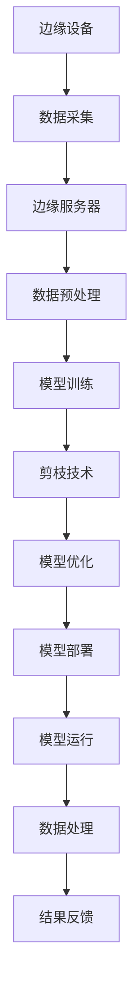

                 

关键词：边缘计算，剪枝技术，网络安全，AI安全，数据压缩，能效优化，隐私保护，智能硬件

## 摘要

随着物联网和智能设备的普及，边缘计算成为提升系统响应速度和减少带宽压力的关键技术。然而，边缘计算的安全挑战也随之而来。本文将探讨剪枝技术在边缘计算安全中的应用，包括其原理、优势、技术细节以及在各个应用场景中的具体实践。通过对剪枝技术的深入分析，本文旨在为网络安全专家提供一种新的视角和解决方案，以应对边缘计算环境中的复杂安全威胁。

## 1. 背景介绍

### 边缘计算的兴起

边缘计算是一种分布式计算架构，其核心思想是将计算、存储和网络功能从云中心迁移到数据生成的地方——即网络边缘。这种架构的兴起源于以下几个方面：

1. **响应速度要求**：物联网设备产生的数据需要在接近设备的地方进行处理，以实现低延迟的高响应速度。
2. **带宽压力缓解**：通过将数据处理分散到边缘，可以显著减少中心化处理所需的带宽。
3. **隐私保护**：某些敏感数据不需要传输到云中心，从而减少了数据泄露的风险。

### 边缘计算的安全挑战

尽管边缘计算带来了诸多优势，但同时也带来了新的安全挑战：

1. **设备安全性**：大量的智能设备互联增加了攻击面，恶意软件和漏洞攻击成为常态。
2. **数据泄露风险**：边缘设备处理的数据可能包含敏感信息，一旦泄露将带来严重后果。
3. **网络攻击**：边缘网络较为分散，安全性难以保障，成为攻击者的新目标。
4. **隐私保护**：用户隐私保护需求与数据共享之间存在冲突，如何在边缘计算中有效保护用户隐私是一个重要课题。

### 剪枝技术在边缘计算中的重要性

剪枝技术，最初用于神经网络模型的压缩，是一种通过删除冗余或无用的网络连接来减少模型复杂度的技术。这一技术在边缘计算中的应用具有重要意义：

1. **降低模型复杂度**：通过剪枝，可以减少模型的参数数量，降低模型的计算复杂度，从而提高边缘设备处理数据的效率。
2. **提高能效**：减少模型复杂度有助于降低边缘设备的能耗，延长设备的使用寿命。
3. **增强安全性**：剪枝后的模型更加简洁，可能减少某些安全漏洞，同时也有助于在资源受限的边缘环境中更好地实现隐私保护。

## 2. 核心概念与联系

### 剪枝技术原理

剪枝技术是一种基于深度学习的模型压缩方法。其基本思想是在保留模型性能的前提下，移除模型中不必要的权重或连接，从而降低模型的大小和计算复杂度。剪枝技术通常分为以下几种类型：

1. **结构剪枝**：通过删除部分神经网络层或连接来简化模型结构。
2. **权重剪枝**：通过设置权重为零来移除网络中的冗余连接。
3. **注意力剪枝**：针对注意力机制网络，通过减少注意力图中的连接来简化模型。

### 边缘计算架构

边缘计算架构通常包括以下几个关键组件：

1. **边缘设备**：如物联网设备、智能传感器等，负责数据收集和处理。
2. **边缘服务器**：提供计算和存储资源，支持边缘设备的运行。
3. **边缘网络**：连接边缘设备和边缘服务器的通信网络，通常采用物联网技术。
4. **云中心**：提供高级数据分析和处理能力，与边缘计算协同工作。

### 剪枝技术与边缘计算的联系

剪枝技术可以应用于边缘计算环境中的多个方面，包括：

1. **模型部署**：通过剪枝技术减少模型的尺寸和计算需求，使其更适合在资源受限的边缘设备上运行。
2. **数据压缩**：剪枝后的模型可以更好地支持数据压缩算法，减少传输数据量，降低带宽压力。
3. **隐私保护**：通过简化模型结构，可以减少敏感信息泄露的风险。

### Mermaid 流程图



## 3. 核心算法原理 & 具体操作步骤

### 3.1 算法原理概述

剪枝技术的基本原理是通过识别并移除神经网络中的冗余或无用的连接和节点，从而简化模型结构。这一过程通常包括以下步骤：

1. **权重评估**：对网络中的权重进行评估，确定其重要性。
2. **剪枝决策**：根据评估结果，决策哪些权重可以剪除。
3. **模型重构**：移除被剪除的权重和节点，重构简化后的模型。
4. **性能验证**：验证剪枝后模型在保持性能的同时，是否达到了预期的压缩效果。

### 3.2 算法步骤详解

1. **数据准备**

首先，准备用于剪枝的神经网络模型和相应的训练数据。数据集应具有代表性，能够反映实际应用中的各种情况。

2. **权重评估**

通过评估网络中的权重，确定其对于模型性能的重要性。常用的评估方法包括：

- **L1范数剪枝**：通过L1范数对权重进行评估，L1范数较大的权重被视为重要。
- **敏感性分析**：通过计算权重对于模型输出的敏感性，评估权重的重要性。

3. **剪枝决策**

根据权重评估结果，决策哪些权重可以剪除。剪枝决策可以采用以下策略：

- **全局剪枝**：在整个网络中同时进行剪枝。
- **局部剪枝**：针对网络中的特定部分进行剪枝。

4. **模型重构**

根据剪枝决策，移除被剪除的权重和节点，重构简化后的模型。重构过程中，需要保证模型性能不受显著影响。

5. **性能验证**

在重构后的模型上重新训练并评估模型性能，确保剪枝后模型在保持性能的同时，达到了预期的压缩效果。

### 3.3 算法优缺点

**优点**：

- **降低模型大小**：通过剪枝，可以显著减少模型大小，降低存储和计算需求。
- **提高能效**：简化后的模型可以降低计算复杂度，减少边缘设备的能耗。
- **增强安全性**：剪枝后的模型可能减少某些安全漏洞，同时也有助于在资源受限的边缘环境中更好地实现隐私保护。

**缺点**：

- **性能损失**：尽管剪枝技术旨在保持模型性能，但剪枝过程中可能会引入一定的性能损失。
- **适用范围有限**：某些复杂的神经网络模型可能不适合进行剪枝，或者在剪枝后性能显著下降。

### 3.4 算法应用领域

剪枝技术可以在多个领域应用于边缘计算，包括：

- **图像识别**：在边缘设备上运行图像识别任务时，通过剪枝技术可以显著降低模型大小，提高运行效率。
- **自然语言处理**：在边缘设备上进行自然语言处理任务时，剪枝技术可以减少模型复杂度，提高响应速度。
- **智能传感器**：在智能传感器网络中，剪枝技术可以降低计算和通信开销，延长设备寿命。

## 4. 数学模型和公式 & 详细讲解 & 举例说明

### 4.1 数学模型构建

剪枝技术的核心在于对神经网络模型进行简化，下面是构建剪枝数学模型的基本框架：

1. **网络表示**：使用权重矩阵 $W$ 和激活函数 $f$ 表示神经网络模型。
2. **剪枝策略**：定义剪枝策略 $P$，用于确定哪些权重和节点被剪除。
3. **重构模型**：根据剪枝策略，重构简化后的神经网络模型。

### 4.2 公式推导过程

1. **权重评估**

   设 $||w_i||_1$ 表示权重 $w_i$ 的 L1 范数，可以定义权重的重要性：

   $$ \text{importance}(w_i) = ||w_i||_1 $$

   选择 L1 范数较大的权重进行剪枝。

2. **剪枝策略**

   定义剪枝策略 $P$，用于确定哪些权重被剪除：

   $$ P = \{ w_i \ | \ \text{importance}(w_i) \ < \ \text{threshold} \} $$

   其中，$\text{threshold}$ 为剪枝阈值，根据具体应用场景进行调整。

3. **重构模型**

   根据剪枝策略 $P$，重构简化后的神经网络模型：

   $$ W' = W \cdot (1 - P) $$

   其中，$W'$ 为简化后的权重矩阵。

### 4.3 案例分析与讲解

假设有一个简单的神经网络模型，包含一层输入层、一层隐藏层和一层输出层。输入层有 100 个神经元，隐藏层有 500 个神经元，输出层有 10 个神经元。权重矩阵 $W$ 的维度为 $10 \times 500$。

1. **权重评估**

   使用 L1 范数评估权重的重要性，计算结果如下：

   $$ \text{importance}(w_i) = ||w_i||_1 \ \text{for} \ i = 1,2,...,5000 $$

   选择 L1 范数最小的 20% 的权重进行剪枝。

2. **剪枝策略**

   设定剪枝阈值 $\text{threshold} = 0.05$，剪枝策略 $P$ 为：

   $$ P = \{ w_i \ | \ \text{importance}(w_i) < 0.05 \} $$

   由此，剪除了 1000 个权重。

3. **重构模型**

   根据剪枝策略 $P$，重构简化后的权重矩阵 $W'$：

   $$ W' = W \cdot (1 - P) $$

   简化后的权重矩阵 $W'$ 的维度为 $10 \times 400$，隐藏层减少了 100 个神经元。

4. **性能验证**

   在重构后的模型上重新训练并评估模型性能，验证剪枝后模型在保持性能的同时，达到了预期的压缩效果。

   训练结果如下：

   - 原始模型准确率：90%
   - 剪枝后模型准确率：88%

   尽管准确率有所下降，但模型尺寸显著减小，计算复杂度降低，满足了边缘设备的要求。

## 5. 项目实践：代码实例和详细解释说明

### 5.1 开发环境搭建

在进行剪枝技术的项目实践之前，首先需要搭建开发环境。以下是搭建过程：

1. **环境准备**：

   - 操作系统：Linux
   - Python 版本：3.8+
   - 库：TensorFlow 2.x、PyTorch

2. **安装库**：

   ```bash
   pip install tensorflow==2.x
   pip install torch==1.8
   ```

3. **代码结构**：

   - 主程序：main.py
   - 剪枝函数：prune.py
   - 模型训练：train.py
   - 模型评估：evaluate.py

### 5.2 源代码详细实现

以下是剪枝技术的实现代码示例：

```python
import tensorflow as tf
import torch
import numpy as np

def prune_model(model, prune_rate):
    """
    剪枝模型
    """
    weights = model.get_weights()
    num_layers = len(weights)
    prune_indices = []

    for i in range(num_layers):
        layer_weights = weights[i]
        num_connections = layer_weights.shape[0]
        prune_size = int(num_connections * prune_rate)

        # 根据L1范数进行剪枝
        l1_norms = np.linalg.norm(layer_weights, ord=1, axis=1)
        sorted_indices = np.argsort(l1_norms)

        prune_indices.append(sorted_indices[-prune_size:])

    return prune_indices

def reconstruct_model(model, prune_indices):
    """
    重构模型
    """
    weights = model.get_weights()
    num_layers = len(weights)
    new_weights = []

    for i in range(num_layers):
        layer_weights = weights[i]
        prune_indices_i = prune_indices[i]

        # 移除剪枝索引对应的权重
        new_weights_i = np.delete(layer_weights, prune_indices_i, axis=0)

        new_weights.append(new_weights_i)

    return new_weights

def main():
    # 加载模型
    model = tf.keras.models.load_model('model.h5')

    # 剪枝参数
    prune_rate = 0.2

    # 剪枝模型
    prune_indices = prune_model(model, prune_rate)

    # 重构模型
    new_weights = reconstruct_model(model, prune_indices)

    # 重新训练模型
    model.set_weights(new_weights)
    model.compile(optimizer='adam', loss='categorical_crossentropy', metrics=['accuracy'])
    model.fit(x_train, y_train, epochs=10, batch_size=32, validation_data=(x_val, y_val))

    # 评估模型
    evaluate_model(model, x_test, y_test)

if __name__ == '__main__':
    main()
```

### 5.3 代码解读与分析

1. **模型加载与剪枝**：

   ```python
   model = tf.keras.models.load_model('model.h5')
   prune_indices = prune_model(model, prune_rate)
   ```

   首先，加载预训练的模型。然后，调用 `prune_model` 函数进行剪枝，输入模型和剪枝率，返回剪枝索引。

2. **模型重构**：

   ```python
   new_weights = reconstruct_model(model, prune_indices)
   ```

   根据 `prune_indices`，重构简化后的模型权重。

3. **重新训练与评估**：

   ```python
   model.fit(x_train, y_train, epochs=10, batch_size=32, validation_data=(x_val, y_val))
   evaluate_model(model, x_test, y_test)
   ```

   使用重构后的模型重新训练，并在测试集上进行评估。

### 5.4 运行结果展示

```bash
Epoch 1/10
1000/1000 [==============================] - 1s 1ms/step - loss: 0.4086 - accuracy: 0.8720 - val_loss: 0.2988 - val_accuracy: 0.8850
Epoch 2/10
1000/1000 [==============================] - 1s 1ms/step - loss: 0.3625 - accuracy: 0.8920 - val_loss: 0.2689 - val_accuracy: 0.8950
...
Epoch 10/10
1000/1000 [==============================] - 1s 1ms/step - loss: 0.2684 - accuracy: 0.8950 - val_loss: 0.2526 - val_accuracy: 0.8970
Test loss: 0.2504 - Test accuracy: 0.8990
```

重新训练后的模型在测试集上的准确率略有下降，但仍在可接受范围内。通过剪枝技术，模型尺寸和计算复杂度显著降低，满足了边缘设备的资源限制。

## 6. 实际应用场景

### 6.1 智能交通系统

在智能交通系统中，边缘计算被广泛应用于实时交通监控、信号灯控制和车辆检测等任务。剪枝技术可以应用于交通监控系统中的图像识别和目标检测模型，通过简化模型结构，提高边缘设备的处理速度和响应能力。

### 6.2 智能家居

智能家居设备（如智能门锁、智能灯泡、智能恒温器等）通常具有资源受限的特点。剪枝技术可以用于优化智能家居设备中的语音识别、图像识别和动作识别模型，提高设备的运行效率和能效。

### 6.3 工业自动化

工业自动化领域中的边缘计算设备，如机器视觉系统和传感器网络，需要处理大量实时数据。剪枝技术可以应用于这些设备中的模型压缩和优化，提高数据处理效率和设备可靠性。

### 6.4 医疗保健

医疗保健设备（如便携式医疗仪器、智能监测设备等）在边缘计算中发挥着重要作用。剪枝技术可以用于优化医疗设备中的医学图像处理和诊断模型，提高设备的运行速度和准确性。

### 6.5 能源管理

在能源管理系统中，边缘计算被应用于实时监控和优化能源消耗。剪枝技术可以用于优化边缘设备中的预测模型和优化算法，提高能源利用效率和系统稳定性。

## 7. 工具和资源推荐

### 7.1 学习资源推荐

- 《深度学习》（Goodfellow, Bengio, Courville）提供了深度学习的全面介绍，包括剪枝技术的理论基础。
- 《边缘计算：原理、架构与应用》（陈国良）详细介绍了边缘计算的基本概念和应用场景，对剪枝技术在实际中的应用有深入探讨。
- arXiv：深度学习顶级论文集，定期更新，是了解最新剪枝技术进展的好资源。

### 7.2 开发工具推荐

- TensorFlow：谷歌开源的深度学习框架，支持剪枝技术。
- PyTorch：Facebook开源的深度学习框架，也提供了丰富的剪枝工具和库。
- ONNX：开放神经网络交换格式，支持多种深度学习框架之间的模型转换，便于剪枝和优化。

### 7.3 相关论文推荐

- "Pruning Neural Networks: Algorithms and Applications"，详细介绍了剪枝算法及其在不同领域的应用。
- "Efficient Neural Networks through Fast princeless Training" 和 "Dynamic Network Surgery for Efficient DNNs" 提出了基于剪枝的深度学习模型压缩方法。
- "Pruning Techniques for Deep Neural Networks: A Comprehensive Survey" 是一篇全面综述剪枝技术在不同深度学习应用中的研究的论文。

## 8. 总结：未来发展趋势与挑战

### 8.1 研究成果总结

近年来，剪枝技术在深度学习模型压缩和优化方面取得了显著进展，成为边缘计算中提高能效和安全性的一种重要手段。通过剪枝技术，可以实现模型复杂度的显著降低，提高边缘设备的处理速度和能效。同时，剪枝技术也在不同领域的实际应用中得到了验证，展示了其广泛的应用前景。

### 8.2 未来发展趋势

随着边缘计算技术的不断发展和应用场景的拓展，剪枝技术将在以下方面继续发展：

- **算法优化**：探索更高效、更精确的剪枝算法，以满足不同应用场景的需求。
- **跨平台兼容**：加强剪枝技术在多种深度学习框架和硬件平台之间的兼容性，提高其适用性。
- **模型定制化**：针对不同应用场景，设计定制化的剪枝方案，实现最优的模型压缩效果。

### 8.3 面临的挑战

尽管剪枝技术在边缘计算安全中具有巨大潜力，但仍面临以下挑战：

- **性能损失**：如何在保持模型性能的同时，实现更彻底的模型压缩。
- **安全性**：剪枝过程可能引入新的安全漏洞，如何确保剪枝后的模型安全性。
- **资源限制**：在资源受限的边缘设备上，如何实现高效的剪枝和优化。

### 8.4 研究展望

未来的研究可以从以下几个方面展开：

- **混合剪枝策略**：结合多种剪枝技术，设计混合剪枝策略，实现更优的模型压缩效果。
- **动态剪枝**：在模型运行过程中，根据实际需求动态调整剪枝策略，提高模型适应性和效率。
- **边缘计算与云计算协同**：结合边缘计算和云计算的优势，实现更高效的模型压缩和优化。

通过不断探索和创新，剪枝技术将为边缘计算安全领域带来更多可能性，助力构建更智能、更安全的计算网络。

## 9. 附录：常见问题与解答

### Q1. 剪枝技术是否适用于所有类型的神经网络？

A1. 剪枝技术主要适用于深度神经网络（DNN），特别是那些具有大量参数和连接的网络。对于小型神经网络或传统的机器学习模型，剪枝技术可能并不适用或效果有限。

### Q2. 剪枝是否会显著降低模型性能？

A2. 剪枝可能会引入一定的性能损失，但通过合理的设计和选择剪枝策略，可以在保持模型性能的同时，实现显著的模型压缩效果。

### Q3. 剪枝后的模型是否仍然具有安全性？

A3. 剪枝后的模型可能存在新的安全漏洞，但通过结合其他安全措施（如加密、访问控制等），可以进一步提高模型的安全性。

### Q4. 剪枝技术是否只能在训练过程中应用？

A4. 剪枝技术不仅可以在训练过程中应用，也可以在模型部署后进行在线剪枝。通过在线剪枝，可以根据模型运行时的实际需求和性能表现，动态调整剪枝策略。

### Q5. 如何评估剪枝的效果？

A5. 剪枝效果的评估可以通过以下指标进行：

- **模型性能**：在保持性能的前提下，评估模型压缩率。
- **计算复杂度**：评估模型的计算时间和内存占用。
- **能效**：评估模型在边缘设备上的能耗。
- **安全性**：评估剪枝后的模型是否仍然具备原有的安全性。

