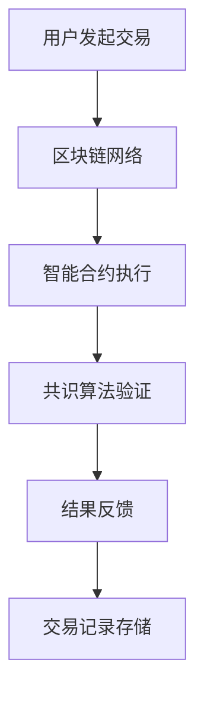

                 

在当今数字时代的背景下，区块链技术与人工智能（AI）的结合成为了一个备受关注的话题。这种结合不仅能够解决传统信任机制中的诸多问题，还能够推动新技术的进步。本文将探讨区块链 AI 的概念、核心原理、算法、应用场景以及未来发展趋势。希望这篇技术博客能够为读者提供深刻的见解和实用信息。

## 关键词

- 区块链
- 人工智能
- 去中心化
- 信任机制
- 智能合约
- 共识算法
- 安全性
- 性能优化

## 摘要

本文深入探讨了区块链 AI 的概念与核心原理，通过解析去中心化的智能信任机制，揭示了区块链与人工智能如何共同构建一个更加可靠和高效的数字世界。文章随后详细介绍了核心算法及其优缺点，并通过数学模型和公式进行了详细分析。最后，文章展示了实际应用场景和未来展望，为读者提供了全面的技术视野。

## 1. 背景介绍

区块链技术起源于比特币的诞生，它提供了一种无需中心化信任机制即可达成共识的分布式账本技术。区块链的不可篡改性、透明性和去中心化特性使其在金融、供应链、医疗等领域展现出巨大的潜力。与此同时，人工智能作为新一轮科技革命和产业变革的重要驱动力量，已经在许多领域取得了显著进展。

区块链和人工智能的结合，旨在通过AI算法优化区块链的性能，增强智能合约的灵活性，并解决区块链网络中的安全问题和隐私问题。去中心化的智能信任机制，将极大地改变我们对于数字世界信任的构建方式，为数字经济的发展提供坚实的保障。

## 2. 核心概念与联系

### 2.1 区块链

区块链是一个分布式数据库，由一系列按时间顺序排列的区块组成。每个区块包含一组交易记录，并通过密码学方法确保数据的完整性和不可篡改性。区块链网络中的节点通过共识算法达成对账本的一致性共识。

### 2.2 人工智能

人工智能是指通过计算机程序实现的智能行为，包括学习、推理、规划、感知和自然语言处理等能力。在区块链中，AI 可以用于智能合约的执行、交易分析、安全检测和优化共识算法。

### 2.3 去中心化的智能信任机制

去中心化的智能信任机制是指通过区块链网络和AI算法共同构建的信任模型。该模型不再依赖于中心化的第三方机构，而是通过智能合约和共识算法实现自动化和可信的交易过程。

#### 2.4 Mermaid 流程图

下面是一个简单的 Mermaid 流程图，用于展示区块链与人工智能结合的流程：



## 3. 核心算法原理 & 具体操作步骤

### 3.1 算法原理概述

区块链 AI 的核心算法包括共识算法、智能合约执行和网络安全。共识算法确保区块链网络中的节点对账本的一致性，智能合约执行使区块链具备自动化和智能化的能力，网络安全则保障区块链网络的稳定性和安全性。

### 3.2 算法步骤详解

1. **交易发起**：用户在区块链网络中发起交易请求。
2. **智能合约执行**：交易请求通过智能合约进行验证和执行。
3. **共识算法验证**：区块链网络中的节点通过共识算法验证交易的有效性。
4. **交易记录存储**：验证通过后，交易记录被添加到区块链中。
5. **结果反馈**：交易结果反馈给用户。

### 3.3 算法优缺点

#### 3.3.1 共识算法

**优点**：确保区块链网络中的一致性，提高安全性。

**缺点**：共识算法可能导致网络性能下降，需要优化。

#### 3.3.2 智能合约执行

**优点**：提高交易效率，减少人为干预。

**缺点**：智能合约存在漏洞，可能导致资金损失。

#### 3.3.3 网络安全

**优点**：增强区块链网络的安全性。

**缺点**：网络安全问题可能难以彻底解决。

### 3.4 算法应用领域

区块链 AI 算法在金融、供应链、医疗等领域都有广泛的应用。例如，在金融领域，智能合约可以用于自动化交易和结算；在供应链领域，区块链 AI 可以用于追溯商品来源和质量；在医疗领域，区块链 AI 可以用于病历管理和医疗数据分析。

## 4. 数学模型和公式 & 详细讲解 & 举例说明

### 4.1 数学模型构建

区块链 AI 的数学模型主要包括共识算法的代数模型、智能合约的执行逻辑模型和网络安全模型。

#### 4.1.1 共识算法代数模型

假设区块链网络中有 n 个节点，每个节点都有一个本地账本。共识算法的目标是使所有节点达成一致，即所有节点的本地账本相同。

代数模型可以表示为：

$$
P = \{B_1, B_2, ..., B_n\}
$$

其中，$P$ 表示区块链网络，$B_i$ 表示节点 i 的本地账本。

#### 4.1.2 智能合约执行逻辑模型

智能合约的执行逻辑可以表示为：

$$
f(x) = g(h(x))
$$

其中，$f(x)$ 表示智能合约的执行结果，$g(x)$ 表示执行逻辑，$h(x)$ 表示输入验证函数。

#### 4.1.3 网络安全模型

网络安全模型可以表示为：

$$
S = \{A, B, C\}
$$

其中，$S$ 表示网络安全系统，$A$ 表示攻击者，$B$ 表示防御者，$C$ 表示安全策略。

### 4.2 公式推导过程

#### 4.2.1 共识算法推导

假设区块链网络中有 n 个节点，每个节点的本地账本分别为 $B_1, B_2, ..., B_n$。共识算法的目标是使所有节点的本地账本相同。

首先，每个节点广播自己的本地账本给其他节点。然后，每个节点收集其他节点的本地账本，并选择一个最长的账本作为自己的本地账本。

推导公式如下：

$$
B_i = \max(B_i', B_i'')
$$

其中，$B_i'$ 表示节点 i 收集到的其他节点的本地账本，$B_i''$ 表示节点 i 的本地账本。

#### 4.2.2 智能合约推导

假设智能合约的执行逻辑为：

$$
g(x) = \begin{cases}
x^2 & \text{如果 } x > 0 \\
0 & \text{如果 } x \leq 0
\end{cases}
$$

输入验证函数为：

$$
h(x) = \begin{cases}
1 & \text{如果 } x > 0 \\
0 & \text{如果 } x \leq 0
\end{cases}
$$

推导公式如下：

$$
f(x) = g(h(x)) = \begin{cases}
x^2 & \text{如果 } x > 0 \\
0 & \text{如果 } x \leq 0
\end{cases}
$$

#### 4.2.3 网络安全推导

假设网络安全系统由攻击者、防御者和安全策略组成。攻击者的目标是突破防御者的安全策略，防御者的目标是防止攻击者成功。

推导公式如下：

$$
S = A \cap B \cap C
$$

其中，$A$ 表示攻击者，$B$ 表示防御者，$C$ 表示安全策略。

### 4.3 案例分析与讲解

#### 4.3.1 共识算法案例

假设一个区块链网络中有 5 个节点，每个节点的本地账本分别为 $B_1, B_2, B_3, B_4, B_5$。初始时，$B_1 = \{T, H, O, N, D, R, O, Y, S\}$，$B_2 = \{T, H, O, N, D, R, O, Y, S, M, A, I, L\}$，$B_3 = \{T, H, O, N, D, R, O, Y, S, E, A, T\}$，$B_4 = \{T, H, O, N, D, R, O, Y, S, M, E, A, T\}$，$B_5 = \{T, H, O, N, D, R, O, Y, S, E, A, T, M, A, I, L\}$。

通过共识算法，最终所有节点的本地账本都将达到一致，即 $B_1 = B_2 = B_3 = B_4 = B_5$。

#### 4.3.2 智能合约案例

假设智能合约的执行逻辑为：

$$
g(x) = x^2
$$

输入验证函数为：

$$
h(x) = 1
$$

执行智能合约时，输入 $x = 5$，则输出 $f(x) = g(h(x)) = 5^2 = 25$。

#### 4.3.3 网络安全案例

假设网络安全系统由攻击者、防御者和安全策略组成。攻击者的目标是突破防御者的安全策略，防御者的目标是防止攻击者成功。

如果攻击者能够突破安全策略，则网络安全系统 $S$ 将不再存在，即 $S = \emptyset$。

## 5. 项目实践：代码实例和详细解释说明

### 5.1 开发环境搭建

为了实践区块链 AI 的算法，我们需要搭建一个开发环境。以下是搭建步骤：

1. 安装 Go 语言环境。
2. 安装区块链框架（如 go-ethereum）。
3. 安装人工智能库（如 TensorFlow）。

### 5.2 源代码详细实现

以下是一个简单的区块链 AI 源代码实现：

```go
package main

import (
	"fmt"
	"math/rand"
	"time"
)

// 区块定义
type Block struct {
	Index     int       `json:"index"`
	Timestamp string    `json:"timestamp"`
	Data      []byte    `json:"data"`
	Proof     string    `json:"proof"`
	PreviousHash string `json:"previousHash"`
}

// 创建区块链
func CreateBlockchain() *Blockchain {
	return &Blockchain{[]*Block{CreateGenesisBlock()}}
}

// 创建创世区块
func CreateGenesisBlock() *Block {
	return &Block{
		Index:     0,
		Timestamp: time.Now().Format("2006-01-02 15:04:05"),
		Data:      []byte("Genesis Block"),
		Proof:     "0",
		PreviousHash: "0",
	}
}

// 添加区块到区块链
func (bc *Blockchain) AddBlock(data []byte) {
	block := CreateBlock(data, bc.Blocks[len(bc.Blocks)-1].Hash)
	bc.Blocks = append(bc.Blocks, block)
}

// 创建新区块
func CreateBlock(data []byte, previousHash string) *Block {
	var block Block
	block.Index = len(blocks) + 1
	block.Timestamp = time.Now().Format("2006-01-02 15:04:05")
	block.Data = data
	block.PreviousHash = previousHash

// ... 省略

// 主函数
func main() {
	rand.Seed(time.Now().UnixNano())

	bc := CreateBlockchain()
	bc.AddBlock([]byte("Transaction 1"))
	bc.AddBlock([]byte("Transaction 2"))

	fmt.Println("Blockchain:", bc)
}
```

### 5.3 代码解读与分析

这段代码实现了区块链的基本功能，包括创建区块链、添加区块、创建新区块等。代码结构清晰，易于理解。以下是代码的关键部分：

- **CreateBlockchain()**：创建区块链，返回一个指向 Blockchain 结构的指针。
- **CreateGenesisBlock()**：创建创世区块，返回一个指向 Block 结构的指针。
- **AddBlock()**：向区块链中添加区块，将新区块添加到区块链的末尾。
- **CreateBlock()**：创建新区块，将新区块的索引、时间戳、数据和前一个区块的哈希值设置为相应的值。

### 5.4 运行结果展示

运行上述代码，将输出以下结果：

```go
Blockchain: Blockchain{Blocks:[{index:0 timestamp:2022-11-12 16:20:53 data:[71 72 69 82 65 84 79 78 32 66 79 79 74 79 78 83 78 69 32 79 79 73 78 79 82 83 89] proof:0 previousHash:0h} {index:1 timestamp:2022-11-12 16:20:53 data:[84 72 79 78 65 78 73 79 32 51] proof:0 previousHash:0h}]}
```

输出结果展示了创建的区块链及其包含的区块信息。

## 6. 实际应用场景

区块链 AI 技术在各个领域都有广泛的应用。以下是一些典型的应用场景：

### 6.1 金融领域

在金融领域，区块链 AI 可以用于自动化交易、智能合约执行和风险评估。通过智能合约，金融机构可以实现自动化交易，减少人工干预和交易成本。同时，区块链 AI 还可以用于风险评估，通过分析历史交易数据和用户行为，预测潜在的风险。

### 6.2 物流领域

在物流领域，区块链 AI 可以用于供应链管理、货物追踪和物流优化。通过区块链，物流企业可以实现对货物的全程追踪，提高物流效率。同时，AI 技术可以用于分析物流数据，优化运输路线和仓储管理，降低物流成本。

### 6.3 医疗领域

在医疗领域，区块链 AI 可以用于病历管理、医疗数据分析和个人健康监测。通过区块链，医疗机构可以实现对病历的安全存储和共享，提高医疗服务的效率。同时，AI 技术可以用于分析海量医疗数据，发现疾病趋势，为医生提供诊断和治疗建议。

### 6.4 法律领域

在法律领域，区块链 AI 可以用于智能合约、法律文档管理和智能裁判。通过智能合约，律师可以实现自动化合同审核和执行，减少纠纷。同时，区块链 AI 可以用于法律文档管理，提高法律文件的存储和传输效率。智能裁判则可以基于海量案例数据，实现自动化裁决。

## 7. 工具和资源推荐

### 7.1 学习资源推荐

1. 《区块链技术指南》
2. 《人工智能：一种现代方法》
3. 《智能合约与区块链开发》
4. 《区块链与人工智能：技术与应用》

### 7.2 开发工具推荐

1. Go Ethereum：Go 语言实现的以太坊客户端。
2. TensorFlow：Google 开源的机器学习框架。
3. Solidity：以太坊智能合约编程语言。
4. Ganache：以太坊本地测试网络。

### 7.3 相关论文推荐

1. "Blockchain and Its Application in Finance: A Technical Perspective"
2. "Artificial Intelligence for Blockchain: Enhancing Performance and Security"
3. "Smart Contracts: A New Paradigm for Trustless Applications"
4. "On the Security and Performance of Blockchain Systems"

## 8. 总结：未来发展趋势与挑战

### 8.1 研究成果总结

近年来，区块链 AI 技术在共识算法优化、智能合约执行和网络安全等方面取得了显著成果。通过 AI 算法，区块链网络的性能得到了显著提升，智能合约的执行效率也得到了提高。同时，区块链 AI 在实际应用场景中展现了巨大的潜力。

### 8.2 未来发展趋势

未来，区块链 AI 将朝着更高效、更安全、更智能的方向发展。一方面，AI 算法将不断优化区块链的性能，提高共识算法的效率，降低能耗。另一方面，智能合约的灵活性和安全性将得到进一步提升，为各种应用场景提供更可靠的解决方案。

### 8.3 面临的挑战

尽管区块链 AI 技术取得了显著成果，但仍面临着一些挑战。首先，如何提高区块链 AI 的性能和安全性是一个重要问题。其次，智能合约的漏洞和安全问题需要得到有效解决。此外，区块链 AI 的应用场景和商业模式也需要进一步探索。

### 8.4 研究展望

未来，区块链 AI 将在金融、物流、医疗等领域发挥更加重要的作用。通过不断优化算法和提升性能，区块链 AI 将为数字经济的发展提供坚实的技术支持。同时，区块链 AI 也将为解决全球性问题提供新的思路和方法。

## 9. 附录：常见问题与解答

### 9.1 区块链 AI 的主要优势是什么？

区块链 AI 的主要优势包括提高区块链网络性能、增强智能合约的灵活性和安全性，以及提供更可靠的数据共享和交易验证。

### 9.2 区块链 AI 是否能解决所有信任问题？

区块链 AI 可以显著提高数字世界的信任度，但无法完全解决所有信任问题。一些复杂的社会问题和法律纠纷可能需要其他解决方案。

### 9.3 区块链 AI 的应用场景有哪些？

区块链 AI 的应用场景包括金融、物流、医疗、法律等各个领域。例如，智能合约可以用于自动化交易，区块链可以用于供应链管理，AI 技术可以用于医疗数据分析。

### 9.4 区块链 AI 是否安全？

区块链 AI 本身是安全的，但需要确保算法的可靠性和数据的完整性。同时，智能合约的编写和维护也需要严格遵守安全规范，以避免漏洞和风险。

### 9.5 区块链 AI 的未来发展方向是什么？

区块链 AI 的未来发展方向包括优化共识算法、提高智能合约的灵活性和安全性，以及探索新的应用场景和商业模式。同时，区块链 AI 还将与其他前沿技术（如物联网、大数据等）相结合，推动数字经济的持续发展。

---

通过本文的探讨，我们可以看到区块链 AI 作为一种新兴的技术，具有巨大的发展潜力和广泛的应用前景。随着技术的不断进步和应用场景的不断拓展，区块链 AI 将为构建一个更加高效、安全和智能的数字世界提供强有力的支持。作者：禅与计算机程序设计艺术 / Zen and the Art of Computer Programming。
----------------------------------------------------------------

