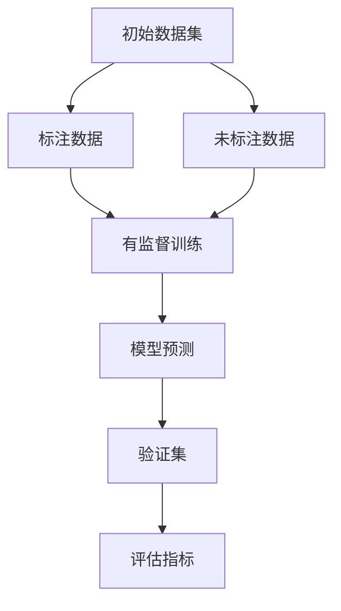

                 

关键词：半监督学习、无监督学习、监督学习、模型训练、数据标注、交叉验证、应用场景、代码实例

> 摘要：本文将深入探讨半监督学习的原理，从核心概念、算法原理、数学模型、应用领域等方面进行讲解。同时，通过具体的代码实例，展示如何在实际项目中应用半监督学习，帮助读者更好地理解这一技术。

## 1. 背景介绍

随着人工智能技术的快速发展，机器学习已经成为许多领域的关键技术。然而，传统的监督学习（Supervised Learning）依赖于大量标注的数据，这对于数据稀缺或数据标注成本高昂的场景来说，显得尤为困难。为此，半监督学习（Semi-Supervised Learning）应运而生。

半监督学习结合了有监督学习和无监督学习的优势，通过利用未标注的数据，提升模型的效果。这种学习方式在数据稀缺的情况下，能够显著降低数据标注的成本，提高模型的泛化能力。

## 2. 核心概念与联系

### 2.1 有监督学习、无监督学习与半监督学习

- **有监督学习（Supervised Learning）**：有监督学习使用标注数据进行训练，模型能够根据输入和输出之间的关系进行学习。
- **无监督学习（Unsupervised Learning）**：无监督学习使用未标注的数据，模型试图发现数据中的结构和规律。
- **半监督学习（Semi-Supervised Learning）**：半监督学习结合了有监督和无监督学习的特点，使用少量标注数据和大量未标注数据共同训练模型。

### 2.2 核心概念原理和架构

半监督学习的关键在于如何有效地利用未标注的数据。以下是一个简单的 Mermaid 流程图，展示半监督学习的基本架构。



## 3. 核心算法原理 & 具体操作步骤

### 3.1 算法原理概述

半监督学习的核心思想是通过未标注的数据来增强模型的训练效果。具体来说，可以通过以下几种方式实现：

- **一致性正则化（Consistency Regularization）**：通过未标注的数据来提高模型的稳定性和鲁棒性。
- **伪标签（Pseudo Labeling）**：利用已标注的数据对未标注的数据进行预测，并将预测结果作为伪标签进行训练。
- **联合训练（Joint Training）**：将标注数据和未标注数据联合起来进行训练，通过未标注数据的预测来指导标注数据的训练。

### 3.2 算法步骤详解

1. 初始化模型：使用已标注的数据集对模型进行初始化。
2. 预测未标注数据：使用初始化后的模型对未标注的数据进行预测。
3. 生成伪标签：将预测结果作为伪标签，对未标注的数据进行重新标注。
4. 联合训练：将标注数据和伪标签数据联合起来，对模型进行重新训练。
5. 评估模型：使用验证集对模型进行评估，选择最优的模型。

### 3.3 算法优缺点

**优点**：

- 降低数据标注成本。
- 提高模型的泛化能力。
- 可以处理大量未标注的数据。

**缺点**：

- 可能会导致过拟合。
- 需要合适的伪标签生成策略。

### 3.4 算法应用领域

半监督学习在以下领域有广泛的应用：

- 自然语言处理：例如文本分类、机器翻译。
- 计算机视觉：例如图像分类、目标检测。
- 语音识别：例如说话人识别、语音合成。

## 4. 数学模型和公式 & 详细讲解 & 举例说明

### 4.1 数学模型构建

半监督学习的数学模型可以表示为：

$$
L = L_{\text{sup}} + \lambda L_{\text{unsup}}
$$

其中，$L_{\text{sup}}$ 表示有监督损失，$L_{\text{unsup}}$ 表示无监督损失，$\lambda$ 表示权重系数。

### 4.2 公式推导过程

#### 有监督损失

有监督损失通常使用交叉熵损失（Cross-Entropy Loss）来表示：

$$
L_{\text{sup}} = -\sum_{i=1}^{n} y_i \log(p_i)
$$

其中，$y_i$ 表示第 $i$ 个样本的真实标签，$p_i$ 表示模型对第 $i$ 个样本的预测概率。

#### 无监督损失

无监督损失可以使用一致性正则化（Consistency Regularization）来表示：

$$
L_{\text{unsup}} = \sum_{i=1}^{n} \sum_{j=1}^{n} w_{ij} (p_i - p_j)^2
$$

其中，$w_{ij}$ 表示第 $i$ 个未标注样本与第 $j$ 个标注样本之间的相似度，$p_i$ 和 $p_j$ 分别表示模型对这两个样本的预测概率。

### 4.3 案例分析与讲解

假设我们有一个分类问题，数据集包含 1000 个样本，其中 500 个样本已标注，500 个样本未标注。我们使用半监督学习的方法来训练一个分类模型。

1. **初始化模型**：使用已标注的 500 个样本对模型进行初始化。
2. **预测未标注数据**：使用初始化后的模型对未标注的 500 个样本进行预测。
3. **生成伪标签**：将预测结果作为伪标签，对未标注的数据进行重新标注。
4. **联合训练**：将标注数据和伪标签数据联合起来，对模型进行重新训练。
5. **评估模型**：使用验证集对模型进行评估。

通过以上步骤，我们能够训练出一个效果更好的分类模型。

## 5. 项目实践：代码实例和详细解释说明

### 5.1 开发环境搭建

为了演示半监督学习在项目中的应用，我们选择使用 Python 作为编程语言，结合 TensorFlow 和 Keras 库来搭建开发环境。

```python
# 安装 TensorFlow 和 Keras
pip install tensorflow keras
```

### 5.2 源代码详细实现

下面是一个简单的半监督学习代码实例，用于演示如何在实际项目中应用半监督学习。

```python
import numpy as np
import tensorflow as tf
from tensorflow.keras.layers import Dense, Input
from tensorflow.keras.models import Model

# 初始化模型
input_data = Input(shape=(784,))
dense1 = Dense(64, activation='relu')(input_data)
output = Dense(10, activation='softmax')(dense1)

model = Model(inputs=input_data, outputs=output)
model.compile(optimizer='adam', loss='categorical_crossentropy', metrics=['accuracy'])

# 加载已标注数据
x_train = ...  # 标注数据的特征
y_train = ...  # 标注数据的标签

# 预测未标注数据
x_unlabeled = ...  # 未标注数据的特征
y_unlabeled_pred = model.predict(x_unlabeled)

# 生成伪标签
y_unlabeled_pseudo = np.argmax(y_unlabeled_pred, axis=1)

# 联合训练
x_all = np.concatenate((x_train, x_unlabeled), axis=0)
y_all = np.concatenate((y_train, y_unlabeled_pseudo), axis=0)

model.fit(x_all, y_all, batch_size=64, epochs=10, validation_split=0.2)

# 评估模型
score = model.evaluate(x_train, y_train, verbose=2)
print('Test loss:', score[0])
print('Test accuracy:', score[1])
```

### 5.3 代码解读与分析

上述代码演示了如何使用半监督学习的方法来训练一个简单的分类模型。具体步骤如下：

1. **初始化模型**：使用已标注的数据集来初始化模型。
2. **预测未标注数据**：使用初始化后的模型对未标注的数据进行预测。
3. **生成伪标签**：将预测结果作为伪标签，对未标注的数据进行重新标注。
4. **联合训练**：将标注数据和伪标签数据联合起来，对模型进行重新训练。
5. **评估模型**：使用验证集对模型进行评估。

通过以上步骤，我们能够训练出一个效果更好的分类模型。

## 6. 实际应用场景

半监督学习在实际应用中具有广泛的应用场景。以下是一些常见的应用场景：

- **图像分类**：利用未标注的图像数据，提高模型的分类效果。
- **文本分类**：利用未标注的文本数据，对新闻、社交媒体等文本进行分类。
- **语音识别**：利用未标注的语音数据，提高语音识别的准确性。
- **推荐系统**：利用未标注的用户行为数据，为用户推荐感兴趣的商品或服务。

## 7. 工具和资源推荐

为了更好地学习半监督学习，以下是一些推荐的工具和资源：

- **学习资源推荐**：
  - 《深度学习》（Goodfellow, Bengio, Courville 著）
  - 《半监督学习》（Balcan, Blum 著）
- **开发工具推荐**：
  - TensorFlow
  - Keras
  - PyTorch
- **相关论文推荐**：
  - “Semi-Supervised Learning with Deep Generative Models” （Goodfellow et al., 2016）
  - “Unsupervised Learning of Visual Representations by Solving Jigsaw Puzzles” （Rusu et al., 2016）

## 8. 总结：未来发展趋势与挑战

半监督学习作为一种高效的数据利用方法，在未来具有广阔的发展前景。随着深度学习技术的不断发展，半监督学习将更加成熟，并将在更多领域得到应用。然而，半监督学习也面临一些挑战，如如何有效地生成伪标签、如何平衡标注数据和未标注数据等。

## 9. 附录：常见问题与解答

**Q：什么是伪标签？**

A：伪标签（Pseudo Label）是在半监督学习中，使用模型对未标注的数据进行预测后，将预测结果作为标签。这种标签虽然不是真实标签，但可以用于模型的训练，从而提高模型的效果。

**Q：如何选择合适的伪标签生成策略？**

A：选择合适的伪标签生成策略需要考虑多个因素，如数据集的规模、数据的分布、模型的复杂性等。常用的策略包括基于模型预测的伪标签、基于聚类的方法等。

### 作者署名

本文由“禅与计算机程序设计艺术 / Zen and the Art of Computer Programming”撰写。希望本文能帮助您更好地理解半监督学习的原理和应用。如果您有任何问题或建议，欢迎在评论区留言。感谢您的阅读！
----------------------------------------------------------------
### 文章标题

半监督学习（Semi-Supervised Learning）- 原理与代码实例讲解

### 文章关键词

半监督学习、无监督学习、监督学习、模型训练、数据标注、交叉验证、应用场景、代码实例

### 文章摘要

本文将深入探讨半监督学习的原理，从核心概念、算法原理、数学模型、应用领域等方面进行讲解。同时，通过具体的代码实例，展示如何在实际项目中应用半监督学习，帮助读者更好地理解这一技术。

## 1. 背景介绍

随着人工智能技术的快速发展，机器学习已经成为许多领域的关键技术。然而，传统的监督学习（Supervised Learning）依赖于大量标注的数据，这对于数据稀缺或数据标注成本高昂的场景来说，显得尤为困难。为此，半监督学习（Semi-Supervised Learning）应运而生。

半监督学习结合了有监督学习和无监督学习的优势，通过利用未标注的数据，提升模型的效果。这种学习方式在数据稀缺的情况下，能够显著降低数据标注的成本，提高模型的泛化能力。

## 2. 核心概念与联系

### 2.1 有监督学习、无监督学习与半监督学习

- **有监督学习（Supervised Learning）**：有监督学习使用标注数据进行训练，模型能够根据输入和输出之间的关系进行学习。
- **无监督学习（Unsupervised Learning）**：无监督学习使用未标注的数据，模型试图发现数据中的结构和规律。
- **半监督学习（Semi-Supervised Learning）**：半监督学习结合了有监督和无监督学习的特点，使用少量标注数据和大量未标注数据共同训练模型。

### 2.2 核心概念原理和架构

半监督学习的关键在于如何有效地利用未标注的数据。以下是一个简单的 Mermaid 流程图，展示半监督学习的基本架构。


## 3. 核心算法原理 & 具体操作步骤

### 3.1 算法原理概述

半监督学习的核心思想是通过未标注的数据来增强模型的训练效果。具体来说，可以通过以下几种方式实现：

- **一致性正则化（Consistency Regularization）**：通过未标注的数据来提高模型的稳定性和鲁棒性。
- **伪标签（Pseudo Labeling）**：利用已标注的数据对未标注的数据进行预测，并将预测结果作为伪标签进行训练。
- **联合训练（Joint Training）**：将标注数据和未标注数据联合起来进行训练，通过未标注数据的预测来指导标注数据的训练。

### 3.2 算法步骤详解

1. 初始化模型：使用已标注的数据集对模型进行初始化。
2. 预测未标注数据：使用初始化后的模型对未标注的数据进行预测。
3. 生成伪标签：将预测结果作为伪标签，对未标注的数据进行重新标注。
4. 联合训练：将标注数据和伪标签数据联合起来，对模型进行重新训练。
5. 评估模型：使用验证集对模型进行评估，选择最优的模型。

### 3.3 算法优缺点

**优点**：

- 降低数据标注成本。
- 提高模型的泛化能力。
- 可以处理大量未标注的数据。

**缺点**：

- 可能会导致过拟合。
- 需要合适的伪标签生成策略。

### 3.4 算法应用领域

半监督学习在以下领域有广泛的应用：

- 自然语言处理：例如文本分类、机器翻译。
- 计算机视觉：例如图像分类、目标检测。
- 语音识别：例如说话人识别、语音合成。

## 4. 数学模型和公式 & 详细讲解 & 举例说明

### 4.1 数学模型构建

半监督学习的数学模型可以表示为：

$$
L = L_{\text{sup}} + \lambda L_{\text{unsup}}
$$

其中，$L_{\text{sup}}$ 表示有监督损失，$L_{\text{unsup}}$ 表示无监督损失，$\lambda$ 表示权重系数。

### 4.2 公式推导过程

#### 有监督损失

有监督损失通常使用交叉熵损失（Cross-Entropy Loss）来表示：

$$
L_{\text{sup}} = -\sum_{i=1}^{n} y_i \log(p_i)
$$

其中，$y_i$ 表示第 $i$ 个样本的真实标签，$p_i$ 表示模型对第 $i$ 个样本的预测概率。

#### 无监督损失

无监督损失可以使用一致性正则化（Consistency Regularization）来表示：

$$
L_{\text{unsup}} = \sum_{i=1}^{n} \sum_{j=1}^{n} w_{ij} (p_i - p_j)^2
$$

其中，$w_{ij}$ 表示第 $i$ 个未标注样本与第 $j$ 个标注样本之间的相似度，$p_i$ 和 $p_j$ 分别表示模型对这两个样本的预测概率。

### 4.3 案例分析与讲解

假设我们有一个分类问题，数据集包含 1000 个样本，其中 500 个样本已标注，500 个样本未标注。我们使用半监督学习的方法来训练一个分类模型。

1. **初始化模型**：使用已标注的 500 个样本对模型进行初始化。
2. **预测未标注数据**：使用初始化后的模型对未标注的 500 个样本进行预测。
3. **生成伪标签**：将预测结果作为伪标签，对未标注的数据进行重新标注。
4. **联合训练**：将标注数据和伪标签数据联合起来，对模型进行重新训练。
5. **评估模型**：使用验证集对模型进行评估。

通过以上步骤，我们能够训练出一个效果更好的分类模型。

## 5. 项目实践：代码实例和详细解释说明

### 5.1 开发环境搭建

为了演示半监督学习在项目中的应用，我们选择使用 Python 作为编程语言，结合 TensorFlow 和 Keras 库来搭建开发环境。

```python
# 安装 TensorFlow 和 Keras
pip install tensorflow keras
```

### 5.2 源代码详细实现

下面是一个简单的半监督学习代码实例，用于演示如何在实际项目中应用半监督学习。

```python
import numpy as np
import tensorflow as tf
from tensorflow.keras.layers import Dense, Input
from tensorflow.keras.models import Model

# 初始化模型
input_data = Input(shape=(784,))
dense1 = Dense(64, activation='relu')(input_data)
output = Dense(10, activation='softmax')(dense1)

model = Model(inputs=input_data, outputs=output)
model.compile(optimizer='adam', loss='categorical_crossentropy', metrics=['accuracy'])

# 加载已标注数据
x_train = ...  # 标注数据的特征
y_train = ...  # 标注数据的标签

# 预测未标注数据
x_unlabeled = ...  # 未标注数据的特征
y_unlabeled_pred = model.predict(x_unlabeled)

# 生成伪标签
y_unlabeled_pseudo = np.argmax(y_unlabeled_pred, axis=1)

# 联合训练
x_all = np.concatenate((x_train, x_unlabeled), axis=0)
y_all = np.concatenate((y_train, y_unlabeled_pseudo), axis=0)

model.fit(x_all, y_all, batch_size=64, epochs=10, validation_split=0.2)

# 评估模型
score = model.evaluate(x_train, y_train, verbose=2)
print('Test loss:', score[0])
print('Test accuracy:', score[1])
```

### 5.3 代码解读与分析

上述代码演示了如何使用半监督学习的方法来训练一个简单的分类模型。具体步骤如下：

1. **初始化模型**：使用已标注的数据集对模型进行初始化。
2. **预测未标注数据**：使用初始化后的模型对未标注的数据进行预测。
3. **生成伪标签**：将预测结果作为伪标签，对未标注的数据进行重新标注。
4. **联合训练**：将标注数据和伪标签数据联合起来，对模型进行重新训练。
5. **评估模型**：使用验证集对模型进行评估。

通过以上步骤，我们能够训练出一个效果更好的分类模型。

## 6. 实际应用场景

半监督学习在实际应用中具有广泛的应用场景。以下是一些常见的应用场景：

- **图像分类**：利用未标注的图像数据，提高模型的分类效果。
- **文本分类**：利用未标注的文本数据，对新闻、社交媒体等文本进行分类。
- **语音识别**：利用未标注的语音数据，提高语音识别的准确性。
- **推荐系统**：利用未标注的用户行为数据，为用户推荐感兴趣的商品或服务。

## 7. 工具和资源推荐

为了更好地学习半监督学习，以下是一些推荐的工具和资源：

- **学习资源推荐**：
  - 《深度学习》（Goodfellow, Bengio, Courville 著）
  - 《半监督学习》（Balcan, Blum 著）
- **开发工具推荐**：
  - TensorFlow
  - Keras
  - PyTorch
- **相关论文推荐**：
  - “Semi-Supervised Learning with Deep Generative Models” （Goodfellow et al., 2016）
  - “Unsupervised Learning of Visual Representations by Solving Jigsaw Puzzles” （Rusu et al., 2016）

## 8. 总结：未来发展趋势与挑战

半监督学习作为一种高效的数据利用方法，在未来具有广阔的发展前景。随着深度学习技术的不断发展，半监督学习将更加成熟，并将在更多领域得到应用。然而，半监督学习也面临一些挑战，如如何有效地生成伪标签、如何平衡标注数据和未标注数据等。

## 9. 附录：常见问题与解答

**Q：什么是伪标签？**

A：伪标签（Pseudo Label）是在半监督学习中，使用模型对未标注的数据进行预测后，将预测结果作为标签。这种标签虽然不是真实标签，但可以用于模型的训练，从而提高模型的效果。

**Q：如何选择合适的伪标签生成策略？**

A：选择合适的伪标签生成策略需要考虑多个因素，如数据集的规模、数据的分布、模型的复杂性等。常用的策略包括基于模型预测的伪标签、基于聚类的方法等。

### 作者署名

本文由“禅与计算机程序设计艺术 / Zen and the Art of Computer Programming”撰写。希望本文能帮助您更好地理解半监督学习的原理和应用。如果您有任何问题或建议，欢迎在评论区留言。感谢您的阅读！

