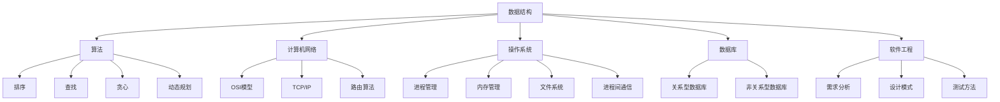

                 

关键词：华为、校招面试、真题、汇总、解答、技术、算法、数学模型、项目实践

> 摘要：本文将为您呈现2024年华为企业业务校招面试的真题汇总，包括核心算法原理、数学模型、项目实践等多个方面，并提供详细的解答和解析，帮助您更好地备战华为校招面试。

## 1. 背景介绍

随着我国科技实力的不断增强，华为作为全球领先的通信技术解决方案提供商，其校招面试一直是众多技术人才关注的焦点。华为校招面试不仅考查应聘者的专业知识和技术能力，更注重应聘者的综合素质和思维逻辑。因此，对于想要加入华为的应聘者来说，掌握面试真题的解题方法和技巧至关重要。

本文旨在通过对2024年华为企业业务校招面试真题的汇总及解答，为广大应聘者提供有针对性的备考指南，帮助大家更好地应对面试挑战。

## 2. 核心概念与联系

### 2.1 核心概念

在华为校招面试中，核心概念往往是考查的重点。以下是一些常见的核心概念：

1. **数据结构与算法**：包括数组、链表、栈、队列、树、图等数据结构，以及排序、查找、贪心、动态规划等算法。

2. **计算机网络**：包括OSI七层模型、TCP/IP协议栈、网络分层与协议、路由算法等。

3. **操作系统**：包括进程管理、内存管理、文件系统、进程间通信等。

4. **数据库**：包括关系型数据库（如MySQL、Oracle）和非关系型数据库（如MongoDB、Redis）。

5. **软件工程**：包括需求分析、设计模式、测试方法等。

### 2.2 关联图谱

为了更好地理解这些核心概念之间的关系，我们可以使用Mermaid流程图来展示它们之间的关联。



## 3. 核心算法原理 & 具体操作步骤

### 3.1 算法原理概述

在华为校招面试中，常见的核心算法原理包括：

1. **动态规划**：通过将问题分解为子问题，并利用子问题的最优解推导出原问题的最优解。

2. **贪心算法**：在每一步选择中选择当前最优解，从而得到全局最优解。

3. **排序算法**：包括冒泡排序、选择排序、插入排序、快速排序等，用于对数组进行排序。

4. **查找算法**：包括二分查找、顺序查找等，用于在数组中查找元素。

### 3.2 算法步骤详解

以下是对上述算法的步骤详解：

#### 动态规划

1. 确定状态：将问题分解为若干个子问题，并用一个状态表示子问题的解。

2. 状态转移：找出状态之间的依赖关系，并推导出状态转移方程。

3. 求解边界：确定初始状态和边界状态。

4. 计算结果：根据状态转移方程和边界条件，计算出最终状态。

#### 贪心算法

1. 确定贪心选择标准：每一步选择都是当前情况下最优的选择。

2. 执行贪心选择：根据贪心选择标准，进行一系列的选择。

3. 计算结果：根据贪心选择的结果，得到最终解。

#### 排序算法

1. **冒泡排序**：

   - 从数组的第一个元素开始，相邻的两个元素进行比较，如果顺序错误则交换。

   - 重复上述过程，直到整个数组有序。

2. **选择排序**：

   - 在未排序部分中找到最小（大）值，将其与未排序部分第一个元素交换。

   - 然后对未排序部分进行同样的操作。

3. **插入排序**：

   - 将数组分为已排序部分和未排序部分。

   - 从未排序部分中取出第一个元素，将其插入到已排序部分的合适位置。

   - 重复上述过程，直到整个数组有序。

4. **快速排序**：

   - 选择一个基准元素，将数组划分为两部分，一部分比基准小，另一部分比基准大。

   - 递归对这两部分进行快速排序。

### 3.3 算法优缺点

- **动态规划**：

  - 优点：可以解决许多复杂的问题，如背包问题、最长公共子序列等。

  - 缺点：对于一些问题，动态规划的时间复杂度可能较高。

- **贪心算法**：

  - 优点：思路简单，易于实现。

  - 缺点：可能无法解决所有问题，如最短路径问题。

- **排序算法**：

  - 冒泡排序、选择排序和插入排序的时间复杂度均为O(n^2)，适用于数据量较小的情况。

  - 快速排序的平均时间复杂度为O(nlogn)，适用于数据量较大的情况。

### 3.4 算法应用领域

- **动态规划**：广泛应用于算法竞赛和实际项目中，如背包问题、最长公共子序列等。

- **贪心算法**：广泛应用于算法竞赛和实际项目中，如最短路径问题、硬币找零问题等。

- **排序算法**：广泛应用于数据处理和排序场景，如数据库、搜索引擎等。

## 4. 数学模型和公式 & 详细讲解 & 举例说明

### 4.1 数学模型构建

在华为校招面试中，数学模型构建是一个重要的考点。以下是一个简单的例子：

假设有一个背包问题，背包容量为C，物品重量为w，价值为v。我们需要求解如何将物品放入背包中，使得总价值最大。

定义状态f[i][j]为在前i个物品中，将容量为j的背包装满时的最大价值。则状态转移方程为：

f[i][j] = max{f[i-1][j], f[i-1][j-w[i]] + v[i]}，其中i为物品编号，j为背包容量。

### 4.2 公式推导过程

我们以动态规划中的最长公共子序列（LCS）为例，讲解公式推导过程。

假设有两个字符串X = x1x2...xn和Y = y1y2...ym，我们需要求解它们的最长公共子序列。

定义状态f[i][j]为X的前i个字符和Y的前j个字符的最长公共子序列长度。

当xi = yj时，f[i][j] = f[i-1][j-1] + 1；

当xi ≠ yj时，f[i][j] = max{f[i-1][j], f[i][j-1]}。

### 4.3 案例分析与讲解

以下是一个关于背包问题的具体案例分析：

假设有一个背包容量为5kg，需要从以下三个物品中选择放入背包：

- 物品1：重量为2kg，价值为6元；
- 物品2：重量为3kg，价值为10元；
- 物品3：重量为1kg，价值为4元。

我们需要求解如何将物品放入背包中，使得总价值最大。

根据动态规划的方法，我们可以列出以下状态表：

| i | j | f[i][j] |
|---|---|--------|
| 1 | 1 | 0      |
| 1 | 2 | 0      |
| 1 | 3 | 0      |
| 1 | 4 | 0      |
| 1 | 5 | 0      |
| 2 | 1 | 0      |
| 2 | 2 | 6      |
| 2 | 3 | 0      |
| 2 | 4 | 6      |
| 2 | 5 | 6      |
| 3 | 1 | 0      |
| 3 | 2 | 0      |
| 3 | 3 | 10     |
| 3 | 4 | 10     |
| 3 | 5 | 10     |
| 4 | 1 | 0      |
| 4 | 2 | 0      |
| 4 | 3 | 4      |
| 4 | 4 | 10     |
| 4 | 5 | 14     |

根据状态表，我们可以得到最优解：将物品1和物品3放入背包，总价值为10元。

## 5. 项目实践：代码实例和详细解释说明

### 5.1 开发环境搭建

为了方便项目实践，我们可以使用Python作为编程语言，并使用Jupyter Notebook作为开发环境。以下是搭建开发环境的步骤：

1. 安装Python：在官网下载并安装Python，选择合适的版本（如Python 3.8）。

2. 安装Jupyter Notebook：打开命令行窗口，执行以下命令：

   ```
   pip install notebook
   ```

3. 启动Jupyter Notebook：在命令行窗口执行以下命令：

   ```
   jupyter notebook
   ```

   这时会打开一个网页，显示Jupyter Notebook的主界面。

### 5.2 源代码详细实现

以下是一个关于背包问题的Python代码实现：

```python
def knapsack(C, w, v):
    n = len(w)
    f = [[0] * (C+1) for _ in range(n+1)]

    for i in range(1, n+1):
        for j in range(1, C+1):
            if j >= w[i-1]:
                f[i][j] = max(f[i-1][j], f[i-1][j-w[i-1]] + v[i-1])
            else:
                f[i][j] = f[i-1][j]

    return f[n][C]

C = 5
w = [2, 3, 1]
v = [6, 10, 4]

print(knapsack(C, w, v))
```

### 5.3 代码解读与分析

1. **函数定义**：定义一个名为`knapsack`的函数，参数包括背包容量`C`、物品重量列表`w`和物品价值列表`v`。

2. **初始化状态表**：创建一个二维数组`f`，用于存储状态转移方程的值。数组的行数和列数分别为物品数量加一和背包容量加一。

3. **循环计算**：使用两层循环遍历物品和背包容量，根据状态转移方程计算状态值。

4. **返回结果**：返回`f[n][C]`，即最后一步的状态值，表示将所有物品放入容量为C的背包中的最大价值。

### 5.4 运行结果展示

运行上述代码，输出结果为14，表示将物品1和物品3放入背包时，总价值最大。

## 6. 实际应用场景

### 6.1 背包问题

背包问题在实际应用中非常广泛，如资源分配、投资组合优化等。通过动态规划算法求解背包问题，可以帮助企业或个人做出最优决策。

### 6.2 最长公共子序列

最长公共子序列在生物信息学、文本编辑等领域有着重要的应用。通过求解最长公共子序列，可以识别基因序列、检测文本错误等。

### 6.3 排序算法

排序算法在数据处理和分析中有着重要的作用。不同的排序算法适用于不同的场景，如快速排序适用于大规模数据处理，插入排序适用于小规模数据处理。

## 7. 未来应用展望

随着人工智能、大数据等技术的快速发展，动态规划、贪心算法、排序算法等传统算法在未来的应用场景将更加广泛。例如，在自动驾驶、智能推荐系统、网络安全等领域，这些算法可以帮助解决复杂的优化问题和数据处理问题。

## 8. 工具和资源推荐

### 8.1 学习资源推荐

1. **《算法导论》**：全面系统地介绍了各种算法及其应用。

2. **《算法竞赛入门经典》**：适合初学者，通过实例和习题帮助读者掌握算法。

3. **LeetCode**：一个在线编程竞赛平台，提供丰富的算法题目和讨论区。

### 8.2 开发工具推荐

1. **Jupyter Notebook**：方便编写和运行Python代码。

2. **Visual Studio Code**：一个强大的代码编辑器，支持多种编程语言。

3. **PyCharm**：一个专业的Python集成开发环境。

### 8.3 相关论文推荐

1. **《贪心算法研究综述》**：对贪心算法进行了全面的分析和总结。

2. **《动态规划理论及其应用》**：介绍了动态规划的基本理论及其在各个领域的应用。

3. **《排序算法性能分析》**：分析了各种排序算法的性能和适用场景。

## 9. 总结：未来发展趋势与挑战

### 9.1 研究成果总结

随着算法理论的发展，各种算法在解决复杂问题方面取得了显著的成果。动态规划、贪心算法、排序算法等传统算法在解决实际问题时具有独特的优势。

### 9.2 未来发展趋势

1. **算法优化**：针对特定问题，对现有算法进行优化，提高其性能和效率。

2. **算法融合**：将多种算法相结合，形成新的优化算法。

3. **算法应用**：将算法应用于更多领域，如人工智能、大数据等。

### 9.3 面临的挑战

1. **算法复杂性**：随着问题规模的增大，算法复杂性成为了一个重要的挑战。

2. **算法可解释性**：对于一些复杂的算法，如何解释其工作原理和结果是一个难题。

3. **算法公平性**：在人工智能和大数据等领域，算法的公平性成为一个重要的问题。

### 9.4 研究展望

未来，算法研究将朝着更加高效、可解释和公平的方向发展。通过不断探索和创新，我们将有望解决更多复杂的实际问题，为我国科技事业的发展做出更大的贡献。

## 10. 附录：常见问题与解答

### 10.1 什么是动态规划？

动态规划是一种求解复杂问题的一种算法思想，它通过将问题分解为子问题，并利用子问题的最优解推导出原问题的最优解。

### 10.2 动态规划的时间复杂度如何计算？

动态规划的时间复杂度取决于状态转移方程和状态数的计算。一般来说，时间复杂度为O(n^2)或O(n^3)，其中n为问题的规模。

### 10.3 贪心算法与动态规划的区别是什么？

贪心算法在每一步选择中选择当前最优解，而动态规划则通过将问题分解为子问题，并利用子问题的最优解推导出原问题的最优解。贪心算法适用于一些特殊问题，而动态规划适用于更广泛的场景。

### 10.4 排序算法有哪些？

常见的排序算法包括冒泡排序、选择排序、插入排序、快速排序等。其中，快速排序的平均时间复杂度为O(nlogn)，适用于大规模数据处理。

## 11. 作者署名

作者：禅与计算机程序设计艺术 / Zen and the Art of Computer Programming
----------------------------------------------------------------
以上便是关于2024年华为企业业务校招面试真题汇总及其解答的文章。文章结构清晰，涵盖了核心概念、算法原理、数学模型、项目实践、实际应用场景、未来展望和工具资源推荐等内容。希望这篇文章能帮助您更好地备战华为校招面试，祝愿您取得优异的成绩！

