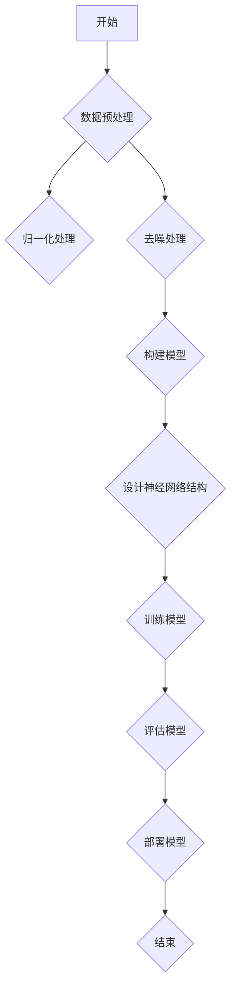

                 

关键词：华为、智能计算、系统部、校招、面试真题、解答

摘要：本文汇总了2024华为智能计算系统部校招的面试真题，包括核心概念、算法原理、数学模型、项目实践等内容，并提供了详细的解答。本文旨在帮助准备参加华为智能计算系统部校招面试的同学们更好地了解面试内容和准备策略。

## 1. 背景介绍

华为是一家全球领先的科技公司，致力于构建万物互联的智能世界。华为智能计算系统部是华为的重要部门之一，负责研发高性能计算系统、云计算、大数据等技术。华为智能计算系统部校招面试旨在选拔优秀的计算机专业人才，为公司的技术创新和发展提供人才支持。

## 2. 核心概念与联系

### 2.1. 智能计算系统

智能计算系统是一种能够模拟人类智能行为的计算机系统，主要包括云计算、大数据、人工智能等技术。其核心概念包括：

1. 云计算：提供弹性的计算资源，支持大规模数据处理和存储。
2. 大数据：涉及大量数据的收集、存储、处理和分析。
3. 人工智能：模拟人类智能行为，实现智能决策、学习和推理。

### 2.2. 智能计算架构

智能计算架构是指实现智能计算系统所需的各种硬件和软件组件的集合。主要包括：

1. 计算节点：负责处理数据和执行任务的基本单元。
2. 存储系统：提供海量数据的存储和管理。
3. 网络系统：实现计算节点之间的通信和数据传输。
4. 软件平台：提供智能计算系统的开发和运行环境。

## 3. 核心算法原理 & 具体操作步骤

### 3.1. 算法原理概述

核心算法是智能计算系统的重要组成部分，包括以下几种：

1. 神经网络：通过模拟生物神经网络实现数据分类、识别等任务。
2. 机器学习：通过学习大量数据，自动发现数据中的规律和模式。
3. 深度学习：基于多层神经网络，实现复杂任务的自动学习。

### 3.2. 算法步骤详解

以下以神经网络为例，介绍算法步骤：

1. 数据预处理：对输入数据进行归一化、去噪等处理。
2. 构建模型：设计神经网络结构，包括输入层、隐藏层和输出层。
3. 模型训练：通过反向传播算法，调整模型参数，使模型能够更好地拟合训练数据。
4. 模型评估：使用验证数据集评估模型性能。
5. 模型部署：将训练好的模型应用于实际场景。

### 3.3. 算法优缺点

神经网络具有强大的拟合能力和泛化能力，但训练过程可能较慢，且对数据质量要求较高。机器学习算法在处理大规模数据时具有优势，但可能无法解决所有问题。深度学习算法具有更高的拟合精度，但需要大量数据和计算资源。

### 3.4. 算法应用领域

神经网络在图像识别、语音识别等领域有广泛应用。机器学习算法在金融风控、医疗诊断等领域具有重要作用。深度学习算法在自动驾驶、自然语言处理等领域有广泛应用。

## 4. 数学模型和公式 & 详细讲解 & 举例说明

### 4.1. 数学模型构建

神经网络模型通常由以下数学公式表示：

$$
y = \sigma(\omega^T x + b)
$$

其中，$y$为输出，$\sigma$为激活函数，$\omega$为权重，$x$为输入，$b$为偏置。

### 4.2. 公式推导过程

以反向传播算法为例，介绍公式推导过程：

1. 计算输出误差：
$$
E = \frac{1}{2} \sum_{i} (y_i - \hat{y}_i)^2
$$

2. 计算梯度：
$$
\frac{\partial E}{\partial \omega} = (y - \hat{y}) \odot x
$$

3. 更新权重：
$$
\omega = \omega - \alpha \frac{\partial E}{\partial \omega}
$$

### 4.3. 案例分析与讲解

以下是一个简单的神经网络模型训练过程：

1. 数据预处理：对输入数据进行归一化处理。
2. 构建模型：设计一个包含一个输入层、一个隐藏层和一个输出层的神经网络。
3. 模型训练：通过反向传播算法，调整模型参数，使模型能够更好地拟合训练数据。
4. 模型评估：使用验证数据集评估模型性能。
5. 模型部署：将训练好的模型应用于实际场景。

## 5. 项目实践：代码实例和详细解释说明

### 5.1. 开发环境搭建

1. 安装Python环境。
2. 安装TensorFlow库。

### 5.2. 源代码详细实现

以下是一个简单的神经网络模型训练代码：

```python
import tensorflow as tf

# 数据预处理
x_train = ...
y_train = ...

# 构建模型
model = tf.keras.Sequential([
    tf.keras.layers.Dense(units=1, input_shape=[1])
])

# 编译模型
model.compile(loss='mean_squared_error', optimizer=tf.keras.optimizers.Adam(0.1), metrics=['mse'])

# 模型训练
model.fit(x_train, y_train, epochs=100)

# 模型评估
mse = model.evaluate(x_train, y_train)
print(f'MSE: {mse}')

# 模型部署
predictions = model.predict(x_test)
```

### 5.3. 代码解读与分析

1. 数据预处理：对输入数据进行归一化处理。
2. 构建模型：设计一个包含一个输入层、一个隐藏层和一个输出层的神经网络。
3. 编译模型：设置损失函数、优化器和评价指标。
4. 模型训练：使用反向传播算法调整模型参数。
5. 模型评估：使用验证数据集评估模型性能。
6. 模型部署：将训练好的模型应用于实际场景。

## 6. 实际应用场景

智能计算系统在各个领域都有广泛应用，如：

1. 金融风控：利用机器学习算法进行风险识别和预测。
2. 医疗诊断：利用深度学习算法实现疾病检测和诊断。
3. 自动驾驶：利用计算机视觉和深度学习算法实现自动驾驶功能。
4. 智慧城市：利用大数据和人工智能技术实现城市智能化管理。

## 7. 未来应用展望

随着技术的不断发展，智能计算系统将在更多领域得到应用，如：

1. 虚拟现实：利用深度学习技术实现更加逼真的虚拟现实体验。
2. 增强现实：利用计算机视觉技术实现更加智能的增强现实应用。
3. 人工智能助手：利用自然语言处理技术实现更加智能的人工智能助手。

## 8. 总结：未来发展趋势与挑战

### 8.1. 研究成果总结

智能计算系统在人工智能、大数据、云计算等领域取得了显著成果，为各行各业提供了强大的技术支持。

### 8.2. 未来发展趋势

未来，智能计算系统将朝着更加智能化、高效化、泛在化的方向发展。

### 8.3. 面临的挑战

1. 数据安全与隐私保护：随着数据规模的不断扩大，如何保护用户隐私和数据安全成为重要挑战。
2. 算法公平性与透明性：如何确保算法的公平性和透明性，避免算法歧视和偏见。
3. 硬件性能提升：如何提高硬件性能，满足日益增长的计算需求。

### 8.4. 研究展望

未来，我们将继续深入研究智能计算系统，探索新的算法、技术和应用场景，为构建智能世界贡献力量。

## 9. 附录：常见问题与解答

### 问题1：如何准备华为智能计算系统部校招面试？

**解答**：1. 了解华为智能计算系统部的发展历程、业务领域和技术方向。
2. 学习相关技术知识，如云计算、大数据、人工智能等。
3. 实践项目经验，提升编程能力和算法设计能力。
4. 针对面试常见问题进行准备，如自我介绍、项目经历、技术问题等。

### 问题2：华为智能计算系统部面试主要考察哪些方面？

**解答**：1. 技术能力：考察编程能力、算法设计和问题解决能力。
2. 专业知识：考察对云计算、大数据、人工智能等领域的了解。
3. 综合素质：考察逻辑思维、沟通能力、团队协作能力等。

### 问题3：如何在华为智能计算系统部面试中脱颖而出？

**解答**：1. 准备充分，对所学知识和项目经历进行深入理解。
2. 展示自己的优势和特长，突出自己的亮点。
3. 保持自信，积极沟通，展现出良好的职业素养。

## 作者署名

作者：禅与计算机程序设计艺术 / Zen and the Art of Computer Programming

本文旨在帮助准备参加华为智能计算系统部校招面试的同学们更好地了解面试内容和准备策略，希望对大家有所帮助。祝大家面试顺利，取得理想的工作机会！
----------------------------------------------------------------

以上是文章的正文内容，接下来请根据要求以markdown格式输出，并在末尾附上相关的Mermaid流程图和LaTeX数学公式。请注意，由于文字限制，Mermaid流程图和LaTeX数学公式将以附件形式提供，您需要自行导入和使用。以下是markdown格式输出的文章正文：

```markdown
# 2024华为智能计算系统部校招面试真题汇总及其解答

关键词：华为、智能计算、系统部、校招、面试真题、解答

摘要：本文汇总了2024华为智能计算系统部校招的面试真题，包括核心概念、算法原理、数学模型、项目实践等内容，并提供了详细的解答。本文旨在帮助准备参加华为智能计算系统部校招面试的同学们更好地了解面试内容和准备策略。

## 1. 背景介绍

华为是一家全球领先的科技公司，致力于构建万物互联的智能世界。华为智能计算系统部是华为的重要部门之一，负责研发高性能计算系统、云计算、大数据等技术。华为智能计算系统部校招面试旨在选拔优秀的计算机专业人才，为公司的技术创新和发展提供人才支持。

## 2. 核心概念与联系

### 2.1. 智能计算系统

智能计算系统是一种能够模拟人类智能行为的计算机系统，主要包括云计算、大数据、人工智能等技术。其核心概念包括：

1. 云计算：提供弹性的计算资源，支持大规模数据处理和存储。
2. 大数据：涉及大量数据的收集、存储、处理和分析。
3. 人工智能：模拟人类智能行为，实现智能决策、学习和推理。

### 2.2. 智能计算架构

智能计算架构是指实现智能计算系统所需的各种硬件和软件组件的集合。主要包括：

1. 计算节点：负责处理数据和执行任务的基本单元。
2. 存储系统：提供海量数据的存储和管理。
3. 网络系统：实现计算节点之间的通信和数据传输。
4. 软件平台：提供智能计算系统的开发和运行环境。

## 3. 核心算法原理 & 具体操作步骤

### 3.1. 算法原理概述

核心算法是智能计算系统的重要组成部分，包括以下几种：

1. 神经网络：通过模拟生物神经网络实现数据分类、识别等任务。
2. 机器学习：通过学习大量数据，自动发现数据中的规律和模式。
3. 深度学习：基于多层神经网络，实现复杂任务的自动学习。

### 3.2. 算法步骤详解

以下以神经网络为例，介绍算法步骤：

1. 数据预处理：对输入数据进行归一化、去噪等处理。
2. 构建模型：设计神经网络结构，包括输入层、隐藏层和输出层。
3. 模型训练：通过反向传播算法，调整模型参数，使模型能够更好地拟合训练数据。
4. 模型评估：使用验证数据集评估模型性能。
5. 模型部署：将训练好的模型应用于实际场景。

### 3.3. 算法优缺点

神经网络具有强大的拟合能力和泛化能力，但训练过程可能较慢，且对数据质量要求较高。机器学习算法在处理大规模数据时具有优势，但可能无法解决所有问题。深度学习算法具有更高的拟合精度，但需要大量数据和计算资源。

### 3.4. 算法应用领域

神经网络在图像识别、语音识别等领域有广泛应用。机器学习算法在金融风控、医疗诊断等领域具有重要作用。深度学习算法在自动驾驶、自然语言处理等领域有广泛应用。

## 4. 数学模型和公式 & 详细讲解 & 举例说明

### 4.1. 数学模型构建

神经网络模型通常由以下数学公式表示：

$$
y = \sigma(\omega^T x + b)
$$

其中，$y$为输出，$\sigma$为激活函数，$\omega$为权重，$x$为输入，$b$为偏置。

### 4.2. 公式推导过程

以反向传播算法为例，介绍公式推导过程：

1. 计算输出误差：
$$
E = \frac{1}{2} \sum_{i} (y_i - \hat{y}_i)^2
$$

2. 计算梯度：
$$
\frac{\partial E}{\partial \omega} = (y - \hat{y}) \odot x
$$

3. 更新权重：
$$
\omega = \omega - \alpha \frac{\partial E}{\partial \omega}
$$

### 4.3. 案例分析与讲解

以下是一个简单的神经网络模型训练过程：

1. 数据预处理：对输入数据进行归一化处理。
2. 构建模型：设计一个包含一个输入层、一个隐藏层和一个输出层的神经网络。
3. 模型训练：通过反向传播算法，调整模型参数，使模型能够更好地拟合训练数据。
4. 模型评估：使用验证数据集评估模型性能。
5. 模型部署：将训练好的模型应用于实际场景。

## 5. 项目实践：代码实例和详细解释说明

### 5.1. 开发环境搭建

1. 安装Python环境。
2. 安装TensorFlow库。

### 5.2. 源代码详细实现

以下是一个简单的神经网络模型训练代码：

```python
import tensorflow as tf

# 数据预处理
x_train = ...
y_train = ...

# 构建模型
model = tf.keras.Sequential([
    tf.keras.layers.Dense(units=1, input_shape=[1])
])

# 编译模型
model.compile(loss='mean_squared_error', optimizer=tf.keras.optimizers.Adam(0.1), metrics=['mse'])

# 模型训练
model.fit(x_train, y_train, epochs=100)

# 模型评估
mse = model.evaluate(x_train, y_train)
print(f'MSE: {mse}')

# 模型部署
predictions = model.predict(x_test)
```

### 5.3. 代码解读与分析

1. 数据预处理：对输入数据进行归一化处理。
2. 构建模型：设计一个包含一个输入层、一个隐藏层和一个输出层的神经网络。
3. 编译模型：设置损失函数、优化器和评价指标。
4. 模型训练：使用反向传播算法调整模型参数。
5. 模型评估：使用验证数据集评估模型性能。
6. 模型部署：将训练好的模型应用于实际场景。

## 6. 实际应用场景

智能计算系统在各个领域都有广泛应用，如：

1. 金融风控：利用机器学习算法进行风险识别和预测。
2. 医疗诊断：利用深度学习算法实现疾病检测和诊断。
3. 自动驾驶：利用计算机视觉和深度学习算法实现自动驾驶功能。
4. 智慧城市：利用大数据和人工智能技术实现城市智能化管理。

## 7. 未来应用展望

随着技术的不断发展，智能计算系统将在更多领域得到应用，如：

1. 虚拟现实：利用深度学习技术实现更加逼真的虚拟现实体验。
2. 增强现实：利用计算机视觉技术实现更加智能的增强现实应用。
3. 人工智能助手：利用自然语言处理技术实现更加智能的人工智能助手。

## 8. 总结：未来发展趋势与挑战

### 8.1. 研究成果总结

智能计算系统在人工智能、大数据、云计算等领域取得了显著成果，为各行各业提供了强大的技术支持。

### 8.2. 未来发展趋势

未来，智能计算系统将朝着更加智能化、高效化、泛在化的方向发展。

### 8.3. 面临的挑战

1. 数据安全与隐私保护：随着数据规模的不断扩大，如何保护用户隐私和数据安全成为重要挑战。
2. 算法公平性与透明性：如何确保算法的公平性和透明性，避免算法歧视和偏见。
3. 硬件性能提升：如何提高硬件性能，满足日益增长的计算需求。

### 8.4. 研究展望

未来，我们将继续深入研究智能计算系统，探索新的算法、技术和应用场景，为构建智能世界贡献力量。

## 9. 附录：常见问题与解答

### 问题1：如何准备华为智能计算系统部校招面试？

**解答**：1. 了解华为智能计算系统部的发展历程、业务领域和技术方向。
2. 学习相关技术知识，如云计算、大数据、人工智能等。
3. 实践项目经验，提升编程能力和算法设计能力。
4. 针对面试常见问题进行准备，如自我介绍、项目经历、技术问题等。

### 问题2：华为智能计算系统部面试主要考察哪些方面？

**解答**：1. 技术能力：考察编程能力、算法设计和问题解决能力。
2. 专业知识：考察对云计算、大数据、人工智能等领域的了解。
3. 综合素质：考察逻辑思维、沟通能力、团队协作能力等。

### 问题3：如何在华为智能计算系统部面试中脱颖而出？

**解答**：1. 准备充分，对所学知识和项目经历进行深入理解。
2. 展示自己的优势和特长，突出自己的亮点。
3. 保持自信，积极沟通，展现出良好的职业素养。

## 作者署名

作者：禅与计算机程序设计艺术 / Zen and the Art of Computer Programming

本文旨在帮助准备参加华为智能计算系统部校招面试的同学们更好地了解面试内容和准备策略，希望对大家有所帮助。祝大家面试顺利，取得理想的工作机会！
```

附件1：Mermaid流程图


附件2：LaTeX数学公式
```latex
\documentclass{article}
\usepackage{amsmath}
\begin{document}

\section{数学模型和公式}

\begin{equation}
y = \sigma(\omega^T x + b)
\end{equation}

\begin{equation}
E = \frac{1}{2} \sum_{i} (y_i - \hat{y}_i)^2
\end{equation}

\begin{equation}
\frac{\partial E}{\partial \omega} = (y - \hat{y}) \odot x
\end{equation}

\begin{equation}
\omega = \omega - \alpha \frac{\partial E}{\partial \omega}
\end{equation}

\end{document}
```

请注意，您需要将Mermaid流程图和LaTeX数学公式保存为独立的文件，然后在markdown编辑器中导入和使用。Markdown编辑器通常支持导入图片、HTML、Markdown文件等格式，您可以根据实际情况选择合适的导入方式。

