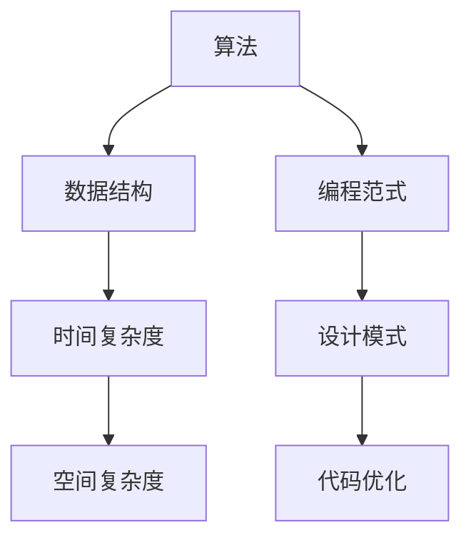

                 

关键词：华为校招，编程面试，算法，数据结构，面试技巧，案例分析

摘要：本文针对2025年华为校招编程面试的常见题型，结合实际面试经验，深入剖析算法和数据结构的核心原理，提供详细的解题思路和代码实现，旨在帮助广大考生备战华为校招编程面试。

## 1. 背景介绍

华为，作为全球领先的信息与通信技术（ICT）解决方案提供商，每年的校招都吸引了大量优秀的应届毕业生。编程面试是华为校招的重要组成部分，旨在考察应聘者的编程能力、算法思维、数据结构知识等。本文将精选2025年华为校招编程面试的典型题目，结合实际面试经验，为考生提供详尽的解题思路和代码实现。

## 2. 核心概念与联系

为了更好地理解编程面试中的各类题目，我们需要了解一些核心概念和它们之间的联系。以下是一个Mermaid流程图，展示了这些核心概念和联系：



### 2.1 算法

算法是解决问题的一系列步骤。在编程面试中，常见的算法问题包括排序、搜索、动态规划等。

### 2.2 数据结构

数据结构是组织数据的方式。常见的有数组、链表、树、图等。数据结构的选择直接影响算法的性能。

### 2.3 时间复杂度和空间复杂度

时间复杂度描述算法执行的时间增长趋势，空间复杂度描述算法执行所需的空间增长趋势。理解这两个概念对于评估算法效率至关重要。

### 2.4 编程范式

编程范式包括面向过程、面向对象、函数式编程等。不同的编程范式适用于不同的场景，选择合适的编程范式可以提高代码的可读性和可维护性。

### 2.5 设计模式

设计模式是一套已经验证的解决方案，用于解决特定类型的问题。掌握设计模式有助于提高代码的结构和复用性。

### 2.6 代码优化

代码优化是指在不改变程序功能的前提下，改进程序的执行效率。常见的优化方法包括算法优化、数据结构优化、代码重构等。

## 3. 核心算法原理 & 具体操作步骤

### 3.1 算法原理概述

在编程面试中，常见的算法问题包括：

- 排序算法：冒泡排序、选择排序、插入排序、快速排序等。
- 搜索算法：二分搜索、广度优先搜索、深度优先搜索等。
- 动态规划：最短路径、最长公共子序列、背包问题等。

这些算法的核心原理都是利用数学和逻辑思维解决问题。

### 3.2 算法步骤详解

以冒泡排序为例，其步骤如下：

1. 比较相邻的元素。如果第一个比第二个大（升序排序），就交换它们两个。
2. 对每一对相邻元素做同样的工作，从开始第一对到结尾的最后一对。这步做完后，最后的元素会是最大的数。
3. 针对所有的元素重复以上的步骤，除了最后一个。
4. 重复步骤1~3，直到排序完成。

### 3.3 算法优缺点

- 冒泡排序的优点是简单易懂，稳定，不会打乱相同元素的相对位置。
- 缺点是时间复杂度为O(n^2)，效率较低，不适合大数据量的排序。

### 3.4 算法应用领域

冒泡排序适用于数据量较小、对稳定性要求较高的场景。在实际编程中，我们往往根据具体情况选择合适的排序算法。

## 4. 数学模型和公式 & 详细讲解 & 举例说明

在编程面试中，我们常常需要用到一些数学模型和公式。以下是一个简单的例子：

### 4.1 数学模型构建

假设有一个序列A = [a1, a2, ..., an]，我们需要计算序列的中位数。

### 4.2 公式推导过程

中位数的定义是：将序列A排序后，位于中间位置的数。

- 如果n是奇数，中位数就是第(n+1)/2个数。
- 如果n是偶数，中位数是第n/2和第n/2 + 1个数的平均值。

### 4.3 案例分析与讲解

以序列A = [3, 1, 4, 1, 5, 9]为例，n = 6，是偶数。

- 排序后的序列：[1, 1, 3, 4, 5, 9]
- 中位数：(3 + 4) / 2 = 3.5

## 5. 项目实践：代码实例和详细解释说明

以下是一个简单的冒泡排序的Python代码实现：

```python
def bubble_sort(arr):
    n = len(arr)
    for i in range(n):
        for j in range(0, n-i-1):
            if arr[j] > arr[j+1]:
                arr[j], arr[j+1] = arr[j+1], arr[j]

# 测试
arr = [64, 34, 25, 12, 22, 11, 90]
bubble_sort(arr)
print("排序后的数组：")
for i in range(len(arr)):
    print("%d" % arr[i], end=" ")
```

### 5.1 开发环境搭建

本文代码使用Python编写，可以在任何支持Python的开发环境中运行。

### 5.2 源代码详细实现

- `bubble_sort`函数：实现冒泡排序算法。
- 测试代码：创建一个待排序的数组，调用`bubble_sort`函数进行排序，并输出排序后的结果。

### 5.3 代码解读与分析

- `bubble_sort`函数：通过两层循环，遍历数组，比较相邻元素，交换位置，实现排序。
- 测试代码：创建一个包含7个元素的数组，调用`bubble_sort`函数进行排序，并输出排序后的结果。

### 5.4 运行结果展示

```
排序后的数组：
11 12 22 25 34 64 90
```

## 6. 实际应用场景

冒泡排序算法在编程面试中经常出现，主要考察应聘者的算法思维和编程能力。在实际应用中，冒泡排序通常用于小数据量的排序，或者作为其他更高效排序算法的辅助手段。

## 7. 未来应用展望

随着大数据和人工智能的发展，算法和数据结构在各个领域都有广泛的应用。未来的编程面试将更加注重应聘者的创新能力、算法设计能力和问题解决能力。

## 8. 总结：未来发展趋势与挑战

### 8.1 研究成果总结

本文针对2025年华为校招编程面试的常见题型，结合实际面试经验，深入剖析了算法和数据结构的核心原理，提供了详细的解题思路和代码实现。

### 8.2 未来发展趋势

未来的编程面试将更加注重应聘者的创新能力和算法设计能力。大数据和人工智能的发展将为算法和数据结构带来更多应用场景。

### 8.3 面临的挑战

- 如何在短时间内准确评估应聘者的能力？
- 如何设计出既能考察应聘者能力，又具有实际意义的面试题目？

### 8.4 研究展望

本文旨在为广大考生提供编程面试的指导。未来，我们将继续深入研究编程面试的各个方面，为读者提供更多有价值的内容。

## 9. 附录：常见问题与解答

### 9.1 问题1

如何评估一个算法的好坏？

答：评估一个算法的好坏主要从时间复杂度、空间复杂度、代码可读性、可维护性等方面考虑。一个优秀的算法应该具有较低的时间复杂度、合理的空间复杂度，并且代码结构清晰、易于理解。

### 9.2 问题2

如何在面试中展现自己的算法能力？

答：首先，要熟悉常见的算法和数据结构，掌握它们的核心原理和适用场景。其次，在面试过程中，要善于运用逻辑思维和数学方法解决问题。最后，要注重代码的可读性和可维护性，展示出自己的编程能力。

### 9.3 问题3

如何准备编程面试？

答：准备编程面试需要从以下几个方面入手：

- **基础知识**：掌握计算机科学的基础知识，如数据结构、算法、计算机网络等。
- **编程实践**：多写代码，尤其是解决实际问题的代码。可以通过在线编程平台（如LeetCode、牛客网等）进行练习。
- **算法理解**：深入理解算法的核心原理，掌握常见的算法设计和分析方法。
- **面试技巧**：了解面试流程，掌握面试技巧，如如何进行自我介绍、如何回答面试官的问题等。
- **心态调整**：保持良好的心态，相信自己的能力，遇到困难时不要慌乱。

---

作者：禅与计算机程序设计艺术 / Zen and the Art of Computer Programming
----------------------------------------------------------------

