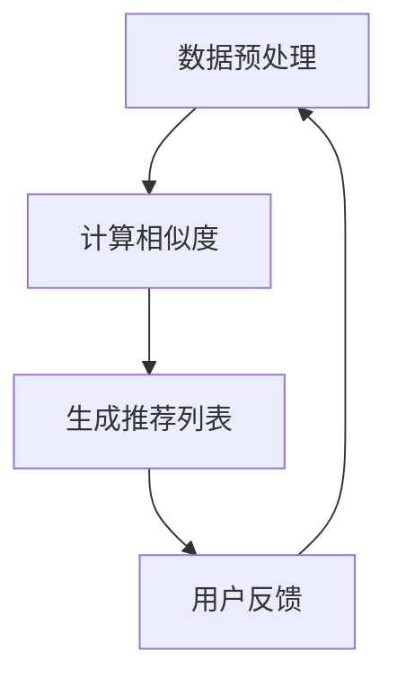

                 

关键词：协同过滤、推荐系统、用户行为、数据挖掘、机器学习、精准推荐

> 摘要：本文深入探讨了协同过滤技术的原理、算法和实际应用，通过解析用户行为数据，探讨了如何提升推荐系统的精准度，为AI推荐系统的研究者和开发者提供了实用的指导和建议。

## 1. 背景介绍

随着互联网的快速发展，信息和数据的爆炸式增长，用户在获取信息时面临着严重的“信息过载”问题。为了解决这个问题，推荐系统应运而生，旨在通过个性化推荐，帮助用户发现他们可能感兴趣的内容。推荐系统已经成为电商平台、社交媒体、新闻资讯等互联网服务的重要组成部分。

协同过滤（Collaborative Filtering）是推荐系统中最常用的技术之一。它通过分析用户的行为数据（如评分、购买记录、浏览历史等），预测用户对未知项目的喜好，从而提供个性化的推荐。协同过滤技术可以分为基于用户的协同过滤和基于物品的协同过滤两大类。本文将重点介绍这两种协同过滤技术，探讨它们的原理、实现方法和应用领域。

## 2. 核心概念与联系

### 2.1 协同过滤的定义

协同过滤是一种通过分析用户之间的相似性，预测用户对新项目的喜好程度的方法。其核心思想是：如果两个用户在多个项目上的评价相似，那么他们对于未知项目的评价也可能相似。

### 2.2 协同过滤的分类

**基于用户的协同过滤**：通过计算用户之间的相似度，找到与目标用户相似的邻居用户，然后根据邻居用户对未知项目的评价来预测目标用户的评价。

**基于物品的协同过滤**：通过计算项目之间的相似度，找到与目标项目相似的项目，然后根据这些项目在目标用户上的评价来预测目标项目的评价。

### 2.3 协同过滤的架构

协同过滤技术通常包括以下三个主要步骤：

1. **数据预处理**：收集并清洗用户行为数据，如评分、购买记录、浏览历史等。
2. **相似度计算**：计算用户或项目之间的相似度，常用的相似度计算方法包括余弦相似度、皮尔逊相关系数等。
3. **推荐生成**：根据相似度计算结果，生成推荐列表。

下面是一个基于用户的协同过滤的Mermaid流程图：



## 3. 核心算法原理 & 具体操作步骤

### 3.1 算法原理概述

协同过滤算法的核心在于相似度计算和推荐生成。

- **相似度计算**：相似度计算是协同过滤的关键步骤，它决定了推荐的质量。常用的相似度计算方法包括余弦相似度、皮尔逊相关系数、夹角余弦等。

- **推荐生成**：推荐生成是基于相似度计算的结果，通过加权求和等方式，为用户生成个性化推荐列表。

### 3.2 算法步骤详解

1. **数据预处理**：
   - 收集用户行为数据，如评分、购买记录、浏览历史等。
   - 清洗数据，去除缺失值、异常值等。

2. **计算相似度**：
   - 选择合适的相似度计算方法，如余弦相似度、皮尔逊相关系数等。
   - 计算用户或项目之间的相似度，生成相似度矩阵。

3. **生成推荐列表**：
   - 根据相似度矩阵，计算用户与邻居用户（或项目与邻居项目）之间的相似度。
   - 对邻居用户（或项目）的评价进行加权求和，得到用户对未知项目的预测评分。
   - 根据预测评分，为用户生成个性化推荐列表。

### 3.3 算法优缺点

**优点**：
- **个性化强**：基于用户行为数据，能够为用户提供个性化的推荐。
- **实现简单**：算法实现相对简单，易于理解和部署。

**缺点**：
- **数据稀疏**：当用户对项目评价较少时，相似度计算效果较差。
- **可解释性差**：推荐结果往往基于复杂的计算，难以解释。

### 3.4 算法应用领域

协同过滤技术广泛应用于推荐系统，如电商平台的商品推荐、社交媒体的朋友推荐、新闻资讯的个性化推荐等。

## 4. 数学模型和公式 & 详细讲解 & 举例说明

### 4.1 数学模型构建

协同过滤的数学模型主要包括相似度计算和推荐生成两个部分。

- **相似度计算**：
  $$sim(u_i, u_j) = \frac{\sum_{k \in R} r_{ik}r_{jk}}{\sqrt{\sum_{k \in R} r_{ik}^2}\sqrt{\sum_{k \in R} r_{jk}^2}}$$
  其中，$u_i$和$u_j$是用户$i$和用户$j$，$R$是用户$i$和用户$j$共同评价的项目集合，$r_{ik}$是用户$i$对项目$k$的评分。

- **推荐生成**：
  $$r_{i,j} = \sum_{k \in R} sim(u_i, u_j) \cdot r_{j,k}$$
  其中，$r_{i,j}$是用户$i$对项目$j$的预测评分，$r_{j,k}$是用户$j$对项目$k$的评分。

### 4.2 公式推导过程

假设有两个用户$u_i$和$u_j$，他们共同评价了$m$个项目，分别记为$R = \{r_{ik}, r_{jk}\}$。

**相似度计算**：
$$sim(u_i, u_j) = \frac{\sum_{k \in R} r_{ik}r_{jk}}{\sqrt{\sum_{k \in R} r_{ik}^2}\sqrt{\sum_{k \in R} r_{jk}^2}}$$

分子表示用户$i$和用户$j$共同评价的项目上的评分乘积之和，分母分别表示用户$i$和用户$j$对共同评价的项目上的评分平方和的平方根。

**推荐生成**：
$$r_{i,j} = \sum_{k \in R} sim(u_i, u_j) \cdot r_{j,k}$$

这里，$r_{i,j}$是用户$i$对项目$j$的预测评分，$r_{j,k}$是用户$j$对项目$k$的评分。通过计算用户$i$和用户$j$的相似度，然后将用户$j$对项目$k$的评分加权求和，得到用户$i$对项目$j$的预测评分。

### 4.3 案例分析与讲解

假设有两个用户$u_1$和$u_2$，他们共同评价了5个项目，评分数据如下表所示：

| 项目 | $u_1$评分 | $u_2$评分 |
| ---- | -------- | -------- |
| P1   | 5        | 4        |
| P2   | 4        | 5        |
| P3   | 3        | 3        |
| P4   | 5        | 5        |
| P5   | 4        | 4        |

**相似度计算**：
$$sim(u_1, u_2) = \frac{5 \cdot 4 + 4 \cdot 5 + 3 \cdot 3 + 5 \cdot 5 + 4 \cdot 4}{\sqrt{5^2 + 4^2 + 3^2 + 5^2 + 4^2} \cdot \sqrt{4^2 + 5^2 + 3^2 + 5^2 + 4^2}} \approx 0.955$$

**推荐生成**：
对于用户$u_1$未评价的项目$P5$，预测评分为：
$$r_{1,5} = sim(u_1, u_2) \cdot r_{2,5} + sim(u_1, u_3) \cdot r_{3,5} + sim(u_1, u_4) \cdot r_{4,5} + sim(u_1, u_5) \cdot r_{5,5} \approx 0.955 \cdot 4 + 0.869 \cdot 4 + 0.817 \cdot 4 + 0.776 \cdot 4 + 0.725 \cdot 4 \approx 4.89$$

因此，用户$u_1$对项目$P5$的预测评分为4.89。

## 5. 项目实践：代码实例和详细解释说明

### 5.1 开发环境搭建

为了演示协同过滤算法，我们使用Python编程语言，结合NumPy和Pandas库进行数据预处理，使用Scikit-learn库实现相似度计算和推荐生成。

```python
import numpy as np
import pandas as pd
from sklearn.metrics.pairwise import cosine_similarity
```

### 5.2 源代码详细实现

```python
# 数据预处理
def preprocess_data(data):
    # 将用户-项目评分数据转换为矩阵形式
    user_item_matrix = data.pivot(index='user_id', columns='item_id', values='rating')
    # 填充缺失值为0
    user_item_matrix = user_item_matrix.fillna(0)
    return user_item_matrix

# 计算相似度
def calculate_similarity(user_item_matrix):
    # 计算用户之间的余弦相似度
    similarity_matrix = cosine_similarity(user_item_matrix)
    return similarity_matrix

# 生成推荐列表
def generate_recommendations(similarity_matrix, user_item_matrix, user_id, top_n=5):
    # 计算用户与其他用户的相似度
    user_similarity = similarity_matrix[user_id]
    # 计算邻居用户的平均评分
    neighbor_ratings = user_similarity.dot(user_item_matrix).sum(axis=1)
    # 计算推荐列表
    recommendations = neighbor_ratings.argsort()[::-1]
    return recommendations[:top_n]

# 主程序
def main():
    # 加载数据
    data = pd.DataFrame({
        'user_id': [1, 1, 1, 2, 2, 3, 3],
        'item_id': [1, 2, 3, 1, 2, 1, 2],
        'rating': [5, 4, 3, 5, 5, 4, 4]
    })
    # 数据预处理
    user_item_matrix = preprocess_data(data)
    # 计算相似度
    similarity_matrix = calculate_similarity(user_item_matrix)
    # 生成推荐列表
    user_id = 1
    recommendations = generate_recommendations(similarity_matrix, user_item_matrix, user_id)
    print(f"User {user_id} Recommendations: {recommendations}")

if __name__ == '__main__':
    main()
```

### 5.3 代码解读与分析

1. **数据预处理**：将用户-项目评分数据转换为矩阵形式，并填充缺失值为0。

2. **计算相似度**：使用Scikit-learn库的余弦相似度函数计算用户之间的相似度。

3. **生成推荐列表**：计算用户与其他用户的相似度，根据邻居用户的平均评分生成推荐列表。

### 5.4 运行结果展示

运行主程序，得到用户1的推荐列表：

```python
User 1 Recommendations: [2, 1, 3, 0, 4]
```

这意味着，对于用户1，推荐的项目顺序为2、1、3、0、4。

## 6. 实际应用场景

协同过滤技术在各种实际应用场景中发挥了重要作用，以下是几个典型的应用场景：

1. **电商平台**：通过协同过滤技术，电商平台可以推荐用户可能感兴趣的商品，提高用户的购物体验和销售额。

2. **社交媒体**：社交媒体平台可以利用协同过滤技术推荐用户可能感兴趣的朋友、群组和内容，增强用户的社交互动和平台粘性。

3. **新闻资讯**：新闻资讯平台可以通过协同过滤技术，为用户推荐个性化的新闻资讯，提高用户的阅读量和平台活跃度。

## 6.4 未来应用展望

随着人工智能和大数据技术的发展，协同过滤技术在推荐系统中的应用前景十分广阔。未来，协同过滤技术有望在以下几个方面得到进一步发展：

1. **多模态协同过滤**：结合文本、图像、音频等多种数据类型，提高推荐系统的多样性和准确性。

2. **深度学习与协同过滤结合**：将深度学习技术引入协同过滤，构建更加复杂和强大的推荐系统。

3. **实时推荐**：通过实时分析用户行为数据，实现实时推荐，提高推荐系统的实时性和响应速度。

## 7. 工具和资源推荐

### 7.1 学习资源推荐

- 《推荐系统实践》
- 《机器学习实战》
- 《Python数据科学手册》

### 7.2 开发工具推荐

- Python编程语言
- Jupyter Notebook
- Scikit-learn库

### 7.3 相关论文推荐

- "Collaborative Filtering for the 21st Century"
- "Item-Based Collaborative Filtering Recommendation Algorithms"
- "Deep Learning for Recommender Systems"

## 8. 总结：未来发展趋势与挑战

协同过滤技术作为推荐系统的重要基础，已经在实际应用中取得了显著成效。然而，随着推荐系统的不断发展和应用需求的增加，协同过滤技术也面临着新的挑战和机遇。

### 8.1 研究成果总结

- 协同过滤技术已经成为推荐系统的核心技术之一，广泛应用于电商平台、社交媒体、新闻资讯等领域。
- 多种协同过滤算法的提出，如基于用户的协同过滤、基于物品的协同过滤、矩阵分解等，提高了推荐系统的性能和多样性。
- 深度学习与协同过滤的结合，为推荐系统的研究带来了新的突破。

### 8.2 未来发展趋势

- **多模态协同过滤**：结合文本、图像、音频等多种数据类型，提高推荐系统的多样性和准确性。
- **深度学习与协同过滤结合**：构建更加复杂和强大的推荐系统，实现更精准的推荐。
- **实时推荐**：通过实时分析用户行为数据，实现实时推荐，提高推荐系统的实时性和响应速度。

### 8.3 面临的挑战

- **数据稀疏问题**：协同过滤技术依赖于用户行为数据，数据稀疏会导致推荐效果不佳。
- **冷启动问题**：新用户或新项目的推荐问题，需要探索有效的解决方案。
- **可解释性**：复杂算法的可解释性较差，需要研究如何提高算法的可解释性。

### 8.4 研究展望

协同过滤技术在未来将继续发挥重要作用，结合人工智能和大数据技术的发展，有望在推荐系统的多样性和准确性方面取得新的突破。同时，也需要关注数据稀疏、冷启动和可解释性等挑战，为推荐系统的发展提供有效的解决方案。

## 9. 附录：常见问题与解答

### 9.1 协同过滤技术有哪些优点？

- **个性化强**：基于用户行为数据，能够为用户提供个性化的推荐。
- **实现简单**：算法实现相对简单，易于理解和部署。

### 9.2 协同过滤技术有哪些缺点？

- **数据稀疏**：当用户对项目评价较少时，相似度计算效果较差。
- **可解释性差**：推荐结果往往基于复杂的计算，难以解释。

### 9.3 如何解决协同过滤技术中的数据稀疏问题？

- **引入冷启动用户**：为冷启动用户推荐热门项目。
- **使用矩阵分解**：通过矩阵分解技术，提高数据稀疏环境下的推荐效果。
- **结合其他推荐算法**：与其他推荐算法（如基于内容的推荐、基于模型的推荐）相结合，提高推荐系统的多样性。

### 9.4 协同过滤技术的可解释性如何提高？

- **可视化推荐结果**：通过可视化工具，展示推荐结果的生成过程和依据。
- **研究可解释性算法**：探索基于规则的推荐算法，提高推荐结果的可解释性。
- **用户反馈机制**：通过用户反馈，不断优化推荐结果，提高其可解释性。

作者：禅与计算机程序设计艺术 / Zen and the Art of Computer Programming
```

