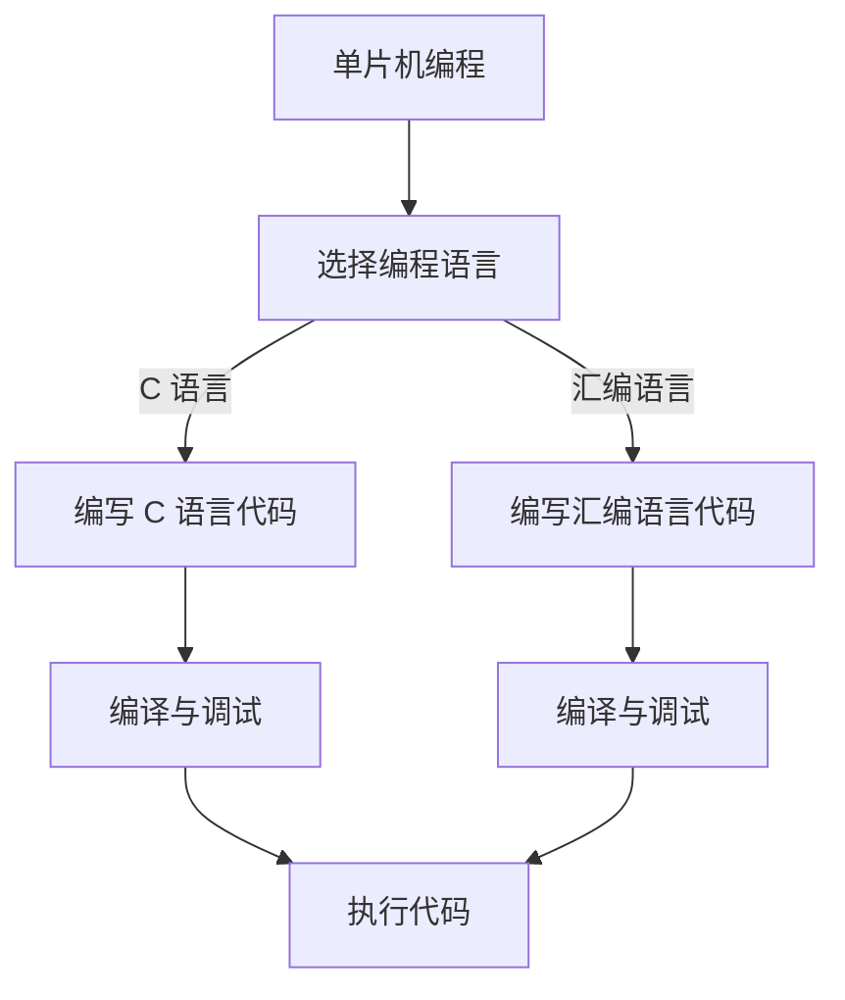

                 

关键词：单片机编程，C 语言，汇编语言，嵌入式系统，编程技巧，硬件编程，微控制器。

摘要：本文旨在深入探讨单片机编程中的两种主要语言：C 语言和汇编语言。通过分析这两种语言的特点、应用场景以及编程技巧，帮助读者更好地理解和掌握单片机编程，提高开发效率。

## 1. 背景介绍

单片机（Microcontroller Unit，简称 MCU）是一种集成度高、功能强大的微处理器，广泛应用于工业控制、智能家居、物联网等各个领域。随着技术的不断发展，单片机的性能和功能也在不断提升，使得编程语言的选择成为影响开发效率和系统性能的重要因素。

在单片机编程中，C 语言和汇编语言是两种常用的编程语言。C 语言具有简洁、高效、易学等优点，被广泛应用于嵌入式系统开发；而汇编语言则具有更贴近硬件的特性，能够实现更高效的代码，但学习成本较高。

本文将详细介绍单片机编程中的 C 语言和汇编语言，帮助读者更好地理解这两种语言的特点和应用场景，掌握单片机编程的核心技巧。

## 2. 核心概念与联系

### 2.1 C 语言

C 语言是一种高级编程语言，具有简洁、高效、易学等优点。在单片机编程中，C 语言的主要特点如下：

- **简洁性**：C 语言的语法简洁，易于阅读和理解，适合编写大规模嵌入式系统程序。
- **高效性**：C 语言的编译器能够生成高效的机器代码，适用于对性能有较高要求的单片机应用。
- **易学性**：C 语言具有良好的学习曲线，适合初学者入门。

### 2.2 汇编语言

汇编语言是一种低级编程语言，与硬件有直接的联系。在单片机编程中，汇编语言的主要特点如下：

- **贴近硬件**：汇编语言能够直接操作硬件资源，实现更高效的代码。
- **灵活性**：汇编语言具有很高的灵活性，可以根据实际需求进行优化。
- **复杂度**：汇编语言的学习成本较高，需要读者具备一定的硬件基础和编程经验。

### 2.3 Mermaid 流程图

为了更直观地展示 C 语言和汇编语言在单片机编程中的应用，我们使用 Mermaid 流程图进行描述。以下是一个简单的 Mermaid 流程图示例：



## 3. 核心算法原理 & 具体操作步骤

### 3.1 算法原理概述

在单片机编程中，算法的选择直接影响系统的性能和效率。C 语言和汇编语言在算法实现方面各有优势。

- **C 语言**：C 语言具有较高的抽象层次，适合编写复杂的算法。C 语言的编译器能够生成高效的机器代码，提高系统性能。
- **汇编语言**：汇编语言与硬件有直接的联系，能够实现更高效的算法。但汇编语言的编写难度较大，需要读者具备一定的硬件基础和编程经验。

### 3.2 算法步骤详解

#### 3.2.1 C 语言算法步骤

1. 分析需求，确定算法。
2. 编写 C 语言代码。
3. 使用编译器编译代码。
4. 调试代码，优化性能。

#### 3.2.2 汇编语言算法步骤

1. 分析需求，确定算法。
2. 编写汇编语言代码。
3. 使用汇编器汇编代码。
4. 调试代码，优化性能。

### 3.3 算法优缺点

- **C 语言**：优点：简洁、高效、易学；缺点：抽象层次较高，无法直接操作硬件资源。
- **汇编语言**：优点：贴近硬件，实现高效算法；缺点：学习成本高，编写难度大。

### 3.4 算法应用领域

- **C 语言**：广泛应用于嵌入式系统开发，如工业控制、智能家居、物联网等。
- **汇编语言**：主要用于对性能有较高要求的嵌入式系统开发，如实时操作系统、嵌入式 CPU 核心等。

## 4. 数学模型和公式

在单片机编程中，数学模型和公式是算法实现的基础。以下是一个简单的数学模型示例：

### 4.1 数学模型构建

设单片机的时钟频率为 \( f \)，执行一条指令所需时间为 \( t \)，则单片机执行 \( n \) 条指令所需时间为：

\[ T = n \times t = \frac{n \times t}{f} \]

### 4.2 公式推导过程

根据单片机的时钟频率 \( f \)，可知每秒执行指令的次数为 \( f \) 次。因此，执行 \( n \) 条指令所需时间为 \( \frac{n}{f} \) 秒。

又因为执行一条指令所需时间为 \( t \)，所以执行 \( n \) 条指令所需时间为 \( n \times t \)。

将 \( t \) 替换为 \( \frac{1}{f} \)，得到：

\[ T = n \times t = \frac{n \times t}{f} \]

### 4.3 案例分析与讲解

假设单片机的时钟频率为 100 MHz，执行一条指令所需时间为 10 ns，现需执行 1000 条指令，求执行时间。

根据数学模型，执行时间为：

\[ T = \frac{1000 \times 10}{100 \times 10^6} = 0.1 \text{秒} \]

## 5. 项目实践：代码实例和详细解释说明

在本节中，我们将通过一个简单的项目实例，展示如何使用 C 语言和汇编语言编写单片机程序。

### 5.1 开发环境搭建

- **C 语言开发环境**：使用 Keil μVision 作为 C 语言开发环境。
- **汇编语言开发环境**：使用 MASM 作为汇编语言开发环境。

### 5.2 源代码详细实现

以下是一个使用 C 语言编写的单片机程序示例：

```c
#include <REGX51.H>

void delay(unsigned int n) {
    unsigned int i, j;
    for (i = 0; i < n; i++)
        for (j = 0; j < 100; j++);
}

void main() {
    while (1) {
        P1 = 0xFF;    // 发送高电平
        delay(500);   // 延时
        P1 = 0x00;    // 发送低电平
        delay(500);   // 延时
    }
}
```

以下是一个使用汇编语言编写的单片机程序示例：

```assembly
.MODEL SMALL
.STACK 100H

.DATA
DELAY EQU 500

.CODE
MAIN PROC
    MOV AX, @DATA
    MOV DS, AX

LABEL1:
    MOV AL, 0FFH
    MOV P1, AL
    CALL DELAY
    MOV AL, 00H
    MOV P1, AL
    CALL DELAY
    JMP LABEL1

DELAY PROC
    MOV CX, DELAY
DELAY_LOOP:
    MOV DX, 100
DELAY_INNER_LOOP:
    DEC DX
    JNZ DELAY_INNER_LOOP
    LOOP DELAY_LOOP
    RET
DELAY ENDP

MAIN ENDP
END MAIN
```

### 5.3 代码解读与分析

- **C 语言程序**：程序通过调用 `P1` 寄存器控制 P1 端口输出高电平和低电平，实现 LED 灯的闪烁。
- **汇编语言程序**：程序使用 `MOV` 指令控制 P1 端口输出高电平和低电平，实现 LED 灯的闪烁。

### 5.4 运行结果展示

- **C 语言程序**：编译并下载程序后，单片机会控制 LED 灯按照设定的频率闪烁。
- **汇编语言程序**：编译并下载程序后，单片机会控制 LED 灯按照设定的频率闪烁。

## 6. 实际应用场景

C 语言和汇编语言在单片机编程中具有广泛的应用场景。以下是一些典型的应用案例：

- **工业控制**：C 语言和汇编语言广泛应用于工业控制系统中的温度、湿度、压力等传感器数据采集和处理。
- **智能家居**：C 语言和汇编语言用于实现智能家居设备的控制功能，如智能门锁、智能照明等。
- **物联网**：C 语言和汇编语言用于开发物联网设备，实现设备间的通信和数据处理。

## 7. 工具和资源推荐

### 7.1 学习资源推荐

- **书籍**：
  - 《C 语言编程教程》
  - 《汇编语言：硬件、工具与接口》
- **在线教程**：
  - 《嵌入式 C 语言编程》
  - 《汇编语言入门教程》

### 7.2 开发工具推荐

- **开发环境**：
  - Keil μVision
  - MASM

### 7.3 相关论文推荐

- 《基于单片机的智能家居系统设计与实现》
- 《嵌入式系统中的汇编语言优化技术研究》

## 8. 总结：未来发展趋势与挑战

随着单片机技术的不断发展，C 语言和汇编语言在单片机编程中的应用前景将越来越广阔。未来发展趋势主要包括：

- **性能优化**：针对不同应用场景，对 C 语言和汇编语言进行性能优化，提高系统性能。
- **开发工具改进**：不断改进开发工具，提高开发效率和代码质量。

然而，单片机编程也面临着一些挑战，如：

- **学习成本**：汇编语言的学习成本较高，需要读者具备一定的硬件基础和编程经验。
- **开发效率**：C 语言和汇编语言在开发效率方面存在差异，需要根据实际需求进行选择。

总之，C 语言和汇编语言在单片机编程中具有各自的优势和应用场景。掌握这两种语言，将有助于提高单片机编程的开发效率和系统性能。

## 9. 附录：常见问题与解答

### 9.1 如何选择编程语言？

根据实际需求选择编程语言。如果对性能有较高要求，可以考虑使用汇编语言；如果需要开发复杂系统，可以考虑使用 C 语言。

### 9.2 单片机编程需要注意什么？

单片机编程需要注意硬件资源的合理分配、代码的可读性和可维护性。同时，要熟悉单片机的硬件结构和指令集，以便更好地编写程序。

### 9.3 如何优化单片机程序性能？

可以通过优化算法、减少指令数量、合理分配内存等方式来优化单片机程序性能。

### 9.4 如何调试单片机程序？

使用调试工具，如 Keil μVision 中的调试器，对单片机程序进行调试。通过设置断点、观察变量值、单步执行等方式，找出程序中的错误并进行修复。

## 作者署名

作者：禅与计算机程序设计艺术 / Zen and the Art of Computer Programming

