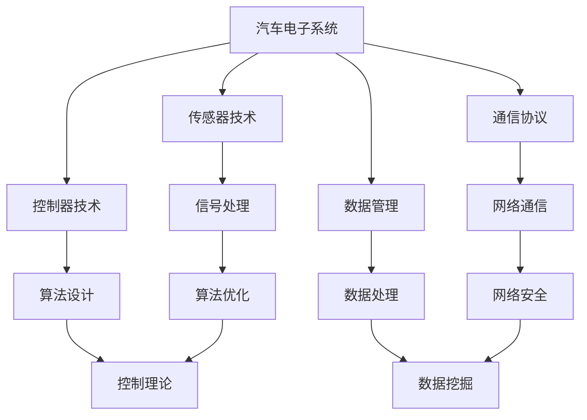

                 

关键词：博世、2025、社招、汽车电子、系统工程师、面试攻略、技术面试、职业发展

> 摘要：本文旨在为准备参加博世2025年社招汽车电子系统工程师面试的候选人提供一份详细的面试攻略。文章将涵盖背景介绍、核心概念与联系、核心算法原理与操作步骤、数学模型与公式、项目实践、实际应用场景、工具与资源推荐、以及总结和展望等内容，帮助候选人更好地应对面试挑战，实现职业发展。

## 1. 背景介绍

博世（Bosch）是全球领先的科技公司之一，以其在汽车技术、工业技术、消费品技术等领域的技术创新和卓越性能而闻名。随着汽车产业的快速发展和智能化进程的加速，博世对汽车电子系统工程师的需求日益增加。作为一家技术驱动的公司，博世社招汽车电子系统工程师的面试标准极为严格，要求候选人具备扎实的专业知识和丰富的实践经验。本文将围绕这一主题，为准备参加博世2025年社招面试的候选人提供全面的面试攻略。

### 1.1 博世2025社招背景

在2025年，博世计划在全球范围内招聘一批优秀的汽车电子系统工程师，以支持其业务发展和技术创新。社招岗位通常面向有多年工作经验的专业人才，要求候选人具备扎实的技术背景、丰富的项目经验和良好的团队合作能力。以下是博世2025年社招汽车电子系统工程师的一些主要背景信息：

- **岗位名称**：汽车电子系统工程师
- **招聘时间**：2025年春季和秋季
- **招聘范围**：全球范围
- **岗位职责**：负责汽车电子系统的设计、开发、测试和维护

### 1.2 汽车电子系统工程师的职业发展

汽车电子系统工程师是汽车产业中不可或缺的专业人才。随着自动驾驶、智能网联等技术的快速发展，汽车电子系统工程师的职业前景十分广阔。以下是汽车电子系统工程师的一些职业发展路径：

- **初级工程师**：负责电子系统的设计、开发和测试
- **中级工程师**：负责项目团队的管理和协调，参与关键技术决策
- **高级工程师**：负责关键项目的规划和实施，承担技术创新和团队建设责任
- **专家/主管**：负责部门的技术管理和战略规划，领导团队实现技术创新

## 2. 核心概念与联系

汽车电子系统工程师需要掌握一系列核心概念和关键技术，这些概念和技术的联系构成了汽车电子系统的整体架构。以下是一个简化的Mermaid流程图，展示了一些核心概念及其相互关系。



### 2.1 核心概念简介

- **传感器技术**：用于收集车辆状态和环境信息，如速度、温度、压力等。
- **控制器技术**：包括电机控制、信号处理和算法控制等，用于执行车辆的控制指令。
- **通信协议**：用于数据在车辆各系统之间的传输和交换，如CAN总线、LIN总线等。
- **数据管理**：负责数据的收集、存储、处理和分析，确保数据的安全和可靠性。
- **信号处理**：用于对传感器数据进行滤波、放大、去噪等处理，提高信号质量。
- **算法设计**：包括控制算法、滤波算法、优化算法等，用于实现车辆的控制和性能优化。
- **网络通信**：用于实现车辆与外部设备、云平台的数据交换和通信。
- **数据处理**：用于对收集到的数据进行分析和挖掘，提供决策支持。
- **算法优化**：通过对算法进行改进和优化，提高系统的效率和性能。
- **控制理论**：提供车辆控制的数学基础和理论支持，如PID控制、模糊控制等。
- **网络安全**：确保车辆通信和数据的安全性，防止恶意攻击和入侵。
- **数据挖掘**：用于从海量数据中提取有价值的信息和知识，支持智能决策和优化。

### 2.2 核心概念与联系

这些核心概念和关键技术之间存在着紧密的联系和相互依赖。传感器技术提供基础数据，控制器技术根据算法设计和控制理论进行决策和执行，通信协议和网络通信实现数据传输和交换，数据管理和数据处理则确保数据的安全和有效利用。同时，信号处理和算法优化是提高系统性能和效率的关键技术，网络安全和数据挖掘则为车辆的智能化和安全性提供保障。

## 3. 核心算法原理 & 具体操作步骤

### 3.1 算法原理概述

在汽车电子系统中，核心算法是实现智能控制和安全保障的关键。以下将介绍几种常见的核心算法原理，包括其基本概念、数学模型和具体操作步骤。

### 3.1.1 PID控制算法

PID（比例-积分-微分）控制算法是一种常用的反馈控制算法，适用于动态系统中的位置、速度、加速度等控制。其基本原理是通过比例、积分和微分三个环节对误差信号进行处理，以达到精确控制的目的。

- **比例控制**：根据当前误差大小进行控制，误差越大，控制力度越大。
- **积分控制**：根据误差的积累进行控制，消除稳态误差。
- **微分控制**：根据误差变化率进行控制，预测误差的变化趋势，提高响应速度。

### 3.1.2 模糊控制算法

模糊控制算法是一种基于模糊逻辑的控制方法，适用于非线性、复杂系统。其基本原理是利用模糊集合和模糊规则进行推理，实现对系统的不确定性和模糊性的处理。

- **模糊化**：将输入量模糊化，转化为模糊集合。
- **规则库**：根据专家经验和系统特性建立模糊规则库。
- **推理机**：根据模糊规则进行推理，得到控制输出。

### 3.1.3 神经网络算法

神经网络算法是一种基于模拟人脑神经元连接和信号传递的智能算法。其基本原理是通过多层神经网络对输入数据进行处理和建模，实现对复杂系统的学习和预测。

- **输入层**：接收输入数据，通过权重和偏置进行加权求和。
- **隐藏层**：通过激活函数对加权求和结果进行非线性变换。
- **输出层**：根据输出层的结果进行分类或预测。

### 3.2 算法步骤详解

#### 3.2.1 PID控制算法步骤

1. **初始化**：设置PID控制器的初始参数，包括比例系数Kp、积分系数Ki和微分系数Kd。
2. **采集误差**：实时采集系统误差e(t)。
3. **计算控制量**：根据PID控制算法计算控制量u(t)：
   $$u(t) = K_p \cdot e(t) + K_i \cdot \int_{0}^{t} e(\tau)d\tau + K_d \cdot \frac{d}{dt}e(t)$$
4. **执行控制**：将控制量u(t)输出到执行机构，调整系统状态。
5. **更新参数**：根据系统响应和性能指标，调整PID控制器的参数。

#### 3.2.2 模糊控制算法步骤

1. **初始化**：设置模糊控制器的基本参数，包括输入和输出变量、模糊集合和模糊规则。
2. **模糊化**：将输入量转化为模糊集合，如：
   - 输入误差e：{负大，负中，负小，零，正小，正中，正大}
   - 输入变化率de：{负大，负中，负小，零，正小，正中，正大}
3. **规则库**：根据专家经验建立模糊规则库，如：
   - 如果e是负大且de是负大，那么u是正大
   - 如果e是零且de是零，那么u是零
   - ...
4. **推理机**：根据模糊规则进行推理，计算输出模糊集合。
5. **去模糊化**：将模糊集合转化为具体输出值，如使用重心法。
6. **执行控制**：将输出值输出到执行机构，调整系统状态。

#### 3.2.3 神经网络算法步骤

1. **初始化**：设置神经网络的基本参数，包括网络结构、权重和偏置。
2. **前向传播**：将输入数据通过神经网络进行前向传播，得到输出值。
3. **反向传播**：计算输出值与实际值之间的误差，通过反向传播更新权重和偏置。
4. **训练迭代**：重复前向传播和反向传播，直到网络达到期望性能。
5. **预测**：将新的输入数据通过训练好的神经网络进行预测。

### 3.3 算法优缺点

#### 3.3.1 PID控制算法

**优点**：

- 算法简单，易于实现。
- 对线性系统有较好的控制效果。
- 可根据实际系统进行调整，灵活性强。

**缺点**：

- 对非线性系统效果较差。
- 需要精确的模型参数。
- 难以处理复杂的动态系统。

#### 3.3.2 模糊控制算法

**优点**：

- 对非线性系统有较好的适应性。
- 不需要精确的数学模型。
- 可以处理复杂的多变量系统。

**缺点**：

- 算法复杂度较高，计算量大。
- 需要大量的规则库设计。
- 难以精确地处理动态变化。

#### 3.3.3 神经网络算法

**优点**：

- 对非线性系统有很强的建模能力。
- 可以处理复杂的动态系统。
- 可以自动学习和调整参数。

**缺点**：

- 计算量大，实时性较差。
- 需要大量的训练数据和计算资源。
- 难以解释和控制。

### 3.4 算法应用领域

- **PID控制算法**：广泛应用于汽车发动机控制、ABS制动系统等。
- **模糊控制算法**：广泛应用于自动驾驶、智能交通系统等。
- **神经网络算法**：广泛应用于自动驾驶、智能控制、故障诊断等。

## 4. 数学模型和公式 & 详细讲解 & 举例说明

在汽车电子系统中，数学模型和公式是算法设计和实现的基础。以下将介绍几种常见的数学模型和公式，包括其构建过程、推导过程和实际应用案例。

### 4.1 数学模型构建

#### 4.1.1 控制系统数学模型

控制系统数学模型描述了系统输入与输出之间的关系，常用的数学模型包括传递函数模型、状态空间模型和离散时间模型。以下是一个简单的连续时间传递函数模型：

$$G(s) = \frac{C(s)}{R(s)} = \frac{K_p s + K_i}{s^2 + 2\zeta \omega_n s + \omega_n^2}$$

其中，$C(s)$是输出信号的拉普拉斯变换，$R(s)$是输入信号的拉普拉斯变换，$K_p$是比例系数，$K_i$是积分系数，$\zeta$是阻尼系数，$\omega_n$是自然频率。

#### 4.1.2 神经网络数学模型

神经网络数学模型描述了神经网络的结构和参数，常用的数学模型包括前向传播模型和反向传播模型。以下是一个简单的三层神经网络前向传播模型：

$$z_2 = \sigma(W_1 \cdot x + b_1)$$

$$z_3 = \sigma(W_2 \cdot z_2 + b_2)$$

$$y = \sigma(W_3 \cdot z_3 + b_3)$$

其中，$z_2$和$z_3$是隐藏层的输出，$y$是输出层的输出，$\sigma$是激活函数，$W_1$、$W_2$和$W_3$是权重矩阵，$b_1$、$b_2$和$b_3$是偏置向量。

### 4.2 公式推导过程

#### 4.2.1 PID控制算法公式推导

PID控制算法的公式可以通过积分、微分和比例控制的概念进行推导。以下是PID控制算法的公式推导过程：

$$u(t) = K_p \cdot e(t) + K_i \cdot \int_{0}^{t} e(\tau)d\tau + K_d \cdot \frac{d}{dt}e(t)$$

其中，$e(t)$是系统误差，$u(t)$是控制量，$K_p$、$K_i$和$K_d$分别是比例系数、积分系数和微分系数。

首先，对误差信号进行比例控制：

$$u_1(t) = K_p \cdot e(t)$$

然后，对误差信号的积分进行积分控制：

$$u_2(t) = K_i \cdot \int_{0}^{t} e(\tau)d\tau$$

最后，对误差信号的变化率进行微分控制：

$$u_3(t) = K_d \cdot \frac{d}{dt}e(t)$$

将上述三个控制量相加，得到PID控制算法的最终公式：

$$u(t) = u_1(t) + u_2(t) + u_3(t)$$

#### 4.2.2 神经网络算法公式推导

神经网络算法的公式推导主要涉及前向传播和反向传播的过程。以下是三层神经网络的公式推导过程：

**前向传播**：

$$z_2 = \sigma(W_1 \cdot x + b_1)$$

$$z_3 = \sigma(W_2 \cdot z_2 + b_2)$$

$$y = \sigma(W_3 \cdot z_3 + b_3)$$

其中，$\sigma$是激活函数，$W_1$、$W_2$和$W_3$是权重矩阵，$b_1$、$b_2$和$b_3$是偏置向量。

**反向传播**：

$$\delta_3 = \frac{\partial L}{\partial z_3} \cdot \sigma'(z_3)$$

$$\delta_2 = W_2^T \cdot \delta_3 \cdot \sigma'(z_2)$$

$$\delta_1 = W_1^T \cdot \delta_2 \cdot \sigma'(z_1)$$

其中，$L$是损失函数，$\delta_3$、$\delta_2$和$\delta_1$是误差梯度，$\sigma'$是激活函数的导数。

### 4.3 案例分析与讲解

#### 4.3.1 PID控制算法案例

假设一个速度控制系统，目标速度为100km/h，实际速度为90km/h。使用PID控制算法进行速度调节。

- **初始化**：设置比例系数$K_p=1.2$，积分系数$K_i=0.5$，微分系数$K_d=0.2$。
- **采集误差**：$e(t_0) = 90 - 100 = -10$。
- **计算控制量**：
  $$u(t_0) = K_p \cdot e(t_0) + K_i \cdot \int_{0}^{t_0} e(\tau)d\tau + K_d \cdot \frac{d}{dt}e(t_0)$$
  $$u(t_0) = 1.2 \cdot (-10) + 0.5 \cdot (-10) + 0.2 \cdot (-10) = -12 - 5 - 2 = -19$$
- **执行控制**：增加油门，提高实际速度。
- **更新参数**：根据系统响应和性能指标，调整PID控制器的参数。

通过PID控制算法，系统逐渐达到目标速度，实现精确控制。

#### 4.3.2 神经网络算法案例

假设一个自动驾驶系统，需要根据道路情况和车辆状态进行决策。使用神经网络算法进行决策。

- **初始化**：设置神经网络结构，包括输入层、隐藏层和输出层。
- **前向传播**：输入道路和车辆状态数据，通过神经网络进行前向传播，得到决策输出。
- **反向传播**：计算决策输出与实际决策之间的误差，通过反向传播更新神经网络参数。
- **训练迭代**：重复前向传播和反向传播，直到神经网络达到期望性能。

通过神经网络算法，自动驾驶系统能够根据实时数据做出准确决策，提高行车安全性和效率。

## 5. 项目实践：代码实例和详细解释说明

### 5.1 开发环境搭建

在开始编写代码之前，需要搭建一个合适的开发环境。以下是一个基本的开发环境搭建流程：

1. **安装Python**：下载并安装Python 3.x版本，确保Python环境正确配置。
2. **安装PyTorch**：在终端中运行以下命令安装PyTorch：
   ```bash
   pip install torch torchvision
   ```
3. **安装Numpy和Matplotlib**：在终端中运行以下命令安装Numpy和Matplotlib：
   ```bash
   pip install numpy matplotlib
   ```
4. **创建虚拟环境**：在终端中创建一个名为`project`的虚拟环境，并激活虚拟环境：
   ```bash
   python -m venv project
   source project/bin/activate  # Windows下使用 `project\Scripts\activate`
   ```

### 5.2 源代码详细实现

以下是一个简单的神经网络训练和预测的Python代码实例：

```python
import torch
import torch.nn as nn
import torch.optim as optim
import numpy as np
import matplotlib.pyplot as plt

# 创建数据集
x = np.array([[0, 0], [0, 1], [1, 0], [1, 1]])
y = np.array([[0], [1], [1], [0]])

# 转换为PyTorch张量
x_tensor = torch.tensor(x, dtype=torch.float32)
y_tensor = torch.tensor(y, dtype=torch.float32)

# 定义神经网络结构
class NeuralNetwork(nn.Module):
    def __init__(self):
        super(NeuralNetwork, self).__init__()
        self.layer1 = nn.Linear(2, 3)
        self.layer2 = nn.Linear(3, 1)
        self.relu = nn.ReLU()

    def forward(self, x):
        x = self.relu(self.layer1(x))
        x = self.layer2(x)
        return x

# 实例化神经网络
model = NeuralNetwork()

# 定义损失函数和优化器
criterion = nn.BCELoss()
optimizer = optim.Adam(model.parameters(), lr=0.001)

# 训练神经网络
num_epochs = 1000
for epoch in range(num_epochs):
    optimizer.zero_grad()
    outputs = model(x_tensor)
    loss = criterion(outputs, y_tensor)
    loss.backward()
    optimizer.step()

    if epoch % 100 == 0:
        print(f"Epoch [{epoch+1}/{num_epochs}], Loss: {loss.item():.4f}")

# 预测
with torch.no_grad():
    predictions = model(x_tensor).sigmoid()

# 可视化结果
plt.scatter(x[:, 0], x[:, 1], c=predictions.data.numpy(), s=100, cmap='gray')
plt.xlabel('Feature 1')
plt.ylabel('Feature 2')
plt.title('Neural Network Prediction')
plt.show()
```

### 5.3 代码解读与分析

1. **数据集创建**：首先创建一个简单的二分类数据集，包括四个样本。
2. **数据预处理**：将数据转换为PyTorch张量，并设置为浮点型。
3. **神经网络定义**：定义一个简单的三层神经网络，包括一个输入层、一个隐藏层和一个输出层。隐藏层使用ReLU激活函数。
4. **损失函数和优化器**：定义交叉熵损失函数和BCELoss损失函数，并选择Adam优化器。
5. **训练神经网络**：使用循环进行神经网络训练，每个epoch更新模型参数。
6. **预测**：使用训练好的模型进行预测，并使用sigmoid函数将输出转换为概率。
7. **可视化结果**：使用matplotlib绘制预测结果，展示神经网络对数据的分类能力。

通过上述代码实例，读者可以了解如何使用PyTorch实现一个简单的神经网络，并了解其训练和预测的基本流程。

### 5.4 运行结果展示

在成功运行上述代码后，将出现一个可视化窗口，展示神经网络对输入数据的分类结果。预测结果通常会在散点图上显示为不同的颜色，表示不同的类别。

## 6. 实际应用场景

### 6.1 汽车电子系统在实际中的应用

汽车电子系统在汽车中发挥着越来越重要的作用，从最初的简单电子装置到如今复杂、智能的自动驾驶系统，其应用场景日益广泛。以下是一些汽车电子系统在实际中的应用场景：

#### 6.1.1 驾驶辅助系统

驾驶辅助系统（ADAS）是汽车电子系统的重要组成部分，包括自适应巡航控制（ACC）、车道保持辅助（LKA）、自动紧急制动（AEB）等功能。这些系统利用传感器技术、图像处理技术和算法设计，实现对车辆行驶环境的实时监测和响应，提高驾驶安全性和舒适性。

#### 6.1.2 自动驾驶系统

自动驾驶系统是汽车电子系统的终极目标，目前正逐步从理论研究走向实际应用。自动驾驶系统利用传感器技术、计算机视觉、人工智能和深度学习等技术，实现对车辆周围环境的感知、理解、决策和执行。自动驾驶系统包括L0到L5六个级别，L5为完全自动驾驶，目前仍处于研究和试验阶段。

#### 6.1.3 车联网（V2X）

车联网（V2X）是汽车电子系统发展的一个重要方向，通过车辆与车辆（V2V）、车辆与基础设施（V2I）、车辆与行人（V2P）等通信方式，实现信息的实时交换和共享，提高交通效率和安全性。V2X技术包括车联网通信协议、数据加密和安全认证等关键技术。

### 6.2 汽车电子系统的发展趋势

随着科技的不断进步和汽车产业的转型，汽车电子系统的发展趋势主要表现在以下几个方面：

#### 6.2.1 智能化

智能化是汽车电子系统的发展方向，通过人工智能、大数据和云计算等技术，实现汽车的自我感知、自我决策和自我学习。智能化汽车能够更好地应对复杂交通环境，提高行车安全和舒适性。

#### 6.2.2 网联化

网联化是汽车电子系统的重要特征，通过车联网技术，实现车辆与外部设备、基础设施和行人的信息交换和共享。网联化汽车能够提供更加丰富的功能和服务，如实时路况信息、导航服务、远程诊断等。

#### 6.2.3 电动化

电动化是汽车产业的一个重要趋势，随着电池技术、电机技术和控制技术的进步，电动汽车的性能和续航里程不断提高。电动化汽车将逐步取代传统燃油车，成为汽车市场的主流。

#### 6.2.4 安全性

安全性是汽车电子系统的核心要求，通过传感器技术、通信协议、网络安全和数据加密等技术，确保车辆的通信和数据安全。安全性问题涉及到车辆的驾驶安全、数据安全和网络安全等方面。

### 6.3 汽车电子系统的未来应用展望

未来，汽车电子系统将在以下几个方面实现重要突破：

#### 6.3.1 自动驾驶

自动驾驶技术将在未来得到广泛应用，实现L4、L5级别的自动驾驶功能。自动驾驶技术将提高交通效率、降低交通事故发生率，改善人们出行体验。

#### 6.3.2 车联网

车联网技术将在未来实现更高层次的互联互通，实现车辆与外部设备的无缝连接。车联网技术将带来更加智能、高效的交通系统和城市交通管理。

#### 6.3.3 电动化

电动汽车将逐步替代传统燃油车，成为汽车市场的主流。电动汽车技术的发展将提高续航里程、降低成本，推动能源结构转型。

#### 6.3.4 智能化

智能化技术将广泛应用于汽车电子系统，实现车辆的自我感知、自我决策和自我学习。智能化汽车将提供更加个性化、智能化的服务和体验。

## 7. 工具和资源推荐

### 7.1 学习资源推荐

为了更好地了解和掌握汽车电子系统的相关技术和知识，以下是一些推荐的学习资源：

- **《汽车电子系统原理与应用》**：这本书详细介绍了汽车电子系统的基本原理、核心技术和发展趋势，适合从事汽车电子系统相关工作的技术人员阅读。
- **《深度学习与自动驾驶》**：这本书讲解了深度学习在自动驾驶领域的应用，包括传感器数据处理、环境感知、控制策略等方面，适合对自动驾驶感兴趣的读者。
- **《车联网技术与应用》**：这本书介绍了车联网技术的核心概念、关键技术和发展趋势，包括V2V、V2I和V2P等通信方式，适合从事车联网相关工作的技术人员。

### 7.2 开发工具推荐

以下是一些在汽车电子系统开发中常用的工具：

- **MATLAB**：MATLAB是一个强大的数学计算和可视化工具，广泛应用于信号处理、控制系统设计和仿真等领域。
- **PyTorch**：PyTorch是一个流行的深度学习框架，具有易于使用、灵活性高和强大的扩展性，适合进行深度学习和神经网络开发。
- **MATLAB/Simulink**：MATLAB/Simulink是一个集成了数学计算、仿真建模和可视化功能的集成环境，适合进行控制系统建模和仿真。

### 7.3 相关论文推荐

以下是一些在汽车电子系统、自动驾驶和车联网等领域具有重要影响力的论文：

- **“Autonomous Driving with Probabilistic Road Maps”**：这篇论文介绍了基于概率路图的自动驾驶算法，为自动驾驶系统提供了有效的路径规划和决策方法。
- **“Deep Learning for Autonomous Driving”**：这篇论文探讨了深度学习在自动驾驶领域的应用，包括传感器数据处理、环境感知和决策控制等方面。
- **“V2X Communications for Intelligent Transportation Systems”**：这篇论文介绍了车联网技术在智能交通系统中的应用，包括V2V、V2I和V2P等通信方式，探讨了车联网技术在提高交通效率和安全性方面的潜力。

## 8. 总结：未来发展趋势与挑战

### 8.1 研究成果总结

近年来，汽车电子系统在自动驾驶、车联网、电动化等领域取得了显著的研究成果。深度学习、传感器技术、通信协议和网络技术等新兴技术的应用，使得汽车电子系统的性能和智能化水平不断提高。自动驾驶技术逐步从理论研究走向实际应用，车联网技术实现了更高层次的互联互通，电动汽车成为汽车市场的重要趋势。

### 8.2 未来发展趋势

未来，汽车电子系统将继续朝着智能化、网联化和电动化的方向发展。自动驾驶技术将实现更高层次的自主决策和控制，车联网技术将实现更高效的信息交换和共享，电动汽车将逐渐替代传统燃油车。同时，人工智能、大数据和云计算等技术的应用将进一步提升汽车电子系统的智能化水平。

### 8.3 面临的挑战

尽管汽车电子系统取得了显著进展，但在未来发展过程中仍面临诸多挑战。首先，自动驾驶技术的安全性问题仍然是一个重要的研究课题，如何在复杂交通环境中确保自动驾驶系统的安全和可靠性仍然需要进一步探索。其次，车联网技术的普及和应用需要解决通信延迟、网络带宽和安全等问题。此外，电动汽车的续航里程和充电便利性也是制约其发展的重要因素。

### 8.4 研究展望

未来，汽车电子系统研究将更加注重跨学科、跨领域的合作，推动技术创新和应用。自动驾驶技术将朝着更高效、更安全、更可靠的方向发展，车联网技术将实现更广泛的应用和更高的性能，电动汽车技术将不断提高续航里程和充电效率。同时，人工智能、大数据和云计算等技术的应用将推动汽车电子系统的智能化发展。总之，汽车电子系统领域的发展前景广阔，具有重要的研究和应用价值。

## 9. 附录：常见问题与解答

### 9.1 汽车电子系统工程师面试常见问题

1. **请问您对汽车电子系统有哪些了解？**
   - **回答要点**：介绍汽车电子系统的基本概念、组成部分（如传感器、控制器、通信协议等）以及其在汽车中的应用（如自动驾驶、驾驶辅助系统等）。

2. **您如何理解和应用PID控制算法？**
   - **回答要点**：解释PID控制算法的基本原理，介绍比例、积分和微分三个控制环节的作用，结合实际案例说明PID控制算法的应用。

3. **您对深度学习在自动驾驶中的应用有哪些了解？**
   - **回答要点**：简要介绍深度学习的基本概念，讨论深度学习在自动驾驶中的应用（如传感器数据处理、环境感知、路径规划等）。

4. **请问您如何确保自动驾驶系统的安全性？**
   - **回答要点**：介绍自动驾驶系统安全性的重要性，讨论如何从硬件、软件和通信等方面确保自动驾驶系统的安全性。

5. **请问您对车联网技术有哪些了解？**
   - **回答要点**：介绍车联网的基本概念、组成部分（如V2V、V2I、V2P等）以及车联网技术在提高交通效率和安全性方面的作用。

### 9.2 汽车电子系统工程师面试技巧

1. **充分准备**：提前了解博世公司的企业文化、业务领域和招聘要求，熟悉汽车电子系统的相关技术和应用。

2. **展示技术实力**：通过实际项目经历和成果展示自己的技术实力，突出自己在自动驾驶、控制算法、通信协议等方面的专长。

3. **强调团队合作能力**：汽车电子系统工程师通常需要与多个部门合作，强调自己的团队合作能力，展示自己善于沟通、协作和解决问题的能力。

4. **展示学习能力**：汽车电子系统领域不断发展，强调自己具备快速学习新技术和知识的能力。

5. **注意表达方式**：面试时注意语言表达清晰、逻辑严密，避免使用专业术语过多，确保面试官能够理解。

### 9.3 面试后的跟进

1. **感谢信**：在面试结束后，给面试官发送一封感谢信，表达对面试机会的感激之情，并简要回顾面试中的亮点和收获。

2. **跟进邮件**：在面试结束后的一周内，发送一封跟进邮件，询问面试结果和招聘进展，展示自己的积极性和诚意。

3. **持续关注**：关注博世公司的招聘信息，了解招聘进展，为下一次面试做好准备。

---

通过以上详细的面试攻略，相信准备参加博世2025年社招汽车电子系统工程师面试的候选人能够更好地应对面试挑战，实现职业发展。祝各位面试顺利！

