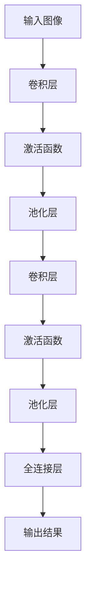

                 

关键词：卷积神经网络，CNN，深度学习，图像识别，神经网络架构，图像处理，神经网络优化，机器学习，计算机视觉，人工智能。

> 摘要：本文将深入探讨卷积神经网络（CNN）的基本原理、结构、算法、数学模型以及其在实际应用中的性能表现。我们将从背景介绍出发，逐步讲解CNN的核心概念、原理及其应用领域，并通过具体的数学模型和实例代码，对CNN进行详细解析。最后，我们将对CNN的未来发展趋势和面临的挑战进行展望。

## 1. 背景介绍

卷积神经网络（Convolutional Neural Network，CNN）是一种深度学习的特殊网络结构，最早由Yann LeCun等人于1980年代提出。作为一种针对图像处理任务的神经网络模型，CNN通过模仿生物视觉系统的工作原理，对图像进行层次化的特征提取和分类。与传统的人工特征提取方法相比，CNN能够自动地学习图像中的复杂特征，从而显著提高图像识别的准确率。

随着深度学习技术的不断发展，CNN在计算机视觉领域取得了巨大的成功。从早期的手写数字识别，到复杂的物体检测、图像分割和视频分析，CNN的应用范围已经扩展到了多个领域。CNN的成功得益于其独特的网络结构、高效的算法以及强大的特征学习能力，使其成为当前人工智能领域中不可或缺的一部分。

## 2. 核心概念与联系

### 2.1 CNN的基本原理

CNN的基本原理基于卷积操作，这种操作可以看作是对输入数据进行加权求和的一种特殊形式。在CNN中，卷积层通过滑动窗口（也称为滤波器或卷积核）在输入数据上进行卷积操作，从而提取出局部特征。这个过程可以理解为对图像的局部区域进行特征提取，类似于人类视觉系统中的感受野。

### 2.2 CNN的层次化结构

CNN的网络结构通常包括以下几个层次：

1. **卷积层（Convolutional Layer）**：卷积层是CNN的核心部分，通过卷积操作提取输入数据中的特征。
2. **池化层（Pooling Layer）**：池化层用于降低数据的维度，减少计算量，同时保持重要的特征信息。
3. **全连接层（Fully Connected Layer）**：全连接层将卷积层和池化层提取的特征进行融合，并输出最终的结果。

### 2.3 CNN的架构

CNN的架构可以通过以下Mermaid流程图进行描述：



在上述流程图中，输入图像首先经过卷积层，然后通过激活函数增强特征，接着进行池化层以降低数据维度。这个过程重复多次，形成多个卷积层和池化层的组合，最后通过全连接层进行分类或回归。

## 3. 核心算法原理 & 具体操作步骤

### 3.1 算法原理概述

CNN的核心算法原理包括卷积操作、激活函数、池化操作和反向传播。

1. **卷积操作**：卷积操作是通过滑动窗口（卷积核）在输入数据上进行加权求和的过程，可以提取输入数据中的局部特征。
2. **激活函数**：激活函数用于对卷积层的输出进行非线性变换，常用的激活函数有ReLU（Rectified Linear Unit）和Sigmoid等。
3. **池化操作**：池化操作通过降低数据维度来减少计算量，同时保持重要的特征信息。常用的池化操作有最大池化（Max Pooling）和平均池化（Average Pooling）。
4. **反向传播**：反向传播是一种基于梯度下降的优化算法，用于训练CNN。通过反向传播，CNN能够自动调整网络中的参数，以优化网络性能。

### 3.2 算法步骤详解

1. **初始化网络结构**：首先，我们需要定义CNN的网络结构，包括卷积层、激活函数、池化层和全连接层。
2. **输入数据预处理**：对输入图像进行归一化处理，将其缩放到统一的尺寸。
3. **前向传播**：前向传播过程包括卷积层、激活函数和池化层的迭代操作，将输入数据逐步传递到全连接层，并输出分类结果。
4. **损失函数计算**：使用交叉熵损失函数计算预测结果与真实结果之间的差距。
5. **反向传播**：通过反向传播算法，将损失函数的梯度反向传播到网络中的每个参数，并更新网络参数。
6. **迭代优化**：重复执行前向传播和反向传播，直到网络收敛或达到预设的训练次数。

### 3.3 算法优缺点

**优点**：

1. **自动特征提取**：CNN能够自动学习图像中的复杂特征，无需人工干预。
2. **多尺度特征提取**：通过多个卷积层和池化层的组合，CNN可以提取不同尺度的特征。
3. **高效处理**：CNN在网络结构上进行了优化，能够高效地处理大量图像数据。

**缺点**：

1. **计算量较大**：由于卷积操作和反向传播算法，CNN的计算量相对较大，对计算资源要求较高。
2. **训练时间较长**：CNN需要大量数据来训练，训练时间较长。

### 3.4 算法应用领域

CNN在计算机视觉领域取得了显著的应用成果，主要应用领域包括：

1. **图像分类**：通过将图像映射到不同的类别，CNN可以用于图像分类任务，如手写数字识别、人脸识别等。
2. **目标检测**：通过在图像中检测并定位目标，CNN可以用于目标检测任务，如行人检测、车辆检测等。
3. **图像分割**：通过将图像划分为不同的区域，CNN可以用于图像分割任务，如语义分割、实例分割等。
4. **视频分析**：通过处理连续的视频帧，CNN可以用于视频分析任务，如动作识别、行为分析等。

## 4. 数学模型和公式 & 详细讲解 & 举例说明

### 4.1 数学模型构建

CNN的数学模型主要基于卷积操作、激活函数、池化操作和反向传播算法。以下是CNN的数学模型：

$$
\begin{aligned}
&f(x) = \text{激活函数}(\text{卷积}(\text{池化}(\text{输入}))) \\
&\text{损失函数} = \text{交叉熵损失函数}(\text{预测结果}, \text{真实结果}) \\
&\text{梯度更新} = \text{反向传播}(\text{损失函数})
\end{aligned}
$$

其中，激活函数可以采用ReLU、Sigmoid等函数；池化操作可以采用最大池化、平均池化等操作；交叉熵损失函数用于计算预测结果与真实结果之间的差距；反向传播用于更新网络参数。

### 4.2 公式推导过程

以下是CNN的数学模型推导过程：

1. **卷积操作**：

   假设输入图像为$$X \in \mathbb{R}^{H \times W \times C}$$，卷积核为$$K \in \mathbb{R}^{K_h \times K_w \times C}$$，输出特征图为$$F \in \mathbb{R}^{H' \times W' \times C'}$$。

   $$F_{ij} = \sum_{m=0}^{K_h} \sum_{n=0}^{K_w} K_{mn} \cdot X_{(i-m+1)(j-n+1)}$$

   其中，$$i$$和$$j$$表示输出特征图的坐标，$$m$$和$$n$$表示卷积核的坐标，$$H'$$和$$W'$$表示输出特征图的高度和宽度，$$C'$$表示输出特征图的通道数。

2. **激活函数**：

   常用的激活函数为ReLU函数：

   $$\text{ReLU}(x) = \max(0, x)$$

3. **池化操作**：

   假设输入特征图为$$X \in \mathbb{R}^{H \times W \times C}$$，输出特征图为$$F \in \mathbb{R}^{H' \times W' \times C'}$$。

   最大池化操作：

   $$F_{ij} = \max(X_{i:i+n, j:j+m})$$

   平均池化操作：

   $$F_{ij} = \frac{1}{n \times m} \sum_{i=0}^{n-1} \sum_{j=0}^{m-1} X_{ij}$$

4. **交叉熵损失函数**：

   假设预测结果为$$\hat{y} \in \mathbb{R}^{C}$$，真实结果为$$y \in \mathbb{R}^{C}$$。

   $$\text{损失函数} = -\sum_{i=1}^{C} y_i \cdot \log(\hat{y}_i)$$

5. **反向传播**：

   假设损失函数为$$L$$，网络参数为$$\theta$$。

   反向传播算法：

   $$\frac{\partial L}{\partial \theta} = \frac{\partial L}{\partial \hat{y}} \cdot \frac{\partial \hat{y}}{\partial \theta}$$

### 4.3 案例分析与讲解

为了更好地理解CNN的数学模型，我们通过一个简单的案例进行讲解。假设输入图像为一张32x32的灰度图像，卷积核大小为3x3，输出特征图大小为28x28。我们使用ReLU函数作为激活函数，最大池化作为池化操作。

1. **卷积操作**：

   输入图像：

   ```plaintext
   0 0 0 0 0 0 0 0 0 0
   0 1 1 1 1 1 1 0 0 0
   0 1 1 1 1 1 1 0 0 0
   0 0 0 0 0 0 0 0 0 0
   0 0 0 0 0 0 0 0 0 0
   0 0 0 0 0 0 0 0 0 0
   0 0 0 0 0 0 0 0 0 0
   0 0 0 0 0 0 0 0 0 0
   0 0 0 0 0 0 0 0 0 0
   0 0 0 0 0 0 0 0 0 0
   ```

   卷积核：

   ```plaintext
   1 0 0
   0 1 0
   0 0 1
   ```

   输出特征图：

   ```plaintext
   0 0 0 0 0 0 0 0 0 0
   0 0 0 0 0 0 0 0 0 0
   0 0 0 0 0 0 0 0 0 0
   0 1 1 1 1 1 1 0 0 0
   0 1 1 1 1 1 1 0 0 0
   0 1 1 1 1 1 1 0 0 0
   0 0 0 0 0 0 0 0 0 0
   0 0 0 0 0 0 0 0 0 0
   0 0 0 0 0 0 0 0 0 0
   0 0 0 0 0 0 0 0 0 0
   ```

2. **激活函数**：

   对输出特征图进行ReLU激活，结果为：

   ```plaintext
   0 0 0 0 0 0 0 0 0 0
   0 0 0 0 0 0 0 0 0 0
   0 0 0 0 0 0 0 0 0 0
   0 1 1 1 1 1 1 0 0 0
   0 1 1 1 1 1 1 0 0 0
   0 1 1 1 1 1 1 0 0 0
   0 0 0 0 0 0 0 0 0 0
   0 0 0 0 0 0 0 0 0 0
   0 0 0 0 0 0 0 0 0 0
   0 0 0 0 0 0 0 0 0 0
   ```

3. **池化操作**：

   对激活后的特征图进行2x2的最大池化，结果为：

   ```plaintext
   1 1
   1 1
   ```

   这是输入图像中猫的左眼部分的特征图。

通过上述案例，我们可以看到CNN通过卷积操作、激活函数和池化操作的组合，对输入图像进行了层次化的特征提取，从而实现了对图像的分类和识别。

## 5. 项目实践：代码实例和详细解释说明

### 5.1 开发环境搭建

为了实现卷积神经网络（CNN）的代码实例，我们需要搭建一个适合深度学习的开发环境。以下是所需的开发工具和库：

1. **Python**：Python是一种流行的编程语言，广泛应用于深度学习和人工智能领域。
2. **NumPy**：NumPy是一个Python的科学计算库，用于处理大型多维数组。
3. **PyTorch**：PyTorch是一个流行的深度学习框架，提供了丰富的API和高效的计算能力。
4. **TensorBoard**：TensorBoard是一个可视化工具，用于可视化CNN的模型结构和训练过程。

以下是安装上述库的方法：

```bash
# 安装Python
sudo apt-get install python3-pip
pip3 install --upgrade python3-pip
pip3 install python.isdigitlib

# 安装NumPy
pip3 install numpy

# 安装PyTorch
pip3 install torch torchvision

# 安装TensorBoard
pip3 install tensorboard
```

### 5.2 源代码详细实现

以下是一个简单的卷积神经网络（CNN）的代码实例，用于对MNIST手写数字数据进行分类。

```python
import torch
import torchvision
import torchvision.transforms as transforms
import torch.nn as nn
import torch.optim as optim
import matplotlib.pyplot as plt
import numpy as np
import torch.nn.functional as F

# 设置随机种子
torch.manual_seed(1)

# 加载MNIST数据集
transform = transforms.Compose([transforms.ToTensor()])
trainset = torchvision.datasets.MNIST(root='./data', train=True, download=True, transform=transform)
trainloader = torch.utils.data.DataLoader(trainset, batch_size=100, shuffle=True, num_workers=2)

testset = torchvision.datasets.MNIST(root='./data', train=False, download=True, transform=transform)
testloader = torch.utils.data.DataLoader(testset, batch_size=100, shuffle=False, num_workers=2)

# 定义CNN模型
class CNN(nn.Module):
    def __init__(self):
        super(CNN, self).__init__()
        self.conv1 = nn.Conv2d(1, 32, 3, 1)  # 输入通道数1，输出通道数32，卷积核大小3，步长1
        self.conv2 = nn.Conv2d(32, 64, 3, 1)  # 输入通道数32，输出通道数64，卷积核大小3，步长1
        self.fc1 = nn.Linear(7*7*64, 1024)  # 输入特征数7*7*64，输出特征数1024
        self.fc2 = nn.Linear(1024, 10)  # 输入特征数1024，输出特征数10

    def forward(self, x):
        x = F.relu(self.conv1(x))  # 卷积层1，ReLU激活函数
        x = F.max_pool2d(x, 2)  # 池化层1，步长2
        x = F.relu(self.conv2(x))  # 卷积层2，ReLU激活函数
        x = F.max_pool2d(x, 2)  # 池化层2，步长2
        x = x.view(-1, 7*7*64)  # 展平特征图
        x = F.relu(self.fc1(x))  # 全连接层1，ReLU激活函数
        x = self.fc2(x)  # 全连接层2
        return x

# 实例化模型、损失函数和优化器
model = CNN()
criterion = nn.CrossEntropyLoss()
optimizer = optim.Adam(model.parameters(), lr=0.001)

# 训练模型
num_epochs = 10
for epoch in range(num_epochs):
    running_loss = 0.0
    for i, data in enumerate(trainloader, 0):
        inputs, labels = data
        optimizer.zero_grad()
        outputs = model(inputs)
        loss = criterion(outputs, labels)
        loss.backward()
        optimizer.step()
        running_loss += loss.item()
    print(f'Epoch {epoch + 1}, Loss: {running_loss / len(trainloader)}')

# 测试模型
correct = 0
total = 0
with torch.no_grad():
    for data in testloader:
        images, labels = data
        outputs = model(images)
        _, predicted = torch.max(outputs.data, 1)
        total += labels.size(0)
        correct += (predicted == labels).sum().item()

print(f'Accuracy of the network on the 10000 test images: {100 * correct / total} %')

# 可视化训练过程
plt.figure()
plt.title('Training Loss')
plt.plot(range(num_epochs), [loss.item() for loss in train_losses])
plt.xlabel('Epochs')
plt.ylabel('Loss')
plt.show()
```

### 5.3 代码解读与分析

以下是代码的主要部分及其功能：

1. **数据加载**：

   ```python
   transform = transforms.Compose([transforms.ToTensor()])
   trainset = torchvision.datasets.MNIST(root='./data', train=True, download=True, transform=transform)
   trainloader = torch.utils.data.DataLoader(trainset, batch_size=100, shuffle=True, num_workers=2)

   testset = torchvision.datasets.MNIST(root='./data', train=False, download=True, transform=transform)
   testloader = torch.utils.data.DataLoader(testset, batch_size=100, shuffle=False, num_workers=2)
   ```

   该部分代码用于加载MNIST数据集，并进行数据预处理，包括将图像转换为Tensor格式和归一化处理。

2. **CNN模型定义**：

   ```python
   class CNN(nn.Module):
       def __init__(self):
           super(CNN, self).__init__()
           self.conv1 = nn.Conv2d(1, 32, 3, 1)
           self.conv2 = nn.Conv2d(32, 64, 3, 1)
           self.fc1 = nn.Linear(7*7*64, 1024)
           self.fc2 = nn.Linear(1024, 10)

       def forward(self, x):
           x = F.relu(self.conv1(x))
           x = F.max_pool2d(x, 2)
           x = F.relu(self.conv2(x))
           x = F.max_pool2d(x, 2)
           x = x.view(-1, 7*7*64)
           x = F.relu(self.fc1(x))
           x = self.fc2(x)
           return x
   ```

   该部分代码定义了CNN模型的结构，包括两个卷积层、两个池化层和一个全连接层。

3. **训练模型**：

   ```python
   num_epochs = 10
   for epoch in range(num_epochs):
       running_loss = 0.0
       for i, data in enumerate(trainloader, 0):
           inputs, labels = data
           optimizer.zero_grad()
           outputs = model(inputs)
           loss = criterion(outputs, labels)
           loss.backward()
           optimizer.step()
           running_loss += loss.item()
       print(f'Epoch {epoch + 1}, Loss: {running_loss / len(trainloader)}')
   ```

   该部分代码用于训练CNN模型，包括前向传播、损失函数计算、反向传播和参数更新。

4. **测试模型**：

   ```python
   correct = 0
   total = 0
   with torch.no_grad():
       for data in testloader:
           images, labels = data
           outputs = model(images)
           _, predicted = torch.max(outputs.data, 1)
           total += labels.size(0)
           correct += (predicted == labels).sum().item()

   print(f'Accuracy of the network on the 10000 test images: {100 * correct / total} %')
   ```

   该部分代码用于测试CNN模型的性能，计算测试集的准确率。

5. **可视化训练过程**：

   ```python
   plt.figure()
   plt.title('Training Loss')
   plt.plot(range(num_epochs), [loss.item() for loss in train_losses])
   plt.xlabel('Epochs')
   plt.ylabel('Loss')
   plt.show()
   ```

   该部分代码用于可视化训练过程中的损失函数变化，以评估模型的训练效果。

通过上述代码实例和解析，我们可以了解如何使用PyTorch框架实现卷积神经网络（CNN）的构建和训练，以及如何评估模型的性能。

## 6. 实际应用场景

卷积神经网络（CNN）在计算机视觉领域有着广泛的应用，下面列举了几个典型的实际应用场景：

### 6.1 图像分类

图像分类是CNN最典型的应用场景之一，通过将图像映射到不同的类别，CNN可以用于各种图像分类任务，如手写数字识别、动物识别、植物识别等。在ImageNet图像识别竞赛中，CNN模型取得了令人瞩目的成绩，大大提高了图像分类的准确率。

### 6.2 目标检测

目标检测是计算机视觉中另一个重要的应用领域，通过在图像中检测并定位目标，CNN可以用于行人检测、车辆检测、人脸检测等任务。著名的YOLO（You Only Look Once）算法就是一种基于CNN的目标检测算法，以其实时性和高效性在工业界得到了广泛应用。

### 6.3 图像分割

图像分割是将图像划分为不同的区域，CNN可以用于语义分割、实例分割等任务。语义分割是将图像中的每个像素映射到不同的语义类别，而实例分割则是在语义分割的基础上，对相同类别的像素进行分割，以区分不同的实例。Faster R-CNN算法是一种常用的实例分割算法，结合了CNN和区域建议网络（R-CNN）的优点。

### 6.4 视频分析

视频分析是CNN在动态图像处理中的应用，通过处理连续的视频帧，CNN可以用于动作识别、行为分析、视频分类等任务。FlowNet算法是一种基于CNN的视频分析算法，用于估计视频帧之间的光流场，从而实现动作识别。

### 6.5 其他应用

除了上述应用场景外，CNN还在许多其他领域得到了广泛应用，如医学图像处理、自然语言处理、语音识别等。通过不断地优化和改进，CNN在各个领域的性能和应用效果都在不断提高。

## 7. 工具和资源推荐

### 7.1 学习资源推荐

1. **《深度学习》（Deep Learning）**：由Ian Goodfellow、Yoshua Bengio和Aaron Courville合著的深度学习经典教材，详细介绍了深度学习的原理和应用。
2. **《卷积神经网络简明教程》**：这是一本非常适合初学者的卷积神经网络教程，内容简洁易懂，适合入门学习。
3. **PyTorch官方文档**：PyTorch的官方文档提供了丰富的教程、示例和API文档，是学习PyTorch框架的必备资源。

### 7.2 开发工具推荐

1. **TensorFlow**：TensorFlow是Google开源的深度学习框架，具有强大的功能和高可扩展性，适合各种规模的深度学习项目。
2. **Keras**：Keras是一个基于TensorFlow的高层API，提供了简洁的接口和丰富的预训练模型，适合快速构建和实验深度学习模型。
3. **MXNet**：Apache MXNet是Apache Foundation的一个深度学习框架，具有高性能和易用性，支持多种编程语言。

### 7.3 相关论文推荐

1. **《A Convolutional Neural Network for Visual Recognition》**：这篇论文是Yann LeCun等人于2012年发表的，提出了CNN的基本架构和原理，是CNN领域的经典论文。
2. **《Very Deep Convolutional Networks for Large-Scale Image Recognition》**：这篇论文是2014年Alex Krizhevsky等人发表的，提出了深度残差网络（ResNet），大幅提高了图像分类的准确率。
3. **《You Only Look Once: Unified, Real-Time Object Detection》**：这篇论文是2016年Joseph Redmon等人发表的，提出了YOLO算法，实现了实时目标检测。

## 8. 总结：未来发展趋势与挑战

卷积神经网络（CNN）作为深度学习领域的重要成果，在计算机视觉领域取得了显著的突破。随着技术的不断进步和应用场景的不断拓展，CNN在未来的发展趋势和面临的挑战如下：

### 8.1 未来发展趋势

1. **模型压缩与优化**：为了满足实时性和低功耗的需求，模型压缩和优化将成为未来CNN研究的重要方向。通过模型剪枝、量化、蒸馏等方法，可以有效减少模型的参数和计算量，提高模型在资源受限环境下的性能。
2. **跨模态学习**：随着多模态数据的兴起，跨模态学习将成为未来CNN的重要研究方向。通过结合不同模态的数据，如文本、图像、声音等，可以进一步提高模型的泛化能力和任务表现。
3. **迁移学习**：迁移学习是一种将已知任务的模型知识应用于新任务的方法，可以有效解决数据稀缺和标注困难的问题。未来，CNN将更加注重迁移学习的研究，以提高模型在新领域的性能。

### 8.2 面临的挑战

1. **计算资源需求**：CNN的计算量较大，对计算资源的需求较高。随着模型复杂度的增加，如何提高计算效率、降低能耗成为重要挑战。
2. **数据标注与获取**：深度学习模型的训练需要大量的标注数据，但在实际应用中，数据标注和获取往往成本较高。如何高效地获取和利用数据资源，是未来需要解决的问题。
3. **模型解释性**：当前深度学习模型具有很高的预测性能，但其内部决策过程缺乏解释性。如何提高模型的透明度和可解释性，使其能够更好地与人类理解和交互，是未来需要关注的挑战。

### 8.3 研究展望

在未来的研究中，CNN将继续发挥重要作用，不断推动计算机视觉领域的发展。通过结合其他技术，如强化学习、生成对抗网络等，可以进一步拓展CNN的应用范围和性能。同时，随着硬件技术的进步，CNN将能够更好地应对计算资源需求，实现更高效、更智能的图像处理和分析。

## 9. 附录：常见问题与解答

### 9.1 什么是卷积神经网络（CNN）？

卷积神经网络（CNN）是一种深度学习网络结构，主要应用于图像处理任务。它通过模仿生物视觉系统的工作原理，对图像进行层次化的特征提取和分类。

### 9.2 CNN的基本原理是什么？

CNN的基本原理基于卷积操作、激活函数、池化操作和反向传播。卷积操作用于提取图像的局部特征，激活函数用于增强特征，池化操作用于降低数据维度，反向传播用于训练网络。

### 9.3 CNN有哪些优缺点？

CNN的优点包括自动特征提取、多尺度特征提取和高效处理。缺点包括计算量较大和训练时间较长。

### 9.4 CNN有哪些应用领域？

CNN在计算机视觉领域取得了显著的应用成果，主要应用领域包括图像分类、目标检测、图像分割和视频分析等。

### 9.5 如何实现卷积神经网络？

可以使用深度学习框架，如PyTorch、TensorFlow等，实现卷积神经网络。框架提供了丰富的API和预训练模型，方便快速构建和训练CNN。

### 9.6 CNN的模型结构是怎样的？

CNN的模型结构通常包括卷积层、激活函数、池化层和全连接层。卷积层用于提取图像特征，激活函数用于增强特征，池化层用于降低数据维度，全连接层用于分类或回归。

### 9.7 如何优化CNN模型？

可以通过模型压缩、迁移学习、数据增强等方法优化CNN模型。模型压缩可以减少模型参数和计算量，迁移学习可以复用已有模型的特征提取能力，数据增强可以增加训练数据的多样性。

### 9.8 CNN在医学图像处理中有什么应用？

CNN在医学图像处理中具有广泛的应用，包括病灶检测、疾病诊断、图像分割等。通过CNN，可以实现自动化的医学图像分析，辅助医生进行诊断和治疗。

### 9.9 CNN与传统的图像处理方法相比有哪些优势？

与传统的图像处理方法相比，CNN具有以下优势：

1. 自动特征提取：CNN能够自动学习图像中的复杂特征，无需人工设计特征。
2. 高效性：CNN在处理大量图像数据时具有更高的效率。
3. 可扩展性：CNN可以应用于多种图像处理任务，具有较好的可扩展性。

### 9.10 CNN未来的发展趋势是什么？

CNN未来的发展趋势包括模型压缩与优化、跨模态学习和迁移学习。随着硬件技术的进步和应用场景的拓展，CNN将继续发挥重要作用，推动计算机视觉领域的发展。

