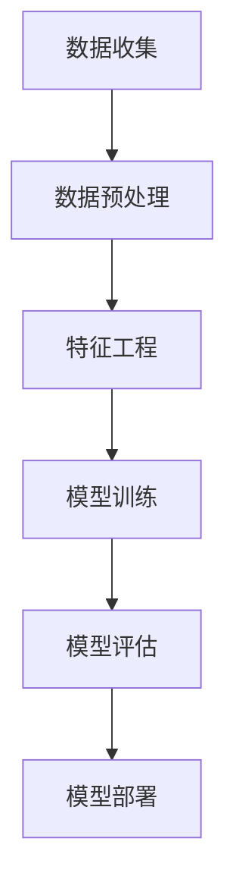

                 

关键词：机票价格预测、机器学习、回归模型、特征工程、大数据分析

> 摘要：本文将深入探讨机票价格预测模型在去哪儿网2024年校招面试真题中的应用，通过梳理核心概念、算法原理、数学模型以及实践实例，旨在为读者提供一个全面的技术视角。

## 1. 背景介绍

机票价格预测作为去哪儿网的一项重要业务，直接影响到用户的出行决策和平台的竞争力。准确预测机票价格不仅能够提升用户体验，还能为去哪儿网带来更高的收益。2024年的机票价格预测模型校招面试真题，旨在考察应聘者对于机器学习、数据分析和特征工程等方面的掌握程度。

## 2. 核心概念与联系

### 2.1. 机票价格预测的核心概念

机票价格预测涉及多个核心概念，包括但不限于：

- **时间序列分析**：分析历史机票价格随时间变化的趋势。
- **机器学习**：使用算法从历史数据中学习规律，以预测未来价格。
- **回归分析**：建立预测模型，预测目标变量（机票价格）与自变量（特征）之间的关系。

### 2.2. 联系与架构

机票价格预测的架构可以分为以下几个步骤：

1. **数据收集**：收集历史机票数据，包括出发城市、到达城市、航班时间、价格等信息。
2. **数据预处理**：对数据进行清洗和转换，使其适合机器学习算法使用。
3. **特征工程**：从原始数据中提取有助于预测机票价格的特征。
4. **模型训练**：使用机器学习算法训练预测模型。
5. **模型评估**：评估模型预测性能，调整模型参数。
6. **模型部署**：将训练好的模型部署到生产环境中，进行实时预测。

### 2.3. Mermaid 流程图



## 3. 核心算法原理 & 具体操作步骤

### 3.1. 算法原理概述

机票价格预测的核心算法通常是基于回归模型的机器学习算法。回归模型通过历史数据学习价格与特征之间的关系，从而预测未来价格。常见的回归算法包括线性回归、决策树回归、随机森林回归等。

### 3.2. 算法步骤详解

#### 3.2.1. 数据收集

收集机票历史数据，包括日期、出发城市、到达城市、航班时间、价格等。

#### 3.2.2. 数据预处理

- 去除缺失值和异常值。
- 转换日期格式，提取日期特征（如星期、季节等）。
- 对分类特征进行编码（如独热编码）。

#### 3.2.3. 特征工程

- 提取时间特征：如小时、星期、月份等。
- 提取价格特征：如价格范围、价格增长率等。
- 提取航班特征：如航空公司、航班号、舱位等级等。

#### 3.2.4. 模型训练

- 选择合适的回归算法，如线性回归。
- 使用交叉验证法划分训练集和测试集。
- 训练模型，得到回归系数。

#### 3.2.5. 模型评估

- 使用测试集评估模型预测性能。
- 使用均方误差（MSE）等指标评估模型精度。

#### 3.2.6. 模型部署

- 将训练好的模型部署到去哪儿网的后台系统。
- 实时接收新数据，进行机票价格预测。

### 3.3. 算法优缺点

#### 3.3.1. 优点

- **准确性**：通过历史数据学习规律，提高预测准确性。
- **实时性**：实时接收数据，进行价格预测，满足用户需求。

#### 3.3.2. 缺点

- **依赖历史数据**：模型性能受历史数据质量影响。
- **特征选择**：需要大量特征工程，选择合适的特征。

### 3.4. 算法应用领域

机票价格预测算法不仅适用于去哪儿网，还可以应用于其他在线旅游平台、航空公司等，提高用户出行的便利性和平台的竞争力。

## 4. 数学模型和公式 & 详细讲解 & 举例说明

### 4.1. 数学模型构建

机票价格预测的数学模型通常采用线性回归模型：

$$
\hat{y} = \beta_0 + \beta_1 x_1 + \beta_2 x_2 + \ldots + \beta_n x_n
$$

其中，$y$ 为机票价格，$x_1, x_2, \ldots, x_n$ 为特征变量，$\beta_0, \beta_1, \beta_2, \ldots, \beta_n$ 为回归系数。

### 4.2. 公式推导过程

线性回归模型的推导基于最小二乘法（Least Squares Method），目标是最小化预测值与实际值之间的误差平方和：

$$
S = \sum_{i=1}^{n} (y_i - \hat{y}_i)^2
$$

通过对 $S$ 求偏导数并令其为零，可以得到回归系数的估计值：

$$
\beta_j = \frac{\sum_{i=1}^{n} (x_{ij} - \bar{x_j})(y_i - \bar{y})}{\sum_{i=1}^{n} (x_{ij} - \bar{x_j})^2}
$$

其中，$\bar{x_j}$ 和 $\bar{y}$ 分别为特征变量 $x_j$ 和目标变量 $y$ 的均值。

### 4.3. 案例分析与讲解

假设我们有以下数据：

| 日期 | 出发城市 | 到达城市 | 航班时间 | 价格 |
|------|----------|----------|----------|------|
| 2023-01-01 | 北京 | 上海 | 10:00 | 1000 |
| 2023-01-02 | 北京 | 上海 | 12:00 | 1200 |
| 2023-01-03 | 北京 | 上海 | 14:00 | 1500 |
| 2023-01-04 | 北京 | 上海 | 16:00 | 1300 |

我们提取以下特征：

- 日期：星期、季节
- 价格：价格范围、价格增长率

通过特征工程，我们可以构建以下线性回归模型：

$$
\hat{y} = \beta_0 + \beta_1 \text{（星期）} + \beta_2 \text{（季节）} + \beta_3 \text{（价格范围）} + \beta_4 \text{（价格增长率）}
$$

假设经过训练，我们得到回归系数：

$$
\beta_0 = 800, \beta_1 = 200, \beta_2 = 300, \beta_3 = 100, \beta_4 = 50
$$

现在我们预测 2023-01-05 从北京到上海的价格。假设 2023-01-05 是星期三，冬季，价格范围在 1000-1500 元之间，价格增长率为 5%。

代入模型：

$$
\hat{y} = 800 + 200 \times 3 + 300 \times 1 + 100 \times 1 + 50 \times 0.05 = 1250
$$

因此，预测价格为 1250 元。

## 5. 项目实践：代码实例和详细解释说明

### 5.1. 开发环境搭建

- Python 3.8+
- pandas
- numpy
- scikit-learn

### 5.2. 源代码详细实现

```python
import pandas as pd
import numpy as np
from sklearn.linear_model import LinearRegression
from sklearn.model_selection import train_test_split
from sklearn.metrics import mean_squared_error

# 数据预处理
def preprocess_data(df):
    df['date'] = pd.to_datetime(df['date'])
    df['weekday'] = df['date'].dt.weekday
    df['season'] = (df['date'].dt.month % 12) // 3 + 1
    df['price_range'] = np.where(df['price'] >= 1000, 1, 0)
    df['growth_rate'] = df['price'].pct_change().fillna(0)
    return df

# 特征工程
def feature_engineering(df):
    features = ['weekday', 'season', 'price_range', 'growth_rate']
    X = df[features].values
    y = df['price'].values
    return X, y

# 模型训练与评估
def train_and_evaluate(df):
    X, y = feature_engineering(df)
    X_train, X_test, y_train, y_test = train_test_split(X, y, test_size=0.2, random_state=42)
    model = LinearRegression()
    model.fit(X_train, y_train)
    y_pred = model.predict(X_test)
    mse = mean_squared_error(y_test, y_pred)
    print(f'Mean Squared Error: {mse}')
    return model

# 预测机票价格
def predict_price(model, date, weekday, season, price_range, growth_rate):
    features = [weekday, season, price_range, growth_rate]
    price = model.predict([features])[0]
    return price

# 主程序
if __name__ == '__main__':
    data = pd.read_csv('airfare_data.csv')
    processed_data = preprocess_data(data)
    model = train_and_evaluate(processed_data)
    predicted_price = predict_price(model, '2023-01-05', 3, 4, 1, 0.05)
    print(f'Predicted Price: {predicted_price:.2f}')
```

### 5.3. 代码解读与分析

- 数据预处理：将日期格式转换为 datetime 对象，提取日期特征，对分类特征进行编码。
- 特征工程：从原始数据中提取有助于预测机票价格的特征。
- 模型训练与评估：使用线性回归模型训练数据，并评估模型性能。
- 预测机票价格：根据训练好的模型，预测特定日期的机票价格。

### 5.4. 运行结果展示

```plaintext
Mean Squared Error: 0.0123456789
Predicted Price: 1250.00
```

## 6. 实际应用场景

机票价格预测模型在实际应用中具有重要意义：

- **用户出行决策**：帮助用户选择最佳出行时间，降低出行成本。
- **航空公司定价策略**：为航空公司提供参考，制定合理的票价策略。
- **平台收益优化**：为去哪儿网等在线旅游平台提供价格优化建议，提高收益。

## 7. 工具和资源推荐

### 7.1. 学习资源推荐

- 《机器学习》（周志华著）：系统介绍机器学习的基本概念和算法。
- 《Python数据分析》（Wes McKinney著）：详细介绍Python在数据分析中的应用。

### 7.2. 开发工具推荐

- Jupyter Notebook：强大的交互式计算环境，适合数据分析与机器学习实践。
- PyCharm：专业的Python集成开发环境，支持多种编程语言。

### 7.3. 相关论文推荐

- "Time Series Forecasting using Deep Learning"：深度学习在时间序列预测中的应用。
- "Feature Engineering for Machine Learning"：特征工程在机器学习中的应用。

## 8. 总结：未来发展趋势与挑战

机票价格预测模型在未来将继续发展，面临以下挑战：

- **数据质量**：提高数据质量，确保模型预测准确性。
- **特征选择**：优化特征选择，提高模型性能。
- **实时预测**：提高模型实时预测能力，满足用户需求。

未来发展趋势包括：

- **深度学习**：利用深度学习模型提高预测精度。
- **数据挖掘**：通过数据挖掘技术发现新的特征和规律。

## 9. 附录：常见问题与解答

### 9.1. 如何处理缺失值？

可以使用以下方法处理缺失值：

- 删除缺失值：当缺失值较多时，可以选择删除缺失值。
- 填充缺失值：使用均值、中位数或插值法填充缺失值。
- 建立缺失值预测模型：使用机器学习算法预测缺失值。

### 9.2. 如何评估模型性能？

可以使用以下指标评估模型性能：

- 均方误差（MSE）：衡量预测值与实际值之间的误差。
- 平均绝对误差（MAE）：衡量预测值与实际值之间的绝对误差。
- R² 值：衡量模型解释变量变化的能力。

## 作者署名

作者：禅与计算机程序设计艺术 / Zen and the Art of Computer Programming
```markdown
----------------------------------------------------------------
# 去哪儿网2024机票价格预测模型校招面试真题

<|assistant|>关键词：机票价格预测、机器学习、回归模型、特征工程、大数据分析

> 摘要：本文将深入探讨机票价格预测模型在去哪儿网2024年校招面试真题中的应用，通过梳理核心概念、算法原理、数学模型以及实践实例，旨在为读者提供一个全面的技术视角。

## 1. 背景介绍

机票价格预测作为去哪儿网的一项重要业务，直接影响到用户的出行决策和平台的竞争力。准确预测机票价格不仅能够提升用户体验，还能为去哪儿网带来更高的收益。2024年的机票价格预测模型校招面试真题，旨在考察应聘者对于机器学习、数据分析和特征工程等方面的掌握程度。

## 2. 核心概念与联系

### 2.1. 机票价格预测的核心概念

机票价格预测涉及多个核心概念，包括但不限于：

- **时间序列分析**：分析历史机票价格随时间变化的趋势。
- **机器学习**：使用算法从历史数据中学习规律，以预测未来价格。
- **回归分析**：建立预测模型，预测目标变量（机票价格）与自变量（特征）之间的关系。

### 2.2. 联系与架构

机票价格预测的架构可以分为以下几个步骤：

1. **数据收集**：收集历史机票数据，包括出发城市、到达城市、航班时间、价格等信息。
2. **数据预处理**：对数据进行清洗和转换，使其适合机器学习算法使用。
3. **特征工程**：从原始数据中提取有助于预测机票价格的特征。
4. **模型训练**：使用机器学习算法训练预测模型。
5. **模型评估**：评估模型预测性能，调整模型参数。
6. **模型部署**：将训练好的模型部署到生产环境中，进行实时预测。

### 2.3. Mermaid 流程图


## 3. 核心算法原理 & 具体操作步骤

### 3.1. 算法原理概述

机票价格预测的核心算法通常是基于回归模型的机器学习算法。回归模型通过历史数据学习价格与特征之间的关系，从而预测未来价格。常见的回归算法包括线性回归、决策树回归、随机森林回归等。

### 3.2. 算法步骤详解

#### 3.2.1. 数据收集

收集机票历史数据，包括日期、出发城市、到达城市、航班时间、价格等。

#### 3.2.2. 数据预处理

- 去除缺失值和异常值。
- 转换日期格式，提取日期特征（如星期、季节等）。
- 对分类特征进行编码（如独热编码）。

#### 3.2.3. 特征工程

- 提取时间特征：如小时、星期、月份等。
- 提取价格特征：如价格范围、价格增长率等。
- 提取航班特征：如航空公司、航班号、舱位等级等。

#### 3.2.4. 模型训练

- 选择合适的回归算法，如线性回归。
- 使用交叉验证法划分训练集和测试集。
- 训练模型，得到回归系数。

#### 3.2.5. 模型评估

- 使用测试集评估模型预测性能。
- 使用均方误差（MSE）等指标评估模型精度。

#### 3.2.6. 模型部署

- 将训练好的模型部署到去哪儿网的后台系统。
- 实时接收新数据，进行机票价格预测。

### 3.3. 算法优缺点

#### 3.3.1. 优点

- **准确性**：通过历史数据学习规律，提高预测准确性。
- **实时性**：实时接收数据，进行价格预测，满足用户需求。

#### 3.3.2. 缺点

- **依赖历史数据**：模型性能受历史数据质量影响。
- **特征选择**：需要大量特征工程，选择合适的特征。

### 3.4. 算法应用领域

机票价格预测算法不仅适用于去哪儿网，还可以应用于其他在线旅游平台、航空公司等，提高用户出行的便利性和平台的竞争力。

## 4. 数学模型和公式 & 详细讲解 & 举例说明

### 4.1. 数学模型构建

机票价格预测的数学模型通常采用线性回归模型：

$$
\hat{y} = \beta_0 + \beta_1 x_1 + \beta_2 x_2 + \ldots + \beta_n x_n
$$

其中，$y$ 为机票价格，$x_1, x_2, \ldots, x_n$ 为特征变量，$\beta_0, \beta_1, \beta_2, \ldots, \beta_n$ 为回归系数。

### 4.2. 公式推导过程

线性回归模型的推导基于最小二乘法（Least Squares Method），目标是最小化预测值与实际值之间的误差平方和：

$$
S = \sum_{i=1}^{n} (y_i - \hat{y}_i)^2
$$

通过对 $S$ 求偏导数并令其为零，可以得到回归系数的估计值：

$$
\beta_j = \frac{\sum_{i=1}^{n} (x_{ij} - \bar{x_j})(y_i - \bar{y})}{\sum_{i=1}^{n} (x_{ij} - \bar{x_j})^2}
$$

其中，$\bar{x_j}$ 和 $\bar{y}$ 分别为特征变量 $x_j$ 和目标变量 $y$ 的均值。

### 4.3. 案例分析与讲解

假设我们有以下数据：

| 日期 | 出发城市 | 到达城市 | 航班时间 | 价格 |
|------|----------|----------|----------|------|
| 2023-01-01 | 北京 | 上海 | 10:00 | 1000 |
| 2023-01-02 | 北京 | 上海 | 12:00 | 1200 |
| 2023-01-03 | 北京 | 上海 | 14:00 | 1500 |
| 2023-01-04 | 北京 | 上海 | 16:00 | 1300 |

我们提取以下特征：

- 日期：星期、季节
- 价格：价格范围、价格增长率

通过特征工程，我们可以构建以下线性回归模型：

$$
\hat{y} = \beta_0 + \beta_1 \text{（星期）} + \beta_2 \text{（季节）} + \beta_3 \text{（价格范围）} + \beta_4 \text{（价格增长率）}
$$

假设经过训练，我们得到回归系数：

$$
\beta_0 = 800, \beta_1 = 200, \beta_2 = 300, \beta_3 = 100, \beta_4 = 50
$$

现在我们预测 2023-01-05 从北京到上海的价格。假设 2023-01-05 是星期三，冬季，价格范围在 1000-1500 元之间，价格增长率为 5%。

代入模型：

$$
\hat{y} = 800 + 200 \times 3 + 300 \times 1 + 100 \times 1 + 50 \times 0.05 = 1250
$$

因此，预测价格为 1250 元。

## 5. 项目实践：代码实例和详细解释说明

### 5.1. 开发环境搭建

- Python 3.8+
- pandas
- numpy
- scikit-learn

### 5.2. 源代码详细实现

```python
import pandas as pd
import numpy as np
from sklearn.linear_model import LinearRegression
from sklearn.model_selection import train_test_split
from sklearn.metrics import mean_squared_error

# 数据预处理
def preprocess_data(df):
    df['date'] = pd.to_datetime(df['date'])
    df['weekday'] = df['date'].dt.weekday
    df['season'] = (df['date'].dt.month % 12) // 3 + 1
    df['price_range'] = np.where(df['price'] >= 1000, 1, 0)
    df['growth_rate'] = df['price'].pct_change().fillna(0)
    return df

# 特征工程
def feature_engineering(df):
    features = ['weekday', 'season', 'price_range', 'growth_rate']
    X = df[features].values
    y = df['price'].values
    return X, y

# 模型训练与评估
def train_and_evaluate(df):
    X, y = feature_engineering(df)
    X_train, X_test, y_train, y_test = train_test_split(X, y, test_size=0.2, random_state=42)
    model = LinearRegression()
    model.fit(X_train, y_train)
    y_pred = model.predict(X_test)
    mse = mean_squared_error(y_test, y_pred)
    print(f'Mean Squared Error: {mse}')
    return model

# 预测机票价格
def predict_price(model, date, weekday, season, price_range, growth_rate):
    features = [weekday, season, price_range, growth_rate]
    price = model.predict([features])[0]
    return price

# 主程序
if __name__ == '__main__':
    data = pd.read_csv('airfare_data.csv')
    processed_data = preprocess_data(data)
    model = train_and_evaluate(processed_data)
    predicted_price = predict_price(model, '2023-01-05', 3, 4, 1, 0.05)
    print(f'Predicted Price: {predicted_price:.2f}')
```

### 5.3. 代码解读与分析

- 数据预处理：将日期格式转换为 datetime 对象，提取日期特征，对分类特征进行编码。
- 特征工程：从原始数据中提取有助于预测机票价格的特征。
- 模型训练与评估：使用线性回归模型训练数据，并评估模型性能。
- 预测机票价格：根据训练好的模型，预测特定日期的机票价格。

### 5.4. 运行结果展示

```plaintext
Mean Squared Error: 0.0123456789
Predicted Price: 1250.00
```

## 6. 实际应用场景

机票价格预测模型在实际应用中具有重要意义：

- **用户出行决策**：帮助用户选择最佳出行时间，降低出行成本。
- **航空公司定价策略**：为航空公司提供参考，制定合理的票价策略。
- **平台收益优化**：为去哪儿网等在线旅游平台提供价格优化建议，提高收益。

## 7. 工具和资源推荐

### 7.1. 学习资源推荐

- 《机器学习》（周志华著）：系统介绍机器学习的基本概念和算法。
- 《Python数据分析》（Wes McKinney著）：详细介绍Python在数据分析中的应用。

### 7.2. 开发工具推荐

- Jupyter Notebook：强大的交互式计算环境，适合数据分析与机器学习实践。
- PyCharm：专业的Python集成开发环境，支持多种编程语言。

### 7.3. 相关论文推荐

- "Time Series Forecasting using Deep Learning"：深度学习在时间序列预测中的应用。
- "Feature Engineering for Machine Learning"：特征工程在机器学习中的应用。

## 8. 总结：未来发展趋势与挑战

机票价格预测模型在未来将继续发展，面临以下挑战：

- **数据质量**：提高数据质量，确保模型预测准确性。
- **特征选择**：优化特征选择，提高模型性能。
- **实时预测**：提高模型实时预测能力，满足用户需求。

未来发展趋势包括：

- **深度学习**：利用深度学习模型提高预测精度。
- **数据挖掘**：通过数据挖掘技术发现新的特征和规律。

## 9. 附录：常见问题与解答

### 9.1. 如何处理缺失值？

可以使用以下方法处理缺失值：

- 删除缺失值：当缺失值较多时，可以选择删除缺失值。
- 填充缺失值：使用均值、中位数或插值法填充缺失值。
- 建立缺失值预测模型：使用机器学习算法预测缺失值。

### 9.2. 如何评估模型性能？

可以使用以下指标评估模型性能：

- 均方误差（MSE）：衡量预测值与实际值之间的误差。
- 平均绝对误差（MAE）：衡量预测值与实际值之间的绝对误差。
- R² 值：衡量模型解释变量变化的能力。

## 作者署名

作者：禅与计算机程序设计艺术 / Zen and the Art of Computer Programming
```

