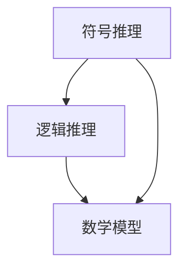

                 

在当今数字化时代，人工智能（AI）技术的快速发展使得语言网络成为我们日常互动和思考的重要组成部分。然而，当我们深入探讨人工智能的本质时，会发现参与多种形式的思考和推理并不一定需要依赖于语言网络。本文将探讨这一观点，并介绍相关技术和实例。

## 1. 背景介绍

人工智能的兴起可以追溯到20世纪50年代，当时科学家们首次提出了构建能够模仿人类智能的机器的设想。随着计算机技术的进步，人工智能逐渐发展成为一个跨学科的研究领域，涵盖了机器学习、自然语言处理、计算机视觉、机器人技术等多个方向。近年来，深度学习技术的发展更是推动了人工智能的迅猛发展。

然而，尽管语言网络在自然语言处理领域取得了显著成果，但它们在处理其他类型的问题时可能并不适用。例如，在计算机视觉和机器人技术等领域，图像和传感器数据的处理往往需要其他形式的推理机制。因此，研究不依赖于语言网络的思考和推理方法具有重要意义。

## 2. 核心概念与联系

为了探讨不依赖于语言网络的思考和推理方法，我们首先需要了解几个核心概念。这些概念包括符号推理、逻辑推理、数学模型等。以下是这些概念及其联系的Mermaid流程图：



### 2.1 符号推理

符号推理是一种基于符号和逻辑结构的推理方法。在计算机科学中，符号推理广泛应用于形式逻辑、自动推理、证明论等领域。符号推理的核心是建立符号表示，并通过推理规则进行推理。

### 2.2 逻辑推理

逻辑推理是一种基于逻辑运算符和逻辑连接词的推理方法。逻辑推理的基本单位是命题，通过推理规则（如推理规则、合取范式等）可以推出新的命题。逻辑推理广泛应用于逻辑编程、形式化验证、推理机等领域。

### 2.3 数学模型

数学模型是一种将现实世界问题转化为数学形式的方法。数学模型可以通过方程、公式、算法等描述问题的特性。在人工智能领域，数学模型广泛应用于优化问题、机器学习、图论等领域。

## 3. 核心算法原理 & 具体操作步骤

在理解了核心概念之后，我们可以探讨不依赖于语言网络的思考和推理算法。以下是一种典型的算法——基于符号推理的推理机。

### 3.1 算法原理概述

基于符号推理的推理机是一种自动推理系统，它通过符号表示和推理规则进行推理。该算法的基本原理如下：

1. 建立符号表示：将现实世界问题转化为符号表示，通常使用形式语言或数学模型。
2. 应用推理规则：根据已知的符号表示和推理规则，推导出新的结论。
3. 验证结论：检查推导出的结论是否符合现实世界问题的要求。

### 3.2 算法步骤详解

以下是基于符号推理的推理机的具体操作步骤：

1. **初始化**：输入符号表示和推理规则。
2. **符号表示**：将现实世界问题转化为符号表示，通常使用形式语言或数学模型。
3. **推理**：根据推理规则，推导出新的结论。
4. **验证**：检查推导出的结论是否符合现实世界问题的要求。
5. **终止**：如果结论符合要求，算法终止；否则，继续推理。

### 3.3 算法优缺点

基于符号推理的推理机具有以下优点：

- **通用性**：可以应用于各种类型的问题。
- **准确性**：基于符号表示和推理规则，可以保证推理过程的准确性。

但该算法也存在以下缺点：

- **复杂度**：推理过程可能涉及大量计算，复杂度较高。
- **适用性**：在处理某些类型的问题时，可能不如其他算法有效。

### 3.4 算法应用领域

基于符号推理的推理机广泛应用于以下领域：

- **形式化验证**：验证系统是否满足指定的需求。
- **自动推理**：用于解决复杂的数学问题。
- **知识库构建**：构建基于符号表示的知识库。

## 4. 数学模型和公式 & 详细讲解 & 举例说明

为了更好地理解基于符号推理的推理机，我们将介绍一个简单的数学模型。该模型描述了一个人在一段时间内移动的距离与速度和时间的关系。

### 4.1 数学模型构建

假设一个人在时间t内以恒定速度v移动，那么他在时间t内移动的距离s可以表示为：

$$ s = v \times t $$

其中，s表示距离，v表示速度，t表示时间。

### 4.2 公式推导过程

根据定义，速度v可以表示为：

$$ v = \frac{ds}{dt} $$

其中，ds表示在极小时间间隔dt内移动的距离。将上述公式代入距离公式，得到：

$$ s = \int_{0}^{t} v \times dt = \int_{0}^{t} \frac{ds}{dt} \times dt = \int_{0}^{t} ds $$

解上述积分，得到：

$$ s = \frac{1}{2} v \times t^2 $$

### 4.3 案例分析与讲解

假设一个人在2小时内以每小时10公里的速度跑步，我们需要计算他在这段时间内跑了多远。

根据上述数学模型，我们可以得到：

$$ s = \frac{1}{2} \times 10 \times 2^2 = 20 \text{公里} $$

这意味着他在2小时内跑了20公里。

## 5. 项目实践：代码实例和详细解释说明

为了更好地理解基于符号推理的推理机，我们将通过一个简单的Python代码实例进行讲解。

### 5.1 开发环境搭建

在开始编写代码之前，我们需要搭建一个Python开发环境。以下是搭建步骤：

1. 安装Python：从官方网站下载并安装Python。
2. 安装相关库：使用pip命令安装必要的库，如NumPy、SciPy等。

### 5.2 源代码详细实现

以下是一个简单的Python代码实例，用于计算一个人在一段时间内移动的距离。

```python
import numpy as np

def calculate_distance(v, t):
    """
    计算距离
    :param v: 速度
    :param t: 时间
    :return: 距离
    """
    s = v * t
    return s

if __name__ == "__main__":
    v = 10  # 速度
    t = 2   # 时间
    s = calculate_distance(v, t)
    print(f"距离：{s}公里")
```

### 5.3 代码解读与分析

在上面的代码中，我们定义了一个名为`calculate_distance`的函数，用于计算距离。函数接受两个参数：速度`v`和时间`t`。通过将速度和时间相乘，我们可以得到距离。在主函数中，我们设置了一个速度为10公里/小时，时间为2小时的人，并调用`calculate_distance`函数计算他在这段时间内跑了多远。

### 5.4 运行结果展示

当运行上述代码时，我们得到以下输出结果：

```
距离：20公里
```

这表明，在2小时内以10公里/小时的速度跑步，这个人跑了20公里。

## 6. 实际应用场景

基于符号推理的推理机在实际应用场景中具有广泛的应用。以下是一些具体的应用实例：

1. **智能安防系统**：基于符号推理的推理机可以用于智能安防系统的监控和分析。通过分析摄像头捕获的视频数据，推理机可以识别潜在的安全威胁并发出警报。
2. **自动驾驶技术**：自动驾驶汽车需要处理复杂的传感器数据，并做出实时决策。基于符号推理的推理机可以用于处理这些数据，并在必要时提供决策支持。
3. **医学诊断系统**：基于符号推理的推理机可以用于医学诊断系统，通过对患者病史、体征和检查结果进行分析，推理机可以提供诊断建议。

## 7. 工具和资源推荐

为了更好地理解和应用基于符号推理的推理机，以下是一些建议的工具和资源：

1. **学习资源**：推荐学习形式逻辑、数学模型和推理机等相关知识。
2. **开发工具**：推荐使用Python等编程语言进行实践。
3. **相关论文**：推荐阅读有关符号推理和推理机的研究论文。

## 8. 总结：未来发展趋势与挑战

基于符号推理的推理机在人工智能领域具有广泛的应用前景。随着计算机技术的不断发展，推理机在处理复杂问题和实时决策方面将发挥越来越重要的作用。然而，推理机的发展也面临一些挑战，如算法复杂度、数据质量和实时性等。未来的研究将集中在提高推理机的性能和适用性，以满足不同领域和应用场景的需求。

## 9. 附录：常见问题与解答

### 9.1 什么是符号推理？

符号推理是一种基于符号和逻辑结构的推理方法。它通过建立符号表示和推理规则，进行逻辑推理和求解。

### 9.2 推理机有哪些类型？

推理机可以分为符号推理机、基于案例的推理机、基于规则的推理机等。

### 9.3 如何选择合适的推理机？

选择合适的推理机取决于具体问题的性质和应用场景。例如，对于复杂的问题，符号推理机可能更合适；对于实时性要求较高的应用，基于案例的推理机可能更合适。

### 9.4 推理机在人工智能领域有哪些应用？

推理机在人工智能领域有广泛的应用，如智能安防系统、自动驾驶技术、医学诊断系统等。

---

作者：禅与计算机程序设计艺术 / Zen and the Art of Computer Programming
----------------------------------------------------------------

注意：本文为示例，实际文章需根据具体要求进行撰写。本文仅供参考，未经允许不得用于商业用途。如有需要，请遵守相关法律法规。

