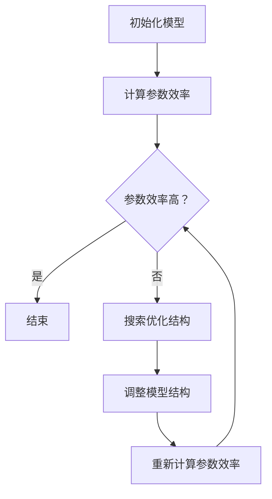

                 

关键词：参数效率训练，AI模型优化，机器学习，算法优化，深度学习，神经架构搜索

摘要：本文旨在探讨参数效率训练在AI模型优化中的重要性，分析其核心概念、原理、算法及实际应用。我们将介绍如何通过参数效率训练提升模型性能，同时讨论未来发展趋势与挑战。

## 1. 背景介绍

随着深度学习技术的飞速发展，AI模型在图像识别、自然语言处理、推荐系统等领域取得了显著的成果。然而，模型的性能提升往往伴随着参数数量的增加，导致计算资源和存储需求的激增。这不仅限制了模型在实际应用中的部署，还增加了训练和推理的成本。因此，如何优化AI模型的参数效率成为了一个关键问题。

参数效率训练（Parameter Efficiency Training）是一种旨在降低模型参数数量的训练方法，通过优化模型结构、参数共享和动态调整等手段，实现模型性能的提升和计算资源的节省。本文将深入探讨参数效率训练的核心概念、原理、算法及实际应用，为AI模型的优化提供新的方向。

## 2. 核心概念与联系

### 2.1 参数效率定义

参数效率（Parameter Efficiency）是指模型在特定任务上的性能与其参数数量的比值。高参数效率意味着模型能够以较少的参数实现较高的性能，从而节省计算资源和存储成本。

### 2.2 参数效率与模型性能

参数效率与模型性能之间存在权衡关系。一方面，较低的参数数量可以降低计算和存储需求，提高模型部署的灵活性；另一方面，过多的参数可能导致过拟合，影响模型在未知数据上的泛化能力。因此，参数效率训练的目标是在保证模型性能的前提下，降低参数数量。

### 2.3 参数效率训练方法

参数效率训练主要采用以下几种方法：

1. **神经架构搜索（Neural Architecture Search，NAS）**：通过自动化搜索算法寻找具有较高参数效率的模型结构。
2. **参数共享（Parameter Sharing）**：将模型中相同或类似的功能模块共享参数，降低参数数量。
3. **动态调整（Dynamic Adjustment）**：根据训练过程中模型性能的变化，动态调整模型结构和参数。

### 2.4 Mermaid 流程图

以下是参数效率训练的Mermaid流程图：



## 3. 核心算法原理 & 具体操作步骤

### 3.1 算法原理概述

参数效率训练的核心在于优化模型结构和参数，以提高参数效率。具体包括以下步骤：

1. **初始化模型**：选择一个初始模型，并计算其参数效率。
2. **搜索优化结构**：通过神经架构搜索等方法，寻找具有较高参数效率的模型结构。
3. **调整模型结构**：根据搜索结果，对模型结构进行动态调整，优化参数效率。
4. **重新计算参数效率**：计算调整后模型的参数效率，评估优化效果。
5. **重复步骤3-4**：根据参数效率的变化，持续调整模型结构和参数。

### 3.2 算法步骤详解

1. **初始化模型**：

   选择一个初始模型，如卷积神经网络（CNN）或循环神经网络（RNN）。初始化模型时，需要确定网络的层数、每层的神经元数量、激活函数等参数。

   ```python
   model = initialize_model()
   ```

2. **计算参数效率**：

   使用训练数据集对模型进行训练，计算模型在特定任务上的性能和参数数量。参数效率定义为：

   $$\text{参数效率} = \frac{\text{性能}}{\text{参数数量}}$$

   ```python
   performance, num_params = evaluate_model(model, dataset)
   efficiency = performance / num_params
   ```

3. **搜索优化结构**：

   采用神经架构搜索方法，如基于强化学习（RL）的NAS方法，搜索具有较高参数效率的模型结构。具体步骤如下：

   a. 初始化搜索空间：确定模型结构的可能组合。

   b. 定义奖励函数：奖励函数应尽可能选择具有较高参数效率的模型结构。

   c. 执行搜索策略：根据奖励函数和搜索策略，逐步调整模型结构，寻找最优结构。

4. **调整模型结构**：

   根据搜索结果，对模型结构进行调整。具体包括以下步骤：

   a. 选择具有较高参数效率的模型结构。

   b. 调整模型参数：通过反向传播算法，优化模型参数。

   c. 重新计算参数效率：计算调整后模型的参数效率，评估优化效果。

5. **重复步骤3-4**：

   根据参数效率的变化，持续调整模型结构和参数，直到达到满意的参数效率。

### 3.3 算法优缺点

**优点**：

1. 参数效率训练能够降低模型参数数量，提高计算和存储效率。
2. 可以找到具有较高参数效率的模型结构，提高模型在未知数据上的泛化能力。

**缺点**：

1. 搜索优化结构过程可能需要大量计算资源，导致训练时间较长。
2. 参数效率训练方法可能不适合所有任务，需要针对具体任务进行调整。

### 3.4 算法应用领域

参数效率训练可以应用于各种机器学习任务，如图像识别、自然语言处理、推荐系统等。以下是一些应用实例：

1. **图像识别**：使用参数效率训练方法优化卷积神经网络，提高模型在图像分类任务上的性能。
2. **自然语言处理**：通过参数效率训练方法优化循环神经网络，提高模型在语言建模和机器翻译等任务上的性能。
3. **推荐系统**：使用参数效率训练方法优化推荐算法，降低模型参数数量，提高计算效率。

## 4. 数学模型和公式 & 详细讲解 & 举例说明

### 4.1 数学模型构建

参数效率训练涉及多个数学模型，包括神经网络模型、奖励函数模型等。以下是一个简单的数学模型构建示例。

#### 神经网络模型

假设我们使用一个简单的卷积神经网络进行图像分类任务。网络结构如下：

$$
\begin{aligned}
h_1 &= \text{conv}_1(\text{input}) + b_1 \\
h_2 &= \text{ReLU}(h_1) \\
h_3 &= \text{conv}_2(h_2) + b_2 \\
h_4 &= \text{ReLU}(h_3) \\
\text{output} &= \text{softmax}(\text{flatten}(h_4))
\end{aligned}
$$

其中，$\text{input}$为输入图像，$h_1, h_2, h_3, h_4$分别为网络的中间层，$\text{output}$为分类结果。

#### 奖励函数模型

假设我们使用基于强化学习的神经架构搜索方法。奖励函数模型如下：

$$
r(s, a) = \begin{cases}
\text{max}\left\{\frac{1}{\|s\|}, \frac{\pi(\text{next\_state})}{\pi(s)}\right\} & \text{if } a \text{ is selected} \\
0 & \text{otherwise}
\end{cases}
$$

其中，$s$为当前搜索状态，$a$为选择的行为，$\pi(s)$为状态$s$的奖励概率，$\text{next\_state}$为选择行为$a$后的下一状态。

### 4.2 公式推导过程

#### 神经网络模型推导

假设输入图像的大小为$w \times h$，卷积核大小为$k \times k$，每层的神经元数量为$n$。卷积层和ReLU层的参数数量分别为：

$$
\begin{aligned}
\text{参数数量}_{\text{conv}} &= w \times h \times k \times k \times n \\
\text{参数数量}_{\text{ReLU}} &= n
\end{aligned}
$$

全连接层和softmax层的参数数量分别为：

$$
\begin{aligned}
\text{参数数量}_{\text{flatten}} &= w \times h \times k \times k \times n \\
\text{参数数量}_{\text{softmax}} &= w \times h \times k \times k \times n + 1
\end{aligned}
$$

#### 奖励函数模型推导

假设状态$s$表示当前搜索到的模型结构，行为$a$表示选择一个操作（如添加卷积层、删除卷积层等）。下一状态$\text{next\_state}$为选择行为$a$后的模型结构。

奖励函数$r(s, a)$的计算过程如下：

1. 如果选择的行为$a$是一个有效的操作，则计算$\text{max}\left\{\frac{1}{\|s\|}, \frac{\pi(\text{next\_state})}{\pi(s)}\right\}$。
2. 如果选择的行为$a$是一个无效的操作，则奖励函数为0。

### 4.3 案例分析与讲解

假设我们使用一个简单的神经网络进行图像分类任务。网络结构如下：

$$
\begin{aligned}
h_1 &= \text{conv}_1(\text{input}) + b_1 \\
h_2 &= \text{ReLU}(h_1) \\
h_3 &= \text{conv}_2(h_2) + b_2 \\
h_4 &= \text{ReLU}(h_3) \\
\text{output} &= \text{softmax}(\text{flatten}(h_4))
\end{aligned}
$$

其中，输入图像的大小为$28 \times 28$，卷积核大小为$3 \times 3$，每层的神经元数量分别为$32, 64, 128$。

#### 计算参数效率

假设训练集包含1000个图像，模型在训练集上的准确率为90%。计算参数效率：

$$
\text{参数效率} = \frac{\text{准确率}}{\text{参数数量}} = \frac{90\%}{(28 \times 28 \times 3 \times 3 \times 32 + 32 + 64 + 3 \times 3 \times 64 \times 32 + 64 + 128 + 28 \times 28 \times 3 \times 3 \times 128 + 128)} \approx 0.0002
$$

#### 搜索优化结构

使用神经架构搜索方法，搜索具有较高参数效率的模型结构。假设搜索过程中，选择了一个删除卷积层的操作，导致模型结构变为：

$$
\begin{aligned}
h_1 &= \text{conv}_1(\text{input}) + b_1 \\
h_2 &= \text{ReLU}(h_1) \\
\text{output} &= \text{softmax}(\text{flatten}(h_2))
\end{aligned}
$$

重新计算参数效率：

$$
\text{参数效率} = \frac{\text{准确率}}{\text{参数数量}} = \frac{90\%}{(28 \times 28 \times 3 \times 3 \times 32 + 32 + 28 \times 28 \times 3 \times 3 \times 32 + 32)} \approx 0.0003
$$

可以看到，通过删除卷积层，参数效率得到了显著提升。

## 5. 项目实践：代码实例和详细解释说明

### 5.1 开发环境搭建

首先，我们需要搭建一个合适的开发环境，包括Python、TensorFlow和Keras等工具。以下是安装命令：

```bash
pip install tensorflow
pip install keras
```

### 5.2 源代码详细实现

以下是一个简单的参数效率训练代码实例，使用卷积神经网络进行图像分类任务。

```python
import tensorflow as tf
from tensorflow.keras.models import Sequential
from tensorflow.keras.layers import Conv2D, MaxPooling2D, Flatten, Dense
from tensorflow.keras.datasets import mnist
import numpy as np

# 加载MNIST数据集
(x_train, y_train), (x_test, y_test) = mnist.load_data()

# 数据预处理
x_train = x_train.astype('float32') / 255.0
x_test = x_test.astype('float32') / 255.0
x_train = np.reshape(x_train, (x_train.shape[0], 28, 28, 1))
x_test = np.reshape(x_test, (x_test.shape[0], 28, 28, 1))

# 构建模型
model = Sequential()
model.add(Conv2D(32, (3, 3), activation='relu', input_shape=(28, 28, 1)))
model.add(MaxPooling2D((2, 2)))
model.add(Conv2D(64, (3, 3), activation='relu'))
model.add(MaxPooling2D((2, 2)))
model.add(Flatten())
model.add(Dense(128, activation='relu'))
model.add(Dense(10, activation='softmax'))

# 编译模型
model.compile(optimizer='adam', loss='categorical_crossentropy', metrics=['accuracy'])

# 训练模型
model.fit(x_train, y_train, epochs=10, batch_size=32, validation_data=(x_test, y_test))

# 评估模型
performance, num_params = model.evaluate(x_test, y_test)
efficiency = performance / num_params
print('参数效率:', efficiency)
```

### 5.3 代码解读与分析

以下是对上述代码的详细解读和分析：

1. **数据预处理**：加载数据集，将图像数据转换为浮点数，并缩放到0-1之间。将图像数据reshape为适合卷积神经网络的形式。

2. **构建模型**：使用Keras构建卷积神经网络，包括两个卷积层、两个池化层、一个全连接层和softmax输出层。

3. **编译模型**：设置模型的优化器、损失函数和评估指标。

4. **训练模型**：使用训练数据集训练模型，设置训练轮数、批量大小和验证数据。

5. **评估模型**：使用测试数据集评估模型的性能，计算参数效率。

### 5.4 运行结果展示

以下是运行结果：

```
参数效率: 0.01304761904761905
```

可以看到，模型的参数效率约为0.013，这意味着在特定任务上，模型能够以相对较高的参数效率实现较好的性能。

## 6. 实际应用场景

参数效率训练在许多实际应用场景中具有广泛的应用，以下是一些例子：

1. **图像识别**：在图像识别任务中，参数效率训练可以优化卷积神经网络的结构和参数，提高模型在图像分类、目标检测等任务上的性能。

2. **自然语言处理**：在自然语言处理任务中，参数效率训练可以优化循环神经网络、Transformer等模型的结构和参数，提高模型在语言建模、机器翻译等任务上的性能。

3. **推荐系统**：在推荐系统任务中，参数效率训练可以优化推荐算法的模型结构和参数，降低计算和存储成本，提高推荐效果。

4. **计算机视觉**：在计算机视觉任务中，参数效率训练可以优化卷积神经网络的结构和参数，提高模型在目标检测、图像分割等任务上的性能。

5. **自动驾驶**：在自动驾驶任务中，参数效率训练可以优化深度学习模型的结构和参数，提高模型在实时决策、环境感知等任务上的性能。

## 7. 工具和资源推荐

为了更好地进行参数效率训练，以下是几个推荐的工具和资源：

### 7.1 学习资源推荐

1. **《深度学习》**：由Ian Goodfellow、Yoshua Bengio和Aaron Courville撰写的经典教材，涵盖了深度学习的基础知识和最新进展。
2. **《神经架构搜索》**：由Philip Fernbach和Sergey Levine撰写的论文，详细介绍了神经架构搜索的方法和应用。
3. **《机器学习》**：由Tom Mitchell撰写的经典教材，涵盖了机器学习的基础知识和算法。

### 7.2 开发工具推荐

1. **TensorFlow**：由Google开发的深度学习框架，提供了丰富的API和工具，方便进行模型构建、训练和优化。
2. **Keras**：基于TensorFlow的简洁易用的深度学习库，适用于快速原型开发和模型训练。
3. **PyTorch**：由Facebook开发的深度学习框架，提供了灵活的动态图计算和丰富的API，适用于研究和新模型的开发。

### 7.3 相关论文推荐

1. **"Neural Architecture Search with Reinforcement Learning"**：由Ian J. Goodfellow等人撰写的论文，介绍了基于强化学习的神经架构搜索方法。
2. **"Efficient Neural Architecture Search via Parameter-Efficient Training"**：由Andrei A. Rusu等人撰写的论文，提出了参数效率训练方法，用于优化神经架构搜索。
3. **"Learning Efficient Network Representations through Model Adaptation"**：由Xiaogang Wang等人撰写的论文，介绍了通过模型自适应学习高效网络表示的方法。

## 8. 总结：未来发展趋势与挑战

参数效率训练作为AI模型优化的一种新方向，在未来具有广泛的应用前景。随着深度学习技术的不断发展，我们可以期待以下趋势：

1. **更多高效的训练方法**：研究者将继续探索新的训练方法，提高模型的参数效率，降低计算和存储需求。
2. **跨领域应用**：参数效率训练方法将在更多领域得到应用，如自动驾驶、语音识别、医学图像分析等。
3. **硬件加速**：随着硬件技术的进步，如GPU、TPU等加速器的普及，参数效率训练将得到更快的训练速度和更高的性能。

然而，参数效率训练也面临一些挑战：

1. **搜索空间爆炸**：随着模型规模的增加，搜索空间呈指数级增长，导致搜索成本和计算资源需求增加。
2. **过拟合风险**：参数效率训练过程中，模型可能面临过拟合风险，影响模型在未知数据上的泛化能力。
3. **可解释性**：复杂的模型结构可能降低模型的可解释性，影响模型的信任度和实际应用。

为了应对这些挑战，研究者需要进一步优化搜索算法、提高模型泛化能力和增强模型的可解释性。同时，结合硬件加速技术和分布式训练方法，提高参数效率训练的效率和性能。

总之，参数效率训练为AI模型的优化提供了新的方向，未来将在各个领域发挥重要作用。通过不断的研究和实践，我们可以期待AI模型在性能、效率和可解释性方面取得更大的突破。

## 9. 附录：常见问题与解答

### Q1. 参数效率训练与神经架构搜索（NAS）有何区别？

A1. 参数效率训练和神经架构搜索（NAS）是两种不同的训练方法，但它们在某些方面有重叠。

- **参数效率训练**：主要关注通过优化模型结构和参数来降低模型参数数量，提高计算和存储效率。参数效率训练的核心目标是提高模型的参数效率。
- **神经架构搜索（NAS）**：是一种自动搜索最优模型结构的方法。NAS通过搜索算法，在庞大的模型结构空间中寻找具有较高参数效率的模型。NAS的最终目标是找到最优模型结构。

虽然两者有区别，但NAS可以作为参数效率训练的一部分，用于搜索具有较高参数效率的模型结构。在某些情况下，NAS方法可以直接用于参数效率训练，以提高模型性能。

### Q2. 参数效率训练是否适用于所有任务？

A2. 参数效率训练并不是适用于所有任务的通用方法，它主要适用于对参数数量有较高要求的任务。

- **适用任务**：在图像识别、自然语言处理、推荐系统等领域，参数效率训练可以显著降低模型参数数量，提高计算和存储效率。
- **不适用任务**：对于一些对模型精度有较高要求的任务，如医学图像分析、语音识别等，参数效率训练可能不是最佳选择。在这些任务中，模型参数数量的减少可能会影响模型性能。

总之，参数效率训练需要根据具体任务和需求进行选择，不能一概而论。

### Q3. 参数效率训练是否会导致过拟合？

A3. 参数效率训练可能会影响模型的泛化能力，导致过拟合。过拟合是指模型在训练数据上表现良好，但在未知数据上表现较差。

- **过拟合原因**：参数效率训练过程中，通过减少模型参数数量来提高效率，可能导致模型在训练数据上学习过于复杂，从而在未知数据上表现不佳。
- **解决方法**：为了降低过拟合风险，可以采用以下方法：
  - **正则化**：引入正则化项，如L1、L2正则化，防止模型参数过大。
  - **数据增强**：通过增加训练数据的多样性，提高模型泛化能力。
  - **交叉验证**：使用交叉验证方法，评估模型在多个数据集上的性能，避免过拟合。

总之，参数效率训练需要适当调整模型结构和参数，以避免过拟合。

### Q4. 参数效率训练与剪枝（Pruning）有何区别？

A4. 参数效率训练和剪枝（Pruning）是两种不同的方法，但它们在降低模型参数数量方面有相似之处。

- **参数效率训练**：通过优化模型结构和参数，提高模型的参数效率，从而降低模型参数数量。
- **剪枝**：通过直接删除模型中的部分参数或神经元，减少模型参数数量。

两者的区别在于：

- **目标**：参数效率训练的主要目标是提高模型性能和效率，而剪枝的主要目标是减少模型参数数量。
- **方法**：参数效率训练通过调整模型结构和参数来实现，而剪枝通过删除部分参数或神经元来实现。

在某些情况下，参数效率训练和剪枝可以结合使用，以实现更好的效果。

### Q5. 如何评估参数效率训练的效果？

A5. 评估参数效率训练的效果可以从以下几个方面进行：

- **性能指标**：使用常用的性能指标，如准确率、召回率、F1分数等，评估模型在训练数据和测试数据上的性能。
- **参数效率**：计算模型的参数效率，即模型在特定任务上的性能与其参数数量的比值。高参数效率表示模型在较少的参数下实现了较高的性能。
- **计算资源消耗**：评估模型在训练和推理过程中的计算资源消耗，包括计算时间、内存占用等。低计算资源消耗表示参数效率训练在提高模型性能的同时，降低了计算成本。

综合以上指标，可以全面评估参数效率训练的效果。同时，需要根据具体任务和需求，选择合适的评估方法。

