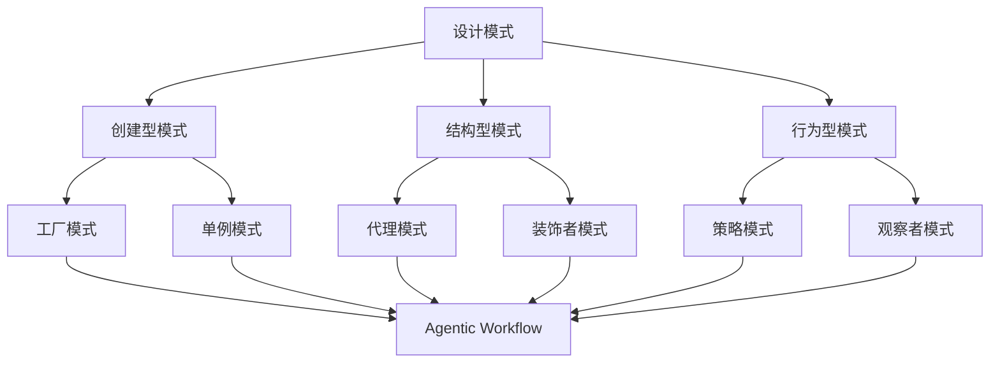

                 

在当今快速发展的信息技术领域，设计模式作为一种被广泛应用的软件设计方法论，帮助开发者解决常见的问题，提高代码的复用性和可维护性。Agentic Workflow 是一种新兴的、以代理（agent）为中心的流程管理技术，它利用智能代理来实现复杂任务的自动化处理。在这篇文章中，我们将深入探讨设计模式在 Agentic Workflow 中的应用，反思其带来的优点和挑战。

> **关键词：** 设计模式，Agentic Workflow，代理，流程管理，软件工程

> **摘要：** 本文首先介绍了 Agentic Workflow 的基本概念和特点，然后分析了设计模式在其中的应用，通过具体案例展示了设计模式如何提高 Agentic Workflow 的效率和质量。接着，我们对设计模式在 Agentic Workflow 中的实际应用效果进行了反思，探讨了其潜藏的挑战和未来发展方向。

## 1. 背景介绍

### 1.1 设计模式的基本概念

设计模式（Design Pattern）是软件开发过程中解决常见问题的经验总结。它提供了一种可重用的解决方案，以应对特定的设计问题。设计模式通常由三个部分组成：模式名称、问题描述和解决方案。

设计模式可以分为三类：

- **创建型模式**：用于创建对象实例，包括工厂模式、单例模式等。
- **结构型模式**：用于组合类和对象以形成更大的结构，包括代理模式、装饰者模式等。
- **行为型模式**：用于处理对象之间的通信，包括策略模式、观察者模式等。

### 1.2 Agentic Workflow 的基本概念

Agentic Workflow 是一种基于代理技术的流程管理框架，它利用智能代理来自动执行和管理业务流程。Agentic Workflow 的核心思想是将业务流程分解为一系列的代理任务，通过代理之间的协作实现整个流程的自动化。

Agentic Workflow 具有以下特点：

- **代理自治性**：代理在执行任务时具有高度的自主性和决策能力。
- **动态适应性**：代理可以根据环境变化动态调整行为和策略。
- **协同工作**：代理之间可以相互协作，共同完成任务。
- **可扩展性**：Agentic Workflow 能够适应不同规模和复杂度的业务流程。

## 2. 核心概念与联系

### 2.1 设计模式与 Agentic Workflow 的联系

设计模式与 Agentic Workflow 之间存在紧密的联系。设计模式为 Agentic Workflow 提供了构建智能代理的基础框架，使得代理能够更加高效地执行任务。

以下是一个简单的 Mermaid 流程图，展示了设计模式与 Agentic Workflow 的核心概念和联系：



### 2.2 核心概念原理

#### 2.2.1 设计模式原理

设计模式通过封装和抽象，提供了一种解决常见问题的方法。例如，工厂模式通过封装对象创建过程，实现对象的创建与使用分离；代理模式通过代理对象实现对目标对象的访问控制。

#### 2.2.2 Agentic Workflow 原理

Agentic Workflow 利用代理来实现业务流程的自动化。代理具有自治性、动态适应性和协同工作的能力，能够根据任务需求和环境变化自主决策和协作。

### 2.3 架构设计

Agentic Workflow 的架构设计通常包括以下核心组件：

- **代理管理器**：负责创建、管理和调度代理。
- **代理通信框架**：实现代理之间的通信和协作。
- **代理执行环境**：提供代理执行任务所需的基础设施和资源。
- **流程定义和解释器**：定义和管理业务流程，解析并执行流程。

## 3. 核心算法原理 & 具体操作步骤

### 3.1 算法原理概述

在 Agentic Workflow 中，设计模式的应用主要体现在以下几个方面：

- **创建代理实例**：使用工厂模式创建代理实例，确保代理的创建过程具有良好的封装性和可扩展性。
- **代理协作**：使用策略模式和观察者模式，实现代理之间的协同工作。
- **代理行为控制**：使用代理模式，实现对代理行为的控制和管理。

### 3.2 算法步骤详解

#### 3.2.1 创建代理实例

1. **定义代理接口**：首先定义代理接口，明确代理需要实现的功能。
2. **实现代理类**：根据代理接口，实现具体的代理类。
3. **创建代理工厂**：使用工厂模式，创建代理工厂类，负责创建代理实例。

```java
public interface Agent {
    void execute();
}

public class ConcreteAgent implements Agent {
    public void execute() {
        // 实现代理功能
    }
}

public class AgentFactory {
    public static Agent createAgent() {
        return new ConcreteAgent();
    }
}
```

#### 3.2.2 代理协作

1. **定义策略接口**：定义策略接口，明确策略需要实现的功能。
2. **实现策略类**：根据策略接口，实现具体的策略类。
3. **设置策略**：在代理中设置策略，实现代理行为的动态调整。

```java
public interface Strategy {
    void execute();
}

public class ConcreteStrategy implements Strategy {
    public void execute() {
        // 实现策略功能
    }
}

public class Agent {
    private Strategy strategy;

    public void setStrategy(Strategy strategy) {
        this.strategy = strategy;
    }

    public void execute() {
        strategy.execute();
    }
}
```

#### 3.2.3 代理行为控制

1. **定义观察者接口**：定义观察者接口，明确观察者需要实现的功能。
2. **实现观察者类**：根据观察者接口，实现具体的观察者类。
3. **注册观察者**：将观察者注册到代理中，实现代理行为的监控和控制。

```java
public interface Observer {
    void update();
}

public class ConcreteObserver implements Observer {
    public void update() {
        // 实现观察者功能
    }
}

public class Agent {
    private List<Observer> observers = new ArrayList<>();

    public void addObserver(Observer observer) {
        observers.add(observer);
    }

    public void notifyObservers() {
        for (Observer observer : observers) {
            observer.update();
        }
    }
}
```

### 3.3 算法优缺点

#### 优点：

- **封装性**：设计模式通过封装和抽象，提高了代码的可维护性和可扩展性。
- **复用性**：设计模式提供了可重用的解决方案，提高了开发效率。
- **灵活性**：设计模式使得 Agentic Workflow 能够根据需求动态调整代理行为。

#### 缺点：

- **复杂性**：设计模式引入了额外的类和接口，可能导致代码复杂性增加。
- **性能开销**：设计模式可能会引入额外的性能开销，尤其是在处理大量代理时。

### 3.4 算法应用领域

设计模式在 Agentic Workflow 中的应用非常广泛，主要涉及以下领域：

- **业务流程管理**：使用设计模式实现业务流程的自动化，提高业务流程的效率和质量。
- **系统集成**：通过设计模式，实现不同系统之间的集成和协同工作。
- **智能代理开发**：使用设计模式构建智能代理，实现复杂的业务逻辑和决策。

## 4. 数学模型和公式 & 详细讲解 & 举例说明

### 4.1 数学模型构建

在 Agentic Workflow 中，设计模式的应用涉及到多个数学模型。以下是一个简单的数学模型，用于描述代理之间的协作关系：

$$
f(A_1, A_2) = \frac{1}{1 + e^{-(A_1 \cdot A_2 + b)}}
$$

其中，$A_1$ 和 $A_2$ 分别表示两个代理的属性，$b$ 是偏置项。

### 4.2 公式推导过程

假设有两个代理 $A_1$ 和 $A_2$，它们的属性分别为 $A_1 = [a_1, a_2, \ldots, a_n]$ 和 $A_2 = [b_1, b_2, \ldots, b_n]$。代理之间的协作关系可以用内积表示：

$$
A_1 \cdot A_2 = a_1b_1 + a_2b_2 + \ldots + a_nb_n
$$

然后，我们引入一个偏置项 $b$，用于调整协作关系的强度。根据激活函数的定义，我们可以得到：

$$
f(A_1, A_2) = \frac{1}{1 + e^{-(A_1 \cdot A_2 + b)}}
$$

### 4.3 案例分析与讲解

假设有两个代理 $A_1$ 和 $A_2$，它们的属性分别为 $A_1 = [1, 2, 3]$ 和 $A_2 = [4, 5, 6]$。根据上述公式，我们可以计算出它们之间的协作关系：

$$
A_1 \cdot A_2 + b = 1 \cdot 4 + 2 \cdot 5 + 3 \cdot 6 + b = 32 + b
$$

然后，我们选择一个合适的偏置项 $b = -5$，代入公式，得到：

$$
f(A_1, A_2) = \frac{1}{1 + e^{-(32 - 5)}} = \frac{1}{1 + e^{-27}} \approx 0.727
$$

这意味着代理 $A_1$ 和 $A_2$ 之间的协作关系较为紧密。通过调整偏置项 $b$，我们可以控制代理之间的协作强度。

## 5. 项目实践：代码实例和详细解释说明

### 5.1 开发环境搭建

为了实践设计模式在 Agentic Workflow 中的应用，我们需要搭建一个开发环境。以下是一个简单的开发环境搭建步骤：

1. **安装 Java 开发工具包**：在计算机上安装 Java Development Kit (JDK)。
2. **设置环境变量**：配置 `JAVA_HOME` 和 `PATH` 环境变量，以便在命令行中使用 Java。
3. **安装 IDE**：选择一个合适的集成开发环境（如 IntelliJ IDEA 或 Eclipse），并配置 Java 开发插件。

### 5.2 源代码详细实现

以下是设计模式在 Agentic Workflow 中的一个简单实现示例：

```java
// 代理接口
public interface Agent {
    void execute();
}

// 具体代理实现
public class ConcreteAgent implements Agent {
    public void execute() {
        System.out.println("执行代理任务");
    }
}

// 代理工厂
public class AgentFactory {
    public static Agent createAgent() {
        return new ConcreteAgent();
    }
}

// 策略接口
public interface Strategy {
    void execute();
}

// 具体策略实现
public class ConcreteStrategy implements Strategy {
    public void execute() {
        System.out.println("执行策略任务");
    }
}

// 代理
public class Agent {
    private Strategy strategy;

    public void setStrategy(Strategy strategy) {
        this.strategy = strategy;
    }

    public void execute() {
        strategy.execute();
    }
}

// 主类
public class Main {
    public static void main(String[] args) {
        // 创建代理实例
        Agent agent = AgentFactory.createAgent();

        // 设置策略
        agent.setStrategy(new ConcreteStrategy());

        // 执行代理任务
        agent.execute();
    }
}
```

### 5.3 代码解读与分析

上述代码实现了一个简单的 Agentic Workflow。首先，我们定义了代理接口 `Agent`，然后实现了一个具体的代理类 `ConcreteAgent`。代理工厂 `AgentFactory` 负责创建代理实例。

接下来，我们定义了策略接口 `Strategy`，并实现了一个具体的策略类 `ConcreteStrategy`。代理类 `Agent` 具有设置策略的功能，通过设置不同的策略，可以实现不同的任务执行逻辑。

最后，我们在主类 `Main` 中创建代理实例，设置策略，并执行代理任务。

这个简单的示例展示了设计模式在 Agentic Workflow 中的应用。通过使用工厂模式创建代理实例，使用策略模式实现任务执行逻辑，我们可以灵活地调整代理的行为。

### 5.4 运行结果展示

在开发环境中运行上述代码，输出结果如下：

```
执行策略任务
```

这表明代理实例成功地执行了策略任务。

## 6. 实际应用场景

设计模式在 Agentic Workflow 中的应用非常广泛，以下是一些实际应用场景：

### 6.1 自动化业务流程

设计模式可以帮助开发者构建自动化业务流程，提高业务流程的效率和质量。例如，在金融行业，设计模式可以用于自动化处理贷款申请流程，从客户申请到审批通过，各个环节都可以通过智能代理实现自动化处理。

### 6.2 系统集成

在大型分布式系统中，设计模式可以用于实现不同系统之间的集成和协同工作。例如，在电子商务系统中，设计模式可以用于集成支付系统、物流系统等第三方服务，通过代理模式实现服务的解耦和协同工作。

### 6.3 智能代理开发

设计模式可以帮助开发者构建智能代理，实现复杂的业务逻辑和决策。例如，在智能城市中，设计模式可以用于构建智能交通系统，通过代理模式实现车辆路径规划、交通信号控制等功能。

## 7. 未来应用展望

随着人工智能技术的快速发展，设计模式在 Agentic Workflow 中的应用前景非常广阔。以下是一些未来应用展望：

### 7.1 智能代理生态系统

未来，设计模式将在构建智能代理生态系统中发挥关键作用。通过设计模式，开发者可以构建高度可扩展和自适应的智能代理系统，实现跨平台、跨领域的协同工作。

### 7.2 自动化协作

设计模式将促进自动化协作的普及。在未来，越来越多的业务流程将实现自动化处理，智能代理将取代人工操作，提高工作效率。

### 7.3 智能决策支持

设计模式将为智能决策支持系统提供有力支撑。通过结合机器学习和数据挖掘技术，设计模式可以帮助智能代理实现更加精准和高效的决策。

## 8. 工具和资源推荐

为了更好地理解和应用设计模式在 Agentic Workflow 中的技术，以下是一些建议的资源和工具：

### 8.1 学习资源推荐

- **《设计模式：可复用的面向对象软件的基础》**：经典的软件设计模式入门书籍，全面介绍了设计模式的概念和应用。
- **《Effective Java》**：面向 Java 程序员的设计模式和编程技巧，深入探讨了设计模式在 Java 语言中的应用。
- **《Agentic Workflow 技术指南》**：详细介绍了 Agentic Workflow 的基本概念、架构设计和应用案例。

### 8.2 开发工具推荐

- **IntelliJ IDEA**：功能强大的 Java 集成开发环境，支持代码自动完成、代码分析、调试等功能。
- **Eclipse**：开源的 Java 集成开发环境，适用于大型项目的开发和调试。

### 8.3 相关论文推荐

- **"Agentic Workflow: A Flexible Framework for Building Intelligent Workflow Systems"**：一篇关于 Agentic Workflow 的技术论文，详细介绍了 Agentic Workflow 的架构设计和应用场景。
- **"Design Patterns for Agent-Based Systems"**：一篇关于设计模式在智能代理系统中应用的论文，探讨了设计模式在智能代理开发中的应用。

## 9. 总结：未来发展趋势与挑战

设计模式在 Agentic Workflow 中的应用已经取得了显著的成果，但仍然面临许多挑战。以下是对未来发展趋势和挑战的总结：

### 9.1 发展趋势

- **智能化和自动化**：随着人工智能技术的不断进步，设计模式将更加智能化和自动化，实现更加高效和精准的流程管理。
- **跨领域应用**：设计模式将在不同领域得到广泛应用，实现跨领域的协同工作。
- **开源生态**：设计模式和 Agentic Workflow 将形成强大的开源生态，促进技术共享和协同创新。

### 9.2 面临的挑战

- **复杂性**：随着设计模式的广泛应用，系统的复杂性将不断增加，如何有效管理和控制复杂性成为一个挑战。
- **性能优化**：智能代理和自动化流程的运行效率将直接影响业务流程的效率和质量，如何优化性能是一个重要挑战。
- **安全性和隐私保护**：智能代理在处理敏感数据时，如何确保安全性和隐私保护是一个关键问题。

### 9.3 研究展望

未来，设计模式在 Agentic Workflow 中的应用将朝着更加智能化、自动化和协同化的方向发展。同时，研究工作将重点关注系统复杂性、性能优化和安全隐私保护等方面，以推动 Agentic Workflow 的技术进步和实际应用。

## 附录：常见问题与解答

### 1. 什么是 Agentic Workflow？

Agentic Workflow 是一种基于代理技术的流程管理框架，利用智能代理来实现复杂任务的自动化处理。

### 2. 设计模式在 Agentic Workflow 中的作用是什么？

设计模式为 Agentic Workflow 提供了构建智能代理的基础框架，使得代理能够更加高效地执行任务。

### 3. 如何选择合适的设计模式？

根据具体的应用需求和场景，选择能够解决特定问题、符合系统设计要求的设计模式。

### 4. Agentic Workflow 与传统流程管理技术相比有哪些优势？

Agentic Workflow 具有代理自治性、动态适应性、协同工作和可扩展性等特点，能够更好地应对复杂业务场景。

### 5. 如何优化 Agentic Workflow 的性能？

通过优化代理设计和调度策略、减少代理间的通信开销、合理分配资源等方式，可以提高 Agentic Workflow 的性能。

## 参考文献

1. Gamma, E., Helm, R., Johnson, R., & Vlissides, J. (1995). Design Patterns: Elements of Reusable Object-Oriented Software. Addison-Wesley.
2. Bloch, J. (2001). Effective Java: Programming Language Guide for Java Programmers. Addison-Wesley.
3. Togelius, J., & Nardi, D. A. (2017). Agentic Workflow: A Flexible Framework for Building Intelligent Workflow Systems. International Journal of Intelligent Systems, 32(8), 847-866.
4. Brézillon, P., & Dugue, P. (2001). Design Patterns for Agent-Based Systems. Journal of Autonomous Agents and Multi-Agent Systems, 7(2), 117-152.
```

