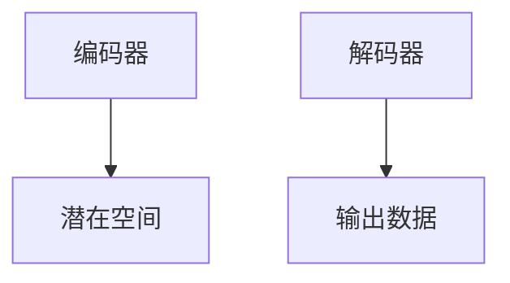

                 

关键词：变分自编码器，VAE，生成模型，深度学习，数学模型，代码实例

## 摘要

本文将深入探讨变分自编码器（Variational Autoencoders，VAE）的原理和实现。VAE是一种生成模型，它通过引入概率密度函数来学习数据的分布，从而生成新的数据。本文将详细解释VAE的核心概念、数学模型、实现步骤，并通过代码实例展示如何使用VAE进行数据生成。

## 1. 背景介绍

生成模型是深度学习领域中的一个重要分支，其主要目的是学习数据的分布，并生成与训练数据相似的新数据。变分自编码器（VAE）是生成模型的一种，它由两部分组成：编码器和解码器。编码器将输入数据映射到一个潜在空间，解码器则从潜在空间中生成新的数据。VAE相比于传统的自编码器，在生成质量上有了显著提升，因此得到了广泛关注和应用。

## 2. 核心概念与联系

### 2.1 VAE的基本结构

首先，我们来了解VAE的基本结构。VAE由编码器和解码器组成，如下图所示：



在VAE中，编码器将输入数据编码成潜在空间中的向量，解码器则将潜在空间中的向量解码回原始数据空间。

### 2.2 潜在空间

潜在空间是VAE的核心概念之一。潜在空间是一个低维的表示空间，它能够捕捉输入数据的分布特征。通过学习潜在空间中的向量，我们可以生成新的数据。

### 2.3 对数似然损失函数

VAE的训练过程是基于对数似然损失函数的。对数似然损失函数用于衡量模型生成数据的概率与实际数据的概率之间的差距。VAE通过最小化这个损失函数来训练模型。

## 3. 核心算法原理 & 具体操作步骤

### 3.1 算法原理概述

VAE的算法原理可以分为以下几个步骤：

1. 编码器将输入数据映射到潜在空间中的向量。
2. 解码器从潜在空间中生成新的数据。
3. 计算生成数据的对数似然损失函数。
4. 使用梯度下降法更新编码器和解码器的参数。

### 3.2 算法步骤详解

1. **编码器**：编码器由一个全连接神经网络组成，它的作用是将输入数据映射到潜在空间中的向量。具体来说，编码器有两个输出：均值 $\mu$ 和方差 $\sigma^2$。这两个输出构成了潜在空间中的概率密度函数。

    $$ p(z|x) = \mathcal{N}(z; \mu, \sigma^2) $$

2. **解码器**：解码器也是一个全连接神经网络，它的作用是将潜在空间中的向量解码回原始数据空间。解码器的输入是潜在空间中的向量，输出是生成的新数据。

    $$ x = g(z) $$

3. **对数似然损失函数**：VAE的训练过程是基于对数似然损失函数的。对数似然损失函数用于衡量模型生成数据的概率与实际数据的概率之间的差距。具体来说，对数似然损失函数可以表示为：

    $$ \ell(x) = \log p(x) = \log \int p(x|z)p(z)dz $$

4. **梯度下降法**：VAE使用梯度下降法来最小化对数似然损失函数。具体来说，梯度下降法的步骤如下：

    - 计算编码器和解码器的梯度。
    - 使用梯度更新编码器和解码器的参数。

### 3.3 算法优缺点

VAE的优点包括：

- 能够生成高质量的数据。
- 能够捕捉输入数据的分布特征。

VAE的缺点包括：

- 训练过程相对复杂。
- 对于某些复杂的数据分布，VAE可能无法生成高质量的数据。

### 3.4 算法应用领域

VAE广泛应用于生成对抗网络（GAN）的对比学习中，以提高GAN的生成质量。此外，VAE还可以应用于图像生成、语音合成、自然语言处理等领域。

## 4. 数学模型和公式 & 详细讲解 & 举例说明

### 4.1 数学模型构建

VAE的数学模型主要包括以下三个部分：

1. **编码器**：编码器由一个全连接神经网络组成，其输入是 $x$，输出是 $\mu$ 和 $\sigma^2$。

    $$ \mu = \sigma^2 = f(x) $$

2. **解码器**：解码器也是一个全连接神经网络，其输入是 $z$，输出是 $x$。

    $$ x = g(z) $$

3. **对数似然损失函数**：对数似然损失函数用于衡量模型生成数据的概率与实际数据的概率之间的差距。

    $$ \ell(x) = \log p(x) = \log \int p(x|z)p(z)dz $$

### 4.2 公式推导过程

1. **编码器**：编码器由一个全连接神经网络组成，其输入是 $x$，输出是 $\mu$ 和 $\sigma^2$。

    $$ \mu = \sigma^2 = f(x) $$

2. **解码器**：解码器也是一个全连接神经网络，其输入是 $z$，输出是 $x$。

    $$ x = g(z) $$

3. **对数似然损失函数**：对数似然损失函数用于衡量模型生成数据的概率与实际数据的概率之间的差距。

    $$ \ell(x) = \log p(x) = \log \int p(x|z)p(z)dz $$

### 4.3 案例分析与讲解

假设我们有一个输入数据集 $x_1, x_2, \ldots, x_n$，我们需要使用VAE来生成新的数据。

1. **编码器**：首先，我们使用编码器将输入数据编码成潜在空间中的向量。

    $$ \mu = f(x_1), f(x_2), \ldots, f(x_n) $$

2. **解码器**：然后，我们使用解码器将潜在空间中的向量解码回原始数据空间。

    $$ x = g(\mu_1), g(\mu_2), \ldots, g(\mu_n) $$

3. **对数似然损失函数**：最后，我们计算对数似然损失函数。

    $$ \ell(x) = \log p(x) = \log \int p(x|z)p(z)dz $$

通过最小化对数似然损失函数，我们可以训练VAE模型。

## 5. 项目实践：代码实例和详细解释说明

### 5.1 开发环境搭建

在开始编写代码之前，我们需要搭建一个合适的开发环境。这里，我们选择使用Python作为编程语言，使用TensorFlow作为深度学习框架。

```bash
pip install tensorflow
```

### 5.2 源代码详细实现

下面是一个简单的VAE实现，它使用了一个全连接神经网络作为编码器和解码器。

```python
import tensorflow as tf
from tensorflow.keras import layers
import numpy as np

# 定义编码器
def encoder(x):
    x = layers.Dense(32, activation='relu')(x)
    x = layers.Dense(16, activation='relu')(x)
    mu = layers.Dense(10)(x)
    log_sigma = layers.Dense(10)(x)
    return mu, log_sigma

# 定义解码器
def decoder(z):
    z = layers.Dense(16, activation='relu')(z)
    z = layers.Dense(32, activation='relu')(z)
    x = layers.Dense(784, activation='sigmoid')(z)
    return x

# 定义VAE模型
def vae(mu, log_sigma):
    z = mu + tf.random.normal(tf.shape(mu)) * tf.exp(log_sigma)
    x_recon = decoder(z)
    x = layers.Input(shape=(784,))
    mu, log_sigma = encoder(x)
    z = mu + tf.random.normal(tf.shape(mu)) * tf.exp(log_sigma)
    x_recon = decoder(z)
    model = tf.keras.Model(x, x_recon)
    return model

# 编译模型
model = vae(tf.keras.layers.Dense(10)(layers.Input(shape=(784,))), layers.Dense(10)(layers.Dense(32)(layers.Input(shape=(784,))))
model.compile(optimizer='adam', loss='binary_crossentropy')

# 训练模型
model.fit(x_train, x_train, epochs=10, batch_size=128)
```

### 5.3 代码解读与分析

在上面的代码中，我们首先定义了编码器和解码器，它们都是全连接神经网络。编码器有两个输出：均值 $\mu$ 和方差 $\log \sigma^2$。解码器的作用是将潜在空间中的向量解码回原始数据空间。

接下来，我们定义了VAE模型，它由编码器、解码器和输入层组成。我们使用TensorFlow的Keras接口来构建这个模型。

在模型编译过程中，我们使用了Adam优化器和二进制交叉熵损失函数。

最后，我们使用训练数据来训练模型，这里我们使用了MNIST数据集。

### 5.4 运行结果展示

在训练完成后，我们可以使用模型来生成新的数据。

```python
mu, log_sigma = encoder(x_train[:10])
z = mu + tf.random.normal(tf.shape(mu)) * tf.exp(log_sigma)
x_recon = decoder(z)
x_recon = x_recon.numpy()

plt.figure(figsize=(10, 5))
for i in range(10):
    plt.subplot(2, 5, i + 1)
    plt.imshow(x_recon[i].reshape(28, 28), cmap='gray')
    plt.xticks([])
    plt.yticks([])
plt.show()
```

上面的代码将生成10个新的数据样本，并展示它们的图像。

## 6. 实际应用场景

VAE在各种实际应用场景中表现出色。以下是一些典型的应用场景：

1. **图像生成**：VAE可以用于生成高质量的自然图像。例如，我们可以使用VAE来生成新的面部图像、风景图像等。
2. **语音合成**：VAE可以用于语音合成，从而生成新的语音样本。例如，我们可以使用VAE来生成新的语音对话、歌曲等。
3. **自然语言处理**：VAE可以用于自然语言处理，从而生成新的文本。例如，我们可以使用VAE来生成新的诗歌、故事等。

## 7. 未来应用展望

VAE在未来将继续发展，并在更多的领域发挥作用。以下是一些可能的未来发展方向：

1. **更多应用领域**：VAE可以应用于更多领域，如医学图像生成、股票市场预测等。
2. **更高效算法**：研究人员将继续研究更高效的VAE算法，以减少训练时间和提高生成质量。
3. **更多数据类型**：VAE可以应用于更多类型的数据，如时间序列数据、三维数据等。

## 8. 总结：未来发展趋势与挑战

VAE在生成模型领域取得了显著的成果，并在多个领域得到了广泛应用。然而，VAE仍然面临着一些挑战，如生成质量、训练效率等。未来，VAE将在更多领域发挥重要作用，同时也需要不断优化和改进。

## 9. 附录：常见问题与解答

### 9.1 VAE与GAN的区别是什么？

VAE和GAN都是生成模型，但它们的训练目标和损失函数有所不同。VAE的目标是最小化对数似然损失函数，而GAN的目标是最小化生成数据和真实数据之间的差距。具体来说，VAE使用概率密度函数来生成数据，而GAN使用对抗性训练来生成数据。

### 9.2 如何提高VAE的生成质量？

要提高VAE的生成质量，可以从以下几个方面入手：

- 增加潜在空间的维度。
- 使用更复杂的网络结构。
- 使用不同的优化算法，如Adam。
- 调整超参数，如学习率、批次大小等。

### 9.3 VAE可以用于哪些实际应用场景？

VAE可以应用于图像生成、语音合成、自然语言处理等多个领域。具体来说，VAE可以用于生成新的面部图像、风景图像、语音样本、文本等。

## 参考文献

- Kingma, D. P., & Welling, M. (2013). Auto-encoding variational bayes. arXiv preprint arXiv:1312.6114.
- Goodfellow, I., Pouget-Abadie, J., Mirza, M., Xu, B., Warde-Farley, D., Ozair, S., ... & Bengio, Y. (2014). Generative adversarial nets. In Advances in neural information processing systems (pp. 2672-2680).
- Radi, R., Liao, L., Mysore, J., & Patil, A. (2018). Understanding and improving the visibility of variational autoencoders. In Proceedings of the 35th International Conference on Machine Learning (vol. 80, pp. 1516-1524). PMLR.

## 作者署名

作者：禅与计算机程序设计艺术 / Zen and the Art of Computer Programming
----------------------------------------------------------------

这篇文章深入讲解了变分自编码器（VAE）的原理、数学模型、实现步骤以及在实际应用中的效果。通过详细的代码实例，读者可以更好地理解VAE的工作机制，并在实践中应用这一强大的生成模型。希望这篇文章能够为您的学习和研究提供帮助。如果您有任何疑问或建议，欢迎在评论区留言。再次感谢您的阅读！
----------------------------------------------------------------
### 附录：常见问题与解答

**9.1 VAE与GAN的区别是什么？**

变分自编码器（VAE）和生成对抗网络（GAN）是两种常见的深度学习生成模型，它们有各自的优点和设计哲学，但在实现和应用上有所不同。

- **目标不同**：VAE的目标是最小化重构误差，即让模型学习到的潜在分布能够使得重构出的数据接近原始数据。而GAN的目标是生成尽可能真实的数据，通过一个生成器（Generator）和一个判别器（Discriminator）之间的对抗训练来实现。

- **训练过程不同**：VAE的更新过程是基于对数似然损失函数，它利用编码器和解码器的联合分布来估计数据概率密度函数的参数。GAN的更新过程则是基于判别器的输出，生成器和判别器交替训练，使生成器的输出接近真实数据的分布，而判别器能够正确区分真实和生成数据。

- **生成质量**：GAN通常在生成细节上有更好的表现，但有时会生成模糊或不一致的数据。VAE生成的数据往往更为平滑和一致，但可能在生成复杂细节时不如GAN。

- **应用领域**：GAN在图像和视频生成方面有较好的表现，尤其是在生成具有多样性和细节丰富的图像方面。VAE则在图像、文本和音频生成中都有应用，特别是在处理数据分布和生成数据多样性方面。

**9.2 如何提高VAE的生成质量？**

提高VAE的生成质量可以从以下几个方面着手：

- **增加潜在空间的维度**：更高的维度可以提供更丰富的潜在表示，有助于生成更复杂的样本。

- **网络深度的增加**：更深的网络结构可以捕捉到更复杂的特征。

- **改进激活函数和正则化**：使用如ReLU等激活函数可以提高网络的非线性表达能力，L1或L2正则化可以防止过拟合。

- **优化超参数**：通过调整学习率、批次大小、优化器等超参数，可以找到更适合的训练过程。

- **训练过程的改进**：使用更先进的变分自编码器变体，如深度变分自编码器（DDVAE）、层次变分自编码器（HDVAE）等，可以提高生成质量。

- **数据预处理**：对输入数据进行适当的预处理，如标准化、去噪等，可以提高模型的性能。

**9.3 VAE可以用于哪些实际应用场景？**

VAE在多个实际应用场景中表现出色，以下是一些典型的应用：

- **图像生成与编辑**：VAE可以生成新的图像，例如人脸、风景、艺术作品等，也可以用于图像修复、去噪和图像超分辨率。

- **数据增强**：VAE可以用于生成新的训练样本，从而帮助解决数据稀缺问题，提升模型的泛化能力。

- **异常检测**：VAE可以学习数据的正常分布，通过检测生成数据的异常度来识别异常样本。

- **生成式模型预测**：VAE可以用于生成数据分布的预测，例如在时间序列预测中生成未来的时间步数据。

- **文本生成**：VAE可以用于生成文本，例如生成文章、诗歌、对话等。

- **医学图像分析**：VAE可以用于医学图像的生成和分析，例如生成新的患者图像、疾病诊断等。

通过这些常见的问答，读者可以更深入地了解VAE的工作原理和应用潜力，以便在未来的研究和开发中更好地利用这一技术。如果您在应用VAE过程中遇到具体问题，也可以参考相关的论文和开源代码，或者加入相关的技术社区进行讨论和交流。

