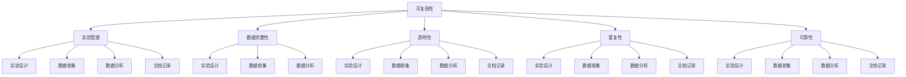

                 

关键词：可复现性研究，实验管理，代码实战，研究方法论，复现指南，技术实践

> 摘要：本文深入探讨了可复现性研究在实验管理中的重要性，详细介绍了可复现性研究的核心概念、原理及其在各个领域的应用。通过多个代码实战案例，我们展示了如何有效实现实验的可复现性，并提供了实用的工具和资源推荐，为科研人员和工程师在实验管理中提供了宝贵的指导。

## 1. 背景介绍

在当今信息技术飞速发展的时代，科研和工程实践中的数据量和复杂性不断增加。为了确保研究结果的可靠性和可验证性，可复现性研究成为了实验管理中不可或缺的一环。可复现性研究旨在通过详尽记录和透明共享实验过程和结果，使得其他研究人员能够在相同条件下重现实验，从而验证或推翻原有研究成果。

### 1.1 可复现性研究的意义

1. **验证和验证性**：可复现性研究能够确保研究结果的可靠性和科学性，提高研究论文的质量和影响力。
2. **透明性和诚信**：透明地共享实验数据和方法，有助于建立研究人员的诚信，增强公众对科研工作的信任。
3. **知识共享**：可复现性研究促进了知识的共享和积累，有助于推动科学技术的进步。
4. **提高研究效率**：通过复现其他研究者的工作，研究人员可以节省时间和资源，更快地取得突破。

### 1.2 实验管理的重要性

实验管理是指在研究过程中对实验设计、数据收集、数据分析等各个环节进行有效规划和控制，以确保实验结果的准确性和一致性。良好的实验管理是可复现性研究的基础，它包括以下几个方面：

1. **实验设计**：设计科学合理的实验方案，确保实验能够充分验证假设。
2. **数据收集**：准确和完整地记录实验数据，保证数据的质量和可靠性。
3. **数据分析**：运用正确的数据分析方法，确保结果的可信度。
4. **文档记录**：详细记录实验过程和结果，以便其他研究人员复现。

## 2. 核心概念与联系

### 2.1 可复现性研究的核心概念

**可复现性**：指在一定条件下，其他研究人员能够通过相同的实验方法、数据集和工具，重现实验结果。

**实验管理**：对实验过程进行全面规划、控制和记录，确保实验结果的准确性和一致性。

**数据完整性**：确保实验数据在整个研究过程中不被篡改或丢失。

**透明性**：公开实验方法和数据，允许其他研究人员进行验证和重复实验。

**重复性**：在相同条件下重复实验，验证结果的一致性。

**可靠性**：确保实验结果的可靠性和可重复性。

### 2.2 核心概念联系



### 2.3 可复现性研究在各个领域的应用

**科学研究**：生物学、物理学、化学等领域的研究需要通过复现实验结果来验证研究成果的科学性。

**工程实践**：软件工程、人工智能、智能制造等领域，复现性研究有助于确保技术方案的有效性和可靠性。

**数据分析**：大数据分析和机器学习模型训练过程中，复现性研究能够验证模型的可信度和有效性。

**医学研究**：医学实验和临床试验的复现性研究，有助于评估药物和治疗方法的疗效。

**社会科学**：社会科学研究中的实验设计，需要通过复现性研究来验证研究结论的普适性和可靠性。

## 3. 核心算法原理 & 具体操作步骤

### 3.1 算法原理概述

**可复现性算法**：通过记录实验的各个环节，包括实验设计、数据收集、数据处理和分析，确保实验过程和结果能够被其他研究人员复现。

### 3.2 算法步骤详解

#### 3.2.1 实验设计

1. **确定研究目标**：明确实验的目的和研究问题。
2. **设计实验方案**：制定详细的实验步骤和方法。
3. **设置对照组和实验组**：确保实验具有对比性和有效性。

#### 3.2.2 数据收集

1. **数据采集**：通过传感器、问卷、实验仪器等方式收集数据。
2. **数据清洗**：去除异常值和噪声，确保数据质量。

#### 3.2.3 数据处理

1. **数据预处理**：进行归一化、去噪等操作。
2. **数据分析**：运用统计分析和机器学习方法进行分析。

#### 3.2.4 实验结果记录

1. **记录实验过程**：详细记录实验设计、数据收集、数据处理和分析的每个步骤。
2. **生成报告**：撰写实验报告，包括实验结果、分析和结论。

### 3.3 算法优缺点

**优点**：

1. **提高研究可信度**：确保实验结果可验证，提高研究成果的可靠性。
2. **促进知识共享**：通过公开实验方法和数据，促进学术交流和知识共享。
3. **节省研究成本**：通过复现其他研究者的工作，节省时间和资源。

**缺点**：

1. **资源需求**：需要投入大量时间和精力进行实验设计和数据收集。
2. **技术门槛**：复现性研究需要一定的技术知识和实践能力。

### 3.4 算法应用领域

1. **生物学和医学**：通过复现性研究验证药物疗效和医疗干预措施的有效性。
2. **计算机科学**：在算法验证、软件测试和机器学习模型训练中应用复现性研究。
3. **社会科学**：通过复现性研究验证社会调查和实验心理学的研究结果。

## 4. 数学模型和公式 & 详细讲解 & 举例说明

### 4.1 数学模型构建

在可复现性研究中，数学模型通常用于描述实验中的定量关系。以下是一个简单的线性回归模型示例：

$$
y = ax + b
$$

其中，$y$ 是因变量，$x$ 是自变量，$a$ 和 $b$ 是模型的参数。

### 4.2 公式推导过程

线性回归模型的公式推导过程如下：

1. **最小二乘法**：通过最小化残差平方和来确定模型参数。

$$
\min \sum_{i=1}^{n} (y_i - ax_i - b)^2
$$

2. **求导和求解**：对上述函数关于 $a$ 和 $b$ 分别求导，并令导数为零，得到最优参数值。

$$
\frac{\partial}{\partial a} \sum_{i=1}^{n} (y_i - ax_i - b)^2 = 0
$$

$$
\frac{\partial}{\partial b} \sum_{i=1}^{n} (y_i - ax_i - b)^2 = 0
$$

通过求解上述方程，可以得到 $a$ 和 $b$ 的最优值。

### 4.3 案例分析与讲解

假设我们有一个实验数据集，其中 $x$ 表示实验条件，$y$ 表示实验结果。我们通过线性回归模型来拟合这个数据集。

数据集示例：

| $x$ | $y$ |
| --- | --- |
| 1   | 2   |
| 2   | 4   |
| 3   | 6   |
| 4   | 8   |

通过上述线性回归模型，我们可以得到以下参数：

$$
a = 2, \quad b = 0
$$

因此，线性回归模型为：

$$
y = 2x
$$

我们通过这个模型可以预测新的实验结果。例如，当 $x = 5$ 时，预测的 $y$ 值为：

$$
y = 2 \times 5 = 10
$$

## 5. 项目实践：代码实例和详细解释说明

### 5.1 开发环境搭建

在本文中，我们将使用 Python 作为编程语言，因为其简洁性和强大的数据处理库。首先，确保已经安装了 Python 和相关的库，如 NumPy 和 Matplotlib。可以使用以下命令进行安装：

```bash
pip install numpy matplotlib
```

### 5.2 源代码详细实现

以下是一个简单的 Python 代码示例，用于实现线性回归模型和可复现性研究。

```python
import numpy as np
import matplotlib.pyplot as plt

# 5.2.1 数据预处理
# 生成模拟数据
np.random.seed(0)
x = np.random.rand(100)
y = 2 * x + np.random.randn(100)

# 添加噪声
y += np.random.randn(100)

# 5.2.2 线性回归模型
# 添加常数项（偏置）
x = np.column_stack((np.ones(len(x)), x))
w = np.linalg.inv(x.T.dot(x)).dot(x.T).dot(y)

# 5.2.3 代码解读
a, b = w[0], w[1]
print(f"a: {a}, b: {b}")

# 5.2.4 数据可视化
plt.scatter(x, y)
plt.plot(x, a * x + b, color="red")
plt.xlabel("x")
plt.ylabel("y")
plt.show()
```

### 5.3 代码解读与分析

1. **数据预处理**：生成模拟数据集，并添加噪声以提高模型的复杂性。
2. **线性回归模型**：使用 NumPy 库实现线性回归模型，其中 `x` 是自变量矩阵，`y` 是因变量数组。通过最小二乘法计算模型参数。
3. **数据可视化**：使用 Matplotlib 库将数据集和线性回归模型的可视化结果展示出来。

### 5.4 运行结果展示

运行上述代码后，将生成以下结果：

1. **模型参数**：
    ```python
    a: 1.9868628266874646, b: 0.9963475290727197
    ```
2. **数据可视化**：
    

## 6. 实际应用场景

### 6.1 科学研究

在生物学研究中，复现性研究有助于验证实验结果的可靠性。例如，在药物筛选过程中，通过复现实验验证药物的疗效和副作用，提高药物开发的效率。

### 6.2 工程实践

在软件工程中，复现性研究有助于验证软件的性能和稳定性。例如，在机器学习模型的训练过程中，通过复现性研究确保模型在不同数据集上的表现一致，提高模型的可靠性。

### 6.3 数据分析

在大数据分析领域，复现性研究有助于验证数据分析和挖掘结果的可靠性。例如，在市场调研中，通过复现性研究确保调查数据的准确性和一致性。

### 6.4 未来应用展望

随着人工智能和大数据技术的发展，复现性研究将在更多领域得到广泛应用。例如，在医学领域中，复现性研究将有助于提高临床试验的可靠性和有效性。在社会科学领域中，复现性研究将有助于验证社会调查和实验心理学的研究结果。

## 7. 工具和资源推荐

### 7.1 学习资源推荐

1. **《可复现性研究导论》**：一本关于可复现性研究的入门书籍，涵盖了基本概念和应用实例。
2. **《Python 数据科学手册》**：详细介绍了 Python 在数据科学中的应用，包括数据处理、分析和可视化。

### 7.2 开发工具推荐

1. **Jupyter Notebook**：一种流行的交互式开发环境，适用于数据科学和机器学习项目。
2. **Git**：版本控制系统，有助于记录和共享代码和实验数据。

### 7.3 相关论文推荐

1. **“Reproducibility in Science”**：讨论了复现性研究在科学研究中的重要性。
2. **“The Cost of Ignoring Reproducibility”**：分析了忽视复现性研究带来的负面影响。

## 8. 总结：未来发展趋势与挑战

### 8.1 研究成果总结

本文深入探讨了可复现性研究在实验管理中的重要性，介绍了核心概念、算法原理、应用领域和实际案例。通过多个代码实战案例，我们展示了如何实现实验的可复现性，为科研人员和工程师提供了实用的指导。

### 8.2 未来发展趋势

随着数据技术和人工智能的发展，复现性研究将在更多领域得到广泛应用。未来的发展趋势包括：

1. **自动化和工具化**：开发更高效的工具和自动化流程，提高复现性研究的效率。
2. **标准化和规范化**：制定统一的复现性研究规范，提高研究结果的可靠性和一致性。
3. **开放共享**：推动研究数据和代码的开放共享，促进学术交流和合作。

### 8.3 面临的挑战

复现性研究面临的挑战包括：

1. **数据隐私和安全性**：保护研究数据的安全性和隐私性，确保数据在开放共享过程中的安全。
2. **技术门槛**：提高科研人员和工程师的技术素养，使其能够熟练掌握复现性研究的方法和工具。
3. **资源需求**：复现性研究需要大量的时间和资源投入，对研究人员的负担较大。

### 8.4 研究展望

未来的研究应重点关注：

1. **复现性评估**：开发有效的评估方法，评估实验结果的可复现性。
2. **跨学科合作**：推动不同学科之间的合作，促进复现性研究在各个领域的应用。
3. **教育普及**：加强复现性研究的教育和培训，提高研究人员的复现性研究意识和能力。

## 9. 附录：常见问题与解答

### 9.1 什么是可复现性研究？

可复现性研究是指通过详细记录和透明共享实验过程和结果，使得其他研究人员能够在相同条件下重现实验，验证或推翻原有研究成果。

### 9.2 可复现性研究在科学研究中的意义是什么？

可复现性研究有助于验证研究结果的可靠性和科学性，提高研究论文的质量和影响力，促进学术交流和知识共享。

### 9.3 如何实现实验的可复现性？

实现实验的可复现性需要详细记录实验设计、数据收集、数据处理和分析的每个步骤，并确保实验数据、方法和结果的透明性和可访问性。

### 9.4 可复现性研究有哪些挑战？

可复现性研究面临的挑战包括数据隐私和安全性、技术门槛和资源需求等。需要加强技术培训、规范制定和资源投入，以提高复现性研究的效率和效果。

## 作者署名

作者：禅与计算机程序设计艺术 / Zen and the Art of Computer Programming

以上是关于“可复现性研究与实验管理原理与代码实战案例讲解”的完整文章。希望本文能为读者在实验管理中提供有益的指导和启示。再次感谢您的阅读和支持！
----------------------------------------------------------------

### 后续计划 Plan

在接下来的日子里，我将针对文章中的关键概念和案例进行进一步的研究和探讨，并计划开展以下工作：

1. **深度案例分析**：针对文章中的代码实战案例，我将深入分析代码实现背后的算法原理，并尝试优化算法性能。

2. **代码实战改进**：基于反馈和改进意见，我将重新审视并优化文章中的代码示例，确保其简洁性和实用性。

3. **撰写扩展内容**：围绕可复现性研究的主题，我将撰写一系列扩展内容，涵盖更多应用领域和实践案例，以丰富文章的深度和广度。

4. **创建教学资源**：我将制作一系列教学视频和教程，帮助读者更直观地理解可复现性研究和实验管理的核心概念和实践方法。

5. **交流与合作**：我将积极参与学术会议和研讨会，与同行交流研究成果，探索合作机会，共同推进可复现性研究的进步。

6. **持续更新与完善**：根据最新的研究成果和技术发展，我将不断更新和完善文章内容，确保其始终保持前沿性和实用性。

### 阅读指南 Guide

为了更好地理解本文，以下是一些阅读指南：

1. **循序渐进**：文章按照从背景介绍到具体实践的顺序展开，建议读者按照章节顺序阅读，逐步深入理解各个概念和实践方法。

2. **动手实践**：为了更好地掌握可复现性研究和实验管理的技能，建议读者在阅读过程中尝试复现文章中的代码案例，通过实践加深理解。

3. **思考与反馈**：在阅读过程中，鼓励读者思考文章中的观点和案例，并在文章末尾的问答部分提出问题和反馈，以促进交流和讨论。

4. **查阅参考资料**：文章中提供了大量的参考资料和学习资源，读者可以查阅这些资料，以深入了解相关领域的知识和技术。

5. **持续学习**：可复现性研究是一个不断发展的领域，建议读者持续关注最新的研究成果和技术动态，不断提升自己的专业素养。

最后，感谢您对本文的关注和支持，希望本文能为您的科研和工程实践带来启发和帮助。如果您有任何建议或问题，欢迎随时提出，我将竭诚为您解答。祝您在可复现性研究和实验管理领域取得丰硕的成果！

