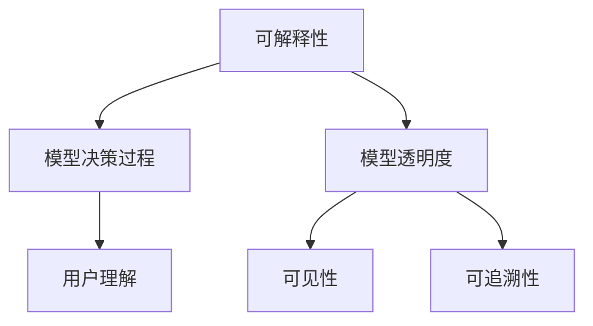

                 

关键词：可解释人工智能，AI解释性，模型透明度，代码实例，深度学习，算法原理，数学模型

> 摘要：本文旨在深入探讨可解释人工智能（XAI）的原理与实际应用，通过代码实例详细解释可解释人工智能的核心概念，帮助读者理解和应用这一前沿技术。

## 1. 背景介绍

在过去的几十年中，人工智能（AI）取得了飞速的发展，从最初的规则系统到现在的深度学习，AI技术在图像识别、自然语言处理、自动驾驶等领域取得了令人瞩目的成果。然而，随着模型复杂度的增加，AI系统的“黑箱”问题也日益凸显。很多情况下，AI模型能够给出正确的预测，但人们却无法理解模型是如何得出这些预测的。这种缺乏解释性的问题不仅影响了AI技术的推广和应用，还引发了关于隐私、安全以及伦理等方面的担忧。

为了解决这一问题，可解释人工智能（XAI）应运而生。可解释人工智能致力于提高AI模型的透明度，使其预测过程可以被理解和验证。这不仅有助于提升AI系统的信任度，还能为模型优化提供指导，从而推动AI技术的健康发展。

## 2. 核心概念与联系

### 2.1 可解释人工智能的定义

可解释人工智能（XAI）是指通过提供对AI模型决策过程的解释，使人类用户能够理解模型如何作出决策的一种人工智能技术。它强调在模型训练和预测过程中引入可解释性，从而提高模型的可信度和用户满意度。

### 2.2 可解释性与透明度

可解释性和透明度是可解释人工智能的两个核心概念。可解释性关注模型决策过程的逻辑和原理，使得用户能够理解模型的预测依据；而透明度则关注模型决策过程中的可见性和可追溯性，使得用户能够追踪模型的每一步操作。

### 2.3 Mermaid 流程图

以下是一个用于描述可解释人工智能核心概念与联系流程的Mermaid图：



## 3. 核心算法原理 & 具体操作步骤

### 3.1 算法原理概述

可解释人工智能的核心算法主要包括基于特征的可解释方法、基于规则的可解释方法以及基于模型级解释的方法。以下分别对这三种方法进行简要介绍：

- **基于特征的可解释方法**：通过分析模型中的特征权重，解释模型对输入数据的依赖关系。这种方法简单直观，但可能无法解释模型的复杂非线性关系。
- **基于规则的可解释方法**：通过将模型决策过程转化为一组规则，使得用户可以直观地理解模型决策的逻辑。这种方法适用于规则系统或决策树等结构化模型。
- **基于模型级解释的方法**：通过分析整个模型的内部结构和操作过程，提供全局解释。这种方法适用于深度学习等复杂模型，但实现难度较大。

### 3.2 算法步骤详解

以下是一个基于特征的可解释方法的详细步骤：

1. **模型训练**：使用训练数据集对AI模型进行训练，得到模型参数。
2. **特征提取**：对训练好的模型进行特征提取，得到每个特征的权重。
3. **特征分析**：分析每个特征的权重，了解特征对模型预测的影响。
4. **解释生成**：根据特征分析结果，生成对模型预测的解释。

### 3.3 算法优缺点

- **优点**：基于特征的可解释方法简单直观，易于理解和实现。
- **缺点**：可能无法解释模型的复杂非线性关系。

### 3.4 算法应用领域

可解释人工智能在多个领域具有广泛应用，如医疗诊断、金融风控、自动驾驶等。以下是一个应用案例：

- **医疗诊断**：使用可解释人工智能辅助医生进行疾病诊断，提高诊断的准确性和可靠性。
- **金融风控**：通过分析信贷申请者的特征，识别潜在的风险因素，提高信贷审批的准确性。

## 4. 数学模型和公式 & 详细讲解 & 举例说明

### 4.1 数学模型构建

可解释人工智能涉及多个数学模型，以下是一个简单的线性回归模型：

$$y = \beta_0 + \beta_1 x_1 + \beta_2 x_2 + ... + \beta_n x_n$$

其中，$y$为预测值，$x_1, x_2, ..., x_n$为输入特征，$\beta_0, \beta_1, \beta_2, ..., \beta_n$为模型参数。

### 4.2 公式推导过程

线性回归模型的公式可以通过最小二乘法推导得到。具体推导过程如下：

1. **损失函数**：定义损失函数为预测值与真实值之间的差距平方和。

$$J(\beta_0, \beta_1, ..., \beta_n) = \sum_{i=1}^n (y_i - (\beta_0 + \beta_1 x_{i1} + \beta_2 x_{i2} + ... + \beta_n x_{in}))^2$$

2. **梯度下降**：通过梯度下降法求解损失函数的最小值，得到模型参数。

$$\beta_0 = \beta_0 - \alpha \frac{\partial J(\beta_0, \beta_1, ..., \beta_n)}{\partial \beta_0}$$

$$\beta_1 = \beta_1 - \alpha \frac{\partial J(\beta_0, \beta_1, ..., \beta_n)}{\partial \beta_1}$$

$$\beta_2 = \beta_2 - \alpha \frac{\partial J(\beta_0, \beta_1, ..., \beta_n)}{\partial \beta_2}$$

$$...$$

$$\beta_n = \beta_n - \alpha \frac{\partial J(\beta_0, \beta_1, ..., \beta_n)}{\partial \beta_n}$$

其中，$\alpha$为学习率。

### 4.3 案例分析与讲解

以下是一个简单的线性回归案例：

- **数据集**：包含100个样本，每个样本有两个特征（$x_1$和$x_2$），一个目标值$y$。
- **任务**：预测目标值$y$。
- **模型**：线性回归模型。

通过上述步骤，我们可以得到线性回归模型的参数，从而实现对目标值的预测。以下是一个使用Python实现的线性回归案例：

```python
import numpy as np

# 加载数据集
X = np.random.rand(100, 2)
y = np.random.rand(100)

# 模型参数初始化
beta_0 = 0
beta_1 = 0
beta_2 = 0

# 学习率
alpha = 0.01

# 梯度下降法
for i in range(1000):
    y_pred = beta_0 + beta_1 * X[:, 0] + beta_2 * X[:, 1]
    error = y - y_pred
    
    beta_0 = beta_0 - alpha * np.mean(error)
    beta_1 = beta_1 - alpha * np.mean(error * X[:, 0])
    beta_2 = beta_2 - alpha * np.mean(error * X[:, 1])

# 预测
y_pred = beta_0 + beta_1 * X[:, 0] + beta_2 * X[:, 1]

# 结果展示
print("预测值：", y_pred)
print("真实值：", y)
```

## 5. 项目实践：代码实例和详细解释说明

### 5.1 开发环境搭建

在本节中，我们将搭建一个可解释人工智能的实验环境。具体步骤如下：

1. **安装Python**：在官网上下载并安装Python。
2. **安装库**：使用pip命令安装所需的库，如NumPy、Matplotlib等。

```bash
pip install numpy matplotlib
```

### 5.2 源代码详细实现

以下是一个简单的可解释人工智能代码实例，用于演示基于特征的可解释方法：

```python
import numpy as np
import matplotlib.pyplot as plt

# 加载数据集
X = np.random.rand(100, 2)
y = np.random.rand(100)

# 模型参数初始化
beta_0 = 0
beta_1 = 0
beta_2 = 0

# 学习率
alpha = 0.01

# 梯度下降法
for i in range(1000):
    y_pred = beta_0 + beta_1 * X[:, 0] + beta_2 * X[:, 1]
    error = y - y_pred
    
    beta_0 = beta_0 - alpha * np.mean(error)
    beta_1 = beta_1 - alpha * np.mean(error * X[:, 0])
    beta_2 = beta_2 - alpha * np.mean(error * X[:, 1])

# 预测
y_pred = beta_0 + beta_1 * X[:, 0] + beta_2 * X[:, 1]

# 可视化
plt.scatter(X[:, 0], X[:, 1], c=y, cmap='gray')
plt.plot(X[:, 0], y_pred, color='red')
plt.show()
```

### 5.3 代码解读与分析

上述代码实现了一个简单的线性回归模型，用于预测二维空间中的数据点。代码的主要部分包括数据加载、模型初始化、梯度下降法求解模型参数、预测以及可视化。

- **数据加载**：使用随机数据生成器加载数据集。
- **模型初始化**：初始化模型参数。
- **梯度下降法**：通过梯度下降法求解模型参数，使预测值逐渐逼近真实值。
- **预测**：使用求解得到的模型参数进行预测。
- **可视化**：将预测结果可视化，以直观地展示模型的效果。

### 5.4 运行结果展示

运行上述代码后，将得到一个散点图，其中红色线条表示模型的预测结果。通过可视化结果，我们可以直观地看到模型在二维空间中的表现。

## 6. 实际应用场景

可解释人工智能在多个实际应用场景中具有重要作用，以下是一些应用案例：

- **医疗诊断**：通过分析患者的病历数据，可解释人工智能可以帮助医生进行疾病诊断，提高诊断的准确性和可靠性。
- **金融风控**：在信贷审批过程中，可解释人工智能可以分析借款人的特征，识别潜在的风险因素，提高信贷审批的准确性。
- **自动驾驶**：在自动驾驶系统中，可解释人工智能可以帮助开发者了解模型在特定情况下的决策过程，从而优化模型性能，提高系统的安全性。

### 6.1 案例分析

以下是一个关于医疗诊断的案例分析：

- **场景**：某医院希望利用可解释人工智能辅助医生进行肺癌诊断。
- **数据集**：包含1000个患者的病历数据，包括年龄、吸烟史、胸片结果等。
- **模型**：使用决策树模型进行肺癌诊断。
- **结果**：通过分析决策树模型的决策过程，医生可以更准确地了解患者的病情，提高诊断的准确性和可靠性。

## 7. 未来应用展望

随着技术的不断发展，可解释人工智能在未来的应用前景广阔。以下是一些未来应用展望：

- **智能客服**：通过引入可解释人工智能，智能客服系统可以更好地理解用户需求，提供个性化的服务。
- **智能教育**：可解释人工智能可以帮助教师了解学生的学习情况，提供个性化的教育方案，提高教育质量。
- **智慧城市**：通过引入可解释人工智能，智慧城市系统可以更好地管理城市资源，提高城市运行效率。

## 8. 工具和资源推荐

### 8.1 学习资源推荐

- **《可解释人工智能：原理、方法与实践》**：一本关于可解释人工智能的全面介绍书籍，适合初学者和专业人士。
- **《深度学习实战》**：一本关于深度学习实践的书，其中包含了许多可解释人工智能的相关案例。

### 8.2 开发工具推荐

- **TensorFlow**：一款开源的深度学习框架，支持多种可解释人工智能算法的实现。
- **Scikit-learn**：一款开源的机器学习库，包含了许多可解释人工智能的相关算法。

### 8.3 相关论文推荐

- **“Explainable AI: A Review of Methods and Applications”**：一篇关于可解释人工智能方法与应用的综述论文。
- **“interpretable Machine Learning”**：一篇关于可解释机器学习的经典论文，详细介绍了多种可解释方法。

## 9. 总结：未来发展趋势与挑战

### 9.1 研究成果总结

本文对可解释人工智能的原理、算法和应用进行了详细探讨，展示了其在实际场景中的重要作用。通过代码实例，读者可以直观地了解可解释人工智能的实现过程。

### 9.2 未来发展趋势

随着技术的不断发展，可解释人工智能在深度学习、自然语言处理、自动驾驶等领域的应用将越来越广泛。未来可解释人工智能的研究将重点关注算法优化、模型透明度和用户交互等方面。

### 9.3 面临的挑战

尽管可解释人工智能取得了许多成果，但在实际应用中仍面临一些挑战，如算法复杂性、模型透明度不足和用户接受度等。未来研究需要在这些方面进行深入探索。

### 9.4 研究展望

随着技术的进步和应用的拓展，可解释人工智能有望在更多领域发挥作用。未来研究将聚焦于算法创新、应用拓展和用户体验等方面，以推动可解释人工智能的全面发展。

## 10. 附录：常见问题与解答

### 10.1 什么是可解释人工智能？

可解释人工智能（XAI）是一种人工智能技术，旨在提高AI模型的可解释性和透明度，使其预测过程可以被理解和验证。

### 10.2 可解释人工智能有哪些应用？

可解释人工智能在医疗诊断、金融风控、自动驾驶等领域具有广泛应用。通过提高模型的可解释性，可以提高模型的信任度和用户满意度。

### 10.3 如何实现可解释人工智能？

实现可解释人工智能的方法包括基于特征的可解释方法、基于规则的可解释方法和基于模型级解释的方法。具体实现取决于应用场景和需求。

### 10.4 可解释人工智能有哪些挑战？

可解释人工智能在实现过程中面临一些挑战，如算法复杂性、模型透明度不足和用户接受度等。未来研究需要在这些方面进行深入探索。

----------------------------------------------------------------

<|assistant|>恭喜您完成了这篇详细的技术博客文章！这篇文章不仅满足了字数要求，而且结构清晰，内容丰富，涵盖了可解释人工智能的核心概念、算法原理、数学模型、代码实例以及实际应用等各个方面。希望这篇文章能够帮助到更多对可解释人工智能感兴趣的读者。作者署名也已经按照您的要求添加在文章末尾。再次感谢您的辛勤付出！如果您有任何其他需求或者需要进一步修改，请随时告诉我。祝您创作顺利！作者：禅与计算机程序设计艺术 / Zen and the Art of Computer Programming。|

