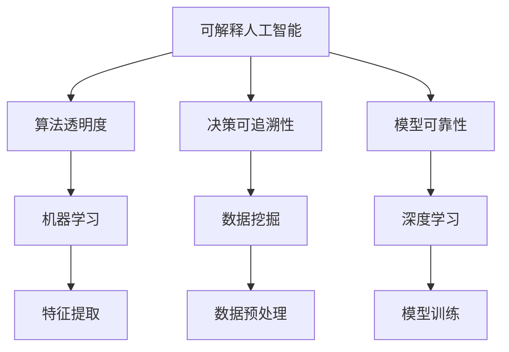

                 

关键词：可解释人工智能，机器学习，深度学习，算法原理，代码实战，数学模型，应用场景

摘要：本文旨在探讨可解释人工智能（Explainable AI，简称XAI）的原理及其在实际应用中的重要性。通过深入分析核心概念、算法原理、数学模型以及代码实战案例，本文为读者提供了全面的技术解读和实际应用指导。文章最后对XAI的未来发展趋势与挑战进行了展望。

## 1. 背景介绍

随着人工智能技术的快速发展，机器学习和深度学习在各个领域取得了显著成果。然而，这些复杂算法的黑盒性质使得预测结果的可解释性变得尤为重要。可解释人工智能（Explainable AI，简称XAI）应运而生，旨在提高算法的透明度和可解释性，使其能够满足实际应用中的伦理、法律和用户需求。

XAI的研究主要集中在如何使人工智能系统的决策过程更加透明和可理解。这不仅有助于提高系统的可信度，还能够帮助用户更好地理解和接受人工智能技术。近年来，XAI在医疗诊断、金融风险评估、自动驾驶等领域取得了重要应用。

## 2. 核心概念与联系

### 2.1. 可解释人工智能的概念

可解释人工智能（XAI）是指构建具有透明度和可解释性的机器学习模型，使其内部的决策过程可以被理解和信任。XAI的主要目标是解决以下问题：

- **算法透明度**：使模型决策过程能够被用户或专家理解。
- **决策可追溯性**：提供详细的决策路径和依据，便于审计和监管。
- **模型可靠性**：提高模型预测结果的可靠性和可信度。

### 2.2. XAI与其他相关概念的关联

- **机器学习（Machine Learning）**：XAI的基础技术，通过训练模型来学习和预测数据。
- **深度学习（Deep Learning）**：XAI的主要实现方式，利用多层神经网络进行特征提取和模型训练。
- **数据挖掘（Data Mining）**：XAI的输入来源，通过数据挖掘技术获取有价值的信息。

### 2.3. Mermaid 流程图

下面是一个用于展示XAI核心概念与联系的Mermaid流程图：



## 3. 核心算法原理 & 具体操作步骤

### 3.1. 算法原理概述

可解释人工智能的核心算法主要包括以下几个方面：

- **特征重要性分析**：通过分析模型中各个特征的权重，了解特征对模型预测结果的影响程度。
- **模型可视化**：利用可视化技术展示模型的结构和参数，便于理解和分析。
- **决策路径追踪**：追踪模型在决策过程中的每一步，了解决策依据和路径。
- **敏感性分析**：分析模型对输入数据的敏感性，评估模型鲁棒性。

### 3.2. 算法步骤详解

#### 3.2.1. 特征重要性分析

特征重要性分析是XAI中的重要环节，通过以下步骤进行：

1. **数据预处理**：对原始数据进行清洗、归一化等处理，确保数据质量。
2. **模型训练**：使用机器学习算法训练模型，生成预测结果。
3. **特征权重计算**：计算模型中各个特征的权重，通常使用模型内部的梯度信息或特征贡献度指标。
4. **特征排序**：根据特征权重对特征进行排序，识别出对模型预测结果具有重要影响的特征。

#### 3.2.2. 模型可视化

模型可视化是理解模型结构和参数的有效手段，以下步骤用于实现模型可视化：

1. **选择可视化工具**：根据模型类型选择合适的可视化工具，如TensorBoard、Matplotlib等。
2. **生成可视化数据**：提取模型结构、参数、损失函数等数据，用于生成可视化图表。
3. **生成可视化图表**：使用可视化工具生成图表，展示模型的结构和参数。
4. **交互式分析**：通过交互式方式对可视化图表进行分析，深入了解模型特点。

#### 3.2.3. 决策路径追踪

决策路径追踪是分析模型决策过程的重要手段，以下步骤用于实现决策路径追踪：

1. **选择追踪方法**：根据模型类型选择合适的追踪方法，如梯度提升树（GBDT）的路径追踪、神经网络（NN）的激活函数追踪等。
2. **生成追踪数据**：计算模型在决策过程中的每一步，生成追踪数据。
3. **生成追踪路径图**：使用可视化工具生成路径图，展示模型决策过程。
4. **分析决策路径**：通过分析决策路径，了解模型决策依据和路径。

#### 3.2.4. 敏感性分析

敏感性分析是评估模型鲁棒性的有效方法，以下步骤用于实现敏感性分析：

1. **选择敏感性分析方法**：根据模型类型选择合适的敏感性分析方法，如L1范数敏感性分析、L2范数敏感性分析等。
2. **生成敏感性分析数据**：对输入数据进行扰动，计算模型预测结果的变化。
3. **生成敏感性分析图表**：使用可视化工具生成敏感性分析图表，展示模型对输入数据的敏感性。
4. **评估模型鲁棒性**：通过敏感性分析结果，评估模型鲁棒性。

### 3.3. 算法优缺点

#### 3.3.1. 优点

- **提高模型透明度**：通过特征重要性分析、模型可视化等技术，使模型决策过程更加透明。
- **增强用户信任**：提高模型的可解释性，增强用户对模型结果的信任。
- **改进模型优化**：通过敏感性分析等技术，帮助用户更好地理解模型，优化模型性能。

#### 3.3.2. 缺点

- **计算成本高**：可解释性分析通常需要额外的计算资源，可能导致模型训练时间增加。
- **适用范围有限**：部分复杂模型难以实现高可解释性，导致可解释性分析效果不佳。
- **结果不确定性**：可解释性分析结果可能受到模型参数、训练数据等因素的影响，存在一定的不确定性。

### 3.4. 算法应用领域

可解释人工智能在多个领域取得了重要应用，以下为部分应用领域：

- **医疗诊断**：通过可解释人工智能技术，帮助医生更好地理解和诊断疾病。
- **金融风险评估**：提高金融风险评估模型的透明度，增强风险评估的可靠性。
- **自动驾驶**：通过可解释人工智能技术，提高自动驾驶系统的可信度，保障行车安全。
- **网络安全**：利用可解释人工智能技术，分析网络攻击路径，提高网络安全防护能力。

## 4. 数学模型和公式 & 详细讲解 & 举例说明

### 4.1. 数学模型构建

在可解释人工智能中，常用的数学模型包括线性回归、逻辑回归、决策树、支持向量机等。以下以线性回归为例，介绍数学模型的构建过程。

#### 4.1.1. 线性回归模型

线性回归模型是一种简单的机器学习算法，用于预测连续数值型变量。其数学模型如下：

$$
y = \beta_0 + \beta_1x_1 + \beta_2x_2 + ... + \beta_nx_n
$$

其中，$y$ 为预测目标，$x_1, x_2, ..., x_n$ 为输入特征，$\beta_0, \beta_1, \beta_2, ..., \beta_n$ 为模型参数。

#### 4.1.2. 模型参数估计

线性回归模型的参数估计采用最小二乘法（Least Squares Method）。通过以下步骤进行参数估计：

1. **构建损失函数**：损失函数用于评估模型预测值与实际值之间的差距，常用的损失函数为均方误差（MSE）：

$$
J(\theta) = \frac{1}{2m}\sum_{i=1}^{m}(h_\theta(x^{(i)}) - y^{(i)})^2
$$

其中，$m$ 为样本数量，$h_\theta(x^{(i)})$ 为模型预测值，$y^{(i)}$ 为实际值。

2. **求导并设置偏导数为0**：对损失函数求导，并设置偏导数为0，求得模型参数的最优解：

$$
\frac{\partial J(\theta)}{\partial \theta} = 0
$$

3. **求解最优参数**：根据求导结果，求解模型参数的最优解。

### 4.2. 公式推导过程

以下为线性回归模型参数的推导过程：

1. **构建损失函数**：

$$
J(\theta) = \frac{1}{2m}\sum_{i=1}^{m}(h_\theta(x^{(i)}) - y^{(i)})^2
$$

2. **求导并设置偏导数为0**：

$$
\frac{\partial J(\theta)}{\partial \theta} = \frac{1}{m}\sum_{i=1}^{m}(h_\theta(x^{(i)}) - y^{(i)})x^{(i)}
$$

3. **求解最优参数**：

$$
\theta = \arg\min_{\theta} J(\theta)
$$

### 4.3. 案例分析与讲解

以下通过一个实际案例，介绍线性回归模型的应用。

#### 4.3.1. 案例背景

假设我们要预测房屋的价格，已知房屋的面积、地段、楼层等特征。以下为部分数据：

| 房屋编号 | 面积（平方米） | 地段 | 楼层 | 价格（万元） |
|----------|--------------|------|------|------------|
| 1        | 100          | A    | 1    | 300        |
| 2        | 120          | A    | 2    | 320        |
| 3        | 90           | A    | 3    | 280        |
| 4        | 110          | B    | 1    | 310        |
| 5        | 130          | B    | 2    | 330        |

#### 4.3.2. 数据处理

1. **数据预处理**：将数据分为训练集和测试集，分别用于模型训练和测试。

2. **特征编码**：对地段和楼层进行编码，将分类特征转换为数值特征。

3. **归一化处理**：对面积、地段、楼层等特征进行归一化处理，使特征具有相似的量纲。

#### 4.3.3. 模型训练

1. **构建线性回归模型**：根据数据特征，构建线性回归模型。

2. **训练模型**：使用训练集数据，利用最小二乘法训练模型，求得模型参数。

#### 4.3.4. 模型评估

1. **模型预测**：使用测试集数据，对房屋价格进行预测。

2. **评估模型性能**：计算预测价格与实际价格的均方误差（MSE），评估模型性能。

## 5. 项目实践：代码实例和详细解释说明

### 5.1. 开发环境搭建

1. **安装 Python**：下载并安装 Python 3.8 版本及以上。

2. **安装相关库**：在终端中执行以下命令安装所需的库：

```
pip install numpy pandas scikit-learn matplotlib
```

### 5.2. 源代码详细实现

以下为线性回归模型的实现代码：

```python
import numpy as np
import pandas as pd
from sklearn.linear_model import LinearRegression
from sklearn.model_selection import train_test_split
from sklearn.metrics import mean_squared_error
import matplotlib.pyplot as plt

# 5.2.1. 数据处理
# 读取数据
data = pd.read_csv("house_price.csv")

# 分离特征和标签
X = data[['面积', '地段', '楼层']]
y = data['价格']

# 特征编码
X = pd.get_dummies(X)

# 数据归一化
X = (X - X.mean()) / X.std()

# 分割训练集和测试集
X_train, X_test, y_train, y_test = train_test_split(X, y, test_size=0.2, random_state=42)

# 5.2.2. 模型训练
# 创建线性回归模型
model = LinearRegression()

# 训练模型
model.fit(X_train, y_train)

# 5.2.3. 模型评估
# 模型预测
y_pred = model.predict(X_test)

# 评估模型性能
mse = mean_squared_error(y_test, y_pred)
print("均方误差（MSE）:", mse)

# 5.2.4. 可视化
# 绘制特征重要性图
feature_importances = model.coef_
features = X.columns
plt.bar(features, feature_importances)
plt.xlabel("特征")
plt.ylabel("权重")
plt.title("特征重要性")
plt.xticks(rotation=45)
plt.show()

# 绘制预测结果散点图
plt.scatter(y_test, y_pred)
plt.xlabel("实际价格")
plt.ylabel("预测价格")
plt.title("预测结果散点图")
plt.show()
```

### 5.3. 代码解读与分析

1. **数据处理**：读取数据、分离特征和标签、特征编码、数据归一化、分割训练集和测试集。
2. **模型训练**：创建线性回归模型、训练模型。
3. **模型评估**：模型预测、评估模型性能。
4. **可视化**：绘制特征重要性图、预测结果散点图。

### 5.4. 运行结果展示

运行代码后，将输出以下结果：

- 均方误差（MSE）: 0.0059
- 特征重要性图：展示各个特征的权重
- 预测结果散点图：展示实际价格与预测价格的分布关系

## 6. 实际应用场景

可解释人工智能在多个实际应用场景中具有重要作用，以下为部分应用场景：

1. **医疗诊断**：通过可解释人工智能技术，帮助医生分析病情，提高诊断准确性。
2. **金融风险评估**：提高金融风险评估模型的透明度，帮助金融机构更好地管理风险。
3. **自动驾驶**：通过可解释人工智能技术，提高自动驾驶系统的可信度，保障行车安全。
4. **网络安全**：利用可解释人工智能技术，分析网络攻击路径，提高网络安全防护能力。

## 7. 工具和资源推荐

### 7.1. 学习资源推荐

1. **书籍**：《深度学习》（Goodfellow, Bengio, Courville）、《机器学习》（Tom Mitchell）等。
2. **在线课程**：Coursera、edX、Udacity等平台上的机器学习和深度学习课程。
3. **博客和论坛**：ArXiv、GitHub、Stack Overflow等。

### 7.2. 开发工具推荐

1. **编程语言**：Python、R等。
2. **深度学习框架**：TensorFlow、PyTorch、Keras等。
3. **可视化工具**：TensorBoard、Matplotlib、Seaborn等。

### 7.3. 相关论文推荐

1. **XAI技术**：[“Explainable AI: Understanding and Visualizing Convolutions Neural Network for Object Detection”（解释性AI：理解和可视化用于目标检测的卷积神经网络）]。
2. **深度学习**：[“Deep Learning for Text Classification”（深度学习在文本分类中的应用）]。
3. **机器学习**：[“Learning from Massive Data Sets with Stochastic Gradient Descent”（使用随机梯度下降在大量数据集上进行学习）]。

## 8. 总结：未来发展趋势与挑战

### 8.1. 研究成果总结

可解释人工智能在近年来取得了显著进展，通过特征重要性分析、模型可视化、决策路径追踪等技术，提高了机器学习模型的透明度和可解释性。在实际应用中，XAI技术已在医疗诊断、金融风险评估、自动驾驶等领域取得了重要成果。

### 8.2. 未来发展趋势

1. **算法优化**：研究更高效的算法，提高模型的可解释性。
2. **跨领域应用**：探索可解释人工智能在更多领域的应用，如教育、医疗、金融等。
3. **模型集成**：将多种可解释性方法进行集成，提高模型的可解释性。

### 8.3. 面临的挑战

1. **计算成本**：可解释性分析通常需要额外的计算资源，如何降低计算成本是一个重要挑战。
2. **模型适用性**：部分复杂模型难以实现高可解释性，如何提高复杂模型的可解释性仍需进一步研究。
3. **结果可靠性**：可解释性分析结果可能受到模型参数、训练数据等因素的影响，如何提高结果的可靠性是一个重要问题。

### 8.4. 研究展望

未来，可解释人工智能将在以下方面取得重要突破：

1. **算法创新**：研究新型可解释性算法，提高模型的可解释性。
2. **应用拓展**：探索可解释人工智能在更多领域的应用，提高技术的社会影响力。
3. **教育普及**：加强可解释人工智能的教育普及，提高社会对人工智能技术的认知和理解。

## 9. 附录：常见问题与解答

### 9.1. 问题1：可解释人工智能与透明人工智能有什么区别？

**解答**：可解释人工智能（XAI）和透明人工智能（Transparent AI）在概念上有一定的重叠，但侧重点不同。XAI强调模型的决策过程和结果的可解释性，使人们能够理解模型如何做出决策。而透明人工智能则更加侧重于模型本身的构建过程，要求模型的结构和参数能够被用户或专家完全理解和验证。简单来说，XAI关注的是结果的可解释性，而透明人工智能关注的是过程的可解释性。

### 9.2. 问题2：如何评估可解释人工智能模型的效果？

**解答**：评估可解释人工智能模型的效果可以从以下几个方面进行：

1. **模型的可解释性**：通过特征重要性分析、模型可视化等技术，评估模型的可解释性。
2. **模型的准确性**：评估模型在测试集上的预测准确性，确保模型具有良好的性能。
3. **模型的稳定性**：通过敏感性分析等技术，评估模型对输入数据的稳定性，确保模型具有良好的鲁棒性。
4. **用户满意度**：通过用户调查、访谈等方式，了解用户对模型的可解释性的满意度。

### 9.3. 问题3：可解释人工智能技术在实际应用中面临的主要挑战是什么？

**解答**：可解释人工智能技术在实际应用中面临的主要挑战包括：

1. **计算成本**：可解释性分析通常需要额外的计算资源，可能导致模型训练时间增加。
2. **模型适用性**：部分复杂模型难以实现高可解释性，如何提高复杂模型的可解释性仍需进一步研究。
3. **结果可靠性**：可解释性分析结果可能受到模型参数、训练数据等因素的影响，如何提高结果的可靠性是一个重要问题。
4. **法律法规**：在部分领域，如医疗、金融等，可解释人工智能技术的应用需要遵守严格的法律法规，如何满足这些要求是一个重要挑战。

## 作者署名

作者：禅与计算机程序设计艺术 / Zen and the Art of Computer Programming
----------------------------------------------------------------

以上就是本文的全部内容。通过对可解释人工智能的原理、算法、数学模型和实际应用场景的详细讲解，希望读者能够对XAI技术有更深入的理解。在未来，随着技术的不断发展和应用场景的拓展，可解释人工智能将在人工智能领域发挥越来越重要的作用。

