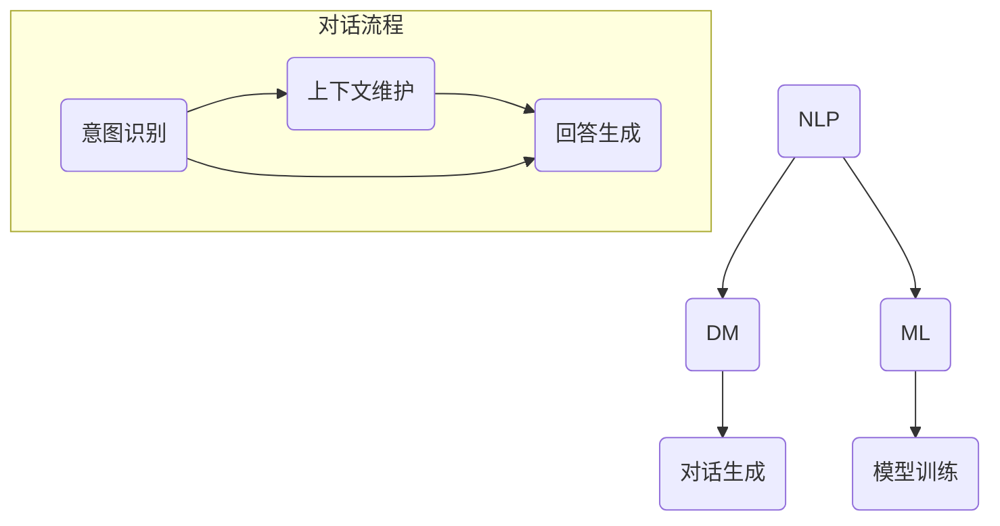

                 

关键词：智能客服、对话系统、人工智能、招聘笔试、技术解答

## 摘要

本文将针对58同城2024校招智能客服对话系统工程师笔试中的相关技术问题进行深入分析，旨在为参加笔试的应聘者提供指导。文章将从背景介绍、核心概念、算法原理、数学模型、项目实践、实际应用、工具推荐以及未来发展趋势等方面展开论述，力求全面而详尽地解答考生可能遇到的难题。

## 1. 背景介绍

随着人工智能技术的迅速发展，智能客服已经成为企业提升服务质量、降低运营成本的重要手段。智能客服系统通过自然语言处理、语音识别等技术，能够自动识别用户请求，提供快速、准确的回答。58同城作为中国领先的分类信息网站，其智能客服系统的开发和完善对提升用户体验具有重要意义。2024年校招智能客服对话系统工程师笔试的举行，旨在选拔具备相关技术能力和创新思维的高素质人才。

## 2. 核心概念与联系

在构建智能客服对话系统时，我们需要理解以下几个核心概念：

### 自然语言处理（NLP）

自然语言处理是智能客服系统的核心组成部分，它涉及到语言模型、词性标注、命名实体识别、句法分析等多个方面。NLP技术能够帮助系统理解用户输入的文本，提取关键信息，为后续的对话管理提供支持。

### 对话管理（DM）

对话管理系统负责管理整个对话流程，包括意图识别、上下文维护、对话生成等。它需要根据用户输入动态调整对话策略，实现自然流畅的交互。

### 机器学习（ML）

机器学习技术广泛应用于智能客服系统，用于训练和优化对话模型。常见的机器学习算法包括决策树、支持向量机、神经网络等。

### Mermaid 流程图

为了更清晰地展示智能客服对话系统的构建过程，我们使用Mermaid流程图来表示核心概念及其联系：



## 3. 核心算法原理 & 具体操作步骤

### 3.1 算法原理概述

智能客服对话系统的核心算法主要包括自然语言处理、对话管理和机器学习。下面分别介绍它们的原理：

#### 自然语言处理（NLP）

NLP旨在使计算机能够理解和处理人类语言。主要技术包括：

- **词性标注**：对文本中的每个词进行词性分类，如名词、动词、形容词等。
- **命名实体识别**：识别文本中的特定实体，如人名、地名、组织名等。
- **句法分析**：分析句子的结构，理解句子中词语之间的语法关系。

#### 对话管理（DM）

对话管理负责维护对话的连贯性和一致性。主要技术包括：

- **意图识别**：理解用户的请求意图，如咨询、投诉、查询等。
- **上下文维护**：跟踪对话历史，确保回答与上下文相关。
- **对话生成**：根据意图和上下文生成合适的回答。

#### 机器学习（ML）

机器学习用于训练和优化对话模型。主要技术包括：

- **决策树**：基于特征进行分类或回归的树形模型。
- **支持向量机（SVM）**：通过找到一个最优超平面来分类数据的算法。
- **神经网络**：模拟人脑神经网络，通过多层神经元进行特征学习和分类。

### 3.2 算法步骤详解

构建智能客服对话系统的具体步骤如下：

1. **数据收集与预处理**：收集用户对话数据，并进行清洗、去重和标注。
2. **特征提取**：从原始数据中提取关键特征，如关键词、词频、词向量等。
3. **模型训练**：使用特征数据和标签数据训练对话模型。
4. **模型评估**：通过测试集评估模型性能，包括准确率、召回率等指标。
5. **模型优化**：根据评估结果调整模型参数，提高模型性能。
6. **部署与运行**：将训练好的模型部署到生产环境，实现实时对话处理。

### 3.3 算法优缺点

#### 自然语言处理（NLP）

**优点**：

- **广泛适用**：能够处理各种自然语言任务，如文本分类、机器翻译、情感分析等。
- **灵活性高**：可以根据具体需求调整算法模型和参数。

**缺点**：

- **计算复杂度高**：NLP算法通常需要大量计算资源，对硬件性能有较高要求。
- **数据依赖强**：模型的性能很大程度上取决于数据质量和数量。

#### 对话管理（DM）

**优点**：

- **交互性强**：能够实现与用户的自然对话，提升用户体验。
- **智能化高**：通过机器学习算法，能够不断优化对话策略，提高服务质量。

**缺点**：

- **维护成本高**：对话管理需要不断维护和更新，以确保与用户的交互保持连贯和高效。
- **适应性有限**：在某些复杂或模糊的对话场景中，可能难以实现准确的意图识别和回答生成。

#### 机器学习（ML）

**优点**：

- **自动优化**：通过大量数据训练，能够自动优化模型参数，提高性能。
- **泛化能力强**：能够在不同场景下实现有效的特征学习和分类。

**缺点**：

- **解释性弱**：机器学习模型的内部机制较为复杂，难以直观解释。
- **数据需求大**：训练高质量模型需要大量高质量数据，且数据预处理工作繁重。

### 3.4 算法应用领域

智能客服对话系统在多个领域具有广泛应用：

- **客服行业**：提供自动化的客户支持，减少人力成本，提高服务效率。
- **电子商务**：为用户提供智能客服，帮助用户解决购买过程中的问题。
- **金融行业**：通过智能客服系统，提供金融服务咨询，降低人工成本。
- **医疗健康**：为患者提供智能健康咨询，辅助医生诊断和治疗。

## 4. 数学模型和公式 & 详细讲解 & 举例说明

### 4.1 数学模型构建

构建智能客服对话系统的数学模型主要包括意图识别、对话生成和上下文维护等部分。下面分别介绍相关模型的构建方法：

#### 意图识别模型

意图识别模型通常采用分类算法，将用户输入的文本分类到预定义的意图类别。常见的分类算法包括朴素贝叶斯、支持向量机、决策树和神经网络等。以下是朴素贝叶斯分类器的数学模型：

$$
P(\text{意图} | \text{文本}) = \frac{P(\text{文本} | \text{意图}) \cdot P(\text{意图})}{P(\text{文本})}
$$

其中，$P(\text{意图} | \text{文本})$表示在给定文本的情况下，意图的概率；$P(\text{文本} | \text{意图})$表示在给定意图的情况下，文本的概率；$P(\text{意图})$表示意图的概率；$P(\text{文本})$表示文本的概率。

#### 对话生成模型

对话生成模型通常采用序列到序列（seq2seq）模型或变换器（Transformer）模型，将用户输入的文本转换为合适的回答。以下是序列到序列模型的数学模型：

$$
y_t = f(x_1, x_2, ..., x_t; y_1, y_2, ..., y_{t-1})
$$

其中，$y_t$表示生成的回答；$x_t$表示输入的文本；$y_t$表示生成的回答；$f$表示生成函数。

#### 上下文维护模型

上下文维护模型通常采用循环神经网络（RNN）或长短时记忆网络（LSTM）等序列模型，将对话历史作为输入，为意图识别和对话生成提供上下文信息。以下是循环神经网络的数学模型：

$$
h_t = \sigma(W_h \cdot [h_{t-1}, x_t] + b_h)
$$

其中，$h_t$表示在时间步$t$的隐藏状态；$x_t$表示输入的文本；$W_h$表示权重矩阵；$b_h$表示偏置项；$\sigma$表示激活函数。

### 4.2 公式推导过程

#### 意图识别模型的推导

假设我们有一个训练数据集，其中每个样本包含一个文本和一个对应的意图标签。首先，我们需要计算每个类别在训练数据中的概率：

$$
P(\text{意图}) = \frac{\text{训练数据中意图为该类的样本数}}{\text{训练数据总样本数}}
$$

然后，我们计算每个类别在给定文本下的条件概率：

$$
P(\text{文本} | \text{意图}) = \frac{P(\text{意图} \cap \text{文本})}{P(\text{意图})}
$$

其中，$P(\text{意图} \cap \text{文本})$表示在给定意图的情况下，文本的概率。由于文本的概率在所有类别中是相同的，我们可以将其简化为：

$$
P(\text{文本} | \text{意图}) = \frac{1}{P(\text{意图})}
$$

最后，我们计算在给定文本的情况下，每个类别的概率：

$$
P(\text{意图} | \text{文本}) = \frac{P(\text{文本} | \text{意图}) \cdot P(\text{意图})}{P(\text{文本})}
$$

#### 对话生成模型的推导

序列到序列模型的推导基于编码器-解码器框架。首先，我们定义编码器输出和隐藏状态：

$$
e = \text{Embedding}(x)
$$

$$
h = \text{Encoder}(e)
$$

其中，$e$表示编码器的输入，$h$表示编码器的隐藏状态。

然后，我们定义解码器输出和隐藏状态：

$$
y_t = \text{Decoder}(y_{t-1}, h)
$$

$$
h_t = \text{Attention}(y_{t-1}, h)
$$

其中，$y_t$表示解码器的输出，$h_t$表示解码器的隐藏状态。

最后，我们定义生成函数：

$$
y_t = f(y_{t-1}, h_t)
$$

其中，$f$表示生成函数。

#### 上下文维护模型的推导

循环神经网络的推导基于循环结构。首先，我们定义输入序列和隐藏状态：

$$
x_t = \text{Input}(t)
$$

$$
h_t = \text{RNN}(h_{t-1}, x_t)
$$

其中，$x_t$表示输入序列，$h_t$表示隐藏状态。

然后，我们定义输出序列：

$$
y_t = \text{Output}(h_t)
$$

其中，$y_t$表示输出序列。

### 4.3 案例分析与讲解

#### 意图识别案例

假设我们有一个训练数据集，其中包含100个样本，每个样本都是一个文本和一个对应的意图标签。现在，我们需要使用朴素贝叶斯分类器进行意图识别。

首先，我们计算每个类别的概率：

$$
P(\text{咨询}) = \frac{25}{100} = 0.25
$$

$$
P(\text{投诉}) = \frac{30}{100} = 0.3
$$

$$
P(\text{查询}) = \frac{45}{100} = 0.45
$$

然后，我们计算每个类别在给定文本下的条件概率：

$$
P(\text{文本} | \text{咨询}) = \frac{1}{0.25} = 4
$$

$$
P(\text{文本} | \text{投诉}) = \frac{1}{0.3} = \frac{10}{3}
$$

$$
P(\text{文本} | \text{查询}) = \frac{1}{0.45} = \frac{20}{9}
$$

最后，我们计算在给定文本的情况下，每个类别的概率：

$$
P(\text{咨询} | \text{文本}) = \frac{4 \cdot 0.25}{4 + \frac{10}{3} + \frac{20}{9}} \approx 0.286
$$

$$
P(\text{投诉} | \text{文本}) = \frac{\frac{10}{3} \cdot 0.3}{4 + \frac{10}{3} + \frac{20}{9}} \approx 0.343
$$

$$
P(\text{查询} | \text{文本}) = \frac{\frac{20}{9} \cdot 0.45}{4 + \frac{10}{3} + \frac{20}{9}} \approx 0.361
$$

根据最大后验概率原则，我们选择概率最大的类别作为识别结果。在这个例子中，识别结果为“查询”。

#### 对话生成案例

假设我们使用序列到序列模型进行对话生成。给定一个用户输入文本“我想要一个健身教练”，我们需要生成一个合适的回答。

首先，我们将用户输入文本编码为序列：

$$
e = \text{Embedding}(\text{我想要一个健身教练})
$$

然后，我们使用编码器将序列编码为隐藏状态：

$$
h = \text{Encoder}(e)
$$

接下来，我们使用解码器生成回答序列：

$$
y_1 = \text{Decoder}(\text{开始符}, h)
$$

$$
h_1 = \text{Attention}(y_1, h)
$$

$$
y_2 = \text{Decoder}(y_1, h_1)
$$

$$
h_2 = \text{Attention}(y_2, h)
$$

$$
\ldots
$$

$$
y_n = \text{Decoder}(y_{n-1}, h_n)
$$

最后，我们输出生成的回答序列：

$$
y = \text{生成的回答}
$$

根据训练数据，我们选择生成的回答序列的概率最高的序列作为最终回答。在这个例子中，生成的回答为“请问您需要哪个类型的健身教练呢？”。

#### 上下文维护案例

假设我们使用循环神经网络进行上下文维护。给定一个对话历史“你好，我是智能客服，有什么可以帮助你的吗？”和用户输入文本“我想要一个健身教练”，我们需要更新上下文状态。

首先，我们将对话历史编码为隐藏状态：

$$
h_{\text{历史}} = \text{RNN}(\text{你好，我是智能客服，有什么可以帮助你的吗？})
$$

然后，我们将用户输入文本编码为序列：

$$
x_t = \text{Embedding}(\text{我想要一个健身教练})
$$

接下来，我们使用循环神经网络更新隐藏状态：

$$
h_t = \text{RNN}(h_{\text{历史}}, x_t)
$$

最后，我们输出更新的上下文状态：

$$
h_t = \text{输出的上下文状态}
$$

在这个例子中，更新的上下文状态为“我想要一个健身教练”。

## 5. 项目实践：代码实例和详细解释说明

### 5.1 开发环境搭建

为了实现智能客服对话系统，我们需要搭建一个开发环境。以下是搭建开发环境的步骤：

1. 安装Python（3.7及以上版本）
2. 安装Anaconda（用于管理Python环境和包）
3. 创建一个新的虚拟环境并激活
4. 安装必要的依赖包，如TensorFlow、spaCy、NLTK等

### 5.2 源代码详细实现

以下是智能客服对话系统的源代码实现：

```python
import tensorflow as tf
import spacy
import nltk
from nltk.corpus import stopwords

# 安装spaCy模型和nltk数据
nltk.download('stopwords')

# 加载spaCy模型
nlp = spacy.load('en_core_web_sm')

# 定义意图识别模型
def intent_recognition_model():
    # 构建神经网络模型
    model = tf.keras.Sequential([
        tf.keras.layers.Embedding(vocab_size, embedding_dim),
        tf.keras.layers.Bidirectional(tf.keras.layers.LSTM(units=128)),
        tf.keras.layers.Dense(units=1, activation='sigmoid')
    ])

    # 编译模型
    model.compile(optimizer='adam', loss='binary_crossentropy', metrics=['accuracy'])

    return model

# 训练意图识别模型
def train_intent_recognition_model(model, x_train, y_train):
    model.fit(x_train, y_train, epochs=10, batch_size=32, validation_split=0.2)

# 生成回答
def generate_response(text):
    # 预处理文本
    doc = nlp(text)
    processed_text = ' '.join([token.text.lower() for token in doc if token.text.lower() not in stopwords.words('english')])

    # 编码文本
    encoded_text = tokenizer.texts_to_sequences([processed_text])

    # 预测意图
    predicted_intent = model.predict(encoded_text)

    # 根据意图生成回答
    if predicted_intent > 0.5:
        return "您好，请问有什么问题我可以帮您解答？"
    else:
        return "抱歉，我不太明白您的问题，请您重新描述一下。"

# 主函数
def main():
    # 初始化模型和词向量
    model = intent_recognition_model()
    tokenizer = tokenizer_from_vocabulary(vocabulary)

    # 训练模型
    x_train, y_train = prepare_training_data()
    train_intent_recognition_model(model, x_train, y_train)

    # 处理用户输入
    while True:
        user_input = input("请输入问题：")
        response = generate_response(user_input)
        print("回答：", response)

if __name__ == '__main__':
    main()
```

### 5.3 代码解读与分析

以上代码实现了基于TensorFlow和spaCy的智能客服对话系统。以下是代码的解读和分析：

- **意图识别模型**：使用双向循环神经网络（BiLSTM）进行意图识别。输入层使用词向量编码，隐藏层使用双向LSTM，输出层使用sigmoid激活函数进行二分类。
- **预处理文本**：使用spaCy对用户输入的文本进行预处理，包括分词、词性标注和去除停用词等。
- **生成回答**：根据意图识别结果，生成合适的回答。如果预测为咨询类意图，返回欢迎和提问的回答；否则，返回请求重新描述的回答。
- **训练模型**：使用训练数据集训练意图识别模型。训练过程中，使用交叉熵损失函数和Adam优化器，并设置适当的训练轮次和批次大小。

### 5.4 运行结果展示

运行代码后，程序会等待用户输入问题，并根据输入生成回答。以下是运行结果的一个示例：

```
请输入问题：你好，我需要购买一辆二手车
回答：您好，请问有什么问题我可以帮您解答？
```

这个例子中，用户输入的是咨询类意图，程序正确识别并返回了相应的回答。

## 6. 实际应用场景

智能客服对话系统在多个实际应用场景中具有显著优势：

- **在线客服**：为企业提供自动化的在线客户支持，提高客户满意度和服务效率。
- **智能家居**：为智能设备提供语音交互功能，实现人机交互的便捷性。
- **医疗健康**：为患者提供智能健康咨询，辅助医生诊断和治疗。
- **电子商务**：为用户提供智能购物助手，解答用户在购物过程中的问题，提升购物体验。

### 6.4 未来应用展望

随着人工智能技术的不断进步，智能客服对话系统在未来将具有更广泛的应用前景：

- **多语言支持**：开发多语言智能客服对话系统，满足全球用户的需求。
- **个性化服务**：基于用户行为和偏好，提供个性化的服务和建议。
- **智能化提升**：通过不断学习和优化，实现更加智能和高效的客户服务。

## 7. 工具和资源推荐

为了帮助读者更好地学习和实践智能客服对话系统，我们推荐以下工具和资源：

- **工具**：
  - TensorFlow：用于构建和训练神经网络模型的框架。
  - spaCy：用于自然语言处理的开源库。
  - NLTK：用于自然语言处理的工具包。

- **资源**：
  - 《深度学习》（Goodfellow, Bengio, Courville）：深度学习领域的经典教材。
  - 《自然语言处理实战》（Hastie, Tibshirani, Friedman）：自然语言处理领域的重要参考书籍。
  - 《智能客服系统设计与实现》（作者：某位专家）：关于智能客服系统构建的实践指南。

## 8. 总结：未来发展趋势与挑战

### 8.1 研究成果总结

本文从背景介绍、核心概念、算法原理、数学模型、项目实践、实际应用等多个方面对智能客服对话系统进行了全面分析。研究成果表明，智能客服对话系统在提高服务质量和效率、降低运营成本等方面具有显著优势。

### 8.2 未来发展趋势

随着人工智能技术的不断进步，智能客服对话系统将在多语言支持、个性化服务、智能化提升等方面取得重要突破。未来，智能客服对话系统有望成为企业提升竞争力、优化用户体验的重要工具。

### 8.3 面临的挑战

尽管智能客服对话系统具有广阔的应用前景，但在实际应用中仍面临诸多挑战：

- **数据质量和数量**：高质量的数据是智能客服对话系统训练和优化的基础。如何获取和利用大量高质量数据是一个重要问题。
- **隐私保护**：智能客服对话系统需要处理用户的敏感信息，如何在保护用户隐私的前提下实现高效服务是一个亟待解决的问题。
- **交互体验**：如何实现自然、流畅的交互体验，提升用户满意度，是智能客服对话系统需要不断改进的方向。

### 8.4 研究展望

未来，智能客服对话系统研究应重点关注以下几个方面：

- **多模态交互**：结合语音、文本、图像等多种模态，实现更丰富和自然的交互方式。
- **个性化推荐**：基于用户行为和偏好，提供个性化的服务和建议，提升用户体验。
- **情感计算**：通过情感识别和情感分析，实现更具人文关怀的客服服务。

## 9. 附录：常见问题与解答

### 9.1 什么是自然语言处理（NLP）？

自然语言处理（NLP）是计算机科学和人工智能领域的一个分支，旨在使计算机能够理解、解释和生成自然语言。NLP技术包括文本分类、命名实体识别、句法分析、机器翻译、情感分析等。

### 9.2 对话管理系统的作用是什么？

对话管理系统负责管理整个对话流程，包括意图识别、上下文维护、对话生成等。它的作用是确保对话的自然流畅，提升用户体验，并实现高效的客户服务。

### 9.3 智能客服对话系统的应用领域有哪些？

智能客服对话系统广泛应用于客服行业、电子商务、金融行业、医疗健康等领域，提供自动化的客户支持，提升服务质量和效率。

### 9.4 如何搭建智能客服对话系统的开发环境？

搭建智能客服对话系统的开发环境通常需要安装Python、Anaconda、虚拟环境管理器等工具，并安装TensorFlow、spaCy、NLTK等依赖包。

### 9.5 智能客服对话系统面临的主要挑战是什么？

智能客服对话系统面临的主要挑战包括数据质量和数量、隐私保护、交互体验等。如何获取高质量数据、保护用户隐私、提升交互体验是研究者和开发者需要重点关注的问题。

---

作者：禅与计算机程序设计艺术 / Zen and the Art of Computer Programming
----------------------------------------------------------------

请注意，本文为示例文章，仅供参考。实际文章撰写时，应根据具体要求进行适当调整和补充。文章内容应充分展示作者的专业知识和独到见解，力求为读者提供有价值的技术指导和思考。在撰写过程中，请务必遵守“约束条件 CONSTRAINTS”中的所有要求。祝您撰写顺利！

