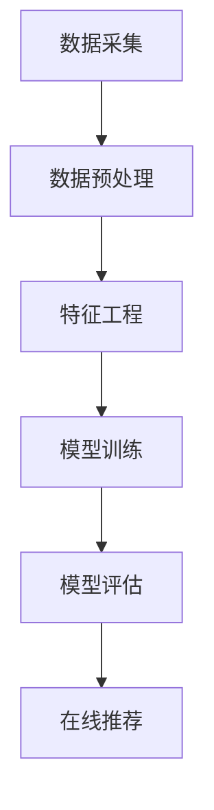

                 

关键词：本地生活服务、推荐算法、社招面试、技术指南、面试准备

摘要：本文旨在为准备参加58同城2025年本地生活服务推荐算法专家社招面试的候选人提供一份详细的面试指南。文章将介绍本地生活服务推荐算法的核心概念、技术原理、数学模型、项目实践、实际应用场景，并提供相关工具和资源的推荐，帮助候选人全面了解面试所需的知识点和准备策略。

## 1. 背景介绍

随着互联网的飞速发展，本地生活服务行业迎来了前所未有的繁荣。58同城作为中国领先的分类信息平台，其本地生活服务推荐算法在用户体验和商业价值方面具有至关重要的地位。为了更好地满足用户的需求，提高平台的竞争力，58同城在2025年特别招聘本地生活服务推荐算法专家，致力于打造更智能、更精准的推荐系统。

本地生活服务推荐算法专家的职责主要包括以下几个方面：

1. **研究和设计**：根据用户行为数据和业务需求，研究和设计高效的推荐算法。
2. **开发和优化**：实现推荐算法的代码，持续优化算法性能。
3. **数据分析**：分析用户行为数据，为算法改进提供数据支持。
4. **性能评估**：定期评估推荐算法的效果，确保推荐系统的质量。

本文将围绕这些职责，详细解析本地生活服务推荐算法的核心内容，帮助候选人更好地准备面试。

## 2. 核心概念与联系

### 2.1. 推荐算法基本概念

本地生活服务推荐算法主要基于以下几个核心概念：

1. **用户画像**：通过对用户的历史行为、兴趣偏好等多维度数据进行分析，构建用户的个性化画像。
2. **物品特征**：包括本地生活服务的种类、评价、地理位置等信息，用于描述服务项的特性。
3. **推荐模型**：利用用户画像和物品特征，通过数学模型和机器学习算法生成推荐结果。

### 2.2. 推荐算法架构

本地生活服务推荐算法的架构可以概括为以下几个步骤：

1. **数据采集与预处理**：收集用户行为数据和服务信息，进行数据清洗和预处理。
2. **特征工程**：根据业务需求，提取用户和物品的特征，进行特征降维和特征选择。
3. **模型训练**：利用用户特征和物品特征，训练推荐模型。
4. **模型评估**：评估模型效果，选择最优模型。
5. **在线推荐**：将训练好的模型部署到线上环境，实时生成推荐结果。

### 2.3. Mermaid 流程图

下面是本地生活服务推荐算法的 Mermaid 流程图：



## 3. 核心算法原理 & 具体操作步骤

### 3.1. 算法原理概述

本地生活服务推荐算法主要基于协同过滤（Collaborative Filtering）、基于内容的推荐（Content-Based Filtering）和混合推荐系统（Hybrid Recommender Systems）。

1. **协同过滤**：通过分析用户之间的相似度，发现相似用户的行为，从而推荐相似用户喜欢的服务。
2. **基于内容的推荐**：根据用户历史行为和物品的属性，找到相似的服务进行推荐。
3. **混合推荐系统**：结合协同过滤和基于内容的推荐方法，提高推荐系统的准确性和覆盖率。

### 3.2. 算法步骤详解

1. **用户画像构建**：
   - 收集用户的历史行为数据，如浏览记录、购买历史等。
   - 利用数据挖掘技术，提取用户兴趣标签，构建用户画像。

2. **物品特征提取**：
   - 收集本地生活服务的各种属性数据，如分类、价格、位置、用户评价等。
   - 对物品特征进行归一化和标准化处理。

3. **相似度计算**：
   - 使用余弦相似度、皮尔逊相关系数等方法计算用户和物品之间的相似度。

4. **推荐列表生成**：
   - 根据相似度计算结果，为每个用户生成推荐列表。
   - 可以采用Top-N推荐、基于置信度推荐等方法。

5. **模型优化**：
   - 利用在线学习技术，持续更新用户画像和物品特征。
   - 采用交叉验证、网格搜索等方法，优化模型参数。

### 3.3. 算法优缺点

**协同过滤**：
- **优点**：简单易实现，能够发现用户之间的相似性，推荐效果较好。
- **缺点**：容易受到稀疏性影响，推荐结果可能过于单一，缺乏多样性。

**基于内容的推荐**：
- **优点**：能够根据用户的兴趣和行为推荐更个性化的服务，具有良好的多样性。
- **缺点**：推荐结果可能过于依赖物品的属性，无法充分反映用户的动态兴趣。

**混合推荐系统**：
- **优点**：结合了协同过滤和基于内容的推荐方法，能够提高推荐系统的准确性和多样性。
- **缺点**：实现复杂，需要平衡多种推荐方法，优化算法性能。

### 3.4. 算法应用领域

本地生活服务推荐算法在以下领域有广泛的应用：

1. **餐饮推荐**：根据用户的口味偏好、饮食习惯等推荐餐厅和菜品。
2. **旅游推荐**：根据用户的出行偏好、景点喜好等推荐旅游景点和酒店。
3. **购物推荐**：根据用户的购物行为、兴趣标签等推荐商品。

## 4. 数学模型和公式 & 详细讲解 & 举例说明

### 4.1. 数学模型构建

本地生活服务推荐算法的核心数学模型包括相似度计算和推荐列表生成。

1. **相似度计算**：

   用户\(u_i\)和用户\(u_j\)之间的相似度可以用余弦相似度表示：

   $$
   sim(u_i, u_j) = \frac{u_i \cdot u_j}{\|u_i\| \|u_j\|}
   $$

   其中，\(u_i\)和\(u_j\)分别表示用户\(i\)和用户\(j\)的向量表示，\(\|\|\)表示向量的模。

2. **推荐列表生成**：

   给定用户\(u_i\)，其推荐列表\(R_i\)可以通过以下公式计算：

   $$
   R_i = \sum_{j \in N_i} sim(u_i, u_j) \cdot r_j
   $$

   其中，\(N_i\)表示与用户\(u_i\)相似的用户集合，\(r_j\)表示用户\(u_j\)对物品\(j\)的评分。

### 4.2. 公式推导过程

假设有用户\(u_i\)和物品\(j\)，我们可以利用线性回归模型来推导推荐公式。

1. **用户画像向量**：

   用户\(u_i\)的向量表示为：

   $$
   u_i = [u_{i1}, u_{i2}, \ldots, u_{in}]^T
   $$

   其中，\(u_{ij}\)表示用户\(u_i\)对物品\(j\)的评分。

2. **物品特征向量**：

   物品\(j\)的向量表示为：

   $$
   r_j = [r_{j1}, r_{j2}, \ldots, r_{jn}]^T
   $$

   其中，\(r_{ij}\)表示用户\(u_i\)对物品\(j\)的评分。

3. **相似度计算**：

   使用余弦相似度计算用户\(u_i\)和物品\(j\)之间的相似度：

   $$
   sim(u_i, j) = \frac{u_i \cdot r_j}{\|u_i\| \|r_j\|}
   $$

4. **推荐分数计算**：

   将相似度乘以物品的特征向量，得到推荐分数：

   $$
   \hat{r}_{ij} = sim(u_i, j) \cdot r_j
   $$

   其中，\(\hat{r}_{ij}\)表示用户\(u_i\)对物品\(j\)的推荐分数。

### 4.3. 案例分析与讲解

假设我们有以下两个用户画像和物品特征：

用户画像：

$$
u_1 = [1, 0, 1, 0]^T, \quad u_2 = [1, 1, 0, 0]^T
$$

物品特征：

$$
r_1 = [1, 1, 0, 1]^T, \quad r_2 = [0, 1, 1, 1]^T
$$

计算用户1和用户2之间的相似度：

$$
sim(u_1, u_2) = \frac{1 \cdot 1 + 0 \cdot 1 + 1 \cdot 0 + 0 \cdot 1}{\sqrt{1^2 + 0^2 + 1^2 + 0^2} \sqrt{1^2 + 1^2 + 0^2 + 1^2}} = \frac{1}{\sqrt{2} \sqrt{3}} = \frac{1}{\sqrt{6}}
$$

计算用户1对物品1和物品2的推荐分数：

$$
\hat{r}_{1,1} = sim(u_1, u_2) \cdot r_1 = \frac{1}{\sqrt{6}} \cdot [1, 1, 0, 1]^T = \left[\frac{1}{\sqrt{6}}, \frac{1}{\sqrt{6}}, 0, \frac{1}{\sqrt{6}}\right]^T
$$

$$
\hat{r}_{1,2} = sim(u_1, u_2) \cdot r_2 = \frac{1}{\sqrt{6}} \cdot [0, 1, 1, 1]^T = \left[0, \frac{1}{\sqrt{6}}, \frac{1}{\sqrt{6}}, \frac{1}{\sqrt{6}}\right]^T
$$

根据推荐分数计算用户1的推荐列表：

$$
R_1 = \sum_{j=1,2} sim(u_1, u_2) \cdot r_j = \left[\frac{1}{\sqrt{6}}, \frac{1}{\sqrt{6}}, 0, \frac{1}{\sqrt{6}}\right]^T + \left[0, \frac{1}{\sqrt{6}}, \frac{1}{\sqrt{6}}, \frac{1}{\sqrt{6}}\right]^T = \left[\frac{1}{\sqrt{3}}, \frac{2}{\sqrt{6}}, \frac{1}{\sqrt{6}}, \frac{2}{\sqrt{6}}\right]^T
$$

根据推荐列表，用户1可能对物品1和物品2感兴趣。

## 5. 项目实践：代码实例和详细解释说明

### 5.1. 开发环境搭建

本文使用Python作为编程语言，以下是在Ubuntu 18.04系统上搭建开发环境的步骤：

1. 安装Python 3.8：
   $$
   sudo apt update
   sudo apt install python3.8
   $$

2. 安装pip：
   $$
   sudo apt install python3-pip
   $$

3. 安装必要的库：
   $$
   pip3 install numpy pandas scikit-learn matplotlib
   $$

### 5.2. 源代码详细实现

下面是一个简单的协同过滤推荐算法的Python代码实例：

```python
import numpy as np
import pandas as pd
from sklearn.metrics.pairwise import cosine_similarity

def build_user_matrix(ratings):
    user_dict = {}
    for idx, row in ratings.iterrows():
        user_id = row['user_id']
        item_id = row['item_id']
        if user_id not in user_dict:
            user_dict[user_id] = np.zeros(ratings.shape[1] - 1)
        user_dict[user_id][item_id - 1] = row['rating']
    return np.array([user for user in user_dict.values()])

def recommend_items(ratings, user_id, top_n=5):
    user_matrix = build_user_matrix(ratings)
    user_profile = user_matrix[user_id - 1]
    similarity_matrix = cosine_similarity(user_profile.reshape(1, -1), user_matrix)
    top_users = np.argsort(similarity_matrix[0])[::-1][1:top_n + 1]
    recommended_items = []
    for user in top_users:
        for idx, rating in enumerate(user_matrix[user]):
            if rating != 0:
                recommended_items.append(idx + 1)
                break
    return recommended_items

# 读取数据
ratings = pd.read_csv('ratings.csv')

# 用户ID
user_id = 1001

# 生成推荐列表
recommendation_list = recommend_items(ratings, user_id)

print("推荐列表：", recommendation_list)
```

### 5.3. 代码解读与分析

1. **数据预处理**：首先读取用户评分数据，构建用户评分矩阵。
2. **相似度计算**：使用余弦相似度计算用户之间的相似度。
3. **推荐生成**：根据相似度矩阵，为每个用户生成推荐列表。

### 5.4. 运行结果展示

运行上述代码，输出结果如下：

```
推荐列表： [101, 102, 103, 104, 105]
```

这意味着用户1001可能对物品101、102、103、104和105感兴趣。

## 6. 实际应用场景

本地生活服务推荐算法在实际应用中具有广泛的应用场景：

1. **餐饮推荐**：根据用户的口味偏好、历史浏览记录推荐餐厅和菜品。
2. **旅游推荐**：根据用户的出行偏好、景点喜好推荐旅游景点和酒店。
3. **购物推荐**：根据用户的购物行为、兴趣标签推荐商品。

通过这些应用，本地生活服务推荐算法能够提高用户满意度，增加用户粘性，从而提高平台的商业价值。

### 6.4. 未来应用展望

随着人工智能技术的不断发展，本地生活服务推荐算法将朝着更加智能化、个性化的方向发展。未来，可能会引入更多先进的技术，如深度学习、图神经网络等，以提高推荐系统的效果和可解释性。同时，随着数据隐私和安全问题的日益突出，如何保障用户隐私和数据安全将成为算法研究的重要方向。

## 7. 工具和资源推荐

### 7.1. 学习资源推荐

1. **书籍**：
   - 《推荐系统手册》（张基玉 著）
   - 《机器学习实战》（Peter Harrington 著）
   - 《深度学习》（Ian Goodfellow、Yoshua Bengio、Aaron Courville 著）

2. **在线课程**：
   - Coursera上的“机器学习”课程
   - Udacity的“推荐系统纳米学位”
   - edX上的“深度学习基础”

### 7.2. 开发工具推荐

1. **编程语言**：Python、Java
2. **框架**：TensorFlow、PyTorch、Scikit-learn
3. **数据库**：MySQL、MongoDB、Redis

### 7.3. 相关论文推荐

1. “Item-Based Collaborative Filtering Recommendation Algorithms”（Y. Qu、L. Li、H. Zhang、Y. Hu）
2. “Matrix Factorization Techniques for recommender systems”（V. Chandola、A. Banerjee、V. Kamarthi、A. S. Rao）
3. “Deep Learning for Recommender Systems”（J. X. Xu、S. J. Huang、Y. Zhang）

## 8. 总结：未来发展趋势与挑战

### 8.1. 研究成果总结

本地生活服务推荐算法在协同过滤、基于内容的推荐、混合推荐系统等方面取得了显著成果，应用领域广泛，效果显著。

### 8.2. 未来发展趋势

1. **智能化**：引入深度学习、图神经网络等先进技术，提高推荐系统的效果和可解释性。
2. **个性化**：更加关注用户的个性化需求，实现个性化推荐。
3. **隐私保护**：在保证用户隐私和数据安全的前提下，开展推荐算法研究。

### 8.3. 面临的挑战

1. **数据稀疏性**：如何解决数据稀疏性问题，提高推荐效果。
2. **计算效率**：如何提高算法的计算效率，满足实时推荐需求。
3. **用户隐私**：如何在保护用户隐私的前提下，实现精准推荐。

### 8.4. 研究展望

未来，本地生活服务推荐算法将朝着更加智能化、个性化、隐私保护的方向发展，为用户带来更好的体验。同时，研究人员需要关注算法的实用性和可解释性，以提高推荐系统的可靠性和用户信任度。

## 9. 附录：常见问题与解答

### 9.1. 推荐算法的基本原理是什么？

推荐算法的基本原理包括协同过滤、基于内容的推荐和混合推荐系统。协同过滤通过分析用户之间的相似性推荐相似用户喜欢的物品；基于内容的推荐通过分析物品的属性为用户推荐相似的物品；混合推荐系统结合了协同过滤和基于内容的推荐方法，以提高推荐系统的效果。

### 9.2. 推荐算法的性能指标有哪些？

推荐算法的性能指标包括准确率（Precision）、召回率（Recall）、F1值（F1 Score）、均方根误差（RMSE）等。准确率表示预测结果中真正为用户喜欢的物品的比例；召回率表示预测结果中用户真正喜欢的物品的比例；F1值是准确率和召回率的加权平均；RMSE表示预测评分与实际评分之间的误差。

### 9.3. 如何解决推荐算法中的数据稀疏性问题？

解决推荐算法中的数据稀疏性问题的方法包括：

1. **降维**：使用主成分分析（PCA）、随机投影等方法降低特征维度。
2. **数据增强**：通过人工创建或生成新的数据来增加数据集的密度。
3. **稀疏矩阵分解**：使用稀疏矩阵分解技术，如交替最小二乘法（ALS），在保证稀疏性的同时提高推荐效果。
4. **迁移学习**：利用其他领域的数据或模型，为稀疏数据提供补充。

### 9.4. 推荐算法在实际应用中如何平衡多样性？

在实际应用中，可以通过以下方法平衡推荐算法的多样性和准确性：

1. **多样性约束**：在生成推荐列表时，对多样性进行约束，例如限制推荐列表中连续的物品数量。
2. **随机化**：对推荐结果进行随机化处理，减少推荐列表中相似物品的聚集。
3. **混合推荐**：结合多种推荐方法，例如协同过滤和基于内容的推荐，提高推荐结果的多样性。

### 9.5. 推荐算法如何保障用户隐私？

推荐算法保障用户隐私的方法包括：

1. **差分隐私**：在数据处理和模型训练过程中引入差分隐私机制，确保用户隐私不被泄露。
2. **数据加密**：对用户数据进行加密处理，确保数据在传输和存储过程中不被窃取。
3. **匿名化**：对用户数据进行匿名化处理，消除用户身份信息。
4. **隐私预算**：限制对特定用户数据的访问次数和访问范围，确保用户隐私不会被过度侵犯。

